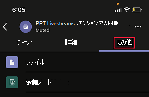

# 会議アプリ拡張性Meeting app extensibility

Teamsの会議アプリの機能拡張は、次の概念に基づいて行います。Teams’ meeting app extensibility is based on the following concepts:

* 会議のライフサイクルには、会議前、会議中、会議後など、さまざまなステージがあります。Meeting lifecycle has different stages such as pre-meeting, in-meeting, and post-meeting.  
* 会議には、開催者、発表者、出席者の 3 つの異なる参加者の役割があります。There are three distinct participant roles in a meeting: organizer, presenter, and attendee. 詳細については、「会議での[役割」をTeamsしてください](https://support.microsoft.com/office/roles-in-a-teams-meeting-c16fa7d0-1666-4dde-8686-0a0bfe16e019)。For more information, see [roles in a Teams meeting](https://support.microsoft.com/office/roles-in-a-teams-meeting-c16fa7d0-1666-4dde-8686-0a0bfe16e019).  
* 会議には、[テナント内、](/microsoftteams/non-standard-users#:~:text=An%20anonymous%20user%20is%20a,their%20Microsoft%20or%20organization's%20account.)ゲストユーザー、フェデレーション ユーザー、匿名ユーザーなど[、さまざまな](/microsoftteams/manage-external-access)ユーザーの種類があります。There are various [user types](/microsoftteams/non-standard-users#:~:text=An%20anonymous%20user%20is%20a,their%20Microsoft%20or%20organization's%20account.) in a meeting: in-tenant, [guest](/microsoftteams/guest-access), [federated](/microsoftteams/manage-external-access), and anonymous users.

この記事では、会議のライフサイクルと、タブ、ボット、メッセージング拡張機能を会議に統合する方法について説明します。This article covers information about meeting lifecycle and how to integrate tabs, bots, and messaging extensions in the meeting. タスクを実行するためのさまざまな参加者の役割とさまざまなユーザーの種類を識別するための情報を提供します。It provides information to identify different participant roles and different user types to perform tasks.

## 会議のライフサイクルMeeting lifecycle

会議のライフサイクルは、会議前、会議中、会議後のアプリ エクスペリエンスで構成されます。Meeting lifecycle consists of pre-meeting, in-meeting, and post-meeting app experience. 会議のライフサイクルの各段階で、タブ、ボット、メッセージング拡張機能を統合できます。You can integrate tabs, bots, and messaging extensions in each stage of the meeting lifecycle.

### タブを会議のライフサイクルに統合するIntegrate tabs into the meeting lifecycle

タブを使用すると、チーム メンバーは会議内の特定の領域内のサービスとコンテンツにアクセスできます。Tabs allow team members to access services and content in a specific space within a meeting. チームはタブを直接処理し、タブ内で使用可能なツールとデータに関する会話を行います。The team works directly with tabs and has conversations about the tools and data available within tabs. 会議Teams、ユーザーはタブを追加するには、In Teams meeting, users can add a tab by selecting をクリックし、インストールするアプリを選択します。, and choosing the app that they want to install.

> [!IMPORTANT]
> タブを会議に統合している場合、アプリはタブのシングル サインオン (SSO) 認証フロー Teamsに従[う必要があります](../tabs/how-to/authentication/auth-aad-sso.md)。If you have integrated a tab with your meeting, then your app must follow the Teams [single sign-on (SSO) authentication flow for tabs](../tabs/how-to/authentication/auth-aad-sso.md).

> [!NOTE]
> アプリは、プライベートスケジュールされた会議でのみサポートされます。Apps are supported in private scheduled meetings only.

#### 会議前アプリのエクスペリエンスPre-meeting app experience

会議前アプリエクスペリエンスを使用すると、会議アプリを検索して追加し、アンケート会議参加者への投票の開発など、会議前のタスクを実行できます。With the pre-meeting app experience, you can find and add meeting apps and perform pre-meeting tasks, such as developing a poll to survey meeting participants.

**既存の会議にタブを追加するには****To add tabs to an existing meeting**

1. 予定表で、タブを追加する会議を選択します。In your calendar, select a meeting to which you want to add a tab.
1. [詳細] **タブを選択** し、[Select the **Details** tab and select .. タブ ギャラリーが表示されます。The tab gallery appears.

    

1. タブ ギャラリーで、追加するアプリを選択し、必要に応じて手順に従います。In the tab gallery, select the app that you want to add and follow the steps as required. アプリはタブとしてインストールされます。The app is installed as a tab.

    > [!NOTE]
    > * 既存の会議の [会議チャット] タブ **を使用して** タブを追加することもできます。You can also add a tab using the meeting **Chat** tab in an existing meeting.
    > * 10 件を超えるポーリングまたはアンケートがある場合、タブ レイアウトは整理された状態である必要があります。Tab layout must be in an organized state, if there are more than ten polls or surveys.

# [デスクトップDesktop](#tab/desktop)

# [モバイルMobile](#tab/mobile)

デスクトップまたは Web 上の既存の会議にタブを追加すると、会議の詳細の [その他] セクションにある会議前のエクスペリエンスで同じアプリを確認できます。After the tabs are added to an existing meeting on desktop or web, you can see the same apps in pre-meeting experience under **More** section of the meeting details.

  

---

#### 会議中のアプリ エクスペリエンスIn-meeting app experience

会議中のアプリ エクスペリエンスを使用すると、アプリと会議内ダイアログ ボックスを使用して、会議中に参加者を参加できます。With the in-meeting app experience, you can engage participants during the meeting by using apps and the in-meeting dialog box. 会議アプリは、会議ウィンドウの上部バーで会議内タブとしてホストされます。会議の参加者に対してアクション可能なコンテンツを紹介するには、会議内ダイアログ ボックスを使用します。Meeting apps are hosted in the top upper bar of the meeting window as an in-meeting tab. Use the in-meeting dialog box to showcase actionable content for meeting participants. 詳細については、「会議のアプリを[作成する」をTeamsしてください](create-apps-for-teams-meetings.md)。For more information, see [create apps for Teams meetings](create-apps-for-teams-meetings.md).

モバイルの場合、会議アプリは、会議内>省略 &#x25CF;&#x25CF;&#x25CF; アプリから利用できます。For mobile, meeting apps are available from **Apps** > ellipses &#x25CF;&#x25CF;&#x25CF; in the meeting. [アプリ **] を** 選択して、会議で利用可能なすべてのアプリを表示します。Select **Apps** to view all the apps available in the meeting.

**会議中にタブを使用するには****To use tabs during a meeting**

1. [次へ] Teams。Go to Teams.
1. 予定表で、タブを使用する会議を選択します。In your calendar, select a meeting where you want to use a tab.
1. 会議に入った後、チャット ウィンドウの上部バーから、必要なアプリを選択します。After entering the meeting, from the top upper bar of the chat window, select the required app.
    アプリは、サイド パネルTeams会議内の会議に表示されます。An app is visible in a Teams meeting in the side panel or the in-meeting dialog box.
1. [会議内] ダイアログ ボックスで、フィードバックとして応答を入力します。In the in-meeting dialog box, enter your response as a feedback.

# [デスクトップDesktop](#tab/desktop)

# [モバイルMobile](#tab/mobile)

会議に参加し、デスクトップまたは Web からアプリを追加すると、アプリはモバイル 会議Teams [アプリ] セクションに **表示** されます。After entering the meeting and adding the app from desktop or web, the app is visible in mobile Teams meeting under the **Apps** section. [アプリ **] を** 選択してアプリの一覧を表示します。Select **Apps** to show the list of apps. ユーザーは、任意のアプリをアプリの会議内サイド パネルとして起動できます。User can launch any of the apps as an in-meeting side panel of the app.

[会議内] ダイアログ ボックスが表示され、フィードバックとして応答を入力できます。The in-meeting dialog box is displayed where you can enter your response as a feedback.

> [!NOTE]
> アプリがモバイルで動作するには、アプリ マニフェストを変更する必要があります。You need not change the app manifest for the apps to work on mobile.

---

> [!NOTE]
> * アプリは、クライアント SDK Teamsを利用して、 にアクセスし、エクスペリエンス `meetingId` `userMri` `frameContext` を適切にレンダリングできます。Apps can leverage the Teams Client SDK to access the `meetingId`, `userMri`, and `frameContext` to render the experience appropriately.
> * 会議中のダイアログ ボックスが正常にレンダリングされると、結果が正常にダウンロードされたことを通知します。If the in-meeting dialog box is rendered successfully, you will get a notification that the results are successfully downloaded.
> * アプリ マニフェストは、表示する場所を指定します。Your app manifest specifies the places that you want them to appear. コンテキスト フィールドは、この目的のために使用されます。The context field is used for this purpose. また、指定された設計ガイドラインに従って、共有トレイ エクスペリエンスの一部です。It is also the part of a share-tray experience, subject to specified design guidelines.

次の図は、会議中のサイド パネルを示しています。The following image illustrates the in-meeting side panel:

次の表に、アプリが承認され、承認されていない場合のアプリの動作を示します。The following table describes the behavior of app when it is approved and not approved:

|アプリの機能App capability | アプリが承認されているApp is approved | アプリが承認されていないApp is not approved |
|---|---|---|
| 会議の機能拡張Meeting extensibility | アプリは会議に表示されます。The app will appear in meetings. | アプリは、モバイル クライアントの会議には表示されません。The app will not appear in meetings for the mobile clients. |

#### 会議後のアプリ エクスペリエンスPost-meeting app experience

会議後のアプリ エクスペリエンスを使用すると、アンケートのアンケート結果やフィードバックなど、会議の結果を表示できます。With post-meeting app experience, you can view the results of the meeting, such as poll survey results or feedback. SelectSelect  をクリックしてタブを追加し、会議メモを取得し、開催者と出席者がアクションを実行する必要がある結果を取得します。to add a tab, get meeting notes, and results on which organizers and attendees must take action.

次の図は **、[Contoso]** タブを表示し、会議の出席者から受け取ったポーリングとフィードバックの結果を示します。The following image displays the **Contoso** tab with results of poll and feedback received from meeting attendees:

# [デスクトップDesktop](#tab/desktop)

# [モバイルMobile](#tab/mobile)

---

> [!NOTE]
> 10 件を超えるポーリングまたはアンケートがある場合は、タブ レイアウトを整理する必要があります。Tab layout must be organized when there are more than 10 polls or surveys.

### ボットを会議のライフサイクルに統合するIntegrate bots into the meeting lifecycle

グループチャット スコープで有効になっているボットは、会議で機能し始める。Bots enabled in groupchat scope start functioning in meetings. ボットを実装するには、ボットのビルド[から始](../build-your-first-app/build-bot.md)め、次に、会議のアプリを作成[Teamsします](../apps-in-teams-meetings/create-apps-for-teams-meetings.md#meeting-apps-api-references)。To implement bots, start with [build a bot](../build-your-first-app/build-bot.md) and then continue with [create apps for Teams meetings](../apps-in-teams-meetings/create-apps-for-teams-meetings.md#meeting-apps-api-references).

### メッセージング拡張機能を会議のライフサイクルに統合するIntegrate messaging extensions into the meeting lifecycle

メッセージング拡張機能を実装するには、まずメッセージング拡張機能を作成してから、会議用アプリの作成[Teamsします](../apps-in-teams-meetings/create-apps-for-teams-meetings.md#meeting-apps-api-references)。To implement messaging extensions, start with [build a messaging extension](../messaging-extensions/how-to/create-messaging-extension.md) and then continue with [create apps for Teams meetings](../apps-in-teams-meetings/create-apps-for-teams-meetings.md#meeting-apps-api-references).

会議Teams機能拡張により、会議の参加者の役割に基づいてアプリを設計できます。The Teams meeting app extensibility allows you to design your app based on participant roles in a meeting.

## 会議の参加者の役割Participant roles in a meeting

既定の参加者設定は、組織の IT 管理者によって決まります。Default participant settings are determined by an organization's IT administrator. 会議の参加者の役割を次に示します。The following are the participant roles in a meeting:

* **開催** 者 : 開催者は会議をスケジュールし、会議のオプションを設定し、会議の役割を割り当て、会議を開始します。**Organizer**: The organizer schedules a meeting, sets the meeting options, assigns meeting roles, and starts the meeting. M365 アカウントとユーザー ライセンスを持Teams、参加者のアクセス許可を制御できます。Only users with M365 account and Teams license can be organizers, and control attendee permissions. 会議の開催者は、特定の会議の設定を変更できます。A meeting organizer can change the settings for a specific meeting. 開催者は、[会議のオプション] Web ページ **でこれらの変更を** 行えます。Organizers can make these changes on the **Meeting options** web page.
* **発表者**: 発表者は、除外を含む開催者と同じ機能を持っています。**Presenter**: Presenters have same capabilities of organizers with exclusions. 発表者は、セッションから開催者を削除したり、セッションの会議オプションを変更したりすることはできません。A presenter cannot remove an organizer from the session or modify meeting options for the session. 既定では、会議に参加する参加者には発表者の役割があります。By default, participants joining a meeting have the presenter role.
* **出席者**: 出席者とは、会議に出席するために招待されたが、発表者として機能する権限を持たされていないユーザーです。**Attendee**: An attendee is a user who has been invited to attend a meeting but is not authorized to act as a presenter. 出席者は他の会議メンバーとやり取りできますが、会議の設定を管理したり、コンテンツを共有したりすることはできません。Attendees can interact with other meeting members but cannot manage any of the meeting settings or share content.

> [!NOTE]
> アプリを追加、削除、またはアンインストールできるのは、開催者または発表者のみです。Only an organizer or presenter can add, remove, or uninstall apps.

詳細については、「会議での[役割」をTeamsしてください](https://support.microsoft.com/office/roles-in-a-teams-meeting-c16fa7d0-1666-4dde-8686-0a0bfe16e019)。For more information, see [roles in a Teams meeting](https://support.microsoft.com/office/roles-in-a-teams-meeting-c16fa7d0-1666-4dde-8686-0a0bfe16e019).

会議の参加者の役割に基づいてアプリを設計した後、会議の各ユーザーの種類を特定し、アクセスできるユーザーを選択できます。After you design your app based on participant roles in a meeting, you can identify each user type for meetings and select what they can access.

## 会議内のユーザーの種類User types in a meeting

> [!NOTE]
> ユーザーの種類は **getParticipantRole** API には含まれません。The user type is not included in the **getParticipantRole** API.

会議の開催者、発表者、出席者などのユーザーの種類は、会議で参加者の役割の 1 [つを実行できます](#participant-roles-in-a-meeting)。User types, such as, organizer, presenter, or attendee in a meeting can perform one of the [participant roles in a meeting](#participant-roles-in-a-meeting).

次の一覧では、アクセシビリティとパフォーマンスに加え、さまざまなユーザーの種類について説明します。The following list details the different user types along with their accessibility and performance:

* **テナント内 :** テナント内ユーザーは組織に属し、テナントの Azure Active Directory (AAD) に資格情報を持ちます。**In-tenant**: In-tenant users belong to the organization and have credentials in Azure Active Directory (AAD) for the tenant. 通常、フルタイム、オンサイト、またはリモートの従業員です。They are usually full-time, onsite, or remote employees. テナント内のユーザーには、開催者、発表者、または出席者を指定できます。An in-tenant user can be an organizer, presenter, or attendee.
* **ゲスト**: ゲストは、組織のテナント内の他のリソースTeamsにアクセスするために招待された別の組織の参加者です。**Guest**: A guest is a participant from another organization invited to access Teams or other resources in the organization's tenant. ゲストは組織の AAD に追加され、チーム チャット、会議、ファイルTeamsアクセスできるネイティブ チーム メンバーと同じ機能を持ちます。Guests are added to the organization’s AAD and have same Teams capabilities as a native team member with access to team chats, meetings, and files. ゲスト ユーザーには、開催者、発表者、または出席者を指定できます。A guest user can be an organizer, presenter, or attendee. 詳細については、「ゲスト アクセス[」を参照Teams。](/microsoftteams/guest-access)For more information, see [guest access in Teams](/microsoftteams/guest-access).
* **フェデレーションまたは外部**: フェデレーション ユーザーは、会議への参加をTeams組織の外部ユーザーです。**Federated or external**: A federated user is an external Teams user in another organization who has been invited to join a meeting. フェデレーション ユーザーは、フェデレーション パートナーと有効な資格情報を持ち、Teams。Federated users have valid credentials with federated partners and are authorized by Teams. 組織からチームや他の共有リソースにアクセスできない。They do not have access to your teams or other shared resources from your organization. ゲスト アクセスは、外部ユーザーがチームとチャネルにアクセスできる優れたオプションです。Guest access is a better option for external users to have access to teams and channels. 詳細については、「外部アクセスの[管理」を参照Teams。](/microsoftteams/manage-external-access)For more information, see [manage external access in Teams](/microsoftteams/manage-external-access).

    > [!NOTE]
    > ユーザー Teams、他の組織との会議やチャットをホストするときにアプリを追加できます。Your Teams users can add apps when they host meetings or chats with other organizations. ユーザーは、ユーザーが他の組織がホストする会議やチャットに参加するときに、外部ユーザーが共有するアプリを使用できます。The users can use apps shared by external users when your users join meetings or chats hosted by other organizations. ホスティング ユーザーの組織のデータ ポリシーと、そのユーザーの組織が共有するサード パーティ製アプリのデータ共有プラクティスが有効になります。The data policies of the hosting user's organization, as well as the data sharing practices of the third-party apps shared by that user's organization, will be in effect.

* **匿名**: 匿名ユーザーは AAD ID を持ち、テナントとフェデレーションされません。**Anonymous**: Anonymous users do not have an AAD identity and are not federated with a tenant. 匿名の参加者は外部ユーザーと同じですが、その ID は会議に投影されません。The anonymous participants are like external users, but their identity is not projected in the meeting. 匿名ユーザーは、会議ウィンドウでアプリにアクセスできない。Anonymous users are not able to access apps in a meeting window. 匿名ユーザーを開催者にすることはできませんが、発表者または出席者を指定できます。An anonymous user cannot be an organizer but can be a presenter or attendee.

    > [!NOTE]
    > 匿名ユーザーは、グローバル既定のユーザー レベルのアプリアクセス許可ポリシーを継承します。Anonymous users inherit the global default user-level app permission policy. 詳細については、「アプリの管理 [」を参照してください](/microsoftteams/non-standard-users#anonymous-user-in-meetings-access)。For more information, see [manage Apps](/microsoftteams/non-standard-users#anonymous-user-in-meetings-access).

ゲストまたは匿名ユーザーは、アプリを追加、削除、アンインストールできません。A guest or anonymous user cannot add, remove, or uninstall apps.

次の表に、ユーザーの種類と、各ユーザーがアクセスできる機能を示します。The following table provides the user types and what features each user can access:

| ユーザーの種類User type | タブTabs | ボットBots | メッセージング拡張機能Messaging extensions | アダプティブ カードAdaptive Cards | タスク モジュールTask modules | 会議中ダイアログIn-meeting dialog |
| :-- | :-- | :-- | :-- | :-- | :-- | :-- |
| 匿名ユーザーAnonymous user | 使用不可Not available | 使用不可Not available | 使用不可Not available | 会議チャットでの操作は許可されます。Interactions in the meeting chat are allowed. | アダプティブ カードからの会議チャットでの操作は許可されます。Interactions in the meeting chat from an Adaptive Card are allowed. | 利用不可Not available |
| テナント AAD の一部であるゲストGuest that is part of the tenant AAD | 対話は許可されます。Interaction is allowed. 作成、更新、削除は許可されません。Creating, updating, and deleting are not allowed. | 使用不可Not available | 使用不可Not available | 会議チャットでの操作は許可されます。Interactions in the meeting chat are allowed. | アダプティブ カードからの会議チャットでの操作は許可されます。Interactions in the meeting chat from an Adaptive Card are allowed. | AvailableAvailable |
| フェデレーション ユーザー。Federated user. 詳細については、「標準以外の [ユーザー」を参照してください](/microsoftteams/non-standard-users)。For more information, see [non-standard users](/microsoftteams/non-standard-users). | 対話は許可されます。Interaction is allowed. 作成、更新、削除は許可されません。Creating, updating, and deleting are not allowed. | 対話は許可されます。Interaction is allowed. 取得、更新、および削除は許可されません。Acquiring, updating, and deleting are not allowed. | 利用不可Not available | 会議チャットでの操作は許可されます。Interactions in the meeting chat are allowed. | アダプティブ カードからの会議チャットでの操作は許可されます。Interactions in the meeting chat from an Adaptive Card are allowed. | 利用不可Not available |

## 関連項目See also

* [TabTab](../tabs/what-are-tabs.md#understand-how-tabs-work)
* [BotBot](../bots/what-are-bots.md)
* [メッセージング拡張機能Messaging extension](../messaging-extensions/what-are-messaging-extensions.md)
* [アプリをデザインするDesign your app](../apps-in-teams-meetings/design/designing-apps-in-meetings.md)

## 次の手順Next step

> [!div class="nextstepaction"]
> [Teams 会議アプリへの前提条件と API リファレンスPrerequisites and API references for apps in Teams meetings](create-apps-for-teams-meetings.md)