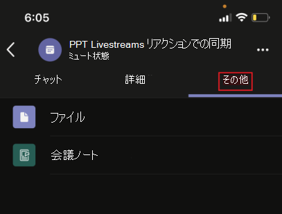
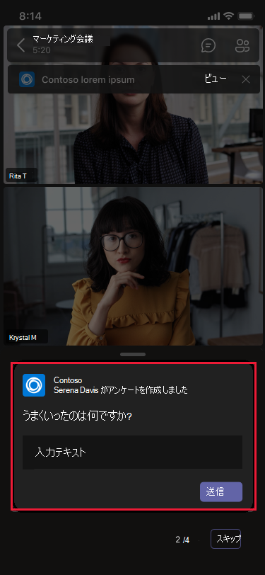
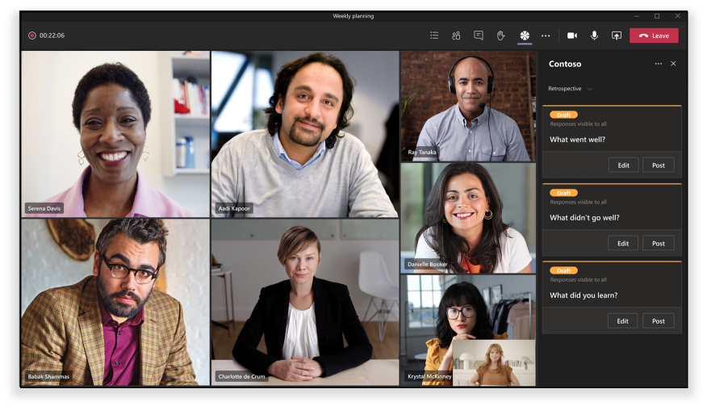
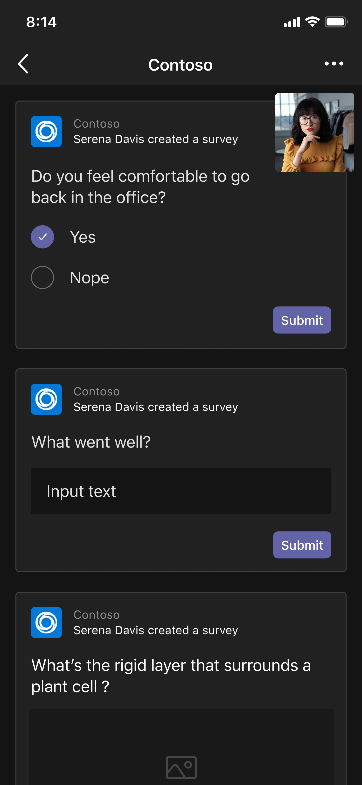

# 統合された会議アプリ

Teams統合会議アプリは、次の概念に基づいています。

* 会議のライフサイクルには、会議前、会議中、会議後の異なる段階があります。  
* 会議では、開催者、発表者、出席者の 3 つの異なる参加者の役割があります。 詳細については、[Teams会議のロールを](https://support.microsoft.com/office/roles-in-a-teams-meeting-c16fa7d0-1666-4dde-8686-0a0bfe16e019)参照してください。  
* 会議には、[テナント内、](/microsoftteams/non-standard-users#:~:text=An%20anonymous%20user%20is%20a,their%20Microsoft%20or%20organization's%20account.)[ゲスト](/microsoftteams/guest-access)、フェデレーション、匿名ユーザーなど、さまざまな種類[の](/microsoftteams/manage-external-access)ユーザーがあります。

この記事では、会議のライフサイクルに関する情報と、タブ、ボット、メッセージング拡張機能を統合する方法について説明します。 さまざまな参加者ロールとユーザーの種類を識別します。

## 会議のライフサイクル

会議のライフサイクルは、会議前、会議中、会議後のアプリ エクスペリエンスで構成されます。 会議のライフサイクルの各段階で、タブ、ボット、メッセージング拡張機能を統合できます。

> [!NOTE]
> ボット、カード、メッセージ拡張機能、メッセージ アクションなどの会議拡張機能は、Web クライアントでサポートされています。 ただし、現在、タブ、コンテンツ バブル、ステージへの共有などのホストされたエクスペリエンスは完全にはサポートされていません。

### 会議のライフサイクルにタブを統合する

タブを使用すると、チームのメンバーは会議内の特定のスペースでサービスとコンテンツにアクセスできます。 チームは、タブを直接操作し、タブの中で使用できるツールとデータに関する会話を行います。 Teams会議で、タブを追加するには、 をクリックし、インストールするアプリを選択します。

> [!IMPORTANT]
> 会議にタブを統合した場合、アプリはタブの[シングル サインオン (SSO) 認証フロー](../tabs/how-to/authentication/auth-aad-sso.md) Teams従う必要があります。

> [!NOTE]
>
> * プライベートスケジュールされた会議では、アプリのみがサポートされます。
> * 会議拡張機能タブ アプリTeamsアプリの追加オプションは、Teams Web クライアントではサポートされていません。

#### 会議前のアプリ エクスペリエンス

会議前のアプリ エクスペリエンスでは、会議アプリを検索して追加できます。 会議の参加者にアンケートを取るための投票機能の開発など、会議前のタスクを行うこともできます。

既存の会議にタブを追加するには:

1. 予定表で、タブを追加する会議を選択します。
1. [ **詳細** ] タブを選択し、 . タブ ギャラリーが表示されます。

    :::image type="content" source="~/assets/images/apps-in-meetings/Pre-Meeting-002.png" alt-text="会議前のアプリ エクスペリエンス":::

1. タブ ギャラリーで、追加するアプリを選択し、必要に応じて手順に従います。 アプリはタブとしてインストールされます。

   > [!NOTE]
   >
   > * 会議 **チャット** タブを使用して、既存の会議にタブを追加することもできます。
   > * 投票またはアンケートが 10 件を超える場合、タブ レイアウトは整理された状態である必要があります。

# [デスクトップ](#tab/desktop)

:::image type="content" source="~/assets/images/apps-in-meetings/PreMeetingTab.png" alt-text="会議中のタブ":::

# [モバイル](#tab/mobile)

モバイルで既存の会議にタブを追加した後、会議の詳細の **[その他** ] セクションで、会議前のエクスペリエンスで同じアプリを表示できます。

  

---

#### 会議中のアプリ エクスペリエンス

会議中のアプリ エクスペリエンスを使用すると、アプリと会議内ダイアログ ボックスを使用して、会議中に参加者とのやり取りを行うことができます。 会議アプリは、会議ウィンドウのツール バーに会議中タブとしてホストされます。会議中のダイアログ ボックスを使用して、会議の参加者に実用的なコンテンツを紹介できます。 詳細については、「[Teams会議用にアプリを有効にして構成する](enable-and-configure-your-app-for-teams-meetings.md)」を参照してください。

モバイルの場合、会議アプリは **、会議** で &#x25CF;&#x25CF;&#x25CF; アプリ>省略記号から利用できます。 [ **アプリ] を** 選択して、会議で使用可能なすべてのアプリを表示します。

会議中にタブを使用するには:

1. Teamsに移動します。
1. 予定表で、タブを使用する会議を選択します。
1. 会議に入った後、チャット ウィンドウのツール バーから、必要なアプリを選択します。
    アプリは、サイド パネルまたは会議内ダイアログ ボックスのTeams会議に表示されます。
1. 会議中ダイアログ ボックスで、フィードバックとして応答を入力します。

# [デスクトップ](#tab/desktop)

:::image type="content" source="~/assets/images/apps-in-meetings/desktop-in-meeting-dialog-view.png" alt-text="デスクトップ ビュー":::

# [モバイル](#tab/mobile)

会議に参加し、デスクトップまたは Web からアプリを追加すると、アプリはモバイル Teams会議の [**アプリ**] セクションに表示されます。 [ **アプリ] を** 選択して、アプリの一覧を表示します。 ユーザーは、アプリの会議内サイド パネルとして任意のアプリを起動できます。

会議中ダイアログ ボックスが表示され、フィードバックとして応答を入力できます。

> [!NOTE]
> アプリがモバイルで動作するようにアプリ マニフェストを変更する必要はありません。

---

> [!NOTE]
>
> * アプリは、Teams クライアント SDK を利用して、`userMri`エクスペリエンスに`meetingId`アクセスし`frameContext`、エクスペリエンスを適切にレンダリングできます。
> * 会議中ダイアログ ボックスが正常に表示された場合は、結果が正常にダウンロードされたことを示す通知が送信されます。
> * アプリ マニフェストは、アプリを表示する場所を指定します。 これを行うには、マニフェストでコンテキスト フィールドを指定します。 また、指定された [設計ガイドライン](~\apps-in-teams-meetings\design\designing-apps-in-meetings.md)に従って、共有会議ステージエクスペリエンスの一部でもあります。
> * 会議ステージは、匿名ユーザーとTeams Web クライアントではサポートされていません。

次の図は、会議中のサイド パネルを示しています。

# [デスクトップ](#tab/desktop)

# [モバイル](#tab/mobile)

---

次の表では、アプリが検証され、検証されていない場合のアプリの動作について説明します。

|アプリ機能 | アプリが検証される | アプリが検証されない |
|---|---|---|
| 会議の拡張性 | アプリは会議に表示されます。 | アプリは、モバイル クライアントの会議には表示されません。 |

詳細については、 [ストアの検証ガイドラインに関するページを](../concepts/deploy-and-publish/appsource/prepare/teams-store-validation-guidelines.md)参照してください。

#### 会議後のアプリエクスペリエンス

会議後のアプリ エクスペリエンスでは、アンケートの結果やフィードバックなど、会議の結果を表示できます。 選択  タブを追加し、会議のメモを取得し、開催者と出席者がアクションを実行する必要がある結果を確認します。

次の図は、[ **Contoso** ] タブを表示し、会議出席者から受け取った投票とフィードバックの結果を示しています。

# [デスクトップ](#tab/desktop)

:::image type="content" source="~/assets/images/apps-in-meetings/post.png" alt-text="結果が表示された [Contoso] タブ":::

# [モバイル](#tab/mobile)

:::image type="content" source="~/assets/images/apps-in-meetings/mobilepremeeting.png" alt-text="会議アプリの投稿エクスペリエンス":::

---

> [!NOTE]
> 10 を超える投票またはアンケートがある場合は、タブ レイアウトを整理する必要があります。

### 会議のライフサイクルにボットを統合する

グループ チャット スコープで有効になっているボットは、会議で機能し始めます。 ボットを実装するには、まず[ボットをビルド](../build-your-first-app/build-bot.md)してから、[Teams会議用のアプリの作成](../apps-in-teams-meetings/API-references.md#meeting-apps-api-references)を続行します。

### メッセージング拡張機能を会議のライフサイクルに統合する

メッセージング拡張機能を実装するには、まず[メッセージング拡張機能をビルド](../messaging-extensions/how-to/create-messaging-extension.md)してから、[Teams会議用のアプリの作成](../apps-in-teams-meetings/API-references.md#meeting-apps-api-references)に進みます。

Teams統合会議アプリを使用すると、会議の参加者ロールに基づいてアプリを設計できます。

## 会議の参加者ロール

:::image type="content" source="~/assets/images/apps-in-meetings/participant-roles.png" alt-text="会議の参加者ロール":::

既定の参加者設定は、組織の IT 管理者によって決まります。 会議の参加者ロールを次に示します。

* **開催者**: 開催者は会議をスケジュールし、会議オプションを設定し、会議の役割を割り当て、会議を開始します。 Microsoft 365 アカウントとTeams ライセンスを持つユーザーは、開催者のみとなり、出席者のアクセス許可を制御できます。 会議の開催者は、特定の会議の設定を変更できます。 開催者は、[ **会議オプション** ] Web ページでこれらの変更を行うことができます。

* **発表者**: 発表者は、除外された開催者と同じ機能を持ちます。 発表者は、開催者をセッションから削除したり、セッションの会議オプションを変更したりすることはできません。 既定では、会議に参加する参加者には発表者ロールがあります。

* **出席者**: 出席者は、会議に出席するように招待されたユーザーです。 出席者の機能には、次のような制限があります。
  * 他の会議メンバーと対話することはできますが、会議の設定を管理したり、コンテンツを共有したりすることはできません。  
  * デスクトップ クライアントの会議ステージでタブ アプリを表示または操作Teams、アプリをインストールしたり、アプリの資格を持たなくても操作したりできます。 Teams Web クライアントの会議ステージでアプリを表示または操作することはできません。
  * サイド パネルでアプリを表示したり操作したりすることはできません。アプリのエンタイトルメントはありません。
  * 発表者として機能する権限はありません。
  * 出席者が匿名ユーザーとして参加した場合、web クライアントとデスクトップ クライアントの両方で会議ステージでタブ アプリを表示または操作することはできませんTeams。

> [!NOTE]
> アプリを追加、削除、またはアンインストールできるのは、開催者または発表者のみです。

詳細については、[Teams会議のロールを](https://support.microsoft.com/office/roles-in-a-teams-meeting-c16fa7d0-1666-4dde-8686-0a0bfe16e019)参照してください。

会議の参加者ロールに基づいてアプリを設計したら、会議の各ユーザーの種類を特定し、アクセスできる内容を選択できます。

## 会議のユーザーの種類

会議の開催者、発表者、出席者などのユーザーの種類は、会議の [参加者ロール](#participant-roles-in-a-meeting)の 1 つを実行できます。

> [!NOTE]
> ユーザーの種類は **、getParticipantRole** API には含まれません。

次の一覧では、アクセシビリティとパフォーマンスと共に、さまざまなユーザーの種類について詳しく説明します。

* **テナント内**: テナント内ユーザーは組織に属し、テナントのMicrosoft Azure Active Directory (Azure AD) に資格情報を持ちます。 フルタイム、オンサイト、またはリモートの従業員です。 テナント内ユーザーは、開催者、発表者、または出席者にすることができます。
* **ゲスト**: ゲストは、組織のテナント内のTeamsまたはその他のリソースにアクセスするように招待された別の組織の参加者です。 ゲストは組織のAzure ADに追加され、ネイティブ チーム メンバーと同じTeams機能を備えます。 チーム チャット、会議、ファイルにアクセスできます。 ゲストは、開催者、発表者、または出席者にすることができます。 詳細については、「[Teamsのゲスト アクセス](/microsoftteams/guest-access)」を参照してください。
* **フェデレーションユーザーまたは外部** ユーザー: フェデレーション ユーザーは、会議への参加を招待された別の組織内の外部Teams ユーザーです。 フェデレーション ユーザーは、フェデレーション パートナーと有効な資格情報を持ち、Teamsによって承認されます。 チームや組織の他の共有リソースにアクセスすることはできません。 ゲスト アクセスは、外部ユーザーがチームやチャネルにアクセスするためのより優れたオプションです。 詳細については、「[Teamsで外部アクセスを管理する」を](/microsoftteams/manage-external-access)参照してください。

    > [!NOTE]
    > Teams ユーザーは、他の組織との会議やチャットをホストするときにアプリを追加できます。 ユーザーは、他の組織がホストする会議やチャットに参加するときに、外部ユーザーが共有するアプリを使用できます。 ホスティング ユーザーの組織のデータ ポリシーと、そのユーザーの組織によって共有されるサード パーティ製アプリのデータ共有プラクティスが有効になります。

    > [!IMPORTANT]
    > 現在、サード パーティ製アプリはGovernment Community Cloud (GCC) で利用できますが、GCC-Highおよび国防総省 (DOD) では使用できません。 GCCでは、サード パーティ製アプリは既定で無効になっています。 GCCのサード パーティ製アプリを有効にするには、[アプリのアクセス許可ポリシーの管理とアプリの管理に関するページ](/microsoftteams/teams-app-permission-policies)を参照してください。

* **匿名**: 匿名ユーザーはAzure AD ID を持っていず、テナントとフェデレーションされていません。 匿名参加者は外部ユーザーに似ていますが、その ID は会議に表示されません。 匿名ユーザーは、会議ウィンドウと会議ステージ内のアプリにアクセスできません。 匿名ユーザーは開催者にすることはできませんが、発表者または出席者にすることができます。

    > [!NOTE]
    > 匿名ユーザーは、グローバルな既定のユーザー レベルのアプリアクセス許可ポリシーを継承します。 詳細については、「アプリの [管理」を](/microsoftteams/non-standard-users#anonymous-user-in-meetings-access)参照してください。

ゲスト ユーザーまたは匿名ユーザーは、アプリの追加、削除、アンインストールを行うことはできません。

次の表に、ユーザーの種類と、各ユーザーがアクセスできる機能の一覧を示します。

| ユーザーの種類 | タブ | ボット | メッセージング拡張機能 | アダプティブ カード | タスク モジュール | 会議中ダイアログ | 会議ステージ |
| :-- | :-- | :-- | :-- | :-- | :-- | :-- | :-- |
| 匿名ユーザー | 使用不可 | 使用不可 | 使用不可 | 会議チャットでの対話は許可されます。 | アダプティブ カードからの会議チャットでの対話は許可されます。 | 使用不可 | 使用不可 |
| ゲスト、テナント Azure ADの一部 | 対話は許可されます。 作成、更新、削除は許可されません。 | 使用不可 | 使用不可 | 会議チャットでの対話は許可されます。 | アダプティブ カードからの会議チャットでの対話は許可されます。 | 使用可能 | デスクトップ クライアントでのみ会議ステージでアプリを起動、表示、操作Teamsできます。 |
| フェデレーション ユーザーの詳細については、 [非標準ユーザーを](/microsoftteams/non-standard-users)参照してください。 | 対話は許可されます。 作成、更新、削除は許可されません。 | 対話は許可されます。 取得、更新、削除は許可されません。 | 利用不可 | 会議チャットでの対話は許可されます。 | アダプティブ カードからの会議チャットでの対話は許可されます。 | 使用不可 | デスクトップ クライアントでのみ、会議ステージでアプリを起動、表示、操作Teamsできます。 |

## 次の手順

> [!div class="nextstepaction"]
> [Teams会議用にアプリを有効にして構成する](enable-and-configure-your-app-for-teams-meetings.md)

## 関連項目

* [Tab](../tabs/what-are-tabs.md#understand-how-tabs-work)
* [ボット](../bots/what-are-bots.md)
* [メッセージング拡張機能](../messaging-extensions/what-are-messaging-extensions.md)
* [アプリをデザインする](../apps-in-teams-meetings/design/designing-apps-in-meetings.md)
