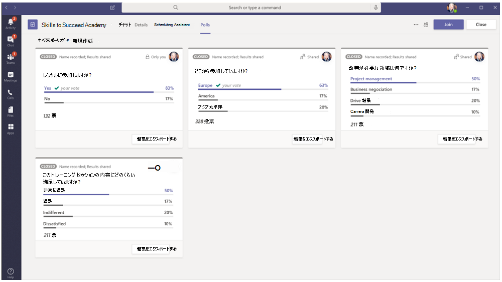

# 会議アプリ拡張性

Teamsの会議アプリの機能拡張は、次の概念に基づいて行います。

* 会議のライフサイクルには、会議前、会議中、会議後など、さまざまなステージがあります。  
* 会議には、開催者、発表者、出席者の 3 つの異なる参加者の役割があります。 詳細については、「会議での[役割」をTeamsしてください](https://support.microsoft.com/office/roles-in-a-teams-meeting-c16fa7d0-1666-4dde-8686-0a0bfe16e019)。  
* 会議には、[テナント内、](/microsoftteams/non-standard-users#:~:text=An%20anonymous%20user%20is%20a,their%20Microsoft%20or%20organization's%20account.)ゲストユーザー、フェデレーション ユーザー、匿名ユーザーなど[、さまざまな](/microsoftteams/manage-external-access)ユーザーの種類があります。

この記事では、会議のライフサイクルと、タブ、ボット、メッセージング拡張機能を会議に統合する方法について説明します。 タスクを実行するためのさまざまな参加者の役割とさまざまなユーザーの種類を識別するための情報を提供します。

## 会議のライフサイクル

会議のライフサイクルは、会議前、会議中、会議後のアプリ エクスペリエンスで構成されます。 会議のライフサイクルの各段階で、タブ、ボット、メッセージング拡張機能を統合できます。

### タブを会議のライフサイクルに統合する

タブを使用すると、チーム メンバーは会議内の特定の領域内のサービスとコンテンツにアクセスできます。 チームはタブを直接処理し、タブ内で使用可能なツールとデータに関する会話を行います。 会議Teams、ユーザーはタブを追加するには、 をクリックし、インストールするアプリを選択します。

> [!IMPORTANT]
> タブを会議に統合している場合、アプリはタブのシングル サインオン (SSO) 認証フロー Teamsに従[う必要があります](../tabs/how-to/authentication/auth-aad-sso.md)。

> [!NOTE]
> * モバイル クライアントは、会議の開催前と開催後のステージでのみタブをサポートします。 現在、会議中のダイアログとパネルである会議中のエクスペリエンスは、モバイルでは使用できません。
> * アプリは、プライベートスケジュールされた会議でのみサポートされます。

#### 会議前アプリのエクスペリエンス

会議前アプリエクスペリエンスを使用すると、会議アプリを検索して追加し、アンケート会議参加者への投票の開発など、会議前のタスクを実行できます。

**既存の会議にタブを追加するには**

1. 予定表で、タブを追加する会議を選択します。
1. [詳細] **タブを選択** し、[ . タブ ギャラリーが表示されます。

    

1. タブ ギャラリーで、追加するアプリを選択し、必要に応じて手順に従います。 アプリはタブとしてインストールされます。

    

    > [!NOTE]
    > * 既存の会議の [会議チャット] タブ **を使用して** タブを追加することもできます。
    > * 10 件を超えるポーリングまたはアンケートがある場合、タブ レイアウトは整理された状態である必要があります。

#### 会議中のアプリ エクスペリエンス

会議中のアプリ エクスペリエンスを使用すると、アプリと会議内ダイアログ ボックスを使用して、会議中に参加者を参加できます。 会議アプリは、会議ウィンドウの上部バーで会議内タブとしてホストされます。会議の参加者に対してアクション可能なコンテンツを紹介するには、会議内ダイアログ ボックスを使用します。 詳細については、「会議のアプリを[作成する」をTeamsしてください](create-apps-for-teams-meetings.md)。

**会議中にタブを使用するには**

1. 会議に入った後、チャット ウィンドウの上部バーから、使用するアプリを選択します。 アプリは、サイド パネルTeams会議内の会議に表示されます。
1. [会議内] ダイアログ ボックスで、フィードバックとして応答を入力します。

    

    > [!NOTE]
    > * アプリは、クライアント SDK Teamsを利用して、 にアクセスし、エクスペリエンス `meetingId` `userMri` `frameContext` を適切にレンダリングできます。
    > * 会議中のダイアログ ボックスが正常にレンダリングされると、結果が正常にダウンロードされたことを通知されます。
    > * アプリ マニフェストは、表示する場所を指定します。 コンテキスト フィールドは、この目的のために使用されます。 また、指定された設計ガイドラインに従って、共有トレイエクスペリエンスの一部になれ得る。

    次の図は、会議中のサイド パネルを示しています。

    

#### 会議後のアプリ エクスペリエンス

会議後のアプリ エクスペリエンスを使用すると、アンケートのアンケート結果やフィードバックなどの会議の結果を表示できます。 Select  をクリックしてタブを追加し、開催者と出席者がアクションを実行する必要がある会議のメモと結果を取得します。

次の図は **、[Contoso]** タブを表示し、会議の出席者から受け取ったポーリングとフィードバックの結果を示します。

> [!NOTE]
> 10 件を超えるポーリングまたはアンケートがある場合は、タブ レイアウトを整理する必要があります。

### ボットを会議のライフサイクルに統合する

グループチャット スコープで有効になっているボットは、会議で機能し始める。 ボットを実装するには、ボットのビルド[から始](../build-your-first-app/build-bot.md)め、次に、会議のアプリを作成[Teamsします](../apps-in-teams-meetings/create-apps-for-teams-meetings.md#meeting-apps-api-references)。

### メッセージング拡張機能を会議のライフサイクルに統合する

メッセージング拡張機能を実装するには、まずメッセージング拡張機能を作成してから、会議用アプリの作成[Teamsします](../apps-in-teams-meetings/create-apps-for-teams-meetings.md#meeting-apps-api-references)。

会議Teams機能拡張により、会議の参加者の役割に基づいてアプリを設計できます。

## 会議の参加者の役割

既定の参加者設定は、組織の IT 管理者によって決まります。 会議の参加者の役割を次に示します。

* **開催** 者 : 開催者は会議をスケジュールし、会議のオプションを設定し、会議の役割を割り当て、会議を開始します。 M365 アカウントとユーザー ライセンスを持Teams、参加者のアクセス許可を制御できます。 会議の開催者は、特定の会議の設定を変更できます。 開催者は、[会議のオプション] Web ページ **でこれらの変更を** 行えます。
* **発表者**: 発表者は、除外を含む開催者と同じ機能を持っています。 発表者は、セッションから開催者を削除したり、セッションの会議オプションを変更したりすることはできません。 既定では、会議に参加する参加者には発表者の役割があります。
* **出席者**: 出席者とは、会議に出席するために招待されたが、発表者として機能する権限を持たされていないユーザーです。 出席者は他の会議メンバーとやり取りできますが、会議の設定を管理したり、コンテンツを共有したりすることはできません。

> [!NOTE]
> アプリを追加、削除、またはアンインストールできるのは、開催者または発表者のみです。

詳細については、「会議での[役割」をTeamsしてください](https://support.microsoft.com/office/roles-in-a-teams-meeting-c16fa7d0-1666-4dde-8686-0a0bfe16e019)。

会議の参加者の役割に基づいてアプリを設計した後、会議の各ユーザーの種類を特定し、アクセスできるユーザーを選択できます。

## 会議内のユーザーの種類

> [!NOTE]
> ユーザーの種類は **getParticipantRole** API には含まれません。

会議の開催者、発表者、出席者などのユーザーの種類は、会議で参加者の役割の 1 [つを実行できます](#participant-roles-in-a-meeting)。

次の一覧では、アクセシビリティとパフォーマンスに加え、さまざまなユーザーの種類について説明します。

* **テナント内 :** テナント内ユーザーは組織に属し、テナントの Azure Active Directory (AAD) に資格情報を持ちます。 通常、フルタイム、オンサイト、またはリモートの従業員です。 テナント内のユーザーには、開催者、発表者、または出席者を指定できます。
* **ゲスト**: ゲストは、組織のテナント内の他のリソースTeamsにアクセスするために招待された別の組織の参加者です。 ゲストは組織の AAD に追加され、チーム チャット、会議、ファイルTeamsアクセスできるネイティブ チーム メンバーと同じ機能を持ちます。 ゲスト ユーザーには、開催者、発表者、または出席者を指定できます。 詳細については、「ゲスト アクセス[」を参照Teams。](/microsoftteams/guest-access)
* **フェデレーションまたは外部**: フェデレーション ユーザーは、会議への参加をTeams組織の外部ユーザーです。 フェデレーション ユーザーは、フェデレーション パートナーと有効な資格情報を持ち、Teams。 組織からチームや他の共有リソースにアクセスできない。 ゲスト アクセスは、外部ユーザーがチームとチャネルにアクセスできる優れたオプションです。 詳細については、「外部アクセスの[管理」を参照Teams。](/microsoftteams/manage-external-access)

    > [!NOTE]
    > ユーザー Teams、他の組織との会議やチャットをホストするときにアプリを追加できます。 ユーザーは、ユーザーが他の組織がホストする会議やチャットに参加するときに、外部ユーザーが共有するアプリを使用できます。 ホスティング ユーザーの組織のデータ ポリシーと、そのユーザーの組織が共有するサード パーティ製アプリのデータ共有プラクティスが有効になります。

* **匿名**: 匿名ユーザーは AAD ID を持ち、テナントとフェデレーションされません。 匿名の参加者は外部ユーザーと同じですが、その ID は会議に投影されません。 匿名ユーザーは、会議ウィンドウでアプリにアクセスできない。 匿名ユーザーを開催者にすることはできませんが、発表者または出席者を指定できます。

    > [!NOTE]
    > 匿名ユーザーは、グローバル既定のユーザー レベルのアプリアクセス許可ポリシーを継承します。 詳細については、「アプリの管理 [」を参照してください](/microsoftteams/non-standard-users#anonymous-user-in-meetings-access)。

ゲストまたは匿名ユーザーは、アプリを追加、削除、アンインストールできません。

次の表に、ユーザーの種類と、各ユーザーがアクセスできる機能を示します。

| ユーザーの種類 | タブ | ボット | メッセージング拡張機能 | アダプティブ カード | タスク モジュール | 会議中ダイアログ |
| :-- | :-- | :-- | :-- | :-- | :-- | :-- |
| 匿名ユーザー | 使用不可 | 使用不可 | 使用不可 | 会議チャットでの操作は許可されます。 | アダプティブ カードからの会議チャットでの操作は許可されます。 | 利用不可 |
| テナント AAD の一部であるゲスト | 対話は許可されます。 作成、更新、削除は許可されません。 | 使用不可 | 使用不可 | 会議チャットでの操作は許可されます。 | アダプティブ カードからの会議チャットでの操作は許可されます。 | Available |
| フェデレーション ユーザー。 詳細については、「標準以外の [ユーザー」を参照してください](/microsoftteams/non-standard-users)。 | 対話は許可されます。 作成、更新、削除は許可されません。 | 対話は許可されます。 取得、更新、および削除は許可されません。 | 利用不可 | 会議チャットでの操作は許可されます。 | アダプティブ カードからの会議チャットでの操作は許可されます。 | 利用不可 |

## 関連項目

* [Tab](../tabs/what-are-tabs.md#understand-how-tabs-work)
* [ボット](../bots/what-are-bots.md)
* [メッセージング拡張機能](../messaging-extensions/what-are-messaging-extensions.md)
* [アプリをデザインする](../apps-in-teams-meetings/design/designing-apps-in-meetings.md)

## 次の手順

> [!div class="nextstepaction"]
> [Teams 会議アプリへの前提条件と API リファレンス](create-apps-for-teams-meetings.md)