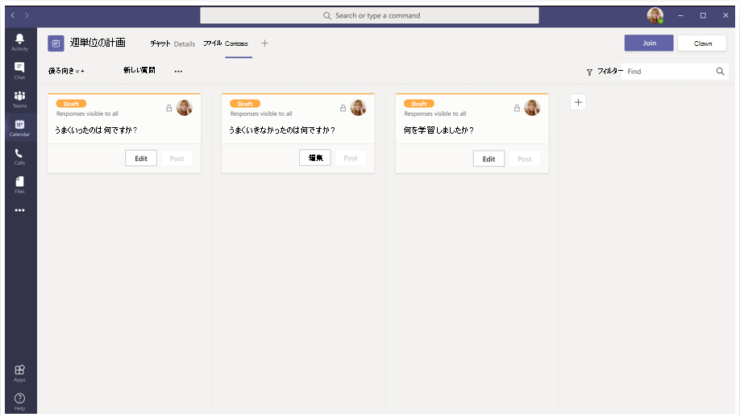

# 統合された会議アプリ

Teams会議アプリは、次の概念に基づいて行います。

* 会議のライフサイクルには、会議前、会議中、会議後のステージが異なります。  
* 会議には、開催者、発表者、出席者の 3 つの異なる参加者の役割があります。 詳細については、「会議での[役割」をTeamsしてください](https://support.microsoft.com/office/roles-in-a-teams-meeting-c16fa7d0-1666-4dde-8686-0a0bfe16e019)。  
* 会議には、[テナント内、](/microsoftteams/non-standard-users#:~:text=An%20anonymous%20user%20is%20a,their%20Microsoft%20or%20organization's%20account.)ゲストユーザー、フェデレーション ユーザー、匿名ユーザーなど[、さまざまな](/microsoftteams/manage-external-access)ユーザーの種類があります。

この記事では、会議のライフサイクルと、タブ、ボット、メッセージング拡張機能を統合する方法について説明します。 さまざまな参加者の役割とユーザーの種類を識別します。

## 会議のライフサイクル

会議のライフサイクルは、会議前、会議中、会議後のアプリ エクスペリエンスで構成されます。 会議のライフサイクルの各段階で、タブ、ボット、メッセージング拡張機能を統合できます。

### タブを会議のライフサイクルに統合する

タブを使用すると、チーム メンバーは会議内の特定の領域内のサービスとコンテンツにアクセスできます。 チームはタブを直接処理し、タブ内で使用可能なツールとデータに関する会話を行います。 会議Teams、タブを追加するには、 をクリックし、インストールするアプリを選択します。

> [!IMPORTANT]
> タブを会議に統合している場合、アプリはタブのシングル サインオン (SSO) 認証フロー Teamsに従[う必要があります](../tabs/how-to/authentication/auth-aad-sso.md)。

> [!NOTE]
> * プライベートスケジュールされた会議は、アプリのみをサポートします。
> * 会議内線Teamsタブ アプリのアプリ オプションの追加は、Web クライアントTeamsサポートされていません。

#### 会議前アプリのエクスペリエンス

会議前アプリエクスペリエンスを使用すると、会議アプリを検索して追加できます。 会議の参加者を調査するためのポーリングの開発など、会議前のタスクを実行することもできます。

**既存の会議にタブを追加するには**

1. 予定表で、タブを追加する会議を選択します。
1. [詳細] **タブを選択** し、[ . タブ ギャラリーが表示されます。

    

1. タブ ギャラリーで、追加するアプリを選択し、必要に応じて手順に従います。 アプリはタブとしてインストールされます。

   > [!NOTE]
   > * [会議チャット] タブを使用して、既存の会議にタブを **追加** することもできます。
   > * 10 件を超えるポーリングまたはアンケートがある場合、タブ レイアウトは整理された状態である必要があります。

# [デスクトップ](#tab/desktop)

# [モバイル](#tab/mobile)

モバイル上の既存の会議にタブを追加すると、会議の詳細の [その他] セクションにある会議前のエクスペリエンスで同じアプリを表示できます。

  

---

#### 会議中のアプリ エクスペリエンス

会議中のアプリ エクスペリエンスを使用すると、アプリと会議内ダイアログ ボックスを使用して、会議中に参加者を参加できます。 会議アプリは、会議ウィンドウのツールバーで会議内タブとしてホストされます。会議の参加者に対してアクション可能なコンテンツを紹介するには、会議内ダイアログ ボックスを使用します。 詳細については、「会議のアプリを[作成する」をTeamsしてください](create-apps-for-teams-meetings.md)。

モバイルの場合、会議アプリは、会議内>省略 &#x25CF;&#x25CF;&#x25CF; アプリから利用できます。 [アプリ **] を** 選択して、会議で利用可能なすべてのアプリを表示します。

**会議中にタブを使用するには**

1. [次へ] Teams。
1. 予定表で、タブを使用する会議を選択します。
1. 会議に入った後、チャット ウィンドウのツールバーから、必要なアプリを選択します。
    アプリは、サイド パネルTeams会議内の会議に表示されます。
1. [会議内] ダイアログ ボックスで、フィードバックとして応答を入力します。

# [デスクトップ](#tab/desktop)

# [モバイル](#tab/mobile)

会議に参加し、デスクトップまたは Web からアプリを追加すると、アプリはモバイル 会議Teams [アプリ] セクションに **表示** されます。 [アプリ **] を** 選択してアプリの一覧を表示します。 ユーザーは、任意のアプリをアプリの会議内サイド パネルとして起動できます。

[会議内] ダイアログ ボックスが表示され、フィードバックとして応答を入力できます。

> [!NOTE]
> アプリがモバイルで動作するには、アプリ マニフェストを変更する必要があります。

---

> [!NOTE]
> * アプリは、クライアント SDK Teamsを利用して、 にアクセスし、エクスペリエンス `meetingId` `userMri` `frameContext` を適切にレンダリングできます。
> * 会議中のダイアログ ボックスが正常に表示されると、結果が正常にダウンロードされたことを通知します。
> * アプリ マニフェストは、アプリを表示する場所を指定します。 これは、マニフェストでコンテキスト フィールドを指定することで実行できます。 また、指定された設計ガイドラインに従って、共有会議ステージの [エクスペリエンスの一部です](~\apps-in-teams-meetings\design\designing-apps-in-meetings.md)。

次の図は、会議中のサイド パネルを示しています。

# [デスクトップ](#tab/desktop)

# [モバイル](#tab/mobile)

---

次の表は、アプリが検証され、検証されない場合のアプリの動作を示しています。

|アプリの機能 | アプリの検証 | アプリが検証されていない |
|---|---|---|
| 会議の機能拡張 | アプリは会議に表示されます。 | モバイル クライアントの会議にアプリが表示されません。 |

詳細については、「ストア検証 [ガイドライン」を参照してください](../concepts/deploy-and-publish/appsource/prepare/teams-store-validation-guidelines.md)。

#### 会議後のアプリ エクスペリエンス

会議後のアプリ エクスペリエンスを使用すると、アンケートのアンケート結果やフィードバックなど、会議の結果を表示できます。 選択  をクリックしてタブを追加し、会議メモを取得し、開催者と出席者がアクションを実行する必要がある結果を確認します。

次の図は **、[Contoso]** タブを表示し、会議の出席者から受け取ったポーリングとフィードバックの結果を示します。

# [デスクトップ](#tab/desktop)

# [モバイル](#tab/mobile)

---

> [!NOTE]
> 10 件を超えるポーリングまたはアンケートがある場合は、タブ レイアウトを整理する必要があります。

### ボットを会議のライフサイクルに統合する

グループチャット スコープで有効になっているボットは、会議で機能し始める。 ボットを実装するには、ボットのビルド[から始](../build-your-first-app/build-bot.md)め、次に、会議のアプリを作成[Teamsします](../apps-in-teams-meetings/API-references.md#meeting-apps-api-references)。

### メッセージング拡張機能を会議のライフサイクルに統合する

メッセージング拡張機能を実装するには、まずメッセージング[拡張機能を](../messaging-extensions/how-to/create-messaging-extension.md)作成してから、会議用のアプリを作成[Teamsします](../apps-in-teams-meetings/API-references.md#meeting-apps-api-references)。

統合Teamsアプリを使用すると、会議の参加者の役割に基づいてアプリを設計できます。

## 会議の参加者の役割

既定の参加者設定は、組織の IT 管理者によって決まります。 会議の参加者の役割を次に示します。

* **開催** 者 : 開催者は会議をスケジュールし、会議のオプションを設定し、会議の役割を割り当て、会議を開始します。 管理者アカウントとMicrosoft 365ライセンスを持Teamsは、開催者のみであり、出席者のアクセス許可を制御できます。 会議の開催者は、特定の会議の設定を変更できます。 開催者は、[会議のオプション] Web ページ **でこれらの変更を** 行えます。
* **発表者**: 発表者は、除外を含む主催者と同じ機能を持っています。 発表者は、セッションから開催者を削除したり、セッションの会議オプションを変更したりできません。 既定では、会議に参加する参加者には発表者の役割があります。
* **出席者**: 出席者とは、会議に出席するために招待されたユーザーです。 ただし、出席者は発表者として機能する権限を持てない。 出席者は他の会議メンバーとやり取りできますが、会議の設定を管理したり、コンテンツを共有したりはできない。

> [!NOTE]
> アプリを追加、削除、またはアンインストールできるのは、開催者または発表者のみです。

詳細については、「会議での[役割」をTeamsしてください](https://support.microsoft.com/office/roles-in-a-teams-meeting-c16fa7d0-1666-4dde-8686-0a0bfe16e019)。

会議の参加者の役割に基づいてアプリを設計した後、会議の各ユーザーの種類を特定し、アクセスできるユーザーを選択できます。

## 会議内のユーザーの種類

会議の開催者、発表者、出席者などのユーザーの種類は、会議の参加者の役割 [の 1 つを実行できます](#participant-roles-in-a-meeting)。

> [!NOTE]
> ユーザーの種類は **getParticipantRole** API には含まれません。

次の一覧では、アクセシビリティとパフォーマンスに加え、さまざまなユーザーの種類について説明します。

* **テナント内 :** テナント内ユーザーは組織に属し、テナントの Azure Active Directory (AAD) に資格情報を持ちます。 フルタイム、オンサイト、またはリモートの従業員です。 テナント内のユーザーには、開催者、発表者、または出席者を指定できます。
* **ゲスト**: ゲストは、組織のテナント内の他のリソースTeamsにアクセスするために招待された別の組織の参加者です。 ゲストは組織のグループに追加され、AADメンバー Teamsと同じ機能を持ちます。 チーム チャット、会議、ファイルにアクセスできます。 ゲストには、開催者、発表者、出席者を指定できます。 詳細については、「ゲスト アクセス[」を参照Teams。](/microsoftteams/guest-access)
* **フェデレーションまたは外部**: フェデレーション ユーザーは、会議への参加をTeams組織の外部ユーザーです。 フェデレーション ユーザーは、フェデレーション パートナーと有効な資格情報を持ち、Teams。 組織からチームや他の共有リソースにアクセスできない。 ゲスト アクセスは、外部ユーザーがチームとチャネルにアクセスできる優れたオプションです。 詳細については、「外部アクセスの[管理」を参照Teams。](/microsoftteams/manage-external-access)

    > [!NOTE]
    > ユーザー Teams、他の組織との会議やチャットをホストするときにアプリを追加できます。 ユーザーは、ユーザーが他の組織がホストする会議やチャットに参加するときに、外部ユーザーが共有するアプリを使用できます。 ホスティング ユーザーの組織のデータ ポリシーと、そのユーザーの組織が共有するサード パーティ製アプリのデータ共有プラクティスが有効になります。

    > [!IMPORTANT]
    > 現在、サード パーティ製アプリは Government Community Cloud (GCC) で利用できますが、GCC-High国防総省 (DOD) では使用できません。 サード パーティ製アプリは、既定では無効になっています。GCC。 アプリのサード パーティ製アプリを有効GCC、[アプリのアクセス](/microsoftteams/teams-app-permission-policies)許可ポリシーの管理とアプリの管理に[関するページをご覧ください](/microsoftteams/manage-apps)。

* **匿名**: 匿名ユーザーは、id を持AADテナントとフェデレーションされません。 匿名の参加者は外部ユーザーと同じですが、その ID は会議には表示されません。 匿名ユーザーは会議ウィンドウでアプリにアクセスできない。 匿名ユーザーは開催者になじめ、発表者または出席者になじむ場合があります。

    > [!NOTE]
    > 匿名ユーザーは、グローバル既定のユーザー レベルのアプリアクセス許可ポリシーを継承します。 詳細については、「アプリの管理 [」を参照してください](/microsoftteams/non-standard-users#anonymous-user-in-meetings-access)。

ゲストユーザーまたは匿名ユーザーは、アプリを追加、削除、またはアンインストールできない。

次の表に、ユーザーの種類と、各ユーザーがアクセスできる機能の一覧を示します。

| ユーザーの種類 | タブ | ボット | メッセージング拡張機能 | アダプティブ カード | タスク モジュール | 会議中ダイアログ | 会議ステージ | コンテンツ バブル |
| :-- | :-- | :-- | :-- | :-- | :-- | :-- | :-- | :-- |
| 匿名ユーザー | 使用不可 | 使用不可 | 使用不可 | 会議チャットでの操作は許可されます。 | アダプティブ カードからの会議チャットでの操作は許可されます。 | 使用不可 | 会議ステージでアプリを表示および操作できます | 使用不可 |
| ゲスト、テナント の一部AAD | 対話は許可されます。 作成、更新、および削除は許可されません。 | 使用不可 | 使用不可 | 会議チャットでの操作は許可されます。 | アダプティブ カードからの会議チャットでの操作は許可されます。 | 使用可能 | 会議のステージでアプリを開始、表示、操作できます | 使用可能 |
| フェデレーション ユーザーの詳細については、「標準以外の [ユーザー」を参照してください](/microsoftteams/non-standard-users)。 | 対話は許可されます。 作成、更新、および削除は許可されません。 | 対話は許可されます。 取得、更新、削除は許可されません。 | 使用不可 | 会議チャットでの操作は許可されます。 | アダプティブ カードからの会議チャットでの操作は許可されます。 | 使用不可 | 会議のステージでアプリを開始、表示、操作できます | 使用不可 |

## 次の手順

> [!div class="nextstepaction"]
> [Teams 会議アプリへの前提条件と API リファレンス](create-apps-for-teams-meetings.md)

## 関連項目

* [Tab](../tabs/what-are-tabs.md#understand-how-tabs-work)
* [Bot](../bots/what-are-bots.md)
* [メッセージング拡張機能](../messaging-extensions/what-are-messaging-extensions.md)
* [アプリをデザインする](../apps-in-teams-meetings/design/designing-apps-in-meetings.md)
