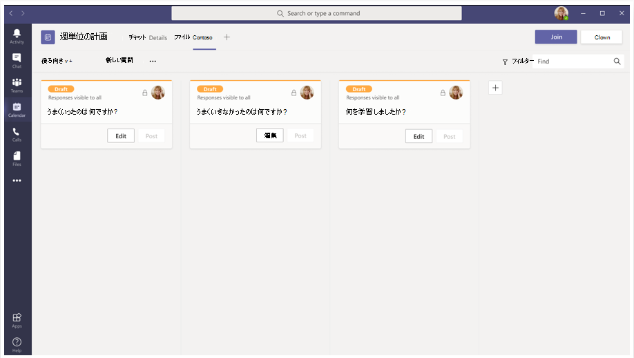
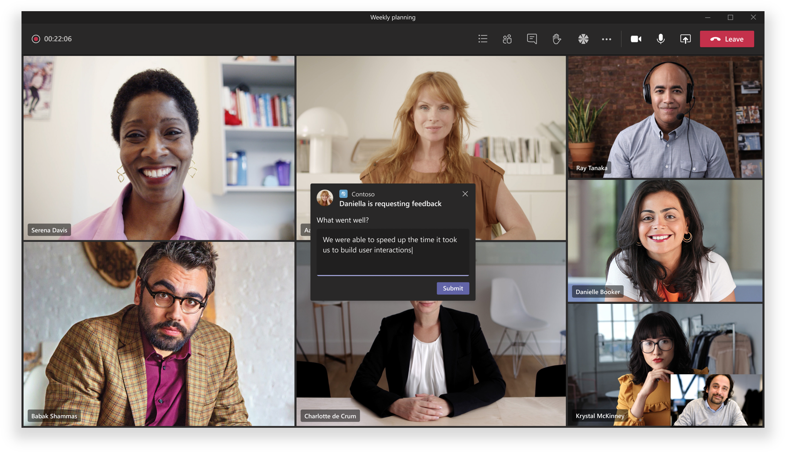
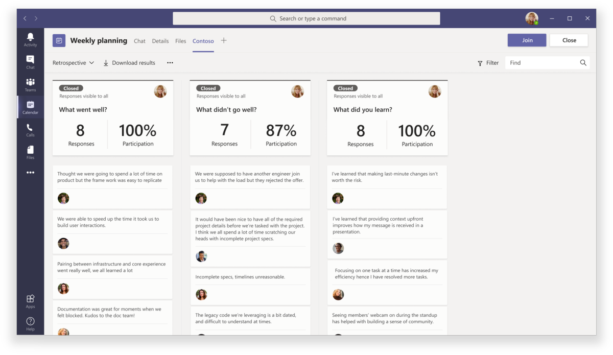
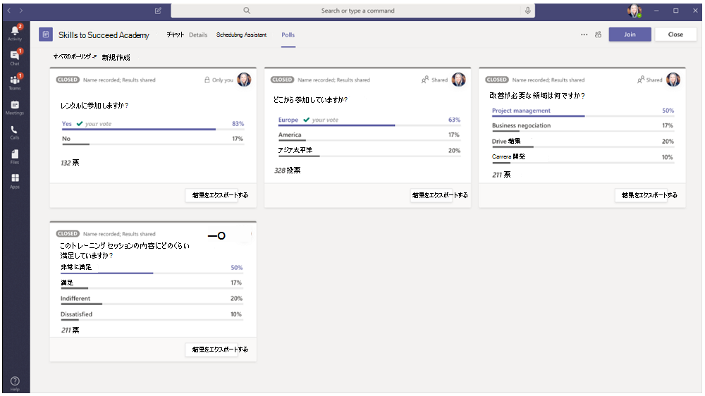

# Teams 会議のアプリ (プレビュー)Apps in Teams meetings (Preview)

>[!IMPORTANT]
> Microsoft Teams プレビューに含まれている機能は、すぐにアクセス、テスト、およびフィードバックのために提供されています。Features included in Microsoft Teams preview are provided for early-access, testing, and feedback purposes only. 公開リリースで利用できるようになる前に変更が行われ、運用アプリケーションでは使用できません。They may undergo changes before becoming available in the public release and should not be used in production applications.

会議は、Teams の生産性にとって重要です。Meetings are key to productivity in Teams. このツールを使用すると、包括的でアクティブなフォーラムで、コラボレーション、パートナーシップ、情報を伝えるコミュニケーション、および共有フィードバックを行うことができます。They enable collaboration, partnership, informed communication, and shared feedback in an inclusive and active forum. 開発者は、 [構成可能なタブ](../tabs/what-are-tabs.md#how-do-tabs-work)、 [ボット](../bots/what-are-bots.md)、および [メッセージ拡張](../messaging-extensions/what-are-messaging-extensions.md) アプリケーションを作成して、Teams の会議環境を強化し、充実させることができます。As a developer, you can create [configurable tab](../tabs/what-are-tabs.md#how-do-tabs-work), [bot](../bots/what-are-bots.md), and [message extension](../messaging-extensions/what-are-messaging-extensions.md) applications to enhance and enrich a Teams meeting experience. 会議ユーザーは、タブギャラリーを使用してアプリにアクセスし、かんばんボードの事前ステージング、会議中のアクション可能なダイアログの開始、会議後の投票の作成など、関連するシナリオを有効にすることができます。Meeting users can access apps, via the tab gallery, to enable relevant scenarios such as pre-staging a Kanban board, launching an in-meeting actionable dialog, or creating a post-meeting poll. 会議アプリは、出席者の状態に基づいて、会議のライフサイクルの各段階でユーザー環境を提供できます。Your meeting app can deliver a user experience for each stage of the meeting lifecycle based upon attendee status.

Teams のアプリの拡張機能センターは3つの概念に基づいています。Teams’ meeting app extensibility centers on three concepts:

会議の **ライフサイクル** の✔ (会議の時間枠の前、前後、および後)。✔ **Meeting lifecycle** — before, during, and after meeting time frame.  
✔ **参加者の役割** —会議の開催者、発表者、または出席者。✔ **Participant role** — meeting organizer, presenter, or attendee.  
✔ **ユーザーの種類** -テナント、ゲスト、フェデレーション、または匿名 Teams ユーザー。✔ **User type** — in-tenant, guest, federated, or anonymous Teams user.

<!-- markdownlint-disable MD001 -->
### 会議のライフサイクルのシナリオMeeting lifecycle scenarios

## タブTabs

> [!IMPORTANT]
> すべてのタブアプリケーションと同様に、アプリは、タブの Teams [SSO 認証フロー](../tabs/how-to/authentication/auth-aad-sso.md) に従う必要があります。As with all tab applications, Your app will need to follow the Teams [SSO authentication flow](../tabs/how-to/authentication/auth-aad-sso.md) for tabs.

### ミーティング前アプリの作業Pre-meeting app experience

**ミーティング前の環境:****Pre-meeting experience:**

**[会議前] タブ:****Pre-meeting tab:**

✔権限ユーザーは、次の2つの方法で、タブギャラリーを使用して会議にアプリを追加できます。✔ Permissioned users can add apps to a meeting via the tab gallery in two ways:

&emsp;&emsp; Teams スケジュールフォームの [ **詳細** ] タブを使用して&#9679; します。&emsp;&emsp;&#9679; Via the **Details** tab on the Teams scheduling form.

&emsp;&emsp; 既存の会議の [ミーティングの **チャット** ] タブを使用して&#9679; します。&emsp;&emsp;&#9679;  Via the meeting **Chat** tab in an existing meeting.   

✔タブアプリは、プラスアイコン (➕) ボタンを使用して、会議の **詳細** と **チャット** ページからアクセスできます。 |✔ Tab apps are accessible in meetings **Details** and **Chats** pages using a plus icon (➕) button.|

### 会議中のアプリ環境In-meeting app experience

✔ Meeting アプリは、[会議中] タブを使用して、チャットウィンドウの上部上のバーと、会議のタブ操作としてホストされます。ユーザーがタブギャラリーを使用して会議にタブを追加すると、 **会議** のエクスペリエンス中のアプリが表示されます。✔ Meeting apps will be hosted in the top upper bar of the chat window and as in-meeting tab experience via the in-meeting tab. When users add a tab to a meeting through the tab gallery, apps that are **during meeting** experiences will be surfaced.

✔権限ユーザーは、会議中にアプリを追加できます。✔ Permissioned users can add apps while in the meeting.

✔会議のコンテキストでロードされた場合、アプリは Teams クライアント SDK を活用して、にアクセス `meetingId` し、を `userMri` 適切に表示することができ `frameContext` ます。✔ When loaded in the context of a meeting, apps will be able to leverage the Teams Client SDK to access the `meetingId`, `userMri`, and `frameContext` to appropriately render the experience.

アプリの✔は、次の2つの領域で Teams 会議に表示できます。✔ For an app can be visible in a Teams meeting in two areas:

&emsp;&emsp;&#9679; **サイドパネル**。&emsp;&emsp;&#9679; **Side panel**.  

> [!NOTE]
> アプリの _マニフェスト_ で、タブが [サイドパネル用に最適化](create-apps-for-teams-meetings.md#in-meeting)されていることが指定されている場合は、それが表示されます。If your _app manifest_ specifies that your tab is [optimized for side panel](create-apps-for-teams-meetings.md#in-meeting), that is where it will be displayed. また、この機能は、指定された設計ガイドラインに従って、共有トレイの環境の一部にすることもできます。It can also be part of a share-tray experience, subject to specified design guidelines.

&emsp;&emsp;&#9679; **会議中] ダイアログ**。&emsp;&emsp;&#9679; **In-meeting dialog**. 会議中のダイアログを使用して、会議の参加者に対して操作可能なコンテンツを示します。Use the in-meeting dialog to showcase actionable content for meeting participants. 「 [Teams 会議用アプリの作成」を](create-apps-for-teams-meetings.md)*参照してください*。*See* [Create Apps for Teams meetings](create-apps-for-teams-meetings.md).

**ミーティング中の環境:****In-meeting experience:**

**ユーザーに対する会議中のアクション可能なダイアログ:****In-meeting actionable dialog for users:**

### ミーティング後のアプリの作業Post-meeting app experience

**ミーティング後の環境:****Post-meeting experience:**

ミーティング後のアプリのシナリオは、現在の会議の後の状態と似ています。これには、タブが表面内に存在するという利点があります。The post-meeting app scenario is similar to the current post-meeting experience with the added benefit of having tabs exist within the surface. 権限ユーザーは、[チームのスケジュール] フォームの [ **詳細** ] タブと既存の会議の [会議 **チャット** ] タブを使用して、タブギャラリーからアプリケーションを会議に追加できます。Permissioned users can add apps from the tab gallery to a meeting via the **Details** tab on the Teams scheduling form and the meeting **Chat** tab in an existing meeting.

### ボットBots

Bot 実装の場合は、 [Teams の会議のドキュメントでボット](../bots/how-to/create-a-bot-for-teams.md#bots-in-teams-meetings) を参照してください。For bot implementation, please see our [Bots in Teams meetings](../bots/how-to/create-a-bot-for-teams.md#bots-in-teams-meetings) documentation.

### メッセージング拡張機能Messaging Extensions

メッセージング拡張機能の実装については、「 [Teams 会議のドキュメント」の「メッセージング拡張機能](../messaging-extensions/how-to/create-messaging-extension.md#messaging-extensions-in-teams-meetings) 」を参照してください。For messaging extension implementation, please see our [Messaging extensions in Teams meetings](../messaging-extensions/how-to/create-messaging-extension.md#messaging-extensions-in-teams-meetings) documentation.

## 会議での参加者の役割とユーザーの種類Participant roles and user types in a meeting

### 参加者の役割Participant roles

参加者固有の承認を使用してアプリを設計できます。You can design your app with participant-specific authorization. たとえば、開催者または発表者のみが会議で投票を作成できるとします。For example, perhaps only an organizer and/or presenter can create a poll in meetings. 既定の参加者設定は組織の IT 管理者によって決定されますが、会議の開催者は特定の会議の設定を変更することをお勧めします。Although default participant settings are determined by an organization's IT administrator, a meeting organizer may want to change the settings for a specific meeting. 開催者は、会議オプション web ページでこれらの変更を行うことができます。Organizers can make these changes on the Meeting options web page.

1. **開催者**。**Organizer**. 開催者が会議をスケジュールし、会議オプションを設定し、会議の役割を割り当て、会議を開始します。The organizer schedules a meeting, sets the meeting options, assigns meeting roles, and starts the meeting. M365 アカウント (Teams ライセンスを所有) を持つユーザーのみが、開催者と参加者のアクセス許可を管理できます。Only users with a M365 account (possessing a Teams license) can be organizers and control attendee permissions.
1. **プレゼンター**。**Presenter**. プレゼンターには開催者とほぼ同じ機能があります。ただし、発表者はセッションから開催者を削除したり、セッションの会議オプションを変更したりすることはできません。Presenters have nearly the same capabilities as organizer; however, a presenter cannot remove an organizer from the session or modify meeting options for the session. 既定では、会議に参加する参加者には発表者の役割が割り当てられます。By default, participants joining a meeting have the presenter role.
1. **出席者**。**Attendee**. 出席者は、会議への参加を招待されているが、発表者としての権限を持っていないユーザーです。An attendee is a user who has been invited to attend a meeting but who is not authorized to act as a presenter. 出席者が他の会議メンバーと対話することはできますが、会議の設定を管理したり、コンテンツを共有したりすることはできません。Attendees can interact with other meeting members but cannot manage any of the meeting settings or share content.

_See_ [ **Teams 会議でのロールの**表示](https://support.microsoft.com/office/roles-in-a-teams-meeting-c16fa7d0-1666-4dde-8686-0a0bfe16e019)_See_ [**Roles in a Teams meeting**](https://support.microsoft.com/office/roles-in-a-teams-meeting-c16fa7d0-1666-4dde-8686-0a0bfe16e019)

[  **会議オプション** ] ページには、次のようにアクセスできます。You can access the  **Meeting options** page as follows:

&#11200; Teams で、 **予定**表の予定表のロゴに移動し、  てから、[ **会議のオプション**] をクリックします。&#11200; In Teams, go to **Calendar** , select a meeting, and then **Meeting options**.

会議出席依頼の &#11200; で、[ **会議オプション**] を選択します。&#11200; In a meeting invitation, select **Meeting options**.

会議中に &#11200; は、[ **参加者**に参加者を表示する ![ ] アイコンをミーティングのコントロールに選択し ](../assets/images/apps-in-meetings/show-participants.png) ます。&#11200; During a meeting, select **Show participants**  in the meeting controls. 次に、参加者のリストの上にある [ **権限の管理**] を選択します。Then, above the list of participants, choose **Manage permissions**.

### ユーザーの種類User types

> [!NOTE]
> ユーザーの種類は会議に参加でき、前述の参加者の役割の1つを引き受けます。User types can join meetings and assume one of the participant roles described above. ユーザーの種類は、 **getParticipantRole** API の一部として公開されません。The User type is not exposed as part of the **getParticipantRole** API.

1. **テナント内**。**In-tenant**. これらのユーザーは組織に属しており、テナントの Azure Active Directory に資格情報を持っています。These users belong to the organization and have credentials in Azure Active Directory for the tenant. 通常は、フルタイム、オンサイト、またはリモートの従業員です。They are usually full-time, onsite or remote employees.
1. **ゲスト**。**Guest**. ゲストは、組織のテナント内の Teams またはその他のリソースへのアクセスを招待された別の組織からの参加者です。A guest is a participant from another organization who has been invited to access Teams or other resources in your organization's tenant. ゲストは組織の Active Directory に追加され、チームのチャット、会議、およびファイルへのフルアクセスを備えたネイティブのチームメンバーと同じ Teams の機能をほぼすべて提供できます。Guests are added to your organization’s Active Directory and can be given nearly all the same Teams capabilities as a native team member with full access to team chats, meetings, and files. [Microsoft Teams でのゲストアクセスを](/microsoftteams/guest-access)_参照してください_。_See_ [Guest access in Microsoft Teams](/microsoftteams/guest-access)
1. **フェデレーション/外部**。**Federated/External**. フェデレーションユーザーは、会議への参加を招待された別の組織の外部 Teams ユーザーです。A federated user is an external Teams user in another organization who has been invited to join a meeting. これらのユーザーは、フェデレーションパートナーとの間に有効な資格情報を持っているため、これらのユーザーは Teams によって認証されたものとして扱われますが、組織からチームや他の共有リソースにアクセスすることはできません。Since these users have valid credentials with federated partners, they are treated as authenticated by Teams but do not have access to your teams or other shared resources from your organization. 外部ユーザーが teams やチャネルにアクセスできるようにする場合は、ゲストアクセスの方が適していることがあります。If you want external users to have access to teams and channels, guest access might be a better option. 「 [Microsoft Teams で外部アクセスを管理](/microsoftteams/manage-external-access)する _」を参照してください_。_See_ [Manage external access in Microsoft Teams](/microsoftteams/manage-external-access)
1. **匿名**。**Anonymous**. 匿名ユーザーは、Active Directory id を持たず、テナントと共にフェデレーションされません。Anonymous users do not have an Active Directory identity and are not federated with a tenant. 匿名の参加者は外部ユーザーのようになりますが、その id は会議に投影されません。The anonymous participant is like an external user, but their identity is not projected into the meeting. 匿名ユーザーは、会議ウィンドウでアプリにアクセスできません。Anonymous users will not be able to access apps in a meeting window.

## 次の手順Next Steps

> [!div class="nextstepaction"]
> [Teams 会議のアプリを有効にする](teams-ミーティング/使用可能なアプリ-md)。[Enable apps in Teams meetings](apps-in-teams-meetings/enable-apps-in-meetings.md
