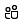

# 会議でのアプリTeamsApps in Teams meetings

ミーティングは、包括的で活発なフォーラムでのコラボレーション、パートナーシップ、情報に基づいたコミュニケーション、および共有フィードバックを可能にします。Meetings enable collaboration, partnership, informed communication, and shared feedback in an inclusive and active forum. 会議アプリは、出席者の状況に応じて、会議前、会議中、会議後のアプリエクスペリエンスなど、会議のライフサイクルの各段階に対してユーザー エクスペリエンスを提供できます。The meeting app can deliver a user experience for each stage of the meeting lifecycle including pre-meeting, in-meeting and post-meeting app experience, depending on the attendee's status.

Teamsエンドユーザーは、次の例に示すタブ ギャラリーを使用して、会議中にアプリにアクセスできます。Teams end-users can access apps during meetings using the tab gallery, for example:

* かんばんボードの事前ステージPre-stage a Kanban board
* 会議中のアクション可能なダイアログを起動するLaunch an in-meeting actionable dialog
* 会議後のアンケートを作成するCreate a post-meeting poll

Teamsの会議アプリの機能拡張は、次の概念に基づいています。Teams’ meeting app extensibility is based on the following concepts:

✔ミーティングのライフサイクルには、会議の前、中、および会議の期間後などの段階があります。✔ Meeting lifecycle has stages such as before, during, and after meeting time frame.  
✔会議の開催者、発表者、出席者などの会議の参加者の役割。✔ Participant roles in a meeting such as meeting organizer, presenter, or attendee.  
✔テナント内、ゲスト、フェデレーション、匿名のユーザーなどの会議のユーザータイプTeams。✔ User types in a meeting such as in-tenant, guest, federated, or anonymous Teams user.

この記事では、会議のライフサイクルに関する情報と、会議でタブ、ボット、およびメッセージング拡張機能を統合する方法について説明します。This article covers information about the meeting lifecycle and how to integrate tabs, bots, and messaging extensions in your meeting. また、参加者ロールを識別し、さまざまなユーザータイプを使用してタスクを実行することもできます。It also enables you to identify participant roles and also use different user types to perform tasks.

> [!NOTE]
> 会議アプリの機能拡張機能を使用するには、適切なアクセス許可が必要です。To work with the meeting app extensibility features, you must have the appropriate permissions.

### 会議のライフサイクルMeeting lifecycle

会議のライフサイクルは、会議前、会議中、および会議後のアプリ エクスペリエンスで構成されます。Meeting lifecycle consists of pre-meeting, in-meeting, and post-meeting app experience. 会議のライフサイクルの各段階で、タブ、ボット、およびメッセージング拡張機能を統合できます。You can integrate tabs, bots, and messaging extensions in each stage of the meeting lifecycle.

## タブを会議のライフサイクルに統合するIntegrate tabs into the meeting lifecycle

タブを使用すると、チーム メンバーはチャネルまたはチャット内の特定のスペース内のサービスやコンテンツにアクセスできます。Tabs allow team members to access services and content in a specific space within a channel or chat. これにより、チームはタブを直接操作し、タブ内で使用可能なツールやデータに関する会話を行うことができます。This lets the team work directly with tabs and have conversations about the tools and data available within tabs. 会議Teamsで、ユーザーはプラスIn Teams meeting, users can add a tab by selecting plus をクリックし、タブとしてインストールするアプリを選択します。, and choosing the app that they want to install as a tab.

> [!IMPORTANT]
> タブを会議に統合した場合、アプリはタブの[シングル サインオン (SSO) 認証フロー](../tabs/how-to/authentication/auth-aad-sso.md) Teamsに従う必要があります。If you have integrated a tab with your meeting, then your app must follow the Teams [single sign-on (SSO) authentication flow](../tabs/how-to/authentication/auth-aad-sso.md) for tabs.

> [!NOTE]
> * モバイル クライアントは、会議の前後のステージでのみタブをサポートします。Mobile clients support tabs only in pre and post meeting stages. 会議中のダイアログおよびパネルである会議内のエクスペリエンスは、現在、モバイルでは使用できません。The in-meeting experiences that is in-meeting dialog and panel are currently not available on mobile.
> * アプリは非公開のスケジュールされた会議でのみサポートされます。Apps are supported only in private scheduled meetings.

### 事前会議アプリエクスペリエンスPre-meeting app experience

**事前会議の経験:****Pre-meeting experience:**

**[会議前] タブ:****Pre-meeting tab:**

✔ 権限を持つユーザーとは、会議のライフサイクルのさまざまな段階で、会議にアプリを追加できるユーザーのことです。✔ Permissioned users are users who can add apps to a meeting during different stages of the meeting lifecycle. これらのユーザーは、次の 2 つの方法でタブ ギャラリーを使用して会議にアプリを追加できます。These users can add apps to a meeting through the tab gallery in two ways:

   * Teams スケジューリング フォームの **[詳細**] タブを使用します。Using the **Details** tab on the Teams scheduling form.

   * 既存の会議で **[チャット** ] タブを使用する。Using the meeting **Chat** tab in an existing meeting.

✔タブ アプリは、ミーティングの **[詳細]** ページと [ **チャット** ] ページで、プラス ➕ ボタンを使用してアクセスできます。✔ Tab apps are accessible in meetings **Details** and **Chats** pages using a plus ➕ button.

✔ 10 以上のアンケートまたはアンケートがある場合、タブ レイアウトは組織化された状態にする必要があります。✔ Tab layout must be in an organized state if there are more than ten polls or surveys.

### 会議中のアプリエクスペリエンスIn-meeting app experience

ミーティング アプリ✔、チャット ウィンドウの上部バーにホストされ、[会議中] タブを使用して会議内のタブエクスペリエンスとしてホストされます。ユーザーがタブ ギャラリーを通じて会議にタブを追加すると、 **会議エクスペリエンス中** のアプリが表示されます。✔ Meeting apps are hosted in the top upper bar of the chat window and as in-meeting tab experience using the in-meeting tab. When users add a tab to a meeting through the tab gallery, apps that are **during meeting** experiences are shown.

✔アクセス許可ユーザーは、会議中にアプリを追加できます。✔ Permissioned users can add apps while in the meeting.

✔会議のコンテキストで読み込まれると、アプリは Teams クライアント SDK を利用して `meetingId` `userMri` 、 にアクセスし、 `frameContext` エクスペリエンスを適切にレンダリングできます。✔ When loaded in the context of a meeting, apps can leverage the Teams client SDK to access the `meetingId`, `userMri`, and `frameContext` to appropriately render the experience.

✔アンケートまたはアンケートの結果をエクスポートすると、結果が正常にダウンロードされたことをユーザーに通知します。✔ Exporting a result of a survey or poll notifies the users that the results successfully downloaded.

✔サイド パネルまたは会議中のダイアログ ボックスで、Teams会議でアプリが表示されます。✔ An app is visible in a Teams meeting in the side panel or the in-meeting dialog box. 会議の参加者の操作可能なコンテンツを表示するには、会議中のダイアログ ボックスを使用します。Use the in-meeting dialog box to showcase actionable content for meeting participants. 詳しくは[、Teams会議用のアプリの作成に関する](create-apps-for-teams-meetings.md)ページをご覧ください。For more information, see [create apps for Teams meetings](create-apps-for-teams-meetings.md).

   > [!NOTE]
   > アプリ マニフェストでは、タブが [サイド パネル に最適化され](create-apps-for-teams-meetings.md#during-a-meeting)、表示される場所が指定されます。Your app manifest specifies that your tab is [optimized for side panel](create-apps-for-teams-meetings.md#during-a-meeting), that is where it is displayed. また、指定された設計ガイドラインに従って、共有トレイ エクスペリエンスの一部にすることもできます。It can also be part of a share-tray experience, subject to specified design guidelines.

次の図は、会議内のダイアログ ボックスおよび別のサイド パネルとしてアプリを表示します。The following images display the app as an in-meeting dialog box and as a separate side panel:

#### ユーザーの会議中のアクション可能なダイアログIn-meeting actionable dialog for users

### 会議後のアプリエクスペリエンスPost-meeting app experience

✔ 会議後のアプリのシナリオは、現在の会議後のエクスペリエンスに似ています。✔ The post-meeting app scenario is similar to the current post-meeting experience with the added benefit of having tabs that exist within the surface.

✔アクセス許可ユーザーは、Teamsスケジュール フォームの **[詳細**] タブと既存の会議の [会議 **チャット**] タブを使用して、タブ ギャラリーから会議にアプリを追加できます。✔ Permissioned users can add apps from the tab gallery to a meeting using the **Details** tab on the Teams scheduling form and the meeting **Chat** tab in an existing meeting.

✔タブレイアウトは、アンケートまたはアンケートが 10 件を超える場合に整理する必要があります。✔  Tab layout must be organized when there are more than ten polls or surveys.

### ボットを会議のライフサイクルに統合するIntegrate bots into the meeting lifecycle

ボットの実装については、[まずボットのビルド](../build-your-first-app/build-bot.md)から開始し[、Teams会議用のアプリの作成](../apps-in-teams-meetings/create-apps-for-teams-meetings.md#meeting-apps-api-reference)に進みます。For bot implementation, start with [build a bot](../build-your-first-app/build-bot.md) and then continue with [create apps for Teams meetings](../apps-in-teams-meetings/create-apps-for-teams-meetings.md#meeting-apps-api-reference).

### メッセージング拡張機能を会議のライフサイクルに統合するIntegrate messaging extensions into the meeting lifecycle

メッセージング拡張機能の実装の場合は、まず[メッセージング拡張機能の構築](../messaging-extensions/how-to/create-messaging-extension.md)から始めて[、Teams会議用のアプリの作成](../apps-in-teams-meetings/create-apps-for-teams-meetings.md#meeting-apps-api-reference)に進みます。For messaging extension implementation, start with [build a messaging extension](../messaging-extensions/how-to/create-messaging-extension.md) and then continue with [create apps for Teams meetings](../apps-in-teams-meetings/create-apps-for-teams-meetings.md#meeting-apps-api-reference).

## 会議の参加者ロールとユーザー タイプParticipant roles and user types in a meeting

### 参加者の役割Participant roles

既定の参加者設定は、組織の IT 管理者によって決定されます。Default participant settings are determined by an organization's IT administrator. ミーティングの参加者の役割は次のとおりです。The following are the participant roles in a meeting:

* **開催** 者 : 開催者は会議のスケジュールを設定し、会議のオプションを設定し、会議の役割を割り当て、会議を開始します。**Organizer**: The organizer schedules a meeting, sets the meeting options, assigns meeting roles, and starts the meeting. Teamsライセンスを持つ M365 アカウントを持つユーザーのみが開催者になり、出席者のアクセス許可を制御できます。Only users with a M365 account with a Teams license can be organizers and control attendee permissions. 会議の開催者は、特定の会議の設定を変更できます。A meeting organizer can change the settings for a specific meeting. 開催者は、 **会議オプション** Web ページでこれらの変更を行うことができます。Organizers can make these changes on the **Meeting options** web page.
* **発表** 者 : 発表者は主催者と同じ機能を持っています。**Presenter**: Presenters have the same capabilities as organizer. ただし、発表者は、セッションから開催者を削除したり、セッションの会議オプションを変更したりすることはできません。However, a presenter cannot remove an organizer from the session or modify meeting options for the session. 既定では、ミーティングに参加する参加者には発表者の役割があります。By default, participants joining a meeting have the presenter role.
* **出席者**: 出席者とは、会議に出席するように招待されたが、発表者として行動する権限がないユーザーです。**Attendee**: An attendee is a user who has been invited to attend a meeting but who is not authorized to act as a presenter. 出席者は他の会議メンバーと対話できますが、会議の設定を管理したり、コンテンツを共有したりすることはできません。Attendees can interact with other meeting members but cannot manage any of the meeting settings or share content.

アプリを追加、削除、またはアンインストールできるのは、主催者または発表者のみです。Only an organizer or presenter can add, remove, or uninstall apps. 会議で投票を作成できるのは、開催者または発表者のみです。Only organizer or presenter can create polls in a meeting.

詳細については、「 [Teams会議でのロール](https://support.microsoft.com/office/roles-in-a-teams-meeting-c16fa7d0-1666-4dde-8686-0a0bfe16e019)」を参照してください。For more information, see [roles in a Teams meeting](https://support.microsoft.com/office/roles-in-a-teams-meeting-c16fa7d0-1666-4dde-8686-0a0bfe16e019).

**[ミーティングのオプション]** ページには、次の手順を実行します。You can access the  **Meeting options** page as follows:

* Teamsで、[予定表の ![ ロゴ] に移動 ](../assets/images/apps-in-meetings/calendar-logo.png) し、会議を選択し、[**会議のオプション]** をクリックします。In Teams, go to **Calendar** , select a meeting, and then **Meeting options**.

* 会議出席依頼で、[ **ミーティング のオプション]** を選択します。In a meeting invitation, select **Meeting options**.

* 会議中に、[参加者 **を表示する**]  選択して会議コントロールの参加者を表示します。During a meeting, select **Show participants**  in the meeting controls. 次に、参加者のリストの上にある [ **権限の管理**] を選択します。Then, above the list of participants, choose **Manage permissions**.

### ユーザーの種類User types

> [!NOTE]
> 特定のユーザー タイプが割り当てられているユーザーは、ミーティングに参加し、 [参加者](#participant-roles)ロールで説明されている参加者ロールの 1 つを引き受けることができます。Users with specific user types assigned to them can join meetings and assume one of the participant roles described in [participant roles](#participant-roles). ユーザータイプは **、getParticipantRole** API に含まれていません。The user type is not included in the **getParticipantRole** API.

次のユーザーの種類は、各ユーザーが実行できる操作と、アクセスできる操作を識別します。The following user types identify what each user can do and what they can access:

* **テナント内**: テナント内のユーザーは組織に属し、テナントの資格情報Azure Active Directory (AAD) に含まれています。**In-tenant**: In-tenant users belong to the organization and have credentials in Azure Active Directory (AAD) for the tenant. 通常、フルタイム、オンサイト、またはリモートの従業員です。They are usually full-time, onsite, or remote employees. テナント内のユーザーは、開催者、発表者、または出席者です。An in-tenant user can be an organizer, presenter, or attendee.
* **ゲスト**: ゲストとは、組織のテナント内のTeamsやその他のリソースにアクセスするよう招待された別の組織の参加者です。**Guest**: A guest is a participant from another organization invited to access Teams or other resources in the organization's tenant. ゲストは組織の AAD に追加され、チーム チャット、会議、ファイルにアクセスできるネイティブ チーム メンバーと同じTeams機能を持ちます。Guests are added to your organization’s AAD and have the same Teams capabilities as a native team member with access to team chats, meetings, and files. ゲスト ユーザーは、開催者、発表者、または出席者です。A guest user can be an organizer, presenter, or attendee. 詳細については、「 Teams[のゲスト アクセス 」](/microsoftteams/guest-access)を参照してください。For more information, see [guest access in Teams](/microsoftteams/guest-access).
* **フェデレーションまたは外部**: フェデレーション ユーザーは、会議に招待された別の組織の外部Teamsユーザーです。**Federated or external**: A federated user is an external Teams user in another organization who has been invited to join a meeting. これらのユーザーは、フェデレーション パートナーとの有効な資格情報を持ち、Teamsによって承認されます。These users have valid credentials with federated partners and are authorized by Teams. チームや組織の他の共有リソースにはアクセスできません。They do not have access to your teams or other shared resources from your organization. ゲスト アクセスは、外部ユーザーがチームやチャネルにアクセスするためのより良いオプションです。Guest access is a better option for external users to have access to teams and channels. 詳細については、「 [Teams での外部アクセスの管理](/microsoftteams/manage-external-access)」を参照してください。For more information, see [manage external access in Teams](/microsoftteams/manage-external-access).
* **匿名**: 匿名ユーザーは AAD ID を持たないし、テナントとフェデレーションされません。**Anonymous**: Anonymous users do not have an AAD identity and are not federated with a tenant. 匿名参加者は外部ユーザーと似ていますが、その ID は会議で投影されません。The anonymous participant is like an external user, but their identity is not projected in the meeting. 匿名ユーザーは開催者になれませんが、発表者または出席者になることもできます。An anonymous user cannot be an organizer but can be a presenter or an attendee.

> [!NOTE]
> 匿名ユーザーは、グローバルな既定のユーザー レベルアプリのアクセス許可ポリシーを継承します。Anonymous users inherit the global default user-level app permission policy. 詳細については、「 [アプリの管理](/microsoftteams/non-standard-users#anonymous-user-in-meetings-access)」を参照してください。For more information, see [Manage Apps](/microsoftteams/non-standard-users#anonymous-user-in-meetings-access).

次の表に、ユーザーの種類と各ユーザーがアクセスできる機能を示します。The following table provides the user types and what features each user can access:

| ユーザータイプUser type | タブTabs | ボットBots | メッセージング拡張機能Messaging extensions | アダプティブ カードAdaptive Cards | タスク モジュールTask modules | 会議中ダイアログIn-meeting dialog |
| :-- | :-- | :-- | :-- | :-- | :-- | :-- |
| 匿名ユーザーAnonymous user | 使用不可Not available | 使用不可Not available | 使用不可Not available | 会議チャットでの対話が許可されます。Interactions in the meeting chat are allowed. | アダプティブ カードからの会議チャットでのインタラクションが許可されます。Interactions in the meeting chat from an Adaptive Card are allowed. | 利用不可Not available |
| テナント AAD の一部であるゲストGuest that is part of the tenant AAD | インタラクションが許可されます。Interaction is allowed. 作成、更新、および削除は許可されません。Creating, updating, and deleting are not allowed. | 使用不可Not available | 使用不可Not available | 会議チャットでの対話が許可されます。Interactions in the meeting chat are allowed. | アダプティブ カードからの会議チャットでのインタラクションが許可されます。Interactions in the meeting chat from an Adaptive Card are allowed. | AvailableAvailable |
| フェデレーションFederated | 使用不可Not available | 使用不可Not available | 使用不可Not available | 使用不可Not available | 使用不可Not available | 使用不可Not available |

## 関連項目See also

* [TabTab](../tabs/what-are-tabs.md#understand-how-tabs-work)
* [ボットBot](../bots/what-are-bots.md)
* [メッセージング拡張機能Messaging extension](../messaging-extensions/what-are-messaging-extensions.md)
* [アプリをデザインするDesign your app](../apps-in-teams-meetings/design/designing-apps-in-meetings.md)

## 次の手順Next step

> [!div class="nextstepaction"]
> [アプリを作成するBuild your app](create-apps-for-teams-meetings.md)
