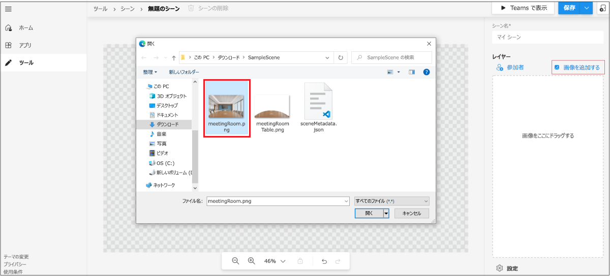

# <a name="custom-together-mode-scenes-in-teams"></a>Teams でのカスタム Together モードのシーン

ユーザー設定の一緒にモード Microsoft Teams、次のアクションで臨場感のある魅力的な会議環境を提供します。

* ユーザーを集め、ビデオを有効にしてください。 
* 参加者をデジタルで 1 つの仮想シーンに結合します。 
* 参加者のビデオ ストリームを、シーン作成者によって設計および固定された事前に決定されたシートに配置します。

> [!VIDEO https://www.youtube-nocookie.com/embed/MGsNmYKgeTA]

カスタムの Together Mode シーンでは、シーンはアーティファクトです。 シーンは、Microsoft Scene studio を使用してシーン開発者によって作成されます。 考え出されたシーンの設定では、参加者はビデオ ストリームを持つシートを持っています。 これらのシートでビデオがレンダリングされます。 このようなアプリのエクスペリエンスが明確な場合は、シーンのみアプリをお勧めします。

次のプロセスでは、シーン専用アプリを作成する概要を示します。

:::image type="content" source="../assets/images/apps-in-meetings/create-together-mode-scene-flow.png" alt-text="シーン専用アプリを作成する" border="false":::

シーンのみアプリは、アプリ内のアプリMicrosoft Teams。 Scene studio は、バックグラウンドでアプリ パッケージの作成を処理します。 1 つのアプリ パッケージ内の複数のシーンが、ユーザーにフラット リストとして表示されます。

> [!NOTE]
> ユーザーはモバイルから一緒にモードを開始できません。 ただし、ユーザーがモバイル経由で会議に参加し、デスクトップから一緒にモードをオンにすると、ビデオをオンにしたモバイル ユーザーはデスクトップの Together Mode に表示されます。 

## <a name="prerequisites"></a>前提条件

カスタムの Together Mode シーンを使用するには、次の基本的な知識が必要です。

* シーン内のシーンとシートを定義します。
* Microsoft Developer アカウントを持ち、開発者ポータルと App Studio Microsoft Teams[を](../concepts/build-and-test/teams-developer-portal.md)理解してください。
* アプリの [サイドローディングの概念を理解します](../concepts/deploy-and-publish/apps-upload.md)。
* 管理者がカスタム アプリを作成するためのアクセス許可をアップロードし [**、**](../concepts/deploy-and-publish/apps-upload.md)それぞれアプリセットアップポリシーと会議ポリシーの一部としてすべてのフィルターを選択します。

## <a name="best-practices"></a>ベスト プラクティス

シーン構築エクスペリエンスでは、次のプラクティスを検討してください。

* すべての画像が PNG 形式で表示されます。
* すべてのイメージを組み合わせて最終的なパッケージが 1920x1080 解像度を超えないようにしてください。 解像度は、1 つの数値です。 この解像度は、シーンを正常に表示する必要があります。
* シーンの最大サイズが 10 MB である必要があります。
* 各イメージの最大サイズが 5 MB である必要があります。 シーンは、複数の画像のコレクションです。 制限は、個々のイメージに対してです。
* 必要に応じて [ **透過] を** 選択します。 このチェック ボックスは、画像が選択されている場合に右側のパネルで使用できます。 重なり合うイメージは、シーン **内の** イメージが重なっているかどうかを示すために、透明としてマークする必要があります。

## <a name="build-a-scene-using-the-scene-studio"></a>シーン スタジオを使用してシーンを構築する

Microsoft には、シーンを構築できる Scene スタジオがあります。 これは、Scenes [Editor - 開発者ポータルでTeams利用できます](https://dev.teams.microsoft.com/scenes)。 このドキュメントは、開発者ポータルの Scene studio Microsoft Teamsします。 App Studio シーン デザイナーでは、インターフェイスと機能はすべて同じです。

シーン スタジオのコンテキスト内のシーンは、次の要素を含むアーティファクトです。

* 会議の開催者および会議の発表者用に予約されているシート。 発表者は、積極的に共有しているユーザーを参照しない。 会議の役割 [を参照します](https://support.microsoft.com/en-us/office/roles-in-a-teams-meeting-c16fa7d0-1666-4dde-8686-0a0bfe16e019)。

* 幅と高さを調整できる各参加者のシートとイメージ。 画像では PNG 形式だけがサポートされています。

* すべてのシートと画像の XYZ 座標。

* 1 つのイメージとしてカモフラージュされた画像のコレクション。

次の図は、シーンを構築するアバターとして表される各シートを示しています。


**シーン スタジオを使用してシーンを作成するには**

1. [シーン[エディター] - [開発者ポータルTeams] に移動します](https://dev.teams.microsoft.com/scenes)。

    または、Scene studio を開くには、開発者ポータルのホーム[Teams移動できます](https://dev.teams.microsoft.com/home)。
    * [会議 **用のカスタム シーンの作成] を選択します**。
    * 左側 **のセクション** から [ツール] を選択し、[ツール] セクションから **[シーン スタジオ****] を選択** します。

1. [ **シーン エディター] で、[** 新しい **シーンを作成する] を選択します**。

1. [ **シーン名]** に、シーンの名前を入力します。

    * [閉じる] **を選択** すると、右側のウィンドウを閉じるか再度開くか切り替えます。
    * ズーム バーを使用してシーンを拡大または縮小して、シーンをより良く表示できます。

1. [イメージ **の追加]** を選択して、イメージを環境に追加します。

    

    >[!NOTE]
    > * イメージを [ 含むSampleScene.zip](https://github.com/MicrosoftDocs/msteams-docs/tree/master/msteams-platform/apps-in-teams-meetings/SampleScene.zip) ファイル [SampleApp.zip](https://github.com/MicrosoftDocs/msteams-docs/tree/master/msteams-platform/apps-in-teams-meetings/SampleApp.zip) ダウンロードできます。

1. 追加した画像を選択します。

1. 右側のウィンドウで、画像の配置を選択するか、[サイズ変更] を使用 **して** 画像のサイズを調整します。

    

1. 画像の外側の領域を選択します。

1. 右上隅で、[レイヤー] の下の [ **参加者]** **を選択します**。

1. [参加者数] ボックスからシーンの参加者数を選択し、[追加] を **選択します**。 シーンが出荷された後、アバターの配置は実際の参加者のビデオ ストリームに置き換えられる。 参加者の画像をシーンの周囲にドラッグし、必要な位置に配置できます。 サイズ変更矢印を使用してサイズを変更できます。

1. 参加者のイメージを選択し、[スポットの **割** り当て] を選択して、そのスポットを参加者に割り当てる。

1. 参加者の **[会議の開催者****] または [発表** 者] の役割を選択します。 会議では、1 人の参加者に会議開催者の役割を割り当てる必要があります。

    

1. [**保存] を** 選択し **、[Teams]** を選択して、シーンをすばやくテストMicrosoft Teams。

    * [アプリ **で表示Teams** すると、Microsoft Teams開発者ポータルの [アプリ] ページで表示できるアプリがTeamsされます。
    * [アプリ **で表示Teams** すると、appmanifest.json であるアプリ パッケージが自動的に作成されます。 メニューから [アプリ]  **に** 移動し、自動的に作成されたアプリ パッケージにアクセスできます。
    * 作成したシーンを削除するには、トップ バー **の [シーンの** 削除] を選択します。

1. [**ビューイン Teams]** で、[**プレビュー] を選択Teams。**
1. 表示されるダイアログ ボックスで、[追加] を **選択します**。

    このシーンは、テスト会議を作成し、カスタムの Together Mode シーンを起動することでテストまたはアクセスされます。 詳細については、「Custom [Together Mode scenes をアクティブ化する」を参照してください](#activate-custom-together-mode-scenes)。

    

    その後、カスタムの Together Mode シーン ギャラリーでシーンを表示できます。

必要に応じて、[保存] **ドロップダウン** メニュー **から [共有** ] を選択できます。 共有可能なリンクを作成して、他のユーザーが使用するシーンを配布できます。 ユーザーは、リンクを開いてシーンをインストールし、使用を開始できます。

プレビュー後、シーンはアプリ申請の手順に従ってTeamsアプリとして出荷されます。 この手順では、アプリ パッケージが必要です。 アプリ パッケージは、設計されたシーンのシーン パッケージとは異なります。 自動的に作成されるアプリ パッケージは、開発者センターの [アプリ] セクションTeams表示されます。

必要に応じて、[保存] ドロップダウン メニューから[エクスポート] を選択して、シーン パッケージを取得します。 シーン **.zip** ファイルがダウンロードされます。 シーン パッケージには、scene.json と、シーンの作成に使用される PNG アセットが含まれます。 シーン パッケージは、他の変更を組み込む場合に確認されます。


Z 軸を使用する複雑なシーンは、ステップ バイ ステップの開始サンプルで示されています。

## <a name="sample-scenejson"></a>サンプル scene.json

Scene.json とイメージは、シートの正確な位置を示します。 シーンは、参加者のビデオを入れるビットマップ イメージ、スプライト、長方形で構成されます。 これらのスプライトと参加者ボックスは、ワールド座標系で定義されます。 X 軸は右をポイントし、Y 軸は下方向をポイントします。

カスタム一緒にモード シーンは、現在の参加者の拡大をサポートします。 この機能は、大規模なシーンでの小規模な会議に役立ちます。 スプライトは、世界に配置された静的なビットマップ イメージです。 スプライトの Z 値は、スプライトの位置を決定します。 レンダリングは、Z 値が最も低いスプライトから始まるので、Z 値が高いほどカメラに近くなります。 各参加者には独自のビデオ フィードが用意されています。これはセグメント化され、フォアグラウンドだけがレンダリングされます。

次のコードは、scene.json サンプルです。

```json
{
   "protocolVersion": "1.0",
   "id": "A",
   "autoZoom": true,
   "mirrorParticipants ": true,
   "extent":{
      "left":0.0,
      "top":0.0,
      "width":16.0,
      "height":9.0
   },
   "sprites":[
      {
         "filename":"background.png",
         "cx":8.0,
         "cy":4.5,
         "width":16.0,
         "height":9.0,
         "zOrder":0.0,
   "isAlpha":false
      },
      {
         "filename":"table.png",
         "cx":8.0,
         "cy":7.0,
         "width":12.0,
         "height":4.0,
         "zOrder":3.0,
   "isAlpha":true
      },
      {
         "filename":"row0.png",
         "cx":12.0,
         "cy":15.0,
         "width":8.0,
         "height":4.0,
         "zOrder":2.0,
   "isAlpha":true
      }

   ],
   "participants":[
      {
         "cx":5.0,
         "cy":4.0,
         "width":4.0,
         "height":2.25,
         "zOrder":1.0,
         "seatingOrder":0
      },
      {
         "cx":11.0,
         "cy":4.0,
         "width":4.0,
         "height":2.25,
         "zOrder":1.0,
         "seatingOrder":1
      }
   ]
}
```

各シーンには一意の ID と名前があります。 シーン JSON には、シーンに使用されるすべてのアセットに関する情報も含まれる。 各アセットには、X 軸と Y 軸上のファイル名、幅、高さ、位置が含まれる。 同様に、各シートには、シート ID、幅、高さ、X 軸と Y 軸上の位置が含まれる。 座席の順序は自動的に生成され、好みに応じ変更されます。 座席の順序番号は、通話に参加するユーザーの順序に対応します。

画像 `zOrder` とシートを Z 軸に沿って配置する順序を表します。 必要に応じて、深さまたはパーティションの感覚を与えます。 詳しくは、ステップ バイ ステップの開始サンプルをご覧ください。 サンプルでは、 を使用 `zOrder` します。

サンプル scene.json を実行したので、カスタムの Together Mode シーンをアクティブ化してシーンに参加できます。

## <a name="activate-custom-together-mode-scenes"></a>カスタムの一緒にモードのシーンをアクティブ化する

ユーザーがカスタムの Together Mode シーンでシーンを使用する方法の詳細については、次の情報を参照してください。

**シーンを選択し、カスタムの Together Mode シーンをアクティブにするには**

1. 新しいテスト会議を作成します。

    >[!NOTE]
    > シーン スタジオで **[プレビュー** ] を選択すると、シーンはアプリとしてアプリとしてインストールMicrosoft Teams。 これは、開発者がシーン スタジオからシーンをテストおよび試用するモデルです。 シーンがアプリとして出荷された後、ユーザーはシーン ギャラリーにこれらのシーンを表示します。

1. 左上隅 **の [** ギャラリー] ドロップダウンから、[一緒にモード] **を選択します**。 [ **ピッカー]** ダイアログ ボックスが表示され、追加されたシーンを使用できます。

1. [シーン **の変更] を** 選択して、既定のシーンを変更します。

1. [シーン **ギャラリー] で**、会議に使用するシーンを選択します。

    必要に応じて、会議の開催者と発表者は、会議 **のすべての** 参加者のシーンを変更できます。

    >[!NOTE]
    > 任意の時点で、会議に同種のシーンが 1 つしか使用されません。 発表者または開催者がシーンを変更すると、すべてのシーンが変更されます。 カスタムの Together Mode シーンの切り替えと切り替えは、個々の参加者に対して行いますが、カスタムの Together Mode シーンでは、すべての参加者が同じシーンを持っています。

1. **[適用]** を選択します。 Teamsアプリをインストールし、シーンを適用します。

## <a name="open-a-custom-together-mode-scenes-scene-package"></a>カスタムの一緒にモードのシーン を開く シーン パッケージ

シーン スタジオから取得したファイル.zipシーン パッケージを他のクリエイターと共有して、シーンをさらに強化できます。 [ **シーンのインポート]** 機能は、シーン パッケージのラップを解除して、作成者がシーンを構築し続けるのに役立ちます。


## <a name="see-also"></a>関連項目

[会議のTeamsアプリ](teams-apps-in-meetings.md) 
[通話と会議ボット](~/bots/calls-and-meetings/calls-meetings-bots-overview.md) 
[リアルタイムのメディア通話と会議と会議Microsoft Teams](~/bots/calls-and-meetings/real-time-media-concepts.md)
