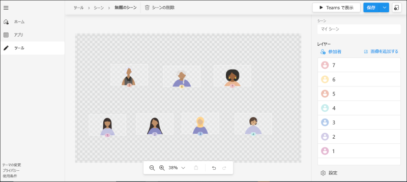
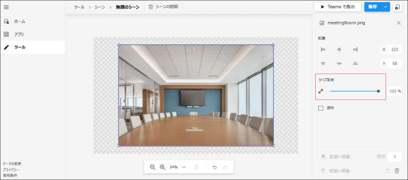
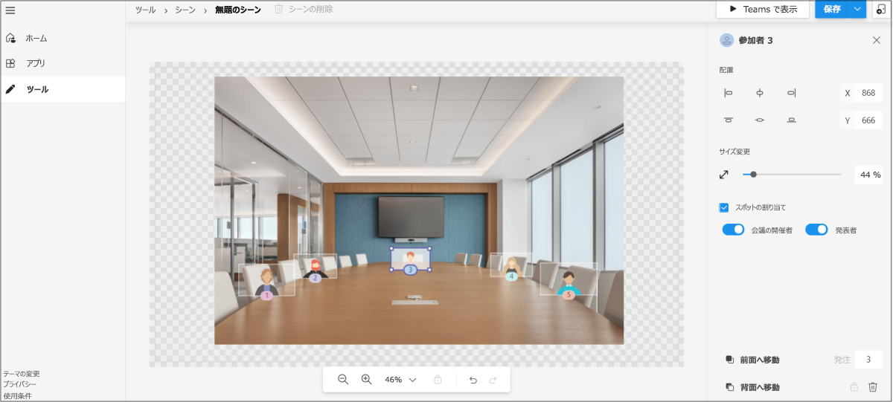
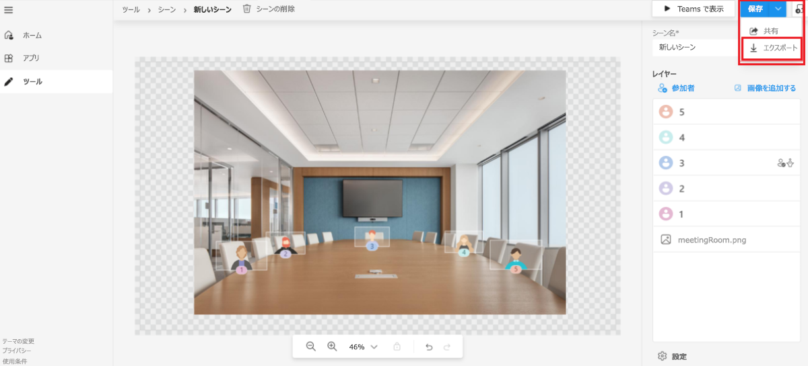
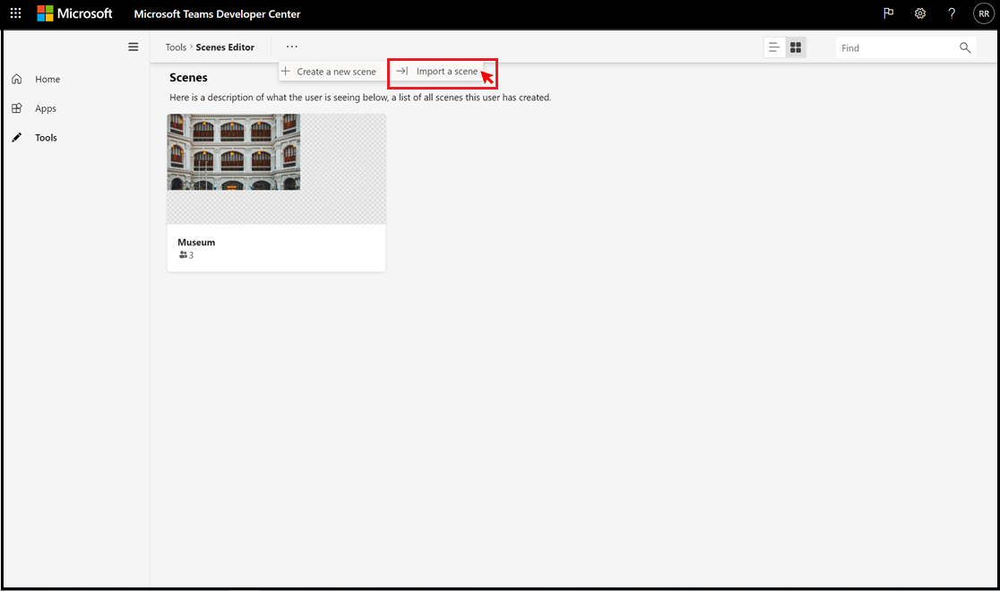

# <a name="custom-together-mode-scenes-in-teams"></a><span data-ttu-id="8fb7e-103">Teams でのカスタム Together モードのシーン</span><span class="sxs-lookup"><span data-stu-id="8fb7e-103">Custom Together Mode scenes in Teams</span></span>

> [!NOTE]
> <span data-ttu-id="8fb7e-104">この機能は現在、パブリック開発者 [プレビューでのみ利用](../resources/dev-preview/developer-preview-intro.md) できます。</span><span class="sxs-lookup"><span data-stu-id="8fb7e-104">This feature is currently available in [public developer preview](../resources/dev-preview/developer-preview-intro.md) only.</span></span>

<span data-ttu-id="8fb7e-105">カスタム 一緒にモード Microsoft Teamsは、ユーザーを集め、ビデオを有効にすすめ、臨場感のある魅力的な会議環境を提供します。</span><span class="sxs-lookup"><span data-stu-id="8fb7e-105">Custom Together Mode scenes in Microsoft Teams provides an immersive and engaging meeting environment that brings people together and encourages them to turn on their video.</span></span> <span data-ttu-id="8fb7e-106">参加者を 1 つの仮想シーンにデジタル的に組み合わせ、シーン作成者によって設計および固定された事前に決定されたシートにビデオ ストリームを設定します。</span><span class="sxs-lookup"><span data-stu-id="8fb7e-106">It digitally combines participants into a single virtual scene and places their video streams in pre-determined seats designed and fixed by the scene creator.</span></span>

> [!VIDEO https://www.youtube-nocookie.com/embed/MGsNmYKgeTA]

<span data-ttu-id="8fb7e-107">カスタムの Together Mode シーンのシーンは、Microsoft Scene studio を使用してシーン開発者によって作成されたアーティファクトです。</span><span class="sxs-lookup"><span data-stu-id="8fb7e-107">A scene in custom Together Mode scenes is an artifact created by the scene developer using the Microsoft Scene studio.</span></span> <span data-ttu-id="8fb7e-108">考え出されたシーンの設定では、参加者は指定されたシートを持ち、それらのシートにビデオ ストリームがレンダリングされます。</span><span class="sxs-lookup"><span data-stu-id="8fb7e-108">In a conceived scene setting, participants have designated seats with video streams rendered in those seats.</span></span>

> [!NOTE]
> <span data-ttu-id="8fb7e-109">シーンのみアプリは、このようなアプリの取得エクスペリエンスがシームレスに行なうので、お勧めします。</span><span class="sxs-lookup"><span data-stu-id="8fb7e-109">Scene only apps are recommended as the acquisition experience for such apps is more seamless.</span></span>

<span data-ttu-id="8fb7e-110">次のプロセスでは、シーン専用アプリを作成する概要を示します。</span><span class="sxs-lookup"><span data-stu-id="8fb7e-110">The following process gives an overview to create a scene only app:</span></span>

:::image type="content" source="../assets/images/apps-in-meetings/create-together-mode-scene-flow.png" alt-text="シーン専用アプリを作成する" border="false":::

> [!NOTE]
> * <span data-ttu-id="8fb7e-112">シーンのみアプリは、アプリ内のアプリMicrosoft Teams。</span><span class="sxs-lookup"><span data-stu-id="8fb7e-112">A scene only app is still an app in Microsoft Teams.</span></span> <span data-ttu-id="8fb7e-113">Scene studio は、バックグラウンドでアプリ パッケージの作成を処理します。</span><span class="sxs-lookup"><span data-stu-id="8fb7e-113">The Scene studio handles the app package creation in the background.</span></span>
> * <span data-ttu-id="8fb7e-114">1 つのアプリ パッケージ内の複数のシーンは、ユーザーに対してフラット なシーンの一覧として表示されます。</span><span class="sxs-lookup"><span data-stu-id="8fb7e-114">Multiple scenes in a single app package appear as a flat list of scenes to users.</span></span>

## <a name="prerequisites"></a><span data-ttu-id="8fb7e-115">前提条件</span><span class="sxs-lookup"><span data-stu-id="8fb7e-115">Prerequisites</span></span>

<span data-ttu-id="8fb7e-116">カスタムの Together Mode シーンを使用するには、次の基本的な知識が必要です。</span><span class="sxs-lookup"><span data-stu-id="8fb7e-116">You must have a basic understanding of the following to use custom Together Mode scenes:</span></span>

* <span data-ttu-id="8fb7e-117">シーン内のシーンとシートの定義。</span><span class="sxs-lookup"><span data-stu-id="8fb7e-117">Definition of scene and seats in a scene.</span></span>
* <span data-ttu-id="8fb7e-118">Microsoft Developer アカウントを持ち、開発者ポータルと App Studio Microsoft Teams[を](../concepts/build-and-test/teams-developer-portal.md)理解してください。</span><span class="sxs-lookup"><span data-stu-id="8fb7e-118">Have a Microsoft Developer account and be familiar with the Microsoft Teams [Developer Portal](../concepts/build-and-test/teams-developer-portal.md) and App Studio.</span></span>
* <span data-ttu-id="8fb7e-119">[アプリのサイドローディングの概念](../concepts/deploy-and-publish/apps-upload.md)。</span><span class="sxs-lookup"><span data-stu-id="8fb7e-119">[Concept of app sideloading](../concepts/deploy-and-publish/apps-upload.md).</span></span>
* <span data-ttu-id="8fb7e-120">管理者がカスタム アプリに対するアクセス許可をアップロードし [**、**](../concepts/deploy-and-publish/apps-upload.md)アプリセットアップポリシーと会議ポリシーの一部としてすべてのフィルターを選択する権限を付与します。</span><span class="sxs-lookup"><span data-stu-id="8fb7e-120">Ensure that the Administrator has granted permission to [**Upload a custom app**](../concepts/deploy-and-publish/apps-upload.md) and to select all filters as part of App Setup and Meeting policies respectively.</span></span>

## <a name="best-practices"></a><span data-ttu-id="8fb7e-121">ベスト プラクティス</span><span class="sxs-lookup"><span data-stu-id="8fb7e-121">Best practices</span></span>

<span data-ttu-id="8fb7e-122">シーンを構築する前に、シームレスなシーン構築エクスペリエンスを備える次の点を検討してください。</span><span class="sxs-lookup"><span data-stu-id="8fb7e-122">Prior to building a scene, consider the following to have a seamless scene building experience:</span></span>

* <span data-ttu-id="8fb7e-123">すべての画像が PNG 形式で表示されます。</span><span class="sxs-lookup"><span data-stu-id="8fb7e-123">Ensure that all images are in PNG format.</span></span>
* <span data-ttu-id="8fb7e-124">すべてのイメージを組み合わせて最終的なパッケージが 1920x1080 解像度を超えないようにしてください。</span><span class="sxs-lookup"><span data-stu-id="8fb7e-124">Ensure that the final package with all the images put together must not exceed 1920x1080 resolution.</span></span>

    > [!NOTE]
    > <span data-ttu-id="8fb7e-125">解像度は、1 つの数値です。</span><span class="sxs-lookup"><span data-stu-id="8fb7e-125">The resolution is an even number.</span></span> <span data-ttu-id="8fb7e-126">これは、シーンを正常に点灯する必要があります。</span><span class="sxs-lookup"><span data-stu-id="8fb7e-126">This is a requirement for scenes to be lit up successfully.</span></span>

* <span data-ttu-id="8fb7e-127">シーンの最大サイズが 10 MB である必要があります。</span><span class="sxs-lookup"><span data-stu-id="8fb7e-127">Ensure that the maximum scene size is 10 MB.</span></span>
* <span data-ttu-id="8fb7e-128">各イメージの最大サイズが 5 MB である必要があります。</span><span class="sxs-lookup"><span data-stu-id="8fb7e-128">Ensure that the maximum size of each image is 5 MB.</span></span>

    > [!NOTE]
    > * <span data-ttu-id="8fb7e-129">シーンは、複数の画像のコレクションです。</span><span class="sxs-lookup"><span data-stu-id="8fb7e-129">A scene is a collection of multiple images.</span></span> <span data-ttu-id="8fb7e-130">制限は、個々のイメージに対してです。</span><span class="sxs-lookup"><span data-stu-id="8fb7e-130">The limit is for each individual image.</span></span>
    > * <span data-ttu-id="8fb7e-131">個々の画像解像度も、数値である必要があります。</span><span class="sxs-lookup"><span data-stu-id="8fb7e-131">The individual image resolution must also be an even number.</span></span>
  
* <span data-ttu-id="8fb7e-132">イメージが透明 **な場合** は、[透過] チェック ボックスがオンになっていることを確認します。</span><span class="sxs-lookup"><span data-stu-id="8fb7e-132">Ensure that the **Transparent** checkbox is selected if the image is transparent.</span></span> <span data-ttu-id="8fb7e-133">このチェック ボックスは、画像が選択されている場合に右側のパネルで使用できます。</span><span class="sxs-lookup"><span data-stu-id="8fb7e-133">This checkbox is available on the right panel when an image is selected.</span></span>

    > [!NOTE]
    > <span data-ttu-id="8fb7e-134">重なり合うイメージは、シーン内のイメージ **が** 重なっているかどうかを示すために、透明としてマークする必要があります。</span><span class="sxs-lookup"><span data-stu-id="8fb7e-134">Overlapping images need to be marked as **Transparent** to indicate that they are overlapping images in the scene.</span></span>

## <a name="build-a-scene-using-the-scene-studio"></a><span data-ttu-id="8fb7e-135">シーン スタジオを使用してシーンを構築する</span><span class="sxs-lookup"><span data-stu-id="8fb7e-135">Build a scene using the Scene studio</span></span>

<span data-ttu-id="8fb7e-136">Microsoft には、シーンを構築できる Scene スタジオがあります。</span><span class="sxs-lookup"><span data-stu-id="8fb7e-136">Microsoft has a Scene studio that allows you to build scenes.</span></span> <span data-ttu-id="8fb7e-137">これは[、Scenes Editor - 開発者ポータルでTeams使用できます](https://dev.teams.microsoft.com/scenes)。</span><span class="sxs-lookup"><span data-stu-id="8fb7e-137">It is available on [Scenes Editor - Teams Developer Portal](https://dev.teams.microsoft.com/scenes).</span></span>

> [!NOTE]
> <span data-ttu-id="8fb7e-138">このドキュメントは、開発者ポータルの Scene studio をMicrosoft Teamsしています。</span><span class="sxs-lookup"><span data-stu-id="8fb7e-138">This document is referring to Scene studio in the Microsoft Teams Developer Portal.</span></span> <span data-ttu-id="8fb7e-139">App Studio シーン デザイナーでは、インターフェイスと機能はすべて同じです。</span><span class="sxs-lookup"><span data-stu-id="8fb7e-139">The interface and functionalities are all the same in App Studio Scene Designer.</span></span>

<span data-ttu-id="8fb7e-140">シーン スタジオのコンテキスト内のシーンは、次のアイテムを含むアーティファクトです。</span><span class="sxs-lookup"><span data-stu-id="8fb7e-140">A scene in the context of the Scene studio is an artifact that contains the following:</span></span>

* <span data-ttu-id="8fb7e-141">会議の開催者および会議の発表者用に予約されているシート。</span><span class="sxs-lookup"><span data-stu-id="8fb7e-141">Seats reserved for meeting organizer and meeting presenters.</span></span>

    > [!NOTE]
    > <span data-ttu-id="8fb7e-142">発表者は、アクティブに共有しているユーザーを参照しない。</span><span class="sxs-lookup"><span data-stu-id="8fb7e-142">Presenter does not refer to the user who is actively sharing.</span></span> <span data-ttu-id="8fb7e-143">会議の役割 [を参照します](https://support.microsoft.com/en-us/office/roles-in-a-teams-meeting-c16fa7d0-1666-4dde-8686-0a0bfe16e019)。</span><span class="sxs-lookup"><span data-stu-id="8fb7e-143">It refers to the [meeting role](https://support.microsoft.com/en-us/office/roles-in-a-teams-meeting-c16fa7d0-1666-4dde-8686-0a0bfe16e019).</span></span>

* <span data-ttu-id="8fb7e-144">幅と高さを調整できる各参加者のシートとイメージ。</span><span class="sxs-lookup"><span data-stu-id="8fb7e-144">Seat and image for each participant with an adjustable width and height.</span></span>

    > [!NOTE]
    > <span data-ttu-id="8fb7e-145">PNG は、サポートされている唯一の形式です。</span><span class="sxs-lookup"><span data-stu-id="8fb7e-145">PNG is the only supported format.</span></span>

* <span data-ttu-id="8fb7e-146">すべてのシートと画像の XYZ 座標。</span><span class="sxs-lookup"><span data-stu-id="8fb7e-146">XYZ coordinates of all the seats and images.</span></span>
* <span data-ttu-id="8fb7e-147">1 つのイメージとしてカモフラージュされた画像のコレクション。</span><span class="sxs-lookup"><span data-stu-id="8fb7e-147">Collection of images that are camouflaged as one image.</span></span>

<span data-ttu-id="8fb7e-148">シートのサイズは、参加者のビデオ ストリームをレンダリングするキャンバスになります。</span><span class="sxs-lookup"><span data-stu-id="8fb7e-148">The seat dimensions become the canvas for rendering the participant video stream.</span></span> <span data-ttu-id="8fb7e-149">次の図は、シーンを構築するアバターとして表される各シートを示しています。</span><span class="sxs-lookup"><span data-stu-id="8fb7e-149">The following image shows each seat represented as an avatar for building scenes:</span></span>



<span data-ttu-id="8fb7e-151">**シーン スタジオを使用してシーンを作成するには**</span><span class="sxs-lookup"><span data-stu-id="8fb7e-151">**To build a scene using the Scene studio**</span></span>

1. <span data-ttu-id="8fb7e-152">[シーン[エディター] - [開発者ポータルTeams] に移動します](https://dev.teams.microsoft.com/scenes)。</span><span class="sxs-lookup"><span data-stu-id="8fb7e-152">Go to [Scenes Editor - Teams Developer Portal](https://dev.teams.microsoft.com/scenes).</span></span>

    >[!NOTE]
    > * <span data-ttu-id="8fb7e-153">Scene studio を開く場合は、開発者ポータルのホーム ページにTeamsし、[会議用のカスタム シーン [の作成](https://dev.teams.microsoft.com/home)]**を選択します**。</span><span class="sxs-lookup"><span data-stu-id="8fb7e-153">To open Scene studio, you can navigate to the home page of [Teams Developer Portal](https://dev.teams.microsoft.com/home) and select **Create custom scenes for meetings**.</span></span>
    > * <span data-ttu-id="8fb7e-154">Scene studio を開く場合は [、Teams Developer Portal](https://dev.teams.microsoft.com/home)のホーム ページに移動し、左側のセクションから [ツール] を選択し、[ツール] セクションから [**シーン** スタジオ]**を選択** します。</span><span class="sxs-lookup"><span data-stu-id="8fb7e-154">To open Scene studio, you can navigate to the home page of [Teams Developer Portal](https://dev.teams.microsoft.com/home), select **Tools** from the left hand section, and select **Scene studio** from the **Tools** section.</span></span>

1. <span data-ttu-id="8fb7e-155">[シーン **エディター] ページで、[** 新しい **シーンを作成する] を選択します**。</span><span class="sxs-lookup"><span data-stu-id="8fb7e-155">In the **Scenes Editor** page, select **Create a new scene**.</span></span>

1. <span data-ttu-id="8fb7e-156">[シーン **] ボックス** に、シーンの名前を入力します。</span><span class="sxs-lookup"><span data-stu-id="8fb7e-156">In the **Scene** box, enter a name for the scene.</span></span>

    >[!NOTE]
    > * <span data-ttu-id="8fb7e-157">[閉じる] **を選択** すると、右側のウィンドウを閉じるか再度開くか切り替えます。</span><span class="sxs-lookup"><span data-stu-id="8fb7e-157">You can select **Close** to toggle between closing or reopening the right pane.</span></span>
    > * <span data-ttu-id="8fb7e-158">ズーム バーを使用してシーンを拡大または縮小して、シーンをより良く表示できます。</span><span class="sxs-lookup"><span data-stu-id="8fb7e-158">You can zoom in or zoom out of the scene using the zoom bar for a better view of the scene.</span></span>

1. <span data-ttu-id="8fb7e-159">次の図に表示される環境にイメージをドラッグ アンド ドロップします。</span><span class="sxs-lookup"><span data-stu-id="8fb7e-159">Drag and drop the image into the environment as displayed in the following image:</span></span>

    >[!NOTE]
    > * <span data-ttu-id="8fb7e-160">イメージを [ 含むSampleScene.zip](https://github.com/MicrosoftDocs/msteams-docs/tree/master/msteams-platform/apps-in-teams-meetings/SampleScene.zip) ファイル [SampleApp.zip](https://github.com/MicrosoftDocs/msteams-docs/tree/master/msteams-platform/apps-in-teams-meetings/SampleApp.zip) ダウンロードできます。</span><span class="sxs-lookup"><span data-stu-id="8fb7e-160">You can download the [SampleScene.zip](https://github.com/MicrosoftDocs/msteams-docs/tree/master/msteams-platform/apps-in-teams-meetings/SampleScene.zip) and [SampleApp.zip](https://github.com/MicrosoftDocs/msteams-docs/tree/master/msteams-platform/apps-in-teams-meetings/SampleApp.zip) files with the images.</span></span>
    > * <span data-ttu-id="8fb7e-161">または、[画像の追加] を使用してシーンに背景画像 **を追加することもできます**。</span><span class="sxs-lookup"><span data-stu-id="8fb7e-161">Alternately, you can add background images to the scene using **Add images**.</span></span>

    

1. <span data-ttu-id="8fb7e-163">配置したイメージを選択します。</span><span class="sxs-lookup"><span data-stu-id="8fb7e-163">Select the image that you have placed.</span></span>

1. <span data-ttu-id="8fb7e-164">右側のウィンドウで、画像の配置を選択するか、[サイズ変更] スライダーを使用して画像のサイズを調整します。</span><span class="sxs-lookup"><span data-stu-id="8fb7e-164">From the right pane, select an alignment for the image or use the **Resize** slider to adjust the image size.</span></span>

    

1. <span data-ttu-id="8fb7e-166">画像の外側の領域を選択します。</span><span class="sxs-lookup"><span data-stu-id="8fb7e-166">Select an area outside of the image.</span></span>

1. <span data-ttu-id="8fb7e-167">右上隅で、[レイヤー] の下の [ **参加者]** **を選択します**。</span><span class="sxs-lookup"><span data-stu-id="8fb7e-167">In the upper-right corner, select **Participants** under **Layers**.</span></span>

1. <span data-ttu-id="8fb7e-168">[参加者数] ボックスからシーンの参加者数を選択し、[追加] を **選択します**。</span><span class="sxs-lookup"><span data-stu-id="8fb7e-168">Select the number of participants for the scene from the **Number of participants** box, and select **Add**.</span></span>

    >[!NOTE]
    > * <span data-ttu-id="8fb7e-169">シーンが出荷された後、アバターの配置は実際の参加者のビデオ ストリームに置き換えられる。</span><span class="sxs-lookup"><span data-stu-id="8fb7e-169">After the scene is shipped, the avatar placements are replaced with actual participant's video streams.</span></span>
    > * <span data-ttu-id="8fb7e-170">参加者の画像をシーンの周りにドラッグし、必要な位置に配置し、サイズ変更矢印を使用してサイズを変更できます。</span><span class="sxs-lookup"><span data-stu-id="8fb7e-170">You can drag the participant images around the scene and place them in the required position and resize them using the resize arrow.</span></span>

1. <span data-ttu-id="8fb7e-171">参加者の画像を選択し、[スポット **の割** り当て] チェック ボックスをオンにして、参加者にスポットを割り当てる。</span><span class="sxs-lookup"><span data-stu-id="8fb7e-171">Select any participant image, and select the **Assign Spot** check box to assign the spot to the participant.</span></span>

1. <span data-ttu-id="8fb7e-172">参加者の **[会議の開催者\*\*\*\*] または [発表** 者] の役割を選択します。</span><span class="sxs-lookup"><span data-stu-id="8fb7e-172">Select **Meeting Organizer** or **Presenter** role for the participant.</span></span>

    >[!NOTE]
    > <span data-ttu-id="8fb7e-173">会議では、1 人の参加者に会議開催者の役割を割り当てる必要があります。</span><span class="sxs-lookup"><span data-stu-id="8fb7e-173">In a meeting, one participant must be assigned the role of a meeting organizer.</span></span>

    

1. <span data-ttu-id="8fb7e-175">[**保存] を** 選択し **、[Teams]** を選択して、シーンをすばやくテストMicrosoft Teams。</span><span class="sxs-lookup"><span data-stu-id="8fb7e-175">Select **Save** and select **View in Teams** to quickly test your scene in Microsoft Teams.</span></span>

    >[!NOTE]
    > * <span data-ttu-id="8fb7e-176">[アプリ **で表示Teams** すると、Microsoft Teams開発者ポータルの [アプリ] ページで表示できるアプリがTeamsされます。</span><span class="sxs-lookup"><span data-stu-id="8fb7e-176">Selecting **View in Teams** automatically creates a Microsoft Teams app that can be viewed in the **Apps** page in the Teams Developer Portal.</span></span>
    > * <span data-ttu-id="8fb7e-177">[ビュー **] を選択Teams、** アプリ パッケージが自動的に作成され、appmanifest.jsに表示されます。</span><span class="sxs-lookup"><span data-stu-id="8fb7e-177">Selecting **View in Teams** automatically creates an app package that is appmanifest.json behind the scene.</span></span> <span data-ttu-id="8fb7e-178">前に説明したように、これは抽象化されますが、メニューから [アプリ] に移動すると、自動的に作成された **アプリ** パッケージにアクセスできます。</span><span class="sxs-lookup"><span data-stu-id="8fb7e-178">As stated earlier, this is abstracted, but you can access the automatically created app package by navigating to **Apps** from the menu.</span></span>
    > * <span data-ttu-id="8fb7e-179">作成したシーンを削除するには、トップ バー **の [シーンの** 削除] を選択します。</span><span class="sxs-lookup"><span data-stu-id="8fb7e-179">To delete a scene you created, select **Delete scene** on the top bar.</span></span>

1. <span data-ttu-id="8fb7e-180">表示されるダイアログ ボックスで、[追加] を **選択します**。</span><span class="sxs-lookup"><span data-stu-id="8fb7e-180">In the dialog box that appears, select **Add**.</span></span>

    <span data-ttu-id="8fb7e-181">テスト会議を作成し、カスタムの Together Mode シーンを起動することで、シーンをテストまたはアクセスできます。</span><span class="sxs-lookup"><span data-stu-id="8fb7e-181">The scene can be tested or accessed by creating a test meeting and launching custom Together Mode scenes.</span></span> <span data-ttu-id="8fb7e-182">詳細については、「Custom [Together Mode scenes をアクティブ化する」を参照してください](#activate-custom-together-mode-scenes)。</span><span class="sxs-lookup"><span data-stu-id="8fb7e-182">For more information, see [activate custom Together Mode scenes](#activate-custom-together-mode-scenes).</span></span>

    

    >[!NOTE]
    > * <span data-ttu-id="8fb7e-184">シーンは、カスタムの Together Mode シーン ギャラリーで表示できます。</span><span class="sxs-lookup"><span data-stu-id="8fb7e-184">The scene can be viewed in the custom Together Mode scenes gallery.</span></span>

1. <span data-ttu-id="8fb7e-185">必要に応じて、[保存] ドロップダウンメニューから [共有] を選択して共有可能なリンクを作成し、他のユーザーが使用するシーンを簡単に配布できます。</span><span class="sxs-lookup"><span data-stu-id="8fb7e-185">Optionally, you can select **Share** from the **Save** drop-down menu to create a shareable link to easily distribute your scenes for others to use.</span></span> <span data-ttu-id="8fb7e-186">このリンクを開くと、ユーザーのシーンがインストールされ、使用を開始できます。</span><span class="sxs-lookup"><span data-stu-id="8fb7e-186">Opening this link installs the scene for the user and they can start using it.</span></span>

1. <span data-ttu-id="8fb7e-187">プレビュー後、アプリの申請の手順に従って、Teamsをアプリとして出荷できます。</span><span class="sxs-lookup"><span data-stu-id="8fb7e-187">After preview, the scene can be shipped as an app to Teams by following the steps for app submission.</span></span>

    >[!NOTE]
    > <span data-ttu-id="8fb7e-188">この手順では、設計されたシーンに対して、シーン パッケージとは異なるアプリ パッケージが必要です。</span><span class="sxs-lookup"><span data-stu-id="8fb7e-188">This step requires the app package that is different from the scene package, for the scene that was designed.</span></span> <span data-ttu-id="8fb7e-189">自動的に作成されるアプリ パッケージは、開発者センターの [アプリ] セクションTeams表示されます。</span><span class="sxs-lookup"><span data-stu-id="8fb7e-189">The app package created automatically can be found in the **Apps** section in the Teams Developer Center.</span></span>

1. <span data-ttu-id="8fb7e-190">必要に応じて、[保存] ドロップダウン メニューから[エクスポート]を選択して、シーン パッケージを取得できます。</span><span class="sxs-lookup"><span data-stu-id="8fb7e-190">Optionally, the scene package can be retrieved by selecting **Export** from the **Save** drop-down menu.</span></span> <span data-ttu-id="8fb7e-191">シーン .zipファイルがダウンロードされます。</span><span class="sxs-lookup"><span data-stu-id="8fb7e-191">A .zip file, that is the scene package, is downloaded.</span></span>

    

    >[!NOTE]
    > <span data-ttu-id="8fb7e-193">シーン パッケージは、オンscene.jsシーンの構築に使用される PNG アセットで構成されます。</span><span class="sxs-lookup"><span data-stu-id="8fb7e-193">Scene package comprises of a scene.json and the PNG assets used to build a scene.</span></span> <span data-ttu-id="8fb7e-194">シーン パッケージは、このドキュメントの「サンプル ドキュメント」のセクションで説明scene.js変更を組み込む場合に確認できます。</span><span class="sxs-lookup"><span data-stu-id="8fb7e-194">The scene package can be reviewed for incorporating other changes as described in the Sample scene.json section of this document.</span></span>

<span data-ttu-id="8fb7e-195">Z 軸を活用するより複雑なシーンについては、ステップ バイ ステップの開始サンプルで説明します。</span><span class="sxs-lookup"><span data-stu-id="8fb7e-195">A more complex scene that leverages the Z-axis is demonstrated in the step-by-step getting started sample.</span></span>

## <a name="sample-scenejson"></a><span data-ttu-id="8fb7e-196">サンプル scene.jsオン</span><span class="sxs-lookup"><span data-stu-id="8fb7e-196">Sample scene.json</span></span>

<span data-ttu-id="8fb7e-197">Scene.jsと共にオンに設定すると、シートの正確な位置が示されます。</span><span class="sxs-lookup"><span data-stu-id="8fb7e-197">Scene.json along with the images indicate the exact position of the seats.</span></span> <span data-ttu-id="8fb7e-198">シーンは、参加者のビデオを入れるビットマップ イメージ、スプライト、長方形で構成されます。</span><span class="sxs-lookup"><span data-stu-id="8fb7e-198">A scene consists of bitmap images, sprites, and rectangles to put participant videos in.</span></span> <span data-ttu-id="8fb7e-199">これらのスプライトと参加者ボックスはワールド座標系で定義され、X 軸は右を指し、Y 軸は下向きを指します。</span><span class="sxs-lookup"><span data-stu-id="8fb7e-199">These sprites and participant boxes are defined in a world coordinate system with the X-axis pointing to the right and the Y-axis pointing downwards.</span></span> <span data-ttu-id="8fb7e-200">カスタム一緒にモードシーンは、現在の参加者の拡大をサポートしています。</span><span class="sxs-lookup"><span data-stu-id="8fb7e-200">Custom Together Mode scenes supports zooming in on the current participants.</span></span> <span data-ttu-id="8fb7e-201">これは、大規模なシーンでの小規模な会議に役立ちます。</span><span class="sxs-lookup"><span data-stu-id="8fb7e-201">This is helpful for small meetings in a large scene.</span></span> <span data-ttu-id="8fb7e-202">スプライトは、世界に配置された静的なビットマップ イメージです。</span><span class="sxs-lookup"><span data-stu-id="8fb7e-202">A sprite is a static bitmap image positioned in the world.</span></span> <span data-ttu-id="8fb7e-203">スプライトの Z 値は、スプライトの位置を決定します。</span><span class="sxs-lookup"><span data-stu-id="8fb7e-203">The Z value of the sprite determines the position of the sprite.</span></span> <span data-ttu-id="8fb7e-204">レンダリングは、Z 値が最も低いスプライトから始まるので、Z 値が高いほどカメラに近くなります。</span><span class="sxs-lookup"><span data-stu-id="8fb7e-204">Rendering starts with the sprite with lowest Z value, so higher Z value means it is closer to the camera.</span></span> <span data-ttu-id="8fb7e-205">各参加者は独自のビデオ フィードを持ち、フォアグラウンドのみをレンダリングするためにセグメント化されます。</span><span class="sxs-lookup"><span data-stu-id="8fb7e-205">Each participant has its own video feed, which is segmented so that only the foreground is rendered.</span></span>

<span data-ttu-id="8fb7e-206">サンプルに関するscene.jsを次に示します。</span><span class="sxs-lookup"><span data-stu-id="8fb7e-206">Following is the scene.json sample:</span></span>

```json
{
   "protocolVersion": "1.0",
   "id": "A",
   "autoZoom": true,
   "mirrorParticipants ": true,
   "extent":{
      "left":0.0,
      "top":0.0,
      "width":16.0,
      "height":9.0
   },
   "sprites":[
      {
         "filename":"background.png",
         "cx":8.0,
         "cy":4.5,
         "width":16.0,
         "height":9.0,
         "zOrder":0.0,
   "isAlpha":false
      },
      {
         "filename":"table.png",
         "cx":8.0,
         "cy":7.0,
         "width":12.0,
         "height":4.0,
         "zOrder":3.0,
   "isAlpha":true
      },
      {
         "filename":"row0.png",
         "cx":12.0,
         "cy":15.0,
         "width":8.0,
         "height":4.0,
         "zOrder":2.0,
   "isAlpha":true
      }

   ],
   "participants":[
      {
         "cx":5.0,
         "cy":4.0,
         "width":4.0,
         "height":2.25,
         "zOrder":1.0,
         "seatingOrder":0
      },
      {
         "cx":11.0,
         "cy":4.0,
         "width":4.0,
         "height":2.25,
         "zOrder":1.0,
         "seatingOrder":1
      }
   ]
}
```

<span data-ttu-id="8fb7e-207">各シーンには一意の ID と名前があります。</span><span class="sxs-lookup"><span data-stu-id="8fb7e-207">Each scene has a unique ID and name.</span></span> <span data-ttu-id="8fb7e-208">シーン JSON には、シーンに使用されるすべてのアセットに関する情報も含まれる。</span><span class="sxs-lookup"><span data-stu-id="8fb7e-208">The scene JSON also contains information on all the assets used for the scene.</span></span> <span data-ttu-id="8fb7e-209">各アセットには、X 軸と Y 軸上のファイル名、幅、高さ、位置が含まれる。</span><span class="sxs-lookup"><span data-stu-id="8fb7e-209">Each asset contains a filename, width, height, and position on the X and Y-axis.</span></span> <span data-ttu-id="8fb7e-210">同様に、各シートには、シート ID、幅、高さ、X 軸と Y 軸上の位置が含まれる。</span><span class="sxs-lookup"><span data-stu-id="8fb7e-210">Similarly, each seat contains a seat ID, width, height, and position on the X and Y-axis.</span></span> <span data-ttu-id="8fb7e-211">座席の順序は自動的に生成され、好みに応じ変更できます。</span><span class="sxs-lookup"><span data-stu-id="8fb7e-211">The seating order is generated automatically and can be altered as per preference.</span></span>

> [!NOTE]
> <span data-ttu-id="8fb7e-212">座席の注文番号は、通話に参加するユーザーの順序に対応します。</span><span class="sxs-lookup"><span data-stu-id="8fb7e-212">Seating order number corresponds to the order of people joining the call.</span></span>

<span data-ttu-id="8fb7e-213">zOrder は、Z 軸に沿ってイメージとシートを配置する順序を表します。</span><span class="sxs-lookup"><span data-stu-id="8fb7e-213">The zOrder represents the order of placing images and seats along the Z-axis.</span></span> <span data-ttu-id="8fb7e-214">多くの場合、必要に応じて深さまたはパーティションの感覚を与えます。</span><span class="sxs-lookup"><span data-stu-id="8fb7e-214">In many cases, it gives a sense of depth or partition if required.</span></span> <span data-ttu-id="8fb7e-215">詳細については、ステップ バイ ステップの開始サンプルを参照してください。</span><span class="sxs-lookup"><span data-stu-id="8fb7e-215">For more information, see the step-by-step getting started sample.</span></span> <span data-ttu-id="8fb7e-216">このサンプルでは、zOrder を活用します。</span><span class="sxs-lookup"><span data-stu-id="8fb7e-216">The sample leverages the zOrder.</span></span>

<span data-ttu-id="8fb7e-217">サンプル モードをオンにscene.js、カスタムの Together Mode シーンをアクティブ化してシーンに参加できます。</span><span class="sxs-lookup"><span data-stu-id="8fb7e-217">Now that you have gone through the sample scene.json, you can activate the custom Together Mode scenes to engage in scenes.</span></span>

## <a name="activate-custom-together-mode-scenes"></a><span data-ttu-id="8fb7e-218">カスタムの一緒にモードのシーンをアクティブ化する</span><span class="sxs-lookup"><span data-stu-id="8fb7e-218">Activate custom Together Mode scenes</span></span>

<span data-ttu-id="8fb7e-219">エンド ユーザーがカスタムの Together Mode シーンのシーンとどのように関わるかについて、エンドツーエンドの情報を取得します。</span><span class="sxs-lookup"><span data-stu-id="8fb7e-219">Get end-to-end information of how an end user engages with scenes in custom Together Mode scenes.</span></span>

<span data-ttu-id="8fb7e-220">**シーンを選択し、カスタムの Together Mode シーンをアクティブにするには**</span><span class="sxs-lookup"><span data-stu-id="8fb7e-220">**To select scenes and activate custom Together Mode scenes**</span></span>

1. <span data-ttu-id="8fb7e-221">新しいテスト会議を作成します。</span><span class="sxs-lookup"><span data-stu-id="8fb7e-221">Create a new test meeting.</span></span>

    >[!NOTE]
    > <span data-ttu-id="8fb7e-222">シーン スタジオで **[プレビュー** ] を選択すると、シーンはアプリとしてアプリとしてインストールMicrosoft Teams。</span><span class="sxs-lookup"><span data-stu-id="8fb7e-222">On selecting **Preview** in the Scene studio, the scene is installed as an app in Microsoft Teams.</span></span> <span data-ttu-id="8fb7e-223">これは、開発者がシーン スタジオからシーンをテストおよび試用するモデルです。</span><span class="sxs-lookup"><span data-stu-id="8fb7e-223">This is the model for a developer to test and try out scenes from the Scene studio.</span></span> <span data-ttu-id="8fb7e-224">シーンがアプリとして出荷された後、ユーザーはシーン ギャラリーにこれらのシーンを表示します。</span><span class="sxs-lookup"><span data-stu-id="8fb7e-224">After a scene is shipped as an app, users see these scenes in the scene gallery.</span></span>

1. <span data-ttu-id="8fb7e-225">左上隅 **の [** ギャラリー] ドロップダウンから、[一緒にモード] **を選択します**。</span><span class="sxs-lookup"><span data-stu-id="8fb7e-225">From the **Gallery** drop-down in the upper-left corner, select **Together Mode**.</span></span> <span data-ttu-id="8fb7e-226">[ **ピッカー]** ダイアログ ボックスが表示され、追加されたシーンを使用できます。</span><span class="sxs-lookup"><span data-stu-id="8fb7e-226">The **Picker** dialog box appears and the scene that is added is available.</span></span>

1. <span data-ttu-id="8fb7e-227">[シーン **の変更] を** 選択して、既定のシーンを変更します。</span><span class="sxs-lookup"><span data-stu-id="8fb7e-227">Select **Change scene** to change the default scene.</span></span>

1. <span data-ttu-id="8fb7e-228">[シーン **ギャラリー] で**、会議に使用するシーンを選択します。</span><span class="sxs-lookup"><span data-stu-id="8fb7e-228">From the **Scene Gallery**, select the scene you want to use for your meeting.</span></span>

1. <span data-ttu-id="8fb7e-229">必要に応じて、会議の開催者と発表者は、会議 **のすべての** 参加者のシーンを変更できます。</span><span class="sxs-lookup"><span data-stu-id="8fb7e-229">Optionally, the meeting organizer and presenter can **Change scene for all participants** in the meeting.</span></span>

    >[!NOTE]
    > <span data-ttu-id="8fb7e-230">任意の時点で、会議に同種のシーンを 1 つしか使用できません。</span><span class="sxs-lookup"><span data-stu-id="8fb7e-230">At any point in time, only one scene can be used homogeneously for the meeting.</span></span> <span data-ttu-id="8fb7e-231">発表者または開催者がシーンを変更すると、すべてのシーンが変更されます。</span><span class="sxs-lookup"><span data-stu-id="8fb7e-231">If a presenter or organizer changes a scene, it  changes for all.</span></span> <span data-ttu-id="8fb7e-232">カスタムの Together Mode シーンの切り替えと切り替えは、個々の参加者に対して行いますが、カスタムの Together Mode シーンでは、すべての参加者が同じシーンを持っています。</span><span class="sxs-lookup"><span data-stu-id="8fb7e-232">Switching in or out of custom Together Mode scenes is up to individual participants, but while in custom Together Mode scenes, all participants have the same scene.</span></span>

1. <span data-ttu-id="8fb7e-233">**[適用]** を選択します。</span><span class="sxs-lookup"><span data-stu-id="8fb7e-233">Select **Apply**.</span></span> <span data-ttu-id="8fb7e-234">Teamsアプリをインストールし、シーンを適用します。</span><span class="sxs-lookup"><span data-stu-id="8fb7e-234">Teams installs the app for the user and applies the scene.</span></span>

## <a name="open-a-custom-together-mode-scenes-scene-package"></a><span data-ttu-id="8fb7e-235">カスタムの一緒にモードのシーン を開く シーン パッケージ</span><span class="sxs-lookup"><span data-stu-id="8fb7e-235">Open a custom Together Mode scenes Scene Package</span></span>

<span data-ttu-id="8fb7e-236">シーン スタジオから取得したファイル.zipシーン パッケージを他のクリエイターと共有して、シーンをさらに強化できます。</span><span class="sxs-lookup"><span data-stu-id="8fb7e-236">You can share the Scene Package that is a .zip file retrieved from the Scene studio to other creators to further enhance the scene.</span></span> <span data-ttu-id="8fb7e-237">[ **シーンのインポート]** 機能を利用できます。</span><span class="sxs-lookup"><span data-stu-id="8fb7e-237">The **Import a Scene** functionality can be leveraged.</span></span> <span data-ttu-id="8fb7e-238">このツールは、シーン パッケージのラップを解除して、作成者がシーンを構築し続けるのに役立ちます。</span><span class="sxs-lookup"><span data-stu-id="8fb7e-238">This tool helps unwrap a scene package to let the creator continue building the scene.</span></span>



## <a name="see-also"></a><span data-ttu-id="8fb7e-240">関連項目</span><span class="sxs-lookup"><span data-stu-id="8fb7e-240">See also</span></span>

[<span data-ttu-id="8fb7e-241">会議のTeamsアプリ</span><span class="sxs-lookup"><span data-stu-id="8fb7e-241">Apps for Teams meetings</span></span>](teams-apps-in-meetings.md)
