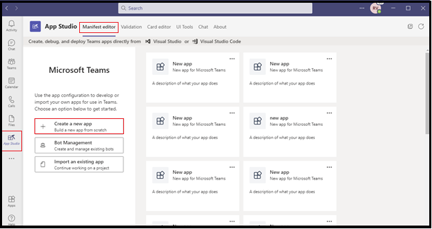

# <a name="add-power-virtual-agents-chatbot"></a><span data-ttu-id="03b52-103">Power Virtual Agents チャットボットの追加</span><span class="sxs-lookup"><span data-stu-id="03b52-103">Add Power Virtual Agents chatbot</span></span> 

<span data-ttu-id="03b52-104">Power Virtual Agents はコードなしガイド付きグラフィカル インターフェイス ソリューションで、チームのすべてのメンバーが Teams プラットフォームと簡単に統合できるリッチで会話型のチャットボットを作成できます。</span><span class="sxs-lookup"><span data-stu-id="03b52-104">Power Virtual Agents is a no-code, guided graphical interface solution that empowers every member of your team to create rich, conversational chatbots that easily integrate with the Teams platform.</span></span> <span data-ttu-id="03b52-105">Power Virtual Agents で作成されたコンテンツはすべて、Teams で自然にレンダリングされます。</span><span class="sxs-lookup"><span data-stu-id="03b52-105">All content authored in Power Virtual Agents renders naturally in Teams.</span></span> <span data-ttu-id="03b52-106">Power Virtual Agents ボットは、Teams ネイティブ チャット キャンバスでユーザーと対話します。</span><span class="sxs-lookup"><span data-stu-id="03b52-106">Power Virtual Agents bots engage with users in the Teams native chat canvas.</span></span> <span data-ttu-id="03b52-107">IT 管理者、ビジネス アナリスト、ドメイン スペシャリスト、および熟練したアプリ開発者は、開発環境をセットアップすることなく、Teams のインテリジェント仮想エージェントを設計、開発、発行できます。</span><span class="sxs-lookup"><span data-stu-id="03b52-107">The IT administrators, business analysts, domain specialists, and skilled app developers can design, develop and publish intelligent virtual agents for Teams without having to setup a development environment.</span></span> <span data-ttu-id="03b52-108">Web サービスを作成したり、ボット フレームワークに直接登録することができます。</span><span class="sxs-lookup"><span data-stu-id="03b52-108">They can create a web service, or directly register with the Bot Framework.</span></span> 

<span data-ttu-id="03b52-109">このドキュメントでは、Power Virtual Agents ポータルを通じて Teams でチャットボットを利用し、App Studio を使用してボットを Teams に追加する方法について説明します。</span><span class="sxs-lookup"><span data-stu-id="03b52-109">This document guides you on how to make your chatbot available in Teams through the Power Virtual Agents portal, and add your bot to Teams using App Studio.</span></span> 

<span data-ttu-id="03b52-110">Power Virtual Agents を使用すると、強力なチャットボットを作成して、顧客、他の従業員、または Web サイトやサービスへの訪問者が行った質問に答えます。</span><span class="sxs-lookup"><span data-stu-id="03b52-110">Power Virtual Agents lets you create powerful chatbots that can answer questions posed by your customers, other employees, or visitors to your website or service.</span></span>

<span data-ttu-id="03b52-111">これらのボットは、データ サイエンティストや開発者を必要とせずに簡単に作成できます。</span><span class="sxs-lookup"><span data-stu-id="03b52-111">These bots can be created easily without the need for data scientists or developers.</span></span>

> [!NOTE]
> <span data-ttu-id="03b52-112">チャットボットを Microsoft Teams に追加すると、ボット コンテンツやユーザー チャット コンテンツなどの一部のデータが Microsoft Teams と共有されます。</span><span class="sxs-lookup"><span data-stu-id="03b52-112">By adding your chatbot to Microsoft Teams, some of the data, such as bot content and user chat content, is shared with Microsoft Teams.</span></span> <span data-ttu-id="03b52-113">つまり、データは組織のコンプライアンスや地理的または地域的な境界の外 [に流れます](/power-virtual-agents/data-location)。</span><span class="sxs-lookup"><span data-stu-id="03b52-113">It means that your data flows outside of your [organization’s compliance and geographic or regional boundaries](/power-virtual-agents/data-location).</span></span> <br/>

## <a name="make-your-chatbot-available-in-teams-through-the-power-virtual-agents-portal"></a><span data-ttu-id="03b52-114">Power Virtual Agents ポータルを通じて Teams でチャットボットを利用できる</span><span class="sxs-lookup"><span data-stu-id="03b52-114">Make your chatbot available in Teams through the Power Virtual Agents portal</span></span>

<span data-ttu-id="03b52-115">Power Virtual Agents ポータルを通じて Teams でチャットボットを利用するには、次のプロセス手順を実行する必要があります。</span><span class="sxs-lookup"><span data-stu-id="03b52-115">To make your chatbot available in Teams through the Power Virtual Agents portal, you must perform the following process steps:</span></span>

<span data-ttu-id="03b52-116">**Teams でチャットボットを利用するには**</span><span class="sxs-lookup"><span data-stu-id="03b52-116">**To make the chatbot available in Teams**</span></span>

1. <span data-ttu-id="03b52-117">**最新のボット コンテンツを発行する**</span><span class="sxs-lookup"><span data-stu-id="03b52-117">**Publish the latest bot content**</span></span>  
<span data-ttu-id="03b52-118">Power Virtual Agents ポータルでチャットボットを作成した後、Teams ユーザーがボットを操作する前にボットを発行する必要があります。</span><span class="sxs-lookup"><span data-stu-id="03b52-118">After creating a chatbot in the Power Virtual Agents portal, you must publish your bot before Teams users can interact with it.</span></span> <span data-ttu-id="03b52-119">詳細については、「最新のボット [コンテンツを発行する」を参照してください](/power-virtual-agents/publication-fundamentals-publish-channels#publish-the-latest-bot-content)。</span><span class="sxs-lookup"><span data-stu-id="03b52-119">For more information, see [Publish the latest bot content](/power-virtual-agents/publication-fundamentals-publish-channels#publish-the-latest-bot-content).</span></span>

   

1. <span data-ttu-id="03b52-121">**Teams チャネルの構成**</span><span class="sxs-lookup"><span data-stu-id="03b52-121">**Configure the Teams channel**</span></span>  
<span data-ttu-id="03b52-122">ボットを発行した後、Teams チャネルを追加して、ボットを Teams ユーザーが利用できます。</span><span class="sxs-lookup"><span data-stu-id="03b52-122">After publishing your bot, add the Teams channel to make the bot available to Teams users.</span></span>

   

1. <span data-ttu-id="03b52-124">**チャットボットのアプリ ID を生成する**</span><span class="sxs-lookup"><span data-stu-id="03b52-124">**Generate an App ID for your chatbot**</span></span>  
<span data-ttu-id="03b52-125">Teams チャネルをチャットボットに追加すると、ダイアログ ボックスにアプリ **ID** が生成されます。</span><span class="sxs-lookup"><span data-stu-id="03b52-125">After adding the Teams channel to your chatbot, an **App ID** is generated in the dialog box.</span></span> <span data-ttu-id="03b52-126">アプリ ID は、ボットの Microsoft が生成した一意の識別子です。</span><span class="sxs-lookup"><span data-stu-id="03b52-126">The App ID is a unique Microsoft generated identifier for your bot.</span></span> <span data-ttu-id="03b52-127">アプリ ID を保存して Teams 用のアプリ パッケージを作成します。</span><span class="sxs-lookup"><span data-stu-id="03b52-127">Save the App ID to create an app package for Teams.</span></span>

## <a name="add-your-bot-to-teams-using-app-studio"></a><span data-ttu-id="03b52-128">App Studio を使用してボットを Teams に追加する</span><span class="sxs-lookup"><span data-stu-id="03b52-128">Add your bot to Teams using App Studio</span></span>

<span data-ttu-id="03b52-129">Teams [インスタンスでカスタム アプリ](/microsoftteams/admin-settings) のアップロードが有効になっている場合は、Teams App Studio を使用してチャットボットを直接アップロードし、すぐに使用を開始できます。</span><span class="sxs-lookup"><span data-stu-id="03b52-129">If [uploading custom apps is enabled](/microsoftteams/admin-settings) in your Teams instance, you can use Teams App Studio to directly upload your chatbot and start using it immediately.</span></span> <span data-ttu-id="03b52-130">チャットボットを共有するには、管理者に、テナント アプリ カタログでボットを利用できるよう要求するか、アプリ パッケージを他のユーザーに送信し、個別にアップロードを依頼できます。</span><span class="sxs-lookup"><span data-stu-id="03b52-130">To share your chatbot, you can request your admin to make your bot available in the tenant app catalog or you can send your app package to others and ask them to upload it independently.</span></span>

1. <span data-ttu-id="03b52-131">**Teams に App Studio をインストールする**</span><span class="sxs-lookup"><span data-stu-id="03b52-131">**Install App Studio in Teams**</span></span>  
<span data-ttu-id="03b52-132">App Studio は Teams アプリです。</span><span class="sxs-lookup"><span data-stu-id="03b52-132">App Studio is a Teams app.</span></span> <span data-ttu-id="03b52-133">Teams ストアから App Studio をインストールし、Teams でのボットの作成と登録のプロセスを簡略化します。</span><span class="sxs-lookup"><span data-stu-id="03b52-133">Install App Studio from the Teams store that simplifies the process of bot creation and registration in Teams:</span></span> 

   1. <span data-ttu-id="03b52-134">Teams インスタンスからアプリ ストア アイコンを選択し **、App Studio を検索します**。</span><span class="sxs-lookup"><span data-stu-id="03b52-134">Select the app store icon from Teams instance, and search for **App Studio**.</span></span>

      &emsp;&emsp;    

   1. <span data-ttu-id="03b52-135">[App **Studio] タイルを** 選択し **、ポップアップ** ダイアログ ボックスで [インストール] を選択します。</span><span class="sxs-lookup"><span data-stu-id="03b52-135">Select the **App Studio** tile and select **Install** in the pop-up dialog box.</span></span>

      &emsp;&emsp; 

1. <span data-ttu-id="03b52-136">**App Studio で Teams アプリ マニフェストを作成する**</span><span class="sxs-lookup"><span data-stu-id="03b52-136">**Create the Teams app manifest in App Studio**</span></span>  
<span data-ttu-id="03b52-137">Teams のボットは、ボットとその機能に関する基本情報を提供するアプリ マニフェスト JSON ファイルによって定義されます。</span><span class="sxs-lookup"><span data-stu-id="03b52-137">Bots in Teams are defined by an app manifest JSON file that provides the basic information about your bot and its capabilities.</span></span> <span data-ttu-id="03b52-138">**App Studio で、[マニフェスト** エディター]**を選択し**、[新しい **アプリの作成] を選択します**。</span><span class="sxs-lookup"><span data-stu-id="03b52-138">In **App Studio**, select **Manifest editor**, and select **Create a new app**.</span></span>  
<span data-ttu-id="03b52-139">次の画像は、App Studio で新しいアプリを作成する方法を示しています。</span><span class="sxs-lookup"><span data-stu-id="03b52-139">The following image guides you to create a new app in App Studio:</span></span>  

   

1. <span data-ttu-id="03b52-141">**ボットの詳細を追加する**</span><span class="sxs-lookup"><span data-stu-id="03b52-141">**Add your bot details**</span></span>  
<span data-ttu-id="03b52-142">必要なすべてのフィールドに入力します。</span><span class="sxs-lookup"><span data-stu-id="03b52-142">Complete all the required fields.</span></span> <span data-ttu-id="03b52-143">各フィールドの詳細については、「マニフェスト スキーマ定義 [」を参照してください](../../resources/schema/manifest-schema.md)。</span><span class="sxs-lookup"><span data-stu-id="03b52-143">For a full description of each field see [manifest schema definition](../../resources/schema/manifest-schema.md).</span></span>   
<span data-ttu-id="03b52-144">次の画像は、アプリの詳細を追加する方法を示しています。</span><span class="sxs-lookup"><span data-stu-id="03b52-144">The following image guides you to add the app details:</span></span>  

   

1. <span data-ttu-id="03b52-146">**ボットをセットアップする** ボットをセットアップするには、次の手順を実行します。</span><span class="sxs-lookup"><span data-stu-id="03b52-146">**Set up your bot** To set-up the bot, perform the following steps:</span></span> 
     1. <span data-ttu-id="03b52-147">[ボット **] タブを開** きます。</span><span class="sxs-lookup"><span data-stu-id="03b52-147">Open the **Bots** tab.</span></span> 
     1. <span data-ttu-id="03b52-148">[**既存**  >  **のボットのセットアップ] を** 選択し、ボットの名前を入力します。</span><span class="sxs-lookup"><span data-stu-id="03b52-148">Select **Setup** > **Existing bot** and enter the name of your bot.</span></span>

   <span data-ttu-id="03b52-149">次の図は、ボットをセットアップする方法を示しています。</span><span class="sxs-lookup"><span data-stu-id="03b52-149">The following image guides you to set-up a bot:</span></span>    

    

   <span data-ttu-id="03b52-151">次の図は、既存のボットをセットアップする方法を示しています。</span><span class="sxs-lookup"><span data-stu-id="03b52-151">The following image guides you to set-up an existing bot:</span></span>      

       
1. <span data-ttu-id="03b52-153">**アプリ ID の追加**</span><span class="sxs-lookup"><span data-stu-id="03b52-153">**Add your App ID**</span></span>  
<span data-ttu-id="03b52-154">アプリ ID を追加するには、次の手順を実行します。</span><span class="sxs-lookup"><span data-stu-id="03b52-154">To add your App ID, perform the following steps:</span></span>  
    1. <span data-ttu-id="03b52-155">[ **別のボット ID に接続する] を選択し** 、前にコピー **したアプリ ID** を貼り付けます。</span><span class="sxs-lookup"><span data-stu-id="03b52-155">Select **Connect to a different bot id** and paste the **App Id** you copied earlier.</span></span> 
    1. <span data-ttu-id="03b52-156">[スコープ **個人用保存**  >  **]**  >  **を選択します**。</span><span class="sxs-lookup"><span data-stu-id="03b52-156">Select **Scope** > **Personal** > **Save**.</span></span>      
<span data-ttu-id="03b52-157">次の図は、既存のボットをセットアップする方法を示しています。</span><span class="sxs-lookup"><span data-stu-id="03b52-157">The following image guides you to set-up an existing bot:</span></span>    

   

1. <span data-ttu-id="03b52-159">**ボットに有効なドメインを追加する**</span><span class="sxs-lookup"><span data-stu-id="03b52-159">**Add valid domains for your bot**</span></span>  
<span data-ttu-id="03b52-160">この手順は、ボットがユーザーにサインインを要求する場合にのみ必要です。</span><span class="sxs-lookup"><span data-stu-id="03b52-160">This step is only required if your bot requires the user to sign in.</span></span> <span data-ttu-id="03b52-161">[ **ドメインとアクセス許可] を選択し** 、[有効な **ドメイン** ] フィールドで、次の入力を入力します。</span><span class="sxs-lookup"><span data-stu-id="03b52-161">Select **Domains and permissions** and in the **Valid Domains** field, provide the following input:</span></span>

    ```bash
       token.botframework.com
    ```

7.  <span data-ttu-id="03b52-162">**ボットのテストと配布**</span><span class="sxs-lookup"><span data-stu-id="03b52-162">**Test and distribute your bot**</span></span>  
<span data-ttu-id="03b52-163">[ **テストと配布] タブを** 開き、[ **インストール] を** 選択して、ボットを Teams インスタンスに直接追加します。</span><span class="sxs-lookup"><span data-stu-id="03b52-163">Open **Test and distribute** tab and select **Install** to add your bot directly to your Teams instance.</span></span> <span data-ttu-id="03b52-164">または、完成したアプリ パッケージをダウンロードして Teams ユーザーと共有したり、管理者に提供して、テナント アプリ カタログでボットを利用したりすることもできます。</span><span class="sxs-lookup"><span data-stu-id="03b52-164">Alternately, you can download the completed app package to share with Teams users or provide it to your admin to make your bot available in the tenant app catalog.</span></span>

8. <span data-ttu-id="03b52-165">**チャットを開始する** </span><span class="sxs-lookup"><span data-stu-id="03b52-165">**Start a chat** </span></span>  
<span data-ttu-id="03b52-166">Power Virtual Agents チャット ボットを Teams に追加するセットアップ プロセスは完了です。</span><span class="sxs-lookup"><span data-stu-id="03b52-166">The set-up process for adding your Power Virtual Agents chat bot to Teams is complete.</span></span> <span data-ttu-id="03b52-167">これで、個人用チャットでボットとの会話を開始できます。</span><span class="sxs-lookup"><span data-stu-id="03b52-167">You can now start a conversation with your bot in a personal chat.</span></span>

## <a name="see-also"></a><span data-ttu-id="03b52-168">関連項目</span><span class="sxs-lookup"><span data-stu-id="03b52-168">See also</span></span>
> [!div class="nextstepaction"]
> [<span data-ttu-id="03b52-169">Power Virtual Agents</span><span class="sxs-lookup"><span data-stu-id="03b52-169">Power Virtual Agents</span></span>](/power-virtual-agents/fundamentals-what-is-power-virtual-agents)  

> [!div class="nextstepaction"]
> <span data-ttu-id="03b52-170">[Microsoft Power Virtual Agents を使用して Teams のチャットボットを作成します](../bot-features.md#bots-and-the-microsoft-power-virtual-agents)。</span><span class="sxs-lookup"><span data-stu-id="03b52-170">[Create a chatbot for Teams with Microsoft Power Virtual Agents](../bot-features.md#bots-and-the-microsoft-power-virtual-agents).</span></span>  

> [!div class="nextstepaction"]
>  [<span data-ttu-id="03b52-171">Power Virtual Agents ポータル</span><span class="sxs-lookup"><span data-stu-id="03b52-171">Power Virtual Agents portal</span></span>](https://powervirtualagents.microsoft.com)

> [!div class="nextstepaction"]
> [<span data-ttu-id="03b52-172">Power Virtual Agents ボットを発行する</span><span class="sxs-lookup"><span data-stu-id="03b52-172">Publish your Power Virtual Agents bot</span></span>](/power-virtual-agents/publication-fundamentals-publish-channels)

> [!div class="nextstepaction"]
> <span data-ttu-id="03b52-173">[Microsoft Teams のセキュリティとコンプライアンス](/MicrosoftTeams/security-compliance-overview)。</span><span class="sxs-lookup"><span data-stu-id="03b52-173">[Security and compliance in Microsoft Teams](/MicrosoftTeams/security-compliance-overview).</span></span>

## <a name="next-step"></a><span data-ttu-id="03b52-174">次の手順</span><span class="sxs-lookup"><span data-stu-id="03b52-174">Next step</span></span>

> [!div class="nextstepaction"]
> [<span data-ttu-id="03b52-175">仮想アシスタントの作成</span><span class="sxs-lookup"><span data-stu-id="03b52-175">Create virtual assistant</span></span>](~/samples/virtual-assistant.md)

