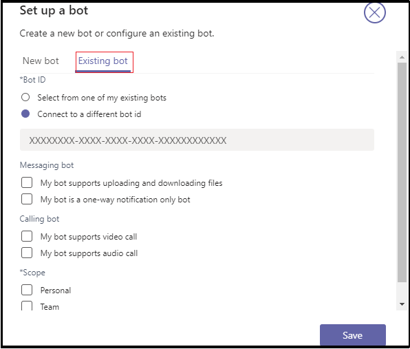

# <a name="add-power-virtual-agents-chatbot"></a>Power Virtual Agents チャットボットを追加する 

Power Virtual Agents はコードなしガイド付きグラフィカル インターフェイス ソリューションで、チームのすべてのメンバーが Teams プラットフォームと簡単に統合できるリッチで会話型のチャットボットを作成できます。 Power Virtual Agents で作成されたコンテンツはすべて、Teams で自然にレンダリングされます。 Power Virtual Agents ボットは、Teams ネイティブ チャット キャンバスでユーザーと対話します。 IT 管理者、ビジネス アナリスト、ドメイン スペシャリスト、および熟練したアプリ開発者は、開発環境をセットアップすることなく、Teams のインテリジェント仮想エージェントを設計、開発、発行できます。 Web サービスを作成したり、ボット フレームワークに直接登録することができます。 

このドキュメントでは、Power Virtual Agents ポータルを通じて Teams でチャットボットを利用し、App Studio を使用してボットを Teams に追加する方法について説明します。 

Power Virtual Agents を使用すると、強力なチャットボットを作成して、顧客、他の従業員、または Web サイトやサービスへの訪問者が行った質問に答えます。

これらのボットは、データ サイエンティストや開発者を必要とせずに簡単に作成できます。

> [!NOTE]
> チャットボットを Microsoft Teams に追加すると、ボット コンテンツやユーザー チャット コンテンツなどの一部のデータが Microsoft Teams と共有されます。 つまり、データは組織のコンプライアンスや地理的または地域的な境界の外 [に流れます](/power-virtual-agents/data-location)。 <br/>

## <a name="make-your-chatbot-available-in-teams-through-the-power-virtual-agents-portal"></a>Power Virtual Agents ポータルを通じて Teams でチャットボットを利用できる

Power Virtual Agents ポータルを通じて Teams でチャットボットを利用するには、次のプロセス手順を実行する必要があります。

**Teams でチャットボットを利用するには**

1. **最新のボット コンテンツを発行する**  
Power Virtual Agents ポータルでチャットボットを作成した後、Teams ユーザーがボットを操作する前にボットを発行する必要があります。 詳細については、「最新のボット [コンテンツを発行する」を参照してください](/power-virtual-agents/publication-fundamentals-publish-channels#publish-the-latest-bot-content)。

   

1. **Teams チャネルの構成**  
ボットを発行した後、Teams チャネルを追加して、ボットを Teams ユーザーが利用できます。

   

1. **チャットボットのアプリ ID を生成する**  
Teams チャネルをチャットボットに追加すると、ダイアログ ボックスにアプリ **ID** が生成されます。 アプリ ID は、ボットの Microsoft が生成した一意の識別子です。 アプリ ID を保存して Teams 用のアプリ パッケージを作成します。

## <a name="add-your-bot-to-teams-using-app-studio"></a>App Studio を使用してボットを Teams に追加する

Teams [インスタンスでカスタム アプリ](/microsoftteams/admin-settings) のアップロードが有効になっている場合は、Teams App Studio を使用してチャットボットを直接アップロードし、すぐに使用を開始できます。 チャットボットを共有するには、管理者に、テナント アプリ カタログでボットを利用できるよう要求するか、アプリ パッケージを他のユーザーに送信し、個別にアップロードを依頼できます。

1. **Teams に App Studio をインストールする**  
App Studio は Teams アプリです。 Teams ストアから App Studio をインストールし、Teams でのボットの作成と登録のプロセスを簡略化します。 

   1. Teams インスタンスからアプリ ストア アイコンを選択し **、App Studio を検索します**。

      &emsp;&emsp;    

   1. [App **Studio] タイルを** 選択し **、ポップアップ** ダイアログ ボックスで [インストール] を選択します。

      &emsp;&emsp; 

1. **App Studio で Teams アプリ マニフェストを作成する**  
Teams のボットは、ボットとその機能に関する基本情報を提供するアプリ マニフェスト JSON ファイルによって定義されます。 **App Studio で、[マニフェスト** エディター]**を選択し**、[新しい **アプリの作成] を選択します**。  
次の画像は、App Studio で新しいアプリを作成する方法を示しています。  

   

1. **ボットの詳細を追加する**  
必要なすべてのフィールドに入力します。 各フィールドの詳細については、「マニフェスト スキーマ定義 [」を参照してください](../../resources/schema/manifest-schema.md)。   
次の画像は、アプリの詳細を追加する方法を示しています。  

   

1. **ボットをセットアップする** ボットをセットアップするには、次の手順を実行します。 
     1. [ボット **] タブを開** きます。 
     1. [**既存**  >  **のボットのセットアップ] を** 選択し、ボットの名前を入力します。

   次の図は、ボットをセットアップする方法を示しています。    

    

   次の図は、既存のボットをセットアップする方法を示しています。      

       
1. **アプリ ID の追加**  
アプリ ID を追加するには、次の手順を実行します。  
    1. [ **別のボット ID に接続する] を選択し** 、前にコピー **したアプリ ID** を貼り付けます。 
    1. [スコープ **個人用保存**  >  **]**  >  **を選択します**。      
次の図は、既存のボットをセットアップする方法を示しています。    

   

1. **ボットに有効なドメインを追加する**  
この手順は、ボットがユーザーにサインインを要求する場合にのみ必要です。 [ **ドメインとアクセス許可] を選択し** 、[有効な **ドメイン** ] フィールドで、次の入力を入力します。

    ```bash
       token.botframework.com
    ```

7.  **ボットのテストと配布**  
[ **テストと配布] タブを** 開き、[ **インストール] を** 選択して、ボットを Teams インスタンスに直接追加します。 または、完成したアプリ パッケージをダウンロードして Teams ユーザーと共有したり、管理者に提供して、テナント アプリ カタログでボットを利用したりすることもできます。

8. **チャットを開始する**   
Power Virtual Agents チャット ボットを Teams に追加するセットアップ プロセスは完了です。 これで、個人用チャットでボットとの会話を開始できます。

## <a name="see-also"></a>関連項目

- [Power Virtual Agents](/power-virtual-agents/fundamentals-what-is-power-virtual-agents)  

- [Microsoft Power Virtual Agents を使用して Teams のチャットボットを作成します](../bot-features.md#bots-and-the-microsoft-power-virtual-agents)。  

- [Power Virtual Agents ポータル](https://powervirtualagents.microsoft.com)

- [Power Virtual Agents ボットを発行する](/power-virtual-agents/publication-fundamentals-publish-channels)

- [Microsoft Teams のセキュリティとコンプライアンス](/MicrosoftTeams/security-compliance-overview)。

## <a name="next-step"></a>次の手順

> [!div class="nextstepaction"]
> [仮想アシスタントの作成](~/samples/virtual-assistant.md)

