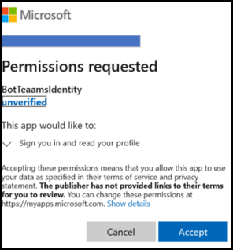
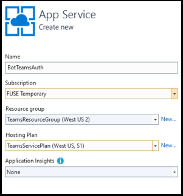
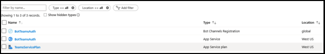
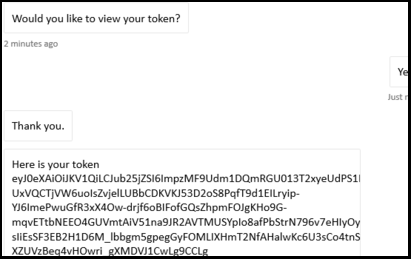
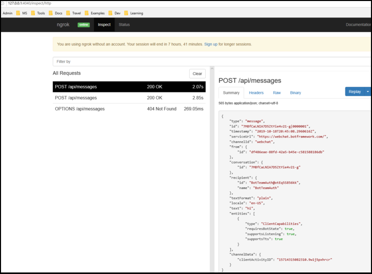

# <a name="add-authentication-to-your-teams-bot"></a>Teams ボットに認証を追加する

メール サービスなど、ユーザーの代わりにリソースにアクセスMicrosoft Teamsボットを作成する必要がある場合があります。

この記事では、OAuth 2.0 に基づいて Azure Bot Service v4 SDK 認証を使用する方法を示します。 これにより、ユーザーの資格情報に基づいて認証トークンを使用できるボットの開発が容易になります。 このすべてで重要なのは、 **後で説明** する ID プロバイダーの使用です。

OAuth 2.0 は、Microsoft Azure Active Directory (Azure AD) および他の多くの ID プロバイダーが使用する認証と承認のオープン標準です。 OAuth 2.0 の基本的な理解は、認証を使用する場合の前提条件Teams。

完全 [な仕様については、「OAuth 2 簡](https://aka.ms/oauth2-simplified) 体字」、 [OAuth 2.0](https://oauth.net/2/) を参照してください。

Azure Bot Service が認証を処理する方法の詳細については、「会話内の [ユーザー認証」を参照してください](https://aka.ms/azure-bot-authentication)。

この記事では、以下について説明します。

- **認証が有効なボットを作成する方法**。 [cs-auth-sample][teams-auth-bot-cs] を使用して、ユーザーサインイン資格情報と認証トークンの生成を処理します。
- **ボットを Azure に展開し、ID プロバイダーに関連付ける方法**。 プロバイダーは、ユーザー サインイン資格情報に基づいてトークンを発行します。 ボットはトークンを使用して、認証が必要なメール サービスなどのリソースにアクセスできます。 詳細については、「ボットMicrosoft Teams[の認証フロー」を参照してください](auth-flow-bot.md)。
- **ボットをシステム内に統合するMicrosoft Teams**。 ボットが統合された後は、サインインしてチャットでメッセージとメッセージを交換できます。

## <a name="prerequisites"></a>前提条件

- ボットの[基本、状態][concept-basics][の管理、][concept-state]ダイアログ ライブラリ、[][concept-dialogs]および連続した会話フローの実装[方法に関する知識][simple-dialog]。
- Azure と OAuth 2.0 の開発に関する知識。
- 現在のバージョンの Microsoft Visual Studio Git。
- Azure アカウント。 必要に応じて、Azure 無料アカウント [を作成できます](https://azure.microsoft.com/free/)。
- 次のサンプル:

    | サンプル | BotBuilder のバージョン | デモンストレーション |
    |:---|:---:|:---|
    |  [cs-auth-sample でのボット認証][teams-auth-bot-cs] | v4 | OAuthCard のサポート |
    |  [js-auth-sample でのボット認証][teams-auth-bot-js] | v4| OAuthCard のサポート  |
    |  [py-auth-sample でのボット認証][teams-auth-bot-py] | v4 | OAuthCard のサポート |

## <a name="create-the-resource-group"></a>リソース グループを作成する

リソース グループとサービス プランは厳密には必要ありませんが、作成したリソースを簡単に解放できます。 これは、リソースを整理して管理し続ける場合の良い方法です。

リソース グループを使用して、ボット フレームワークの個々のリソースを作成します。 パフォーマンスを向上するには、これらのリソースが同じ Azure 地域に含めらされている必要があります。

1. ブラウザーで、ポータルに [**サインインMicrosoft Azureします**][azure-portal]。
1. 左側のナビゲーション パネルで、[リソース グループ] **を選択します**。
1. 表示されるウィンドウの左上にある [追加] タブを **選択して、** 新しいリソース グループを作成します。 次の情報を入力するように求めるメッセージが表示されます。
    1. **サブスクリプション**。 既存のサブスクリプションを使用します。
    1. **リソース グループ**。 リソース グループの名前を入力します。 たとえば、  *TeamsResourceGroup を使用できます*。 名前は一意である必要があります。
    1. [地域 **] ドロップダウン** メニューから、[ *米国* 西部] またはアプリケーションに近い地域を選択します。
    1. [レビューと **作成] ボタンを選択** します。 検証が渡されたというバナーが *表示されます*。
    1. [作成] **ボタンを選択** します。 リソース グループの作成に数分かかる場合があります。

> [!TIP]
> このチュートリアルの後半で作成するリソースと同様に、このリソース グループをダッシュボードにピン留めして簡単にアクセスできます。 これを行う場合は、ピン アイコン &#128204。をダッシュボードの右上に表示します。

## <a name="create-the-service-plan"></a>サービス プランの作成

1. Azure portal [**の左側の**][azure-portal]ナビゲーション パネルで、[リソースの作成 **] を選択します**。
1. 検索ボックスに「 *App Service Plan」と入力します*。 検索結果から **[App Service プラン** ] カードを選択します。
1. **[作成]** を選択します。
1. 次の情報の入力を求めるメッセージが表示されます。
    1. **サブスクリプション**。 既存のサブスクリプションを使用できます。
    1. **リソース グループ**。 前に作成したグループを選択します。
    1. **名前**。 サービス プランの名前を入力します。 たとえば、  *TeamsServicePlan を指定できます*。 名前はグループ内で一意である必要があります。
    1. **オペレーティング システム**。 [*Windowsまたは該当* する OS] を選択します。
    1. **地域**。 [ *米国西部]* またはアプリケーションに近い地域を選択します。
    1. **価格レベル**。 [標準 *S1] が選択* されている必要があります。 これは既定値である必要があります。
    1. [レビューと **作成] ボタンを選択** します。 検証が渡されたというバナーが *表示されます*。
    1. **[作成]** を選択します。 アプリ サービス プランの作成に数分かかる場合があります。 計画はリソース グループに一覧表示されます。

## <a name="create-azure-bot-resource-registration"></a>Azure Bot リソース登録の作成

Azure Bot リソース登録は、Web サービスをボットとしてボットフレームワークに登録し、Microsoft App Id と App パスワード (クライアント シークレット) を提供します。

> [!IMPORTANT]
> ボットが Azure でホストされていない場合にのみ、ボットを登録する必要があります。 Azure ポータル [を使用して](/azure/bot-service/abs-quickstart?view=azure-bot-service-4.0&viewFallbackFrom=azure-bot-service-3.0&preserve-view=true) ボットを作成した場合、そのボットは既にサービスに登録されています。 ボット フレームワークまたは開発者ポータル [を使用して](https://dev.botframework.com/bots/new) ボットを作成した [場合、ボット](../../../concepts/build-and-test/teams-developer-portal.md) は Azure に登録されていません。

1. Azure [**portal にアクセスし**][azure-portal] 、[リソースの作成 **] セクションで Azure Bot** **を検索** します。
1. Azure Bot を **開き、[** 作成] を **選択します**。
1. [ボット ハンドル] フィールドにボット ハンドル **名を入力** します。
1. ドロップダウン リスト **から [サブスクリプション** ] を選択します。
1. ドロップダウン リスト **からリソース グループ** を選択します。
1. [Microsoft **アプリ ID のマルチ** テナント **としてアプリの種類****] を選択します**。

    

1. **[確認 + 作成]** を選びます。

    

1. 検証に合格した場合は、[作成] を **選択します**。

    ボット サービスをプロビジョニングするには、少し時間が必要です。

    

1. [**リソースに移動**] を選びます。 ボットと関連リソースがリソース グループに一覧表示されます。

    

    これで、Azure ボットが作成されます。
    
    

**クライアント シークレットを作成するには**

1. [構成 **設定** 構成] を **選択します**。 将来の **参照のために Microsoft App ID** (クライアント ID) を保存します。

    

1. **[Microsoft アプリ ID] の隣にある [** 管理] を **選択します**。

    

1. [クライアント シークレット **] セクションで、[** 新しいクライアント シークレット **] を選択します**。**[クライアント シークレットの追加]** ウィンドウが表示されます。

    

1. [説明 **] と入力し** 、[追加] を **選択します**。
 
    

1. [値 **] 列で** 、[クリップボードに **コピー] を選択し** 、将来の参照のためにクライアント シークレット ID を保存します。

    
       
**チャネルを追加Microsoft Teamsするには**

1. [ホーム] に **移動します**。

    

1. [最近使ったリソース] セクションに一覧表示されているボット **を開** きます。
1. 左側 **のウィンドウで** [チャネル] を選択し、[チャネル] **をTeams** .

    

1. このチェック ボックスをオンにすると、利用規約に同意し、[同意する] を **選択します**。</br>

    

1. **[保存]** を選択します。

    

詳細については、「Create [a bot for Teams」 を参照してください](../create-a-bot-for-teams.md)。

## <a name="create-the-identity-provider"></a>ID プロバイダーを作成する

認証に使用できる ID プロバイダーが必要です。
この手順では、サポートされている id プロバイダー Azure AD他Azure ADを使用できます。

1. Azure portal [**で、**][azure-portal]左側のナビゲーション パネルで 、[ユーザー **] を選択** Azure Active Directory。
    > [!TIP]
    > アプリケーションから要求されたアクセス許可を委任Azure AD、このリソースをテナントに作成して登録する必要があります。
    > テナントの作成方法については、「Access [the portal and create a tenant」を参照してください](/azure/active-directory/fundamentals/active-directory-access-create-new-tenant)。
1. 左側のパネルで、[アプリの登録 **] を選択します**。
1. 右側のパネルで、左上の **[新規登録** ] タブを選択します。
1. 次の情報の入力を求めるメッセージが表示されます。
   1. **名前**。 アプリケーションの名前を入力します。 たとえば、  *BotTeamsIdentity を使用できます*。 名前は一意である必要があります。
   1. アプリケーションの **[サポートされているアカウントの種類** ] を選択します。 任意 *の組織ディレクトリの [アカウント] ([任意Microsoft Azure Active Directory (Azure AD) - マルチテナント] と個人用 Microsoft アカウント (Skype Xbox など) を選択* します。
   1. リダイレクト **URI の場合**:<br/>
       &#x2713;Web を **選択します**。 <br/>
       &#x2713; URL をに設定します `https://token.botframework.com/.auth/web/redirect`。
   1. **[登録]** を選択します。

1. アプリが作成されると、アプリの **[概要** ] ページが表示されます。 次の情報をコピーしてファイルに保存します。

    1. アプリケーション **(クライアント) の ID** 値。 この Azure ID アプリケーションをボットに登録する場合は、後でクライアント *ID* としてこの値を使用します。
    1. ディレクトリ **(テナント) ID** の値。 この値は、後でテナント ID として使用して、この Azure *ID* アプリケーションをボットに登録します。

1. 左側のパネルで、[証明書] & **を選択** して、アプリケーションのクライアント シークレットを作成します。

   1. [ **クライアント シークレット] で**、[新&#x2795; **シークレット] を選択します**。
   1. このアプリ用に作成する必要がある可能性がある他のユーザーからこのシークレットを識別するための説明を *追加します* 。たとえば、ボット ID アプリは Teams。
   1. [ **有効期限] を選択** に設定します。
   1. **[追加]** を選択します。
   1. このページを離れる前に、 **シークレットを記録します**。 この値は、後でボットにアプリケーションを登録するときにクライアント Azure AD使用します。

### <a name="configure-the-identity-provider-connection-and-register-it-with-the-bot"></a>ID プロバイダー接続を構成し、ボットに登録する

注:サービス Microsoft Azure Active Directory プロバイダーには、ここに示す (Azure AD) V1 と Microsoft Azure Active Directory (Azure AD) V2 の 2 つのAzure ADがあります。  2 つのプロバイダー間の違いについては、ここで要約[](/azure/active-directory/azuread-dev/azure-ad-endpoint-comparison)しますが、一般に、V2 はボットのアクセス許可の変更に関して柔軟性を高め、提供します。  Graph API のアクセス許可が [スコープ] フィールドに表示され、新しいアクセス許可が追加されるに合って、ボットはユーザーが次のサインインの新しいアクセス許可に同意できます。  V1 の場合、OAuth ダイアログで新しいアクセス許可を求めるには、ボットの同意をユーザーが削除する必要があります。 

#### <a name="microsoft-azure-active-directory-azure-ad-v1"></a>Microsoft Azure Active Directory (Azure AD) V1

1. Azure portal [**で、**][azure-portal]ダッシュボードからリソース グループを選択します。
1. ボット登録リンクを選択します。
1. リソース ページを開き、[構成] **の下** の **[構成] 設定**。 
1. [**OAuth 接続の追加] を設定**。    
次の図は、リソース ページで対応する選択内容を表示します。  

1. フォームに次のように入力します。

    1. **名前**。 接続の名前を入力します。 この名前は、ファイル内のボットで使用 `appsettings.json` します。 たとえば、 *BotTeamsAuthADv1 です*。
    1. **サービス プロバイダー**。 [**Microsoft Azure Active Directory ] (Azure AD) を選択します**。 これを選択すると、Azure AD固有のフィールドが表示されます。
    1. **クライアント ID**。上記の手順で、Azure ID プロバイダー アプリに記録したアプリケーション (クライアント) ID を入力します。
    1. **クライアント シークレット**。 上記の手順で、Azure ID プロバイダー アプリに記録したシークレットを入力します。
    1. **Grant Type**. を入力します `authorization_code`。
    1. **ログイン URL**。 を入力します `https://login.microsoftonline.com`。
    1. **テナント ID**、Id プロバイダー アプリの作成時に選択したサポートされているアカウントの種類に応じて、Azure ID アプリで以前に記録したディレクトリ **(テナント) ID** を入力します。 割り当てる値を決定するには、次の条件に従います。

        - この組織ディレクトリ内の [アカウントのみ] *(Microsoft のみ - シングル テナント)* または任意の組織ディレクトリの [アカウント] (*Microsoft Azure Active Directory (Azure AD) -* マルチ テナント) を選択した場合は、前の方法で記録したテナント **ID** を入力します。Microsoft Azure Active Directory (Azure AD) アプリ。 これは、認証できるユーザーに関連付けられたテナントになります。

        - 任意の組織ディレクトリ *(Any Microsoft Azure Active Directory (Azure AD) -* マルチ テナントアカウントと個人用 Microsoft アカウント (Skype、Xbox、Outlook など) で [アカウント] を選択した場合は、テナント ID の代わりに共通の単語を入力します。 それ以外の場合Microsoft Azure Active Directory (Azure AD) アプリは、ID が選択されたテナントを通じて確認し、個人の Microsoft アカウントを除外します。

    h. [ **リソース URL] に「** 」 と入力します `https://graph.microsoft.com/`。 これは、現在のコード サンプルでは使用されません。  
    i. [ **スコープ] は空白** のままにします。 次の図は、例です。

    

1. **[保存]** を選択します。

#### <a name="microsoft-azure-active-directory-azure-ad-v2"></a>Microsoft Azure Active Directory (Azure AD) V2

1. Azure portal [**で、**][azure-portal]ダッシュボードから Azure Bot を選択します。
1. リソース ページで、[構成] の [構成 **]** **を選択設定**。 
1. [**OAuth 接続の追加] を設定**。  
次の図は、リソース ページで対応する選択内容を表示します。        
 

1. フォームに次のように入力します。

    1. **名前**。 接続の名前を入力します。 この名前は、ファイル内のボットで使用 `appsettings.json` します。 たとえば、 *BotTeamsAuthADv2 です*。
    1. **サービス プロバイダー**。 [**v2 Microsoft Azure Active Directory選択します**。 これを選択すると、Microsoft Azure Active Directory (Azure AD) 固有のフィールドが表示されます。
    1. **クライアント ID**。上記の手順で、Azure ID プロバイダー アプリに記録したアプリケーション (クライアント) ID を入力します。
    1. **クライアント シークレット**。 上記の手順で、Azure ID プロバイダー アプリに記録したシークレットを入力します。
    1. **トークンExchange URL。** 空白のままにします。
    1. **テナント ID**、Id プロバイダー アプリの作成時に選択したサポートされているアカウントの種類に応じて、Azure ID アプリで以前に記録したディレクトリ **(テナント) ID** を入力します。 割り当てる値を決定するには、次の条件に従います。

        - この組織ディレクトリ内の [アカウントのみ] *(Microsoft のみ -* シングル テナント) または任意の組織ディレクトリ (*Microsoft Azure Active directory - マルチ テナント)* の [アカウント] のいずれかを選択した場合は、Microsoft Azure Active Directory (Azure AD) アプリ用に前に記録したテナント **ID** を入力します。 これは、認証できるユーザーに関連付けられたテナントになります。

        - 任意の組織ディレクトリ *(Any Microsoft Azure Active Directory (Azure AD) -* マルチ テナントアカウントと個人用 Microsoft アカウント (Skype、Xbox、Outlook など) で [アカウント] を選択した場合は、テナント ID の代わりに共通の単語を入力します。 それ以外の場合Microsoft Azure Active Directory (Azure AD) アプリは、ID が選択されたテナントを通じて確認し、個人の Microsoft アカウントを除外します。

    1. [ **スコープ]** に、このアプリケーションで必要なグラフのアクセス許可のスペース区切りリストを入力します。User.Read User.ReadBasic.All Mail.Read 

1. **[保存]** を選択します。

### <a name="test-the-connection"></a>接続をテストする

1. 接続エントリを選択して、作成した接続を開きます。
1. [ **サービス プロバイダーの接続設定** ] パネルの上部にある **[接続のテスト] を選択** します。
1. これを初めて実行すると、アカウントの選択を求める新しいブラウザー ウィンドウが開きます。 使用する 1 つを選択します。
1. 次に、ID プロバイダーにデータ (資格情報) の使用を許可する必要があります。 次の図は、例です。

    

1. **[同意する]** を選択します。
1. その後、テスト接続を **[成功] ページ \<your-connection-name> にリダイレクト** します。 エラーが発生した場合は、ページを更新します。 次の図は、例です。

    

接続名は、ボット コードによってユーザー認証トークンを取得するために使用されます。

## <a name="prepare-the-bot-sample-code"></a>ボットのサンプル コードを準備する

事前設定が完了したら、この記事で使用するボットの作成に注目します。

# <a name="cnet"></a>[C#/.NET](#tab/dotnet)

1. [cs-auth-sample のクローンを作成します][teams-auth-bot-cs]。
1. 起動Visual Studio。
1. ツール バーから [**ファイル] -> -> Project/ソリューション** を開き、ボット プロジェクトを開きます。
1. [C# **appsettings.json を次のように** 更新します。

    - ボット `ConnectionName` 登録に追加した ID プロバイダー接続の名前に設定します。 この例で使用した名前は *BotTeamsAuthADv1 です*。
    - ボット `MicrosoftAppId` 登録 **時に保存** したボット アプリ ID に設定します。
    - ボット `MicrosoftAppPassword` 登録 **時に保存** した顧客シークレットに設定します。

    ボット シークレットの文字によっては、XML でパスワードをエスケープする必要があります。 たとえば、アンパサンド (&) はとしてエンコードする必要があります `&amp;`。

     [!code-json[appsettings](~/../botbuilder-samples/samples/csharp_dotnetcore/46.teams-auth/appsettings.json?range=1-5)]

1. ソリューション エクスプローラーで、フォルダーに`TeamsAppManifest` `botId` `manifest.json` `id`移動し、ボット登録時に保存したボット **アプリ ID** を開いて設定します。

# <a name="javascript"></a>[JavaScript](#tab/node-js)

1. ノード [-auth-sampleのクローンを作成します][teams-auth-bot-js]。
1. コンソールで、プロジェクトに移動します。 </br></br>
`cd samples/javascript_nodejs/46.teams`  
1. モジュールのインストール</br></br>
`npm install`
1. **.env 構成を次** のように更新します。

    - ボット `MicrosoftAppId` 登録 **時に保存** したボット アプリ ID に設定します。
    - ボット `MicrosoftAppPassword` 登録 **時に保存** した顧客シークレットに設定します。
    - id プロバイダー `connectionName` 接続の名前に設定します。
    ボット シークレットの文字によっては、XML でパスワードをエスケープする必要があります。 たとえば、アンパサンド (&) はとしてエンコードする必要があります `&amp;`。

     [!code-javascript[settings](~/../botbuilder-samples/samples/javascript_nodejs/46.teams-auth/.env)]

1. フォルダーで `teamsAppManifest` 、 `manifest.json` `id` **Microsoft App ID** `botId` とボット登録時に保存したボット **アプリ ID** を開いて設定します。

# <a name="python"></a>[Python](#tab/python)

1. github [リポジトリから py-auth-sample][teams-auth-bot-py] を複製します。
1. 更新 **config.py**:

    - ボット `ConnectionName` に追加した OAuth 接続設定の名前に設定します。
    - ボット `MicrosoftAppId` の `MicrosoftAppPassword` アプリ ID とアプリ シークレットを設定します。

      ボット シークレットの文字によっては、XML でパスワードをエスケープする必要があります。 たとえば、アンパサンド (&) はとしてエンコードする必要があります `&amp;`。

      [!code-python[config](~/../botbuilder-samples/samples/python/46.teams-auth/config.py?range=14-16)]

---

### <a name="deploy-the-bot-to-azure"></a>ボットを Azure に展開する

ボットを展開するには、「ボットを Azure に展開する方法 [」の手順に従います](https://aka.ms/azure-bot-deployment-cli)。

または、次のVisual Studioを実行できます。

1. [Visual Studio *エクスプローラーで*、プロジェクト名を選択したまま (または右クリック) します。
1. ドロップダウン メニューで、[発行] を **選択します**。
1. 表示されたウィンドウで、[新規] リンク **を選択** します。
1. ダイアログ ウィンドウで、左側の **[App Service]** を選択し、右側 **の [新しい作成** ] を選択します。
1. [発行] **ボタンを選択** します。
1. 次のダイアログ ウィンドウで、必要な情報を入力します。 例を次に示します。

    

1. **[作成]** を選択します。
1. 展開が正常に完了した場合は、展開がサーバーに反映Visual Studio。 さらに、既定のブラウザーに、ボットの準備が完了した *というページが表示されます*。 URL は次に似ています。 `https://botteamsauth.azurewebsites.net/` ファイルに保存します。
1. ブラウザーで、 [**Azure ポータルに移動します**][azure-portal]。
1. リソース グループを確認すると、ボットが他のリソースと共に一覧表示されます。 次の図は、例です。

    

1. リソース グループで、ボット登録名 (リンク) を選択します。
1. 左側のパネルで、[次へ] **を設定**。
1. [メッセージング **エンドポイント] ボックスに** 、上記で取得した URL を入力し、その後に `api/messages`. 次に例を示します。 `https://botteamsauth.azurewebsites.net/api/messages`
    > [!NOTE]
    > ボットで使用できるメッセージング エンドポイントは 1 つのみです。
1. 左上の **[保存** ] ボタンを選択します。

## <a name="test-the-bot-using-the-emulator"></a>アプリを使用してボットをテストEmulator

まだインストールしていない場合は、インストールする必要[Microsoft Bot Framework Emulator](https://aka.ms/bot-framework-emulator-readme)。 「Debug [with the Emulator」も参照](https://aka.ms/bot-framework-emulator-debug-with-emulator)してください。

ボット サンプル ログインを機能するには、ボット サンプル ログインを構成するEmulator。

### <a name="configure-the-emulator-for-authentication"></a>認証のEmulator構成する

ボットで認証が必要な場合は、ボットを構成するEmulator。 構成するには、次の手順を行います。

1. 次のEmulator。
1. 画面のEmulator、左下&#9881;歯車アイコン、または右上の [**Emulator 設定] タブ** を選択します。
1. [バージョン **1.0 認証トークンを使用する] のチェック ボックスをオンにします**。
1. ngrok ツールへのローカル **パスを入力** します。 *詳細については*、「Bot Framework Emulator/ngrok トンネリング統合 Wiki」を [参照してください](https://github.com/Microsoft/BotFramework-Emulator/wiki/Tunneling-(ngrok))。 ツールの詳細については、「 [ngrok」を参照してください](https://ngrok.com/)。
1. [ファイルの起動時に **ngrok を実行Emulatorチェックします**。
1. [保存] **ボタンを選択** します。

ボットがサインイン カードを表示し、ユーザーがサインイン ボタンを選択すると、Emulator は、ユーザーが認証プロバイダーでサインインするために使用できるページを開きます。
ユーザーがそうすると、プロバイダーはユーザー トークンを生成し、ボットに送信します。 その後、ボットはユーザーに代わって行動できます。

### <a name="test-the-bot-locally"></a>ボットをローカルでテストする

認証メカニズムを構成した後、実際のボット テストを実行できます。  

1. たとえば、コンピューターでボット サンプルをローカルで実行Visual Studio実行します。
1. 次のEmulator。
1. [ボットを **開く] ボタンを** 選択します。
1. ボットの **URL に**、ボットのローカル URL を入力します。 通常、 `http://localhost:3978/api/messages`.
1. Microsoft App **ID に、ボット** のアプリ ID を入力します `appsettings.json`。
1. Microsoft App **のパスワードで、** からボットのアプリ パスワードを入力します `appsettings.json`。
1. **[接続]** を選択します。
1. ボットが稼働した後、任意のテキストを入力してサインイン カードを表示します。
1. **[サインイン]** ボタンを選択します。
1. ポップアップ ダイアログが [開く URL の確認 **] に表示されます**。 これは、ボットのユーザー (ユーザー) が認証を許可するために使用されます。  
1. **[確認]** を選択します。
1. 確認された場合は、該当するユーザーのアカウントを選択します。
1. アプリケーションに使用した構成に応Emulator、次のいずれかを取得します。
    1. **サインイン検証コードの使用**  
      &#x2713;検証コードを表示するウィンドウが開きます。  
      &#x2713;入力規則コードをコピーしてチャット ボックスに入力し、サインインを完了します。
    1. **認証トークンの使用**。  
      &#x2713;資格情報に基づいてログインしています。

    次の図は、ログインした後のボット UI の例です。

    

1. ボットが要求 **するときに [は** い] を選択すると、トークンを表示しますか *?*、次のような応答が返されます。

    

1. 入力 **チャット ボックスに** ログアウトと入力してサインアウトします。これにより、ユーザー トークンが解放され、再度サインインするまでボットは代理で動作できません。

> [!NOTE]
> ボット認証では、ボット コネクタ サービス **を使用する必要があります**。 サービスは、ボットのボット登録情報にアクセスします。

## <a name="test-the-deployed-bot"></a>展開されたボットをテストする

<!--There are several testing scenarios here. Ideally, we'd have a separate article on the what, why, 
and when for these, and just reference that from here, along with the set of steps that exercises the bot code.-->

1. ブラウザーで、 [**Azure ポータルに移動します**][azure-portal]。
1. リソース グループを検索します。
1. リソース リンクを選択します。 リソース ページが表示されます。
1. リソース ページで、[Web チャットで **テスト] を選択します**。 ボットは、定義済みの案内応答を開始して表示します。
1. チャット ボックスに何かを入力します。
1. [サインイン **] ボックスを選択** します。
1. ポップアップ ダイアログが [開く URL の確認 **] に表示されます**。 これは、ボットのユーザー (ユーザー) が認証を許可するために使用されます。  
1. **[確認]** を選択します。
1. 確認された場合は、該当するユーザーのアカウントを選択します。
    次の図は、ログインした後のボット UI の例です。

    .

1. [はい **] ボタン** を選択して認証トークンを表示します。 次の図は、例です。

    .

1. ログアウトを入力してサインアウトします。

    

> [!NOTE]
> サインインに問題がある場合は、前の手順で説明したように、もう一度接続をテストしてみてください。 これにより、認証トークンが再作成される可能性があります。
> Azure のボット フレームワーク Web チャット クライアントでは、認証が正しく確立される前に何度かサインインする必要がある場合があります。

## <a name="install-and-test-the-bot-in-teams"></a>ボットをインストールしてテストTeams

1. ボット プロジェクトで、フォルダーに `TeamsAppManifest` ファイルと共にフォルダー `manifest.json` が含まれているか `outline.png` 確認 `color.png` します。
1. ソリューション エクスプローラーで、フォルダーに移動 `TeamsAppManifest` します。 次の `manifest.json` 値を割り当て、編集します。
    1. ボット登録 **時に受信** したボット アプリ ID がに割り当てられているか確認します`id``botId`。
    1. この値を割り当てる。 `validDomains: [ "token.botframework.com" ]`
1. 、および **ファイルを**`manifest.json`選択`outline.png`して圧縮`color.png`します。
1. [ファイル **Microsoft Teams] を開きます**。
1. 左側のパネルで、下部にある [アプリ] アイコン **を選択します**。
1. 右側のパネルの下部で、カスタム アプリアップロード **選択します**。
1. フォルダーに移動し `TeamsAppManifest` 、圧縮されたマニフェストをアップロードします。
次のウィザードが表示されます。

    

1. **[チームに追加]** ボタンを選択します。
1. 次のウィンドウで、ボットを使用するチームを選択します。
1. [ボットの **セットアップ] ボタンを選択** します。
1. 左側のパネルで 3 つのドット (&#x25cf;&#x25cf;&#x25cf;) を選択します。 次に、[ **App Studio] アイコンを** 選択します。
1. [マニフェスト エディター **] タブを** 選択します。アップロードしたボットのアイコンが表示されます。
1. また、ボットとメッセージを交換するために使用できるチャット リストに、連絡先として一覧表示されているボットを確認できる必要があります。

### <a name="testing-the-bot-locally-in-teams"></a>ローカルでボットをテストTeams

Microsoft Teams完全にクラウドベースの製品である場合、HTTPS エンドポイントを使用してアクセスするサービスはすべてクラウドから利用できる必要があります。 したがって、ボット (サンプル) が Teams で動作するには、コードを選択したクラウドに発行するか、トンネリング ツールを介してローカルで実行中のインスタンスに外部からアクセス可能にする必要があります。 コンピューターでローカルで開くポートの外部アドレス指定可能な URL を作成する  [ngrok](https://ngrok.com/download) をお勧めします。
アプリをローカルで実行する準備として ngrok をMicrosoft Teamsするには、次の手順を実行します。

1. ターミナル ウィンドウで、インストールしたディレクトリに移動 `ngrok.exe` します。 環境変数のパスを *ポイントする* 設定をお勧めします。
1. たとえば、実行します `ngrok http 3978 --host-header=localhost:3978`。 必要に応じてポート番号を置き換える。
これにより、ngrok が起動して、指定したポートでリッスンします。 その代り、ngrok が実行されている限り有効な外部アドレス指定可能な URL が提供されます。 次の図は、例です。

    .

1. 転送 HTTPS アドレスをコピーします。 これは、次のようになります。 `https://dea822bf.ngrok.io/`
1. 取得するには `/api/messages` 、追加します `https://dea822bf.ngrok.io/api/messages`。 これは、**コンピューター上でローカル** に実行され、コンピューター内のチャットで web を使用して到達可能なボットのメッセージ エンドポイントMicrosoft Teams。
1. 実行する最後の手順の 1 つは、展開されたボットのメッセージ エンドポイントを更新する方法です。 この例では、Azure にボットを展開しました。 次の手順を実行します。
    1. ブラウザーで Azure ポータル [**に移動します**][azure-portal]。
    1. ボット登録 **を選択します**。
    1. 左側のパネルで、[次へ] **を設定**。
    1. 右側のパネルの [ **メッセージング エンドポイント]** ボックスに、ngrok URL を入力します。この例では、 を入力します `https://dea822bf.ngrok.io/api/messages`。
1. たとえば、デバッグ モードでボットをローカルVisual Studio開始します。
1. ボット フレームワーク ポータルのテスト Web チャットを使用して、ローカルで実行している間に **ボットをテストします**。 このテストEmulator、特定の機能にアクセスTeams許可されます。
1. 実行中のターミナル ウィンドウで `ngrok` 、ボットと Web チャット クライアントの間の HTTP トラフィックを確認できます。 より詳細なビューが必要な場合は、ブラウザー ウィンドウで、前 `http://127.0.0.1:4040` のターミナル ウィンドウから取得したと入力します。 次の図は、例です。

    .

> [!NOTE]
> ngrok を停止して再起動すると、URL が変更されます。 プロジェクトで ngrok を使用するには、使用している機能に応じて、すべての URL 参照を更新する必要があります。
 

## <a name="additional-information"></a>追加情報

### <a name="teamsappmanifestmanifestjson"></a>TeamsAppManifest/manifest.json

このマニフェストには、ボットに接続するためにMicrosoft Teams情報が含まれています。  

```json
{
  "$schema": "https://developer.microsoft.com/json-schemas/teams/v1.8/MicrosoftTeams.schema.json",
  "manifestVersion": "1.5",
  "version": "1.0.0",
  "id": "",
  "packageName": "com.teams.auth.bot",
  "developer": {
    "name": "TeamsBotAuth",
    "websiteUrl": "https://www.microsoft.com",
    "privacyUrl": "https://www.teams.com/privacy",
    "termsOfUseUrl": "https://www.teams.com/termsofuse"
  },
  "icons": {
    "color": "color.png",
    "outline": "outline.png"
  },
  "name": {
    "short": "TeamsBotAuth",
    "full": "Teams Bot Authentication"
  },
  "description": {
    "short": "TeamsBotAuth",
    "full": "Teams Bot Authentication"
  },
  "accentColor": "#FFFFFF",
  "bots": [
    {
      "botId": "",
      "scopes": [
        "groupchat",
        "team"
      ],
      "supportsFiles": false,
      "isNotificationOnly": false
    }
  ],
  "permissions": [
    "identity",
    "messageTeamMembers"
  ],
  "validDomains": [ "token.botframework.com" ]
}
```

認証では、Teams説明したように、他のチャネルとは若干異なる動作をします。

### <a name="handling-invoke-activity"></a>Invoke アクティビティの処理

Invoke **Activity は** 、他のチャネルで使用されるイベント アクティビティではなく、ボットに送信されます。
これは、 **ActivityHandler をサブクラス化することで行われます**。

# <a name="cnet"></a>[C#/.NET](#tab/dotnet-sample)

**Bots/DialogBot.cs**

[!code-csharp[ActivityHandler](~/../botbuilder-samples/samples/csharp_dotnetcore/46.teams-auth/Bots/DialogBot.cs?range=19-51)]

**Bots/TeamsBot.cs**

**OAuthPrompt** を使用する場合は、Invoke Activity をダイアログに転送する必要があります。

[!code-csharp[ActivityHandler](~/../botbuilder-samples/samples/csharp_dotnetcore/46.teams-auth/Bots/TeamsBot.cs?range=34-42)]

#### <a name="teamsactivityhandlercs"></a>TeamsActivityHandler.cs

```csharp

protected virtual Task OnInvokeActivityAsync(ITurnContext<IInvokeActivity> turnContext, CancellationToken cancellationToken)
{
    switch (turnContext.Activity.Name)
    {
        case "signin/verifyState":
            return OnSigninVerifyStateAsync(turnContext, cancellationToken);

        default:
            return Task.CompletedTask;
    }
}

protected virtual Task OnSigninVerifyStateAsync(ITurnContext<IInvokeActivity> turnContext, CancellationToken cancellationToken)
{
    return Task.CompletedTask;
}
```

# <a name="javascript"></a>[JavaScript](#tab/node-js-dialog-sample)

**bots/dialogBot.js**

[!code-javascript[ActivityHandler](~/../botbuilder-samples/samples/javascript_nodejs/46.teams-auth/bots/dialogBot.js?range=4-46)]

**bots/teamsBot.js**

**OAuthPrompt** を使用する場合は、Invoke Activity をダイアログに転送する必要があります。

[!code-javascript[ActivityHandler](~/../botbuilder-samples/samples/javascript_nodejs/46.teams-auth/bots/teamsBot.js?range=4-33)]

**dialogs/mainDialog.js**

ダイアログ ステップ内で、 `beginDialog` OAuth プロンプトを開始し、ユーザーにサインインを求めるメッセージを表示します。

- ユーザーが既にサインインしている場合は、ユーザーにメッセージを表示せずにトークン応答イベントが生成されます。
- それ以外の場合は、ユーザーにサインインを求めるメッセージが表示されます。 Azure Bot Service は、ユーザーがサインインを試みた後にトークン応答イベントを送信します。

[!code-javascript[AddOAuthPrompt](~/../botbuilder-samples/samples/javascript_nodejs/46.teams-auth/dialogs/mainDialog.js?range=50-52)]

次のダイアログ ステップで、前の手順の結果にトークンが存在することを確認します。 null 以外の場合、ユーザーは正常にサインインします。

[!code-javascript[AddOAuthPrompt](~/../botbuilder-samples/samples/javascript_nodejs/46.teams-auth/dialogs/mainDialog.js?range=50-64)]

**bots/logoutDialog.js**

[!code-javascript[allow-logout](~/../botbuilder-samples/samples/javascript_nodejs/46.teams-auth/dialogs/logoutDialog.js?range=31-42&highlight=7)]

# <a name="python"></a>[Python](#tab/python-sample)

**bots/dialog_bot.py**

[!code-python[ActivityHandler](~/../botbuilder-samples/samples/python/46.teams-auth/bots/dialog_bot.py?range=10-42)]

**bots/teams_bot.py**

**OAuthPrompt** を使用する場合は、Invoke Activity をダイアログに転送する必要があります。

[!code-python[on_token_response_event](~/../botbuilder-samples/samples/python/46.teams-auth/bots/teams_bot.py?range=38-45)]

**dialogs/main_dialog.py**

ダイアログ ステップ内で、 `begin_dialog` OAuth プロンプトを開始し、ユーザーにサインインを求めるメッセージを表示します。

- ユーザーが既にサインインしている場合は、ユーザーにメッセージを表示せずにトークン応答イベントが生成されます。
- それ以外の場合は、ユーザーにサインインを求めるメッセージが表示されます。 Azure Bot Service は、ユーザーがサインインを試みた後にトークン応答イベントを送信します。

[!code-python[Add OAuthPrompt](~/../botbuilder-samples/samples/python/46.teams-auth/dialogs/main_dialog.py?range=48-49)]

次のダイアログ ステップで、前の手順の結果にトークンが存在することを確認します。 null 以外の場合、ユーザーは正常にサインインします。

[!code-python[Add OAuthPrompt](~/../botbuilder-samples/samples/python/46.teams-auth/dialogs/main_dialog.py?range=51-61)]

**dialogs/logout_dialog.py**

[!code-python[allow logout](~/../botbuilder-samples/samples/python/46.teams-auth/dialogs/logout_dialog.py?range=29-36&highlight=6)]

---

## <a name="see-also"></a>関連項目

[Azure Bot Service による認証の追加](https://aka.ms/azure-bot-add-authentication)

<!-- Footnote-style links -->

[azure-portal]: https://ms.portal.azure.com

[concept-basics]: /azure/bot-service/bot-builder-basics?view=azure-bot-service-4.0&preserve-view=true
[concept-state]: /azure/bot-service/bot-builder-concept-state?view=azure-bot-service-4.0&preserve-view=true
[concept-dialogs]: /azure/bot-service/bot-builder-concept-dialog?view=azure-bot-service-4.0&preserve-view=true
[simple-dialog]: /azure/bot-service/bot-builder-dialog-manage-conversation-flow?view=azure-bot-service-4.0&preserve-view=true

[teams-auth-bot-cs]: https://github.com/microsoft/BotBuilder-Samples/tree/master/samples/csharp_dotnetcore/46.teams-auth

[teams-auth-bot-py]: https://github.com/microsoft/BotBuilder-Samples/tree/master/samples/python/46.teams-auth

[teams-auth-bot-js]: https://github.com/microsoft/BotBuilder-Samples/tree/master/samples/javascript_nodejs/46.teams-auth

[azure-aad-blade]: https://ms.portal.azure.com/#blade/Microsoft_AAD_IAM/ActiveDirectoryMenuBlade/Overview
[aad-registration-blade]: https://ms.portal.azure.com/#blade/Microsoft_AAD_IAM/ActiveDirectoryMenuBlade/RegisteredAppsPreview
