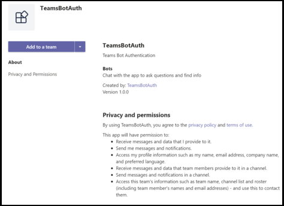

# <a name="add-authentication-to-your-teams-bot"></a>Teamsボットに認証を追加する

メール サービスなど、ユーザーの代わりにリソースにアクセスできるボットをMicrosoft Teamsで作成する必要がある場合があります。

この記事では、OAuth 2.0 に基づいて Azure Bot サービス v4 SDK 認証を使用する方法を示します。 これにより、ユーザーの資格情報に基づいて認証トークンを使用できるボットを簡単に開発できます。 このすべてのキーは、後で説明する **ID プロバイダーの** 使用です。

OAuth 2.0 は、Azure Active Directory (Azure AD) および他の多くの ID プロバイダーが使用する認証および承認のオープン スタンダードです。 OAuth 2.0 の基本知識は、Teamsで認証を操作するための前提条件です。

基本的な理解については [OAuth 2 の簡略化](https://aka.ms/oauth2-simplified) 、および完全な仕様については [OAuth 2.0](https://oauth.net/2/) を参照してください。

Azure Bot サービスが認証を処理する方法の詳細については、「 [会話内のユーザー認証](https://aka.ms/azure-bot-authentication)」を参照してください。

この記事では、以下について説明します。

- **認証が有効なボットを作成する方法**。 [cs-auth-sample][teams-auth-bot-cs]を使用して、ユーザーサインイン資格情報と認証トークンの生成を処理します。
- **ボットを Azure にデプロイし、ID プロバイダーに関連付ける方法**。 プロバイダーは、ユーザーサインイン資格情報に基づいてトークンを発行します。 ボットは、認証を必要とするメール サービスなどのリソースにアクセスするために、トークンを使用できます。 詳細については、「[ボットの認証フロー Microsoft Teams」を](auth-flow-bot.md)参照してください。
- **Microsoft Teams内でボットを統合する方法**. ボットが統合されたら、ログインしてチャットでメッセージを交換できます。

## <a name="prerequisites"></a>前提条件

- ボットの [基本][concept-basics]知識 、 [状態の管理][concept-state]、 ダイアログ [ライブラリ][concept-dialogs]、および [シーケンシャルな会話フローの実装][simple-dialog]方法 。
- Azure および OAuth 2.0 開発に関する知識。
- Visual Studioと Git の現在のバージョン。
- Azure アカウント。 必要に応じて [、Azure 無料アカウント](https://azure.microsoft.com/free/)を作成できます。
- 次の例を示します。

    | サンプル | ボットビルダーバージョン | 示します |
    |:---|:---:|:---|
    | [cs 認証サンプルでの][teams-auth-bot-cs]**ボット認証** | v4 | OAuthカードのサポート |
    | [js 認証サンプルでの][teams-auth-bot-js]**ボット認証** | v4| OAuthカードのサポート  |
    | [py-auth サンプルでの][teams-auth-bot-py]**ボット認証** | v4 | OAuthカードのサポート |

## <a name="create-the-resource-group"></a>リソース グループを作成する

リソース グループとサービス計画は厳密には必要ありませんが、作成したリソースを簡単に解放できます。 これは、リソースを整理して管理しやすい状態に保つには、適切な方法です。

リソース グループを使用して、Bot Framework の個々のリソースを作成します。 パフォーマンスを確保するには、これらのリソースが同じ Azure リージョンに配置されていることを確認してください。

1. ブラウザーで [**、Azure ポータル**][azure-portal]にサインインします。
1. 左側のナビゲーション パネルで、[ **リソース グループ**] を選択します。
1. 表示されたウィンドウの左上で、[タブの **追加** ] を選択して新しいリソース グループを作成します。 次の情報を入力するよう求められます。
    1. **サブスクリプション**。 既存のサブスクリプションを使用します。
    1. **リソース グループ**。 リソース グループの名前を入力します。 たとえば、  *チームリソースグループ* を挙します。 名前は一意である必要があります。
    1. [ **地域** ] ドロップダウン メニューから、[ *米国西部*] またはアプリケーションに近いリージョンを選択します。
    1. [ **レビューと作成** ] ボタンを選択します。 *検証が渡された* というバナーが表示されます。
    1. [ **作成** ] ボタンを選択します。 リソース グループの作成には数分かかる場合があります。

> [!TIP]
> このチュートリアルの後半で作成するリソースと同様に、このリソース グループをダッシュボードにピン留めして簡単にアクセスすることをお勧めします。 これを行う場合は、ピン アイコン &#128204を選択します。ダッシュボードの右上に表示されます。

## <a name="create-the-service-plan"></a>サービス計画の作成

1. 左側のナビゲーション パネルの [**[Azure Portal]**][azure-portal]で、[ **リソースの作成**] を選択します。
1. 検索ボックスに *「App Service プラン*」と入力します。 検索結果から **[App Service プラン]** カードを選択します。
1. [**作成**] を選択します。
1. 次の情報を入力するように求められます。
    1. **サブスクリプション**。 既存のサブスクリプションを使用できます。
    1. **リソース グループ**。 以前に作成したグループを選択します。
    1. **名前**. サービスプランの名前を入力します。 たとえば、  *チームサービスプランを挙げる* 場合があります。 グループ内で名前が一意である必要があることに注意してください。
    1. **オペレーティング システム**: *Windows* または該当する OS を選択します。
    1. **地域**. [ *米国西部* ] またはアプリケーションに近いリージョンを選択します。
    1. **価格レベル**: *[標準 S1]* が選択されていることを確認します。 これはデフォルト値である必要があります。
    1. [ **レビューと作成** ] ボタンを選択します。 *検証が渡された* というバナーが表示されます。
    1. [**作成**] を選択します。 アプリ サービス プランの作成には数分かかる場合があります。 計画はリソース グループに一覧表示されます。

## <a name="create-the-bot-channels-registration"></a>ボット チャネル登録の作成

ボット チャネル登録は、Microsoft アプリ ID とアプリ パスワード (クライアント シークレット) がある場合、ボット フレームワークに Web サービスをボットとして登録します。

> [!IMPORTANT]
> Azure でホストされていない場合にのみ、ボットを登録する必要があります。 Azure ポータルを通じて [ボットを作成](/azure/bot-service/abs-quickstart?view=azure-bot-service-4.0&viewFallbackFrom=azure-bot-service-3.0&preserve-view=true) した場合は、サービスに既に登録されています。 [ボット フレームワーク](https://dev.botframework.com/bots/new)または[AppStudio](~/concepts/build-and-test/app-studio-overview.md)を使用してボットを作成した場合、ボットは Azure に登録されていません。

[!INCLUDE [bot channels registration steps](~/includes/bots/azure-bot-channels-registration.md)]

> [!NOTE]
> [米国西部] を選択した場合でも、ボット チャネル登録リソースに **グローバル** リージョンが表示されます。 これは正常な動作です。

詳細については、「 [Teamsのボットの作成](../create-a-bot-for-teams.md)」を参照してください。

## <a name="create-the-identity-provider"></a>ID プロバイダーを作成する

認証に使用できる ID プロバイダーが必要です。
この手順では、Azure AD プロバイダーを使用します。他の Azure AD でサポートされている ID プロバイダーも使用できます。

1. Azure [**ポータル**][azure-portal]の左側のナビゲーション パネルで **、[Azure Active Directory]** を選択します。
    > [!TIP]
    > アプリケーションによって要求されたアクセス許可を委任することに同意できるテナントに、この Azure AD リソースを作成して登録する必要があります。
    > テナントの作成方法については、「 [ポータルにアクセスしてテナントを作成する](/azure/active-directory/fundamentals/active-directory-access-create-new-tenant)」を参照してください。
1. 左側のパネルで、[ **アプリの登録] を** 選択します。
1. 右のパネルで、左上の **新規登録** タブを選択します。
1. 次の情報を入力するように求められます。
   1. **名前**. アプリケーションの名前を入力します。 例としては、  *ボットチーム ID を挙します*。 名前は一意である必要があります。
   1. アプリケーションの **[サポートされるアカウントの種類]** を選択します。 *組織ディレクトリ (任意の Azure AD ディレクトリ - マルチテナント) と個人の Microsoft アカウント (xbox* など) のアカウントSkype選択します。
   1. リダイレクト **URI** の場合:<br/>
       &#x2713;**Web** を選択します。 <br/>
       &#x2713; URL を に設定 `https://token.botframework.com/.auth/web/redirect` します。
   1. **[登録]** を選択します。

1. 作成されると、Azure はアプリの **[概要** ] ページを表示します。 次の情報をコピーしてファイルに保存します。

    1. **アプリケーション (クライアント) ID の** 値。 この Azure ID アプリケーションをボットに登録する場合は、この値を *後でクライアント ID* として使用します。
    1. **ディレクトリ (テナント) ID の** 値。 この値は、後で *テナント ID* として使用して、この Azure ID アプリケーションをボットに登録します。

1. 左側のパネルで、[ **証明書&シークレット** ] を選択して、アプリケーションのクライアント シークレットを作成します。

   1. [ **クライアント シークレット**] で 、[ **新しいクライアント シークレット**&#x2795; ] を選択します。
   1. このアプリ用に作成する必要がある他のユーザー *(Teams の Bot ID アプリ* など) からこのシークレットを識別するための説明を追加します。
   1. [ **有効期限]** を選択に設定します。
   1. **[追加]** を選択します。
   1. このページを出る前 **に、秘密を記録します**。 この値は、後で Azure AD アプリケーションをボットに登録するときに _、クライアント シークレット_ として使用します。

### <a name="configure-the-identity-provider-connection-and-register-it-with-the-bot"></a>ID プロバイダー接続を構成し、ボットに登録する

注: サービス プロバイダーの 2 つのオプションは、Azure AD V1 と Azure AD V2 です。  2 つのプロバイダーの違い [は、ここで](/azure/active-directory/azuread-dev/azure-ad-endpoint-comparison)要約しますが、一般的に、V2 は、ボットのアクセス許可の変更に関してより柔軟に対応できます。  GraphAPI のアクセス許可はスコープ フィールドに一覧表示され、新しいアクセス許可が追加されると、ボットはユーザーが次のサインインで新しいアクセス許可に同意できるようにします。  V1 の場合、OAuth ダイアログで新しいアクセス許可を求めるユーザーがボットの同意を削除する必要があります。 

#### <a name="azure-ad-v1"></a>Azure AD V1

1. Azure [**ポータル**][azure-portal]で、ダッシュボードからリソース グループを選択します。
1. ボット チャネル登録リンクを選択します。
1. リソース ページを開き、[**設定**] の下の **[構成]** を選択します。 
1. **[OAuth 接続設定の追加**] を選択します。    
次の図は、リソース ページで対応する選択を示しています。  

1. フォームに次のように入力します。

    1. **名前**. 接続の名前を入力します。 この名前は、ファイル内のボットで使用 `appsettings.json` します。 たとえば *、ボットチーム認証1*.
    1. **サービス プロバイダ**: [**Azure Active Directory**] を選択します。 これを選択すると、Azure AD 固有のフィールドが表示されます。
    1. **クライアント ID**.上記の手順で、Azure ID プロバイダー アプリ用に記録したアプリケーション (クライアント) ID を入力します。
    1. **クライアント シークレット**: 上記の手順で、Azure ID プロバイダー アプリに記録したシークレットを入力します。
    1. **許可の種類**: `authorization_code`を入力します。
    1. **ログイン URL**: `https://login.microsoftonline.com`を入力します。
    1. **[テナント ID]** には、ID プロバイダー アプリの作成時に選択したサポート対象アカウントの種類に応じて、Azure ID アプリまたは **共通** のアカウント ID に以前に記録した **ディレクトリ (テナント) ID** を入力します。 割り当てる値を決定するには、次の基準に従います。

        - *この組織ディレクトリのアカウントのみ (Microsoft のみ - シングル テナント)* または *任意の組織ディレクトリ (Microsoft AAD ディレクトリ - マルチ テナント) のアカウントのいずれかを* 選択した場合は、AAD アプリの前に記録した **テナント ID** を入力します。 これは、認証可能なユーザーに関連付けられたテナントになります。

        - *組織のディレクトリで [アカウント] を選択した場合 ([任意の AAD ディレクトリ - マルチ テナント] および [Skype、Xbox、Outlookなど] の Microsoft 個人アカウントなど) は、* テナント ID ではなく **共通** という単語を入力します。 それ以外の場合、AAD アプリは ID が選択されたテナントを通じて検証し、個人の Microsoft アカウントを除外します。

    h. [ **リソース URL]** に を入力 `https://graph.microsoft.com/` します。 これは、現在のコード サンプルでは使用されていません。  
    i. **[スコープ] は空白のままにします**。 次の図は、例です。

    

1. **[保存]** を選択します。

#### <a name="azure-ad-v2"></a>Azure AD V2

1. Azure [**ポータル**][azure-portal]で、ダッシュボードからリソース グループを選択します。
1. ボット チャネル登録リンクを選択します。
1. リソース ページを開き、[**設定**] の下の **[構成]** を選択します。 
1. **[OAuth 接続設定の追加**] を選択します。  
次の図は、リソース ページで対応する選択を示しています。        
 

1. フォームに次のように入力します。

    1. **名前**. 接続の名前を入力します。 この名前は、ファイル内のボットで使用 `appsettings.json` します。 たとえば *、ボットチーム認証2*.
    1. **サービス プロバイダ**: **[v2 Azure Active Directory]** を選択します。 これを選択すると、Azure AD 固有のフィールドが表示されます。
    1. **クライアント ID**.上記の手順で、Azure ID プロバイダー アプリ用に記録したアプリケーション (クライアント) ID を入力します。
    1. **クライアント シークレット**: 上記の手順で、Azure ID プロバイダー アプリに記録したシークレットを入力します。
    1. **トークン Exchange URL**: 空白のままにします。
    1. **[テナント ID]** には、ID プロバイダー アプリの作成時に選択したサポート対象アカウントの種類に応じて、Azure ID アプリまたは **共通** のアカウント ID に以前に記録した **ディレクトリ (テナント) ID** を入力します。 割り当てる値を決定するには、次の基準に従います。

        - *この組織ディレクトリのアカウントのみ (Microsoft のみ - シングル テナント)* または *任意の組織ディレクトリ (Microsoft AAD ディレクトリ - マルチ テナント) のアカウントのいずれかを* 選択した場合は、AAD アプリの前に記録した **テナント ID** を入力します。 これは、認証可能なユーザーに関連付けられたテナントになります。

        - *組織のディレクトリで [アカウント] を選択した場合 ([任意の AAD ディレクトリ - マルチ テナント] および [Skype、Xbox、Outlookなど] の Microsoft 個人アカウントなど) は、* テナント ID ではなく **共通** という単語を入力します。 それ以外の場合、AAD アプリは ID が選択されたテナントを通じて検証し、個人の Microsoft アカウントを除外します。

    1. **[スコープ]** に、このアプリケーションが必要とするグラフのアクセス許可のスペース区切りのリストを入力します。 

1. **[保存]** を選択します。

### <a name="test-the-connection"></a>接続をテストする

1. 接続エントリを選択して、作成した接続を開きます。
1. **[サービス プロバイダー接続設定**] パネルの上部にある [**テスト** 接続] を選択します。
1. 初めてこれを行うと、新しいブラウザウィンドウが開き、アカウントを選択するよう求める。 使用する 1 つを選択します。
1. 次に、ID プロバイダーにデータ (資格情報) の使用を許可するように求められます。 次の図は、例です。

    

1. **[同意する]** を選択します。
1. これで、[ **接続のテストに \<your-connection-name> 成功** しました] ページにリダイレクトされます。 エラーが発生した場合は、ページを更新します。 次の図は、例です。

    

接続名は、ボット コードがユーザー認証トークンを取得するために使用します。

## <a name="prepare-the-bot-sample-code"></a>ボットサンプルコードの準備

予備的な設定が完了したら、この記事で使用するボットの作成に焦点を当てましょう。

# <a name="cnet"></a>[C#/.NET](#tab/dotnet)

1. [クローン cs 認証サンプル][teams-auth-bot-cs].
1. Visual Studioを起動します。
1. ツール バーで **[ファイル - >開く -> Project/ソリューション] を** 選択し、ボット プロジェクトを開きます。
1. C# で次の **appsettings.jsを** 更新します。

    - `ConnectionName`ボット チャネル登録に追加した ID プロバイダー接続の名前を設定します。 この例で使用した名前は *、ボットハウザDv1* です。
    - `MicrosoftAppId`ボット チャネル登録時に保存した **ボット アプリ ID** に設定します。
    - `MicrosoftAppPassword`ボットチャネル登録時に保存した **顧客の秘密** に設定します。

    ボット シークレットの文字によっては、パスワードをエスケープする XML が必要になる場合があります。 たとえば、アンパサンド (&) は `&amp;` .

     [!code-json[appsettings](~/../botbuilder-samples/samples/csharp_dotnetcore/46.teams-auth/appsettings.json?range=1-5)]

1. ソリューション エクスプローラーで、フォルダーに移動 `TeamsAppManifest` し、ボット `manifest.json` `id` `botId` チャネル登録時に保存した **ボット アプリ ID** を開いて設定します。

# <a name="javascript"></a>[JavaScript](#tab/node-js)

1. クローン [ノード認証サンプル][teams-auth-bot-js]:
1. コンソールで、プロジェクトに移動します。 </br></br>
`cd samples/javascript_nodejs/46.teams`  
1. モジュールのインストール</br></br>
`npm install`
1. 次のように **.env** の構成を更新します。

    - `MicrosoftAppId`ボット チャネル登録時に保存した **ボット アプリ ID** に設定します。
    - `MicrosoftAppPassword`ボットチャネル登録時に保存した **顧客の秘密** に設定します。
    - ID `connectionName` プロバイダー接続の名前に を設定します。
    ボット シークレットの文字によっては、パスワードをエスケープする XML が必要になる場合があります。 たとえば、アンパサンド (&) は `&amp;` .

     [!code-javascript[settings](~/../botbuilder-samples/samples/javascript_nodejs/46.teams-auth/.env)]

1. フォルダーで `teamsAppManifest` 、Microsoft `manifest.json` アプリ `id` **ID** と `botId` **、ボット** チャネル登録時に保存したボット アプリ ID を開いて設定します。

# <a name="python"></a>[Python](#tab/python)

1. github リポジトリから [py 認証サンプル][teams-auth-bot-py] を複製します。
1. **config.py** の更新 :

    - `ConnectionName`ボットに追加した OAuth 接続設定の名前を設定します。
    - `MicrosoftAppId` `MicrosoftAppPassword` ボットのアプリ ID とアプリシークレットを設定します。

      ボット シークレットの文字によっては、パスワードをエスケープする XML が必要になる場合があります。 たとえば、アンパサンド (&) は `&amp;` .

      [!code-python[config](~/../botbuilder-samples/samples/python/46.teams-auth/config.py?range=14-16)]

---

### <a name="deploy-the-bot-to-azure"></a>ボットを Azure にデプロイする

ボットをデプロイするには [、「Azure にボットをデプロイ](https://aka.ms/azure-bot-deployment-cli)する方法」の手順に従います。

または、Visual Studio中に、次の手順を実行できます。

1. ソリューション *エクスプローラー* Visual Studioプロジェクト名を選択して保持 (または右クリック) します。
1. ドロップダウン メニューで、[ **発行**] を選択します。
1. 表示されたウィンドウで、[ **新規** ] リンクを選択します。
1. ダイアログウィンドウで、左側の **[App Service]** を選択し、右側に **[新規作成]** を選択します。
1. [ **公開** ] ボタンを選択します。
1. 次のダイアログ ウィンドウで、必要な情報を入力します。 例を次に示します。

    

1. [**作成**] を選択します。
1. 展開が正常に完了すると、Visual Studioに反映されていることがわかります。 さらに、あなたの *ボットの準備* ができているというページがデフォルトのブラウザに表示されます。 URL は次のようになります `https://botteamsauth.azurewebsites.net/` 。 ファイルに保存します。
1. ブラウザーで [**、Azure ポータル**][azure-portal]に移動します。
1. リソース グループを確認すると、ボットが他のリソースと共に一覧表示されます。 次の図は、例です。

    

1. リソース グループで、ボット チャネル登録名 (リンク) を選択します。
1. 左側のパネルで[**設定**] を選択します。
1. [ **メッセージング エンドポイント** ] ボックスに、上記で取得した URL を入力し、その後に `api/messages` . これは、例です `https://botteamsauth.azurewebsites.net/api/messages` 。
1. 左上の **[保存]** ボタンを選択します。

## <a name="test-the-bot-using-the-emulator"></a>エミュレーターを使用してボットをテストする

まだ実行していない場合は[、Microsoft Bot Framework Emulator](https://aka.ms/bot-framework-emulator-readme)をインストールします。 [「エミュレータを使用してデバッグする](https://aka.ms/bot-framework-emulator-debug-with-emulator)」も参照してください。

ボットサンプルログインが機能するためには、エミュレータを設定する必要があります。

### <a name="configure-the-emulator-for-authentication"></a>認証用のエミュレーターの構成

ボットで認証が必要な場合は、エミュレーターを構成する必要があります。 構成するには:

1. エミュレーターを起動します。
1. エミュレーターで、左下にある歯車アイコン&#9881;、または右上の **[エミュレーター 設定]** タブを選択します。
1. [ **バージョン 1.0 認証トークンを使用する**] のチェックボックスをオンにします。
1. **ngrok** ツールへのローカル パスを入力します。 Bot Framework Emulator / ngrok トンネリング統合 [Wiki](https://github.com/Microsoft/BotFramework-Emulator/wiki/Tunneling-(ngrok))を *参照してください*。 ツールの詳細については [、ngrok](https://ngrok.com/)を参照してください。
1. **エミュレータが起動したら、実行 ngrok のチェックボックスをオンにします**。
1. [ **保存** ] ボタンを選択します。

ボットがサインイン カードを表示し、ユーザーがサインイン ボタンを選択すると、ユーザーが認証プロバイダーでサインインするために使用できるページがエミュレーターによって開かれます。
ユーザーがトークンを生成すると、プロバイダーはユーザー トークンを生成し、ボットに送信します。 その後、ボットはユーザーの代わりに動作できます。

### <a name="test-the-bot-locally"></a>ボットをローカルでテストする

認証メカニズムを構成した後、実際のボット テストを実行できます。  

1. たとえば、Visual Studioを使用して、ボット サンプルをコンピューターでローカルに実行します。
1. エミュレーターを起動します。
1. [ **ボットを開く** ] ボタンを選択します。
1. [ **ボット URL]** ボックスに、ボットのローカル URL を入力します。 通常、 `http://localhost:3978/api/messages` .
1. Microsoft **アプリ ID** に、 からボットのアプリ ID を入力 `appsettings.json` します。
1. Microsoft **アプリ のパスワード** に、 からボットのアプリ パスワードを入力 `appsettings.json` します。
1. **[Connect]** を選択します。
1. ボットが起動して実行されたら、サインイン カードを表示するテキストを入力します。
1. **[サインイン]** ボタンを選択します。
1. ポップアップ ダイアログが表示され **、[URL を開く確認]** が表示されます。 これは、ボットのユーザー (ユーザー) の認証を許可するためです。  
1. **[確認]** を選択します。
1. 確認された場合は、該当するユーザーのアカウントを選択します。
1. エミュレータに使用した構成に応じて、次のいずれかを取得します。
    1. **サインイン確認コードの使用**  
      &#x2713; 検証コードを表示するウィンドウが開きます。  
      &#x2713; サインインを完了するために、検証コードをコピーしてチャット ボックスに入力します。
    1. **認証トークンの使用**:  
      &#x2713; 資格情報に基づいてログインしています。

    次の図は、ログインした後のボット UI の例です。

    

1. ボットが *[トークンを表示しますか? ]* をクリックすると、次のような応答が返されます。

    

1. 入力チャットボックスに **ログアウト** を入力してサインアウトします。これによりユーザー トークンが解放され、再度サインインするまでボットはユーザーに代わって行動できなくなります。

> [!NOTE]
> ボット認証では **、Bot コネクタ サービス** を使用する必要があります。 サービスは、ボットのボット チャネル登録情報にアクセスします。

## <a name="test-the-deployed-bot"></a>展開されたボットをテストする

<!--There are several testing scenarios here. Ideally, we'd have a separate article on the what, why, 
and when for these, and just reference that from here, along with the set of steps that exercises the bot code.-->

1. ブラウザーで [**、Azure ポータル**][azure-portal]に移動します。
1. リソース グループを検索します。
1. リソースリンクを選択します。 リソース ページが表示されます。
1. リソース ページで **、[Web チャットでテスト**] を選択します。 ボットが起動し、定義済みの案内応答が表示されます。
1. チャットボックスに何でも入力します。
1. [サインイン] ボックス **を** 選択します。
1. ポップアップ ダイアログが表示され **、[URL を開く確認]** が表示されます。 これは、ボットのユーザー (ユーザー) の認証を許可するためです。  
1. **[確認]** を選択します。
1. 確認された場合は、該当するユーザーのアカウントを選択します。
    次の図は、ログインした後のボット UI の例です。

    .

1. [ **はい** ] をクリックして認証トークンを表示します。 次の図は、例です。

    .

1. ログアウトを入力してサインアウトします。

    

> [!NOTE]
> サインインに問題がある場合は、前の手順で説明したように接続を再度テストしてみてください。 これにより、認証トークンが再作成される可能性があります。
> Azure の Bot Framework Web Chat クライアントでは、認証が正しく確立される前に、何度かサインインする必要があります。

## <a name="install-and-test-the-bot-in-teams"></a>Teamsでボットをインストールしてテストする

1. ボット プロジェクトで、フォルダーに 、 `TeamsAppManifest` `manifest.json` と ファイルが含まれていることを確認 `outline.png` `color.png` します。
1. ソリューション エクスプローラーで、フォルダーに移動 `TeamsAppManifest` します。 `manifest.json`次の値を割り当てて編集します。
    1. ボット チャネル登録時に受け取った **ボット アプリ ID** が に割り当てられていることを確認 `id` `botId` します。
    1. この値を割り当てます `validDomains: [ "token.botframework.com" ]` : 。
1. 、  `manifest.json` 、および ファイルを選択して圧縮 `outline.png` `color.png` します。
1. **Microsoft Teams** を開きます。
1. 左側のパネルの下部にある **[アプリ**] アイコン を選択します。
1. 右側のパネルの下部にある [カスタム **アプリアップロード]** を選択します。
1. フォルダーに移動 `TeamsAppManifest` し、zip 形式のマニフェストをアップロードします。
次のウィザードが表示されます。

    

1. **[チームに追加]** ボタンを選択します。
1. 次のウィンドウで、ボットを使用するチームを選択します。
1. [ **ボットのセットアップ** ] ボタンを選択します。
1. 左側のパネルで3つの点(&#x25cf;&#x25cf;&#x25cf;)を選択します。 次に **、アプリケーションスタジオアイコンを** 選択します。
1. [ **マニフェスト エディター** ] タブを選択します。アップロードしたボットのアイコンが表示されます。
1. また、ボットとメッセージを交換するために使用できるチャット リストに連絡先としてリストされているボットを表示できるはずです。

### <a name="testing-the-bot-locally-in-teams"></a>Teamsでボットをローカルにテストする

Microsoft Teams完全にクラウドベースの製品であり、アクセスするすべてのサービスを HTTPS エンドポイントを使用してクラウドから利用できるようにする必要があります。 そのため、ボット (サンプル) がTeamsで動作できるようにするには、コードを選択したクラウドに発行するか、またはローカルで実行されているインスタンスを **トンネリング** ツールを介して外部からアクセスできるようにする必要があります。 マシン上でローカルに開くポートの外部アドレス指定可能な URL を作成する  [ngrok](https://ngrok.com/download)をお勧めします。
Microsoft Teams アプリをローカルで実行する準備として ngrok を設定するには、次の手順を実行します。

1. ターミナル ウィンドウで、インストールしたディレクトリに移動 `ngrok.exe` します。 *環境変数* のパスを指し示す設定を行うことをお勧めします。
1. たとえば、 を実行 `ngrok http 3978 --host-header=localhost:3978` します。 必要に応じてポート番号を交換します。
指定したポートでリッスンする ngrok が起動します。 その代わりに、ngrok が実行されている間有効な、外部アドレス指定可能な URL が提供されます。 次の図は、例です。

    .

1. 転送 HTTPS アドレスをコピーします。 次のような値を指定します `https://dea822bf.ngrok.io/` 。
1. を `/api/messages` 取得するために追加 `https://dea822bf.ngrok.io/api/messages` します。 これは、マシン上でローカルに実行され、Microsoft Teamsのチャットで Web 経由で到達可能なボットの **メッセージ エンドポイント** です。
1. 最後に実行する手順は、デプロイされたボットのメッセージ エンドポイントを更新することです。 この例では、Azure にボットをデプロイしました。 だから**次の手順を実行してみましょう:
    1. ブラウザーで [**Azure ポータル**][azure-portal]に移動します。
    1. **[ボット チャネル登録]** を選択します。
    1. 左側のパネルで[**設定**] を選択します。
    1. 右側のパネルの [ **メッセージング エンドポイント** ] ボックスに ngrok URL `https://dea822bf.ngrok.io/api/messages` を入力します。
1. デバッグ モードなどで、ボットVisual Studioローカルに起動します。
1. Bot Framework ポータルのテスト **Web チャット** を使用して、ローカルで実行しながらボットをテストします。 エミュレーターと同様に、このテストでは、Teams固有の機能にアクセスすることはできません。
1. 実行中のターミナル ウィンドウでは `ngrok` 、ボットと Web チャット クライアント間の HTTP トラフィックを確認できます。 より詳細なビューが必要な場合は、ブラウザウィンドウに `http://127.0.0.1:4040` 、前のターミナルウィンドウから取得した画面を入力します。 次の図は、例です。

    .

> [!NOTE]
> ngrok を停止して再起動すると、URL が変更されます。 プロジェクトで ngrok を使用し、使用している機能に応じて、すべての URL 参照を更新する必要があります。
 

## <a name="additional-information"></a>追加情報

### <a name="teamsappmanifestmanifestjson"></a>チームアプリマニフェスト/manifest.jsオン

このマニフェストには、Microsoft Teamsがボットに接続するために必要な情報が含まれています。  

```json
{
  "$schema": "https://developer.microsoft.com/json-schemas/teams/v1.8/MicrosoftTeams.schema.json",
  "manifestVersion": "1.5",
  "version": "1.0.0",
  "id": "",
  "packageName": "com.teams.auth.bot",
  "developer": {
    "name": "TeamsBotAuth",
    "websiteUrl": "https://www.microsoft.com",
    "privacyUrl": "https://www.teams.com/privacy",
    "termsOfUseUrl": "https://www.teams.com/termsofuse"
  },
  "icons": {
    "color": "color.png",
    "outline": "outline.png"
  },
  "name": {
    "short": "TeamsBotAuth",
    "full": "Teams Bot Authentication"
  },
  "description": {
    "short": "TeamsBotAuth",
    "full": "Teams Bot Authentication"
  },
  "accentColor": "#FFFFFF",
  "bots": [
    {
      "botId": "",
      "scopes": [
        "groupchat",
        "team"
      ],
      "supportsFiles": false,
      "isNotificationOnly": false
    }
  ],
  "permissions": [
    "identity",
    "messageTeamMembers"
  ],
  "validDomains": [ "token.botframework.com" ]
}
```

認証では、Teamsは、以下で説明するとおり、他のチャネルとは若干異なる動作をします。

### <a name="handling-invoke-activity"></a>呼び出しアクティビティの処理

**呼び出しアクティビティ** は、他のチャネルで使用されるイベント アクティビティではなく、ボットに送信されます。
これは **、アクティビティ ハンドラ** をサブクラス化することによって行われます。

# <a name="cnet"></a>[C#/.NET](#tab/dotnet-sample)

**ボット/ダイアログボット.cs**

[!code-csharp[ActivityHandler](~/../botbuilder-samples/samples/csharp_dotnetcore/46.teams-auth/Bots/DialogBot.cs?range=19-51)]

**ボット/チームボット.cs**

**OAuthPrompt** が使用されている場合は、*呼び出しアクティビティ* をダイアログに転送する必要があります。

[!code-csharp[ActivityHandler](~/../botbuilder-samples/samples/csharp_dotnetcore/46.teams-auth/Bots/TeamsBot.cs?range=34-42)]

#### <a name="teamsactivityhandlercs"></a>チームアクティビティハンドラー.cs

```csharp

protected virtual Task OnInvokeActivityAsync(ITurnContext<IInvokeActivity> turnContext, CancellationToken cancellationToken)
{
    switch (turnContext.Activity.Name)
    {
        case "signin/verifyState":
            return OnSigninVerifyStateAsync(turnContext, cancellationToken);

        default:
            return Task.CompletedTask;
    }
}

protected virtual Task OnSigninVerifyStateAsync(ITurnContext<IInvokeActivity> turnContext, CancellationToken cancellationToken)
{
    return Task.CompletedTask;
}
```

# <a name="javascript"></a>[JavaScript](#tab/node-js-dialog-sample)

**ボット/dialogBot.js**

[!code-javascript[ActivityHandler](~/../botbuilder-samples/samples/javascript_nodejs/46.teams-auth/bots/dialogBot.js?range=4-46)]

**ボット/teamsBot.js**

**OAuthPrompt** が使用されている場合は、*呼び出しアクティビティ* をダイアログに転送する必要があります。

[!code-javascript[ActivityHandler](~/../botbuilder-samples/samples/javascript_nodejs/46.teams-auth/bots/teamsBot.js?range=4-33)]

**ダイアログ/mainDialog.js**

ダイアログ ステップ内でを使用 `beginDialog` して、ユーザーにサインインを求める OAuth プロンプトを開始します。

- ユーザーが既にサインインしている場合、ユーザーに確認メッセージを表示せずにトークン応答イベントが生成されます。
- それ以外の場合は、ユーザーにサインインを求めるメッセージが表示されます。 Azure Bot サービスは、ユーザーがサインインを試みた後にトークン応答イベントを送信します。

[!code-javascript[AddOAuthPrompt](~/../botbuilder-samples/samples/javascript_nodejs/46.teams-auth/dialogs/mainDialog.js?range=50-52)]

次のダイアログ ステップで、前の手順の結果にトークンが存在するかどうか確認します。 null でない場合、ユーザーは正常にサインインしました。

[!code-javascript[AddOAuthPrompt](~/../botbuilder-samples/samples/javascript_nodejs/46.teams-auth/dialogs/mainDialog.js?range=50-64)]

**ボット/logoutDialog.js**

[!code-javascript[allow-logout](~/../botbuilder-samples/samples/javascript_nodejs/46.teams-auth/dialogs/logoutDialog.js?range=31-42&highlight=7)]

# <a name="python"></a>[Python](#tab/python-sample)

**ボット/dialog_bot.py**

[!code-python[ActivityHandler](~/../botbuilder-samples/samples/python/46.teams-auth/bots/dialog_bot.py?range=10-42)]

**ボット/teams_bot.py**

**OAuthPrompt** が使用されている場合は、*呼び出しアクティビティ* をダイアログに転送する必要があります。

[!code-python[on_token_response_event](~/../botbuilder-samples/samples/python/46.teams-auth/bots/teams_bot.py?range=38-45)]

**ダイアログ/main_dialog.py**

ダイアログ ステップ内でを使用 `begin_dialog` して、ユーザーにサインインを求める OAuth プロンプトを開始します。

- ユーザーが既にサインインしている場合、ユーザーに確認メッセージを表示せずにトークン応答イベントが生成されます。
- それ以外の場合は、ユーザーにサインインを求めるメッセージが表示されます。 Azure Bot サービスは、ユーザーがサインインを試みた後にトークン応答イベントを送信します。

[!code-python[Add OAuthPrompt](~/../botbuilder-samples/samples/python/46.teams-auth/dialogs/main_dialog.py?range=48-49)]

次のダイアログ ステップで、前の手順の結果にトークンが存在するかどうか確認します。 null でない場合、ユーザーは正常にサインインしました。

[!code-python[Add OAuthPrompt](~/../botbuilder-samples/samples/python/46.teams-auth/dialogs/main_dialog.py?range=51-61)]

**ダイアログ/logout_dialog.py**

[!code-python[allow logout](~/../botbuilder-samples/samples/python/46.teams-auth/dialogs/logout_dialog.py?range=29-36&highlight=6)]

---

## <a name="see-also"></a>関連項目

[Azure ボット サービスを使用して認証を追加する](https://aka.ms/azure-bot-add-authentication)

<!-- Footnote-style links -->

[azure-portal]: https://ms.portal.azure.com

[concept-basics]: /azure/bot-service/bot-builder-basics?view=azure-bot-service-4.0&preserve-view=true
[concept-state]: /azure/bot-service/bot-builder-concept-state?view=azure-bot-service-4.0&preserve-view=true
[concept-dialogs]: /azure/bot-service/bot-builder-concept-dialog?view=azure-bot-service-4.0&preserve-view=true
[simple-dialog]: /azure/bot-service/bot-builder-dialog-manage-conversation-flow?view=azure-bot-service-4.0&preserve-view=true

[teams-auth-bot-cs]: https://github.com/microsoft/BotBuilder-Samples/tree/master/samples/csharp_dotnetcore/46.teams-auth

[teams-auth-bot-py]: https://github.com/microsoft/BotBuilder-Samples/tree/master/samples/python/46.teams-auth

[teams-auth-bot-js]: https://github.com/microsoft/BotBuilder-Samples/tree/master/samples/javascript_nodejs/46.teams-auth

[azure-aad-blade]: https://ms.portal.azure.com/#blade/Microsoft_AAD_IAM/ActiveDirectoryMenuBlade/Overview
[aad-registration-blade]: https://ms.portal.azure.com/#blade/Microsoft_AAD_IAM/ActiveDirectoryMenuBlade/RegisteredAppsPreview
