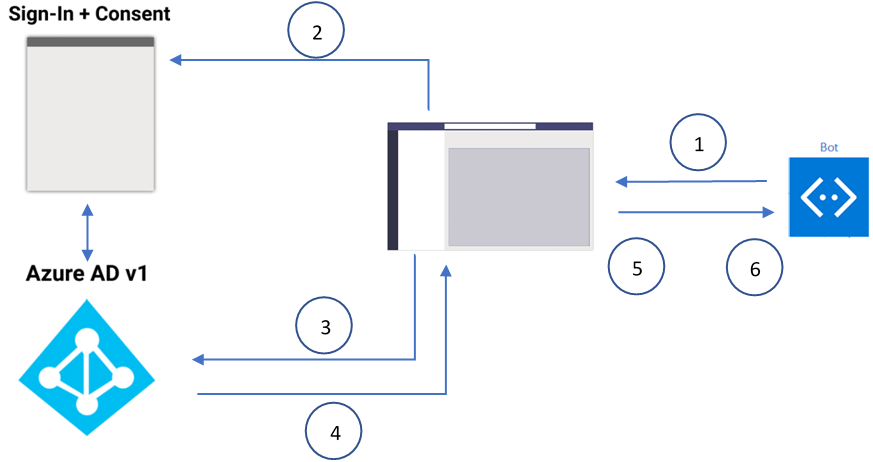

# <a name="single-sign-on-sso-support-for-bots"></a>ボットのシングル サインオン (SSO) のサポート

ユーザーがサインイン資格情報をAzure Active Directoryする必要がある回数を最小限に抑えるために、シングル サインオン認証は、認証トークンをサイレント モードで更新します。 ユーザーがアプリの使用に同意した場合は、自動的にサインインしている別のデバイスで再度同意する必要はありません。 タブとボットには、SSO のサポートのための同様のフローがあります。 ただし、ボット [はトークンを要求](#request-a-bot-token) し [、別のプロトコルで](#receive-the-bot-token) 応答を受信します。

>[!NOTE]
> OAuth 2.0 は、ユーザーや他の多くの ID プロバイダーが使用する認証と承認Azure AD標準です。 OAuth 2.0 の基本的な理解は、認証を使用する場合の前提条件Teams。

## <a name="bot-sso-at-runtime"></a>実行時のボット SSO

次の図は、ボットでの SSO のフローを示しています。



次の手順は、認証およびボット アプリケーション トークンの使用に役立ちます。

1. ボットは、ボット アプリケーションのTeamsを取得するために含まれる OAuthCard を使用してメッセージ `tokenExchangeResource` を送信します。 ユーザーは、アクティブなすべてのユーザー エンドポイントでメッセージを受信します。

   > [!NOTE]
   >
   > * ユーザーは、一度に複数のアクティブなエンドポイントを持つ可能性があります。
   > * ボット トークンは、すべてのアクティブなユーザーのエンドポイントから受信されます。
   > * SSO をサポートするには、アプリを個人用のスコープにインストールする必要があります。


1. 現在のユーザーが初めてボット アプリケーションを使用している場合は、次のいずれかの操作を行う要求プロンプトがユーザーに表示されます。
    * 必要に応じて同意をしてください。
    * 2 要素認証などのステップ アップ認証を処理します。

1. Teamsユーザーのボット アプリケーション トークンをAzure ADエンドポイントから要求します。

1. Azure ADアプリケーションにボット アプリケーション トークンを送信Teamsします。

1. Teamsサインイン **/tokenExchange** を使用して呼び出しによって返される値オブジェクトの一部として、トークンをボットに送信します。
  
1. ボット アプリケーションの解析されたトークンは、ユーザーのメール アドレスなど、必要な情報を提供します。
  
## <a name="develop-an-sso-teams-bot"></a>SSO サーバー ボットTeamsする
  
次の手順では、SSO ボットを開発Teamsします。

1. [アプリをポータルから登録Azure ADします](#register-your-app-through-the-azure-ad-portal)。
1. [ボットのTeamsアプリケーション マニフェストを更新します](#update-your-teams-application-manifest-for-your-bot)。
1. [ボット トークンを要求および受信するコードを追加します](#add-the-code-to-request-and-receive-a-bot-token)。

### <a name="register-your-app-through-the-azure-ad-portal"></a>アプリを登録するには、Azure ADポータルを使用します。

アプリをポータルから登録する手順は、Azure AD SSO フロー[に似ています](../../../tabs/how-to/authentication/auth-aad-sso.md)。 次の手順では、アプリを登録する方法について説明します。

1. アプリ登録ポータルで新[しいAzure Active Directoryを登録](https://go.microsoft.com/fwlink/?linkid=2083908)します。

1. **[新規登録]** を選択します。 **[アプリケーション登録]** ページが表示されます。

    

1. [アプリケーションの **登録] で、** 次の手順を実行します。

   > [!NOTE]
   >
   > Azure AD アプリが Teams で認証要求を行っているのと同じテナントに登録されている場合、ユーザーは同意を求めではなく、アクセス トークンを直接付与されます。 ただし、ユーザーが別のテナントにアプリを登録している場合はAzure ADアクセス許可に同意する必要があります。

    * アプリ **の [名前** ] を入力します。
    * [ **サポートされているアカウントの種類 ]**(シングル テナントやマルチテナントなど) を選択します。
    * **[登録]** を選択します。

    

1. [概要] ページに移動します。
1. アプリケーション (クライアント **) ID の値をコピーします**。
1. [ **管理]** で **、[API の公開] に移動します。**

   > [!TIP]
   > アプリ マニフェストを後で更新するには、 **アプリケーション (クライアント) ID 値を保存** します。

   > [!IMPORTANT]
   > * スタンドアロン ボットを作成する場合は、アプリケーション ID URI を次のように入力します `api://botid-{YourBotId}` 。 ここでは *、YourBotId* は、Azure AD ID です。
   > * ボットとタブを使用してアプリをビルドしている場合は、アプリケーション ID URI と `api://fully-qualified-domain-name.com/botid-{YourBotId}` に入力します。

1. アプリケーションで必要なアクセス許可を、Azure AD Microsoft エンドポイントに対して選択Graph。
1. [デスクトップ、web、Teams](/azure/active-directory/develop/v2-permissions-and-consent)アプリケーションのアクセス許可を付与します。
1. **[スコープの追加]** を選択します。
1. プロンプトが表示されるパネルで、スコープ `access_as_user` 名として **入力します**。

   >[!NOTE]
   > クライアント アプリのaccess_as_userに使用される "管理者とユーザー" スコープは、"管理者とユーザー" です。
   >
   > 次の重要な制限に注意する必要があります。
   >
   > * 電子メール、プロファイル、Graph OpenId などのユーザー レベルの API アクセス許可offline_accessのみサポートされます。 その他の Microsoft Graph スコープ (Graphなど) へのアクセスが必要な場合は、「アクセス トークンを取得する」を参照Graph `User.Read` `Mail.Read` [してください](../../../tabs/how-to/authentication/auth-aad-sso.md#get-an-access-token-with-graph-permissions)。
   > * アプリケーションのドメイン名は、アプリケーションに登録したドメイン名と同Azure AD必要があります。
   > * アプリごとに複数のドメインは現在サポートされていません。
   > * ドメインを使用するアプリケーションは一般的であり、セキュリティ リスクである可能性があるため `azurewebsites.net` 、サポートされていません。

1. [同意 **できるWho] で、「****管理者とユーザー」と入力します**。
1. 次の詳細を入力して、スコープに適した値で管理者とユーザーの同意のプロンプトを構成 `access_as_user` します。
    * **管理者の同意表示名**: Teamsのプロファイルにアクセスできるユーザー。
    * **管理者の同意説明:** チームは、現在のユーザーとしてアプリの Web API を呼び出すことができます。
    * **ユーザーの同意表示名**: Teamsにアクセスして、ユーザーに代わって要求を行うことができます。
    * **ユーザーの同意の** 説明: Teamsと同じ権限でこのアプリの API を呼び出す場合があります。

    

1. 状態が [有効] に設定 **されている必要があります**。

    

1. **[スコープの追加]** を選択して、詳細を保存します。 表示されるスコープ名の **ドメイン部分** は、前の手順で設定した **アプリケーション ID** URI と自動的に一致し、末尾に追加 `/access_as_user` する必要があります `api://subdomain.example.com/00000000-0000-0000-0000-000000000000/access_as_user` 。

1. [承認済 **みクライアント アプリケーション**] で、アプリの Web アプリケーションに対して承認するアプリケーションを特定します。
1. **[クライアント アプリケーションの追加]** を選択します。

    

1. 次の各クライアント ID を入力し、前の手順で作成した承認スコープを選択します。
    * Teams モバイル アプリケーションまたはデスクトップ アプリケーション用 `1fec8e78-bce4-4aaf-ab1b-5451cc387264`。
    * Teams Web アプリケーション用 `5e3ce6c0-2b1f-4285-8d4b-75ee78787346`。

    

1. [認証] に **移動します**。
1. [ **プラットフォーム構成] で、[** プラットフォームの **追加] を選択します**。

    

1. **[Web]** を選びます。

    

1. アプリの **リダイレクト URI** を入力します。

   >[!NOTE]
   > この URI は完全修飾ドメイン名である必要があります。 認証応答が送信される場合には API ルートも続きます。 Teams のサンプルのいずれかをフォローしている場合、URI は `https://token.botframework.com/.auth/web/redirect` です。 詳細については、「[OAuth 2.0 承認コード フロー](/azure/active-directory/develop/v2-oauth2-auth-code-flow)」を参照してください。

    

1. 必要な **API アクセス許可を追加します**。
    * 左側 **の平面から [API の** アクセス許可] を選択します。
    * [ **プラットフォームの追加]** を選択して、アプリが必要とするユーザーが委任したアクセス許可をダウンストリーム API (User.Read など) に追加します。

1. 次の手順は、暗黙的な付与を有効にするのに役立ちます。
    * 左側の **ウィンドウから** [認証] を選択します。
    * [アクセス トークンと ID **トークン****] チェック ボックスを** オンにします。
    
    
    
    * [保存 **] を** 選択して変更を保存します。

#### <a name="update-manifest-in-azure-portal"></a>Azure portal でマニフェストを更新する

次の手順では、Azure portal でボット マニフェストを更新する方法について説明します。

1. 左側 **のウィンドウから** [マニフェスト] を選択します。
1. 構成項目が **"accessTokenAcceptedVersion": 2 に設定されている必要があります**。 指定しない場合は、値を **2 に変更します**。

    


   >[!NOTE]
   > 既にボットをテストしている場合は、Teamsアプリからサインアウトして、ボットからサインアウトするTeams。 次に、もう一度サインインして、この変更を表示します。

1. **[保存]** を選択します。

#### <a name="update-the-azure-portal-with-the-oauth-connection"></a>OAuth 接続を使用して Azure ポータルを更新する

次の手順では、OAuth 接続を使用して Azure portal を更新します。

1. Azure ポータルで [**、AzureBot に移動します。**](https://ms.portal.azure.com/#create/Microsoft.AzureBot)
1. 左側のウィンドウ **の [** 構成] に移動します。
1. **[OAuth 接続の追加] を設定。**

    

1. 次の手順では、[新しい接続設定] **フォームに入力** します。

   >[!NOTE]
   > **暗黙的な付与** は、アプリケーションでAzure ADがあります。

    * [新 **しい接続** 設定] **ページに「名前」と入力** します。

    >[!NOTE]
    > Name **は** 、実行時にボット SSO の手順 *5* でボット サービス コード [の設定を参照します](#bot-sso-at-runtime)。

    * [サービス **プロバイダー] ドロップダウン** から、[v2] **Azure Active Directory選択します**。
    * クライアント アプリケーションのクライアント IDや **クライアント** シークレットなどのクライアント資格情報をAzure ADします。
    * Token Exchange **URL の** 場合は、「Update your Teams アプリケーション マニフェスト」で定義されているスコープ値 [を使用します](#update-your-teams-application-manifest-for-your-bot)。 トークンのExchange URL は、このアプリケーションが SSO Azure ADされていることを SDK に示します。
    * テナント ID **に、共通** と *入力します*。
    * アプリケーションの **ダウンストリーム API への** アクセス許可を指定するときに構成されたスコープAzure ADします。 クライアント ID とクライアント シークレットが提供されている場合、トークン ストアは、定義されたアクセス許可を持つグラフ トークンのトークンを交換します。
    * **[保存]** を選択します。
    * **[適用]** を選択します。
   
    

### <a name="update-your-teams-application-manifest-for-your-bot"></a>ボットのTeamsアプリケーション マニフェストを更新する

アプリケーションにスタンドアロン ボットが含まれている場合は、次のコードを使用して新しいプロパティをアプリケーション マニフェストTeamsします。

```json
    "webApplicationInfo": 
        {
            "id": "00000000-0000-0000-0000-000000000000",
            "resource": "api://botid-00000000-0000-0000-0000-000000000000"
        }
```
アプリケーションにボットとタブが含まれている場合は、次のコードを使用して新しいプロパティをアプリケーション マニフェストTeamsします。

```json
    "webApplicationInfo": 
        {
            "id": "00000000-0000-0000-0000-000000000000",
            "resource": "api://subdomain.example.com/botid-00000000-0000-0000-0000-000000000000"
        }
```

**webApplicationInfo** は、次の要素の親です。

* **id** - アプリケーションのクライアント ID。 アプリケーションをアプリケーションに登録する一環として取得したアプリケーション ID は、Azure AD。 このアプリケーション ID を複数のアプリと共有Teams。 使用する各アプリケーション マニフェストAzure AD新しいアプリを作成します `webApplicationInfo` 。
* **resource** - アプリケーションのドメインとサブドメイン。 これは、アプリを作成するときに登録したプロトコルを含む、同じ URI です。アプリを登録するには、Azure AD `api://` `scope` [します](#register-your-app-through-the-azure-ad-portal)。 リソースにパスを `access_as_user` 含めない。 この URI のドメイン部分は、アプリケーション マニフェストの URL で使用されるドメインとサブドメインTeams必要があります。

### <a name="add-the-code-to-request-and-receive-a-bot-token"></a>ボット トークンを要求および受信するコードを追加する

#### <a name="request-a-bot-token"></a>ボット トークンの要求

トークンを取得する要求は、既存のメッセージ スキーマを使用した通常の POST メッセージ要求です。 これは、OAuthCard の添付ファイルに含まれています。 OAuthCard クラスのスキーマは Microsoft [Bot Schema 4.0](/dotnet/api/microsoft.bot.schema.oauthcard?view=botbuilder-dotnet-stable&preserve-view=true) で定義され、サインイン カードに似ています。 Teamsがカードに設定されている場合、この要求はサイレント トークン取得 `TokenExchangeResource` として扱います。 このチャネルTeamsトークン要求を一意に識別するプロパティだけが `Id` 受け入れされます。

>[!NOTE]
> SSO 認証Microsoft Bot Framework `OAuthPrompt` `MultiProviderAuthDialog` サポートされている場合は、SSO 認証がサポートされています。

ユーザーが初めてアプリケーションを使用し、ユーザーの同意が必要な場合は、次のダイアログ ボックスが表示され、同意エクスペリエンスが続行されます。

![[同意] ダイアログ ボックス](~/assets/images/authentication/SSO-bots-auth/bot-consent-box.png)

ユーザーが **[続行する]** を選択すると、次のイベントが発生します。

* ボットがサインイン ボタンを定義している場合、ボットのサインイン フローはアクティブ化され、メッセージ ストリームの OAuth カード ボタンからのサインイン フローに似ています。 開発者は、ユーザーの同意が必要なアクセス許可を決定する必要があります。 この方法は、 を超えるアクセス許可を持つトークンが必要な場合にお勧めします `openId` 。 たとえば、グラフ リソース用にトークンを交換する場合です。

* ボットが OAuth カードにサインイン ボタンを提供しない場合、一連の最小限のアクセス許可のためにユーザーの同意が必要です。 このトークンは、基本認証やユーザーの電子メール アドレスの取得に役立ちます。

##### <a name="c-token-request-without-a-sign-in-button"></a>C#ボタンを使用せずにトークン要求を実行する

```csharp
    var attachment = new Attachment
            {
                Content = new OAuthCard
                {
                    TokenExchangeResource = new TokenExchangeResource
                    {
                        Id = requestId
                    }
                },
                ContentType = OAuthCard.ContentType,
            };
            var activity = MessageFactory.Attachment(attachment);

            // NOTE: This activity needs to be sent in the 1:1 conversation between the bot and the user. 
            // If the bot supports group and channel scope, this code should be updated to send the request to the 1:1 chat. 

       await turnContext.SendActivityAsync(activity, cancellationToken);
```

#### <a name="receive-the-bot-token"></a>ボット トークンの受信

トークンによる応答は、ボットが今日受け取る他の呼び出しアクティビティと同じスキーマを持つ呼び出しアクティビティを介して送信されます。 唯一の違いは、呼び出し名、**サインイン/tokenExchange、****および値** フィールドです。 値 **フィールド** には **、Id**、トークンとトークン フィールドを取得する最初の要求の文字列、トークンを含む文字列値が含まれます。

>[!NOTE]
> ユーザーが複数のアクティブなエンドポイントを持つ場合、特定の要求に対して複数の応答を受信する場合があります。 トークンを使用して応答を重複排除する必要があります。

##### <a name="c-code-to-handle-the-invoke-activity"></a>C#アクティビティを処理するコードを作成する

```csharp
    protected override async Task<InvokeResponse> OnInvokeActivityAsync
    (ITurnContext<IInvokeActivity> turnContext, CancellationToken cancellationToken)
            {
                try
                {
                    if (turnContext.Activity.Name == SignInConstants.TokenExchangeOperationName && turnContext.Activity.ChannelId == Channels.Msteams)
                    {
                        await OnTokenResponseEventAsync(turnContext, cancellationToken);
                        return new InvokeResponse() { Status = 200 };
                    }
                    else
                    {
                        return await base.OnInvokeActivityAsync(turnContext, cancellationToken);
                    }
                }
                catch (InvokeResponseException e)
                {
                    return e.CreateInvokeResponse();
                }
            }
```

is `turnContext.activity.value` of type [TokenExchangeInvokeRequest](/dotnet/api/microsoft.bot.schema.tokenexchangeinvokerequest?view=botbuilder-dotnet-stable&preserve-view=true) と、ボットでさらに使用できるトークンが含まれます。 パフォーマンス上の理由からトークンを保存し、更新する必要があります。

### <a name="token-exchange-failure"></a>トークン交換の失敗

トークン交換に失敗した場合は、次のコードを使用します。

```json
{ 
    "status": "<response code>", 
    "body": 
    { 
        "id":"<unique Id>", 
        "connectionName": "<connection Name on the bot (from the OAuth card)>", 
        "failureDetail": "<failure reason if status code is not 200, null otherwise>" 
    } 
}
```

トークン交換が同意プロンプトのトリガーに失敗した場合のボットの動作を理解するには、次の手順を参照してください。

>[!NOTE]
> トークン交換が失敗した場合にボットがアクションを実行する際に、ユーザー操作を実行する必要はありません。

1. クライアントは、OAuth シナリオをトリガーするボットとの会話を開始します。
2. ボットは OAuth カードをクライアントに返します。
3. クライアントは、OAuth カードをユーザーに表示する前に傍受し、プロパティが含まれているか確認 `TokenExchangeResource` します。
4. プロパティが存在する場合、クライアントはボットに a `TokenExchangeInvokeRequest` を送信します。 クライアントは、ユーザーの交換可能なトークンを持っている必要があります。これは、Azure AD v2 トークンで、対象ユーザーがプロパティと同じである必要 `TokenExchangeResource.Uri` があります。 クライアントは、次のコードを使用してボットに呼び出しアクティビティを送信します。

    ```json
    {
        "type": "Invoke",
        "name": "signin/tokenExchange",
        "value": 
        {
            "id": "<any unique Id>",
            "connectionName": "<connection Name on the skill bot (from the OAuth card)>",
            "token": "<exchangeable token>"
        }
    }
    ```

5. ボットは、クライアントを `TokenExchangeInvokeRequest` 処理し、 `TokenExchangeInvokeResponse` クライアントに戻します。 クライアントは、 を受信するまで待機する必要があります `TokenExchangeInvokeResponse` 。

    ```json
    {
        "status": "<response code>",
        "body": 
        {
            "id":"<unique Id>",
            "connectionName": "<connection Name on the skill bot (from the OAuth card)>",
            "failureDetail": "<failure reason if status code is not 200, null otherwise>"
        }
    }
    ```

6. a `TokenExchangeInvokeResponse` を持 `status` つ `200` 場合、クライアントは OAuth カードを表示しない。 通常の [フロー イメージを参照してください](/azure/bot-service/bot-builder-concept-sso?view=azure-bot-service-4.0#sso-components-interaction&preserve-view=true)。 その他の `status` 場合、または受信されていない場合、クライアントはユーザーに `TokenExchangeInvokeResponse` OAuth カードを表示します。 フォールバック フロー [イメージを参照してください](/azure/bot-service/bot-builder-concept-sso?view=azure-bot-service-4.0#sso-components-interaction&preserve-view=true)。 ユーザーの同意のようなエラーや依存関係が未解決の場合、このアクティビティによって SSO フローが通常の OAuthCard フローに戻ります。


### <a name="update-the-auth-sample"></a>auth サンプルを更新する

認証[Teams開き](https://github.com/microsoft/BotBuilder-Samples/tree/master/samples/csharp_dotnetcore/46.teams-auth)、次の手順を実行して更新します。

1. 次のコードを含めて、受信要求の重複排除を処理するために TeamsBot を更新します。

    ```csharp
        protected override async Task OnSignInInvokeAsync(ITurnContext<IInvokeActivity> turnContext, CancellationToken cancellationToken)
            {
                await Dialog.RunAsync(turnContext, ConversationState.CreateProperty<DialogState>(nameof(DialogState)), cancellationToken);
            }
        protected override async Task OnTokenResponseEventAsync(ITurnContext<IEventActivity> turnContext, CancellationToken cancellationToken)
            {
                await Dialog.RunAsync(turnContext, ConversationState.CreateProperty<DialogState>(nameof(DialogState)), cancellationToken);
            }
    ```
  
2. [OAuth 接続を使用して Azure portal を更新する] で定義されている 、パスワード、および接続 `appsettings.json` `botId` [名を含める更新プログラム](#update-the-azure-portal-with-the-oauth-connection)。
3. マニフェストを更新し、有効 `token.botframework.com` なドメイン一覧に含まれています。 詳細については、「Teams[認証サンプル」を参照してください](https://github.com/microsoft/BotBuilder-Samples/tree/master/samples/csharp_dotnetcore/46.teams-auth)。
4. プロファイル イメージを使用してマニフェストを圧縮し、そのマニフェストをTeams。

## <a name="code-sample"></a>コード サンプル
|**サンプルの名前** | **説明** |**.NET** | 
|----------------|-----------------|--------------|
|ボット フレームワーク SDK | ボット フレームワーク SDK を使用するサンプル。 |[表示](https://github.com/microsoft/BotBuilder-Samples/tree/main/samples/csharp_dotnetcore/46.teams-auth)|

## <a name="step-by-step-guide"></a>ステップ バイ ステップのガイド

ステップ バイ [ステップ ガイドに従](../../../sbs-bots-with-sso.yml)って、SSO 認証を有効にしたボットを作成できます。
