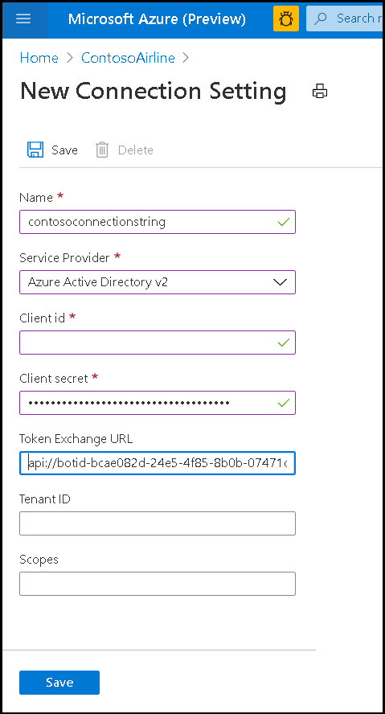

# <a name="single-sign-on-sso-support-for-bots"></a>ボットに対するシングルサインオン (SSO) のサポート

Azure Active Directory のシングルサインオン認証 (Azure AD) は、ユーザーが認証トークンを自動的に更新することによってログイン資格情報の入力が必要になる回数を最小限に抑えます。 ユーザーがアプリを使用することに同意しない場合は、別のデバイスで再度同意する必要がなく、自動的にサインインします。 このフローは、 [Teams タブ SSO のサポート]( ../../../tabs/how-to/authentication/auth-aad-sso.md)によく似ています。 違いは、bot がトークンを要求し、応答を受信する方法のプロトコルです。

OAuth 2.0 は、Azure Active Directory (Azure AD) および他の多くの ID プロバイダーが使用する認証および承認のオープン スタンダードです。 OAuth 2.0 に関する基本的な理解は、Teams で認証を使用するための前提条件です。

## <a name="bot-sso-at-runtime"></a>実行時のボット SSO


1. Bot は、プロパティを含む OAuthCard を持つメッセージを送信し `tokenExchangeResource` ます。 これにより、チームは bot アプリケーションの認証トークンを取得するように指示されます。 ユーザーは、ユーザーのすべてのアクティブなエンドポイントでメッセージを受信します。

> [!NOTE]
> ✔ユーザーは一度に複数のアクティブなエンドポイントを持つことができます。  
> Bot トークンは、ユーザーのすべてのアクティブエンドポイントから受信されます✔。
> 現在、シングルサインオンのサポートを✔には、アプリが個人のスコープにインストールされている必要があります。

2. 現在のユーザーが初めて bot アプリケーションを使用していた場合は、同意を求めるメッセージが表示されます (同意が必要な場合)。または、ステップアップ認証 (2 要素認証など) を処理するための要求があります。

3. Microsoft Teams は、現在のユーザーの Azure AD エンドポイントから bot アプリケーショントークンを要求します。

4. Azure AD は bot アプリケーショントークンを Teams アプリケーションに送信します。

5. Microsoft Teams は、呼び出しアクティビティによって返される値オブジェクトの一部として、そのトークンを、サインイン/tokenExchange という名前で送信します。
  
6. このトークンは bot アプリケーションで解析され、ユーザーの電子メールアドレスなど、必要な情報を抽出します。
  
## <a name="develop-an-single-sign-on-microsoft-teams-bot"></a>シングルサインオン Microsoft Teams bot を開発する
  
SSO Microsoft Teams bot を開発するには、次の手順を実行する必要があります。

1. [Azure 無料アカウントを作成する](#create-an-azure-account)
2. [Teams アプリマニフェストを更新する](#update-your-app-manifest)
3. [Bot トークンを要求および受信するコードを追加する](#request-a-bot-token)

### <a name="create-an-azure-account"></a>Azure アカウントを作成する

この手順は、 [タブ SSO のフロー](../../../tabs/how-to/authentication/auth-aad-sso.md) フローに似ています。

1. [AZURE AD アプリケーション ID](/azure/active-directory/develop/howto-create-service-principal-portal#get-values-for-signing-in)を取得します。
2. Azure AD エンドポイントと、必要に応じて Microsoft Graph に対してアプリケーションに必要なアクセス許可を指定します。
3. Teams デスクトップ、web、モバイルアプリケーションに[アクセス許可を付与](/azure/active-directory/develop/howto-create-service-principal-portal#configure-access-policies-on-resources)します。
4. 事前承認する [ **スコープの追加** ] ボタンを選択し、表示されるパネルで、 `access_as_user` **範囲名** としてを入力します。

> [!IMPORTANT]
> * スタンドアロン bot を構築する場合は、アプリケーション ID URI をに設定し `api://botid-{YourBotId}` ます。
> * Bot とタブを使用してアプリを作成する場合は、アプリケーション ID URI をに設定し `api://fully-qualified-domain-name.com/botid-{YourBotId}` ます。

### <a name="update-your-app-manifest"></a>アプリのマニフェストを更新する

Microsoft Teams のマニフェストに新しいプロパティを追加します。

**Webapplicationinfo** -次の要素の親。

> [!div class="checklist"]
>
> * **id** -アプリケーションのクライアント id。 これは、アプリケーションを Azure AD に登録する際に取得したアプリケーション ID です。
>* **resource** -アプリケーションのドメインとサブドメイン。 これは、 `api://` 上記の手順6でを作成するときに登録したものと同じ URI (プロトコルを含む) です `scope` 。 リソースにパスを含めることはでき `access_as_user` ません。 この URI のドメイン部分は、Teams アプリケーションマニフェストの Url で使用されるすべてのサブドメインを含むドメインと一致する必要があります。

```json
"webApplicationInfo": {
  "id": "00000000-0000-0000-0000-000000000000",
  "resource": "api://subdomain.example.com/00000000-0000-0000-0000-000000000000"
}
```

### <a name="request-a-bot-token"></a>Bot トークンを要求する

トークンを取得する要求は、(既存のメッセージスキーマを使用して) 通常の POST メッセージ要求です。 これは、OAuthCard の添付ファイルに含まれています。 OAuthCard クラスのスキーマは、 [Microsoft Bot スキーマ 4.0](/dotnet/api/microsoft.bot.schema.oauthcard?view=botbuilder-dotnet-stable&preserve-view=true) で定義されており、サインインカードに非常によく似ています。 この `TokenExchangeResource` プロパティがカードに設定されている場合、Teams はこの要求をサイレントトークンの取得として扱います。 Teams チャネルの場合は、 `Id` トークン要求を一意に識別するプロパティのみを優先します。

ユーザーが初めてアプリケーションを使用していて、ユーザーの同意が必要な場合は、次のような同意を得るためのダイアログがユーザーに表示されます。 ユーザーが [ **続行** ] を選択すると、bot が定義されているかどうか、および OAuthCard のサインインボタンが定義されているかどうかに応じて、次の2つの問題が発生します。


Bot がサインインボタンを定義している場合、ボットのサインインフローは、メッセージストリームのカードボタンからのサインインフローと同様にトリガーされます。 ユーザーに同意を求めるアクセス許可を決定するのは開発者のことです。 このアプローチが推奨されるのは、 `openId` たとえば、グラフリソースのトークンを交換する必要がある場合など、アクセス許可を含むトークンが必要な場合です。

Bot がカードにサインインボタンを提供していない場合、最小限のアクセス許可セットに対してユーザーの同意がトリガーされます。 このトークンは、基本認証とユーザーの電子メールアドレスの取得に役立ちます。

**[サインイン] ボタンのない C# トークン要求** :

```csharp
var attachment = new Attachment
            {
                Content = new OAuthCard
                {
                    TokenExchangeResource = new TokenExchangeResource
                    {
                        Id = requestId
                    }
                },
                ContentType = OAuthCard.ContentType,
            };
            var activity = MessageFactory.Attachment(attachment);

            // NOTE: This activity needs to be sent in the 1:1 conversation between the bot and the user. 
            // If the bot supports group and channel scope, this code should be updated to send the request to the 1:1 chat. 

   await turnContext.SendActivityAsync(activity, cancellationToken);
```

#### <a name="receiving-the-token"></a>トークンの受信

トークンを使用した応答は、呼び出しアクティビティを通じて同じスキーマで送信されます。その他の場合は、現在のボットが受け取るアクティビティを呼び出します。 唯一の違いは、呼び出し名、 **サインイン/** トークンの交換、およびトークンと **トークン** フィールド (トークンを含む文字列値) を取得する最初の要求の **Id** (文字列) が含まれる **値** フィールドです。 ユーザーが複数のアクティブエンドポイントを持っている場合は、特定の要求に対して複数の応答を受信する可能性があることに注意してください。 このトークンを使用して、応答を deduplicate することができます。

**呼び出しアクティビティを処理するために応答する C# コード** :

```csharp
protected override async Task<InvokeResponse> OnInvokeActivity
  (ITurnContext<IInvokeActivity> turnContext, CancellationToken cancellationToken)
        {
            try
            {
                if (turnContext.Activity.Name == SignInConstants.TokenExchangeOperationName && turnContext.Activity.ChannelId == Channels.Msteams)
                {
                    await OnTokenResponse(turnContext, cancellationToken);
                    return new InvokeResponse() { Status = 200 };
                }
                else
                {
                    return await base.OnInvokeActivityAsync(turnContext, cancellationToken);
                }
            }
            catch (InvokeResponseException e)
            {
                return e.CreateInvokeResponse();
            }
        }
```

`turnContext.activity.value`は[TokenExchangeInvokeRequest](/dotnet/api/microsoft.bot.schema.tokenexchangeinvokerequest?view=botbuilder-dotnet-stable&preserve-view=true)型であり、bot がさらに使用できるトークンを含みます。 パフォーマンス上の理由でトークンを安全に保存し、更新します。

### <a name="update-the-azure-portal-with-the-oauth-connection"></a>Azure portal を OAuth 接続で更新する

1. Azure Portal で、 **Bot チャネル登録** に戻ります。

2. [ **設定** ] ブレードに切り替え、[OAuth 接続設定] セクションの下にある [ **設定** ] を選択します。


3. [ **接続設定** ] フォームを完成させます。

> [!div class="checklist"]
>
> * 新しい接続設定の名前を入力します。 これは、 **手順 5** で bot サービスコードの設定内で参照される名前になります。
> * サービスプロバイダーのドロップダウンで、[ **Azure Active Directory V2** ] を選択します。
>* AAD アプリケーションのクライアント資格情報を入力します。
>* トークン交換 URL の場合は、AAD アプリケーションの前の手順で定義した範囲の値を使用します。 トークン交換 URL の存在は、この AAD アプリケーションが SSO 用に構成されていることを SDK に示します。
>* **テナント ID** として "common" を指定します。
>* AAD アプリケーションの下流 Api へのアクセス許可を指定するときに構成されているすべてのスコープを追加します。 クライアント id とクライアントシークレットが指定されている場合、トークンストアは、定義されたアクセス許可を持つグラフトークンのトークンを交換します。
>* **[保存]** を選択します。



### <a name="update-the-auth-sample"></a>Auth サンプルを更新する

最初に [teams auth サンプル](https://github.com/microsoft/BotBuilder-Samples/tree/master/samples/csharp_dotnetcore/46.teams-auth)から始めます。

1. 次のものを含めるように、TeamsBot を更新します。 着信要求の deduping を処理するには、以下を参照してください。

```csharp
 protected override async Task OnSignInInvokeAsync(ITurnContext<IInvokeActivity> turnContext, CancellationToken cancellationToken)
        {
            await Dialog.RunAsync(turnContext, ConversationState.CreateProperty<DialogState>(nameof(DialogState)), cancellationToken);
        }
    protected override async Task OnTokenResponseEventAsync(ITurnContext<IEventActivity> turnContext, CancellationToken cancellationToken)
        {
            await Dialog.RunAsync(turnContext, ConversationState.CreateProperty<DialogState>(nameof(DialogState)), cancellationToken);
        }
```
  
2. を更新して、に `appsettings.json` `botId` 定義されている、パスワード、および接続名を含めます。
3. マニフェストを更新して、 `token.botframework.com` が [有効なドメイン] セクションにあることを確認します。
4. プロファイル画像を使用してマニフェストを圧縮し、Teams にインストールします。

#### <a name="additional-code-samples"></a>その他のコードサンプル

* [C# のサンプルは Bot フレームワーク SDK を使用して](https://microsoft-my.sharepoint-df.com/:u:/p/vul/ETZQfeTViDlCv-frjgTIincB7dvk2HOnma1TLvcoeGGIxg?e=uPq62c)います。

* [C# のサンプル Bot フレームワーク SDK を使用して、トークン要求を deduplicate](https://microsoft.sharepoint.com/:u:/t/ExtensibilityandFundamentals/Ea36rUGiN1BGt1RiLOb-mY8BGMF8NwPtronYGym0sCGOTw?e=4bB682)します。

* [Bot フレームワーク SDK トークンストアを使用しない C# サンプル](https://microsoft-my.sharepoint-df.com/:u:/p/tac/EceKDXrkMn5AuGbh6iGid8ABKEVQ6hkxArxK1y7-M8OVPw)
