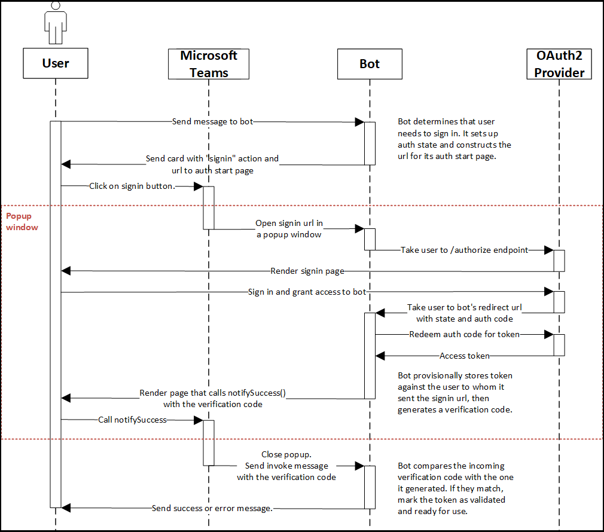

# Microsoft Teams のボットの認証フロー

OAuth 2.0 は、Azure Active Directory (Azure AD) および他の多くの ID プロバイダーが使用する認証および承認のオープン スタンダードです。 OAuth 2.0 の基本的な理解は、Teams での認証を操作する前提条件です。 [正式な仕様よりも簡単に](https://aaronparecki.com/oauth-2-simplified/) 従える優れた概要を [次に示します](https://oauth.net/2/)。 タブとボットの認証フローは少し異なります。タブは Web サイトと非常に似ているので、OAuth 2.0 を直接使用できますが、ボットはそうではなく、いくつかの異なる方法で行う必要がありますが、コア概念は同じです。

Node.js と[OAuth 2.0](https://oauth.net/2/grant-types/authorization-code/)承認コード付与の種類を使用するボットの認証フローを示す例については、GitHub リポジトリ[Microsoft Teams](https://github.com/OfficeDev/Microsoft-Teams-Samples/tree/main/samples/app-auth/nodejs)認証サンプルを参照してください。

1. ユーザーはボットにメッセージを送信します。
2. ボットは、ユーザーがサインインする必要があるかどうかを判断します。
   この例では、ボットはアクセス トークンをユーザー データ ストアに格納します。 選択した ID プロバイダーの検証済みトークンが存在しない場合は、ユーザーにサインインを求めるメッセージが表示されます。 ([コードの表示](https://github.com/OfficeDev/microsoft-teams-sample-auth-node/blob/469952a26d618dbf884a3be53c7d921cc580b1e2/src/utils/AuthenticationUtils.ts#L58-L76))
3. ボットは、認証フローの開始ページへの URL を作成し、アクションを使用してユーザーにカードを送信 `signin` します。 ([コードの表示](https://github.com/OfficeDev/microsoft-teams-sample-auth-node/blob/469952a26d618dbf884a3be53c7d921cc580b1e2/src/dialogs/BaseIdentityDialog.ts#L160-L190)) 
    Teams の他のアプリケーション認証フローと同様に、スタート ページは、リスト上のドメインと、ログイン後のリダイレクト ページと同じドメインに含 `validDomains` める必要があります。
    > [!IMPORTANT] 
    > OAuth 2.0 承認コード付与フローは、クロスサイト要求フォージェリ攻撃を防止するために、一意のセッション トークンを含む認証要求内のパラメーターを `state` [呼び出します](https://en.wikipedia.org/wiki/Cross-site_request_forgery)。 この例では、ランダムに生成された GUID を使用します。
4. ユーザーがサインイン *ボタンを選択* すると、Teams はポップアップ ウィンドウを開き、スタート ページに移動します。
   > [!NOTE]
   > ポップアップ ウィンドウのサイズは、URL の幅と高さのクエリ文字列パラメーターを使用して制御できます。 たとえば、width=500 と height=500 を追加すると、ポップアップ ウィンドウのサイズは 500x500 ピクセルになります。 Teams は、指定されたピクセル サイズを持つポップアップ ウィンドウを表示します。最大で、メイン ウィンドウのサイズに対する割合です。

5. スタート ページは、ユーザーを ID プロバイダーのエンドポイントにリダイレクト `authorize` します。 ([コードの表示](https://github.com/OfficeDev/microsoft-teams-sample-auth-node/blob/469952a26d618dbf884a3be53c7d921cc580b1e2/public/html/auth-start.html#L51-L56))
6. プロバイダーのサイトで、ユーザーはサインインし、ボットへのアクセスを許可します。
7. プロバイダーは、承認コードを使用してボットの OAuth リダイレクト ページにユーザーを移動します。
8. ボットはアクセス トークンの承認コードを引き換え、サインイン フローを開始したユーザーとトークンを暫定的に関連付ける。 以下では、これを暫定 *トークンと呼ぶ。*
    * この例では、ボットはパラメーターの値をサインイン プロセスを開始したユーザーの ID に関連付け、後で ID プロバイダーによって返される値と一致することができます `state` `state` 。 ([コードの表示](https://github.com/OfficeDev/microsoft-teams-sample-auth-node/blob/469952a26d618dbf884a3be53c7d921cc580b1e2/src/AuthBot.ts#L70-L99))
      > [!IMPORTANT] 
      > ボットは ID プロバイダーから受け取ったトークンを格納し、それを特定のユーザーに関連付けしますが、"保留中の検証" としてマークされます。 
    * 暫定トークンは、それ以上の検証なしでは使用できません。
      1. **ID プロバイダーから受け取った情報を検証します。** パラメーターの値は `state` 、以前に保存した値に対して確認する必要があります。 
      1. **Teams から受け取った情報を検証します。** ID [プロバイダーを使用して](https://en.wikipedia.org/wiki/Man-in-the-middle_attack) ボットを承認したユーザーが、ボットとチャットしているユーザーと同じことを確認するために、2 段階認証の検証が実行されます。 これにより、中間 [者や](https://en.wikipedia.org/wiki/Man-in-the-middle_attack) フィッシング攻撃 [から保護](https://en.wikipedia.org/wiki/Phishing) されます。 ボットは検証コードを生成し、ユーザーに関連付けられたコードを格納します。 検証コードは、以下の説明に従って Teams によって自動的に送信されます。 ([コードの表示](https://github.com/OfficeDev/microsoft-teams-sample-auth-node/blob/469952a26d618dbf884a3be53c7d921cc580b1e2/src/AuthBot.ts#L100-L113))
9. OAuth コールバックは、 を呼び出すページをレンダリングします `notifySuccess("<verification code>")` 。 ([コードの表示](https://github.com/OfficeDev/microsoft-teams-sample-auth-node/blob/master/src/views/oauth-callback-success.hbs))
10. Teams はポップアップ ウィンドウを閉じ、送信された `<verification code>` ウィンドウをボット `notifySuccess()` に送り返します。 ボットは、 を指定して [呼び出し](/bot-framework/dotnet/bot-builder-dotnet-activities#invoke) メッセージを受信します `name = signin/verifyState` 。
11. ボットは、受信検証コードを、ユーザーの暫定トークンに格納されている検証コードと照合します。 ([コードの表示](https://github.com/OfficeDev/microsoft-teams-sample-auth-node/blob/469952a26d618dbf884a3be53c7d921cc580b1e2/src/dialogs/BaseIdentityDialog.ts#L127-L140))
12. 一致する場合、ボットはトークンを検証済みとしてマークし、すぐに使用できます。 それ以外の場合、認証フローは失敗し、ボットは暫定トークンを削除します。

    > [!NOTE]
    > モバイルでの認証に問題が発生した場合は、JavaScript SDK がバージョン 1.4.1 以降に更新されている必要があります。

## コード サンプル

ボット認証プロセスを示すサンプル コード:

| **サンプル名** | **説明** | **Node.js** | **.NET** | **Python** |
|-----------------|----------------|--------------|----------|-----------|
| Teams 認証 | このサンプルでは、Microsoft Teams アプリでの認証を示します。 | [View](https://github.com/OfficeDev/microsoft-teams-sample-auth-node) | | |
| ボット認証 | このサンプルでは、Microsoft Teams でボットランナリングに認証を使用する方法を説明します。 | [View](https://github.com/microsoft/BotBuilder-Samples/tree/main/samples/javascript_nodejs/46.teams-auth) | [View](https://github.com/microsoft/BotBuilder-Samples/tree/main/samples/csharp_dotnetcore/46.teams-auth) | [View](https://github.com/microsoft/BotBuilder-Samples/tree/main/samples/python/46.teams-auth)

## 詳細情報

Azure 認証を対象としたボット認証の詳細な実装のチュートリアルについてはAD参照してください。

[Teams ボットに認証を追加する](add-authentication.md)
