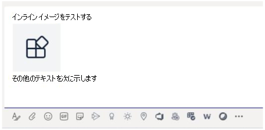

# <a name="send-and-receive-files-through-the-bot"></a><span data-ttu-id="c3ddc-104">ボットを介してファイルを送受信する</span><span class="sxs-lookup"><span data-stu-id="c3ddc-104">Send and receive files through the bot</span></span>

> [!IMPORTANT]
> <span data-ttu-id="c3ddc-105">このドキュメントの記事は、v4 Bot Framework SDK に基づいて作成されています。</span><span class="sxs-lookup"><span data-stu-id="c3ddc-105">The articles in this document are based on the v4 Bot Framework SDK.</span></span>

<span data-ttu-id="c3ddc-106">ボットにファイルを送受信するには、次の 2 つの方法があります。</span><span class="sxs-lookup"><span data-stu-id="c3ddc-106">There are two ways to send files to and receive files from a bot:</span></span>

* <span data-ttu-id="c3ddc-107">[**Microsoft Graph API を使用します。**](#use-the-graph-apis) このメソッドは、すべての Microsoft Teams スコープのボットで動作します。</span><span class="sxs-lookup"><span data-stu-id="c3ddc-107">[**Use the Microsoft Graph APIs:**](#use-the-graph-apis) This method works for bots in all Microsoft Teams scopes:</span></span>
  * `personal`
  * `channel`
  * `groupchat`

* <span data-ttu-id="c3ddc-108">[**Teams ボット API を使用します。**](#use-the-teams-bot-apis) これらはコンテキスト内のファイルのみを `personal` サポートします。</span><span class="sxs-lookup"><span data-stu-id="c3ddc-108">[**Use the Teams bot APIs:**](#use-the-teams-bot-apis) These only support files in `personal` context.</span></span>

## <a name="use-the-graph-apis"></a><span data-ttu-id="c3ddc-109">グラフ API の使用</span><span class="sxs-lookup"><span data-stu-id="c3ddc-109">Use the Graph APIs</span></span>

<span data-ttu-id="c3ddc-110">OneDrive および SharePoint のグラフ API を使用して、既存の SharePoint ファイルを参照するカード添付ファイルを含むメッセージ [を投稿します](/onedrive/developer/rest-api/)。</span><span class="sxs-lookup"><span data-stu-id="c3ddc-110">Post messages with card attachments that refer to existing SharePoint files, using the Graph APIs for [OneDrive and SharePoint](/onedrive/developer/rest-api/).</span></span> <span data-ttu-id="c3ddc-111">Graph API を使用するには、標準の OAuth 2.0 承認フローを使用して、次のいずれかのアクセス権を取得します。</span><span class="sxs-lookup"><span data-stu-id="c3ddc-111">To use the Graph APIs, obtain access to either of the following through the standard OAuth 2.0 authorization flow:</span></span>

* <span data-ttu-id="c3ddc-112">ユーザーの OneDrive フォルダーと `personal` ファイル `groupchat` 。</span><span class="sxs-lookup"><span data-stu-id="c3ddc-112">A user's OneDrive folder for `personal` and `groupchat` files.</span></span>
* <span data-ttu-id="c3ddc-113">チームのチャネル内のファイルをファイル用 `channel` に指定します。</span><span class="sxs-lookup"><span data-stu-id="c3ddc-113">The files in a team's channel for `channel` files.</span></span>

<span data-ttu-id="c3ddc-114">グラフ API は、すべての Teams スコープで機能します。</span><span class="sxs-lookup"><span data-stu-id="c3ddc-114">Graph APIs work in all Teams scopes.</span></span> <span data-ttu-id="c3ddc-115">詳細については、「チャット メッセージ ファイル [の添付ファイルの送信」を参照してください](/graph/api/chatmessage-post?view=graph-rest-beta&tabs=http#example-4-file-attachments&preserve-view=true)。</span><span class="sxs-lookup"><span data-stu-id="c3ddc-115">For more information, see [send chat message file attachments](/graph/api/chatmessage-post?view=graph-rest-beta&tabs=http#example-4-file-attachments&preserve-view=true).</span></span>

<span data-ttu-id="c3ddc-116">または、Teams ボット API を使用して、ボットにファイルを送信し、ボットからファイルを受信することもできます。</span><span class="sxs-lookup"><span data-stu-id="c3ddc-116">Alternately, you can send files to and receive files from a bot using the Teams bot APIs.</span></span>

## <a name="use-the-teams-bot-apis"></a><span data-ttu-id="c3ddc-117">Teams ボット API の使用</span><span class="sxs-lookup"><span data-stu-id="c3ddc-117">Use the Teams bot APIs</span></span>

> [!NOTE]
> <span data-ttu-id="c3ddc-118">Teams ボット API はコンテキストでのみ機能 `personal` します。</span><span class="sxs-lookup"><span data-stu-id="c3ddc-118">Teams bot APIs work only in the `personal` context.</span></span> <span data-ttu-id="c3ddc-119">これらは、コンテキストで `channel` 動作 `groupchat` しません。</span><span class="sxs-lookup"><span data-stu-id="c3ddc-119">They do not work in the `channel` or `groupchat` context.</span></span>

<span data-ttu-id="c3ddc-120">Teams API を使用すると、ボットはコンテキスト内のユーザー (個人用チャットとも呼ばれる) でファイルを直接送受信 `personal` できます。</span><span class="sxs-lookup"><span data-stu-id="c3ddc-120">Using Teams APIs, the bot can directly send and receive files with users in the `personal` context, also known as personal chats.</span></span> <span data-ttu-id="c3ddc-121">経費レポート、画像認識、ファイル アーカイブ、ファイル コンテンツの編集に関する電子署名などの機能を実装します。</span><span class="sxs-lookup"><span data-stu-id="c3ddc-121">Implement features, such as expense reporting, image recognition, file archival, and e-signatures involving the editing of file content.</span></span> <span data-ttu-id="c3ddc-122">Teams で共有されるファイルは、通常、カードとして表示され、アプリ内での豊富な表示を許可します。</span><span class="sxs-lookup"><span data-stu-id="c3ddc-122">Files shared in Teams typically appear as cards and allow rich in-app viewing.</span></span>

<span data-ttu-id="c3ddc-123">次のセクションでは、メッセージの送信など、ファイル コンテンツを直接ユーザー操作として送信する方法について説明します。</span><span class="sxs-lookup"><span data-stu-id="c3ddc-123">The next sections describe how to send file content as direct user interaction, like sending a message.</span></span> <span data-ttu-id="c3ddc-124">この API は、Teams ボット プラットフォームの一部として提供されます。</span><span class="sxs-lookup"><span data-stu-id="c3ddc-124">This API is provided as part of the Teams bot platform.</span></span>

### <a name="configure-the-bot-to-support-files"></a><span data-ttu-id="c3ddc-125">ファイルをサポートするボットを構成する</span><span class="sxs-lookup"><span data-stu-id="c3ddc-125">Configure the bot to support files</span></span>

<span data-ttu-id="c3ddc-126">ボットでファイルを送受信するには、マニフェスト `supportsFiles` のプロパティをに設定します `true` 。</span><span class="sxs-lookup"><span data-stu-id="c3ddc-126">To send and receive files in the bot, set the `supportsFiles` property in the manifest to `true`.</span></span> <span data-ttu-id="c3ddc-127">このプロパティについては、Manifest [リファレンスの bots](~/resources/schema/manifest-schema.md#bots) セクションで説明します。</span><span class="sxs-lookup"><span data-stu-id="c3ddc-127">This property is described in the [bots](~/resources/schema/manifest-schema.md#bots) section of the Manifest reference.</span></span>

<span data-ttu-id="c3ddc-128">定義は次のように見えます `"supportsFiles": true` 。</span><span class="sxs-lookup"><span data-stu-id="c3ddc-128">The definition looks like this, `"supportsFiles": true`.</span></span> <span data-ttu-id="c3ddc-129">ボットが有効にしない場合 `supportsFiles` 、このセクションに記載されている機能は機能しません。</span><span class="sxs-lookup"><span data-stu-id="c3ddc-129">If the bot does not enable `supportsFiles`, the features listed in this section do not work.</span></span>

### <a name="receive-files-in-personal-chat"></a><span data-ttu-id="c3ddc-130">個人用チャットでファイルを受信する</span><span class="sxs-lookup"><span data-stu-id="c3ddc-130">Receive files in personal chat</span></span>

<span data-ttu-id="c3ddc-131">ユーザーがボットにファイルを送信すると、最初にユーザーの OneDrive for business ストレージにファイルがアップロードされます。</span><span class="sxs-lookup"><span data-stu-id="c3ddc-131">When a user sends a file to the bot, the file is first uploaded to the user's OneDrive for business storage.</span></span> <span data-ttu-id="c3ddc-132">その後、ボットはユーザーのアップロードについてユーザーに通知するメッセージ アクティビティを受信します。</span><span class="sxs-lookup"><span data-stu-id="c3ddc-132">The bot then receives a message activity notifying the user about the user upload.</span></span> <span data-ttu-id="c3ddc-133">アクティビティには、名前やコンテンツ URL などのファイル メタデータが含まれます。</span><span class="sxs-lookup"><span data-stu-id="c3ddc-133">The activity contains file metadata, such as its name and the content URL.</span></span> <span data-ttu-id="c3ddc-134">ユーザーは、この URL から直接読み取ってバイナリ コンテンツを取得できます。</span><span class="sxs-lookup"><span data-stu-id="c3ddc-134">The user can directly read from this URL to fetch its binary content.</span></span>

#### <a name="message-activity-with-file-attachment-example"></a><span data-ttu-id="c3ddc-135">添付ファイルを含むメッセージ アクティビティの例</span><span class="sxs-lookup"><span data-stu-id="c3ddc-135">Message activity with file attachment example</span></span>

<span data-ttu-id="c3ddc-136">次のコードは、添付ファイルを含むメッセージ アクティビティの例を示しています。</span><span class="sxs-lookup"><span data-stu-id="c3ddc-136">The following code shows an example of message activity with file attachment:</span></span>

```json
{
  "attachments": [{
    "contentType": "application/vnd.microsoft.teams.file.download.info",
    "contentUrl": "https://contoso.sharepoint.com/personal/johnadams_contoso_com/Documents/Applications/file_example.txt",
    "name": "file_example.txt",
    "content": {
      "downloadUrl" : "https://download.link",
      "uniqueId": "1150D938-8870-4044-9F2C-5BBDEBA70C9D",
      "fileType": "txt",
      "etag": "123"
    }
  }]
}
```

<span data-ttu-id="c3ddc-137">次の表に、添付ファイルのコンテンツ プロパティについて説明します。</span><span class="sxs-lookup"><span data-stu-id="c3ddc-137">The following table describes the content properties of the attachment:</span></span>

| <span data-ttu-id="c3ddc-138">プロパティ</span><span class="sxs-lookup"><span data-stu-id="c3ddc-138">Property</span></span> | <span data-ttu-id="c3ddc-139">用途</span><span class="sxs-lookup"><span data-stu-id="c3ddc-139">Purpose</span></span> |
| --- | --- |
| `downloadUrl` | <span data-ttu-id="c3ddc-140">ファイルのコンテンツをフェッチする OneDrive URL。</span><span class="sxs-lookup"><span data-stu-id="c3ddc-140">OneDrive URL for fetching the content of the file.</span></span> <span data-ttu-id="c3ddc-141">ユーザーは、この `HTTP GET` URL から直接発行できます。</span><span class="sxs-lookup"><span data-stu-id="c3ddc-141">The user can issue an `HTTP GET` directly from this URL.</span></span> |
| `uniqueId` | <span data-ttu-id="c3ddc-142">一意のファイル ID。</span><span class="sxs-lookup"><span data-stu-id="c3ddc-142">Unique file ID.</span></span> <span data-ttu-id="c3ddc-143">これは、ユーザーがボットにファイルを送信する場合に備え、OneDrive ドライブアイテム ID です。</span><span class="sxs-lookup"><span data-stu-id="c3ddc-143">This is the OneDrive drive item ID, in case the user sends a file to the bot.</span></span> |
| `fileType` | <span data-ttu-id="c3ddc-144">ファイルの種類 (.pdf や .docx など)。</span><span class="sxs-lookup"><span data-stu-id="c3ddc-144">Type of file, such as .pdf or .docx.</span></span> |

<span data-ttu-id="c3ddc-145">ベスト プラクティスとして、ユーザーにメッセージを送信してファイルのアップロードを確認します。</span><span class="sxs-lookup"><span data-stu-id="c3ddc-145">As a best practice, acknowledge the file upload by sending a message back to the user.</span></span>

### <a name="upload-files-to-personal-chat"></a><span data-ttu-id="c3ddc-146">個人用チャットにファイルをアップロードする</span><span class="sxs-lookup"><span data-stu-id="c3ddc-146">Upload files to personal chat</span></span>

<span data-ttu-id="c3ddc-147">**ユーザーにファイルをアップロードするには**</span><span class="sxs-lookup"><span data-stu-id="c3ddc-147">**To upload a file to a user**</span></span>

1. <span data-ttu-id="c3ddc-148">ファイルの書き込み許可を要求するメッセージをユーザーに送信します。</span><span class="sxs-lookup"><span data-stu-id="c3ddc-148">Send a message to the user requesting permission to write the file.</span></span> <span data-ttu-id="c3ddc-149">このメッセージには、アップロード `FileConsentCard` するファイルの名前を含む添付ファイルが含まれている必要があります。</span><span class="sxs-lookup"><span data-stu-id="c3ddc-149">This message must contain a `FileConsentCard` attachment with the name of the file to be uploaded.</span></span>
2. <span data-ttu-id="c3ddc-150">ユーザーがファイルのダウンロードを受け入れる場合、ボットは場所 URL を持つ呼び出しアクティビティを受け取ります。</span><span class="sxs-lookup"><span data-stu-id="c3ddc-150">If the user accepts the file download, the bot receives an invoke activity with a location URL.</span></span>
3. <span data-ttu-id="c3ddc-151">ファイルを転送するために、ボットは指定された場所 `HTTP POST` の URL に直接実行します。</span><span class="sxs-lookup"><span data-stu-id="c3ddc-151">To transfer the file, the bot performs an `HTTP POST` directly into the provided location URL.</span></span>
4. <span data-ttu-id="c3ddc-152">必要に応じて、ユーザーが同じファイルのアップロードをさらに受け入れたくない場合は、元の同意カードを削除します。</span><span class="sxs-lookup"><span data-stu-id="c3ddc-152">Optionally, remove the original consent card if you do not want the user to accept further uploads of the same file.</span></span>

#### <a name="message-requesting-permission-to-upload"></a><span data-ttu-id="c3ddc-153">アップロードするアクセス許可を要求するメッセージ</span><span class="sxs-lookup"><span data-stu-id="c3ddc-153">Message requesting permission to upload</span></span>

<span data-ttu-id="c3ddc-154">次のデスクトップ メッセージには、ファイルをアップロードするユーザーのアクセス許可を要求する簡単な添付ファイル オブジェクトが含まれます。</span><span class="sxs-lookup"><span data-stu-id="c3ddc-154">The following desktop message contains a simple attachment object requesting user permission to upload the file:</span></span>


<span data-ttu-id="c3ddc-156">次のモバイル メッセージには、ファイルをアップロードするユーザーのアクセス許可を要求する添付ファイル オブジェクトが含まれます。</span><span class="sxs-lookup"><span data-stu-id="c3ddc-156">The following mobile message contains an attachment object requesting user permission to upload the file:</span></span>


```json
{
  "attachments": [{
    "contentType": "application/vnd.microsoft.teams.card.file.consent",
    "name": "file_example.txt",
    "content": {
      "description": "<Purpose of the file, such as: this is your monthly expense report>",
      "sizeInBytes": 1029393,
      "acceptContext": {
      },
      "declineContext": {
      }
    }
  }]
}
```

<span data-ttu-id="c3ddc-157">次の表に、添付ファイルのコンテンツ プロパティについて説明します。</span><span class="sxs-lookup"><span data-stu-id="c3ddc-157">The following table describes the content properties of the attachment:</span></span>

| <span data-ttu-id="c3ddc-158">プロパティ</span><span class="sxs-lookup"><span data-stu-id="c3ddc-158">Property</span></span> | <span data-ttu-id="c3ddc-159">用途</span><span class="sxs-lookup"><span data-stu-id="c3ddc-159">Purpose</span></span> |
| --- | --- |
| `description` | <span data-ttu-id="c3ddc-160">ファイルの目的を説明するか、その内容を要約します。</span><span class="sxs-lookup"><span data-stu-id="c3ddc-160">Describes the purpose of the file or summarizes its content.</span></span> |
| `sizeInBytes` | <span data-ttu-id="c3ddc-161">ユーザーに、ファイル サイズと OneDrive に必要な領域の量の推定値を提供します。</span><span class="sxs-lookup"><span data-stu-id="c3ddc-161">Provides the user an estimate of the file size and the amount of space it takes in OneDrive.</span></span> |
| `acceptContext` | <span data-ttu-id="c3ddc-162">ユーザーがファイルを受け入れるときにボットに無音で送信される追加のコンテキスト。</span><span class="sxs-lookup"><span data-stu-id="c3ddc-162">Additional context that is silently transmitted to the bot when the user accepts the file.</span></span> |
| `declineContext` | <span data-ttu-id="c3ddc-163">ユーザーがファイルを拒否するとボットに無音で送信される追加のコンテキスト。</span><span class="sxs-lookup"><span data-stu-id="c3ddc-163">Additional context that is silently transmitted to the bot when the user declines the file.</span></span> |

#### <a name="invoke-activity-when-the-user-accepts-the-file"></a><span data-ttu-id="c3ddc-164">ユーザーがファイルを受け入れるときにアクティビティを呼び出す</span><span class="sxs-lookup"><span data-stu-id="c3ddc-164">Invoke activity when the user accepts the file</span></span>

<span data-ttu-id="c3ddc-165">ユーザーがファイルを受け入れる場合、呼び出しアクティビティがボットに送信されます。</span><span class="sxs-lookup"><span data-stu-id="c3ddc-165">An invoke activity is sent to the bot if and when the user accepts the file.</span></span> <span data-ttu-id="c3ddc-166">OneDrive for Business プレースホルダー URL が含まれているので、ボットはファイルの内容を転送するために a `PUT` を発行できます。</span><span class="sxs-lookup"><span data-stu-id="c3ddc-166">It contains the OneDrive for Business placeholder URL that the bot can then issue a `PUT` to transfer the file contents.</span></span> <span data-ttu-id="c3ddc-167">OneDrive URL へのアップロードの詳細については、「アップロード セッションへのアップロード [バイト数」を参照してください](/onedrive/developer/rest-api/api/driveitem_createuploadsession#upload-bytes-to-the-upload-session)。</span><span class="sxs-lookup"><span data-stu-id="c3ddc-167">For information on uploading to the OneDrive URL, see [upload bytes to the upload session](/onedrive/developer/rest-api/api/driveitem_createuploadsession#upload-bytes-to-the-upload-session).</span></span>

<span data-ttu-id="c3ddc-168">次のコードは、ボットが受け取る呼び出しアクティビティの簡潔なバージョンの例を示しています。</span><span class="sxs-lookup"><span data-stu-id="c3ddc-168">The following code shows an example of a concise version of the invoke activity that the bot receives:</span></span>

```json
{
  "name": "fileConsent/invoke",
  "value": {
    "type": "fileUpload",
    "action": "accept",
    "context": {
    },
    "uploadInfo": {
      "contentUrl": "https://contoso.sharepoint.com/personal/johnadams_contoso_com/Documents/Applications/file_example.txt",
      "name": "file_example.txt",
      "uploadUrl": "https://upload.link",
      "uniqueId": "1150D938-8870-4044-9F2C-5BBDEBA70C8C",
      "fileType": "txt",
      "etag": "123"
    }
  }
}
```

<span data-ttu-id="c3ddc-169">同様に、ユーザーがファイルを拒否した場合、ボットは同じ全体的なアクティビティ名を持つ次のイベントを受け取ります。</span><span class="sxs-lookup"><span data-stu-id="c3ddc-169">Similarly, if the user declines the file, the bot receives the following event with the same overall activity name:</span></span>

```json
{
  "name": "fileConsent/invoke",
  "value": {
    "type": "fileUpload",
    "action": "decline",
    "context": {
    }
  }
}
```

### <a name="notifying-the-user-about-an-uploaded-file"></a><span data-ttu-id="c3ddc-170">アップロードされたファイルについてユーザーに通知する</span><span class="sxs-lookup"><span data-stu-id="c3ddc-170">Notifying the user about an uploaded file</span></span>

<span data-ttu-id="c3ddc-171">ユーザーの OneDrive にファイルをアップロードした後、ユーザーに確認メッセージを送信します。</span><span class="sxs-lookup"><span data-stu-id="c3ddc-171">After uploading a file to the user's OneDrive, send a confirmation message to the user.</span></span> <span data-ttu-id="c3ddc-172">メッセージには、OneDrive でプレビューまたは開く、またはローカルでダウンロードするために、ユーザーが選択できる次の添付ファイル `FileCard` が含まれている必要があります。</span><span class="sxs-lookup"><span data-stu-id="c3ddc-172">The message must contain the following `FileCard` attachment that the user can select, either to preview or open it in OneDrive, or download locally:</span></span>

```json
{
  "attachments": [{
    "contentType": "application/vnd.microsoft.teams.card.file.info",
    "contentUrl": "https://contoso.sharepoint.com/personal/johnadams_contoso_com/Documents/Applications/file_example.txt",
    "name": "file_example.txt",
    "content": {
      "uniqueId": "1150D938-8870-4044-9F2C-5BBDEBA70C8C",
      "fileType": "txt",
    }
  }]
}
```

<span data-ttu-id="c3ddc-173">次の表に、添付ファイルのコンテンツ プロパティについて説明します。</span><span class="sxs-lookup"><span data-stu-id="c3ddc-173">The following table describes the content properties of the attachment:</span></span>

| <span data-ttu-id="c3ddc-174">プロパティ</span><span class="sxs-lookup"><span data-stu-id="c3ddc-174">Property</span></span> | <span data-ttu-id="c3ddc-175">用途</span><span class="sxs-lookup"><span data-stu-id="c3ddc-175">Purpose</span></span> |
| --- | --- |
| `uniqueId` | <span data-ttu-id="c3ddc-176">OneDrive または SharePoint ドライブアイテム ID。</span><span class="sxs-lookup"><span data-stu-id="c3ddc-176">OneDrive or SharePoint drive item ID.</span></span> |
| `fileType` | <span data-ttu-id="c3ddc-177">ファイルの種類 (.pdf や .docx など)。</span><span class="sxs-lookup"><span data-stu-id="c3ddc-177">Type of file, such as .pdf or .docx.</span></span> |

### <a name="fetch-inline-images-from-message"></a><span data-ttu-id="c3ddc-178">メッセージからインライン イメージをフェッチする</span><span class="sxs-lookup"><span data-stu-id="c3ddc-178">Fetch inline images from message</span></span>

<span data-ttu-id="c3ddc-179">ボットのアクセス トークンを使用して、メッセージの一部であるインライン イメージをフェッチします。</span><span class="sxs-lookup"><span data-stu-id="c3ddc-179">Fetch inline images that are part of the message using the Bot's access token.</span></span>



<span data-ttu-id="c3ddc-181">次のコードは、メッセージからインライン イメージをフェッチする例を示しています。</span><span class="sxs-lookup"><span data-stu-id="c3ddc-181">The following code shows an example of fetching inline images from message:</span></span>

```csharp
private async Task ProcessInlineImage(ITurnContext<IMessageActivity> turnContext, CancellationToken cancellationToken)
{
    var attachment = turnContext.Activity.Attachments[0];
    var client = _clientFactory.CreateClient();
    // Get Bot's access token to fetch inline image. 
    var token = await new MicrosoftAppCredentials(microsoftAppId, microsoftAppPassword).GetTokenAsync();
    client.DefaultRequestHeaders.Authorization = new AuthenticationHeaderValue("Bearer", token);
    var responseMessage = await client.GetAsync(attachment.ContentUrl);
    // Save the inline image to Files directory.
    var filePath = Path.Combine("Files", "ImageFromUser.png");
    using (var fileStream = new FileStream(filePath, FileMode.Create, FileAccess.Write, FileShare.None))
    {
        await responseMessage.Content.CopyToAsync(fileStream);
    }
    // Create reply with image.
    var reply = MessageFactory.Text($"Attachment of {attachment.ContentType} type and size of {responseMessage.Content.Headers.ContentLength} bytes received.");
    reply.Attachments = new List<Attachment>() { 
        GetInlineAttachment() 
    };
    await turnContext.SendActivityAsync(reply, cancellationToken);
}
private static Attachment GetInlineAttachment()
{
    var imagePath = Path.Combine("Files", "ImageFromUser.png");
    var imageData = Convert.ToBase64String(File.ReadAllBytes(imagePath));
    return new Attachment
    {
        Name = @"ImageFromUser.png",
        ContentType = "image/png",
        ContentUrl = $"data:image/png;base64,{imageData}",
    };
}
```

### <a name="basic-example-in-c"></a><span data-ttu-id="c3ddc-182">C の基本例#</span><span class="sxs-lookup"><span data-stu-id="c3ddc-182">Basic example in C#</span></span>

<span data-ttu-id="c3ddc-183">次のコードは、ファイルのアップロードを処理し、ボットのダイアログでファイル同意要求を送信する方法の例を示しています。</span><span class="sxs-lookup"><span data-stu-id="c3ddc-183">The following code shows an example of how to handle file uploads and send file consent requests in the bot's dialog:</span></span>

```csharp

protected override async Task OnMessageActivityAsync(ITurnContext<IMessageActivity> turnContext, CancellationToken cancellationToken)
{
    if (turnContext.Activity.Attachments?[0].ContentType.Contains("image/*") == true)
    {
        // Inline image.
        await ProcessInlineImage(turnContext, cancellationToken);
    }
    else
    {
        string filename = "teams-logo.png";
        string filePath = Path.Combine("Files", filename);
        long fileSize = new FileInfo(filePath).Length;
        await SendFileCardAsync(turnContext, filename, fileSize, cancellationToken);
    }
}
private async Task ProcessInlineImage(ITurnContext<IMessageActivity> turnContext, CancellationToken cancellationToken)
{
    var attachment = turnContext.Activity.Attachments[0];
    var client = _clientFactory.CreateClient();
    // Get Bot's access token to fetch inline image. 
    var token = await new MicrosoftAppCredentials(microsoftAppId, microsoftAppPassword).GetTokenAsync();
    client.DefaultRequestHeaders.Authorization = new AuthenticationHeaderValue("Bearer", token);
    var responseMessage = await client.GetAsync(attachment.ContentUrl);
    // Save the inline image to Files directory.
    var filePath = Path.Combine("Files", "ImageFromUser.png");
    using (var fileStream = new FileStream(filePath, FileMode.Create, FileAccess.Write, FileShare.None))
    {
        await responseMessage.Content.CopyToAsync(fileStream);
    }
    // Create reply with image.
    var reply = MessageFactory.Text($"Attachment of {attachment.ContentType} type and size of {responseMessage.Content.Headers.ContentLength} bytes received.");
    reply.Attachments = new List<Attachment>() { GetInlineAttachment() };
    await turnContext.SendActivityAsync(reply, cancellationToken);
}
private static Attachment GetInlineAttachment()
{
    var imagePath = Path.Combine("Files", "ImageFromUser.png");
    var imageData = Convert.ToBase64String(File.ReadAllBytes(imagePath));
    return new Attachment
    {
        Name = @"ImageFromUser.png",
        ContentType = "image/png",
        ContentUrl = $"data:image/png;base64,{imageData}",
    };
}
private async Task SendFileCardAsync(ITurnContext turnContext, string filename, long filesize, CancellationToken cancellationToken)
{
    var consentContext = new Dictionary<string, string>
    {
        { 
            "filename", filename 
        },
    };
    var fileCard = new FileConsentCard
    {
        Description = "This is the file I want to send you",
        SizeInBytes = filesize,
        AcceptContext = consentContext,
        DeclineContext = consentContext,
    };
    var asAttachment = new Attachment
    {
        Content = fileCard,
        ContentType = FileConsentCard.ContentType,
        Name = filename,
    };
    var replyActivity = turnContext.Activity.CreateReply();
    replyActivity.Attachments = new List<Attachment>() { asAttachment };
    await turnContext.SendActivityAsync(replyActivity, cancellationToken);
}
```

## <a name="code-sample"></a><span data-ttu-id="c3ddc-184">コード サンプル</span><span class="sxs-lookup"><span data-stu-id="c3ddc-184">Code sample</span></span>

<span data-ttu-id="c3ddc-185">次のコード サンプルは、ファイルの同意を取得し、ボットから Teams にファイルをアップロードする方法を示しています。</span><span class="sxs-lookup"><span data-stu-id="c3ddc-185">The following code sample demonstrates how to obtain file consent and upload files to Teams from a bot:</span></span>

|<span data-ttu-id="c3ddc-186">**サンプル名**</span><span class="sxs-lookup"><span data-stu-id="c3ddc-186">**Sample name**</span></span> | <span data-ttu-id="c3ddc-187">**説明**</span><span class="sxs-lookup"><span data-stu-id="c3ddc-187">**Description**</span></span> | <span data-ttu-id="c3ddc-188">**.NET**</span><span class="sxs-lookup"><span data-stu-id="c3ddc-188">**.NET**</span></span> | <span data-ttu-id="c3ddc-189">**Javascript**</span><span class="sxs-lookup"><span data-stu-id="c3ddc-189">**Javascript**</span></span> | <span data-ttu-id="c3ddc-190">**Python**</span><span class="sxs-lookup"><span data-stu-id="c3ddc-190">**Python**</span></span>|
|----------------|-----------------|--------------|----------------|-----------|
| <span data-ttu-id="c3ddc-191">ファイルのアップロード</span><span class="sxs-lookup"><span data-stu-id="c3ddc-191">File upload</span></span> | <span data-ttu-id="c3ddc-192">ボットからファイルの同意を取得し、Teams にファイルをアップロードする方法を示します。</span><span class="sxs-lookup"><span data-stu-id="c3ddc-192">Demonstrates how to obtain file consent and upload files to Teams from a bot.</span></span> <span data-ttu-id="c3ddc-193">また、ボットに送信されたファイルを受信する方法も示します。</span><span class="sxs-lookup"><span data-stu-id="c3ddc-193">Also, how to receive a file sent to a bot.</span></span> | [<span data-ttu-id="c3ddc-194">View</span><span class="sxs-lookup"><span data-stu-id="c3ddc-194">View</span></span>](https://github.com/microsoft/BotBuilder-Samples/blob/main/samples/csharp_dotnetcore/56.teams-file-upload) | [<span data-ttu-id="c3ddc-195">View</span><span class="sxs-lookup"><span data-stu-id="c3ddc-195">View</span></span>](https://github.com/microsoft/BotBuilder-Samples/blob/main/samples/javascript_nodejs/56.teams-file-upload) | [<span data-ttu-id="c3ddc-196">View</span><span class="sxs-lookup"><span data-stu-id="c3ddc-196">View</span></span>](https://github.com/microsoft/BotBuilder-Samples/blob/main/samples/python/56.teams-file-upload) |

## <a name="next-step"></a><span data-ttu-id="c3ddc-197">次の手順</span><span class="sxs-lookup"><span data-stu-id="c3ddc-197">Next step</span></span>

> [!div class="nextstepaction"]
> [<span data-ttu-id="c3ddc-198">Teams でレートを制限してボットを最適化する</span><span class="sxs-lookup"><span data-stu-id="c3ddc-198">Optimize your bot with rate limiting in Teams</span></span>](~/bots/how-to/rate-limit.md)
