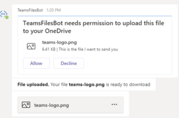

# <a name="send-and-receive-files-with-a-bot"></a>Bot を使用してファイルを送受信する

[!INCLUDE [v4 to v3 pointer](~/includes/v4-to-v3-pointer-bots.md)]

この記事では、ユーザーが bot とワンツーワンチャットでファイルを交換する方法について説明します。 この機能を使用して、チームまたはグループチャット内のファイルを交換することはできません。

次の2つの方法から選択できます。

1. **Microsoft Graph api**。3つのスコープすべてを`personal`サポート`channel`しています。、、`groupchat`
2. **Teams ボット api**。スコープのみがサポート`personal`されています。

> [!NOTE] 
> モバイルデバイスでのボットへのファイルの送信と受信はサポートされていません。

## <a name="using-the-microsoft-graph-apis"></a>Microsoft Graph Api を使用する

[OneDrive および SharePoint](https://docs.microsoft.com/onedrive/developer/rest-api/)の Microsoft Graph api を使用して、既存の SharePoint ファイルを参照するカードの添付ファイルを含むメッセージを投稿できます。 Graph Api を使用するには、標準の OAuth 2.0 フローを通じて認証されたアクセスを取得し、次のことを行う必要があります。

- ユーザーの OneDrive フォルダー ( `personal`および`groupchat`ファイル)。
- または、チームのチャネル内のファイル (ファイル`channel`用)。 このメソッドは、すべての Teams スコープで機能します。

## <a name="using-the-teams-bot-apis"></a>Teams の Bot Api の使用

Bot は、Teams Api を使用して、 `personal`コンテキスト内のユーザー (個人チャットとも呼ばれる) でファイルを直接送受信できます。 これにより、経費報告、画像の認識、ファイルアーカイブ、電子署名、ファイルコンテンツの直接的な操作を伴うその他のシナリオを実装できます。 Teams で共有されるファイルは、通常、カードとして表示され、アプリ内での表示を許可します。  この API は、 **Microsoft Teams Bot プラットフォーム**の一部として提供されています。

> [!NOTE]
> このメソッドは、 `personal`コンテキストでのみ機能します。 または`channel` `groupchat`のコンテキストでは動作しません。

### <a name="configure-your-bot-to-support-files"></a>ボットを構成してファイルをサポートする

Bot でファイルを送受信するには、マニフェストの`supportsFiles`プロパティをに`true`設定する必要があります。 このプロパティについては、マニフェストリファレンスの「 [bot](https://docs.microsoft.com/microsoftteams/platform/resources/schema/manifest-schema#bots
) 」セクションを参照してください。

この設定は、次`"supportsFiles": true`のようになります。

## <a name="invoke-activity-when-the-user-accepts-the-file-upload"></a>ユーザーがファイルのアップロードを承諾したときにアクティビティを呼び出す

アップロードの同意が発行された後、ファイルはユーザーの**OneDrive**ストレージにアップロードされます。 Bot は、名前やコンテンツ URL などのファイルメタデータを含むメッセージアクティビティを受信します。 次の手順を実行します。

1. ファイルを書き込むためのアクセス許可を要求しているユーザーにメッセージを送信します。 このメッセージには、 `FileConsentCard`アップロードするファイルの名前の添付ファイルが含まれている必要があります。

    

2. ユーザーがファイルのアップロードを受け入れた場合、ボットは場所の URL を持つ*Invoke*アクティビティを受け取ります。
3. ファイルを転送するため、bot は`HTTP POST` 、指定された場所の URL を直接実行します。
4. 必要に応じて、ユーザーが同じファイルのアップロードをさらに許可しないようにする場合は、元の同意カードを削除できます。
 
次の例は、ボットが受け取る invoke アクティビティの abridged バージョンを示しています。

```json
{
    "name": "fileConsent/invoke",
    "type": "invoke",
    "timestamp": "2019-10-24T20:22:37.875Z",
    "localTimestamp": "2019-10-24T13:22:37.875-07:00",
    "id": "f:8805947989118514037",

    ...

    "value": {
        "type": "fileUpload",
        "action": "accept",
        "context": {
            "filename": "teams-logo.png"
        },
        "uploadInfo": {
            "contentUrl": "https://contoso.sharepoint.com//personal/<user alias>/Documents/Applications/TeamsFilesBot/teams-logo.png",
            "name": "teams-logo.png",
            "uploadUrl": "https://contoso.sharepoint.com//personal/<user alias>/_api/v2.0/drive/items/01FED6KHQXVVCUCI6XVJCZZMU2WMUSA6JS/uploadSession?guid=<GUID>",
            "uniqueId": "<Unique ID>",
            "fileType": "png"
        }
    },

    "locale": "en-US"
}

```

次の表では、添付ファイルのコンテンツプロパティについて説明します。

| プロパティ | 用途 |
| --- | --- |
| `uploadUrl` | ファイルのコンテンツをアップロードするための OneDrive の URL。 |
| `uniqueId` | 一意のファイル ID。 これは、OneDrive ドライブのアイテム ID になります。 |
| `fileType` | ファイル拡張子の種類 (pdf、* png * * など)。 |

ベストプラクティスとして、ユーザーにメッセージを送信して、ファイルのアップロードを確認する必要があります。

ユーザーがファイルを拒否した場合、bot は次のイベントを受け取ります。これは、全体的なアクティビティ名と同じです。

```json
{
  "name": "fileConsent/invoke",
  "value": {
    "type": "fileUpload",
    "action": "decline",
    "context": {
      ...
    }
  }
}
```

### <a name="notifying-the-user-about-an-uploaded-file"></a>アップロードしたファイルについてユーザーに通知する

ユーザーの OneDrive にファイルをアップロードした後、確認メッセージをユーザーに送信する必要があります。 このメッセージには、 `FileCard`ユーザーがクリックできる添付ファイルが含まれています。これは、プレビューするか、OneDrive で開くか、またはローカルでダウンロードすることができます。 次に例を示します。 

```json
{
  "attachments": [{
    "contentType": "application/vnd.microsoft.teams.card.file.info",
    "contentUrl": "https://contoso.sharepoint.com/personal/johnadams_contoso_com/Documents/Applications/file_example.txt",
    "name": "file_example.txt",
    "content": {
      "uniqueId": "<unique ID>",
      "fileType": "png",
    }
  }]
}

```

次の表では、添付ファイルのコンテンツプロパティについて説明します。

| プロパティ | 用途 |
| --- | --- |
| `uniqueId` | OneDrive/SharePoint ドライブのアイテム ID。 |
| `fileType` | ファイルの種類 (pdf または .docx など)。 |

## <a name="example-using-the-bot-framework-sdk"></a>Bot フレームワーク SDK の使用例

次の例は、ファイルのアップロードを処理し、ボットのダイアログでファイルの同意要求をユーザーに送信する方法を示しています。 次に示すコードスニペットは、この場所でダウンロードできる完全に実行可能な例に属します。 [FileUpload](https://github.com/microsoft/botbuilder-dotnet/tree/master/tests/Teams/FileUpload)。

# <a name="cnettabdotnet"></a>[C#/.NET](#tab/dotnet)

```csharp
protected override async Task OnMessageActivityAsync(ITurnContext<IMessageActivity> turnContext, CancellationToken cancellationToken)
{
    bool messageWithFileDownloadInfo = turnContext.Activity.Attachments?[0].ContentType == FileDownloadInfo.ContentType;
    if (messageWithFileDownloadInfo)
    {
        var file = turnContext.Activity.Attachments[0];
        var fileDownload = JObject.FromObject(file.Content).ToObject<FileDownloadInfo>();

        string filePath = Path.Combine("Files", file.Name);

        var client = _clientFactory.CreateClient();
        var response = await client.GetAsync(fileDownload.DownloadUrl);
        using (var fileStream = new FileStream(filePath, FileMode.Create, FileAccess.Write, FileShare.None))
        {
            await response.Content.CopyToAsync(fileStream);
        }

        var reply = ((Activity)turnContext.Activity).CreateReply();
        reply.TextFormat = "xml";
        reply.Text = $"Complete downloading <b>{file.Name}</b>";
        await turnContext.SendActivityAsync(reply, cancellationToken);
    }
    else
    {
        string filename = "teams-logo.png";
        string filePath = Path.Combine("Files", filename);
        long fileSize = new FileInfo(filePath).Length;
        await SendFileCardAsync(turnContext, filename, fileSize, cancellationToken);
    }
}

private async Task SendFileCardAsync(ITurnContext turnContext, string filename, long filesize, CancellationToken cancellationToken)
{
    var consentContext = new Dictionary<string, string>
    {
        { "filename", filename },
    };

    var fileCard = new FileConsentCard
    {
        Description = "This is the file I want to send you",
        SizeInBytes = filesize,
        AcceptContext = consentContext,
        DeclineContext = consentContext,
    };

    var asAttachment = new Attachment
    {
        Content = fileCard,
        ContentType = FileConsentCard.ContentType,
        Name = filename,
    };

    var replyActivity = turnContext.Activity.CreateReply();
    replyActivity.Attachments = new List<Attachment>() { asAttachment };

    await turnContext.SendActivityAsync(replyActivity, cancellationToken);
}

protected override async Task OnTeamsFileConsentAcceptAsync(ITurnContext<IInvokeActivity> turnContext, FileConsentCardResponse fileConsentCardResponse, CancellationToken cancellationToken)
{
    try
    {
        JToken context = JObject.FromObject(fileConsentCardResponse.Context);

        string filePath = Path.Combine("Files", context["filename"].ToString());
        long fileSize = new FileInfo(filePath).Length;
        var client = _clientFactory.CreateClient();
        using (var fileStream = File.OpenRead(filePath))
        {
            var fileContent = new StreamContent(fileStream);
            fileContent.Headers.ContentLength = fileSize;
            fileContent.Headers.ContentRange = new ContentRangeHeaderValue(0, fileSize - 1, fileSize);
            await client.PutAsync(fileConsentCardResponse.UploadInfo.UploadUrl, fileContent, cancellationToken);
        }

        await FileUploadCompletedAsync(turnContext, fileConsentCardResponse, cancellationToken);
    }
    catch (Exception e)
    {
        await FileUploadFailedAsync(turnContext, e.ToString(), cancellationToken);
    }
}

protected override async Task OnTeamsFileConsentDeclineAsync(ITurnContext<IInvokeActivity> turnContext, FileConsentCardResponse fileConsentCardResponse, CancellationToken cancellationToken)
{
    JToken context = JObject.FromObject(fileConsentCardResponse.Context);

    var reply = ((Activity)turnContext.Activity).CreateReply();
    reply.TextFormat = "xml";
    reply.Text = $"Declined. We won't upload file <b>{context["filename"]}</b>.";
    await turnContext.SendActivityAsync(reply, cancellationToken);
}
```

# <a name="typescriptnodejstabtypescript"></a>[TypeScript/node.js](#tab/typescript)

<!-- From sample: libraries\botbuilder\tests\teams\fileUpload\src\fileUploadBot.ts-->

```typescript

export class FileUploadBot extends TeamsActivityHandler {
    constructor() {
        super();

        this.onMessage(async (context, next) => {
            await this.sendFileCard(context);
            await next();
        });

        this.onMembersAdded(async (context, next) => {
            const membersAdded = context.activity.membersAdded;
            for (const member of membersAdded) {
                if (member.id !== context.activity.recipient.id) {
                    await context.sendActivity('Hello and welcome!');
                }
            }
            await next();
        });
    }

    private async sendFileCard(context: TurnContext): Promise<void> {
        let filename = "file name";
        let fs = require('fs'); 
        let path = require('path');
        let stats = fs.statSync(path.join('files', filename));
        let fileSizeInBytes = stats['size'];

        let fileContext = {
            filename: filename
        };

        let attachment = {
            content: <FileConsentCard>{
                description: 'This is the file I want to send you',
                fileSizeInBytes: fileSizeInBytes,
                acceptContext: fileContext,
                declineContext: fileContext
            },
            contentType: 'application/vnd.microsoft.teams.card.file.consent',
            name: filename
        } as Attachment;

        var replyActivity = this.createReply(context.activity);
        replyActivity.attachments = [ attachment ];
        await context.sendActivity(replyActivity);
    }

    protected async handleTeamsFileConsentAccept(context: TurnContext, fileConsentCardResponse: FileConsentCardResponse): Promise<void> {
        try {
            await this.sendFile(fileConsentCardResponse);
            await this.fileUploadCompleted(context, fileConsentCardResponse);
        }
        catch (err) {
            await this.fileUploadFailed(context, err.toString());
        }
    }

    protected async handleTeamsFileConsentDecline(context: TurnContext, fileConsentCardResponse: FileConsentCardResponse): Promise<void> {
        let reply = this.createReply(context.activity);
        reply.textFormat = "xml";
        reply.text = `Declined. We won't upload file <b>${fileConsentCardResponse.context["filename"]}</b>.`;
        await context.sendActivity(reply);
    }
...

}

```

<!-- Python samples verify -->

# <a name="pythontabpython"></a>[Python](#tab/python)

```python
class TeamsFileUploadBot(TeamsActivityHandler):
    async def on_message_activity(self, turn_context: TurnContext):
        message_with_file_download = (
            False
            if not turn_context.activity.attachments
            else turn_context.activity.attachments[0].content_type == ContentType.FILE_DOWNLOAD_INFO
        )

        if message_with_file_download:
            # Save an uploaded file locally
            file = turn_context.activity.attachments[0]
            file_download = FileDownloadInfo.deserialize(file.content)
            file_path = "files/" + file.name

            response = requests.get(file_download.download_url, allow_redirects=True)
            open(file_path, "wb").write(response.content)

            reply = self._create_reply(
                turn_context.activity, f"Complete downloading <b>{file.name}</b>", "xml"
            )
            await turn_context.send_activity(reply)
        else:
            # Attempt to upload a file to Teams.  This will display a confirmation to
            # the user (Accept/Decline card).  If they accept, on_teams_file_consent_accept
            # will be called, otherwise on_teams_file_consent_decline.
            filename = "teams-logo.png"
            file_path = "files/" + filename
            file_size = os.path.getsize(file_path)
            await self._send_file_card(turn_context, filename, file_size)

    async def _send_file_card(
            self, turn_context: TurnContext, filename: str, file_size: int
    ):
        """
        Send a FileConsentCard to get permission from the user to upload a file.
        """

        consent_context = {"filename": filename}

        file_card = FileConsentCard(
            description="This is the file I want to send you",
            size_in_bytes=file_size,
            accept_context=consent_context,
            decline_context=consent_context
        )

        as_attachment = Attachment(
            content=file_card.serialize(), content_type=ContentType.FILE_CONSENT_CARD, name=filename
        )

        reply_activity = self._create_reply(turn_context.activity)
        reply_activity.attachments = [as_attachment]
        await turn_context.send_activity(reply_activity)

    async def on_teams_file_consent_accept(
            self,
            turn_context: TurnContext,
            file_consent_card_response: FileConsentCardResponse
    ):
        """
        The user accepted the file upload request.  Do the actual upload now.
        """

        file_path = "files/" + file_consent_card_response.context["filename"]
        file_size = os.path.getsize(file_path)

        headers = {
            "Content-Length": f"\"{file_size}\"",
            "Content-Range": f"bytes 0-{file_size-1}/{file_size}"
        }
        response = requests.put(
            file_consent_card_response.upload_info.upload_url, open(file_path, "rb"), headers=headers
        )

        if response.status_code != 200:
            await self._file_upload_failed(turn_context, "Unable to upload file.")
        else:
            await self._file_upload_complete(turn_context, file_consent_card_response)

    async def on_teams_file_consent_decline(
            self,
            turn_context: TurnContext,
            file_consent_card_response: FileConsentCardResponse
    ):
        """
        The user declined the file upload.
        """

        context = file_consent_card_response.context

        reply = self._create_reply(
            turn_context.activity,
            f"Declined. We won't upload file <b>{context['filename']}</b>.",
            "xml"
        )
        await turn_context.send_activity(reply)

    async def _file_upload_complete(
            self,
            turn_context: TurnContext,
            file_consent_card_response: FileConsentCardResponse
    ):
        """
        The file was uploaded, so display a FileInfoCard so the user can view the
        file in Teams.
        """

        name = file_consent_card_response.upload_info.name

        download_card = FileInfoCard(
            unique_id=file_consent_card_response.upload_info.unique_id,
            file_type=file_consent_card_response.upload_info.file_type
        )

        as_attachment = Attachment(
            content=download_card.serialize(),
            content_type=ContentType.FILE_INFO_CARD,
            name=name,
            content_url=file_consent_card_response.upload_info.content_url
        )

        reply = self._create_reply(
            turn_context.activity,
            f"<b>File uploaded.</b> Your file <b>{name}</b> is ready to download",
            "xml"
        )
        reply.attachments = [as_attachment]

        await turn_context.send_activity(reply)

    async def _file_upload_failed(self, turn_context: TurnContext, error: str):
        reply = self._create_reply(
            turn_context.activity,
            f"<b>File upload failed.</b> Error: <pre>{error}</pre>",
            "xml"
        )
        await turn_context.send_activity(reply)

    def _create_reply(self, activity, text=None, text_format=None):
        return Activity(
            type=ActivityTypes.message,
            timestamp=datetime.utcnow(),
            from_property=ChannelAccount(
                id=activity.recipient.id, name=activity.recipient.name
            ),
            recipient=ChannelAccount(
                id=activity.from_property.id, name=activity.from_property.name
            ),
            reply_to_id=activity.id,
            service_url=activity.service_url,
            channel_id=activity.channel_id,
            conversation=ConversationAccount(
                is_group=activity.conversation.is_group,
                id=activity.conversation.id,
                name=activity.conversation.name,
            ),
            text=text or "",
            text_format=text_format or None,
            locale=activity.locale,
        )


```

---
