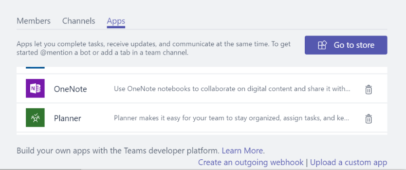

# Microsoft Teams にアプリ パッケージをアップロードする

Microsoft Teams でアプリ エクスペリエンスをテストするには、アプリを Teams にアップロードする必要があります。 アップロードすると、アプリが選択したチームに追加されます。チーム メンバーは、エンド ユーザーのようにアプリを操作できます。

> [!NOTE]
> ボットを使用して既存のアプリの更新されたパッケージをアップロードすると、[会話] ウィンドウで、タブの変更が表示されない場合があります。 アプリのフライアウトを介してアクセスするか、クリーンなテスト環境でテストすることをお勧めします。

## アップロード パッケージを作成する

開発および AppSource (以前の Office ストア) 提供の場合は、エクスペリエンスを説明する情報を含むアップロード可能なパッケージを作成する必要があります。 パッケージ (.zip ファイル) には、エクスペリエンスを一意に定義するアプリケーション マニフェストとアイコンが含まれています。

アップロード パッケージを作成するには、[「Microsoft Teams アプリのパッケージを作成する」](../build-and-test/apps-package.md)を参照してください。

パッケージを作成したら、チームにアップロードできます。 アップロードすると、選択したチーム内のすべてのユーザーと、そのチームのユーザーのみが使用できるようになります。

## パッケージを Teams に読み込む

パッケージを Teams にアップロードしてテストすることができます。

> [!NOTE]
> アップロードを機能させるには、テナント管理者が最初に[アプリのアップロードを有効にする](/microsoftteams/admin-settings)必要があります。

アプリを Teams にアップロードするには、次の 2 つの方法があります。

* ストアを使用する
* [アプリ] タブを使用する

## ストアを使用してチームまたは会話にパッケージをアップロードする

1. Teams の左下にある [ストア] アイコンを選びます。 [ストア] ページで、[カスタム アプリのアップロード] を選びます。

  

2. *[開く]* ダイアログで、アップロードするパッケージに移動し、*[開く]* を選びます。

   

アップロードしたパッケージは、[同意] ダイアログで指定されたチームまたは会話で使用できるようになります。 アプリが表示されない場合、最も一般的な理由は、マニフェスト、特にアプリ、ボット、メッセージング拡張機能の ID のエラーです。 アプリに会話の範囲が設定されていない場合、このオプションは表示されません。

>[!NOTE]
> 現在、会話中のアプリは、[開発者プレビュー](../../resources/dev-preview/developer-preview-intro.md)に含まれていますが、Teams がこのモードで動作していない場合、このオプションは表示されません。

## [アプリ] タブを使用してパッケージをチームにアップロードする

1. ターゲット チームで、*[その他のオプション]* (**&#8943;**) を選び、*[チームの管理]* を選びます。

   > [!NOTE]
   > チームの所有者でなければなりません。または、所有者がこの機能を表示するために適切なアプリの種類をユーザーが追加できるようにする必要があります。

2. [アプリ] タブを選択し、右下の *[カスタムアプリのアップロード]* を選択します。

   

3. コンピューターから .zip パッケージを参照して選択します。

4. しばらくすると、アップロードしたアプリがリストに表示されます。

   

アプリが読み込まれない場合、最も一般的な理由は、マニフェスト、特にアプリ、ボット、メッセージング拡張機能の ID のエラーです。

## アップロードした構成可能なタブにアクセスする

アプリにタブが含まれている場合、標準タブ ギャラリー フローを使用して、任意の会話またはチーム チャネルにユーザーをピン留めすることができます。

1. チーム内のチャネルに移動します。 既存のタブの右側にある *+* (*タブの追加*) を選びます。

2. 表示されるギャラリーからタブを選択します。

3. 同意プロンプトを受け入れます。

4. [構成ページ](../../tabs/how-to/create-tab-pages/configuration-page.md)を介してタブを構成し、*[保存]* を選びます。

  ![使用可能なタブのギャラリーが表示された [タブの追加] ダイアログ ボックス](../../assets/images/tab_gallery.png)

## アップロードしたボットにアクセスする

ボットをチームに追加すると、ボットの範囲の定義に応じて、チームのチャネルの内外にあるチームのすべてのユーザーが使用できるようになります。 [全般] チャネルに、ボットがチームに追加されたことを示す投稿が表示されます。

Teams 対応のボットの場合、オートコンプリートする必要があるボットの名前を @ メンションすることで、ボットを呼び出すことから始めることができます。

ボットとの直接チャットをテストするには、アプリのホームからアクセスするか、チャネルで @ メンションするか、**[新しいチャネル]** ウィンドウで検索します。

ボットを会話に追加するとき: ボットとの直接チャットをテストするには、会話で @ メンションするか、**[新しいチャット]** ウィンドウで検索します。

## アップロードしたコネクタにアクセスする

アプリがチームや会話に読み込まれると、ユーザーは標準コネクタ ギャラリー フローを使用してコネクタを設定できます。

1. チーム内のチャネルに移動します。 *[その他のオプション]* (*&#8943;*) を選び、*[コネクタ]* を選びます。

2. 一番下にある **[サイドロード]** セクションから [コネクタ] を選びます。

3. [構成ページ](../../webhooks-and-connectors/how-to/connectors-creating.md)を介してコネクタを構成し、*[保存]* を選びます。

  ![使用可能なタブのギャラリーが表示された [タブの追加] ダイアログ ボックス。](../../assets/images/connector_gallery.png)

## アップロードしたメッセージング拡張機能にアクセスする

メッセージング拡張機能を使用してアップロードされたアプリが自動的に [作成] ボックスの *[その他のオプション]* (*&#8943;*) メニューに表示されます。

## アプリを削除または更新する

アプリを削除する場合は、[Teams ボットの表示] リストで、アプリ名の横にあるごみ箱アイコンを選びます。

マニフェスト情報を変更する場合は、まず、アプリを削除してから、更新されたパッケージを追加する必要があります ([パッケージをチームに読み込む](#load-your-package-into-teams)ごとに)。 一般に、サービスに関するコード変更では、マニフェストの更新が必要な場合を除き (たとえば、URL の変更やボットの Microsoft アプリ ID の変更など)、マニフェストの再アップロードは必要ありません。

> [!NOTE]
> ボットを個人コンテキストから完全に削除する方法はありません。 ボットが削除されて再度追加された場合、ボットとの追加の通信が前の会話に追加されます。

## トラブルシューティングに関する注意

* マニフェストが読み込まれない場合は、[「パッケージの作成」](../../concepts/build-and-test/apps-package.md)のすべての手順に従い、[スキーマ](../../resources/schema/manifest-schema.md)に対してマニフェストを検証したことを再確認してください。
