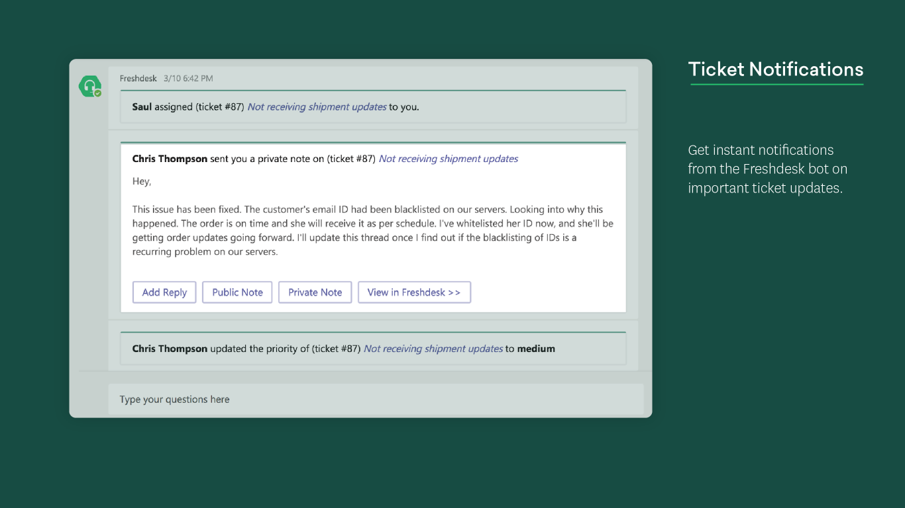

# 高度なアプリの詳細ページを作成する

[詳細] ページには、アプリの最初の印象がユーザーに表示されます。 詳細ページの各要素を使用して、ビジョンとドライブのダウンロードを伝えることができます。アプリの表示を制限された領域で実現する方法を検討します。 アプリをインストールする前にユーザーを参加させるためのヒントと秘訣を次に示します。

> [!NOTE]
> アプリ [の情報が、有効なストアの一覧を作成するための Appsource ガイダンス](/office/dev/store/create-effective-office-store-listings)に従っていることを確認してください。

## アプリ名

> [!div class="checklist"]
>
> * アプリの名前は、ユーザーが AppSource app store でそれを検出する方法で重要な役割を果たします。 アプリの短縮名が [詳細] ページに表示されます。
>* アプリ名は、Microsoft または Microsoft 製品を参照せずにアプリを反映する必要があります。
>

> **注**: アプリがマイクロソフトと公式に提携している場合は、サードパーティ製アプリの名前を最初にする必要があります (たとえば、 *Microsoft Teams の Salesforce Connector*)。

> [!div class="checklist"]
>
>* ガイダンスには次のリソースを使用します。

* [アプリ名ガイド](https://docs.microsoft.com/microsoftteams/platform/concepts/deploy-and-publish/appsource/prepare/detail-page-checklist#app-name)
* [Microsoft の商標とブランドに関するガイドライン](https://www.microsoft.com/en-us/legal/intellectualproperty/trademarks/usage/general)

**手順は次のとおりです。**

* アプリの動作についてヒントを示す、わかりやすいシンプルな名前を選びます。
* 特徴的です。
* 必要に応じて、Office 365 の代わりに Microsoft 365 の参照を使用します。

**注意事項**

* スペースを省略したり、大文字小文字を指定したり、アプリ名に言語エラーを含めることはできません。
* 既存のアプリと同じような汎用用語や名前を使用しないでください。
* アプリ名には、「Teams」、「Microsoft」、既存/今後の Microsoft 製品名、または「アプリ」を使用しないでください。
* Microsoft 製品を含めるためにかっこを使用しないでください *(Microsoft Teams の場合)*。

## 色アイコン

これは、ユーザーによって最初に表示される要素の1つです。 これは、アプリストアをスクロールするときに魅力的で目立つものにする必要があります。 最初の印象を適切にし、ブランドの画像と目的を伝えることができるようにしてください。 AppSource には [、一貫性のあるビジュアル id を作成するため](/office/dev/store/create-effective-office-store-listings#create-a-consistent-visual-identity)のヒントが追加されています。

**注意事項**

* 自分が所有していない著作権製品については、アイコンを模倣しないようにしてください。
* アイコンは、Microsoft 製品/ブランドに似た外観にはなりません。

## アウトラインアイコン

これは、メッセージング拡張機能、ユーザーによってお気に入りとしてマークされたアプリ、左側のナビゲーションメニューで使用されます。 シンプルで認識可能であることを確認してください。 アウトラインアイコンには、白の色のみが含まれ、透明になっている必要があります。 必要な仕様については、「 [Microsoft Teams アプリアイコン用のアプリパッケージを作成する](../../../build-and-test/apps-package.md#icons) *」を参照してください*。

 

**注意事項**

* このアイコンは、自分が所有していない著作権製品を模倣してはなりません。
* アイコンは、Microsoft 製品/ブランドに似た外観にはなりません。

## 簡潔な説明

これは、アプリの簡潔な概要です。 これは、対象ユーザーに直接伝わる独創性に満ちた魅力的なものにします。 理想的には、1つの文で、ソリューションとその価値をユーザーに説明します。

**手順は次のとおりです。**

* 最も重要な情報を最初に説明します。
* 顧客が検索する可能性があるキーワードを含めます。
* Microsoft teams について言及する必要がある場合は、microsoft teams の最初の説明を *Microsoft teams*として完全に記述する必要があります。 Teams を同じ説明に再度記述する場合は、その名前を *teams*に短縮することができます。
* Microsoft または Microsoft Teams への参照は、説明の一部にすることができます。また、Microsoft のブランド標準およびガイドラインに準拠する必要があります。
* すべての説明は、言語エラーのない文法上の正しいものである必要があります。
* "ユーザー" ではなく "Users" という capitalizations を使用しないようにします。

**注意事項**

* タイトルを繰り返さないでください。
* "MS" を省略することはできません。
* 専門用語や専門用語を使用しないでください。ユーザーが検索対象を知っているとは想定できません。
* 完全に必要な場合を除き、Microsoft 製品名への不必要な参照を避けます。
* アプリが Microsoft から提供されたものであることを示すものではありません。
* 所有していない著作権を持つブランド名を使用しないでください。
* 省略名には、"Teams" を使用しないでください。

[アプリ Studio](https://aka.ms/InstallTeamsAppStudio)のビューを次に示します。

## 詳しい説明

> [!div class="checklist"]
>
>* これにより、ソリューションの主な機能、解決される問題、および対象ユーザーを強調することができます。 最初の文を使用して、アプリの固有の機能を伝えることによって、対象ユーザーに通知します。 説明は4000文字未満である必要があります。ほとんどのユーザーは、300と500の単語の間でのみ読み取ることができます。
>* 許可されているもの

* `<your_app>`  「Microsoft Teams と連携」
* `<for users>`  「Microsoft Teams の使用」
* `<for tasks>`  「Microsoft Teams 内」
* `<an app>`  「Microsoft Teams」
* `<your_app>`  「Microsoft Teams と統合」
* "...Microsoft Teams と統合」
* "...作成したもの
* "...実行方法... "
* "...有効にするもの
* "...開発対象
* "...目的は...

> **注**: 上記の用語は、Microsoft 365 の使用にも適用されます。 Office 365 は、Microsoft 365 と呼ばれるようになりました。 アプリの説明を更新して、これを反映してください。

>[!IMPORTANT]
> AppSource エントリで記述した説明をアプリのマニフェストに正確にコピーしてください。値は一致している必要があります。 Microsoft Teams では、アプリマニフェストで提供される説明のみを使用します。

**手順は次のとおりです。**

* [Markdown の書式設定](https://support.office.com/article/use-markdown-formatting-in-teams-4d10bd65-55e2-4b2d-a1f3-2bebdcd2c772)を使用して、説明を表示します。  
* 説明をスキャンする際に閲覧者を支援する機能の一覧を示します。
* アクティブな音声を使用して、ユーザーに直接話します。
* 機能の一覧を表示するには、箇条書きを使用します。
* 質問がある場合にユーザーに連絡する方法がわかるように、ヘルプまたはサポートリンクを含めます。
* Microsoft Teams の最初のメンションが「*Microsoft teams*」として完全に書き出されていることを確認してください。 Teams が同じ説明の後の方で言及されている場合は、名前を "*Teams*" に短縮することができます。
* Microsoft または Microsoft Teams (必要な場合のみ) への参照は、詳細な説明に含めることができ、Microsoft のブランド標準およびガイドラインに準拠している必要があります。
* すべての説明は、言語エラーのない文法上の正しいものである必要があります。
* 説明の用語に対して capitalizations を不必要に使用しないようにします (例: "users" ではなく "Users" と記述されています)。
* 頭字語を省略します。
* 制限の呼び出し、アカウントの依存関係、構成の設定、リリースの今後の更新、または使用上の制約について必ず確認してください。

>[!NOTE]
> Microsoft Teams では、次の Markdown 構文をサポートしています。  
> **リンク**。 `[title](url/address/here)`.  
>**画像**. `` ..  
> **太字** `**bold text**`   `__bold text__`.  
> **斜体** `*italicized text*`  `_italicized text`.  
>**[順序付きリスト](https://www.markdownguide.org/basic-syntax/#ordered-lists)** 
>`1. first` 
 ` 1. second ` 
 `1.third` 
>**[順序なしリスト](https://www.markdownguide.org/basic-syntax/#unordered-lists)** 
` - short`  `- bulleted`  `- list` 
>**改行**。 `Place two empty spaces or a backslash \`  \
`at the end of a line.` 
 >**エスケープ.** 特殊文字をエスケープするには、インラインバックスラッシュを使用します。 `\*asterisk`.

**注意事項**

* 説明にはあまり多くのキーワードを含めないでください。これは煩雑であり、アプリの検出性に役立ちません。
* 短縮名には、"*teams*" または "*Microsoft Teams*" を使用しないでください。
* 完全に必要な場合を除き、Microsoft 製品名への不必要な参照を避けます。
* アプリがマイクロソフトから提供されたものであることを示すものではありません。
* 所有していない著作権を持つブランド名を使用しないでください。
* アプリがオフィシャル認定プロセスを経ていない限り、以下の言語は使用しないでください。

  * "...認定対象
  * "...[powered by]

* "Microsoft" を "MS" または "MSFT" の省略形にしないでください。 Microsoft を完全に記述します。
* 説明またはメタデータの一部では、アプリを Microsoft の公式なオファーリングとして示すことができます。
* パートナーは、Microsoft の紹介文を使用または模倣したり、Microsoft 製品またはサービスの名前をスローガンまたはタグラインで使用したりすることはできません。
* ロゴは、アプリを Microsoft の公式な製品/機能として、または既存または将来の Microsoft 製品を模倣するものではありません。

[アプリ Studio](https://aka.ms/InstallTeamsAppStudio)のビューを次に示します。

## スクリーンショット

[パートナーセンター](https://partner.microsoft.com)にアップロードされたスクリーンショットは、Teams クライアントの[appsource](https://appsource.microsoft.com/marketplace/apps?product=office%3Bteams&page=1)とアプリの一覧の両方に表示されます。 アプリの説明と共にアプリのビジュアルプレビューを提供します。
.Png、.jpg、.gif ファイルとして書式設定された1つのスクリーンショットを提供できます。 スクリーンショットは、最大サイズが 1024 KB で 1366 x 768 ピクセルでなければなりません。

**手順は次のとおりです。**

* アプリのすべての機能を強調表示することに重点を置いてください。
* コンテンツは、アプリを正確に表す必要があります。
* テキストは、過剰でない状態で適切に設定する必要があります。
* スクリーンショットを背景色で囲み、 [Freshdesk](https://appsource.microsoft.com/product/office/WA104381505?src=office&tab=Overview) の例のようなマーケティングコンテンツを追加することができます。ただし、この寸法のスクリーンショットは表示されませんが、全体的な画像が含まれます。

**注意事項**

* 電話機やラップトップなど、特定のデバイスを表示しません。
* アプリの外部から chrome/UI を表示しないようにします。
* スクリーンショットに Teams またはブラウザー UI をキャプチャしないでください。
* アプリを正確に反映しないモックを含めないでください。これには、Teams タブではなく web サイトを表示するなどの実際の UI が表示されます。

ベストプラクティスの詳細については、以下を *参照して*ください。 [appsource store の画像を有効](/office/dev/store/craft-effective-appsource-store-images)にします。

## 動画

画像が1000単語に値する場合、ビデオは1000個の画像になる価値があります。 ビデオは、アプリを使用する利点を伝える最も効果的な方法です。 [アプリの詳細] ページのすべてのスクリーンショットの前に配置されます。 次の点について必ずお伝えください。

* アプリのしくみ。
* アプリによって実現できること。
* アプリを使用する利点
* の対象者。

プレゼンテーションは、わずか30-90 秒の間に短縮して、常にわかりやすいものにしてください。

## 詳細情報

[アプリ送信用のチェックリスト](~/concepts/deploy-and-publish/appsource/publish.md)。  
[Microsoft Teams アプリ用のアプリパッケージを作成](~/concepts/build-and-test/apps-package.md)します。  
[パートナーセンターを使用して、ソリューションを AppSource に提出](/office/dev/store/use-partner-center-to-submit-to-appsource)します。
