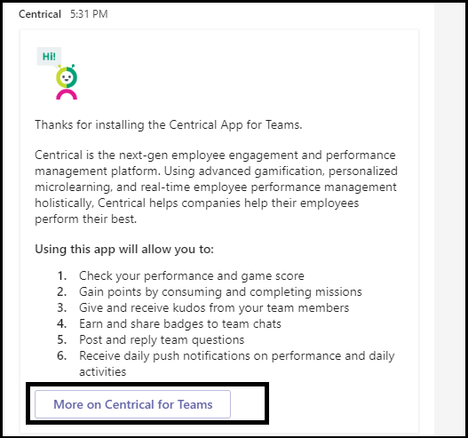
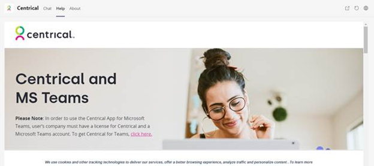
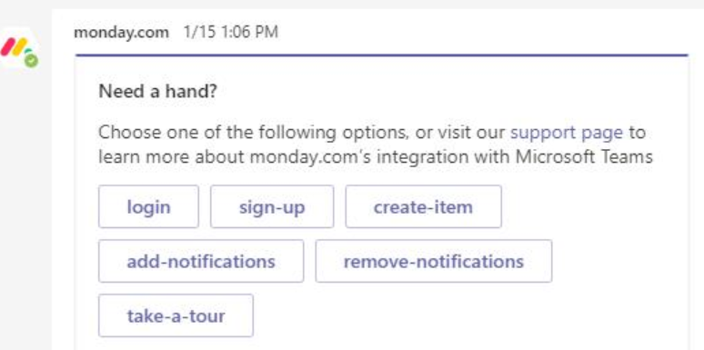

# ヒントアプリの申請が成功Microsoft Teams確認する

>[!NOTE]
>このページは、2021 年 5 月に廃止されます。 アプリを正常に発行する方法の詳細については、「ストア検証[Teams」を参照してください](~/concepts/deploy-and-publish/appsource/prepare/teams-store-validation-guidelines.md)。

この記事では、送信されたアプリが検証に失敗する一般的な理由について説明します。 アプリに関して発生する可能性のあるすべての問題の完全な一覧を示す目的ではありませんが、このガイドに従って、アプリの申請が初めて渡される可能性が高くなることができます。 詳細については、「検証ポリシーの広範な一覧 [については](/legal/marketplace/certification-policies) 、商用マーケットプレース認定ポリシー」を参照してください。

>[!NOTE]
>**[セクション 1140](/legal/marketplace/certification-policies#1140-teams)** は、Microsoft Teamsおよびサブセクション **[1140.4](/legal/marketplace/certification-policies#11404-functionality)** に固有の機能要件Teamsします。

## ほとんどのテスト ケース&検証ガイドライン

### &#9989;一般的な考慮事項

* バージョン 1.4.1 以降の SDK を使用Microsoft Teams[します](https://www.npmjs.com/package/@microsoft/teams-js)。
* 検証プロセスの進行中にアプリを変更しない。 これを行う場合は、アプリの完全な再評価が必要です。
* アプリは、応答を停止したり、予想外に終了したり、プログラミング エラーを含んだりしてはなりません。 問題が発生した場合、アプリは失敗し、ユーザーへの道順に関する有効な情報を提供する必要があります。
* アプリは、ユーザー環境で実行可能コードを自動的にダウンロード、インストール、または起動しなけれ。 すべてのダウンロードでは、ユーザーからの明示的なアクセス許可を求める必要があります。
* 説明やサポート ドキュメントなど、エクスペリエンスに関連付けるすべての資料は、正確である必要があります。 説明と資料では、正しいスペル、大文字と小文字の区別、句読点、および文法を使用してください。
* ヘルプとサポート情報を提供します。 最初に実行するユーザー エクスペリエンスのヘルプまたは FAQ リンクをアプリに含めるのは、強くお勧めします。 すべての個人用アプリでは、ユーザー エクスペリエンスを向上するための個人用タブとしてヘルプ ページを提供することをお勧めします。
* すべてのアプリには、次の場所でのアプリの機能と必要な統合について説明する構成画面のツアーやアプリ ガイドなどのビジュアル ツアーが必要です。
    * [ストアの登録情報] ページ (詳細説明)。
    * タブ構成画面。
    * ボットのウェルカム メッセージ。
    * アプリ ソースのメタデータ。
    * コネクタの構成画面。

* ビジュアル ツアーには、ビデオ、スクリーンショット、アプリの詳細を含む静的タブへのリンクを指定できます。 これらの参照はすべて、環境内Teamsがあります。

     

* 申請にマニフェストを変更する場合は、マニフェスト内のアプリのバージョン番号を増やします。
* アプリは、コア ユーザー シナリオのためにユーザーをTeamsを取り出していけない。 アプリ内のリンク ターゲットは、外部ブラウザーにリンクしなけい。 リンク ターゲットは、タスク モジュールやタブなど、Teams div 要素にリンクする必要があります。 
* タスク モジュールまたはタブを使用して、タスク 内のユーザーに情報を表示Teams。
* コアシナリオとコア以外のすべてのシナリオは、以下を除き、Teams環境内で完了する必要があります。
  * プライバシー ポリシー
  * 利用規約 (TOU)
  * [Web サイト] リンク
  * サインアップ プロセス

* 個人用アプリを使用すると、ユーザーは個人のアプリ エクスペリエンスのコンテンツを他のチーム メンバーと共有できます。

### &#9989; 明確でシンプルなサインイン、サインアウト、サインアップエクスペリエンスを提供する

* アプリまたはアドインが外部アカウントまたはサービスに依存している場合は、サインイン、サインアウト、サインアップのエクスペリエンスがアプリのすべての機能で明らかで到達可能である必要があります。
* ユーザーに明示的なサインイン オプションが提供されている場合は、対応するサインアウト オプションが必要です (アプリがサイレント認証を使用している [場合でも](../../../../tabs/how-to/authentication/auth-silent-aad.md))。
* サインアウト オプションは、アプリの機能からユーザーをサインアウトする必要があるだけで、ユーザーがクライアントからTeamsです。
* 少なくとも、サインアウト オプションは、サインイン オプションでアクセスした機能と同じ機能からユーザーをサインアウトする必要があります。 たとえば、サインイン オプションにメッセージング拡張機能とタブの両方が含まれる場合、サインアウト オプションにはメッセージング拡張機能とタブの両方が含まれる必要があります。

* 次の (または類似の) 動作を取り消す方法が常にあるか確認します。
  * サインイン =>サインアウト。
  * アカウント/サービスをリンクする =>/サービスのリンクを解除します。
  * Connect/サービス = アカウント/サービス>切断する方法を指定します。
  * アカウント/サービスを承認する =>/サービスの認証解除/拒否を行います。
  * アカウント/サービスを登録する =>登録解除/登録解除を行います。
* アプリでアカウントまたはサービスが必要な場合は、ユーザーがサインアップまたはサインアップ要求を作成する方法を提供する必要があります。 アプリでライセンスを使用する必要がある場合は、例外が付与される場合があります。 このようなシナリオでは、新しいユーザーがサインアップする明確な手順を提供します。
* アプリ サービスを使用するためにサインアップする方法について、新しいユーザーへの道順に関する明確なガイダンスを提供します。 準備完了のサインアップ リンクが利用できない場合は、次の領域で正確なガイダンスを提供してください。

> [!div class="checklist"]
>
> * をアプリの説明セクション内に表示します。
> * をアプリのウェルカム メッセージに表示します。
> * をアプリのヘルプ メッセージに表示します。
> * をクリックし、ユーザーにサービスへのサインインを求めるウィンドウに表示されます。

* 簡単なサインアップ フローのないアプリには、ヘルプ タブや Web ページへのリンクも含める必要があります。新しいユーザーは、Teams アプリの構成に関する詳細なガイダンスを確認できます。 アプリを初めて試す際に、新しいユーザーがブロックされていないことを確認するための詳細情報を提供します。
* サインインとサインアウトの機能は、モバイル クライアントで機能する必要があります。 SDK バージョン 1.4.1 [Microsoft Teams](https://www.npmjs.com/package/@microsoft/teams-js)以降を使用してください。

認証の詳細については、以下を参照してください。

* [認証に関するドキュメント](../../../authentication/authentication.md)
* [ノードのボット認証サンプル](https://github.com/OfficeDev/microsoft-teams-sample-auth-node)
* [Node のタブ認証サンプル](https://github.com/OfficeDev/microsoft-teams-sample-complete-node)
* [タブ/ボット認証 (C#/.NET)](https://github.com/OfficeDev/microsoft-teams-sample-complete-csharp)

### &#9989;時間が妥当である必要がある場合

* **タブ**. アクションへの応答に 3 秒以上かかる場合は、読み込みメッセージまたは警告を指定する必要があります。
* **Bots**. ユーザー コマンドへの応答は、2 秒以内に行う必要があります。 より長い処理が必要な場合は、アプリに入力インジケーターを表示する必要があります。
* **拡張機能を作成します**。 ユーザー コマンドへの応答は、5 秒以内に行う必要があります。

> [!TIP]
> アプリの応答に予想以上に時間がかかる場合は、アプリに読み込みインジケーターまたは何らかの警告が表示されます。

### &#9989;タブ コンテンツに過度のクロムまたはレイヤーナビゲーションを含めずに移動する

* タブはフォーカスされたコンテンツを提供し、不要な UI 要素を避ける必要があります。 これは通常、不要な入れ子になったナビゲーションまたはレイヤーナビゲーション、コンテンツの横にある無関係または無関係な UI、または関連のないコンテンツにユーザーを連れて行くリンクを指します。 たとえば、次のタブ ビューではナビゲーション メニューが省略され、メイン コンテンツだけが表示されます。

  

* タブは自然に軽く、複雑なナビゲーションは含めずに行う必要があります。
* アプリ内で複雑な編集機能を持つチャネル タブは、タブではなくマルチ ウィンドウでエディター ビューを開く必要があります。
* チャネル タブには、メイン のナビゲーションと競合する左側のレールにアイコンが含Teams必要があります。
* タブには、メイン のナビゲーションと競合するアイコンが左側のレールに表示Teams必要があります。
* アプリ内に複雑な編集機能を持つタブは、タブではなくマルチ ウィンドウでエディター ビューを開く必要があります。
* 複数のビュー オプションがある場合は、ユーザーが選択できるタブ構成メニューを使用する必要があります。 たとえば、タブ内にメニューを埋め込む代わりに、メニューを構成ページに入れて、実際のタブ ビューがクリーンでフォーカスを設定します。
* アプリを構成 *、* サインアップ、および使用する方法をユーザーにアドバイスするには、静的タブとして [ヘルプ] タブを含める必要があります。
* アプリ ヘッダーから *設定* を含める必要があります。

### &#9989;タブの構成は、構成画面で行う必要があります。

* 構成画面では、エクスペリエンスの値とタブの構成方法を明確に説明する必要があります。
* 構成プロセスでは、ユーザーがユーザー エクスペリエンスを終了する方法を常に提供し、ユーザー エクスペリエンスを終了しない必要があります。 たとえば、ユーザーがタブを構成した後に空のボードを表示しない。
* ユーザー サインイン プロセスは、構成プロセスの一部である必要があります。 タブ UI で完了してください。 ユーザーが構成を完了し、タブを読み込んだ後は、それ以上の操作は必要ありません。
* サインイン構成ポップアップ ウィンドウ内に Web ページ全体を表示しない。
* 探しているコンテンツがすぐに見つからなくても、ユーザーは常に構成エクスペリエンスを完了できる必要があります。
* 構成エクスペリエンスでは、ユーザーがコンテンツを検索したり、URL をピン留めしたり、存在しない場合は新しいコンテンツを作成したりするためのオプションを提供する必要があります。
* 構成エクスペリエンスは、ユーザー コンテキスト内Teamsがあります。 ユーザーは、コンテンツを作成するために構成エクスペリエンスを離れ、そのコンテンツをピン留Teamsに戻る必要があります。
* 使用可能なビューポート領域を効率的に使用します。 構成ポップアップ内で巨大なロゴを使用する場合は、無駄にしない。

### &#9989;タブ - メンバー アクセス

* チャネル スコープ内のメンバーによって構成されたタブは、タブを構成したメンバーからのアクセス許可を求めることなく、他のメンバーがアクセスできる必要があります。
* アプリは、タブがプライベートまたは制限付き使用の場合、またはタブを構成したメンバーからのアクセス許可が必要な場合は、アクセス許可管理オプションを前払いする必要があります。

### &#9989;ボットは常に応答性が高く、正常に失敗する必要があります

ボットは、任意のコマンドに応答し、ユーザーを終了しない必要があります。 ボットがユーザーにインテリジェントに応答するのに役立つヒントを次に示します。

* **コマンド リストを使用します**。 ユーザーの入力を分析したり、ユーザーの意図を予測したりするのは難しいです。 ボットが何を行うのかをユーザーに推測させる代わりに、ボットが理解しているコマンドの一覧を提供します。

* **ヘルプ コマンドを含める**。 ユーザーは、紛失した場合やボットが期待通りに応答しない場合に、「ヘルプ」と入力する可能性があります。 すべての有効なコマンドと共にアプリの値を確認する方法を説明するヘルプ コマンドを含める。

* **ボットが失われたときにヘルプ コンテンツまたはガイダンスを含める**。 ボットがユーザー入力を理解できない場合は、別のアクションを提案する必要があります。 たとえば、「 *ごめんなさい、理解できない。詳細については、「ヘルプ」と入力します。* エラー メッセージや単に "理解できない" *と応答しない*。

### &#9989;ヘルプ コマンドの応答

* ヘルプ コマンドは正確である必要があります。アプリの応答は、少なくとも 6 つのコマンドに対してアクション可能なコンテンツを含むアダプティブ カード形式である必要があります。
* アプリに 6 個未満のコマンドがある場合は、すべてのコマンドがアダプティブ カードに存在する場合に確認します。

  

* **アダプティブ カードとタスク モジュールを使用してボットの応答を明確にし、操作可能にする** 
[タスク モジュールを呼び出すボタンを備え、アダプティブ カードを使用すると、](/task-modules-and-cards/task-modules/task-modules-bots.md)ボットのユーザー エクスペリエンスが向上します。 これらのカードとボタンは、ユーザーがコマンドを入力するのとは対照的に、モバイル デバイスで使用する方が簡単です。 また、ボットの応答は、長いテキストを含むテキストである必要があります。 ボットは、会話型チャット ベースのユーザー インターフェイスと長いテキスト応答の代わりに、アダプティブ カードとタスク モジュールを使用する必要があります。

* **すべてのスコープについて考える**. チャネルと個人の会話で言及 ( ) を行う場合は、ボットが適切な `@*botname*` 応答を提供します。 ボットが個人用スコープまたはチーム スコープ内で意味のあるコンテキストを提供しない場合は、マニフェストを使用してそのスコープを無効にします。 (マニフェスト スキーマ `bots` 参照のMicrosoft Teams[を参照してください](../../../../resources/schema/manifest-schema.md#bots))。

* **チーム、グループ チャット、または 1:1 の会話を含める**。 ボット通知には、チーム、グループ チャット、または対象ユーザーに関連するコンテンツを含む 1 対 1 の会話が含まれる必要があります。

* **機密データをプッシュしない**。 ボットは、チーム、グループ チャット、または 1 対 1 の会話に機密データをプッシュし、そのデータを表示しなきユーザーがいる場合は、そのデータをプッシュしなけらねない。

* **ウェルカム メッセージを入力します**。 ボットは、エンゲージメントを促進するために、カルーセル カードを含む対話型チュートリアルまたは "試してみる" ボタンを含む FRE ウェルカム メッセージを提供する必要があります。

### &#9989;のボットは、最初の起動時に常にウェルカム メッセージを送信する必要があります

ウェルカム メッセージは、個人用チャット ボットのトーンを設定する最適な方法です。 これは、ユーザーがボットと最初にやり取りする操作です。 優れたウェルカム メッセージは、ユーザーにアプリの探索を促す場合があります。 ウェルカム メッセージまたは入門メッセージがわかりにくい場合や不明瞭な場合、ユーザーはアプリの値をすぐに表示し、関心を失います。
ウェルカム メッセージの要件については、次のセクションを参照してください。

> [!Note]
> チャネル ボットのウェルカム メッセージは省略可能です。

### ウェルカム メッセージの要件

* ウェルカム ツアーに価値提案を含める。
* アプリを使用するための方法を示すガイダンスを提供します。
* アプリのサインアップと構成方法に関するガイダンスを含める。
* 読みやすくテキストと簡単な対話を提示します。できれば、タスク モジュールを読み込む操作可能なウェルカム ツアー ボタンを備えたカードです。
* ボタンやカードでシンプルで使い分け可能な状態に保ち、長いテキスト、チャットの対話を避ける。
* ウェルカム メッセージをより使い分け可能にするアダプティブ カードとボタンを含める。
* 2 つ以上の同時 ping ではなく、1 つの ping でウェルカム メッセージを呼び出します。
* ウェルカム メッセージは、アプリを構成したユーザーにのみ表示する必要があります (できれば、1:1 の個人用チャットに表示されます)。
* 個人用アプリは、常にユーザーにウェルカム メッセージを提供する必要があります。
* チームのすべてのメンバーに個人的なチャットを送信しない。スパムと見なされます。
* ウェルカム メッセージを 2 回以上送信しない。 同じウェルカム メッセージを一定の間隔で繰り返す操作は許可されません。また、spamming と見なされます。

#### ウェルカム メッセージの spamming を避ける

* **ボットによるチャネル メッセージ**。 別の新しいチャット投稿を作成してユーザーに迷惑メールを送信しない。 同じスレッドに返信を含む単一のスレッド投稿を作成します。
* **ボットによる個人用チャット**。 複数のメッセージを送信しない。 完全な情報を含む 1 つのメッセージを送信します。 同じウェルカム メッセージを一定の間隔で繰り返す操作は許可されません。また、spamming と見なされます。

#### 通知専用ボットのウェルカム メッセージ

通知専用ボットは、「通知専用ボットであり、チャットに返信できない」というメッセージを含むウェルカム メッセージを *送信する必要があります*。

#### 個人用スコープ内のウェルカム メッセージ

   * **メッセージを簡潔で有益にしてください**。 ユーザー エクスペリエンスとアプリの知識は異なります。 ユーザーが別のプラットフォームでアプリを使用した場合や、アプリについて何も知らない場合があります。 メッセージをすべてのユーザーに合わせて調整し、いくつかの文章でボットの動作と操作方法を説明します。 また、アプリの値と、ユーザーがアプリを使用するメリットを説明する必要があります。

* **メッセージを操作可能にする**。 アプリをインストールした後で、ユーザーに最初に行って欲しいことを考えてみろ。 試す必要があるクールなコマンドはありますか? もう 1 つのオンボーディング エクスペリエンスについて知っている必要がありますか? サインインする必要がありますか? アダプティブ カードにアクションを追加したり *、"Try asking.... "*"これは私にできる操作です。" などの具体的な例を *提供できます。*

#### チームスコープまたはチャネル スコープ内のウェルカム メッセージ

ボットが最初にチャネルに追加される場合、少し異なります。 通常、チームのすべてのユーザーに 1:1 のメッセージを送信する必要がありますが、ボットはチャネルでウェルカム メッセージを送信できます。

### &#9989;の応答性、ダイレクト アップセルや支払いなし

* タスク モジュールのタブ、アダプティブ カード、ボット メッセージ、コンテンツは、さまざまなモバイル デバイス画面サイズに対応している必要があります。
* iOS をサポートするアプリは、最新バージョンの iOS をiPadデバイスで完全に機能している必要があります。
* ユーザーがモバイル OS (Android、iOS) で Teams アプリから他のコンテンツ、アプリ、アドインを購入または取得できるオンライン ストアへのアプリ内購入、試用版、有料版のオファー、またはリンクへの直接参照を含めずにしてください。
* アドインの iOS バージョンまたは Android バージョンでは、ユーザーに支払いを求める他のアプリ、アドイン、または Web サイトへの UI や言語、リンクを表示しなけってはなりません。
* 関連するプライバシー ポリシーと利用規約ページには、コマース UI またはストア リンクも含めずに設定する必要があります。

### &#9989; データの表示を意図していない対象ユーザーに機密データを投稿しない

Teams アプリは、クレジット カードや金融支払い手段、個人識別情報 (PIN)、正常性、連絡先トレース情報などの機密データを、そのデータを表示することを意図していない対象ユーザーに投稿しなけってはなからねない。

### &#9989; 支払いの詳細を送信したり、アプリ経由で金融取引を完了Teamsしない

* アプリTeamsインターフェイス内で直接支払いを行うユーザーにTeamsできません。
* アプリは、アプリ インターフェイスでユーザーを通じて金融商品の詳細を送信できない場合があります。 アプリは、ユーザーがアプリを使用することに同意する前に、アプリの利用規約、プライバシー ポリシー、およびアプリのプロファイル ページまたは Web サイトに開示された場合にのみ、セキュリティで保護された支払いサービスへのリンクをユーザーに送信できます。

### &#9989;環境にファイルまたは実行可能ファイル ( ) をダウンロードする前に警告 `.exe` をクリアする

アプリがファイルまたは実行可能ファイル ( )をユーザーのコンピューターまたは環境にダウンロードする前に、ユーザー `.exe`  に警告してください。

### &#9989;メッセージング拡張機能は、ヘルプ テキストを提供し、読みやすくする必要があります

* 検索ベースのメッセージング拡張機能は、効果的に検索する方法 (例: 入力例の表示) に関するヘルプ テキストを提供する必要があります。
* タスク モジュールには、アプリに含まれているか、アプリから作成されたアイコンと短い名前が含まれている必要があります。
* メッセージ拡張機能の `@mention` 実行可能ファイルは、明確でわかりやすい、読みやすくする必要があります。

## M365 Publisher構成証明

### &#9989; パートナー センターでPublisher構成証明を完了する

* 詳細については[、「Complete Publisher構成](/microsoft-365-app-certification/docs/attestation)証明プログラム」のドキュメントを参照してください。
* [構成証明のワークフロー][セクションPublisher手順](/microsoft-365-app-certification/docs/userguide#3publisher-attestation-workflow)に従って、発行元の構成証明プロセスを完了します。 質問については、appcert@microsoft.com に書き込みしてください。
* 詳細については [、「トラブルシューティング ガイド」](/azure/active-directory/develop/troubleshoot-publisher-verification) を参照してください。
* パートナー センターを通じて自己証明を完了します。 [アプリコンプライアンス] Self-Assessmentアンケートに **入力します**。

## 関連項目

* [アプリ承認ポリシー Teams詳細](/legal/marketplace/certification-policies#1140-teams)
* [セクション 100 — 全般](/legal/marketplace/certification-policies#100-general)
* [セクション 1100.5 — カスタマー コントロール](/legal/marketplace/certification-policies#11005-customer-control)
