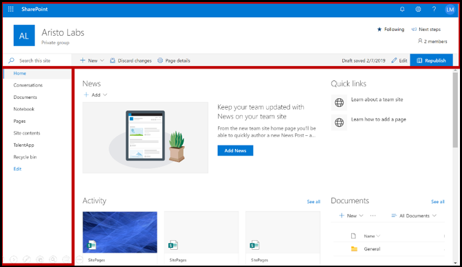

# Microsoft Teams アプリの提出を成功させるためのヒントTips for a successful Microsoft Teams app submission

>[!NOTE]
>このページは 2021 年 5 月までに廃止予定です。This page will be deprecated by May 2021. アプリの正常な発行の詳細については[、「Teams ストア検証ガイドライン](~/concepts/deploy-and-publish/appsource/prepare/teams-store-validation-guidelines.md)」を参照してください。For more information on successfully publishing your app, see the [Teams store validation guidelines](~/concepts/deploy-and-publish/appsource/prepare/teams-store-validation-guidelines.md).

この記事では、提出されたアプリが検証に失敗する一般的な理由について説明します。This article addresses common reasons submitted apps fail validation. アプリに関するすべての潜在的な問題の完全なリストではありませんが、このガイドに従うと、アプリの提出が最初に通過する可能性が高くなります。While it's not intended to be an exhaustive list of all potential issues with your app, following this guide will increase the likelihood that your app submission will pass the first time. 詳細については、「 [商用市場の認証ポリシー](/legal/marketplace/certification-policies) 」を参照して、検証ポリシーの広範なリストを参照してください。For more information, see [Commercial marketplace certification policies](/legal/marketplace/certification-policies) for an extensive list of validation policies.

>[!NOTE]
>**[セクション1140](/legal/marketplace/certification-policies#1140-teams)** はMicrosoft Teamsに固有であり、**[サブセクション1140.4](/legal/marketplace/certification-policies#11404-functionality)** はTeamsアプリの機能要件に対処します。**[Section 1140](/legal/marketplace/certification-policies#1140-teams)** is specific to Microsoft Teams and **[sub-section 1140.4](/legal/marketplace/certification-policies#11404-functionality)** addresses functionality requirements for Teams apps.

## ほとんどの失敗したテスト ケース&検証ガイドラインValidation guidelines & most failed test cases

### &#9989;一般的な考慮事項&#9989; General considerations

* Microsoft Teams [SDK](https://www.npmjs.com/package/@microsoft/teams-js)のバージョン 1.4.1 以降を使用していることを確認します。Ensure you are using version 1.4.1 or later of the [Microsoft Teams SDK](https://www.npmjs.com/package/@microsoft/teams-js).
* 検証プロセスの進行中は、アプリに変更を加えないでください。Don't make changes to your app while the validation process is in progress. これを行うには、アプリの完全な再検証が必要になります。Doing so will require a complete revalidation of your app.
* アプリは、応答を停止したり、予想外に終了したり、プログラミング エラーを含んだりしてはなりません。Your app must not stop responding, end unexpectedly, or contain programming errors. 問題が発生した場合、アプリは失敗し、ユーザーに転送するための有効な情報を提供する必要があります。If an issue occurs, your app must fail and provide valid information for the way-forward to the user.
* アプリは、ユーザー環境で実行可能コードを自動的にダウンロード、インストール、または起動してはなりません。Your app must not automatically download, install, or launch any executable code in the user environment. すべてのダウンロードは、ユーザーに明示的な許可を求める必要があります。All downloads must seek explicit permission from the user.
* 説明やサポート ドキュメントなど、経験に関連付ける資料は正確でなければなりません。Any material that you associate with your experience, such as descriptions and support documentation, must be accurate. 説明と資料では、正しいスペル、大文字と小文字の区別、句読点、および文法を使用してください。Use correct spelling, capitalization, punctuation, and grammar in your descriptions and materials.
* ヘルプとサポート情報を提供します。Provide help and support information. アプリには、初回実行のユーザー エクスペリエンスに関するヘルプまたは FAQ リンクを含め、強くお勧めします。It's highly recommended that your app include a help or FAQ link for the first-run user experience. すべての個人用アプリでは、より良いユーザー エクスペリエンスを得るための個人用タブとしてヘルプ ページを提供することをお勧めします。For all personal apps, we recommend providing your help page as a personal tab for a better user experience.
* すべてのアプリには、次の場所でアプリの機能と必要な統合について説明する構成画面で **[ツアーを取る** ]や **[アプリガイド** ]などのビジュアルツアーが必要です。All apps must have a visual tour, such as **Take a Tour** or an **App Guide** in its configuration screen that talks about the app features and necessary integration in the following places:
    * ストアの掲載情報ページ (詳細説明)。The store listing page (Long Description).
    * タブ設定画面。Tab configuration screen.
    * ボットのウェルカム メッセージ。Welcome message for a bot.
    * アプリ ソースのメタデータ。App source metadata.
    * コネクタの構成画面。Connector configuration screen.

* ビジュアルツアーは、ビデオ、スクリーンショット、アプリの詳細を含む静的なタブへのリンクにすることができます。The visual tour can be a  video, screenshot, a link to a static tab with app details. これらの参照はすべて、Teams環境内になければなりません。All these references must be within the Teams environment.

      

* 提出書類にマニフェストを変更した場合は、マニフェストでアプリのバージョン番号を増やします。Increment your app version number in the manifest if you make any manifest changes to your submission.
* アプリは、コア ユーザー シナリオのTeamsからユーザーを取り出してはなりません。The app must not take users out of Teams for core user scenarios. アプリのリンク ターゲットは、外部ブラウザーにリンクしないでください。Link targets in apps must not link to an external browser. リンクターゲットは、タスクモジュールやタブなど、Teams内に含まれるdiv要素にリンクする必要があります。Link targets must link to div elements contained within Teams, for example, task modules and tabs. 
* タスク モジュールまたはタブを使用して、Teams内のユーザーに情報を表示することをお勧めします。Using task modules or tabs is suggested to display information to users within Teams.
* 次のシナリオを除き、すべてのコア シナリオと非コア シナリオは、Teams環境内で完了する必要があります。All core and non-core scenarios must be completed within the Teams environment except for:
  * プライバシー ポリシーPrivacy Policy
  * 利用規約 (TOU)Terms Of Use (TOU)
  * ウェブサイトリンクWebsite link
  * サインアッププロセスSign-up process

* 個人用アプリを使用すると、ユーザーは他のチーム メンバーと個人用アプリ エクスペリエンスのコンテンツを共有できます。Personal apps enable users to share content from a personal app experience with other team members.

### &#9989;明確でシンプルなサインイン、サインアウト、サインアップのエクスペリエンスを提供する&#9989; Provide a clear and simple sign-in, sign-out, and sign-up experience

* アプリまたはアドインが外部アカウントまたはサービスに依存している場合、アプリのすべての機能でサインイン、サインアウト、サインアップのエクスペリエンスが明らかでアクセス可能である必要があります。If your app or add-in depends on external accounts or services, the sign-in, sign-out, and sign-up experience must be apparent and reachable across all capabilities in your app.
* ユーザーに明示的なサインイン オプションが提供されている場合は、対応するサインアウト オプションが必要です (アプリが [サイレント認証](../../../../tabs/how-to/authentication/auth-silent-aad.md)を使用している場合でも)。If there is an explicit sign-in option provided to the user, there must be a corresponding sign-out option (even if the app is using [silent authentication](../../../../tabs/how-to/authentication/auth-silent-aad.md)).
* サインアウト オプションは、ユーザーをアプリの機能から外すだけで、Teams クライアントからはサインアウトしないようにする必要があります。The sign-out option must only sign the user out of your app's capability and not out of the Teams client.
* 少なくとも、サインアウト オプションは、サインイン オプションでアクセスされるのと同じ機能からユーザーをサインアウトする必要があります。At a minimum, the sign-out option must sign the user out of the same capabilities accessed with the sign-in option. たとえば、サインイン オプションにメッセージング拡張機能とタブの両方が含まれている場合、サインアウト オプションにはメッセージング拡張機能とタブの両方が含まれている必要があります。For example, if the sign-in option includes both messaging extension and tab, then the sign-out option must include both messaging extension and tab.

* 次の (または類似の) 動作を元に戻す方法が常に存在することを確認します。Make sure there is always a way to reverse the following (or similar) behaviors:
  * サインイン =>サインアウト。Sign-in => sign-out.
  * アカウント/サービスをリンク = アカウント/サービスのリンクを解除>。Link an account/service => unlink an account/service.
  * アカウント/サービス = をConnect>アカウント/サービスを切断します。Connect an account/service => disconnect an account/service.
  * アカウント/サービスを承認する = アカウント/サービスの承認を解除>/拒否します。Authorize an account/service => deauthorize/deny an account/service.
  * アカウント/サービス = アカウント/サービスの登録解除/登録解除>登録します。Register an account/service => deregister/unsubscribe an account/service.
* アプリにアカウントまたはサービスが必要な場合は、ユーザーがサインアップまたはサインアップ要求を作成する方法を提供する必要があります。If your app requires an account or service, you must provide a way for the user to sign-up or create a sign-up request. アプリで使用するライセンスが必要な場合は、例外が認められる場合があります。An exception may be granted if your app requires a license to use. このようなシナリオでは、新しいユーザーがサインアップするための明確な指示を提供します。In such scenarios, provide clear instructions for a new user to sign-up.
* アプリ サービスを使用するためにサインアップする方法について、新しいユーザーに向かう途中で明確なガイダンスを提供します。Provide clear guidance on the way-forward to a new user on how to sign-up to use your app services. サインアップ可能なリンクが利用できない場合は、次の領域で正確なガイダンスを提供します。If a ready sign-up link is not available, provide precise guidance in the following areas:

> [!div class="checklist"]
>
> * アプリの説明セクション内でwithin your app's description section.
> * アプリのウェルカム メッセージに含まれます。in your app's welcome message.
> * は、アプリのヘルプ メッセージに表示されます。in your app's help message.
> * サービスへのサインインをユーザーに求めるウィンドウで、in the window where you ask a user to sign-in to your services.

* 簡単なサインアップ フローがないアプリには、ヘルプ タブや Web ページへのリンクも含める必要 Teamsがあります。Apps without an easy sign-up flow must also include a help tab or link to a web page, where a new user can see detailed guidance on configuring your Teams app. アプリを初めて試すときに新しいユーザーがブロックされないように、詳細情報を提供します。Provide detailed information to ensure a new user is not blocked when trying your app for the first time.
* モバイル クライアントでは、サインインとサインアウト機能が動作する必要があります。Sign-in and sign-out functionality must work on mobile clients. [Microsoft Teams SDK](https://www.npmjs.com/package/@microsoft/teams-js)バージョン 1.4.1 以降を使用するようにしてください。Ensure to use the [Microsoft Teams SDK](https://www.npmjs.com/package/@microsoft/teams-js) version 1.4.1 or later.

認証の詳細については、次を参照してください。For additional information on authentication see:

* [認証ドキュメントAuthentication documentation](../../../authentication/authentication.md)
* [ノードのボット認証サンプルBot authentication sample in Node](https://github.com/OfficeDev/microsoft-teams-sample-auth-node)
* [ノードのタブ認証サンプルTab authentication sample in Node](https://github.com/OfficeDev/microsoft-teams-sample-complete-node)
* [C#/.NET でのタブ/ボット認証Tab/bot authentication in C#/.NET](https://github.com/OfficeDev/microsoft-teams-sample-complete-csharp)

### &#9989; 応答時間は妥当である必要があります&#9989; Response times must be reasonable

* **タブ**。**Tabs**. アクションに対する応答が 3 秒を超える場合は、読み込みメッセージまたは警告を指定する必要があります。If a response to an action takes more than three seconds, you must provide a loading message or warning.
* **ボット .****Bots**. ユーザー・コマンドに対する応答は、2 秒以内に行う必要があります。A response to a user command must occur within two seconds. 処理が長い場合は、アプリに入力インジケータを表示する必要があります。If longer processing is required, your app must display a typing indicator.
* **拡張機能を作成** する :**Compose extensions**. ユーザー・コマンドに対する応答は、5 秒以内に行う必要があります。A response to a user command must occur within five seconds.

> [!TIP]
> アプリが応答に予想以上に時間がかかっているときに、読み込みインジケーターまたは何らかの形の警告がアプリに表示されていることを確認します。Make sure your app displays a loading indicator or some form of warning when your app is taking longer than expected to respond.

### タブのコンテンツ&#9989;過剰なクロムまたは階層化されたナビゲーションを使用できません&#9989; Tab content must not have excessive chrome or layered navigation

* タブは、フォーカスされたコンテンツを提供し、不必要な UI 要素を避ける必要があります。Tabs must provide focused content and avoid needless UI elements. 通常、これは、不要なネストナビゲーションやレイヤーナビゲーション、コンテンツの横にある無関係または無関係な UI、またはユーザーが関連性のないコンテンツにアクセスするリンクを指します。This usually refers to unnecessary nested or layered navigation, an extraneous or irrelevant UI next to the content, or any links that take the user to unrelated content. たとえば、次のタブ ビューでは、ナビゲーション メニューは省略され、メイン コンテンツのみが表示されます。For example, the following tab view omits navigation menus and only showcases the main content:

  

* タブは、自然界の明るいものであり、複雑なナビゲーションを含む必要はありません。Tabs must be light in nature and not include complex navigation.
* アプリ内で複雑な編集機能を持つチャンネル タブは、タブではなくマルチウィンドウでエディター ビューを開く必要があります。Channel tabs that have complex editing capabilities within the app must open the editor view in a multi-window rather than a tab.
* チャネル タブは、メイン Teams ナビゲーションと競合するアイコンを左側のレールに含むアプリ バーを提供しないでください。Channel tabs must not provide an app bar with icons in the left rail that conflicts with the main Teams navigation.
* タブは、メインTeamsナビゲーションと競合する左レールにアイコンを持つアプリ バーを表示しないでください。Tabs must not present an app bar with icons in the left rail that conflict with the main Teams navigation.
* アプリ内で複雑な編集機能を持つタブは、タブではなくマルチウィンドウでエディター ビューを開く必要があります。Tabs that have complex editing capabilities within the app must open the editor view in a multi-window rather than in the tab.
* 複数の表示オプションがある場合は、ユーザーが選択できるタブ設定メニューを用意することを検討してください。If there are multiple view options, consider having a tab config menu for the user to choose from. たとえば、メニューをタブ内に埋め込む代わりに、メニューを構成ページに配置して、実際のタブ ビューがクリーンでフォーカスされるようにします。For example, instead of embedding a menu inside the tab, put the menu in the configuration page so the actual tab view is clean and focused.
* アプリの構成、サインアップ、および使用方法をユーザーに知らせるための静的タブとして *[ヘルプ* ] タブを含めてください。Please include a *Help* tab as a static tab to advise users how to configure, sign-up, and use your app.
* アプリヘッダーから利用可能な *設定* タブを含めてください。Please include a *Settings* tab that is available from the app header.

### &#9989;タブ構成は構成画面で行う必要があります&#9989; Tab configuration must happen in the configuration screen

* 構成画面では、エクスペリエンスの価値とタブの構成方法を明確に説明する必要があります。The configuration screen must clearly explain the value of the experience and how to configure the tab.
* 構成プロセスは、ユーザーエクスペリエンスを終了せず、ユーザーが続行するための方法を常に提供する必要があります。The configuration process must always provide a way for the users to continue and not end the user experience. たとえば、ユーザーがタブを設定した後は空のボードを表示しないでください。For example, do not show an empty board after the user has configured the tab.
* ユーザーのサインイン プロセスは、構成プロセスの一部である必要があります。The user sign-in process must be a part of the configuration process. タブ UI で完了するようにします。Ensure to complete it in the Tab UI. ユーザーが構成を完了し、タブを読み込んだ後は、それ以上の操作は必要ありません。After the user has completed the configuration and loaded the tab, no further action is required.
* サインイン構成のポップアップ ウィンドウ内に Web ページ全体を表示しないでください。Don't show your entire webpage within the sign-in configuration pop-up window.
* ユーザーは、探しているコンテンツがすぐに見つからない場合でも、常に構成エクスペリエンスを完了できる必要があります。A user must always be able to finish the configuration experience, even if they can’t immediately find the content they’re looking for.
* 構成エクスペリエンスでは、ユーザーがコンテンツを検索したり、URL を固定したり、存在しない場合は新しいコンテンツを作成したりするためのオプションを提供する必要があります。The configuration experience must provide options for the user to find their content, pin a URL, or create new content if it doesn’t exist.
* 構成エクスペリエンスは、Teams コンテキスト内に残る必要があります。The configuration experience must remain within the Teams context. ユーザーは、コンテンツを作成し、ピン留めするTeamsに戻る構成エクスペリエンスを離れる必要はありません。The user shouldn’t have to leave the configuration experience to create content and then return to Teams to pin it.
* 使用可能なビューポート領域を効率的に使用します。Use the available viewport area efficiently. 構成ポップアップ内の巨大なロゴを使用してそれを無駄にしないでください。Do not waste it on using huge logos inside the configuration pop up.

### チャネルの&#9989;タブ - メンバー アクセス&#9989; Tabs in channel - Member access

* チャネル スコープ内のメンバーによって構成されたタブは、そのタブを構成したメンバーからアクセス許可を求めなくても、他のメンバーがアクセスできる必要があります。A tab configured by a member in a channel scope must be accessible to the other members without having to seek permissions from the member who configured the tab.
* タブがプライベートまたは制限付きの使用用である場合、またはタブを構成したメンバーからのアクセス許可が必要な場合は、アプリがアクセス許可管理オプションを事前に提供する必要があります。The app must provide the permission management options upfront if the tab is for private or restricted use or requires any permissions from the member who configured the tab.

### &#9989;ボットは常に応答性を持ち、正常に失敗する必要があります&#9989; Bots must always be responsive and fail gracefully

ボットは、ユーザーのデッドエンドではなく、任意のコマンドに応答する必要があります。Your bot must be responsive to any command and not dead-end the user. ボットがユーザーにインテリジェントに応答するためのヒントを次に示します。Here are some tips to help your bot intelligently respond to users:

* **コマンド リストを使用** する :**Use command lists**. ユーザー入力の分析やユーザーの意図の予測は困難です。Analyzing user input or predicting user intent is hard. ボットでできることをユーザーに推測させる代わりに、ボットが理解できるコマンドのリストを提供します。Instead of letting users guess what your bot can do, provide a list of commands your bot understands.

* **ヘルプ コマンドを含める**。**Include a help command**. ユーザーが紛失したときや、ボットが期待どおりに応答しない場合は、「ヘルプ」と入力する可能性があります。Users are likely to type "Help" when they are lost or when your bot doesn't respond as expected. アプリの値がどのように表示されるか、すべての有効なコマンドを示すヘルプ コマンドを含めます。Include a help command that describes how your app's value will be experienced along with all valid commands.

* **ボットが失われた場合のヘルプ コンテンツやガイダンスを含める**。**Include help content or guidance when your bot is lost**. ボットがユーザー入力を理解できない場合は、別のアクションを提案する必要があります。When your bot cannot understand the user input, it must suggest an alternative action. 例えば *、「ごめんなさい、分かりません。詳細については「ヘルプ」と入力してください。*For example, *"I'm sorry, I don't understand. Type "help" for more information."* エラーメッセージや *単に「私は理解していない」* で応答しないでください。Don't respond with an error message or simply, *"I don't understand"*.

### ヘルプ コマンドの応答を&#9989;する&#9989; Help command response

* ヘルプ コマンドは正確で、アプリの応答は、少なくとも 6 つのコマンドのアクション可能なコンテンツを持つアダプティブ カード形式である必要があります。Help Command must be precise and the app responses must be in an adaptive card format with an actionable content for at least six commands.
* アプリのコマンドが 6 つ未満の場合は、アダプティブ カードにすべてのコマンドが存在するかどうか確認します。If an app has less than six commands, check if all the commands are present in the adaptive card.

  

* **アダプティブ カードとタスク モジュールを使用して、ボットの応答を明確かつ操作可能にする** 
[タスクモジュールを呼び出すボタンを持つアダプティブカード](/task-modules-and-cards/task-modules/task-modules-bots.md)は、ボットのユーザーエクスペリエンスを向上させます。**Use adaptive cards and task modules to make your bot response clear and actionable**
[Adaptive cards with buttons invoking task modules](/task-modules-and-cards/task-modules/task-modules-bots.md) enhance the bot user experience. これらのカードやボタンは、ユーザーがコマンドを入力するのではなく、モバイル デバイスで使いやすいものです。These cards and buttons are easier to use in a mobile device as opposed to your user typing the commands. また、ボットの応答は、テキストに長いテキストを使用してはなりません。Also bot responses must not be textual with long text. ボットは、会話型チャットベースのユーザーインターフェイスや長いテキスト応答の代わりに、アダプティブ カードとタスク モジュールを利用する必要があります。Bots must make use of adaptive cards and task modules instead of conversational chat based user interface and lengthy text responses.

* **すべてのスコープを考えてみてください**。**Think through all scopes**. `@*botname*`チャネルや個人的な会話で言及されている場合は、ボットが適切な応答を提供していることを確認してください。Be sure that your bot provides appropriate responses when mentioned (`@*botname*`) in a channel and in personal conversations. ボットが個人またはチームのスコープ内で意味のあるコンテキストを提供しない場合は、マニフェストを使用してそのスコープを無効にします。If your bot does not provide meaningful context within the personal or teams scope, disable that scope via the manifest. (マニフェスト `bots` [スキーマの参照](../../../../resources/schema/manifest-schema.md#bots)Microsoft Teamsのブロックを参照してください。(See the `bots` block in the [Microsoft Teams manifest schema reference](../../../../resources/schema/manifest-schema.md#bots).)

* **チーム、グループチャット、または 1:1 会話を含める**。**Include team, group chat, or 1:1 conversation**. ボット通知には、チーム、グループ チャット、または対象ユーザーに関連するコンテンツを含む 1 対 1 の会話を含める必要があります。Bot notifications must include a team, a group chat, or a one-to-one conversation with relevant content for your audience.

* **機密データをプッシュしない**:**Do not push sensitive data**. ボットは、機密データをチーム、グループ チャット、または 1:1 の会話にプッシュしてはなりません。Bots must not push sensitive data to a team, a group chat, or a 1:1 conversation, where there is an audience who must not view that data.

* **ウェルカム メッセージを提供** する :**Provide a welcome message**. ボットは、エンゲージメントを促進するために、カルーセルカードまたは「試してみる」ボタンを備えたインタラクティブなチュートリアルを含むFRE歓迎メッセージを提供する必要があります。Bot must provide an FRE welcome message that includes an interactive tutorial with carousel cards or "try it" buttons, to encourage engagement.

### &#9989; 個人ボットは、最初の起動時に常にウェルカム メッセージを送信する必要があります。&#9989; Personal bots must always send a welcome message on first launch

ウェルカムメッセージは、あなたの個人的なチャットボットのトーンを設定するための最良の方法です。A welcome message is the best way to set the tone for your personal chat bot. これは、ユーザーがボットとやり取りする最初の操作です。This is the first interaction a user has with the bot. 良い歓迎メッセージは、アプリを探索し続けるためにユーザーを促すことができます。A good welcome message can encourage the user to keep exploring the app. ウェルカムメッセージや入門メッセージが混乱したり不明瞭な場合、ユーザーはすぐにアプリの価値を見ることはなく、関心を失います。If the welcome or introductory message is confusing or unclear, users won't see the value of the app immediately and lose interest.
ウェルカム メッセージの要件については、次のセクションを参照してください。See the following section for welcome message requirements:

> [!Note]
> チャネル ボットの場合、ウェルカム メッセージはオプションです。A welcome message is optional for a channel bot.

### ウェルカム メッセージの要件Welcome message requirements

* ウェルカムツアーにバリュープロポジションを含めます。Include a value proposition with the welcome tour.
* アプリを使用するための方法ガイダンスを提供します。Provide way-forward guidance for using the app.
* アプリのサインアップと構成方法に関するガイダンスを含めます。Include guidance on how to sign-up and configure your app.
* 読みやすいテキストと簡単な対話を提示する - 好ましくは、タスクモジュールをロードするアクション可能なウェルカムツアーボタンを持つカード。Present easy-to-read text and straightforward dialogue — preferably a card with an actionable welcome tour button that loads a task module.
* ボタンやカードでシンプルで使いやすく保つ - 長いテキスト、おしゃべりな対話を避けてください。Keep it simple and usable with buttons and cards — avoid long text, chatty dialogue.
* アダプティブ カードとボタンを含め、ウェルカム メッセージをより使いやすくします。Include adaptive cards and buttons to make the welcome message more usable.
* 2 回以上の同時 ping ではなく、1 回の ping でウェルカム メッセージを呼び出します。Invoke the welcome message  with one ping, not two or more simultaneous pings.
* ウェルカム メッセージは、アプリを構成したユーザーにのみ表示する必要があります。A welcome message must only be shown to the user who configured the app, preferably in a 1:1 personal chat.
* 個人用アプリは、常にユーザーにウェルカム メッセージを提供する必要があります。Personal apps must always provide a welcome message to a user.
* チームのすべてのメンバーに個人的なチャットを送信しないでください。スパムと見なされます。Never send a personal chat to every member of the team; it is considered spam.
* 歓迎メッセージを複数回送信しないでください。Never send the welcome message more than once. 同じウェルカム メッセージを定期的に繰り返すのは許可されておらず、スパムと見なされます。Repeating the same welcome message over regular intervals is not allowed and is considered spamming.

#### ウェルカム メッセージのスパムを避けるAvoid welcome message spamming

* **ボットによるチャネル メッセージ**。**Channel message by bot**. 別の新しいチャット投稿を作成してユーザーにスパムを送信しないでください。Don't spam users by creating separate new chat posts. 同じスレッド内に返信を含む単一スレッドの投稿を作成します。Create a single thread post with replies in the same thread.
* **ボットによる個人的なチャット**.**Personal chat by bot**. 複数のメッセージを送信しないでください。Don't send multiple messages. 完全な情報を含む 1 つのメッセージを送信します。Send one message with complete information. 同じウェルカム メッセージを定期的に繰り返すのは許可されておらず、スパムと見なされます。Repeating the same welcome message over regular intervals is not allowed and is considered spamming.

#### 通知のみのボットウェルカム メッセージNotification-only bot welcome messages

通知のみのボットは *、「私は通知専用のボットであり、チャットに返信することはできません」というメッセージを* 含むウェルカムメッセージを送信する必要があります。Notification-only bots must send a welcome message that includes a message conveying, *"I am a notification-only bot and will not be able to reply to your chats"*.

#### 個人用スコープ内のウェルカム メッセージWelcome messages in the personal scope

   * **メッセージを簡潔かつ有益なものにする**。**Make your message concise and informative**. ユーザー エクスペリエンスとアプリの知識は異なります。The user experience and the knowledge of your app will vary. ユーザーが別のプラットフォームでアプリを使用した場合や、アプリについて何も知らない場合があります。A user may have used your app on another platform or know nothing about your app. すべての対象ユーザーにメッセージを調整し、いくつかの文でボットの機能と対話方法を説明します。You want to tailor your message to all audiences and in a couple sentences explain what your bot does and the ways to interact with it. また、アプリの価値と、ユーザーがそれを使用してどのように利益を得られるかを説明する必要があります。You must also explain the value of the app and how the users will benefit from using it.

* **メッセージをアクション可能にする**:**Make your message actionable**. アプリをインストールした後にユーザーに最初に行う操作について考えます。Think about the first thing you want users to do after installing your app. 彼らが試してみる必要があるクールなコマンドはありますか?Is there a cool command they must try? 彼らが知っておかなければならない別のオンボーディング体験はありますか?Is there another onboarding experience they must know about? サインインする必要がありますか。Do they need to sign-in? アダプティブ カードにアクションを追加したり *、「尋ねてみてください..」* などの具体的な例を提供 *したりできます。*You can add actions on an adaptive card or provide specific examples such as *“Try asking….”*, *“This is what I can do…”*.

#### チームまたはチャネル スコープ内のウェルカム メッセージWelcome messages in the team or channel  scope

ボットが最初にチャンネルに追加されたとき、状況は少し異なります。Things are a little bit different when the bot is first added to a channel. 通常、チーム全員に 1:1 メッセージを送信すべきではありませんが、ボットはチャネルでウェルカム メッセージを送信できます。Normally, you shouldn't send a 1:1 message to everyone on the team, but the bot can send a welcome message in the channel.

### &#9989;モバイルの応答性、直接アップセルや支払いなし&#9989; Mobile responsiveness, no direct upsell or payment

* タスクモジュールのタブ、アダプティブカード、ボットメッセージ、コンテンツは、さまざまなモバイルデバイス画面サイズに対応する必要があります。Your tabs, adaptive cards, bot messages and content in task modules must be responsive for a variety of mobile device screens sizes.
* iOS をサポートするアプリは、最新バージョンの iOS を使用して、最新のiPadデバイスで完全に機能している必要があります。Apps that support iOS must be fully functional on the latest iPad device using the latest version of iOS.
* アプリ内購入、試用版、有料版のオファー、またはユーザーがモバイル OS (Android、iOS) でTeams アプリから他のコンテンツ、アプリ、アドインを購入または取得できるオンライン ストアへのリンクへの直接の参照を含めてはいけません。Must not include any direct references to in-app purchases, trial offers, offers for paid versions, or links to any online stores where users can purchase or acquire other content, apps, or add-ins from your Teams app on mobile OS (Android, iOS).
* iOS または Android 版のアドインでは、ユーザーに支払いを求める他のアプリ、アドイン、または Web サイトへの UI や言語、リンクを表示することはできません。The iOS or Android version of the add-in must not show any UI or language or link to any other apps, add-ins, or website that ask the user to pay.
* 関連するプライバシー ポリシーおよび利用規約ページには、コマース UI またはストア リンクを含まないものも必要です。The associated Privacy Policy and Terms of Use pages must also be free of any commerce UI or Store links.

### &#9989; 機密データを表示する意図のないユーザーに投稿しない&#9989; Do not post sensitive data to an audience not intended to view the data

Teamsアプリは、クレジット カードや金融決済手段、個人を特定できる情報 (PIN)、正常性、連絡先の追跡情報などの機密データを、そのデータを表示する意図のないユーザーに投稿しないでください。Your Teams app must not post sensitive data such as credit card or financial payment instrument, Personal Identifiable Information (PIN), health, or contact tracing information to an audience not intended to view that data.

### &#9989; Teamsアプリを介して、金融決済の詳細を送信したり、金融取引を完了したりしないでください&#9989; Do not transmit financial payment details or complete financial transactions via your Teams app

* Teamsアプリは、ユーザーに対して、インターフェイス内で直接支払いを行うことを求めないようにTeams。Your Teams app must not ask users to make a payment directly within Teams interface.
* アプリは、アプリインターフェイス上のユーザーを介して金融商品の詳細を送信することはできません。Apps may not transmit financial instrument details through the user on the app interface. アプリは、ユーザーがアプリの使用に同意する前に、アプリの利用規約、プライバシーポリシー、およびアプリのプロフィールページまたはウェブサイトで開示された場合にのみ、ユーザーに安全な支払いサービスへのリンクを送信することができます。Apps may only transmit links to secure payment services to users if this is disclosed in the app's Terms of Use, Privacy Policy, and any profile page or website for the app before a user agrees to use the app.

### &#9989; ファイルまたは実行可能ファイル ( ) `.exe` をユーザーの環境にダウンロードする前に警告をクリアする&#9989; Clear warning before downloading any files or executable (`.exe`) into a user’s environment

アプリがファイルまたは実行可能ファイル ( `.exe`  ) をユーザーのマシンまたは環境にダウンロードする前に、ユーザーに警告してください。Please warn users before your app downloads any files or executable (`.exe`  )into the user's machine or environment.

### &#9989; メッセージング拡張機能はヘルプ テキストを提供し、読みやすいものでなければなりません&#9989; Messaging extensions must provide help text and be easy to read

* 検索ベースのメッセージング拡張機能は、効果的に検索する方法に関するヘルプ テキストを提供する必要があります (例えば、入力例を示す)。The search-based messaging extension must provide help text on how to effectively search (e.g., show example input).
* タスク モジュールには、アイコンと、アプリに含まれている、またはアプリから作成された短い名前を含める必要があります。Task modules must include an icon and a short name that they are contained in or created from the app.
* メッセージ拡張子 `@mention` の実行可能ファイルは、明確でわかりやすい、読みやすい形式でなければなりません。The message extension `@mention` executables must be clear, easy to understand, and easy to read.

## M365 Publisher構成証明M365 Publisher Attestation

### &#9989;パートナー センターでPublisher構成証明を完了する&#9989; Complete the Publisher Attestation in Partner Center

* 詳細については、[完全Publisher構成証明](/microsoft-365-app-certification/docs/attestation)プログラムのドキュメントを参照してください。Refer to the [Complete Publisher Attestation](/microsoft-365-app-certification/docs/attestation) program documentation for more details.
* [「Publisher構成証明ワークフロー](/microsoft-365-app-certification/docs/userguide#3publisher-attestation-workflow) 」セクションの手順に従って、発行者の構成証明プロセスを完了します。Follow the steps in the [Publisher Attestation Workflow](/microsoft-365-app-certification/docs/userguide#3publisher-attestation-workflow) section to complete the publisher attestation process. 質問があれば appcert@microsoft.com に書いてください。Write to appcert@microsoft.com for any questions.
* 詳細については、 [トラブルシューティング ガイド](/azure/active-directory/develop/troubleshoot-publisher-verification) を参照してください。Refer to the [Troubleshooting guide](/azure/active-directory/develop/troubleshoot-publisher-verification) for additional information.
* パートナー センターを通じて自己証明を完了します。Complete the self attestation through partner center. **[アプリ** コンプライアンス] の下のSelf-Assessmentアンケートに記入します。Fill the Self-Assessment questionnaire under **App Compliance**.

## 関連項目See also

* [アプリ承認ポリシーのTeamsの詳細Learn more about Teams app approval policies](/legal/marketplace/certification-policies#1140-teams)
* [セクション 100 — 一般Section 100 — General](/legal/marketplace/certification-policies#100-general)
* [セクション 1100.5 — 顧客コントロールSection 1100.5 — Customer control](/legal/marketplace/certification-policies#11005-customer-control)
