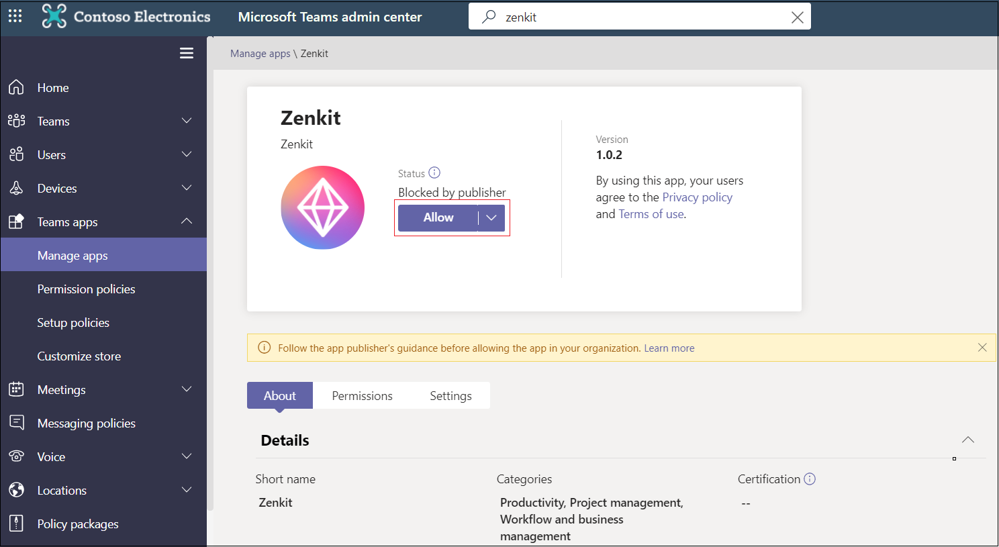

# アプリをTeamsする

## アプリMicrosoft Teamsカスタマイズを有効にする

顧客が管理センターでアプリのMicrosoft TeamsをカスタマイズTeamsできます。 この機能は、アプリ ストアに発行されたアプリTeamsされます。 組織用に公開されたサイドロードされたアプリとアプリはカスタマイズできません。

この機能のいくつかの考えられる例は次のとおりです。

* アプリのアクセントカラーを組織のブランドに合わせて変更する。
* Contoso から Contoso *エージェント**にアプリ* 名を更新すると、組織のユーザーに表示される名前が表示されます。 (注: チャットまたはチャネルにコネクタを追加するユーザーには、元のアプリ名 Contoso .) が引き続き *表示* されます。

開発者ポータルでこの機能を有効に[Teams。](https://dev.teams.microsoft.com/home) これにより、アプリ マニフェストの `configurableProperties` 1.10 より前のバージョンTeams構成されます。

### アプリのテスト

開発中にこの機能をテストできない。 組織のアプリ カタログにサイドローディングまたは発行を行う場合、アプリのカスタマイズはサポートされません。

### ユーザーの考慮事項

アプリをカスタマイズするユーザー (特Teams管理者) にガイドラインを提供します。 詳細については、「アプリのカスタマイズ[」を参照Teams。](/MicrosoftTeams/customize-apps)

## 管理者がTeamsするまでアプリを非表示にする

アプリエクスペリエンスTeams強化するには、管理者がアプリの表示を解除するまで、既定でユーザーからアプリを非表示にできます。 たとえば、Contoso Electronics は、ユーザー向けヘルプ デスク アプリを作成Teams。 アプリの適切な機能を有効にするために、Contoso Electronics では、顧客が最初にアプリの特定のプロパティを設定する必要があります。 アプリは既定で非表示にされ、管理者が許可した後にのみユーザーが利用できます。

アプリを非表示にする場合は、アプリ マニフェスト ファイルでプロパティをに `defaultBlockUntilAdminAction` 設定します `true` 。 プロパティがに設定されている場合は、Teams管理センター>アプリの管理、発行者によるブロックがアプリの状態 `true` に表示 **されます**。

管理者は、ユーザーがアプリにアクセスする前にアクションを実行する要求を取得します。 [ **アプリの管理]** で、管理者は [許可] を **選択して、** 発行元の状態でブロック **されたアプリを許可** できます。

既定では、アプリを非表示にしない場合は、プロパティをに `defaultBlockUntilAdminAction` 更新できます `false` 。 新しいバージョンのアプリが承認されると、管理者が明示的なアクションを実行しない限り、アプリは既定で許可されます。

> [!NOTE]
> `defaultBlockUntilAdminAction` LOB アプリではサポートされていません。 このプロパティを使用して LOB アプリをアップロードすると、アプリはブロックされません。

## 関連項目

* [アプリの manifesh スキーマ](/MicrosoftTeams/manifest-schema)
* [管理センターでアプリTeamsカスタマイズする](/MicrosoftTeams/customize-apps)

