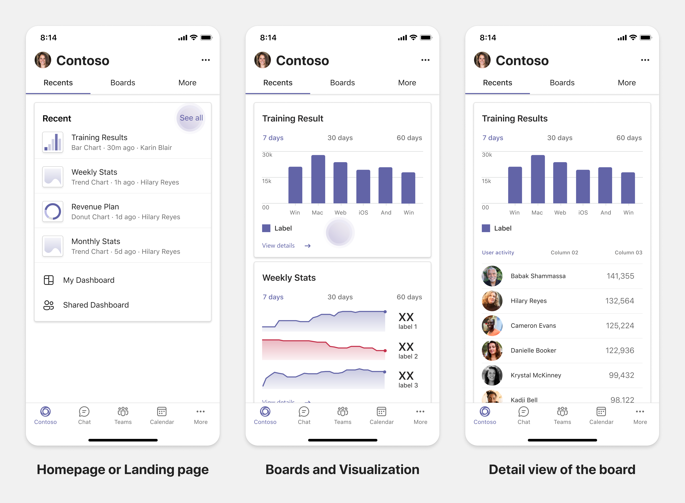
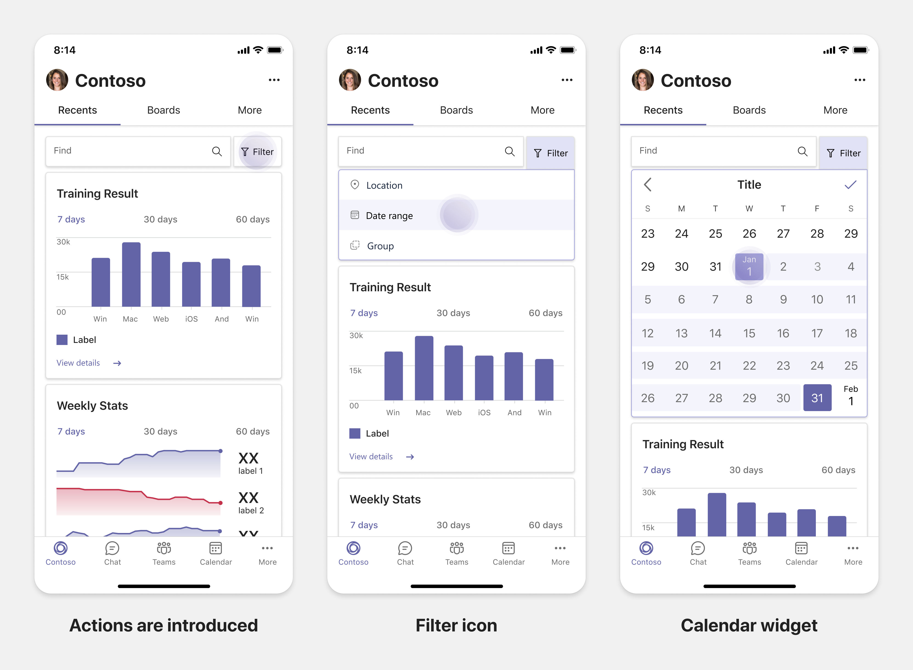

# Teams モバイルの応答タブを計画する

 Teamsプラットフォームは、モバイルとデスクトップでアプリを構築する機会を提供します。 アプリユーザーは、デスクトップまたはモバイルのどちらか、または両方を好む場合があります。 ユーザーはデスクトップでデータを準備できますが、モバイルを使用してより多くのデータを使用して共有できます。 アプリを構築する鍵は、ユーザーのニーズを理解し、満たします。 ボット、メッセージング拡張機能、コネクタなど、デスクトップとモバイルでシームレスに動作する機能があります。 ただし、タブとタスク モジュールを構築するには、モバイルで Web エクスペリエンスをホストするTeams必要があります。 モバイルでレスポンシブ Web ページを計画するドキュメント ガイドTeamsです。

## アプリのスコープを特定する

次の一覧は、モバイル向けアプリの構築を計画するTeamsします。

* アプリのデバイス間機能をTeamsします。 たとえば、デスクトップ上にパフォーマンスの良いアプリがある場合は、モバイルで同様のアプリを構築する方法を確認できます。 最初は、モバイルでデスクトップ エクスペリエンス全体を移行することは困難な場合があります。 基本的なシナリオから始め、一般的なシナリオを開始できます。 より多くのインサイトとユーザー フィードバックを収集した後に、機能と機能を追加します。

* モバイルで適切なユーザー ペルサをターゲットにしてください。 たとえば、エンド ユーザーにサービスを提供するアプリを構築し、開発者やシニア マネージャーにデータ アクセスを提供する場合、エンド ユーザーは、Teams モバイルでのアプリの構築を開始する間にアプリを使用できます。 ただし、デスクトップ アプリで持っているすべてのペルサに対応することもできますが、画面エクスペリエンスを小さくするために、より大きなベースと可能な早期導入者を持つペルサから始めるのをお勧めします。 例に示す通り、エンド ユーザーは適切なユーザー ペルサです。 モバイルで他のユーザーペルサをサポートする機能を徐々Teamsできます。 

## アプリを構築するためのさまざまなステージを理解する

アプリのスコープを特定した後、次の 3 つの段階を理解して、モバイルでアプリを計画し、ユーザー エクスペリエンスTeams強化します。

1. **消費**

   モバイルでアプリを表示する。 モバイルでアプリを構築するには、消費エクスペリエンスから始める必要があります。 モバイルの世界では、コンテンツのスクロールが一般的に行われたので、関連する情報を表示できます。 通知などのエンゲージメント メカニズムを使用して、更新プログラムを通知します。

2. **クイック アクション**

   モバイルでアプリを使用する。 ユーザーがモバイルでコンテンツの使用を開始した後、デスクトップ アプリからいくつかのアクションを移行することで、アプリを次のレベルに拡大縮小できます。 モバイル用に新しいアクションを最適化して構築できます。

3. **有効化**

   モバイルに参加する完全なアプリ エクスペリエンスを提供します。 ユーザーがアプリに取り組む場合は、デスクトップ エクスペリエンスよりも優れた、モバイルでの完全なイマーシブ エクスペリエンスを提供します。 ユーザーに優れたエクスペリエンスを提供するには、すべての使用例をモバイルで応答させる必要があります。

> [!TIP]
> 設計ガイドラインの情報については、「アプリの設計プロセス」[を参照Teamsしてください](design-teams-app-process.md)。

## 使用例

次の使用例を参照して、モバイル用にさまざまな種類のアプリを計画する方法Teamsします。

 

<b>ダッシュボードとデータ可視化アプリ</b>

モバイル プラットフォームでダッシュボードとデータ可視化アプリの応答性の高いタブを計画するTeams理解できます。

**消費**

最初の段階では、データを表示するために、最も基本的な消費エクスペリエンスを実装できます。 ドメイン内の任意のアプリの目的は、データを視覚化の形式で表示することです。 アプリでは、最近表示された視覚エフェクトをデスクトップに表示したり、ユーザーに対して承認されたグラフの一覧を表示できます。 デスクトップでダッシュボードを作成した後、ユーザーはモバイルを使用して情報にアクセスできます。 ユーザーが選択したグラフの詳細なビューを、タブまたはタスク モジュールを使用して展開ビューとして表示できます。

次の情報を表示できます。 

* ダッシュボードと概要
* データ ビジュアル、マップ、およびインフォグラフィック
* グラフ、グラフ、およびテーブル 

**クイック アクション**

2 番目の段階では、ユーザーはデスクトップ エクスペリエンスから既存のグラフとビジュアルを作業できます。 次のアクションを導入できます。

* 検索コンテンツ
* データをフィルター処理する
* ブックマークを作成する

**有効化**

第 3 段階では、グラフやグラフィックスなどのコンテンツを最初から作成できます。 モバイル向けアプリのすべての機能を導入してください。 たとえば、タスク モジュールを使用して、詳細ビューを使用して特定のデータ アイテムにアクセスできます。

ユーザーに対して次のアクセス権を提供できます。
* タイトルと説明を変更する
* データ アイテムを挿入して視覚エフェクトを作成する
* チャネルまたはグループ チャットで視覚化を共有する

 

 

<b>タスクの搭乗アプリ</b>

モバイル プラットフォームでタスク搭乗アプリの応答性の高いタブを計画するTeams理解できます。

**消費**

最初の段階では、アプリはタスクの一覧を垂直スタックでユーザーに表示できます。 Proposed、Active、Closed などの複数のカテゴリのタスクがある場合は、グループ化されたタスクを表示したり、グループ化されたタスクを表示するヘッダーとしてフィルターを提供します。 

**クイック アクション**

第 2 段階では、ユーザーに対して次のアプリ アクセス権を提供できます。
* 必須フィールドを使用してタスクまたはアイテムを作成して、ユーザーの認知負荷を軽減する
* ボードの種類またはビューを変更する
* ビューを展開してタスクを確認する
* タスク モジュールを使用して詳細ビューを表示する
* タスクを別のカテゴリに移動する 
* 電子メールとアクティビティ フィードを通じてチャットやチャネルで関連するタスクを共有する

**有効化**

3 番目のステージでは、次のアクティビティでユーザーのエクスペリエンスを有効にできます。
* 新しいプロジェクトとボードを追加する
* **Proposed、Active、Closed** など、さまざまなカテゴリを追加および **変更する**
* コメント、添付ファイル、その他の複雑な機能のタスクを構成する

 

 

<b>共同編集アプリとホワイトボード アプリ</b>

モバイル プラットフォームで共同編集アプリとホワイトボード アプリの応答性の高いタブを計画するTeamsできます。

**消費**

最初の段階では、デスクトップ エクスペリエンスを考慮して、アプリ内のコンテンツとアセットを表示できます。  次の関数を表示できます。

* コメントまたはフィードバック
* 拡大または縮小
* 保留中のドキュメントの現在のステージまたは進行状況

**クイック アクション**

2 番目のステージでは、次のアクションを導入できます。

* コラボレーション用の新しいボードまたは署名用の新しいドキュメントを作成する
* 内部およびゲストとボードを共有する
* 管理者のアクセス許可を構成する

> [!TIP]
> 小さな画面に簡単に表示できるアクションを公開します。

**有効化**

第 3 段階では、ユーザーに完全なエクスペリエンスを提供します。 次のアクティビティでユーザーエクスペリエンスを有効にできます。

* テキスト、図形、クイック メモの追加
* コンテンツを移動する
* レイヤーとフィルターの追加
* 削除、元に戻す、やり直す操作
* JS SDK API を使用してカメラとマイクにアクセスします。 デバイス機能の詳細については、「デバイス機能 [の概要」を参照してください](../device-capabilities/device-capabilities-overview.md)。

 

## 関連項目

次の設計と検証のガイドラインは、アプリの範囲に応じて役立ちます。

* [タブの設計](../../tabs/design/tabs.md)
* [ボットをデザインする](../../bots/design/bots.md)
* [タスク モジュールをデザインする](../..//task-modules-and-cards/task-modules/design-teams-task-modules.md)
* [ガイドラインの検証](../deploy-and-publish/appsource/prepare/teams-store-validation-guidelines.md)
