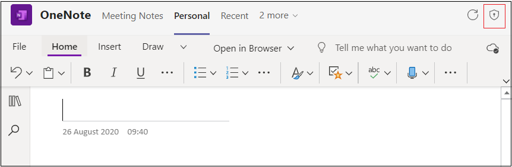

# ブラウザーのデバイスのアクセス許可

カメラやマイクへのアクセスなど、デバイスのアクセス許可を必要とするアプリTeams、ユーザーは Web ブラウザーでアプリ単位で手動でアクセス許可を付与する必要があります。 以前は、ブラウザーがアクセス許可を付与する方法を処理していましたが、これらのアクセス許可は Microsoft Teams で処理されるようになりました。 これは、アプリケーションの設計方法と、ブラウザーでこれらのアクセス許可が必要かどうかに影響します。

## アプリのデバイスのアクセス許可を有効にする

Teams アプリが [アプリケーション マニフェスト](native-device-permissions.md#specify-permissions)でデバイスのアクセス許可が必要であると宣言している場合、ユーザーがアプリのデバイスのアクセス許可を有効にするための **[アプリのアクセス許可]** オプションが表示されます。 **[アプリのアクセス許可]** オプションは、次の機能で使用できます。

* **個人用アプリとタスク モジュールのダイアログ**: **[アプリのアクセス許可]** オプションは、ページの右上隅にあります。

* **チャット、チャネル、または会議のタブ**: **[アプリのアクセス許可]**] オプションは、タブのドロップダウンで使用できます。 ![[アプリのアクセス許可] ドロップダウン](../../assets/images/tabs/drop-downapppermissions.png)

**[アプリのアクセス許可]** オプションを選択すると、ユーザーがアクセス許可ボタンを有効にできるポップアップが表示されます。

これらのアクセス許可を有効にするには、ユーザーがブラウザーでこれらのアクセス許可を有効にする必要があります。 ユーザーがブラウザーでアプリのデバイスのアクセス許可を変更すると、Teams でアプリケーションを再読み込みするように求められます。

> [!IMPORTANT]
> Teamsでこれらの **アプリのアクセス許可** を有効にする場所をユーザーに認識させる必要があります。

## 推奨事項

ブラウザーでデバイスのアクセス許可を必要とするアプリTeams、Teams UI でこれらのアクセス許可を検索して有効にする場所についてユーザーに指示を表示する必要があります。 アプリケーションが実行されているコンテキストに応じて、これらのアクセス許可にアクセスするための正しい場所をユーザーに指示する手順を確認する必要があります。 アクセス許可は、個人用アプリ、タスク モジュール ダイアログ、チャット内のタブ、チャネルまたは会議では異なります。

 

## コード サンプル

|サンプルの名前 | 説明 | Node.js |
|----------------|-----------------|--------------|
| ブラウザーのタブ デバイスのアクセス許可 | サンプル コードは、ブラウザのデバイス権限を表示する方法を示しています。 | [表示](https://github.com/OfficeDev/Microsoft-Teams-Samples/tree/main/samples/tab-device-permissions/nodejs) |

## ステップ バイ ステップのガイド

ステップ [バイ ステップ ガイドに](../../sbs-tab-device-permissions.yml)従って、Teamsでタブ デバイスのアクセス許可を付与します。

## 関連項目

* [デバイス機能の概要](device-capabilities-overview.md)
* [デバイスのアクセス許可を要求する](native-device-permissions.md)
