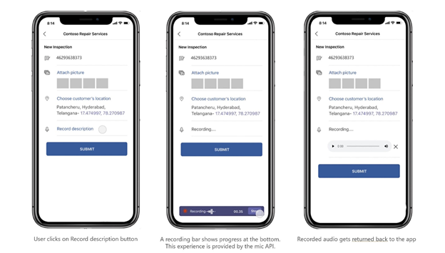

# <a name="integrate-media-capabilities"></a>メディア機能を統合する 

カメラやマイクなどのネイティブ デバイス機能を、アプリに統合Teamsできます。 統合のために、アプリがユーザー Microsoft Teamsアクセスするために必要なツールを提供する[JavaScript](/javascript/api/overview/msteams-client?view=msteams-client-js-latest&preserve-view=true)クライアント SDK を[使用できます](native-device-permissions.md)。 適切なメディア機能 API を使用して、カメラやマイクなどのデバイス機能を Microsoft Teams モバイル アプリ内の Teams プラットフォームに統合し、より豊富なエクスペリエンスを構築します。 

## <a name="advantage-of-integrating-media-capabilities"></a>メディア機能を統合する利点

Teams アプリにデバイス機能を統合する主な利点は、ネイティブ Teams コントロールを活用して、ユーザーに豊富で没入感のあるエクスペリエンスを提供する方法です。
メディア機能を統合するには、アプリ マニフェスト ファイルを更新し、メディア機能 API を呼び出す必要があります。 

効果的な統合を行う場合は、それぞれの[](#code-snippets)API を呼び出すコード スニペットについて理解している必要があります。ネイティブ メディア機能を使用できます。

API 応答エラーを理解して、アプリ[](#error-handling)内のエラーを処理することがTeamsです。

> [!NOTE] 
> * 現在、Microsoft Teams機能のサポートはモバイル クライアントでのみ利用できます。   
> * 現在、Teamsは、マルチウィンドウ アプリ、タブ、および会議のサイド パネルに対するデバイスのアクセス許可をサポートしていない。   
> * ブラウザーでは、デバイスのアクセス許可が異なります。 詳細については、「ブラウザー デバイス [のアクセス許可」を参照してください](browser-device-permissions.md)。 

## <a name="update-manifest"></a>マニフェストの更新

プロパティをTeams指定して、[アプリ manifest.json](../../resources/schema/manifest-schema.md#devicepermissions)ファイル `devicePermissions` を更新します `media` 。 これにより、ユーザーがカメラを使用して画像をキャプチャし始める前、ギャラリーを開いて添付ファイルとして送信する画像を選択するか、マイクを使用して会話を録音する前に、ユーザーに必要なアクセス許可を求めできます。 アプリ マニフェストの更新プログラムは次のとおりです。

``` json
"devicePermissions": [
    "media",
],
```

> [!NOTE]
> 要求 **のアクセス許可のプロンプト** は、関連する API が開始されるとTeams表示されます。 詳細については、「デバイスのアクセス許可 [を要求する」を参照してください](native-device-permissions.md)。

## <a name="media-capability-apis"></a>メディア機能 API

[selectMedia、getMedia、](/javascript/api/@microsoft/teams-js/microsoftteams.media.mediachunk?view=msteams-client-js-latest&preserve-view=true)[](/javascript/api/@microsoft/teams-js/microsoftteams.media.media?view=msteams-client-js-latest&preserve-view=true)および[viewImages](/javascript/api/@microsoft/teams-js/microsoftteams.media.imageuri?view=msteams-client-js-latest&preserve-view=true) API を使用すると、ネイティブ メディア機能を次のように使用できます。

* ネイティブ マイクを **使用して** 、ユーザーがデバイス **からオーディオ** (10 分の会話を録音) を録音できます。
* ネイティブ カメラ コントロール **を使用** して、ユーザーが移動 **中に** 画像をキャプチャして添付できます。
* ネイティブ ギャラリー **のサポートを使用** して、ユーザーが添付ファイル **としてデバイス イメージを選択** できます。
* ネイティブ イメージ **ビューアー コントロールを使用して、****一度に複数の画像** をプレビューします。
* SDK **ブリッジを介した** 大規模なイメージ転送 (1 MB から 50 MB) をサポートします。
* 高度 **な画像機能をサポートすると** 、ユーザーは次の画像をプレビューおよび編集できます。
  * カメラを介してドキュメント、ホワイトボード、名刺をスキャンします。
  
> [!IMPORTANT]
> * タスク モジュール、タブ、個人用アプリなど、Teams、API を複数のサーフェス `selectMedia` `getMedia` `viewImages` から呼び出すことができます。 詳細については、「アプリの[エントリ ポイント」をTeamsしてください](../extensibility-points.md)。
> * `selectMedia` マイクとオーディオのプロパティをサポートするために API が拡張されました。

デバイスのメディア機能を有効にするには、次の API セットを使用する必要があります。

| API      | 説明   |
| --- | --- |
| [**selectMedia**](/javascript/api/@microsoft/teams-js/microsoftteams.media.media?view=msteams-client-js-latest&preserve-view=true) (**Camera)**| この API を使用すると、 **ユーザーはデバイス** カメラからメディアをキャプチャまたは選択し、Web アプリに戻します。 ユーザーは、申請前に画像を編集、トリミング、回転、注釈、または描画できます。 に応答して、Web アプリは、選択した画像のメディアの ID と、選択したメディアのサムネイル `selectMedia` を受信します。 この API は [、ImageProps 構成を使用してさらに構成](/javascript/api/@microsoft/teams-js/microsoftteams.media.imageprops?view=msteams-client-js-latest&preserve-view=true) できます。 |
| [**selectMedia**](/javascript/api/@microsoft/teams-js/microsoftteams.media.media?view=msteams-client-js-latest&preserve-view=true) (**マイク**)| マイク機能 [にアクセスするために](/javascript/api/@microsoft/teams-js/microsoftteams.media.mediatype?view=msteams-client-js-latest&preserve-view=true) `4` `selectMedia` 、mediaType を API で設定します。 また、この API を使用すると、ユーザーはデバイスのマイクからオーディオを録音し、記録されたクリップを Web アプリに戻す機能も使用できます。 ユーザーは、申請前に録音プレビューを一時停止、再録音、再生できます。  **selectMedia に応答して**、Web アプリは選択したオーディオ録音のメディアの ID を受信します。 <br/> 会話 `maxDuration` を記録するために時間を分単位で構成する必要がある場合は、使用します。 現在の記録時間は 10 分で、その後、記録は終了します。  |
| [**getMedia**](/javascript/api/@microsoft/teams-js/microsoftteams.media.mediachunk?view=msteams-client-js-latest&preserve-view=true)| この API は、メディア サイズに関係なく、API によってキャプチャされたメディアをチャンク `selectMedia` 単位で取得します。 これらのチャンクはアセンブルされ、ファイルまたは BLOB として Web アプリに返されます。 メディアを小さなチャンクに分割すると、大きなファイル転送が容易です。 |
| [**viewImages**](/javascript/api/@microsoft/teams-js/microsoftteams.media.imageuri?view=msteams-client-js-latest&preserve-view=true)| この API を使用すると、ユーザーはスクロール可能なリストとしてフルスクリーン モードで画像を表示できます。|

次の図は、イメージ機能用の API の `selectMedia` Web アプリ エクスペリエンスを示しています。


次の図は、マイク機能用の API の `selectMedia` Web アプリ エクスペリエンスを示しています。



## <a name="error-handling"></a>エラー処理

これらのエラーは、アプリで適切に処理Teamsがあります。 次の表に、エラー コードとエラーが生成される条件を示します。 

|エラー コード |  エラー名     | 条件|
| --------- | --------------- | -------- |
| **100** | NOT_SUPPORTED_ON_PLATFORM | API は現在のプラットフォームではサポートされていません。|
| **404** | FILE_NOT_FOUND | 指定されたファイルが指定された場所に見つかりません。|
| **500** | INTERNAL_ERROR | 必要な操作の実行中に内部エラーが発生します。|
| **1000** | PERMISSION_DENIED |アクセス許可は、ユーザーによって拒否されます。|
| **3000** | NO_HW_SUPPORT | 基になるハードウェアでは、この機能はサポートされていません。|
| **4000**| INVALID_ARGUMENTS | いくつかの引数は無効です。|
|  **8000** | USER_ABORT |ユーザーは操作を中止します。|
| **9000**| OLD_PLATFORM | プラットフォーム コードは古く、この API は実装されません。|
| **10000**| SIZE_EXCEEDED |  戻り値が大きすぎて、プラットフォーム サイズの境界を超えました。|

## <a name="code-snippets"></a>コード スニペット

**通話 `selectMedia` カメラを** 使用して画像をキャプチャするための API:

```javascript
let imageProp: microsoftTeams.media.ImageProps = {
    sources: [microsoftTeams.media.Source.Camera, microsoftTeams.media.Source.Gallery],
    startMode: microsoftTeams.media.CameraStartMode.Photo,
    ink: false,
    cameraSwitcher: false,
    textSticker: false,
    enableFilter: true,
};
let mediaInput: microsoftTeams.media.MediaInputs = {
    mediaType: microsoftTeams.media.MediaType.Image,
    maxMediaCount: 10,
    imageProps: imageProp
};
microsoftTeams.media.selectMedia(mediaInput, (error: microsoftTeams.SdkError, attachments: microsoftTeams.media.Media[]) => {
    if (error) {
        if (error.message) {
            alert(" ErrorCode: " + error.errorCode + error.message);
        } else {
            alert(" ErrorCode: " + error.errorCode);
        }
    }
    if (attachments) {
        let y = attachments[0];
        img.src = ("data:" + y.mimeType + ";base64," + y.preview);
    }
});
```

**通話 `getMedia` 大きな** メディアをチャンクで取得する API:

```javascript
let media: microsoftTeams.media.Media = attachments[0]
media.getMedia((error: microsoftTeams.SdkError, blob: Blob) => {
    if (blob) {
        if (blob.type.includes("image")) {
            img.src = (URL.createObjectURL(blob));
        }
    }
    if (error) {
        if (error.message) {
            alert(" ErrorCode: " + error.errorCode + error.message);
        } else {
            alert(" ErrorCode: " + error.errorCode);
        }
    }
});
```

**通話 `viewImages` API によって返される `selectMedia` ID** による API:

```javascript
// View images by id:
// Assumption: attachmentArray = select Media API Output
let uriList = [];
if (attachmentArray && attachmentArray.length > 0) {
    for (let i = 0; i < attachmentArray.length; i++) {
        let file = attachmentArray[i];
        if (file.mimeType.includes("image")) {
            let imageUri = {
                value: file.content,
                type: 1,
            }
            uriList.push(imageUri);
        } else {
            alert("File type is not image");
        }
    }
}
if (uriList.length > 0) {
    microsoftTeams.media.viewImages(uriList, (error: microsoftTeams.SdkError) => {
        if (error) {
            if (error.message) {
                output(" ErrorCode: " + error.errorCode + error.message);
            } else {
                output(" ErrorCode: " + error.errorCode);
            }
        }
    });
} else {
    output("Url list is empty");
}
```

**通話 `viewImages` URL による API**:

```javascript
// View Images by URL:
// Assumption 2 urls, url1 and url2
let uriList = [];
if (URL1 != null && URL1.length > 0) {
    let imageUri = {
        value: URL1,
        type: 2,
    }
    uriList.push(imageUri);
}
if (URL2 != null && URL2.length > 0) {
    let imageUri = {
        value: URL2,
        type: 2,
    }
    uriList.push(imageUri);
}
if (uriList.length > 0) {
    microsoftTeams.media.viewImages(uriList, (error: microsoftTeams.SdkError) => {
        if (error) {
            if (error.message) {
                output(" ErrorCode: " + error.errorCode + error.message);
            } else {
                output(" ErrorCode: " + error.errorCode);
            }
        }
    });
} else {
    output("Url list is empty");
}
```

**マイク `selectMedia` を介 `getMedia` してオーディオを録音する呼び出しと API:**

```javascript
let mediaInput: microsoftTeams.media.MediaInputs = {
    mediaType: microsoftTeams.media.MediaType.Audio,
    maxMediaCount: 1,
};
microsoftTeams.media.selectMedia(mediaInput, (error: microsoftTeams.SdkError, attachments: microsoftTeams.media.Media[]) => {
    if (error) {
        if (error.message) {
            alert(" ErrorCode: " + error.errorCode + error.message);
        } else {
            alert(" ErrorCode: " + error.errorCode);
        }
    }
    // If you want to directly use the audio file (for smaller file sizes (~4MB))    if (attachments) {
    let audioResult = attachments[0];
    var videoElement = document.createElement("video");
    videoElement.setAttribute("src", ("data:" + y.mimeType + ";base64," + y.preview));
    //To use the audio file via get Media API for bigger audio file sizes greater than 4MB        audioResult.getMedia((error: microsoftTeams.SdkError, blob: Blob) => {
    if (blob) {
        if (blob.type.includes("video")) {
            videoElement.setAttribute("src", URL.createObjectURL(blob));
        }
    }
    if (error) {
        if (error.message) {
            alert(" ErrorCode: " + error.errorCode + error.message);
        } else {
            alert(" ErrorCode: " + error.errorCode);
        }
    }
});
```

## <a name="see-also"></a>関連項目

* [QR スキャナーまたはバーコード スキャナー機能をアプリに統合Teams](qr-barcode-scanner-capability.md)
* [場所の機能を統合Teams](location-capability.md)
* [[ユーザー選択] を [ユーザー選択] Teams](people-picker-capability.md)

