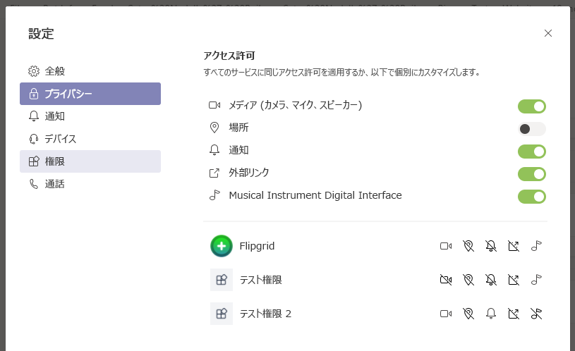

# <a name="request-device-permissions-for-your-microsoft-teams-tab"></a><span data-ttu-id="4676d-104">Microsoft Teams タブのデバイスへのアクセス許可を要求する</span><span class="sxs-lookup"><span data-stu-id="4676d-104">Request device permissions for your Microsoft Teams tab</span></span>

<span data-ttu-id="4676d-105">次のような、ネイティブデバイスへのアクセスを必要とする機能を使用して、タブを充実させることができます。</span><span class="sxs-lookup"><span data-stu-id="4676d-105">You might want to enrich your tab with features that require access native device functionality like:</span></span>

> [!div class="checklist"]
>
> * <span data-ttu-id="4676d-106">デジタル</span><span class="sxs-lookup"><span data-stu-id="4676d-106">Camera</span></span>
> * <span data-ttu-id="4676d-107">マイク</span><span class="sxs-lookup"><span data-stu-id="4676d-107">Microphone</span></span>
> * <span data-ttu-id="4676d-108">Location</span><span class="sxs-lookup"><span data-stu-id="4676d-108">Location</span></span>
> * <span data-ttu-id="4676d-109">通知</span><span class="sxs-lookup"><span data-stu-id="4676d-109">Notifications</span></span>

> [!IMPORTANT]
>
> * <span data-ttu-id="4676d-110">現時点では、Teams モバイルクライアント `camera` `location`  はネイティブデバイス機能のみをサポートしており、タブを含むすべてのアプリ構成要素で利用できます。</span><span class="sxs-lookup"><span data-stu-id="4676d-110">Currently, Teams mobile client only supports `camera` and `location`  through native device capabilities and is available on all app constructs including tabs.</span></span> </br>
> * <span data-ttu-id="4676d-111">`camera`画像キャプチャのサポートは、 [**captureImage API**](/javascript/api/@microsoft/teams-js/microsoftteams?view=msteams-client-js-latest#captureimage--error--sdkerror--files--file-------void-&preserve-view=true)によって有効になります。</span><span class="sxs-lookup"><span data-stu-id="4676d-111">Support for `camera` image capture is enabled by the [**captureImage API**](/javascript/api/@microsoft/teams-js/microsoftteams?view=msteams-client-js-latest#captureimage--error--sdkerror--files--file-------void-&preserve-view=true).</span></span>
> * <span data-ttu-id="4676d-112">現時点では、すべてのデスクトップクライアントで、 [**地理位置情報 API**](../../resources/schema/manifest-schema.md#devicepermissions) は完全にはサポートされていません。</span><span class="sxs-lookup"><span data-stu-id="4676d-112">The [**geolocation API**](../../resources/schema/manifest-schema.md#devicepermissions) is currently not fully supported on all desktop clients.</span></span>

## <a name="device-permissions"></a><span data-ttu-id="4676d-113">デバイス アクセス許可</span><span class="sxs-lookup"><span data-stu-id="4676d-113">Device permissions</span></span>

<span data-ttu-id="4676d-114">ユーザーのデバイスのアクセス許可にアクセスすると、次のように、より高度なエクスペリエンスを構築できます。</span><span class="sxs-lookup"><span data-stu-id="4676d-114">Accessing a user’s device permissions allows you to build much richer experiences, for example:</span></span>

* <span data-ttu-id="4676d-115">短いビデオを録音および共有する</span><span class="sxs-lookup"><span data-stu-id="4676d-115">Record and share short videos</span></span>
* <span data-ttu-id="4676d-116">短い音声メモを録音し、後で保存する</span><span class="sxs-lookup"><span data-stu-id="4676d-116">Record short audio memos and save them for later</span></span>
* <span data-ttu-id="4676d-117">ユーザーの場所情報を使用して関連情報を表示する</span><span class="sxs-lookup"><span data-stu-id="4676d-117">Use user location information to display relevant information</span></span>

<span data-ttu-id="4676d-118">これらの機能へのアクセスは、ほとんどのモダン web ブラウザーで標準になっていますが、アプリマニフェストを更新することによって、使用する機能を Teams に知らせる必要があります。</span><span class="sxs-lookup"><span data-stu-id="4676d-118">While access to these features are standard in most modern web browsers, you need to let Teams know which features you’d like to use by updating your app manifest.</span></span> <span data-ttu-id="4676d-119">これにより、アプリが Teams デスクトップクライアント上で実行されているときに、ブラウザーと同じ方法でアクセス許可を要求することができます。</span><span class="sxs-lookup"><span data-stu-id="4676d-119">This will allow you to ask for permissions, the same way you would in a browser, while your app is running on the Teams desktop client.</span></span>

## <a name="manage-permissions"></a><span data-ttu-id="4676d-120">権限の管理</span><span class="sxs-lookup"><span data-stu-id="4676d-120">Manage permissions</span></span>

# <a name="desktop"></a>[<span data-ttu-id="4676d-121">デスクトップ</span><span class="sxs-lookup"><span data-stu-id="4676d-121">Desktop</span></span>](#tab/desktop)

1. <span data-ttu-id="4676d-122">Teams を開きます。</span><span class="sxs-lookup"><span data-stu-id="4676d-122">Open Teams.</span></span>
1. <span data-ttu-id="4676d-123">ウィンドウの右上隅で、プロファイルアイコンを選択します。</span><span class="sxs-lookup"><span data-stu-id="4676d-123">In the upper right corner of the window, select your profile icon.</span></span>
1. <span data-ttu-id="4676d-124">**Settings**  ->  ドロップダウンメニューから [設定]**アクセス許可** を選択します。</span><span class="sxs-lookup"><span data-stu-id="4676d-124">Select **Settings** -> **Permissions** from the drop-down menu.</span></span>
1. <span data-ttu-id="4676d-125">目的の設定を選択します。</span><span class="sxs-lookup"><span data-stu-id="4676d-125">Choose your desired settings.</span></span>



# <a name="mobile"></a>[<span data-ttu-id="4676d-127">モバイル</span><span class="sxs-lookup"><span data-stu-id="4676d-127">Mobile</span></span>](#tab/mobile)

1. <span data-ttu-id="4676d-128">Teams を開きます。</span><span class="sxs-lookup"><span data-stu-id="4676d-128">Open Teams.</span></span>
1. <span data-ttu-id="4676d-129">画面の左上隅で、[&#9776;] メニューアイコンを選択します。</span><span class="sxs-lookup"><span data-stu-id="4676d-129">In the upper left corner of the screen, select the &#9776; menu icon.</span></span>
1. <span data-ttu-id="4676d-130">[**設定** デバイス] を選択し  ->  **Devices** ます。</span><span class="sxs-lookup"><span data-stu-id="4676d-130">Select **Settings** -> **Devices**.</span></span>
1. <span data-ttu-id="4676d-131">目的の設定を選択します。</span><span class="sxs-lookup"><span data-stu-id="4676d-131">Choose your desired settings.</span></span>


---

## <a name="properties"></a><span data-ttu-id="4676d-133">プロパティ</span><span class="sxs-lookup"><span data-stu-id="4676d-133">Properties</span></span>

<span data-ttu-id="4676d-134">`manifest.json` `devicePermissions` アプリケーションで使用する5つのプロパティを追加して指定することにより、アプリを更新します。</span><span class="sxs-lookup"><span data-stu-id="4676d-134">Update your app's `manifest.json` by adding `devicePermissions` and specifying which of the five properties you’d like to use in your application:</span></span>

``` json
"devicePermissions": [
    "media",
    "geolocation",
    "notifications",
    "midi",
    "openExternal"
],
```
> [!Note]
>
> <span data-ttu-id="4676d-135">メディアは、モバイルのカメラのアクセス許可にも使用されます。</span><span class="sxs-lookup"><span data-stu-id="4676d-135">Media is also used for camera permissions in mobile.</span></span>

<span data-ttu-id="4676d-136">各プロパティによって、ユーザーに同意を求めるように求めるメッセージを表示することができます。</span><span class="sxs-lookup"><span data-stu-id="4676d-136">Each property will allow you to prompt the user to ask for their consent</span></span>

| <span data-ttu-id="4676d-137">プロパティ</span><span class="sxs-lookup"><span data-stu-id="4676d-137">Property</span></span>      | <span data-ttu-id="4676d-138">説明</span><span class="sxs-lookup"><span data-stu-id="4676d-138">Description</span></span>   |
| --- | --- |
| <span data-ttu-id="4676d-139">media</span><span class="sxs-lookup"><span data-stu-id="4676d-139">media</span></span>         | <span data-ttu-id="4676d-140">カメラ、マイク、およびスピーカーを使用するためのアクセス許可</span><span class="sxs-lookup"><span data-stu-id="4676d-140">permission to use the camera, microphone and speakers</span></span> |
| <span data-ttu-id="4676d-141">地理位置情報</span><span class="sxs-lookup"><span data-stu-id="4676d-141">geolocation</span></span>   | <span data-ttu-id="4676d-142">ユーザーの場所を返すためのアクセス許可</span><span class="sxs-lookup"><span data-stu-id="4676d-142">permission to return the user's location</span></span>      |
| <span data-ttu-id="4676d-143">受け取る</span><span class="sxs-lookup"><span data-stu-id="4676d-143">notifications</span></span> | <span data-ttu-id="4676d-144">ユーザー通知を送信するためのアクセス許可</span><span class="sxs-lookup"><span data-stu-id="4676d-144">permission to send the user notifications</span></span>      |
| <span data-ttu-id="4676d-145">次回</span><span class="sxs-lookup"><span data-stu-id="4676d-145">midi</span></span>          | <span data-ttu-id="4676d-146">デジタル音楽機器から midi 情報を送受信するためのアクセス許可</span><span class="sxs-lookup"><span data-stu-id="4676d-146">permission to send and receive midi information from a digital musical instrument</span></span>   |
| <span data-ttu-id="4676d-147">openExternal</span><span class="sxs-lookup"><span data-stu-id="4676d-147">openExternal</span></span>  | <span data-ttu-id="4676d-148">外部アプリケーションでリンクを開くためのアクセス許可</span><span class="sxs-lookup"><span data-stu-id="4676d-148">permission to open links in external applications</span></span>  |

## <a name="checking-permissions-from-your-tab"></a><span data-ttu-id="4676d-149">タブから権限を確認する</span><span class="sxs-lookup"><span data-stu-id="4676d-149">Checking permissions from your tab</span></span>

<span data-ttu-id="4676d-150">アプリマニフェストに追加した後 `devicePermissions` は、メッセージを表示せずに、HTML5 の "permissions" API を使用してアクセス許可を確認できます。</span><span class="sxs-lookup"><span data-stu-id="4676d-150">Once you’ve added `devicePermissions` to your app manifest, you can check permissions using the HTML5 “permissions” API without causing a prompt.</span></span>

``` Javascript
// Different query options:
navigator.permissions.query({ name: 'camera' });
navigator.permissions.query({ name: 'microphone' });
navigator.permissions.query({ name: 'geolocation' });
navigator.permissions.query({ name: 'notifications' });
navigator.permissions.query({ name: 'midi', sysex: true });

// Example:
navigator.permissions.query({name:'geolocation'}).then(function(result) {
  if (result.state == 'granted') {
    // Access granted
  } else if (result.state == 'prompt') {
    // Access has not been granted
  }
});
```

## <a name="prompting-the-user"></a><span data-ttu-id="4676d-151">ユーザーに確認を求める</span><span class="sxs-lookup"><span data-stu-id="4676d-151">Prompting the user</span></span>

<span data-ttu-id="4676d-152">デバイスのアクセス許可にアクセスするための同意を得るためのプロンプトを表示するには、適切な HTML5 API または Teams API を利用する必要があります。</span><span class="sxs-lookup"><span data-stu-id="4676d-152">In order to show a prompt to get consent to access device permissions you need to leverage the appropriate HTML5 or Teams API.</span></span> <span data-ttu-id="4676d-153">たとえば、ユーザーにカメラへのアクセスを要求するために、を呼び出す必要があります。 `getCurrentPosition`</span><span class="sxs-lookup"><span data-stu-id="4676d-153">For example, in order to prompt the user to access their camera you need to call `getCurrentPosition`</span></span>

```Javascript
navigator.geolocation.getCurrentPosition(function (position) { /*... */ });
```

<span data-ttu-id="4676d-154">デスクトップまたは web でカメラを使用するために、Teams は、getUserMedia を呼び出すときにアクセス許可を求めるメッセージを表示します。</span><span class="sxs-lookup"><span data-stu-id="4676d-154">To use camera on desktop or web, Teams will show a permission prompt when you call getUserMedia</span></span>

```Javascript
navigator.mediaDevices.getUserMedia({ audio: true, video: true });
```

<span data-ttu-id="4676d-155">モバイルで画像をキャプチャするために、Teams mobile は captureImage () を呼び出したときにアクセス許可を要求します。</span><span class="sxs-lookup"><span data-stu-id="4676d-155">To capture image on mobile, Teams mobile will ask for permission when called captureImage()</span></span>

```Typescript
function captureImage(callback: (error: SdkError, files: File[]) => void)
```

<span data-ttu-id="4676d-156">を呼び出したときに通知が表示されます。 `requestPermission`</span><span class="sxs-lookup"><span data-stu-id="4676d-156">Notifications will prompt the user when you call `requestPermission`</span></span>

```Javascript
Notification.requestPermission(function(result) { /* ... */ });
```


## <a name="permission-behavior-across-login-sessions"></a><span data-ttu-id="4676d-158">ログインセッション間でのアクセス許可の動作</span><span class="sxs-lookup"><span data-stu-id="4676d-158">Permission behavior across login sessions</span></span>

<span data-ttu-id="4676d-159">ネイティブデバイスのアクセス許可は、ログインセッションごとに保存されます。</span><span class="sxs-lookup"><span data-stu-id="4676d-159">Native device permissions are stored per login session.</span></span> <span data-ttu-id="4676d-160">これは、別の Teams インスタンス (別のコンピューターでは、) にログインすると、以前のセッションからのデバイスのアクセス許可が使用できなくなることを意味します。</span><span class="sxs-lookup"><span data-stu-id="4676d-160">This means that if you log into another instance of Teams (ex: on another computer), your device permissions from your previous sessions will not be available.</span></span> <span data-ttu-id="4676d-161">代わりに、新しいログインセッションのデバイスアクセス許可への同意を再度受ける必要があります。</span><span class="sxs-lookup"><span data-stu-id="4676d-161">Instead, you will need to re-consent to device permissions for the new login session.</span></span> <span data-ttu-id="4676d-162">これはつまり、Teams からログアウトした場合 (または Teams 内でテナントを切り替える場合)、その前回のログインセッションでデバイスのアクセス許可が削除されることを意味します。</span><span class="sxs-lookup"><span data-stu-id="4676d-162">This also means, if you log out of Teams (or switch tenants inside of Teams), your device permissions will be deleted for that previous login session.</span></span> <span data-ttu-id="4676d-163">ネイティブデバイスのアクセス許可を開発する場合は、次の点に注意してください。同意するネイティブの機能は、 _現在_ のログインセッションにのみ使用されます。</span><span class="sxs-lookup"><span data-stu-id="4676d-163">Please keep this in mind when developing native device permissions: the native capabilities you consent to are only for your _current_ login session.</span></span>
