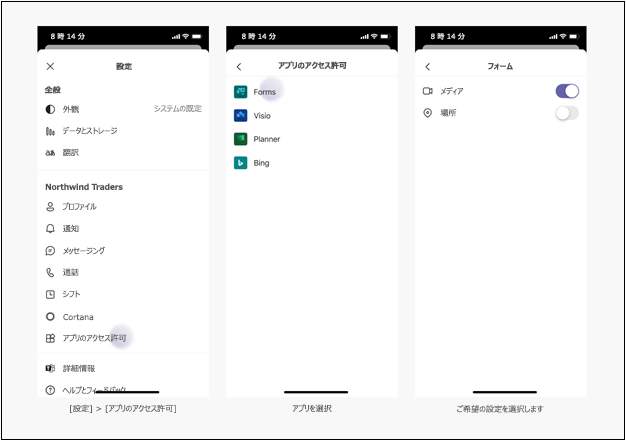

# <a name="request-device-permissions-for-your-microsoft-teams-tab"></a>Microsoft Teams タブのデバイスのアクセス許可を要求する

次のようなネイティブ デバイス機能へのアクセスが必要な機能をタブに追加することもできます。

> [!div class="checklist"]
>
> * カメラ
> * マイク
> * Location
> * 通知

[!Note] Microsoft Teams モバイル アプリにカメラと画像の機能を統合するには、Teams のカメラ機能と画像機能 [を参照してください。](../../concepts/device-capabilities/mobile-camera-image-permissions.md)

> [!IMPORTANT]
>
> * 現時点では、Teams モバイル クライアントは、ネイティブ デバイス機能を介したアクセスのみをサポートし、タブを含むすべてのアプリコンストラクト `camera` `gallery` `mic` `location` で利用できます。 </br>
> * selectMedia `camera` `gallery` API を通じて `mic` サポート [**され、有効になります**](/javascript/api/@microsoft/teams-js/media?view=msteams-client-js-latest#selectMedia_MediaInputs___error__SdkError__attachments__Media_______void_&preserve-view=true)。 単一のイメージ キャプチャでは [**、captureImage API を使用できます**](/javascript/api/@microsoft/teams-js/microsoftteams?view=msteams-client-js-latest#captureimage--error--sdkerror--files--file-------void-&preserve-view=true)。
> * `location`getLocation API を使用してサポート [**が有効になります**](/javascript/api/@microsoft/teams-js/location?view=msteams-client-js-latest#getLocation_LocationProps___error__SdkError__location__Location_____void_&preserve-view=true)。 位置情報 API は現在、すべてのデスクトップ クライアントで完全にはサポートされていないので、この [**API**](../../resources/schema/manifest-schema.md#devicepermissions) を使用してください。

## <a name="device-permissions"></a>デバイス アクセス許可

ユーザーのデバイスのアクセス許可にアクセスすると、次に示す、より豊富なエクスペリエンスを構築できます。

* 短いビデオを録画して共有する
* 短いオーディオ メモを録音し、後で保存する
* ユーザーの位置情報を使用して関連情報を表示する

これらの機能へのアクセスは、ほとんどの最新の Web ブラウザーでは標準ですが、アプリ マニフェストを更新して使用する機能を Teams に知らせる必要があります。 これにより、アプリが Teams デスクトップ クライアントで実行されている間に、ブラウザーで行うのと同じ方法でアクセス許可を要求できます。

## <a name="manage-permissions"></a>権限の管理

# <a name="desktop"></a>[デスクトップ](#tab/desktop)

1. Teams を開きます。
1. ウィンドウの右上隅で、プロファイル アイコンを選択します。
1. ドロップダウン **メニュー**  ->  **から [設定の** アクセス許可] を選択します。
1. 目的の設定を選択します。


# <a name="mobile"></a>[モバイル](#tab/mobile)

1. Teams を開きます。
1. [設定アプリ **の**  ->  **アクセス許可] に移動します**。
1. 設定を選択する必要があるアプリを選択します。
1. 目的の設定を選択します。



---

## <a name="properties"></a>プロパティ

アプリケーションで使用する 5 つのプロパティを追加して指定することで、アプリを `manifest.json` `devicePermissions` 更新します。

``` json
"devicePermissions": [
    "media",
    "geolocation",
    "notifications",
    "midi",
    "openExternal"
],
```
> [!Note]
>
> メディアは、モバイルでのカメラのアクセス許可にも使用されます。

各プロパティを使用すると、ユーザーに同意を求めるメッセージを表示できます。

| プロパティ      | 説明   |
| --- | --- |
| media         | カメラ、マイク、スピーカー、およびメディア ギャラリーにアクセスするためのアクセス許可 |
| geolocation   | ユーザーの位置情報を返すアクセス許可      |
| notifications | ユーザー通知を送信するアクセス許可      |
| midi          | デジタル 音楽インストルメントの MIDI 情報を送受信するためのアクセス許可   |
| openExternal  | 外部アプリケーションでリンクを開くアクセス許可  |

## <a name="checking-permissions-from-your-tab"></a>タブからアクセス許可を確認する

アプリ マニフェストに追加したら、プロンプトを表示せずに HTML5 "アクセス許可" API を使用してアクセス許可 `devicePermissions` を確認できます。

``` Javascript
// Different query options:
navigator.permissions.query({ name: 'camera' });
navigator.permissions.query({ name: 'microphone' });
navigator.permissions.query({ name: 'geolocation' });
navigator.permissions.query({ name: 'notifications' });
navigator.permissions.query({ name: 'midi', sysex: true });

// Example:
navigator.permissions.query({name:'geolocation'}).then(function(result) {
  if (result.state == 'granted') {
    // Access granted
  } else if (result.state == 'prompt') {
    // Access has not been granted
  }
});
```

## <a name="prompting-the-user"></a>ユーザーに確認を求める

デバイスのアクセス許可にアクセスする同意を求めるプロンプトを表示するには、適切な HTML5 または Teams API を利用する必要があります。 

たとえば、ユーザーに位置情報へのアクセスを求めるメッセージを表示するには、次のコマンドを呼び出す必要があります `getCurrentPosition` 。

```Javascript
navigator.geolocation.getCurrentPosition(function (position) { /*... */ });
```

デスクトップまたは Web でカメラを使用する場合、Teams は次の呼び出し時にアクセス許可のプロンプトを表示します `getUserMedia` 。

```Javascript
navigator.mediaDevices.getUserMedia({ audio: true, video: true });
```

モバイルでイメージをキャプチャするために、Teams モバイルは、次の呼び出し時にアクセス許可を求めるメッセージを表示します `captureImage()` 。

```Javascript
microsoftTeams.media.captureImage((error: microsoftTeams.SdkError, files: microsoftTeams.media.File[]) => {
  /* ... */
});
```

通知は、次の呼び出し時にユーザーに表示されます `requestPermission` 。

```Javascript
Notification.requestPermission(function(result) { /* ... */ });
```

カメラを使用するか、フォト ギャラリーにアクセスするために、Teams モバイルは、次の呼び出し時にアクセス許可を求めるメッセージを表示します `selectMedia()` 。

```JavaScript
microsoftTeams.media.selectMedia({ maxMediaCount: 10, mediaType: microsoftTeams.media.MediaType.Image }, (error: microsoftTeams.SdkError, attachments: microsoftTeams.media.Media[]) => {
  /* ... */
});
```

マイクを使用するために、Teams モバイルは通話時にアクセス許可を求めるメッセージを表示します `selectMedia()` 。

```JavaScript 
microsoftTeams.media.selectMedia({ maxMediaCount: 1, mediaType: microsoftTeams.media.MediaType.Audio }, (error: microsoftTeams.SdkError, attachments: microsoftTeams.media.Media[]) => {
  /* ... */
});
```

マップ インターフェイス上で位置情報を共有するようにユーザーに求めるメッセージを表示するために、Teams モバイルは次の呼び出し時にアクセス許可を求めるメッセージを表示します `getLocation()` 。

```JavaScript 
microsoftTeams.location.getLocation({ allowChooseLocation: true, showMap: true }, (error: microsoftTeams.SdkError, location: microsoftTeams.location.Location) => {
  /* ... *
/});
```

# <a name="desktop"></a>[デスクトップ](#tab/desktop)


# <a name="mobile"></a>[モバイル](#tab/mobile)


## <a name="permission-behavior-across-login-sessions"></a>ログイン セッション間のアクセス許可の動作

ネイティブ デバイスのアクセス許可は、ログイン セッションごとに格納されます。 つまり、Teams の別のインスタンス (別のコンピューターなど) にログインした場合、以前のセッションからのデバイスのアクセス許可は利用できません。 代わりに、新しいログイン セッションのデバイスのアクセス許可に再同意する必要があります。 また、Teams からログアウトした場合 (または Teams 内でテナントを切り替える場合)、以前のログイン セッションでデバイスのアクセス許可が削除されます。 ネイティブ デバイスのアクセス許可を開発する場合は、この注意が必要です。同意するネイティブ機能は、現在のログイン セッション _専用_ です。
