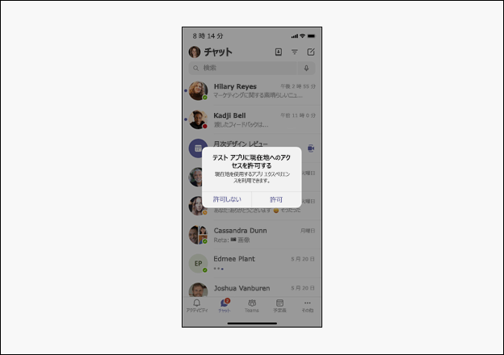

# <a name="request-device-permissions-for-your-microsoft-teams-app"></a>アプリのデバイスのアクセス許可をMicrosoft Teamsする

カメラ、マイクTeams場所などのネイティブ デバイス機能を使用して、アプリを拡張できます。 このドキュメントでは、ユーザーの同意を要求し、ネイティブ デバイスのアクセス許可にアクセスする方法についてガイドします。

> [!NOTE]
> * モバイル アプリにメディア機能をMicrosoft Teamsするには、「メディア機能の統合[」を参照してください](mobile-camera-image-permissions.md)。
> * モバイル アプリに QR またはバーコード スキャナー機能を統合するには、「Microsoft Teams QR またはバーコード スキャナー機能をモバイル アプリに統合する」[を参照Teams。](qr-barcode-scanner-capability.md)
> * モバイル アプリ内で場所の機能を統合するにはMicrosoft Teams機能の[統合に関するページを参照してください](location-capability.md)。

## <a name="native-device-permissions"></a>ネイティブ デバイスのアクセス許可

ネイティブ デバイス機能にアクセスするには、デバイスのアクセス許可を要求する必要があります。 デバイスのアクセス許可は、タブ、タスク モジュール、メッセージング拡張機能など、すべてのアプリ構成で同様に機能します。 ユーザーは、デバイスのアクセス許可を管理するために、Teamsのアクセス許可ページに移動する必要があります。
デバイスの機能にアクセスすると、次のような、Teamsプラットフォームで豊富なエクスペリエンスを構築できます。

* 画像をキャプチャして表示します。
* QR またはバーコードをスキャンします。
* 短いビデオを記録して共有します。
* オーディオ メモを録音し、後で使用するために保存します。
* ユーザーの位置情報を使用して、関連する情報を表示します。

> [!NOTE]
> * 現在、Teamsは、マルチウィンドウ アプリ、タブ、および会議サイド パネルのデバイスのアクセス許可をサポートしています。    
> * ブラウザーでは、デバイスのアクセス許可が異なります。 詳細については、「ブラウザー デバイス [のアクセス許可」を参照してください](browser-device-permissions.md)。

## <a name="access-device-permissions"></a>デバイスのアクセス許可にアクセスする

JavaScript [Microsoft Teams SDK](/javascript/api/overview/msteams-client?view=msteams-client-js-latest&preserve-view=true)には、Teams のデバイスアクセス許可にアクセスし、より豊富なエクスペリエンスを構築するために[](#manage-permissions)必要なツールが提供されています。

これらの機能へのアクセスは、最新の Web ブラウザーでは標準ですが、アプリ マニフェストを更新Teams機能についてユーザーに通知する必要があります。 この更新プログラムを使用すると、デスクトップ クライアントでアプリを実行している間にアクセス許可をTeamsできます。

> [!NOTE]
> 現在、Microsoft Teams機能と QR バーコード スキャナー機能のサポートはモバイル クライアントでのみ利用できます。

## <a name="manage-permissions"></a>権限の管理

ユーザーは、[特定のアプリに対するアクセス許可を許可Teams拒否する]を選択して、デバイスのアクセス許可をユーザー設定で管理できます。

# <a name="mobile"></a>[モバイル](#tab/mobile)

1. [ファイルTeams] を開きます。
1. [アプリの  >  **設定] に移動します**。
1. 設定を選択する必要があるアプリを選択します。
1. 目的の設定を選択します。

    ![[デバイスのアクセス許可] モバイル設定画面](../../assets/images/tabs/MobilePermissions.png)

# <a name="desktop"></a>[デスクトップ](#tab/desktop)

1. アプリを開Teamsします。
1. ウィンドウの右上隅にあるプロファイル アイコンを選択します。
1. ドロップダウン **設定**  >  **から [** アクセス許可] を選択します。
1. 目的の設定を選択します。

   ![[デバイスのアクセス許可] デスクトップ設定画面](~/assets/images/tabs/device-permissions.png)

---

## <a name="specify-permissions"></a>アクセス許可を指定する

アプリケーションで使用する次の 5 つのプロパティを追加して指定して、アプリ `manifest.json` `devicePermissions` を更新します。

``` json
"devicePermissions": [
    "media",
    "geolocation",
    "notifications",
    "midi",
    "openExternal"
],
```

各プロパティを使用すると、ユーザーに同意を求めるプロンプトを表示できます。

| プロパティ      | 説明   |
| --- | --- |
| メディア         | カメラ、マイク、スピーカー、およびアクセス メディア ギャラリーを使用する権限。 |
| 地理位置情報   | ユーザーの場所を返すアクセス許可。      |
| 通知 | ユーザー通知を送信するアクセス許可。      |
| midi          | デジタル楽器から楽器デジタル インターフェイス (MIDI) 情報を送受信する権限。   |
| openExternal  | 外部アプリケーションでリンクを開くアクセス許可。  |

## <a name="check-permissions-from-your-app"></a>アプリからのアクセス許可を確認する

アプリ マニフェスト `devicePermissions` に追加した後、プロンプトを表示せずに **HTML5 アクセス** 許可 API を使用してアクセス許可を確認します。

``` Javascript
// Different query options:
navigator.permissions.query({ name: 'camera' });
navigator.permissions.query({ name: 'microphone' });
navigator.permissions.query({ name: 'geolocation' });
navigator.permissions.query({ name: 'notifications' });
navigator.permissions.query({ name: 'midi', sysex: true });

// Example:
navigator.permissions.query({name:'geolocation'}).then(function(result) {
  if (result.state == 'granted') {
    // Access granted
  } else if (result.state == 'prompt') {
    // Access has not been granted
  }
});
```

## <a name="use-teams-apis-to-get-device-permissions"></a>デバイスTeamsアクセス許可を取得するには、API を使用する

適切な HTML5 または Teams API を活用して、デバイスのアクセス許可にアクセスする同意を得るプロンプトを表示します。

> [!IMPORTANT]
> * をサポート `camera` し `gallery` `microphone` 、selectMedia API を [**使用して有効になります**](/javascript/api/@microsoft/teams-js/microsoftteams.media.media?view=msteams-client-js-latest&preserve-view=true)。 1 [**つのイメージ キャプチャに captureImage API**](/javascript/api/@microsoft/teams-js/microsoftteams?view=msteams-client-js-latest#captureimage--error--sdkerror--files--file-------void-&preserve-view=true) を使用します。
> * getLocation `location` API を使用して [**サポートが有効になります**](/javascript/api/@microsoft/teams-js/microsoftteams.location?view=msteams-client-js-latest#getLocation_LocationProps___error__SdkError__location__Location_____void_&preserve-view=true)。 HTML5 地理位置情報 API は現在、デスクトップ クライアントで完全にサポートされていないので、場所 `getLocation API` Teams必要があります。

以下に例を示します。
 * ユーザーに自分の場所へのアクセスを求めるメッセージを表示するには、次のコマンドを呼び出す必要があります `getCurrentPosition()` 。

    ```Javascript
    navigator.geolocation.getCurrentPosition    (function (position) { /*... */ });
    ```

 * デスクトップまたは Web 上のカメラにアクセスするようにユーザーに求めるには、次のコマンドを呼び出す必要があります `getUserMedia()` 。

    ```Javascript
    navigator.mediaDevices.getUserMedia({ audio: true, video: true });
    ```

 * モバイルで画像をキャプチャするには、Teamsにアクセス許可を求めるメッセージが表示されます `captureImage()` 。

    ```Javascript
    microsoftTeams.media.captureImage((error: microsoftTeams.SdkError, files: microsoftTeams.media.File[]) => {
      /* ... */
    });
    ```

 * 次の呼び出し時に通知がユーザーに表示されます `requestPermission()` 。

    ```Javascript
    Notification.requestPermission(function(result) { /* ... */ });
    ```

* カメラを使用するか、フォト ギャラリーにアクセスするには、Teamsにアクセス許可を求めるメッセージが表示されます `selectMedia()` 。

    ```JavaScript
    microsoftTeams.media.selectMedia({ maxMediaCount: 10, mediaType: microsoftTeams.media.MediaType.Image }, (error: microsoftTeams.SdkError, attachments: microsoftTeams.media.Media[]) => {
      /* ... */
    );
    ```

* マイクを使用するには、Teamsにアクセス許可を求めるメッセージが表示されます `selectMedia()` 。

    ```JavaScript 
    microsoftTeams.media.selectMedia({ maxMediaCount: 1, mediaType: microsoftTeams.media.MediaType.Audio }, (error: microsoftTeams.SdkError, attachments: microsoftTeams.media.Media[]) => {
      /* ... */
    });
    ```

* ユーザーにマップ インターフェイス上の場所を共有するように求めるメッセージを表示するには、Teamsにアクセス許可を求めるメッセージを表示します `getLocation()` 。

    ```JavaScript 
    microsoftTeams.location.getLocation({ allowChooseLocation: true, showMap: true }, (error: microsoftTeams.SdkError, location: microsoftTeams.location.Location) => {
      /* ... *
    /});
    ```

# <a name="mobile"></a>[モバイル](#tab/mobile)

   

# <a name="desktop"></a>[デスクトップ](#tab/desktop)

   

---

## <a name="permission-behavior-across-login-sessions"></a>ログイン セッション間のアクセス許可の動作

デバイスのアクセス許可は、ログイン セッションごとに格納されます。 つまり、別のコンピューターなど、Teams の別のインスタンスにサインインすると、以前のセッションからのデバイスのアクセス許可は使用できません。 したがって、新しいセッションのデバイスのアクセス許可に再同意する必要があります。 つまり、Teams でテナントをサインアウトするか、Teams でテナントを切り替える場合、デバイスのアクセス許可は以前のログイン セッションから削除されます。  

> [!NOTE]
> ネイティブ デバイスのアクセス許可に同意すると、現在のログイン _セッションでのみ有効_ です。

## <a name="code-sample"></a>コード サンプル

| **サンプル名** | **Description** | **Node.js** |
|---------------|--------------|--------|
|デバイス アクセス許可 | デバイスMicrosoft Teamsを示すタブ サンプル アプリを使用する |  [表示](https://github.com/OfficeDev/Microsoft-Teams-Samples/tree/main/samples/tab-device-permissions/nodejs) |

## <a name="next-step"></a>次の手順

> [!div class="nextstepaction"]
> [メディア機能を統合Teams](mobile-camera-image-permissions.md)

## <a name="see-also"></a>関連項目

* [QR スキャナーまたはバーコード スキャナー機能をアプリに統合Teams](qr-barcode-scanner-capability.md)
* [場所の機能を統合Teams](location-capability.md)
