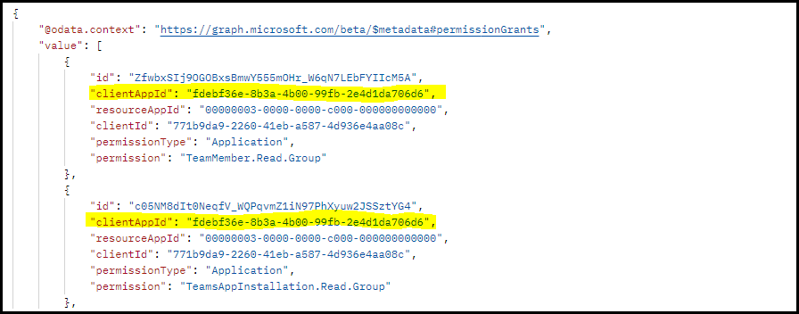

# <a name="resource-specific-consent"></a>リソース固有の同意

> [!NOTE]
> チャット スコープに対するリソース固有の同意は、パブリック開発者 [プレビューでのみ利用](../../resources/dev-preview/developer-preview-intro.md) できます。

リソース固有の同意 (RSC) は、Microsoft Teams と Microsoft Graph API の統合であり、アプリは API エンドポイントを使用して、組織内のチームまたはチャットのいずれかの特定のリソースを管理できます。 RSC アクセス許可モデルを使用すると、チームの所有者とチャットの所有者は、アプリケーションがチームのデータとチャットのデータにそれぞれアクセスおよび変更するための同意を付与できます。 

**注:** チャットに会議または通話が関連付けられている場合は、関連する RSC アクセス許可がそれらのリソースにも適用されます。

## <a name="resource-specific-permissions"></a>リソース固有のアクセス許可

詳細で、Teams固有の RSC アクセス許可は、アプリケーションが特定のリソース内で実行できる操作を定義します。

### <a name="resource-specific-permissions-for-a-team"></a>チームのリソース固有のアクセス許可

|アプリケーションのアクセス許可| Action |
| ----- | ----- |
|TeamSettings.Read.Group | このチームの設定を取得します。|
|TeamSettings.ReadWrite.Group|このチームの設定を更新します。|
|ChannelSettings.Read.Group|このチームのチャネル名、チャネルの説明、チャネル設定を取得します。|
|ChannelSettings.ReadWrite.Group|このチームのチャネル名、チャネルの説明、チャネル設定を更新します。|
|Channel.Create.Group|このチームのチャネルを作成します。 |
|Channel.Delete.Group|このチームのチャネルを削除します。 |
|ChannelMessage.Read.Group |このチームのチャネル メッセージを取得します。 |
|TeamsAppInstallation.Read.Group|このチームのインストール済みアプリの一覧を取得します。|
|TeamsTab.Read.Group|このチームのタブの一覧を取得します。|
|TeamsTab.Create.Group|このチームのタブを作成します。 |
|TeamsTab.ReadWrite.Group|このチームのタブを更新します。 |
|TeamsTab.Delete.Group|このチームのタブを削除します。 |
|TeamMember.Read.Group|このチームのメンバーを取得します。 |

詳細については、「チーム リソース固有 [の同意のアクセス許可」を参照してください](/graph/permissions-reference#teams-resource-specific-consent-permissions)。

### <a name="resource-specific-permissions-for-a-chat"></a>チャットのリソース固有のアクセス許可

次の表に、チャットのリソース固有のアクセス許可を示します。

|アプリケーションのアクセス許可| Action |
| ----- | ----- |
| ChatSettings.Read.Chat         | このチャットの設定を取得します。                                    |
| ChatSettings.ReadWrite.Chat    | このチャットの設定を更新します。                          |
| ChatMessage.Read.Chat          | このチャットのメッセージを取得します。                                    |
| ChatMember.Read.Chat           | このチャットのメンバーを取得します。                                     |
| Chat.Manage.Chat               | このチャットを管理します。                                             |
| TeamsTab.Read.Chat             | このチャットのタブを取得します。                                        |
| TeamsTab.Create.Chat           | このチャットでタブを作成します。                                     |
| TeamsTab.Delete.Chat           | このチャットのタブを削除します。                                      |
| TeamsTab.ReadWrite.Chat        | このチャットのタブを管理します。                                      |
| TeamsAppInstallation.Read.Chat | このチャットにインストールされているアプリを取得します。                   |
| OnlineMeeting.ReadBasic.Chat   | このチャットに関連付けられた会議の名前、スケジュール、開催者、参加リンク、開始/終了通知などの基本的なプロパティを読み取る。 |
| Calls.AccessMedia.Chat         | このチャットまたは会議に関連付けられた通話でメディア ストリームにアクセスします。                                    |
| Calls.JoinGroupCalls.Chat         | このチャットまたは会議に関連付けられた通話に参加します。                                    |

詳細については、「チャット リソース [固有の同意のアクセス許可」を参照してください](/graph/permissions-reference#chat-resource-specific-consent-permissions)。

> [!NOTE]
> リソース固有のアクセス許可は、Teams クライアントにインストールされている Teams アプリでのみ使用できます。現在は Azure Active Directory (AAD) ポータルの一部ではありません。

## <a name="enable-rsc-in-your-application"></a>アプリケーションで RSC を有効にする

1. [AAD ポータルで同意設定を構成します](#configure-consent-settings-in-the-aad-portal)。
    1. [チーム内の RSC のグループ所有者の同意設定を構成します](#configure-group-owner-consent-settings-for-rsc-in-a-team)。
    1. [チャットで RSC のユーザー同意設定を構成します](#configure-user-consent-settings-for-rsc-in-a-chat)。
1. [AAD ポータルを使用Microsoft ID プラットフォームアプリをアプリに登録します](#register-your-app-with-microsoft-identity-platform-using-the-aad-portal)。
1. [AAD ポータルでアプリケーションのアクセス許可を確認します](#review-your-application-permissions-in-the-aad-portal)。
1. [ID プラットフォームからアクセス トークンを取得します](#obtain-an-access-token-from-the-microsoft-identity-platform)。
1. [アプリ マニフェストTeams更新します](#update-your-teams-app-manifest)。
1. [アプリをアプリに直接インストールTeams。](#sideload-your-app-in-teams)
1. [アプリで追加された RSC アクセス許可を確認します](#check-your-app-for-added-rsc-permissions)。
    1. [チームに追加された RSC アクセス許可をアプリで確認します](#check-your-app-for-added-rsc-permissions-in-a-team)。
    1. [チャットで追加された RSC アクセス許可をアプリで確認します](#check-your-app-for-added-rsc-permissions-in-a-chat)。

## <a name="configure-consent-settings-in-the-aad-portal"></a>AAD ポータルで同意設定を構成する

### <a name="configure-group-owner-consent-settings-for-rsc-in-a-team"></a>チームで RSC のグループ所有者の同意設定を構成する

Azure portal 内でグループ所有者 [の同意を直接](/azure/active-directory/manage-apps/configure-user-consent-groups?tabs=azure-portal) 有効または無効にできます。

1. グローバル管理者または [会社管理者として Azure](https://portal.azure.com) portal [にサインインします](/azure/active-directory/roles/permissions-reference#global-administrator&preserve-view=true)。
1. [アプリケーション **Azure Active Directory Enterprise** とアクセス許可ユーザーの同意  >    >  **設定**  >  [**] を選択します**](https://portal.azure.com/#blade/Microsoft_AAD_IAM/ConsentPoliciesMenuBlade/UserSettings)。
1. データにアクセスするアプリに対するグループ所有者の同意というラベルが付いたコントロールを使用して、ユーザーの同意を有効 **、無効、または制限します**。 既定値は[ **すべてのグループ所有者に対するグループ所有者の同意を許可する] です**。 チームの所有者が RSC を使用してアプリをインストールするには、そのユーザーに対してグループ所有者の同意を有効にする必要があります。

    

さらに、PowerShell を使用してグループ所有者の同意を有効または無効にできます。PowerShell を使用してグループ所有者の同意を構成するで説明されている手順 [に従います](/azure/active-directory/manage-apps/configure-user-consent-groups?tabs=azure-powershell)。

### <a name="configure-user-consent-settings-for-rsc-in-a-chat"></a>チャットで RSC のユーザー同意設定を構成する

Azure portal 内でユーザーの [同意を直接](/azure/active-directory/manage-apps/configure-user-consent?tabs=azure-portal) 有効または無効にできます。

1. グローバル管理者または [会社管理者として Azure](https://portal.azure.com) portal [にサインインします](/azure/active-directory/roles/permissions-reference#global-administrator&preserve-view=true)。
1. [アプリケーション **Azure Active Directory Enterprise** とアクセス許可ユーザーの同意  >    >  **設定**  >  [**] を選択します**](https://portal.azure.com/#blade/Microsoft_AAD_IAM/ConsentPoliciesMenuBlade/UserSettings)。
1. [アプリケーションに対するユーザーの同意] というラベルの付いたコントロールを使用して、ユーザーの同意を有効 **、無効、または制限します**。 既定値は [ **アプリに対するユーザーの同意を許可する] です**。 チャット メンバーが RSC を使用してアプリをインストールするには、そのユーザーに対してユーザーの同意を有効にする必要があります。

    

さらに、PowerShell を使用してユーザーの同意を有効または無効にしたり [、PowerShell](/azure/active-directory/manage-apps/configure-user-consent?tabs=azure-powershell)を使用してユーザーの同意を構成するで説明されている手順に従います。

## <a name="register-your-app-with-microsoft-identity-platform-using-the-aad-portal"></a>AAD ポータルを使用Microsoft ID プラットフォームアプリをアプリに登録する

AAD ポータルは、アプリを登録および構成する中央プラットフォームを提供します。 ID プラットフォームと統合し、Microsoft のサービス API を呼び出すには、アプリを AAD ポータルGraph必要があります。 詳細については、「アプリケーションを [ID プラットフォームに登録する」を参照してください](/graph/auth-register-app-v2)。

> [!WARNING]
> AAD アプリ ID を複数のアプリ間で共有Teams必要があります。 1 つのアプリと AAD アプリの間に 1:1 Teamsが必要です。 同じ AAD アプリ ID にTeams複数のアプリをインストールしようとすると、インストールまたは実行時にエラーが発生します。

## <a name="review-your-application-permissions-in-the-aad-portal"></a>AAD ポータルでアプリケーションのアクセス許可を確認する

1. [ホーム アプリの **登録**  >  **] ページに移動し**、RSC アプリを選択します。
1. 左側 **のウィンドウから [API の** アクセス許可] を選択し、アプリの [構成済み **アクセス許可]** の一覧を表示します。 アプリで RSC 呼び出しGraph場合は、そのページのすべてのアクセス許可を削除します。 アプリで RSC 以外の呼び出しを行う場合は、必要に応じてこれらのアクセス許可を保持します。

> [!IMPORTANT]
> AAD ポータルを使用して RSC アクセス許可を要求することはできません。 RSC アクセス許可は現在、Teams クライアントにインストールされている Teams アプリケーション専用であり、Teams アプリ マニフェスト (JSON) ファイルで宣言されています。

## <a name="obtain-an-access-token-from-the-microsoft-identity-platform"></a>サーバーからアクセス トークンを取得Microsoft ID プラットフォーム

API 呼びGraphするには、ID プラットフォームからアプリのアクセス トークンを取得する必要があります。 アプリが ID プラットフォームからトークンを取得するには、そのトークンを AAD ポータルに登録する必要があります。 アクセス トークンには、アプリとアプリに付与されているアクセス許可に関する情報が含まれています。このアクセス許可は、Microsoft Graph を通じて利用できるリソースと API に対応するものです。

ID プラットフォームからアクセス トークンを取得するには、AAD 登録プロセスの次の値が必要です。

- アプリ **登録ポータルによって** 割り当てられたアプリケーション ID。 アプリがシングル サインオン (SSO) をサポートしている場合は、アプリと SSO に同じアプリケーション ID を使用する必要があります。
- クライアント **シークレット/パスワード、** または証明書である公開キーまたは秘密キー **のペア** です。 ネイティブ アプリの場合、これは必須ではありません。
- AAD **から応答** を受信するアプリのリダイレクト URI または返信 URL。

詳細については、「ユーザーに [代わってアクセス権を取得](/graph/auth-v2-user?view=graph-rest-1.0#3-get-a-token&preserve-view=true) する」および「ユーザーなしで [アクセスを取得する」を参照してください](/graph/auth-v2-service)。

## <a name="update-your-teams-app-manifest"></a>アプリ マニフェストTeams更新する

RSC アクセス許可は、アプリ マニフェスト JSON ファイルで宣言されます。 次の [値を使用して、WebApplicationInfo](../../resources/schema/manifest-schema.md#webapplicationinfo) キーをアプリ マニフェストに追加します。

|名前| 種類 | 説明|
|---|---|---|
|`id` |String |AAD アプリ ID。 詳細については [、「AAD ポータルにアプリを登録する」を参照してください](resource-specific-consent.md#register-your-app-with-microsoft-identity-platform-using-the-aad-portal)。|
|`resource`|String| このフィールドは RSC で操作を行う必要がありますが、エラー応答を回避するには、値を追加して値を指定する必要があります。任意の文字列が実行します。|
|`applicationPermissions`|文字列の配列|アプリの RSC アクセス許可。 詳細については、「リソース固有 [のアクセス許可」を参照してください](resource-specific-consent.md#resource-specific-permissions)。|

>
> [!IMPORTANT]
> RSC 以外のアクセス許可は Azure portal に格納されます。 アプリ マニフェストに追加しません。
>

### <a name="example-for-rsc-in-a-team"></a>チームの RSC の例

```json
"webApplicationInfo": {
    "id": "XXxxXXXXX-XxXX-xXXX-XXxx-XXXXXXXxxxXX",
    "resource": "https://RscBasedStoreApp",
    "applicationPermissions": [
        "TeamSettings.Read.Group",
        "TeamSettings.ReadWrite.Group",
        "ChannelSettings.Read.Group",
        "ChannelSettings.ReadWrite.Group",
        "Channel.Create.Group",
        "Channel.Delete.Group",
        "ChannelMessage.Read.Group",
        "TeamsAppInstallation.Read.Group",
        "TeamsTab.Read.Group",
        "TeamsTab.Create.Group",
        "TeamsTab.ReadWrite.Group",
        "TeamsTab.Delete.Group",
        "TeamMember.Read.Group"
    ]
  }
```

### <a name="example-for-rsc-in-a-chat"></a>チャット内の RSC の例

```json
"webApplicationInfo": {
    "id": "XXxxXXXXX-XxXX-xXXX-XXxx-XXXXXXXxxxXX",
    "resource": "https://RscBasedStoreApp",
    "applicationPermissions": [
        "ChatSettings.Read.Chat",
        "ChatSettings.ReadWrite.Chat",
        "ChatMessage.Read.Chat",
        "ChatMember.Read.Chat",
        "Chat.Manage.Chat",
        "TeamsTab.Read.Chat",
        "TeamsTab.Create.Chat",
        "TeamsTab.Delete.Chat",
        "TeamsTab.ReadWrite.Chat",
        "TeamsAppInstallation.Read.Chat",
        "OnlineMeeting.ReadBasic.Chat",
        "Calls.AccessMedia.Chat",
        "Calls.JoinGroupCalls.Chat"
    ]
  }
```

> [!NOTE]
> アプリがチームスコープとチャット スコープの両方でのインストールをサポートすることを意図している場合は、チームとチャットの両方のアクセス許可を同じマニフェストで指定できます `applicationPermissions` 。

## <a name="sideload-your-app-in-teams"></a>アプリをサイドロードTeams

管理者がTeamsアプリのアップロードを許可している場合は、アプリを特定[](~/concepts/deploy-and-publish/apps-upload.md)のチームまたはチャットに直接サイドロードできます。

## <a name="check-your-app-for-added-rsc-permissions"></a>アプリで追加された RSC アクセス許可を確認する

> [!IMPORTANT]
> RSC アクセス許可は、ユーザーに属性付けされません。 呼び出しは、ユーザーが委任したアクセス許可ではなく、アプリのアクセス許可を使用して行います。 アプリは、タブの削除など、ユーザーが実行できない操作を実行できます。RSC API 呼び出しを行う前に、チーム所有者またはチャット所有者の使用意図を確認する必要があります。 詳細については、「API の概要[Microsoft Teamsを参照してください](/graph/teams-concept-overview)。

アプリがリソースにインストールされた後、Graph[エクスプローラー](https://developer.microsoft.com/graph/graph-explorer)を使用して、リソース内のアプリに付与されたアクセス許可を表示できます。

### <a name="check-your-app-for-added-rsc-permissions-in-a-team"></a>チームに追加された RSC アクセス許可をアプリで確認する

1. チームの **groupId** を次のTeams。
1. [Teams] で、左端 **Teams** ウィンドウから [プロパティ] を選択します。
1. アプリをインストールするチームを選択します。
1. そのチームの省略 &#x25CF;&#x25CF;&#x25CF; を選択します。
1. [ **チーム] ドロップダウン メニューから [チーム** へのリンクを取得する] を選択します。
1. [チームへのリンク **を取得する** ] ポップアップ ダイアログ ボックスから groupId **値をコピー** して保存します。
1. エクスプローラーにサインイン **Graphします**。
1. このエンドポイント **に GET** 呼び出し `https://graph.microsoft.com/beta/teams/{teamGroupId}/permissionGrants` を行います。 応答 `clientAppId` のフィールドは、アプリ マニフェスト `webApplicationInfo.id` で指定されたTeamsマップされます。

    

特定のチームにインストールされているアプリの詳細を取得する方法の詳細については、「指定したチームにインストールされているアプリの名前と他の詳細を取得する」 [を参照してください](/graph/api/team-list-installedapps#example-2-get-the-names-and-other-details-of-installed-apps)。

### <a name="check-your-app-for-added-rsc-permissions-in-a-chat"></a>チャットで追加された RSC アクセス許可をアプリで確認する

1. Web クライアントからチャット スレッド ID を *Teamsします。*
1. Web クライアントTeams、左端 **のウィンドウから**[チャット] を選択します。
1. アプリがインストールされているチャットをドロップダウン メニューから選択します。
1. Web URL をコピーし、文字列からチャット スレッド ID を保存します。

    

1. エクスプローラーにサインイン **Graphします**。
1. 次の **エンドポイントに対** して GET 呼び出しを行います `https://graph.microsoft.com/beta/chats/{chatId}/permissionGrants` 。 応答 `clientAppId` のフィールドは、アプリ マニフェスト `webApplicationInfo.id` で指定されたTeamsマップされます。

    

特定のチャットにインストールされているアプリの詳細を取得する方法の詳細については、「指定したチャットにインストールされているアプリの名前と他の詳細を取得する」 [を参照してください](/graph/api/chat-list-installedapps#example-2-get-the-names-and-other-details-of-apps-installed-in-the-specified-chat)。

## <a name="code-sample"></a>コード サンプル

| **サンプルの名前** | **説明** | **.NET** |**Node.js** |
|-----------------|-----------------|----------------|----------------|
| Resource-Specific同意 (RSC) | RSC を使用して API Graph呼び出します。 | [View](https://github.com/OfficeDev/Microsoft-Teams-Samples/tree/main/samples/graph-rsc/csharp)|[表示](https://github.com/OfficeDev/Microsoft-Teams-Samples/tree/main/samples/graph-rsc/nodeJs)|

## <a name="see-also"></a>関連項目
 
* [リソース固有の同意のアクセス許可をテストTeams](test-resource-specific-consent.md)
* [管理者向けリソース固有Microsoft Teams同意](/MicrosoftTeams/resource-specific-consent)
