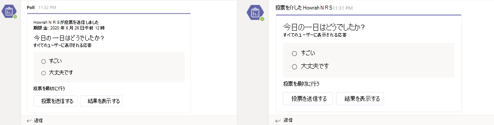

# <a name="respond-to-the-task-module-submit-action"></a><span data-ttu-id="bb496-103">タスク モジュールの送信アクションに応答する</span><span class="sxs-lookup"><span data-stu-id="bb496-103">Respond to the task module submit action</span></span>

[!include[v4-to-v3-SDK-pointer](~/includes/v4-to-v3-pointer-me.md)]

<span data-ttu-id="bb496-104">このドキュメントでは、ユーザーのタスク モジュール送信アクションなど、アプリがアクション コマンドに応答する方法について説明します。</span><span class="sxs-lookup"><span data-stu-id="bb496-104">This document guides you on how your app responds to the action commands, such as user's task module submit action.</span></span>
<span data-ttu-id="bb496-105">ユーザーがタスク モジュールを送信すると、Web サービスはコマンド ID とパラメーター値を含む呼び出し `composeExtension/submitAction` メッセージを受信します。</span><span class="sxs-lookup"><span data-stu-id="bb496-105">After a user submits the task module, your web service receives a `composeExtension/submitAction` invoke message with the command ID and parameter values.</span></span> <span data-ttu-id="bb496-106">アプリは呼び出しに応答するために **5** 秒を持ち、それ以外の場合、ユーザーはアプリに到達できないというエラー メッセージを受け取り、呼び出しに対する返信は Teams クライアントによって無視されます。</span><span class="sxs-lookup"><span data-stu-id="bb496-106">Your app has five seconds to respond to the invoke, otherwise the user receives an error message **Unable to reach the app**, and any reply to the invoke is ignored by the Teams client.</span></span>

<span data-ttu-id="bb496-107">応答するオプションは次のとおりです。</span><span class="sxs-lookup"><span data-stu-id="bb496-107">You have the following options to respond:</span></span>

* <span data-ttu-id="bb496-108">応答なし: 送信アクションを使用して、外部システムでプロセスをトリガーし、ユーザーにフィードバックを提供しない。</span><span class="sxs-lookup"><span data-stu-id="bb496-108">No response: Use the submit action to trigger a process in an external system, and not provide any feedback to the user.</span></span> <span data-ttu-id="bb496-109">これは、長時間実行されるプロセスに役立ち、フィードバックを交互に提供するために選択できます。</span><span class="sxs-lookup"><span data-stu-id="bb496-109">This is useful for long-running processes, and you can select to provide feedback alternately.</span></span> <span data-ttu-id="bb496-110">たとえば、プロアクティブ なメッセージでフィードバックを [送信できます](~/bots/how-to/conversations/send-proactive-messages.md)。</span><span class="sxs-lookup"><span data-stu-id="bb496-110">For example, you can give feedback with a [proactive message](~/bots/how-to/conversations/send-proactive-messages.md).</span></span>
* <span data-ttu-id="bb496-111">[別のタスク モジュール](#respond-with-another-task-module): 複数ステップの操作の一環として、追加のタスク モジュールで応答できます。</span><span class="sxs-lookup"><span data-stu-id="bb496-111">[Another task module](#respond-with-another-task-module): You can respond with an additional task module as part of a multi-step interaction.</span></span>
* <span data-ttu-id="bb496-112">[カードの](#respond-with-a-card-inserted-into-the-compose-message-area)応答 : ユーザーが操作できるカードまたはメッセージに挿入できるカードで応答できます。</span><span class="sxs-lookup"><span data-stu-id="bb496-112">[Card response](#respond-with-a-card-inserted-into-the-compose-message-area): You can respond with a card that the user can interact with or insert into a message.</span></span>
* <span data-ttu-id="bb496-113">[ボットからのアダプティブ カード](#bot-response-with-adaptive-card): アダプティブ カードを会話に直接挿入します。</span><span class="sxs-lookup"><span data-stu-id="bb496-113">[Adaptive Card from bot](#bot-response-with-adaptive-card): Insert an Adaptive Card directly into the conversation.</span></span>
* <span data-ttu-id="bb496-114">[ユーザーに認証を要求します](~/messaging-extensions/how-to/add-authentication.md)。</span><span class="sxs-lookup"><span data-stu-id="bb496-114">[Request the user to authenticate](~/messaging-extensions/how-to/add-authentication.md).</span></span>
* <span data-ttu-id="bb496-115">[追加の構成をユーザーに要求する]~//get-started/first-message-extension.md)。</span><span class="sxs-lookup"><span data-stu-id="bb496-115">[Request the user to provide additional configuration]~/get-started/first-message-extension.md).</span></span>

<span data-ttu-id="bb496-116">認証または構成の場合、ユーザーがプロセスを完了すると、元の呼び出しが Web サービスに再び戻されます。</span><span class="sxs-lookup"><span data-stu-id="bb496-116">For authentication or configuration, after the user completes the process, the original invoke is resent to your web service.</span></span> <span data-ttu-id="bb496-117">次の表に、メッセージング拡張機能の呼び出し場所に基づいて使用できる応答 `commandContext` の種類を示します。</span><span class="sxs-lookup"><span data-stu-id="bb496-117">The following table shows which types of responses are available based on the invoke location `commandContext` of the messaging extension:</span></span> 

|<span data-ttu-id="bb496-118">応答の種類</span><span class="sxs-lookup"><span data-stu-id="bb496-118">Response Type</span></span> | <span data-ttu-id="bb496-119">作成</span><span class="sxs-lookup"><span data-stu-id="bb496-119">Compose</span></span> | <span data-ttu-id="bb496-120">コマンド バー</span><span class="sxs-lookup"><span data-stu-id="bb496-120">Command bar</span></span> | <span data-ttu-id="bb496-121">メッセージ</span><span class="sxs-lookup"><span data-stu-id="bb496-121">Message</span></span> |
|--------------|:-------------:|:-------------:|:---------:|
|<span data-ttu-id="bb496-122">カードの応答</span><span class="sxs-lookup"><span data-stu-id="bb496-122">Card response</span></span> | <span data-ttu-id="bb496-123">✔</span><span class="sxs-lookup"><span data-stu-id="bb496-123">✔</span></span> | <span data-ttu-id="bb496-124">✔</span><span class="sxs-lookup"><span data-stu-id="bb496-124">✔</span></span> | <span data-ttu-id="bb496-125">✔</span><span class="sxs-lookup"><span data-stu-id="bb496-125">✔</span></span> |
|<span data-ttu-id="bb496-126">別のタスク モジュール</span><span class="sxs-lookup"><span data-stu-id="bb496-126">Another task module</span></span> | <span data-ttu-id="bb496-127">✔</span><span class="sxs-lookup"><span data-stu-id="bb496-127">✔</span></span> | <span data-ttu-id="bb496-128">✔</span><span class="sxs-lookup"><span data-stu-id="bb496-128">✔</span></span> | <span data-ttu-id="bb496-129">✔</span><span class="sxs-lookup"><span data-stu-id="bb496-129">✔</span></span> |
|<span data-ttu-id="bb496-130">アダプティブ カードを使用したボット</span><span class="sxs-lookup"><span data-stu-id="bb496-130">Bot with Adaptive Card</span></span> | <span data-ttu-id="bb496-131">✔</span><span class="sxs-lookup"><span data-stu-id="bb496-131">✔</span></span> | <span data-ttu-id="bb496-132">x</span><span class="sxs-lookup"><span data-stu-id="bb496-132">x</span></span> | <span data-ttu-id="bb496-133">✔</span><span class="sxs-lookup"><span data-stu-id="bb496-133">✔</span></span> |
| <span data-ttu-id="bb496-134">応答なし</span><span class="sxs-lookup"><span data-stu-id="bb496-134">No response</span></span> | <span data-ttu-id="bb496-135">✔</span><span class="sxs-lookup"><span data-stu-id="bb496-135">✔</span></span> | <span data-ttu-id="bb496-136">✔</span><span class="sxs-lookup"><span data-stu-id="bb496-136">✔</span></span> | <span data-ttu-id="bb496-137">✔</span><span class="sxs-lookup"><span data-stu-id="bb496-137">✔</span></span> |

> [!NOTE]
> * <span data-ttu-id="bb496-138">**[Action.Submit** through ME] カードを選択すると、その値が通常のペイロードと等しい名前 **の composeExtension** を持つ呼び出しアクティビティが送信されます。</span><span class="sxs-lookup"><span data-stu-id="bb496-138">When you select **Action.Submit** through ME cards, it sends invoke activity with the name **composeExtension**, where the value is equal to the usual payload.</span></span>
> * <span data-ttu-id="bb496-139">**[Action.Submit** through conversation] を選択すると、onCardButtonClicked という名前のメッセージ アクティビティが表示され、値は通常のペイロードと等しくなります。 </span><span class="sxs-lookup"><span data-stu-id="bb496-139">When you select **Action.Submit** through conversation, you receive message activity with the name **onCardButtonClicked**, where the value is equal to the usual payload.</span></span>

## <a name="the-submitaction-invoke-event"></a><span data-ttu-id="bb496-140">submitAction 呼び出しイベント</span><span class="sxs-lookup"><span data-stu-id="bb496-140">The submitAction invoke event</span></span>

<span data-ttu-id="bb496-141">呼び出しメッセージを受信する例は次のとおりです。</span><span class="sxs-lookup"><span data-stu-id="bb496-141">Examples of receiving the invoke message are as follows:</span></span>

# <a name="cnet"></a>[<span data-ttu-id="bb496-142">C#/.NET</span><span class="sxs-lookup"><span data-stu-id="bb496-142">C#/.NET</span></span>](#tab/dotnet)

```csharp
protected override async Task<MessagingExtensionActionResponse> OnTeamsMessagingExtensionSubmitActionAsync(
  ITurnContext<IInvokeActivity> turnContext, MessagingExtensionAction action, CancellationToken cancellationToken) {
  //code to handle the submit action
}
```

# <a name="javascriptnodejs"></a>[<span data-ttu-id="bb496-143">JavaScript/Node.js</span><span class="sxs-lookup"><span data-stu-id="bb496-143">JavaScript/Node.js</span></span>](#tab/javascript)

```javascript
class TeamsMessagingExtensionsActionPreview extends TeamsActivityHandler {
  constructor() {
  handleTeamsMessagingExtensionSubmitAction(context, action) {
  
  //code to handle the submit action
    }
  }
}
```

# <a name="json"></a>[<span data-ttu-id="bb496-144">JSON</span><span class="sxs-lookup"><span data-stu-id="bb496-144">JSON</span></span>](#tab/json)

<span data-ttu-id="bb496-145">次に、受信する JSON オブジェクトの例を示します。</span><span class="sxs-lookup"><span data-stu-id="bb496-145">This is an example of the JSON object that you receive.</span></span> <span data-ttu-id="bb496-146">パラメーター `commandContext` は、メッセージング拡張機能がトリガーされた場所を示します。</span><span class="sxs-lookup"><span data-stu-id="bb496-146">The `commandContext` parameter indicates where your messaging extension was triggered from.</span></span> <span data-ttu-id="bb496-147">オブジェクト `data` には、パラメーターとしてフォームのフィールドと、ユーザーが送信した値が含まれます。</span><span class="sxs-lookup"><span data-stu-id="bb496-147">The `data` object contains the fields on the form as parameters, and the values the user submitted.</span></span> <span data-ttu-id="bb496-148">ここでの JSON オブジェクトは、最も関連性の高いフィールドを強調表示するために短縮されます。</span><span class="sxs-lookup"><span data-stu-id="bb496-148">The JSON object here is shortened to highlight the most relevant fields.</span></span>

```json
{
  "name": "composeExtension/submitAction",
  "imdisplayname": "Bob Smith",
  "serviceUrl": "https://smba.trafficmanager.net/amer/",
  "value": {
    "commandId": "giveKudos",
    "commandContext": "compose",
    "context": {
      "theme": "default"
    },
    "data": {
      "id": "submitButton",
      "formField1": "formField1_value",
      "formField2": "formField2_value",
      "formField3": "formField3_value"
    }
  },
  "conversation": {
    "id": "19:7705841b240044b297123ad7f9c99217@thread.skype"
  }
}
```

* * *

## <a name="respond-with-a-card-inserted-into-the-compose-message-area"></a><span data-ttu-id="bb496-149">作成メッセージ領域にカードを挿入して応答する</span><span class="sxs-lookup"><span data-stu-id="bb496-149">Respond with a card inserted into the compose message area</span></span>

<span data-ttu-id="bb496-150">要求に応答する最も一般的な方法は、作成メッセージ領域にカード `composeExtension/submitAction` を挿入する方法です。</span><span class="sxs-lookup"><span data-stu-id="bb496-150">The most common way to respond to the `composeExtension/submitAction` request is with a card inserted into the compose message area.</span></span> <span data-ttu-id="bb496-151">ユーザーが会話にカードを送信します。</span><span class="sxs-lookup"><span data-stu-id="bb496-151">The user submits the card to the conversation.</span></span> <span data-ttu-id="bb496-152">カードの使用の詳細については、「カードと [カードのアクション」を参照してください](~/task-modules-and-cards/cards/cards-actions.md)。</span><span class="sxs-lookup"><span data-stu-id="bb496-152">For more information on using cards, see [cards and card actions](~/task-modules-and-cards/cards/cards-actions.md).</span></span>

# <a name="cnet"></a>[<span data-ttu-id="bb496-153">C#/.NET</span><span class="sxs-lookup"><span data-stu-id="bb496-153">C#/.NET</span></span>](#tab/dotnet)

```csharp
protected override async Task<MessagingExtensionActionResponse> OnTeamsMessagingExtensionSubmitActionAsync(
  ITurnContext<IInvokeActivity> turnContext, MessagingExtensionAction action, CancellationToken cancellationToken)
{
    var response = new MessagingExtensionActionResponse
    {
        ComposeExtension = new MessagingExtensionResult
        {
            AttachmentLayout = "list",
            Type = "result",
        },
    };
    var createCardData = ((JObject)action.Data).ToObject<CreateCardData>();
var card = new HeroCard
{
     Title = createCardData.Title,
     Subtitle = createCardData.Subtitle,
     Text = createCardData.Text,
};
    var attachments = new List<MessagingExtensionAttachment>();
    attachments.Add(new MessagingExtensionAttachment
    {
        Content = card,
        ContentType = HeroCard.ContentType,
        Preview = card.ToAttachment(),
    });
    response.ComposeExtension.Attachments = attachments;
    return response;
}
```

# <a name="javascriptnodejs"></a>[<span data-ttu-id="bb496-154">JavaScript/Node.js</span><span class="sxs-lookup"><span data-stu-id="bb496-154">JavaScript/Node.js</span></span>](#tab/javascript)

```javascript
class TeamsMessagingExtensionsActionPreview extends TeamsActivityHandler {
  handleTeamsMessagingExtensionSubmitAction(context, action) {
    const data = action.data;
    const heroCard = CardFactory.heroCard(data.title, data.text);
    heroCard.content.subtitle = data.subTitle;
    const attachment = { contentType: heroCard.contentType, content: heroCard.content, preview: heroCard };

    return {
      composeExtension: {
        type: 'result',
        attachmentLayout: 'list',
        attachments: [
          attachment
        ]
      }
    }
  }
}
```

# <a name="json"></a>[<span data-ttu-id="bb496-155">JSON</span><span class="sxs-lookup"><span data-stu-id="bb496-155">JSON</span></span>](#tab/json)

```json
{
  "composeExtension": {
    "attachmentLayout": "list",
    "type": "result",
    "attachments": [
      {
        "preview": {
          "contentType": "application/vnd.microsoft.card.hero",
          "content": {
            "title": "formField1_value",
            "subtitle": "formField2_value",
            "text": "formField3_value"
          }
        },
        "contentType": "application/vnd.microsoft.card.hero",
        "content": {
          "title": "formField1_value",
          "subtitle": "formField2_value",
          "text": "formField3_value"
        }
      }
    ]
  }
}
```

* * *

## <a name="respond-with-another-task-module"></a><span data-ttu-id="bb496-156">別のタスク モジュールで応答する</span><span class="sxs-lookup"><span data-stu-id="bb496-156">Respond with another task module</span></span>

<span data-ttu-id="bb496-157">追加のタスク モジュールを使用して `submitAction` イベントに応答する場合に選択できます。</span><span class="sxs-lookup"><span data-stu-id="bb496-157">You can select to respond to the `submitAction` event with an additional task module.</span></span> <span data-ttu-id="bb496-158">これは、次の場合に役立ちます。</span><span class="sxs-lookup"><span data-stu-id="bb496-158">This is useful when:</span></span>

* <span data-ttu-id="bb496-159">大量の情報を収集する必要があります。</span><span class="sxs-lookup"><span data-stu-id="bb496-159">You need to collect large amounts of information.</span></span>
* <span data-ttu-id="bb496-160">ユーザー入力に基づいて収集する情報を動的に変更する必要があります。</span><span class="sxs-lookup"><span data-stu-id="bb496-160">You need to dynamically change the information you are collecting based on user input.</span></span>
* <span data-ttu-id="bb496-161">ユーザーが送信した情報を検証し、何か問題がある場合は、エラー メッセージでフォームを再送信する必要があります。</span><span class="sxs-lookup"><span data-stu-id="bb496-161">You need to validate the information submitted by the user and resend the form with an error message if something is wrong.</span></span> 

<span data-ttu-id="bb496-162">応答のメソッドは、最初のイベント [に応答する方法と同 `fetchTask` じです](~/messaging-extensions/how-to/action-commands/create-task-module.md)。</span><span class="sxs-lookup"><span data-stu-id="bb496-162">The method for response is the same as [responding to the initial `fetchTask` event](~/messaging-extensions/how-to/action-commands/create-task-module.md).</span></span> <span data-ttu-id="bb496-163">Bot Framework SDK を使用している場合は、両方の送信アクションに対して同じイベント トリガーが発生します。</span><span class="sxs-lookup"><span data-stu-id="bb496-163">If you are using the Bot Framework SDK the same event triggers for both submit actions.</span></span> <span data-ttu-id="bb496-164">これを機能するには、正しい応答を決定するロジックを追加する必要があります。</span><span class="sxs-lookup"><span data-stu-id="bb496-164">To make this work, you must add logic that determines the correct response.</span></span>

## <a name="bot-response-with-adaptive-card"></a><span data-ttu-id="bb496-165">アダプティブ カードを使用したボットの応答</span><span class="sxs-lookup"><span data-stu-id="bb496-165">Bot response with Adaptive Card</span></span>

> [!NOTE]
> <span data-ttu-id="bb496-166">アダプティブ カードを使用してボットの応答を取得するには、アプリ マニフェストにオブジェクトを追加し、ボットに必要なスコープを `bot` 定義する必要があります。</span><span class="sxs-lookup"><span data-stu-id="bb496-166">The prerequisite to get the bot response with an Adaptive card is that you must add the `bot` object to your app manifest, and define the required scope for the bot.</span></span> <span data-ttu-id="bb496-167">ボットのメッセージング拡張機能と同じ ID を使用します。</span><span class="sxs-lookup"><span data-stu-id="bb496-167">Use the same ID as your messaging extension for your bot.</span></span>
 
<span data-ttu-id="bb496-168">また、アダプティブ カードを含むメッセージをボットを使用してチャネルに `submitAction` 挿入することで応答できます。</span><span class="sxs-lookup"><span data-stu-id="bb496-168">You can also respond to the `submitAction` by inserting a message with an Adaptive Card into the channel with a bot.</span></span> <span data-ttu-id="bb496-169">ユーザーは、メッセージを送信する前にプレビューできます。</span><span class="sxs-lookup"><span data-stu-id="bb496-169">The user can preview the message before submitting it.</span></span> <span data-ttu-id="bb496-170">これは、アダプティブ カード応答を作成する前にユーザーから情報を収集するシナリオや、ユーザーがカードを操作した後にカードを更新する場合に非常に便利です。</span><span class="sxs-lookup"><span data-stu-id="bb496-170">This is very useful in scenarios where you gather information from the users before creating an Adaptive Card response, or when you update the card after someone interacts with it.</span></span> 

<span data-ttu-id="bb496-171">次のシナリオは、チャネル会話に構成手順を含めずにアプリ Polly がポーリングを構成する方法を示しています。</span><span class="sxs-lookup"><span data-stu-id="bb496-171">The following scenario shows how the app Polly configures a poll without including the configuration steps in the channel conversation:</span></span>

<span data-ttu-id="bb496-172">**ポーリングを構成するには**</span><span class="sxs-lookup"><span data-stu-id="bb496-172">**To configure the poll**</span></span>

1. <span data-ttu-id="bb496-173">ユーザーは、タスク モジュールを呼び出すメッセージング拡張機能を選択します。</span><span class="sxs-lookup"><span data-stu-id="bb496-173">The user selects the messaging extension to invoke the task module.</span></span>
1. <span data-ttu-id="bb496-174">ユーザーは、タスク モジュールを使用してポーリングを構成します。</span><span class="sxs-lookup"><span data-stu-id="bb496-174">The user configures the poll with the task module.</span></span>
1. <span data-ttu-id="bb496-175">タスク モジュールを送信した後、アプリは提供された情報を使用して、アダプティブ カードとしてポーリングを構築し、クライアントに応答 `botMessagePreview` として送信します。</span><span class="sxs-lookup"><span data-stu-id="bb496-175">After submitting the task module, the app uses the information provided to build the poll as an Adaptive Card and sends it as a `botMessagePreview` response to the client.</span></span>
1. <span data-ttu-id="bb496-176">ユーザーは、ボットがチャネルに挿入する前にアダプティブ カード メッセージをプレビューできます。</span><span class="sxs-lookup"><span data-stu-id="bb496-176">The user can then preview the Adaptive Card message before the bot inserts it into the channel.</span></span> <span data-ttu-id="bb496-177">アプリがチャネルのメンバーではない場合は、追加 `Send` を選択します。</span><span class="sxs-lookup"><span data-stu-id="bb496-177">If the app is not already a member of the channel, select `Send` to add it.</span></span>

    > [!NOTE] 
    > * <span data-ttu-id="bb496-178">ユーザーはメッセージを選択して、元のタスク モジュール `Edit` に返します。</span><span class="sxs-lookup"><span data-stu-id="bb496-178">The users can also select to `Edit` the message, which returns them to the original task module.</span></span> 
    > * <span data-ttu-id="bb496-179">アダプティブ カードとの対話は、メッセージを送信する前に変更します。</span><span class="sxs-lookup"><span data-stu-id="bb496-179">Interaction with the Adaptive Card changes the message before sending it.</span></span>
1. <span data-ttu-id="bb496-180">ユーザーがボットを選択 `Send` すると、メッセージがチャネルに投稿されます。</span><span class="sxs-lookup"><span data-stu-id="bb496-180">After the user selects `Send` the bot posts the message to the channel.</span></span>

## <a name="respond-to-initial-submit-action"></a><span data-ttu-id="bb496-181">最初の送信アクションに応答する</span><span class="sxs-lookup"><span data-stu-id="bb496-181">Respond to initial submit action</span></span>

<span data-ttu-id="bb496-182">タスク モジュールは、ボットがチャネルに送信するカードのプレビューで最初 `composeExtension/submitAction` のメッセージに応答する必要があります。</span><span class="sxs-lookup"><span data-stu-id="bb496-182">Your task module must respond to the initial `composeExtension/submitAction` message with a preview of the card that the bot sends to the channel.</span></span> <span data-ttu-id="bb496-183">ユーザーは、送信する前にカードを確認し、ボットがインストールされていない場合は会話にボットをインストールしてみてください。</span><span class="sxs-lookup"><span data-stu-id="bb496-183">The user can verify the card before sending, and also try to install your bot in the conversation if the bot is not already installed.</span></span>

# <a name="cnet"></a>[<span data-ttu-id="bb496-184">C#/.NET</span><span class="sxs-lookup"><span data-stu-id="bb496-184">C#/.NET</span></span>](#tab/dotnet)

```csharp
protected override async Task<MessagingExtensionActionResponse> OnTeamsMessagingExtensionSubmitActionAsync(
  ITurnContext<IInvokeActivity> turnContext, MessagingExtensionAction action, CancellationToken cancellationToken)
{
  dynamic createCardData = ((JObject) action.Data).ToObject(typeof(JObject));
  var response = new MessagingExtensionActionResponse
  {
    ComposeExtension = new MessagingExtensionResult
    {
      Type = "botMessagePreview",
      ActivityPreview = MessageFactory.Attachment(new Attachment
      {
        Content = new AdaptiveCard("1.0")
        {
          Body = new List<AdaptiveElement>()
          {
            new AdaptiveTextBlock() { Text = "FormField1 value was:", Size = AdaptiveTextSize.Large },
            new AdaptiveTextBlock() { Text = Data["FormField1"] as string }
          },
          Height = AdaptiveHeight.Auto,
          Actions = new List<AdaptiveAction>()
          {
            new AdaptiveSubmitAction
            {
              Type = AdaptiveSubmitAction.TypeName,
              Title = "Submit",
              Data = new JObject { { "submitLocation", "messagingExtensionFetchTask" } },
            },
          }
        },
        ContentType = AdaptiveCard.ContentType
      }) as Activity
    }
  };

  return response;
}
```

# <a name="javascriptnodejs"></a>[<span data-ttu-id="bb496-185">JavaScript/Node.js</span><span class="sxs-lookup"><span data-stu-id="bb496-185">JavaScript/Node.js</span></span>](#tab/javascript)

```javascript
class TeamsMessagingExtensionsActionPreview extends TeamsActivityHandler {
  handleTeamsMessagingExtensionSubmitAction(context, action) {
    const submittedData = action.data;
    const adaptiveCard = CardFactory.adaptiveCard({
      actions: [
        { type: 'Action.Submit', title: 'Submit', data: { submitLocation: 'messagingExtensionSubmit' } }
      ],
      body: [
          { text: 'Adaptive Card from Task Module', type: 'TextBlock', weight: 'bolder' },
          { text: `${ submittedData.Question }`, type: 'TextBlock', id: 'Question' },
          { id: 'Answer', placeholder: 'Answer here...', type: 'Input.Text' },
        {
          choices: [
            { title: submittedData.Option1, value: submittedData.Option1 },
            { title: submittedData.Option2, value: submittedData.Option2 },
            { title: submittedData.Option3, value: submittedData.Option3 }
          ],
          id: 'Choices',
          isMultiSelect: submittedData.MultiSelect,
          style: 'expanded',
          type: 'Input.ChoiceSet'
        }
      ],
      type: 'AdaptiveCard',
      version: '1.0'
    });
    return {
      composeExtension: {
        activityPreview: MessageFactory.attachment(adaptiveCard, null, null, InputHints.ExpectingInput),
        type: 'botMessagePreview'
      }
    };
  }
}
```

# <a name="json"></a>[<span data-ttu-id="bb496-186">JSON</span><span class="sxs-lookup"><span data-stu-id="bb496-186">JSON</span></span>](#tab/json)

> [!NOTE]
> * <span data-ttu-id="bb496-187">アダプティブ `activityPreview` カードの添付ファイル `message` が 1 つのアクティビティを含む必要があります。</span><span class="sxs-lookup"><span data-stu-id="bb496-187">The `activityPreview` must contain a `message` activity with exactly one Adaptive Card attachment.</span></span> <span data-ttu-id="bb496-188">この `<< Card Payload >>` 値は、送信するカードのプレースホルダーです。</span><span class="sxs-lookup"><span data-stu-id="bb496-188">The `<< Card Payload >>` value is a placeholder for the card you want to send.</span></span>

```json
{
  "composeExtension": {
    "type": "botMessagePreview",
    "activityPreview": {
      "type": "message",
      "attachments":  [
        {
          "contentType": "application/vnd.microsoft.card.adaptive",
          "content": << Card Payload >>
        }
      ]
    }
  }
}
```

* * *

### <a name="the-botmessagepreview-send-and-edit-events"></a><span data-ttu-id="bb496-189">botMessagePreview 送信イベントと編集イベント</span><span class="sxs-lookup"><span data-stu-id="bb496-189">The botMessagePreview send and edit events</span></span>

<span data-ttu-id="bb496-190">メッセージング拡張機能は、2 つの新しい種類の呼び出しに応答する必要があります。where と `composeExtension/submitAction` `value.botMessagePreviewAction = "send"` `value.botMessagePreviewAction = "edit"` .</span><span class="sxs-lookup"><span data-stu-id="bb496-190">Your messaging extension must respond to two new types of the `composeExtension/submitAction` invoke, where `value.botMessagePreviewAction = "send"`and `value.botMessagePreviewAction = "edit"`.</span></span>

# <a name="cnet"></a>[<span data-ttu-id="bb496-191">C#/.NET</span><span class="sxs-lookup"><span data-stu-id="bb496-191">C#/.NET</span></span>](#tab/dotnet)

```csharp
protected override async Task<MessagingExtensionActionResponse> OnTeamsMessagingExtensionBotMessagePreviewEditAsync(
  ITurnContext<IInvokeActivity> turnContext, MessagingExtensionAction action, CancellationToken cancellationToken)
{
  //handle the event
}

protected override async Task<MessagingExtensionActionResponse> OnTeamsMessagingExtensionBotMessagePreviewSendAsync(
  ITurnContext<IInvokeActivity> turnContext, MessagingExtensionAction action, CancellationToken cancellationToken)
{
  //handle the event
}

```

# <a name="javascriptnodejs"></a>[<span data-ttu-id="bb496-192">JavaScript/Node.js</span><span class="sxs-lookup"><span data-stu-id="bb496-192">JavaScript/Node.js</span></span>](#tab/javascript)

```javascript
class TeamsMessagingExtensionsActionPreview extends TeamsActivityHandler {
  handleTeamsMessagingExtensionBotMessagePreviewEdit(context, action) {

    //handle the event
  }
  
  handleTeamsMessagingExtensionBotMessagePreviewSend(context, action) {

    //handle the event
  }
}

```

# <a name="json"></a>[<span data-ttu-id="bb496-193">JSON</span><span class="sxs-lookup"><span data-stu-id="bb496-193">JSON</span></span>](#tab/json)

```json
{
  "name": "composeExtension/submitAction",
  "type": "invoke",
  "conversation": { "id": "19:c366b75791784100b6e8b515fd55b063@thread.skype" },
  "imdisplayname": "Pranav Smith",
  ...
  "value": {
    "botMessagePreviewAction": "edit | send",
    "botActivityPreview": [
      {
        "type": "message/card",
        "attachments": [
          {
            "content":
              {
                "type": "AdaptiveCard",
                "body": [{<<card payload>>}]
              },
            "contentType" : "application/vnd.microsoft.card.adaptive"
          }
        ],
        "context": { "theme": "default" }
      }
    ],
  }
}
```

* * *

### <a name="respond-to-botmessagepreview-edit"></a><span data-ttu-id="bb496-194">botMessagePreview 編集に応答する</span><span class="sxs-lookup"><span data-stu-id="bb496-194">Respond to botMessagePreview edit</span></span>

<span data-ttu-id="bb496-195">ユーザーが送信する前にカードを編集する場合は、[編集] を選択して、 **で呼** び出しを `composeExtension/submitAction` 受け取る `value.botMessagePreviewAction = edit` 。</span><span class="sxs-lookup"><span data-stu-id="bb496-195">If the user edits the card before sending, by selecting **Edit**, you receive a `composeExtension/submitAction` invoke with `value.botMessagePreviewAction = edit`.</span></span> <span data-ttu-id="bb496-196">対話を開始した最初の呼び出しに応じて、送信したタスク モジュール `composeExtension/fetchTask` を返して応答する必要があります。</span><span class="sxs-lookup"><span data-stu-id="bb496-196">You must respond by returning the task module you sent, in response to the initial `composeExtension/fetchTask` invoke that began the interaction.</span></span> <span data-ttu-id="bb496-197">これにより、ユーザーは元の情報を再入力してプロセスを開始できます。</span><span class="sxs-lookup"><span data-stu-id="bb496-197">This allows the user to start the process by re-entering the original information.</span></span> <span data-ttu-id="bb496-198">使用可能な情報を使用してタスク モジュールを更新し、ユーザーが最初からすべての情報を入力する必要が生じなくな</span><span class="sxs-lookup"><span data-stu-id="bb496-198">Use the available information to update the task module so that the user need not fill out all information from scratch.</span></span>
<span data-ttu-id="bb496-199">初期イベントへの応答の詳細については、「初期 `fetchTask` イベントへの応答 [」を参照 `fetchTask` してください](~/messaging-extensions/how-to/action-commands/create-task-module.md)。</span><span class="sxs-lookup"><span data-stu-id="bb496-199">For more information on responding to the initial `fetchTask` event, see [responding to the initial `fetchTask` event](~/messaging-extensions/how-to/action-commands/create-task-module.md).</span></span>

### <a name="respond-to-botmessagepreview-send"></a><span data-ttu-id="bb496-200">botMessagePreview 送信に応答する</span><span class="sxs-lookup"><span data-stu-id="bb496-200">Respond to botMessagePreview send</span></span>

<span data-ttu-id="bb496-201">ユーザーが [送信] を選択 **すると**、呼び出しを `composeExtension/submitAction` 受信します `value.botMessagePreviewAction = send` 。</span><span class="sxs-lookup"><span data-stu-id="bb496-201">After the user selects the **Send**, you receive a `composeExtension/submitAction` invoke with `value.botMessagePreviewAction = send`.</span></span> <span data-ttu-id="bb496-202">Web サービスでは、アダプティブ カードを含むプロアクティブ メッセージを作成して会話に送信し、呼び出しに返信する必要があります。</span><span class="sxs-lookup"><span data-stu-id="bb496-202">Your web service has to create and send a proactive message with the Adaptive Card to the conversation, and also reply to the invoke.</span></span>

# <a name="cnet"></a>[<span data-ttu-id="bb496-203">C#/.NET</span><span class="sxs-lookup"><span data-stu-id="bb496-203">C#/.NET</span></span>](#tab/dotnet)

```csharp
protected override async Task<MessagingExtensionActionResponse> OnTeamsMessagingExtensionBotMessagePreviewSendAsync(
  ITurnContext<IInvokeActivity> turnContext, MessagingExtensionAction action, CancellationToken cancellationToken)
{
  var activityPreview = action.BotActivityPreview[0];
  var attachmentContent = activityPreview.Attachments[0].Content;
  var previewedCard = JsonConvert.DeserializeObject<AdaptiveCard>(attachmentContent.ToString(),
          new JsonSerializerSettings { NullValueHandling = NullValueHandling.Ignore });
  
  previewedCard.Version = "1.0";

  var responseActivity = Activity.CreateMessageActivity();
  Attachment attachment = new Attachment()
  {
    ContentType = AdaptiveCard.ContentType,
    Content = previewedCard
  };
  responseActivity.Attachments.Add(attachment);
  
  // Attribute the message to the user on whose behalf the bot is posting
  responseActivity.ChannelData = new {
    OnBehalfOf = new []
    {
      new
      {
        ItemId = 0,
        MentionType = "person",
        Mri = turnContext.Activity.From.Id,
        DisplayName = turnContext.Activity.From.Name
      }  
    }
  };
  
  await turnContext.SendActivityAsync(responseActivity);

  return new MessagingExtensionActionResponse();
}
```

# <a name="javascriptnodejs"></a>[<span data-ttu-id="bb496-204">JavaScript/Node.js</span><span class="sxs-lookup"><span data-stu-id="bb496-204">JavaScript/Node.js</span></span>](#tab/javascript)

```javascript
class TeamsMessagingExtensionsActionPreview extends TeamsActivityHandler {
    async handleTeamsMessagingExtensionBotMessagePreviewSend(context, action) {
      // The data has been returned to the bot in the action structure.
      const activityPreview = action.botActivityPreview[0];
      const attachmentContent = activityPreview.attachments[0].content;
      const userText = attachmentContent.body[1].text;
      const choiceSet = attachmentContent.body[3];

      const submitData = {
        MultiSelect: choiceSet.isMultiSelect ? 'true' : 'false',
        Option1: choiceSet.choices[0].title,
        Option2: choiceSet.choices[1].title,
        Option3: choiceSet.choices[2].title,
        Question: userText
      };

      const adaptiveCard = CardFactory.adaptiveCard({
        actions: [
          { type: 'Action.Submit', title: 'Submit', data: { submitLocation: 'messagingExtensionSubmit' } }
        ],
        body: [
          { text: 'Adaptive Card from Task Module', type: 'TextBlock', weight: 'bolder' },
          { text: `${ submitData.Question }`, type: 'TextBlock', id: 'Question' },
          { id: 'Answer', placeholder: 'Answer here...', type: 'Input.Text' },
          {
            choices: [
                { title: submitData.Option1, value: submitData.Option1 },
                { title: submitData.Option2, value: submitData.Option2 },
                { title: submitData.Option3, value: submitData.Option3 }
            ],
            id: 'Choices',
            isMultiSelect: submitData.MultiSelect,
            style: 'expanded',
            type: 'Input.ChoiceSet'
          }
        ],
        type: 'AdaptiveCard',
        version: '1.0'
      });
      const responseActivity = { type: 'message', attachments: [adaptiveCard], channelData: {
          onBehalfOf: [
              { itemId: 0, mentionType: 'person', mri: context.activity.from.id, displayname: context.activity.from.name }
          ]
      }};

      await context.sendActivity(responseActivity);
    }
}
```

# <a name="json"></a>[<span data-ttu-id="bb496-205">JSON</span><span class="sxs-lookup"><span data-stu-id="bb496-205">JSON</span></span>](#tab/json)

<span data-ttu-id="bb496-206">次のような新しい `composeExtension/submitAction` メッセージが表示されます。</span><span class="sxs-lookup"><span data-stu-id="bb496-206">You receive a new `composeExtension/submitAction` message similar to the following:</span></span>

```json
{
  "name": "composeExtension/submitAction",
  "type": "invoke",
  "conversation": { "id": "19:c366b75791784100b6e8b515fd55b063@thread.skype" },
  "imdisplayname": "Pranav Smith",
  ...
  "value": {
    "botMessagePreviewAction": "send",
    "botActivityPreview": [
      {
        "type": "message/card",
        "attachments": [
          {
            "content":
              {
                "type": "AdaptiveCard",
                "body": [{<<card payload>>}]
              },
            "contentType" : "application/vnd.microsoft.card.adaptive"
          }
        ],
        "context": { "theme": "default" }
      }
    ],
  }
}
```

* * *

### <a name="user-attribution-for-bots-messages"></a><span data-ttu-id="bb496-207">ボット メッセージのユーザー属性</span><span class="sxs-lookup"><span data-stu-id="bb496-207">User attribution for bots messages</span></span> 

<span data-ttu-id="bb496-208">ボットがユーザーに代わってメッセージを送信するシナリオでは、メッセージをそのユーザーに帰属することで、エンゲージメントに役立ち、より自然な対話フローを紹介できます。</span><span class="sxs-lookup"><span data-stu-id="bb496-208">In scenarios where a bot sends messages on behalf of a user, attributing the message to that user helps with engagement and showcase a more natural interaction flow.</span></span> <span data-ttu-id="bb496-209">この機能を使用すると、ボットから送信されたユーザーにメッセージを属性付けできます。</span><span class="sxs-lookup"><span data-stu-id="bb496-209">This feature allows you to attribute a message from your bot to a user on whose behalf it was sent.</span></span>

<span data-ttu-id="bb496-210">次の図では、左側はユーザー属性なしでボットから送信されたカード メッセージで、右側はユーザー属性を持つボットによって送信されたカードです。</span><span class="sxs-lookup"><span data-stu-id="bb496-210">In the following image, on the left is a card message sent by a bot without user attribution and on the right is a card sent by a bot with user attribution.</span></span>



<span data-ttu-id="bb496-212">Teams でユーザー属性を使用するには、ユーザーに送信されるペイロードにメンション エンティティを追加 `OnBehalfOf` `ChannelData` `Activity` Teams。</span><span class="sxs-lookup"><span data-stu-id="bb496-212">To use the user attribution in teams, you must add the `OnBehalfOf` mention entity to `ChannelData` in your `Activity` payload that is sent to Teams.</span></span>

# <a name="cnet"></a>[<span data-ttu-id="bb496-213">C#/.NET</span><span class="sxs-lookup"><span data-stu-id="bb496-213">C#/.NET</span></span>](#tab/dotnet-1)

```csharp
    OnBehalfOf = new []
    {
      new
      {
        ItemId = 0,
        MentionType = "person",
        Mri = turnContext.Activity.From.Id,
        DisplayName = turnContext.Activity.From.Name
      }  
    }

```

# <a name="json"></a>[<span data-ttu-id="bb496-214">JSON</span><span class="sxs-lookup"><span data-stu-id="bb496-214">JSON</span></span>](#tab/json-1)

```json
{
    "text": "Hello World!",
    "ChannelData": {
        "OnBehalfOf": [{
            "itemid": 0,
            "mentionType": "person",
            "mri": "29:orgid:89e6508d-6c0f-4ffe-9f6a-b58416d965ae",
            "displayName": "Sowrabh N R S"
        }]
    }
}
```

* * *

#### <a name="details-of--onbehalfof-entity-schema"></a><span data-ttu-id="bb496-215">エンティティ スキーマ  `OnBehalfOf` の詳細</span><span class="sxs-lookup"><span data-stu-id="bb496-215">Details of  `OnBehalfOf` entity schema</span></span>

<span data-ttu-id="bb496-216">次のセクションでは、Array 内のエンティティの説明を示 `OnBehalfOf` します。</span><span class="sxs-lookup"><span data-stu-id="bb496-216">The following section is a description of the entities in the `OnBehalfOf` Array:</span></span>

|<span data-ttu-id="bb496-217">フィールド</span><span class="sxs-lookup"><span data-stu-id="bb496-217">Field</span></span>|<span data-ttu-id="bb496-218">種類</span><span class="sxs-lookup"><span data-stu-id="bb496-218">Type</span></span>|<span data-ttu-id="bb496-219">説明</span><span class="sxs-lookup"><span data-stu-id="bb496-219">Description</span></span>|
|:---|:---|:---|
|`itemId`|<span data-ttu-id="bb496-220">整数</span><span class="sxs-lookup"><span data-stu-id="bb496-220">Integer</span></span>|<span data-ttu-id="bb496-221">アイテムの識別について説明します。</span><span class="sxs-lookup"><span data-stu-id="bb496-221">Describes identification of the item.</span></span> <span data-ttu-id="bb496-222">その値は、 である必要があります `0` 。</span><span class="sxs-lookup"><span data-stu-id="bb496-222">Its value must be `0`.</span></span>|
|`mentionType`|<span data-ttu-id="bb496-223">String</span><span class="sxs-lookup"><span data-stu-id="bb496-223">String</span></span>|<span data-ttu-id="bb496-224">"person" のメンションについて説明します。</span><span class="sxs-lookup"><span data-stu-id="bb496-224">Describes the mention of a "person".</span></span>|
|`mri`|<span data-ttu-id="bb496-225">String</span><span class="sxs-lookup"><span data-stu-id="bb496-225">String</span></span>|<span data-ttu-id="bb496-226">メッセージが送信されたユーザーのメッセージ リソース識別子 (MRI)。</span><span class="sxs-lookup"><span data-stu-id="bb496-226">Message resource identifier (MRI) of the person on whose behalf the message is sent.</span></span> <span data-ttu-id="bb496-227">メッセージの送信者名は"スルー" として \<user\> 表示 \<bot name\> されます。</span><span class="sxs-lookup"><span data-stu-id="bb496-227">Message sender name would appear as "\<user\> through \<bot name\>".</span></span>|
|`displayName`|<span data-ttu-id="bb496-228">String</span><span class="sxs-lookup"><span data-stu-id="bb496-228">String</span></span>|<span data-ttu-id="bb496-229">ユーザーの名前。</span><span class="sxs-lookup"><span data-stu-id="bb496-229">Name of the person.</span></span> <span data-ttu-id="bb496-230">名前解決が使用できない場合にフォールバックとして使用されます。</span><span class="sxs-lookup"><span data-stu-id="bb496-230">Used as fallback in case name resolution is unavailable.</span></span>|
  
## <a name="code-sample"></a><span data-ttu-id="bb496-231">コード サンプル</span><span class="sxs-lookup"><span data-stu-id="bb496-231">Code sample</span></span>

| <span data-ttu-id="bb496-232">サンプルの名前</span><span class="sxs-lookup"><span data-stu-id="bb496-232">Sample Name</span></span>           | <span data-ttu-id="bb496-233">説明</span><span class="sxs-lookup"><span data-stu-id="bb496-233">Description</span></span> | <span data-ttu-id="bb496-234">.NET</span><span class="sxs-lookup"><span data-stu-id="bb496-234">.NET</span></span>    | <span data-ttu-id="bb496-235">Node.js</span><span class="sxs-lookup"><span data-stu-id="bb496-235">Node.js</span></span>   |   
|:---------------------|:--------------|:---------|:--------|
|<span data-ttu-id="bb496-236">Teams拡張アクション</span><span class="sxs-lookup"><span data-stu-id="bb496-236">Teams messaging extension action</span></span>| <span data-ttu-id="bb496-237">アクション コマンドを定義し、タスク モジュールを作成し、タスク モジュール送信アクションに応答する方法について説明します。</span><span class="sxs-lookup"><span data-stu-id="bb496-237">Describes how to define action commands, create task module, and  respond to task module submit action.</span></span> |[<span data-ttu-id="bb496-238">View</span><span class="sxs-lookup"><span data-stu-id="bb496-238">View</span></span>](https://github.com/microsoft/BotBuilder-Samples/tree/master/samples/csharp_dotnetcore/51.teams-messaging-extensions-action)|[<span data-ttu-id="bb496-239">View</span><span class="sxs-lookup"><span data-stu-id="bb496-239">View</span></span>](https://github.com/microsoft/BotBuilder-Samples/tree/master/samples/javascript_nodejs/51.teams-messaging-extensions-action) | 
|<span data-ttu-id="bb496-240">Teams拡張機能の検索</span><span class="sxs-lookup"><span data-stu-id="bb496-240">Teams messaging extension search</span></span>   |  <span data-ttu-id="bb496-241">検索コマンドを定義し、検索に応答する方法について説明します。</span><span class="sxs-lookup"><span data-stu-id="bb496-241">Describes how to define search commands and respond to searches.</span></span>        |[<span data-ttu-id="bb496-242">View</span><span class="sxs-lookup"><span data-stu-id="bb496-242">View</span></span>](https://github.com/microsoft/BotBuilder-Samples/tree/master/samples/csharp_dotnetcore/50.teams-messaging-extensions-search)|[<span data-ttu-id="bb496-243">View</span><span class="sxs-lookup"><span data-stu-id="bb496-243">View</span></span>](https://github.com/microsoft/BotBuilder-Samples/tree/master/samples/javascript_nodejs/50.teams-messaging-extensions-search)|

## <a name="next-step"></a><span data-ttu-id="bb496-244">次のステップ</span><span class="sxs-lookup"><span data-stu-id="bb496-244">Next Step</span></span>

> [!div class="nextstepaction"]
> [<span data-ttu-id="bb496-245">検索コマンドを定義する</span><span class="sxs-lookup"><span data-stu-id="bb496-245">Define search commands</span></span>](~/messaging-extensions/how-to/search-commands/define-search-command.md)

