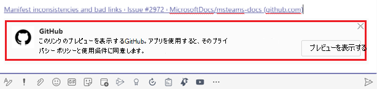
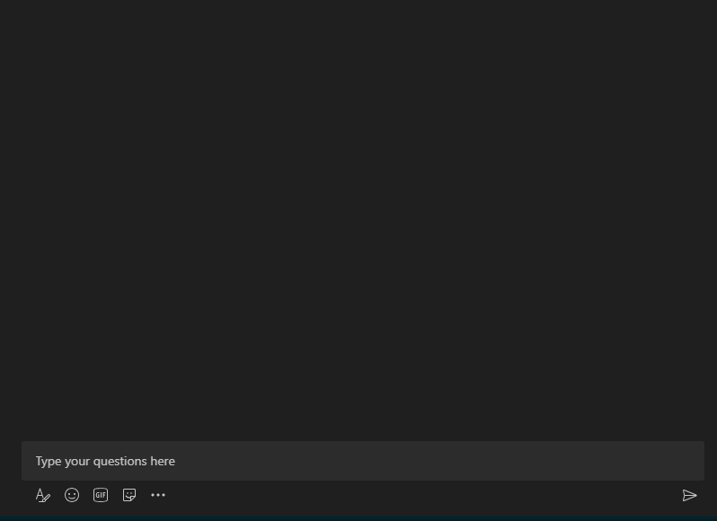

# メッセージング拡張機能

メッセージング拡張機能を使用すると、ユーザーはクライアント内のボタンとフォームを介して web サービスとMicrosoft Teamsできます。 ユーザーは、作成メッセージ領域、コマンド ボックス、またはメッセージから直接、外部システムでアクションを検索または開始できます。 その操作の結果を、リッチ形式のカードMicrosoft Teamsクライアントに返送できます。 このドキュメントでは、メッセージング拡張機能の概要、さまざまなシナリオで実行されるタスク、メッセージング拡張機能の作業、アクションと検索コマンド、リンク解除について説明します。

次の図は、メッセージング拡張機能が呼び出される場所を表示します。

> [!NOTE]
> @mentioning作成ボックスでは、メッセージ拡張機能がサポートされなくなりました。

## メッセージング拡張機能が使用されるシナリオ

| シナリオ | 例 |
|:-----------------|:-----------------|
|一部の外部システムでアクションを実行し、アクションの結果を会話に戻す必要があります。|リソースを予約し、チャネルが予約されたタイム スロットを知るのを許可します。|
|外部システムで何かを見つけて、その結果を会話と共有します。|グループ内の作業項目をAzure DevOps、アダプティブ カードとしてグループと共有します。|
|外部システムで複数の手順または多数の情報を含む複雑なタスクを完了し、その結果を会話と共有します。|Teams メッセージに基づいて追跡システムにバグを作成し、そのバグを Bob に割り当て、そのバグの詳細を示すカードをスレッドに送信します。|

## メッセージング拡張機能の動作を理解する

メッセージング拡張機能は、ホストする Web サービスとアプリ マニフェストで構成され、web サービスがクライアントで呼び出される場所をMicrosoft Teamsします。 Web サービスは、ボット フレームワークのメッセージング スキーマとセキュリティで保護された通信プロトコルを利用します。そのため、Web サービスをボット フレームワークにボットとして登録する必要があります。 

> [!NOTE]
> Web サービスを手動で作成することもできますが、 [ボット フレームワーク SDK を使用](https://github.com/microsoft/botframework-sdk) してプロトコルを操作します。

アプリのアプリ マニフェストMicrosoft Teams、最大 10 個の異なるコマンドで 1 つのメッセージング拡張機能が定義されます。 各コマンドは、アクションや検索などの種類と、呼び出されたクライアント内の場所を定義します。 呼び出し場所は、メッセージ領域、コマンド バー、およびメッセージを作成します。 呼び出し時に、Web サービスは、関連するすべての情報を含む JSON ペイロードを含む HTTPS メッセージを受信します。 JSON ペイロードを使用して応答し、Teamsが次の対話を有効にすることを知る。 

## メッセージング拡張機能のコマンドの種類

メッセージング拡張機能コマンドには、アクション コマンドと検索コマンドの 2 種類があります。 メッセージング拡張機能コマンドの種類は、Web サービスで使用できる UI 要素と対話フローを定義します。 認証や構成などの一部の操作は、両方の種類のコマンドで使用できます。

### 操作コマンド

アクション コマンドは、ユーザーにモーダル ポップアップを表示して情報を収集または表示するために使用します。 ユーザーがフォームを送信すると、Web サービスはメッセージを会話に直接挿入するか、メッセージを作成メッセージ領域に挿入して応答します。 その後、ユーザーはメッセージを送信できます。 複数のフォームを連鎖して、より複雑なワークフローを作成できます。

アクション コマンドは、作成メッセージ領域、コマンド ボックス、またはメッセージからトリガーされます。 コマンドがメッセージから呼び出されると、ボットに送信される最初の JSON ペイロードには、呼び出されたメッセージ全体が含まれます。 次の図は、メッセージング拡張機能アクション コマンド タスク モジュールを表示します。 

### 検索コマンド

検索コマンドを使用すると、ユーザーは、検索ボックスを介して手動で、または監視対象ドメインへのリンクを作成メッセージ領域に貼り付け、検索の結果をメッセージに挿入することで、外部システムを検索できます。 最も基本的な検索コマンド フローでは、最初の呼び出しメッセージには、ユーザーが送信した検索文字列が含まれます。 カードとカードのプレビューの一覧で応答します。 クライアントTeamsは、ユーザーのカード プレビューの一覧を表示します。 ユーザーがリストからカードを選択すると、フルサイズのカードが作成メッセージ領域に挿入されます。

カードは、メッセージの作成領域またはコマンド ボックスからトリガーされ、メッセージからトリガーされません。 メッセージからトリガーできない。
次の図は、メッセージング拡張機能の検索コマンド タスク モジュールを表示します。

> [!NOTE]
> カードの詳細については、「カードは [何か」を参照してください](../task-modules-and-cards/what-are-cards.md)。

## リンク展開

Web サービスは、作成メッセージ領域に URL を貼り付けするときに呼び出されます。 この機能は、リンク解除と呼ばれる機能です。 特定のドメインを含む URL を作成メッセージ領域に貼り付けるときに、呼び出しを受信するためにサブスクライブできます。 お客様の Web サービスは、URL を詳細情報が記載されたカードに "展開" することができ、そのカードでは標準的な Web サイトのプレビュー カードよりも多くの情報を提供できます。 ボタンを追加すると、ユーザーがクライアントから離れることなく、すぐにMicrosoft Teamsできます。
次の画像は、メッセージング拡張機能にリンクを貼り付けするときにリンクの分岐解除機能を表示します。
 

## コード サンプル

| **サンプルの名前** | **説明** | **.NET** | **Node.js** | **Python** |
|------------|-------------|----------------|------------|
| アクションベースのコマンドを使用したメッセージング拡張機能 | このサンプルは、アクション ベースのメッセージング拡張機能を構築する方法を示しています。 | [表示](https://github.com/microsoft/BotBuilder-Samples/tree/master/samples/csharp_dotnetcore/51.teams-messaging-extensions-action) | [表示](https://github.com/microsoft/BotBuilder-Samples/tree/master/samples/javascript_nodejs/51.teams-messaging-extensions-action) | [表示](https://github.com/microsoft/BotBuilder-Samples/tree/main/samples/python/51.teams-messaging-extensions-action) |
| 検索ベースのコマンドを使用したメッセージング拡張機能 | このサンプルは、検索ベースのメッセージング拡張機能を構築する方法を示しています。 | [表示](https://github.com/microsoft/BotBuilder-Samples/tree/master/samples/csharp_dotnetcore/50.teams-messaging-extensions-search) | [表示](https://github.com/microsoft/BotBuilder-Samples/tree/master/samples/javascript_nodejs/50.teams-messaging-extensions-search) | [表示](https://github.com/microsoft/BotBuilder-Samples/tree/main/samples/python/50.teams-messaging-extension-search) |

## 次の手順

> [!div class="nextstepaction"]
> [アクション メッセージング拡張機能のコマンドを定義する](~/messaging-extensions/how-to/action-commands/define-action-command.md)

## 関連項目

* [検索メッセージング拡張機能のコマンドを定義する](~/messaging-extensions/how-to/search-commands/define-search-command.md)
* [メッセージング拡張機能を作成する](../build-your-first-app/build-messaging-extension.md)