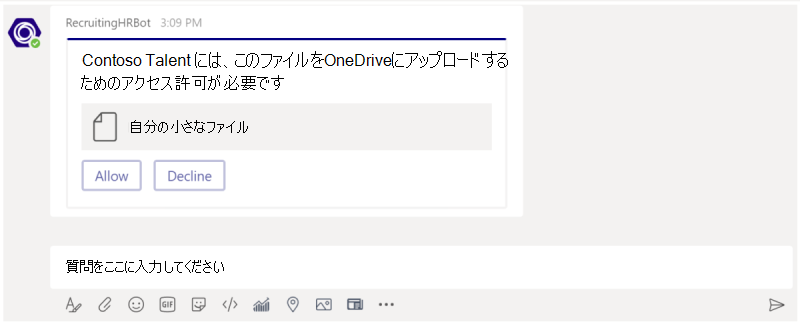
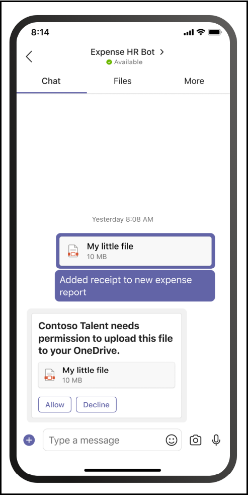

# <a name="send-and-receive-files-through-your-bot"></a>ボットを介してファイルを送受信する

[!include[v3-to-v4-SDK-pointer](~/includes/v3-to-v4-pointer-bots.md)]

ボットからファイルを送受信するには、次の 2 つの方法があります。

* Microsoft Graph API を使用します。 この方法は、Teams のすべてのスコープのボットで機能します。
  * `personal`
  * `channel`
  * `groupchat`
* Teams API を使用します。 これらは、1 つのコンテキストでのみファイルをサポートします。
  * `personal`

## <a name="using-the-microsoft-graph-apis"></a>Microsoft Graph API を使用します

[OneDrive および SharePoint](/onedrive/developer/rest-api/) 用の Microsoft Graph API を使用して、既存の SharePoint ファイルを参照するカードが添付されたメッセージを投稿できます。 Graph API を使用するには、標準の OAuth 2.0 認証フローを通じてユーザーの OneDrive フォルダー (`personal` および `groupchat` ファイルの場合) またはチームのチャネル内のファイル (`channel` ファイルの場合) へのアクセス権を取得する必要があります。 このメソッドは、すべての Teams スコープで機能します。

## <a name="using-the-teams-bot-apis"></a>Teams ボット API の使用

> [!NOTE]
> このメソッドは、`personal` コンテキストでのみ機能します。 `channel` または `groupchat` のコンテキストでは機能しません。

ボットは、Teams API を使用して、`personal` コンテキスト (個人用チャットとも呼ばれます) のユーザーとファイルを直接送受信できます。 これにより、経費報告、画像認識、ファイル アーカイブ、電子署名、およびファイル コンテンツの直接操作を含むその他のシナリオを実装できます。 Teams で共有されるファイルは通常、カードとして表示され、アプリ内で豊富に表示できます。

次のセクションでは、メッセージの送信など、ユーザーが直接操作した結果としてファイル コンテンツを送信する方法について説明します。 この API は、Microsoft Teams ボット プラットフォームの一部として提供されます。

### <a name="configure-your-bot-to-support-files"></a>ファイルをサポートするようにボットを構成する

ボットでファイルを送受信するには、マニフェストの `supportsFiles` プロパティを `true` に設定する必要があります。 このプロパティは、マニフェスト リファレンスの[ボット](~/resources/schema/manifest-schema.md#bots) セクションで説明されています。

定義は次のようになります: `"supportsFiles": true`。 ボットが `supportsFiles` を有効にしない場合、次の機能は機能しません。

### <a name="receiving-files-in-personal-chat"></a>個人用チャットでファイルを受信する

ユーザーがボットにファイルを送信すると、ファイルは最初にユーザーの OneDrive for Business ストレージにアップロードされます。 ボットは、ユーザーのアップロードを通知するメッセージ アクティビティを受信します。 アクティビティには、名前やコンテンツ URL などのファイル メタデータが含まれます。 この URL から直接読み取って、バイナリ コンテンツを取得できます。

#### <a name="message-activity-with-file-attachment-example"></a>ファイル添付の例を使用したメッセージ アクティビティ

```json
{
  "attachments": [{
    "contentType": "application/vnd.microsoft.teams.file.download.info",
    "contentUrl": "https://contoso.sharepoint.com/personal/johnadams_contoso_com/Documents/Applications/file_example.txt",
    "name": "file_example.txt",
    "content": {
      "downloadUrl" : "https://download.link",
      "uniqueId": "1150D938-8870-4044-9F2C-5BBDEBA70C9D",
      "fileType": "txt",
      "etag": "123"
    }
  }]
}
```

次の表で、添付ファイルのコンテンツ プロパティについて説明します。

| プロパティ | 用途 |
| --- | --- |
| `downloadUrl` | ファイルのコンテンツを取得するための OneDrive URL。 この URL から直接 `HTTP GET` を発行できます。 |
| `uniqueId` | 一意のファイル ID。 ユーザーがボットにファイルを送信する場合、これは OneDrive ドライブ アイテム ID になります。 |
| `fileType` | pdf や docx などのファイル拡張子の種類。 |

ベスト プラクティスとして、ユーザーにメッセージを返送してファイルのアップロードを確認する必要があります。

### <a name="uploading-files-to-personal-chat"></a>個人用チャットへのファイルのアップロード

ユーザーへのファイルのアップロードには、次の手順が含まれます。

1. ファイルの書き込み許可を要求するメッセージをユーザーに送信します。 このメッセージには、アップロードするファイルの名前が記載された `FileConsentCard` 個の添付ファイルが含まれている必要があります。
2. ユーザーがファイルのダウンロードを受け入れると、ボットはロケーション URL を使用して *Invoke* アクティビティを受け取ります。
3. ファイルを転送するために、ボットは指定されたロケーション URL に直接 `HTTP POST` を実行します。
4. オプションで、ユーザーが同じファイルのそれ以上のアップロードを受け入れないようにする場合は、元の同意カードを削除できます。

#### <a name="message-requesting-permission-to-upload"></a>アップロードの許可を求めるメッセージ

このデスクトップ メッセージには、ファイルをアップロードするためのユーザー権限を要求する単純な添付オブジェクトが含まれています。



このモバイル メッセージには、ファイルをアップロードするためのユーザー権限を要求する添付オブジェクトが含まれています。



```json
{
  "attachments": [{
    "contentType": "application/vnd.microsoft.teams.card.file.consent",
    "name": "file_example.txt",
    "content": {
      "description": "<Purpose of the file, such as: this is your monthly expense report>",
      "sizeInBytes": 1029393,
      "acceptContext": {
      },
      "declineContext": {
      }
    }
  }]
}
```

次の表で、添付ファイルのコンテンツ プロパティについて説明します。

| プロパティ | 用途 |
| --- | --- |
| `description` | ファイルの説明。 その目的を説明したり、その内容を要約したりするために、ユーザーに表示される場合があります。 |
| `sizeInBytes` | OneDrive で必要なファイル サイズと容量の見積もりをユーザーに提供します。 |
| `acceptContext` | ユーザーがファイルを受け入れると、ボットにサイレントに送信される追加のコンテキスト。 |
| `declineContext` | ユーザーがファイルを拒否したとき、ボットにサイレントに送信される追加のコンテキスト。 |

#### <a name="invoke-activity-when-the-user-accepts-the-file"></a>ユーザーがファイルを受け入れたときにアクティビティを呼び出す

ユーザーがファイルを受け入れると、呼び出しアクティビティがボットに送信されます。 これには、ボットが `PUT` を発行してファイルの内容を転送できる OneDrive for Business プレースホルダー URL が含まれています。 OneDrive URL へのアップロードについては、次の記事をお読みください: [アップロード セッションにバイトをアップロードする](/onedrive/developer/rest-api/api/driveitem_createuploadsession#upload-bytes-to-the-upload-session)。

次の例は、ボットが受け取る呼び出しアクティビティの要約バージョンを示しています。

```json
{
  ...

  "name": "fileConsent/invoke",
  "value": {
    "type": "fileUpload",
    "action": "accept",
    "context": {
    },
    "uploadInfo": {
      "contentUrl": "https://contoso.sharepoint.com/personal/johnadams_contoso_com/Documents/Applications/file_example.txt",
      "name": "file_example.txt",
      "uploadUrl": "https://upload.link",
      "uniqueId": "1150D938-8870-4044-9F2C-5BBDEBA70C8C",
      "fileType": "txt",
      "etag": "123"
    }
  }
}
```

同様に、ユーザーがファイルを拒否すると、ボットは同じ全体的なアクティビティ名で次のイベントを受け取ります。

```json
{
  "name": "fileConsent/invoke",
  "value": {
    "type": "fileUpload",
    "action": "decline",
    "context": {
    }
  }
}
```

### <a name="notifying-the-user-about-an-uploaded-file"></a>アップロードされたファイルについてユーザーに通知する

ユーザーの OneDrive にファイルをアップロードした後、上記のメカニズムを使用するか、OneDrive ユーザー委任 API を使用するかにかかわらず、ユーザーに確認メッセージを送信する必要があります。 このメッセージには、ユーザーがクリックしてプレビューしたり、OneDrive で開いたり、ローカルにダウンロードしたりできる `FileCard` 個の添付ファイルが含まれている必要があります。

```json
{
  "attachments": [{
    "contentType": "application/vnd.microsoft.teams.card.file.info",
    "contentUrl": "https://contoso.sharepoint.com/personal/johnadams_contoso_com/Documents/Applications/file_example.txt",
    "name": "file_example.txt",
    "content": {
      "uniqueId": "1150D938-8870-4044-9F2C-5BBDEBA70C8C",
      "fileType": "txt",
    }
  }]
}
```

次の表で、添付ファイルのコンテンツ プロパティについて説明します。

| プロパティ | 用途 |
| --- | --- |
| `uniqueId` | OneDrive/SharePoint ドライブ アイテム ID。 |
| `fileType` | pdf や docx などのファイルの種類。 |

### <a name="basic-example-in-c"></a>C# の基本的な例

次のサンプルは、ボットのダイアログでファイルのアップロードを処理し、ファイルの同意要求を送信する方法を示しています。

```csharp

// This sample dialog shows two simple flows:
// 1) A silly example of receiving a file from the user, processing the key elements,
//    and then constructing the attachment and sending it back.
// 2) Creating a new file consent card requesting user permission to upload a file.
private async Task MessageReceivedAsync(IDialogContext context, IAwaitable<object> result)
{
    var replyMessage = context.MakeMessage();
    Attachment returnCard;

    var message = await result as Activity;

    // Check to see if the user is sending the bot a file.
    if (message.Attachments != null && message.Attachments.Any())
    {
        var attachment = message.Attachments.First();

        if (attachment.ContentType == FileDownloadInfo.ContentType)
        {
            FileDownloadInfo downloadInfo = (attachment.Content as JObject).ToObject<FileDownloadInfo>();
            if (downloadInfo != null)
            {
                returnCard = CreateFileInfoAttachment(downloadInfo, attachment.Name, attachment.ContentUrl);
                replyMessage.Attachments.Add(returnCard);
            }
        }
    }
    else
    {
        // Illustrates creating a file consent card.
        returnCard = CreateFileConsentAttachment();
        replyMessage.Attachments.Add(returnCard);
    }
    await context.PostAsync(replyMessage);
}


private static Attachment CreateFileInfoAttachment(FileDownloadInfo downloadInfo, string name, string contentUrl)
{
    FileInfoCard card = new FileInfoCard()
    {
        FileType = downloadInfo.FileType,
        UniqueId = downloadInfo.UniqueId
    };

    Attachment att = card.ToAttachment();
    att.ContentUrl = contentUrl;
    att.Name = name;

    return att;
}

private static Attachment CreateFileConsentAttachment()
{
    JObject acceptContext = new JObject();
    // Fill in any additional context to be sent back when the user accepts the file.

    JObject declineContext = new JObject();
    // Fill in any additional context to be sent back when the user declines the file.

    FileConsentCard card = new FileConsentCard()
    {
        AcceptContext = acceptContext,
        DeclineContext = declineContext,
        SizeInBytes = 102635,
        Description = "File description"
    };

    Attachment att = card.ToAttachment();
    att.Name = "Example file";

    return att;
}
```
