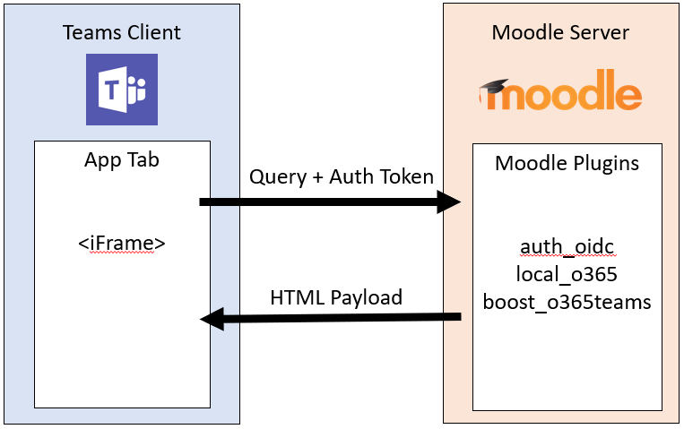

# Moodle LMS のインストール

Moodle は、一般的なオープン ソース学習管理システム (LMS) です。 これで、Microsoft Teams と統合されました。 この統合により、教育者と教師は、Moodle コースを中心に共同作業を行い、成績と課題に関する質問をし、Teams 内で直接通知を更新できます。

IT 管理者が簡単にこの統合をセットアップするために、オープンソースの Microsoft 365 Moodle Plugin は次の機能で更新されます。

* [Azure Active Directory (Azure](https://azure.microsoft.com/services/active-directory/) Active Directory) を使用して Moodle サーバーを自動AD。
* Moodle Assistant ボットの Azure への展開を 1 回クリックで行います。
* チームの自動プロビジョニングと、すべてのチーム登録の自動同期、または [Moodle コース] の選択が可能です。
* [Moodle] タブと [Moodle アシスタント ボット] を同期された各チームに自動インストールします。

この統合で提供される機能の詳細については、「Microsoft Teams と [Moodle」を参照してください](https://education.microsoft.com/resource/3dffb3a8)。

## 前提条件

Moodle アプリケーションをインストールして構成するための前提条件を次に示します。 

1. Moodle 管理者の資格情報。

1. Azure AD資格情報を使用します。

1. 新しいリソースを作成できる Azure サブスクリプション。

**Moodle アプリケーションをインストールして構成するには** 

次の手順を実行して、Moodle アプリケーションをインストールして構成します。 

## 1. Microsoft 365 Moodle プラグインをインストールする

Microsoft Teams での Moodle の統合には、オープンソース [の Microsoft 365 Moodle プラグイン セットが搭載されています](https://github.com/Microsoft/o365-moodle)。 Moodle サーバーにプラグインをインストールするには、次のアプリケーションがインストールされている必要があります。

1. 現在 [の安定版の Moodle](https://download.moodle.org/releases/latest/)です。

1. Moodle [OpenID Connect と](https://moodle.org/plugins/auth_oidc) [Microsoft 365 統合](https://moodle.org/plugins/local_o365) プラグインがダウンロードされ、ローカル コンピューターに保存されます。

   > [!NOTE]
   > Teams の統合には、OpenID Connect プラグインと Microsoft 365 統合プラグインのインストールが必要です。 さらに [、Microsoft 365 Teams テーマ](https://moodle.org/plugins/theme_boost_o365teams) プラグインを強くお勧めします。

1. 管理者として Moodle サーバーにサインインし、左側のナビゲーション パネルにある[設定] ブロックから [サイトの管理] を選択します。

1. [プラグイン] **タブを選択** し、[プラグインのインストール **] を選択します**。

1. [ZIP ファイル **からプラグインをインストールする] セクションで、[** ファイルの **選択] ボタンを選択** します。

1. 左側 **のナビゲーションから [ファイルの** アップロード] オプションを選択し、ダウンロードしたファイルを参照して、[このファイルのアップロード **] を選択します**。

1. 左側の **ナビゲーション パネルから** [サイトの管理] を選択して、管理ダッシュボードに戻ります。 [ローカル プラグイン] まで **下にスクロールし、[Microsoft** **365 統合** ] リンクを選択します。 

> [!IMPORTANT]
>
> * プロセス全体を通してこの一連のページに戻る必要がある場合は、Microsoft 365 Moodle Plugin 構成ページを別のブラウザー タブで開いた状態にしてください。    
> * 既存の Moodle サイトをお持ちではない場合は、Azure [repo](https://github.com/azure/moodle) で Moodle をチェックアウトして、Moodle インスタンスをすばやく展開し、ニーズに合わせてカスタマイズできます。

## 2. Microsoft 365 プラグインと Azure Active Directory の間の接続を構成する (Azure AD)

Moodle を Azure サーバーにアプリケーションとして登録するAD。 PowerShell スクリプトを使用してこのプロセスを完了します。 PowerShell スクリプトは、Microsoft 365 Moodle プラグインAD使用する Microsoft 365 テナント用の新しい Azure AD アプリケーションを準備します。 スクリプトは、Microsoft 365 テナント用にアプリをプロビジョニングし、プロビジョニングされたアプリに必要な返信 URL とアクセス許可を設定し、および `AppID` を返します `Key` 。 生成された Microsoft `AppID` 365 Moodle Plugin セットアップ ページを使用して、Azure サーバー を使用して Moodle サーバー サイトを構成 `Key` AD。

> [!IMPORTANT]
> * PowerShell スクリプトは最新の構成項目で更新されないので、Moodle [3.8.0.4 および 3.9.1](https://docs.moodle.org/39/en/Office365#3.8.0.4_and_3.9.1_release) および [3.8.0.5 および 3.9.2](https://docs.moodle.org/39/en/Office365#3.8.0.5_and_3.9.2_release) リリース ページで説明されている手順に従って構成を手動で完了する必要があります。   
> * PowerShell スクリプトが自動化している手動手順の詳細については、「アプリケーションとして Moodle インスタンスを登録する [」を参照してください](https://docs.moodle.org/34/en/Office365#Register_your_Moodle_instance_as_an_Application)。

### Microsoft Teams 情報フローの [Moodle] タブ

1. [Microsoft 365 統合プラグイン] ページで、[セットアップ] タブ **を選択** します。

1. **[PowerShell スクリプトのダウンロード] ボタンを** 選択し、ローカル コンピューターに保存します。

1. ZIP ファイルから PowerShell スクリプトを準備する必要があります。 ZIP ファイルから PowerShell スクリプトを準備するには、次の手順を実行します。

    1. ファイルをダウンロードして抽出 `Moodle-AzureAD-Powershell.zip` します。
    1. 抽出したフォルダーを開きます。
    1. ファイルを右クリックし、[ `Moodle-AzureAD-Script.ps1` プロパティ] を **選択します**。
    1. [プロパティ **] ウィンドウの**[全般] タブで、ウィンドウの下部にある Security 属性の横にあるボックス `Unblock` をオンにします。
    1. [**OK**] を選択します。
    1. ディレクトリ パスを抽出したフォルダーにコピーします。

1. 管理者として PowerShell を実行します。

    1. [開始] を選択します。
    1. 「PowerShell」と入力します。
    1. [ファイル] を右クリックWindows PowerShell。
    1. [管理者 **として実行] を選択します**。

1. ディレクトリへのパスを where と入力して、未設定 `cd .../.../Moodle-AzureAD-Powershell` `.../...` のディレクトリに移動します。

1. PowerShell スクリプトを実行します。

    1. を `Set-ExecutionPolicy -ExecutionPolicy RemoteSigned -Scope CurrentUser` 入力します。
    1. を `./Moodle-AzureAD-Script.ps1` 入力します。
    1. ポップアップ ウィンドウで Microsoft 365 管理者アカウントにサインインします。
    1. Azure AD アプリケーションの名前 (例: Moodle/Moodle プラグイン) を入力します。
    1. Moodle サーバーの URL を入力します。
    1. スクリプトによって **生成された** アプリケーション ID と **アプリケーション キー** をコピーして保存します。

1. 次に、Microsoft `AppID` `Key` 365 Moodle プラグインとを追加する必要があります。 プラグインの管理ページに戻ります。 フローは、サイト管理と➡ Microsoft 365 ➡管理です。

1. [セットアップ **] タブで** 、前にコピーした **アプリケーション ID** と **アプリケーション** キーを追加し、[変更の保存] **を選択します**。

1. ページが更新された後、新しいセクション [接続方法の選択 **] が表示されます**。 [既定値] というラベルの **付いたチェック ボックスをオン** にし、[変更の **保存] を再度選択** します。

1. ページが更新された後、別の新しいセクション [管理者の同意] が表示 **され&情報が表示されます**。
    1. [ **管理者の同意の提供** ] リンクを選択し、Microsoft 365 グローバル管理者資格情報を入力し、[ **承諾** ] を選択してアクセス許可を付与します。
    1. [Azure ADテナント] **フィールドの横** にある [検出] **ボタンを選択** します。
    1. **OneDrive for Business URL の横にある [** 検出] ボタン **を選択** します。
    1. フィールドが設定された後、もう一度 [変更の **保存] ボタンを** 選択します。

1. [更新] **ボタンを** 選択してインストールを確認し、[変更の保存 **] を選択します**。

1. Moodle サーバーと Azure サーバー間でユーザーを同期AD。 環境に応じて、この段階でさまざまなオプションを選択できます。 次の手順をお試しください。
    1. [同期の設定 **] タブに切り替える**
    1. [Azure **ユーザーとユーザーを同期AD]** セクションで、環境に適用するチェック ボックスをオンにします。 次の項目を選択する必要があります。  

        ✔ Azure のユーザー向け Moodle でアカウントを作成AD。 
        ✔ Azure アカウントのユーザーに対して、Moodle のすべてのアカウントを更新AD。  

    1. [ユーザー **作成の制限] セクション** で、Moodle に同期AD Azure ユーザーを制限するフィルターをセットアップできます。
    1. [ **ユーザー フィールド マッピング]** セクションでは、Azure のユーザー プロファイルADを Moodle ユーザー プロファイル フィールド マッピングにカスタマイズできます。
    1. [Teams **の同期]** セクションで、既存の Moodle コースの一部またはすべてについて、チームなどのグループを自動的に作成するために選択できます。

> [!NOTE]
> Moodle [Cron はタスク](https://docs.moodle.org/310/en/Cron) スケジュールに従って実行されます。 既定のスケジュールは 1 日 1 回です。 ただし、すべての同期を維持するには、cron の実行頻度を高くする必要があります。

13. cron ジョブ [を検証し](https://docs.moodle.org/310/en/Cron)、最初の実行に対して手動で実行するには **、[Azure** とユーザーを同期する] セクションの [スケジュールされたタスクの管理] ADします。 これにより、[スケジュールされたタスク] **ページに移動** します。

    1. 下にスクロールして、Azure ユーザーと **同期するジョブをADし、[今すぐ** 実行] **を選択します**。
    1. 既存のコースに基づいてグループを作成する場合は **、Microsoft 365** ジョブでユーザー グループの作成を実行することもできます。

1. プラグインの管理ページに戻ります。 ナビゲーション フローは、サイト管理➡ Microsoft 365 Integratio ➡プラグインです。 次に、[Teams の設定 **] ページを選択** します。 Teams アプリの統合を有効にするには、いくつかの設定を構成する必要があります。

    1. **OpenID Connect を有効にするには**、[認証の管理] リンクを選択し、灰色で表示されている **場合は、OpenId Connect** 行の目のアイコンを選択します。 
    1. フレームの埋め込みを有効にする。 **[HTTP セキュリティ] リンクを選択** し、[フレームの埋め込みを許可する] の **横にあるチェック ボックスをオンにします**。
    1. Moodle API 機能を有効にする Web サービスを有効にする。 [高度 **な機能] リンクを** 選択し、[Web サービスを有効にする] の横にある **チェック ボックスがオンになっていることを** 確認します。
    1. Microsoft 365 の外部サービスを有効にする。 次に、[ **外部サービス] リンク** を選択します。  

        ✔ **[Moodle Microsoft 365 Webservices] 行で [編集] を選択** します。   
        ✔ [有効] の横にあるチェック ボックスを **オンにし、[** 変更の保存] **を選択します。**

    1. 認証されたユーザーのアクセス許可を編集して、Web サービス トークンの作成を許可します。 [編集] **役割の [認証されたユーザー] リンクを選択** します。 下にスクロールして、[Web サービス **トークンの作成] 機能を見** つけて、[許可] チェック ボックス **をオン** にします。

## 3. Moodle アシスタント ボットを Azure に展開する

Microsoft Teams の無料の Moodle アシスタント ボットは、教師と学生が Moodle のコース、課題、成績、その他の情報に関する質問に答えるのに役立ちます。 ボットは、Teams 内の学生と教師にも、Moodle 通知を送信します。 ボットは、Microsoft が管理するオープン ソース プロジェクトであり [、GitHub で利用できます](https://github.com/microsoft/Moodle-Teams-Bot)。

> [!NOTE]
> * このセクションでは、リソースを Azure サブスクリプションに展開する必要があります。 無料レベルを使用して構成されたすべての **リソース ウェア** 。 ボットの使用状況に応じて、これらのリソースをスケーリングする必要があります。
> * ボットなしで [Moodle] タブを使用するには [、4 にスキップします](#4-deploy-your-microsoft-teams-app)。

### Moodle ボットの情報フロー

ボットをインストールするには、Microsoft Identity Platform に [ボットを登録する必要があります](https://identity.microsoft.com/Landing)。 これにより、ボットは Microsoft エンドポイントに対して認証できます。 

**ボットを登録するには:**

1. プラグインの管理ページに移動します。 [プラグイン **] に移動します**。 [Microsoft **365 Integration] で、[Teams** の設定] **タブを選択** します。

1. [Microsoft **アプリケーション登録ポータル] リンクを選択** し、Microsoft ID でサインインします。

1. アプリの名前 (MoodleBot など) を入力し、[作成] ボタン **を選択** します。

1. アプリケーション ID **をコピーし** 、[チームの設定] ページの **[ボット アプリケーション ID]** フィールド **に貼り付** けます。

1. [新しい **パスワードの生成] ボタンを** 選択します。 生成されたパスワードをコピーし、[チームの設定] ページの [ **ボット アプリケーション** パスワード] フィールド **に貼り付** けます。

1. フォームの下部までスクロールし、[変更の保存] **を選択します**。

アプリケーション ID とパスワードを生成すると、次にボットを Azure に展開します。

> [!div class="checklist"]
> * [Azure **に展開]** ボタンを選択し、ボット アプリケーション ID、ボット アプリケーション パスワード、Moodle シークレットなどの必要な情報を含むフォームに入力します。[チームの設定] ページに **表示** されます。 Azure の情報は、[セットアップ] **ページに表示** されます)。 
> * フォームが完成した後、チェック ボックスをオンにして、利用規約に同意します。
> * [購入] **ボタンを選択** します。 すべての Azure リソースが無料層に展開されます。

リソースが Azure への展開を完了したら、メッセージング エンドポイントを使用して Microsoft 365 Moodle プラグインを構成する必要があります。 Azure でボットからエンドポイントを取得する必要があります。

**メッセージング エンドポイントを使用して Microsoft 365 Moodle プラグインを構成する**  
1. [Azure portal](https://portal.azure.com) にサインインします。

1. 左側のウィンドウで、[リソース グループ **] を** 選択し、ボットの展開中に使用または作成したリソース グループを選択します。

1. グループ内 **のリソースの一** 覧から WebApp Bot リソースを選択します。

1. [概要 **] セクションからメッセージング** エンドポイント **をコピー** します。

1. Moodle で、Microsoft  365 Moodle プラグインの [チーム設定] ページを開きます。

1. [ボット **エンドポイント] フィールド** に、コピーした URL を貼り付け、単語メッセージを *webhook に変更します*。  URL は次のように表示されます。 `https://botname.azurewebsites.net/api/webhook`

1. [変更 **の保存] を選択します**。

1. 変更を保存した後、[チームの設定] タブに戻り、[マニフェスト ファイルのダウンロード] ボタンを選択し、さらに使用するためにアプリ マニフェスト パッケージをコンピューターに保存します。

## 4. Microsoft Teams アプリを展開する

ボットが Azure に展開され、Moodle サーバーと話をするように構成した後、Microsoft Teams アプリを展開する必要があります。 これを行うには、前の手順の [Microsoft 365 Moodle Plugin Team Settings] ページからダウンロードしたアプリ マニフェスト ファイルを読み込む必要があります。

アプリをインストールする前に、外部アプリとアプリのアップロードを有効にする必要があります。 これを行うには、「Teams Prepare your Microsoft [365 テナント」のドキュメントの手順に従](../concepts/build-and-test/prepare-your-o365-tenant.md) います。 次の手順を実行して、アプリを展開できます。 

**アプリを展開するには**

1. **Microsoft Teams を開きます**。 

1. ナビゲーション バー **の** 左下の領域にある [アプリ] アイコンを選択します。

1. オプションの **一覧から [カスタム アプリのアップロード** ] リンクを選択します。

   > [!NOTE]
   > グローバル管理者としてログインしている場合は、組織のアプリ カタログにアプリをアップロードするオプションが必要です。それ以外の場合は、メンバーであるチームのアプリのみを読み込む必要があります。

4. 以前に `manifest.zip` ダウンロードしたパッケージを選択し、[保存] を **選択します**。 アプリ マニフェスト パッケージをダウンロードしていない場合は、Moodle のプラグイン構成ページの [ **チーム** 設定] タブからダウンロードできます。

アプリがインストールされたので、アクセスできる任意のチャネルにタブを追加できます。 これを行うには、チャネルに移動し、 **プラス記号** (➕) を選択し、一覧からアプリを選択します。 プロンプトに従って、チャネルへの Moodle コース タブの追加を完了します。

## 5. Microsoft Teams で Moodle タブの自動作成を許可する

[Moodle] タブは Microsoft Teams で手動で作成しますが、チームがコース同期から作成されると、自動的に作成できます。 これを行うには、アップロードされた Microsoft Teams アプリの ID を Moodle で構成する必要があります。

1. Microsoft Teams を開きます。

1. ナビゲーション バーの左下の領域から [アプリ] アイコンを選択します。

1. アップロードした **Moodle アプリを見つけて➡** オプション アイコン **を** 選択し➡コピー リンクを **選択します**。

1. テキスト エディターで、コピーしたコンテンツを貼り付けます。 これは、ht ファイルなどの URL を含&#8203;tps://teams.microsoft.com/l/app/00112233-4455-6677-8899-aabbccddeeff。 Url の最後の部分 (Microsoft Teams アプリの ID など)  `00112233-4455-6677-8899-aabbccddeeff` をコピーします。

1. Moodle で、Microsoft 365 **Moodle** プラグインの構成ページから [Teams Moodle アプリ] タブを開きます。

1. Microsoft Teams アプリの ID を [Moodle アプリ ID] フィールドに貼り付けて、変更を保存します。

Moodle コースを同期すると、Microsoft Teams は自動的にチームに Moodle アプリをインストールし、Teams の [全般] チャネルに [Moodle] タブを作成し、同期する Moodle コースのコース ページを含む構成を行います。 これで、Microsoft Teams から直接、Moodle コースの操作を開始できます。

機能の要求やフィードバックを共有するには、User Voice [ページをご覧ください](https://microsoftteams.uservoice.com/forums/916759-moodle)。

## 関連項目

> [!div class="nextstepaction"]
> [Web アプリを統合する](~/samples/integrate-web-apps-overview.md)

> [!div class="nextstepaction"]
> [Moodle](https://moodle.org/)

> [!div class="nextstepaction"]
> [Moodle のドキュメント](https://docs.moodle.org/34/en/Installing_plugins).
