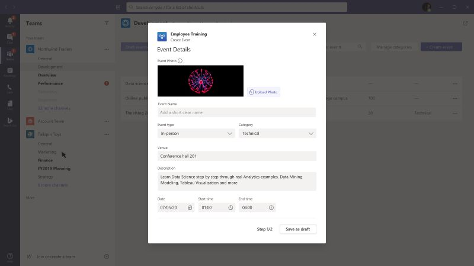
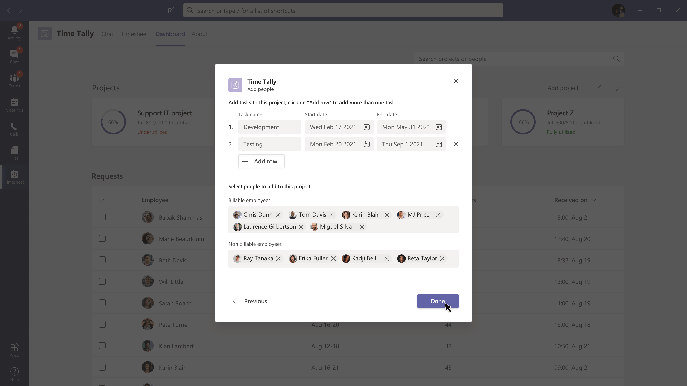
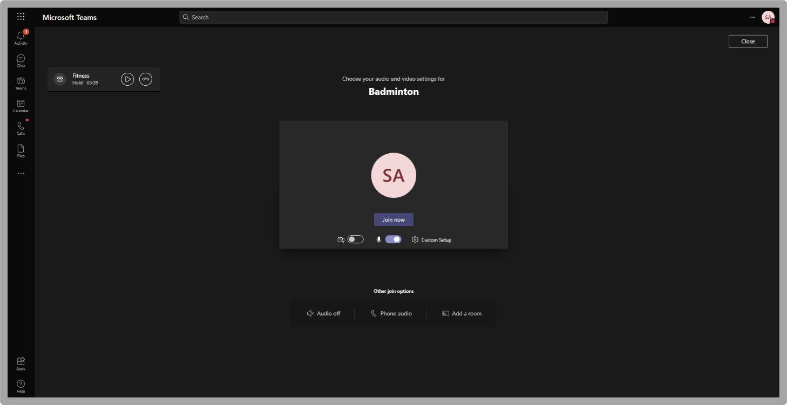
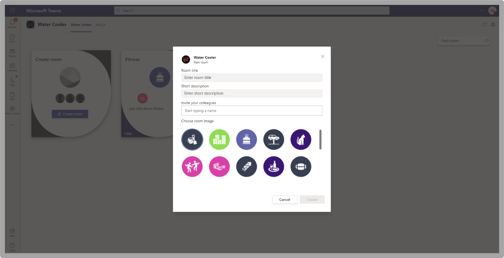
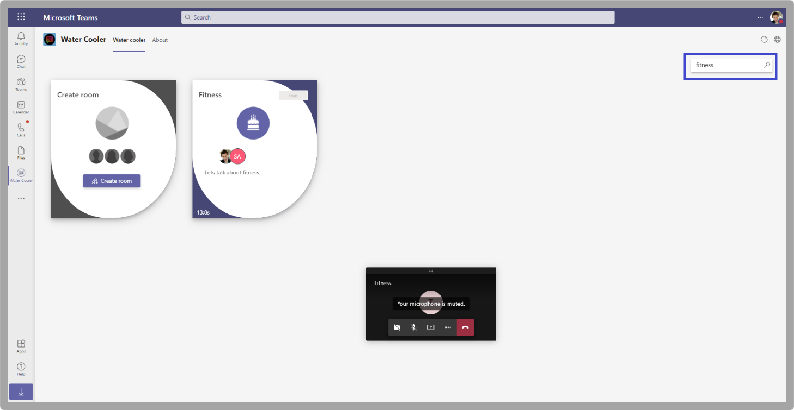

# Microsoft Teams 用のアプリ テンプレート

アプリ テンプレートは、オープン ソースで、GitHub で利用できる Microsoft Teams 用の完全なアプリの例です。 各アプリ テンプレートには、組織用に展開してインストールするための詳細な手順が記載されています。 また、すぐにインストールして使用を開始できるサンプル アプリも提供します。 完全なソース コードも利用できます。これにより、詳細を確認したり、コードをフォークしたりして、特定の要件を満たして変更することができます。
すべてのアプリテンプレートは [MIT ライセンス](https://github.com/OfficeDev/microsoft-teams-apps-eprescription/blob/master/LICENSE)の条件下で提供されます。

> [!NOTE] 
> ユーザーと組織のアプリ テンプレートから作成されたアプリをライセンスおよびサポートする必要があります。

**&#9734; 新たにリリースされたアプリ テンプレートを示します。**

### 主な利点

* **クラウドに直接展開:** すべてのアプリ テンプレートには展開スクリプトが含まれており、必要なサービスをすべて Microsoft Azure または Power Platform にホストすることができます。 
* **推奨サンプルコード:** アプリ テンプレートは、セキュリティとインフラストラクチャに関して推奨されるベスト プラクティスに準拠しています。 コミュニティから提出されたアプリ テンプレートの変更はすべて、適合性を確認するためにレビューされます。
* **カスタマイズ可能で拡張可能:** すべてのアプリ テンプレートは最小限の構成で展開しますが、コード ベーススクリプトと展開スクリプト全体が提供され、独自のニーズに合わせて簡単にカスタマイズまたは拡張できます。
* **詳細なドキュメント:** すべてのアプリ テンプレートには、ソリューション アーキテクチャ、展開、構成の手順に関するエンドツーエンドのドキュメントが付属しています。  

## 導入ボット 

導入ボットは、PVA 用の Power Virtual Agent で構築されたユーザー Teamsボットです。 これは、FAQ Plus の PVA バージョンと見なされます。 Adoption Bot は、Microsoft 365 と Teams に関する 100 以上の一般的な質問に回答しています。 既存のトピックの編集、独自のトピックの追加、および既存の FAQ の取り込みが可能です。 ユーザーが追加のヘルプを必要とする場合、Adoption Bot は専門家への接続や、プレミアム フロー コネクタを使用して拡張し、サービス チケットを開くことができます。 このボットは、自己インストールまたは導入ハブなどのカスタム アプリに組み[込まれる。](https://github.com/akporzondek/adoption_hub)

[GitHub で入手する](https://github.com/OfficeDev/microsoft-teams-apps-adopt-bot)

## 導入ツール - チャンピオン管理プラットフォーム &#9734;

チャンピオン管理プラットフォーム (CMP) アプリ テンプレートを使用すると、チームワーク チャンピオンの管理、拡大、刺激を受け、より多くのことを達成できます。 このアプリ テンプレートは、SharePoint Frameworkに構築され、チーム内のタブに読み込まれます。 グループは、このツールを利用して、プログラムメンバーシップの管理、ログ記録用のランキングとイベントの種類、およびプログラム参加者にデジタル バッジをオーバーレイするツールを提供できます。

[GitHub で入手する](https://github.com/OfficeDev/microsoft-teams-apps-champion-management)

## 導入ツール- Microsoft 365 ラーニングパス (はじめに) &#9734;

アプリ はじめにテンプレートを使用すると、アプリの内部にMicrosoft 365学習経路の力をMicrosoft Teams。 このアプリ テンプレートを使用すると、特定のトレーニング ページや他のイントラネットアセットに簡単にアクセスし、コンテンツを直接読み込Teams。 また、会社のブランドに合わせてアプリ名やロゴを変更することもできます。

[GitHub で入手する](https://github.com/msft-teams/tools/tree/master/M365%20Learning%20Pathways)

## 予定マネージャー 

Appointment Manager は、企業が Teams を経由して消費者とのバーチャルの予定を作成、管理、実施するための Teams アプリ テンプレートです。 コンシューマーからの新しい予定要求は、Teamsチャネルに表示され、チームのスタッフにすばやく割り当て、再割り当てされます。 予定の要求は、カスタム タブを使用してチームレベルまたは個人レベルで表示されます。 すべての予定は Teams のオンライン会議に関連付けられているため、スタッフと消費者は簡単に予定された時間に会議に参加することができます。

アプリ テンプレートは Microsoft Bookings と統合されており、簡単に予約管理ができます。 スケジュールされた予定は、自動的に割り当てられたスタッフのカレンダーに表示され、消費者は会議のリンクが埋め込まれたカスタマイズ可能なメール通知とアラームを受信することができます。

[GitHub で入手する](https://github.com/OfficeDev/microsoft-teams-apps-appointment-manager)

## Ask Away

Ask Away は、Microsoft Teams[内](../bots/what-are-bots.md)の Q セッションと呼ばれる質問と回答を実行&ボットTeams。 チーム メンバーは、Ask Away ボットを使用して、同僚が共有する質問を送信して賛成票を投じることができます。これにより、Q&A ホストは、チャネルまたはチャット内で最も重要な質問を簡単に収集できます。 ボットは、会議でリアルタイムの Q&セッションをTeamsし、出席者がチャットを通じてライブで質問を提出できます。

[GitHub で入手する](https://github.com/OfficeDev/microsoft-teams-apps-askaway)

:::row:::
  :::column span="2":::
      
:::column-end:::
:::row-end:::

## アソシエイト インサイト

アソシエイト インサイトは、現場担当者が顧客の意見、感情、認識を直接キャプチャして送信できるようにする [Power Apps](/powerapps/maker/canvas-apps/embed-teams-app) テンプレートです。 多くの場合、現場担当者は、一対一の連絡窓口で顧客と関わりを持つ最初の会社の代表者です。 収集されたデータは、製品の改善とカスタマー エクスペリエンスの向上のために、Power BI Teams タブを通じてなど、ビジネス チームによって共有され、共同で使用されます。

[GitHub で入手する](https://github.com/OfficeDev/microsoft-teams-apps-associateinsights)

:::row:::
  :::column span="2":::
      
:::column-end:::
:::row-end:::
:::row:::
:::column span="2":::
    
:::column-end:::
:::row-end:::

## 勤怠

[出席] アプリは[、Power Apps](/powerapps/maker/canvas-apps/embed-teams-app)ピン留めされた [出席] タブです。 学習環境やトレーニング環境などの設定でプレゼンスを記録するように設計されています。 ユーザーは、過去 30 日間までの出席をマークまたは編集し、グループ全体または個々の出席者の要約された出席レポートを表示できます。 チームの出席の詳細については[、「Get it on GitHub」 を参照してください](https://github.com/OfficeDev/microsoft-teams-apps-attendance)。

次の図は、出席アプリのデモを表示します。  

## 会議室予約

Book-a-room はMicrosoft Teams ボットであり、ユーザーは現在の時刻から 30 分、60 分、または 90 分の会議室をすばやく検索して予約できます。 既定の時間は 30 分です。 会議室予約ボットは、個人の会話または一対一の会話を対象としています。 Book-a-room アプリの詳細については[、「Get it on GitHub」 を参照してください](https://github.com/OfficeDev/microsoft-teams-apps-bookaroom)。  
次の図は、Book-a-room デモを表示します。

## Building Access

Building Access は Microsoft [Power Platform](https://powerapps.microsoft.com/blog/now-in-preview-customize-teams-with-built-in-power-platform-capabilities/) ベースのアプリで、施設のディレクターが従業員のオンサイトプレゼンスを管理、追跡、および報告することで、占有のしきい値と社会的な不備の規範を構築する管理をサポートします。 Microsoft [Power Apps](/powerapps/powerapps-overview)、[Power Automate](/power-automate/getting-started)を使用して構築されたこのアプリは、Microsoft Teams と緊密に統合されており、組織が建物の準備状況を判断し、現場アクセスの適格基準を確立し、将来の計画のための分析情報を収集できるようにします。

[GitHub で入手する](https://github.com/OfficeDev/microsoft-teams-apps-buildingaccess)

:::row:::
   :::column span="":::
     
   :::column-end:::
   :::column span="":::
      
   :::column-end:::
:::row-end:::

## Celebrations

お祝いは、Teams誕生日、記念日、その他の定期的なイベントをチーム メンバーが祝うのに役立つアプリです。 チーム メンバー全員の特別な日を思い出し、イベント作成時に選択されたすべてのチームに友好的なメッセージを送信して、チーム メンバーがその日に特別な気分になるようにします。

このアプリでは、チームメンバー全員が簡単にイベントを追加および表示できるようにするためのインターフェイスが用意されています。また、イベントを共有するチームをユーザーが選択できるようにします。

[GitHub で入手する](https://github.com/OfficeDev/microsoft-teams-celebrations-app)

## Checklist

Checklist は、チャットやチャネルで共有チェックリストを作成することで、チームと共同作業を行うことができる、Microsoft Teams のカスタム [メッセージング拡張機能](../messaging-extensions/what-are-messaging-extensions.md)アプリです。 このアプリは、デスクトップ ブラウザー Teams iOS、Android など、すべてのプラットフォーム クライアントでサポートされています。 アプリは、サブスクリプションの一部として展開Microsoft 365です。  

[GitHub で入手する](https://github.com/OfficeDev/microsoft-teams-checklist-app)

:::row:::
:::column span="2":::
      
:::column-end:::
:::row-end:::

## Classroom ドロップイン 

Classroom Drop-in は、システム リーダーがクラス チームを見つけ、仮想教室を意味し、必要に応じて指定されたドロップイン期間にこれらのクラス チームに自分自身または他のユーザーを追加できる、Microsoft [Power Platform](https://powerapps.microsoft.com/blog/now-in-preview-customize-teams-with-built-in-power-platform-capabilities/)ベースのアプリです。 Microsoft [Power Apps](/powerapps/powerapps-overview) と [Power Automate](/power-automate/getting-started) を使用して構築されたアプリは、Microsoft Teams と深く統合されており、教育機関は、ビジネス要件に応じてクラスチームに関連する関係者へのアクセスを提供することで、ハイブリッドな学習環境での運用を最適化することができます。

[GitHub で入手する](https://github.com/OfficeDev/microsoft-teams-apps-classroom-dropin)

## 社内コミュニケーター

社内コミュニケーター アプリを使用すると、企業チームはチャットを介して複数のチームまたは多数の従業員向けのメッセージを作成および送信できます。これにより、組織は共同作業を行う場所で従業員に連絡できます。 このテンプレートは、新しいイニシアチブのお知らせ、従業員のオンボーディング、モダン ラーニング、開発または組織全体のブロードキャストなど、複数のシナリオに利用できます。

このアプリは、指定されたユーザーがメッセージを作成、プレビュー、共同作業、送信するための簡単なインターフェイスを提供します。

これは、メッセージを確認または操作したユーザーの数に関するカスタム テレメトリなどのカスタム ターゲット通信機能を構築するための基盤を提供します。

[GitHub で入手する](https://github.com/OfficeDev/microsoft-teams-company-communicator-app)

## Contact Group Lookup

連絡先グループ参照アプリは、組織の連絡先グループ (以前は配布リストまたは通信グループと呼ばれる) の作成、アクセス、管理に便利で便利な方法を提供します。 ユーザーは、すべての Teams 環境内で、グループ メンバーの表示とチャット、メンバー ステータスの表示、連絡先グループの選択したメンバーとのグループ チャットの作成をすばやく行うことができます。

[GitHub で入手する](https://github.com/OfficeDev/microsoft-teams-app-contactgrouplookup)

:::row:::
:::column span="2":::
      
:::column-end:::
:::row-end:::
:::row:::
:::column span="2":::
    
:::column-end:::
:::row-end:::

## 同僚の感謝 

Microsoft Teams の Co-worker Appreciation テンプレートを使用すると、ユーザーは Teams のコンテキストで同僚の業績を認識することができます。 共同作業者が同僚へのリワードを選択すると、受信者や他のチーム メンバーがチャネルの会話でタグ付けされ、チャネルのリワードの詳細についての通知を受け取ることができます。 アワードは Teams アプリに記録され、安全で携帯性に優れ、簡単に共有することができます。 これは、ランキングを使用して、PowerApps ベースのバージョンの Open Badges アプリ テンプレートと見なされます。

[GitHub で入手する](https://github.com/OfficeDev/microsoft-teams-apps-coworker-appreciation)

## CrowdSourcer

CrowdSourcer は、グループ メンバーから共同で調達された情報をチームに照会する [Microsoft Teams ボット](../bots/what-are-bots.md)です。 参加者が積極的に参加し、楽しく役立つ情報リソースに貢献できる一方で、よく寄せられる質問に答えるのに役立ちます。

[GitHub で入手する](https://github.com/OfficeDev/microsoft-teams-crowdsourcer-app)

## カスタム ステッカー

自己表現は健全なチーム文化の中核です。 このアプリ テンプレートは、ユーザーが Microsoft Teams 内で、カスタム ステッカーや GIF を使用できるようにする[メッセージング拡張機能](~/messaging-extensions/what-are-messaging-extensions.md)です。 このテンプレートは、構成アクセス権を持つユーザーがユーザーに必要な GIF、ステッカー、画像をアップロードできる簡単な Web ベースの構成エクスペリエンスを提供し、チーム全体で選択したステッカーのセットを使用できます。

このアプリでは、ストレージと共有メカニズムとして、SharePoint サイトまたは個々のチャネルにアクセスすることなく、チーム間で画像、GIF、ステッカーを簡単に共有できます。 たとえば、製品チームは、プログラムを使用して、製品イメージと GIF を簡単にソーシャル メディア、マーケティング、および営業チームに共有できます。 また、新しい画像や GIF が利用可能なときに、特定のチームまたは個人に通知フローをトリガーすることで、このアプリを拡張することもできます。

[GitHub で入手する](https://github.com/OfficeDev/microsoft-teams-stickers-app)

## 従業員のアイデア

Employee Ideas アプリは、Azure ベースの Great Ideas アプリ テンプレートの PowerApps 版です。 このアプリでは、Teams ユーザーがアイデア キャンペーンの設定や構成を行うことができます。 アイデア キャンペーンとは、共通のテーマを中心にアイデアをグループ化するためのカテゴリーです。

Teamsユーザーは、次のアクティビティを実行できます。

* 従業員がアイデアごとに提出する必要がある標準提出フォームを構成します。 
* キャンペーンのアイデアやリストを見直して管理します。
* キャンペーンを変更、削除します。
* アイデアのランキングをレビューします。
* 優先順位の高いアイデアに投票し、共有します。
* キャンペーンのアイデアを送信します。
* 他のチーム メンバーのアイデアを表示します。
* 最も気に入ったアイデアに投票します。
* キャンペーンの他のユーザーと比較して、自分のアイデアのパフォーマンスをレビューします。

[GitHub で入手する](https://github.com/OfficeDev/microsoft-teams-apps-employeeideas)

 

## E-Prescriptions 

E-Prescriptions は、Power Appsに電子処方箋を発行するプロセスを自動化することで、遠隔医療と仮想ケアを強化する、ユーザーベースのアプリです。 医療専門家は、Teams プラットフォーム内で直接、予定をすばやく確認し、電子処方箋を生成し、電子処方箋を添付した電子メールを患者に送信できます。

[GitHub で入手する](https://github.com/OfficeDev/microsoft-teams-apps-eprescription) 

:::row:::
:::column span="2":::
    ![E-Prescriptions アプリのスクリーンショット。 医療提供者が [生成] ボタンを選択して、患者の処方箋を注文する方法を示します。](../assets/images/e-prescriptions-app-template.png)  
:::column-end:::
:::row-end:::
:::row:::
:::column span="2":::
    
:::column-end:::
:::row-end:::

## Employee Training 

従業員のトレーニングは、Microsoft Teams組織の学習およびトレーニング イベントを簡単に公開、追跡、および促進できるアプリです。  このアプリを使用すると、イベント プランナーは、イベント登録者にリマインダーと通知を送信し、従業員は、今後のイベントへの関心を示し、現在のイベントを更新し、Teams メッセージング拡張機能を通じて同僚とイベントの詳細を共有できます。

[GitHub で入手する](https://github.com/OfficeDev/microsoft-teams-apps-employeetraining)

:::row:::
:::column span="2":::
    **従業員トレーニング イベントの表示**   
:::column-end:::
:::row-end:::
:::row:::
:::column span="2":::
    **従業員トレーニング イベントの作成** 
:::column-end:::
:::row-end:::

## 専門家検索

専門家検索は、スキル、興味、教育属性に基づいて特定の組織メンバーを識別する [Microsoft Teams ボット](../bots/what-are-bots.md)です。 メンバーは、ユーザー プロファイルのキーワード検索に一致する組織内Azure Active Directory見つける。

[GitHub で入手する](https://github.com/OfficeDev/microsoft-teams-apps-expertfinder)

## FAQ プラス

会話型 Q&A ボットは、ユーザーからよく寄せられる質問に回答する簡単な方法です。 しかし、ほとんどのボットは、ボットが失敗してもループに人間がいないので、ユーザーと有意義なやり取りを行うのに失敗します。 FAQ ボットは フレンドリーな Q&A ボットですが、ボットが役立たないときには人間が介在するようにします。 ボットに質問をすることができ、知識ベースに含まれている場合、ボットは回答を返します。 そうでない場合、ボットはユーザーがクエリを送信できるようにします。クエリは、チーム内からの通知に基づいて行動することでサポートを提供するのに役立つ、事前に構成された専門家チームに投稿されます。

> [!NOTE]
> **FAQ プラス** の最新リリースは、専門家チームが以下を完了できるようにすることにより、改善された Q&A 解決をサポートします。
>
> &#x2714; メッセージ拡張機能を使用して、ナレッジベースに新しい Q&A を直接追加します。
>
> &#x2714; ボットによって追加された Q&A ペアを編集および削除します。
>
> &#x2714; Q&A の改訂履歴を追跡します。
>
> &#x2714; アダプティブ カードとして表示する追加の詳細を含む回答を [構成します](../task-modules-and-cards/cards/cards-reference.md#adaptive-card)。
>
[GitHub で入手する](https://github.com/OfficeDev/microsoft-teams-apps-faqplusv2)

## サポート アプリの取得

Get Support app は、管理者からサポートを要求する任意のMicrosoft Teamsを有効にするために、管理者を使用している組織によって使用されます。 このアプリには、次の機能が含まれています。
* Power App からさまざまなカテゴリに関するサポートを要求する。
* 誰が割り当てられているか通知する通知を要求者に送信します。
* 割り当てられた監督者に、支援が必要なユーザーを通知する通知。 
* ユーザーとユーザーのエスカレーションとパターンSharePoint分析Power BI。

[GitHub で入手する](https://github.com/OfficeDev/microsoft-teams-app-get-support/)

## Goal Tracker

Goal Tracker アプリは、Microsoft Teams内で、組織の目標の設定、進捗状況の観察、成功の確認をサポートする包括的なソリューションです。 このアプリを使用すると、ユーザーは、専門家、個人、チーム レベルで目標を設定、追跡、更新できます。 また、チーム メンバーは、集中力を維持し、順調に進めるために、タイムリーなリマインダーと状態の更新情報を受け取ります。

[GitHub で入手する](https://github.com/OfficeDev/microsoft-teams-app-goaltracker)

:::row:::
  :::column span="2":::
      
:::column-end:::
:::row-end:::
:::row:::
:::column span="2":::
    
:::column-end:::
:::row-end:::

## Great Ideas

Great Ideas アプリは、組織内のイノベーションと創造性をサポートし、力を与えます。 このアプリを使用すると、Microsoft Teams 内で、従業員は同僚やリーダーシップとアイデアを共有し、新しい報告を検索し、同僚の検討のために貢献にスポットライトを当て、最良の提案に投票することができます。

[GitHub で入手する](https://github.com/OfficeDev/microsoft-teams-apps-greatideas)

:::row:::
  :::column span="2":::
      
:::column-end:::
:::row-end:::
:::row:::
:::column span="2":::
    
:::column-end:::
:::row-end:::

## グループ アクティビティ

グループ アクティビティは、チームの所有者が Microsoft Teamsの コンテキスト内でアクティビティ グループをすばやく作成し、コラボレーション ワークフローを管理するのを容易にする Microsoft Teams アプリです。 アクティビティ作成者は、アクティビティを作成し、チーム メンバーをグループにランダムに配布し、オプションで、アクティビティが完了するまでボットにリマインダーを送信させることができます。

[GitHub で入手する](https://github.com/OfficeDev/microsoft-teams-apps-groupactivities)

:::row:::
  :::column span="2":::
      
:::column-end:::
:::row-end:::
:::row:::
:::column span="2":::
    
:::column-end:::
:::row-end:::

## グループConnect &#9734;

グループ Connectは、Microsoft Teamsメンバーが従業員グループを検出し、従業員グループに関連する情報を見つけるのに役立つアプリです。 このアプリには、組織のリーダーがグループ、イベント、リソースに関して従業員と通信するための豊富な機能が組み込みされています。 Group Connectアプリは、グループ内でのネットワークと一致を促進するために、目的の頻度でグループ メンバーを互いに一致します。 Group Connect アプリを活用して、組織内の従業員グループの育成に役立つ方法の詳細については、「GitHub のアプリ」を参照してください。

[GitHub で入手する](https://github.com/OfficeDev/microsoft-teams-apps-groupconnect)

## Grow Your Skills

Grow Your Skills アプリは、従業員が組織の補助的なプロジェクトに貢献し、新しいスキルを同時に学習できるようにして、プロフェッショナルな成長と開発をサポートします。 すべての Teams 環境内で、従業員はこのアプリを使用して、自分の興味に合った機会を見つけ、同僚との有意義な共同作業を行い、新しいレベルの専門知識と能力を取得できます。

[GitHub で入手する](https://github.com/OfficeDev/microsoft-teams-apps-growyourskills)

:::row:::
  :::column span="2":::
      
:::column-end:::
:::row-end:::
:::row:::
:::column span="2":::
    
:::column-end:::
:::row-end:::

## HR サポート

HR サポート ボットは、フレンドリーな Q&ボットで、サポート担当者または専門家がサポートできない場合に、人事チームからループに連れて行くボットです。 ボットに質問をすることができ、知識ベースに含まれている場合、ボットは回答を返します。 そうでない場合、ボットはユーザーがクエリを送信できるようにします。クエリは、チーム内からの通知に基づいて行動することでサポートを提供するのに役立つ、事前に構成された専門家チームに投稿されます。 さらに、ボットは、質問で事前に構成されたタグを検索して、推奨される人事ポリシーまたは質問へのリンクを提案します。 これらのタイルは、関連付けられたタブにクイック リファレンスとして表示されます。 HR サポートは、軽量の Q&A に対して機能し、組織で新しいプロジェクトやイニシアチブを立ち上げる際に迅速なサポートを提供します。

[GitHub で入手する](https://github.com/OfficeDev/microsoft-teams-hrsupport-app)

## アイスブレーカー

アイスブレーカーは、[Microsoft Teams ボット](../bots/what-are-bots.md)で、毎週 2 人のランダムなチーム メンバーをペアにして、チームを近づけることができます。 ボットは、両方のメンバーに有効な空き時間を自動的に提案することで、スケジュール設定を簡単にします。 このアプリで個人的なつながりを強化し、緊密に結びついたコミュニティを構築します。

アイスブレーカー アプリは、チーム全体で個人的なつながりを促進するだけでなく、組織内で関心に基づいたコミュニティを育成するのに役立ちます。 たとえば、このアプリを DevOps の共同作業グループに使用して、アイデアやベストプラクティスを組織全体に有機的に広めることができます。

[GitHub で入手する](https://github.com/OfficeDev/microsoft-teams-icebreaker-app)

## Incentives

インセンティブは、トレーニング[Power Apps](/powerapps/maker/canvas-apps/embed-teams-app)変更管理イニシアチブなど、指定されたアクティビティへのインセンティブを持つ従業員の参加を管理および追跡する重要なテンプレートです。 管理者は、アプリを使用して、指定されたアクティビティを確立し、完了のためにポイントを割り当て、報酬に必要な適格ポイント レベルを指定します。 従業員は、アプリを使用して蓄積されたポイントを表示し、資格に達したら、償還可能な報酬を要求して請求します。

[GitHub で入手する](https://github.com/OfficeDev/microsoft-teams-apps-incentives)

## Incident Reporter

Incident Reporter は、組織内のインシデントの管理を最適化する [Microsoft Teams ボット](../bots/what-are-bots.md)です。 ボットは、自動化されたインシデント データ収集、カスタマイズされたインシデント レポート、関連する利害関係者への通知、エンドツーエンドのインシデント追跡を容易にします。

[GitHub で入手する](https://github.com/OfficeDev/microsoft-teams-apps-incidentreport)

:::row:::
  :::column span="2":::
      
:::column-end:::
:::row-end:::
:::row:::
:::column span="2":::
    
:::column-end:::
:::row-end:::

## 特殊評価 

 Inspection は、現場の最前線にいる従業員が位置情報から資産、備品まで何でも検査できる Microsoft Teams アプリです。 たとえば、小売店、製造工場、車両、または機械などがあります。 このソリューションには 2 つのアプリがあり、それぞれ異なるタイプのユーザーを対象としています。

このアプリは、第一線で働く人たちが資産や領域を検査したり、製品やサービスの品質を管理したり、職場の安全を維持したりすることができるようにするためのものです。 検査中に発見された問題に対処するために、チーム メンバー間のコミュニケーションを促進します。 このアプリでは管理者向けのシンプルなレポートを提供して、問題解決を迅速化し、傾向を強調します。

[GitHub で入手する](https://github.com/OfficeDev/microsoft-teams-apps-inspection)

   

## 問題レポート

Issue Reporting アプリは、従業員や管理者が課題を提起し、管理するための権限を付与するためのものです。 これは、問題を報告するための「問題報告アプリ」と、問題を管理するための「問題管理アプリ」の 2 つのアプリで構成されています。

チーム管理者は、問題管理アプリを使用して、Microsoft Teams のメッセージやアプリで作成される Planner のタスク内のチャネルを含む、アプリのエクスペリエンスを構成します。 管理者は、このアプリを使用してテンプレート フォームを作成し、ユーザーが問題を報告した場合に詳細を収集します。 たとえば、問題テンプレート フォームのレビュー、編集、削除などがあります。 このアプリは、チームの問題を確認し、問題の履歴を報告し、問題の解決を効率的に管理するためにも使用されます。

従業員は、問題報告アプリを使用して、問題とその解決に必要な詳細を記録します。 このアプリは、既存の問題を修正して解決し、個人やチームの問題を大局的に俯瞰するためにも使用されています。

[GitHub で入手する](https://github.com/OfficeDev/microsoft-teams-apps-issuereporting)

  

## New Employee Onboarding 

New Employee Onboarding は、組織が新入社員教育で、従業員に一貫した高品質のオンボーディング エクスペリエンスを提供できるようにする Microsoft Teams と [SharePoint New Employee Onboarding が統合されたソリューション](https://lookbook.microsoft.com/details/75e60a32-9849-4ed4-b83e-b2b08983ad19)です。 このアプリは、人事チームや採用管理者がオリエンテーションと誘導プロセスを通じて関連情報を提供し、新入社員がフィードバックを共有し、紹介を提供し、オンボーディングタスクを完了するために使用されます。

[GitHub で入手する](https://github.com/OfficeDev/microsoft-teams-apps-newemployeeonboarding)

:::row:::
  :::column span="2":::
    **新入社員のウェルカム カード** 
:::column-end:::
:::row-end:::
:::row:::
:::column span="2":::
    **新入社員のチェックリスト**   
:::column-end:::
:::row-end:::

## オープン バッジ

オープン バッジは、個人が Teams コンテキスト内でデジタル学習資格情報バッジを取得して、どこでも共有できるようにする Microsoft Teams アプリです。 第三者デジタル バッジ発行機関である [Badgr](https://badgr.org/) の機能を使用して、授与されたバッジは受信者の Badgr プロファイルに記録され、生涯学習の豊富な画像を作成して共有するために利用できます。

[GitHub で入手する](https://github.com/OfficeDev/microsoft-teams-apps-openbadges)

:::row:::
  :::column span="2":::
      
:::column-end:::
:::row-end:::
:::row:::
:::column span="2":::
    
:::column-end:::
:::row-end:::

## Poll 

Poll は、チャットまたはチャネルで投票をすばやく作成して送信し、チームの意見や好みを収集できるようにする Microsoft Teams のカスタム [メッセージング拡張機能](../messaging-extensions/what-are-messaging-extensions.md)アプリです。 アプリは、デスクトップ、ブラウザー、iOS、Android など、Teams プラットフォーム のすべてのクライアントでサポートされ、Microsoft 365 サブスクリプションの一部として展開する準備が整いました。

[GitHub で入手する](https://github.com/OfficeDev/microsoft-teams-poll-app)

:::row:::
  :::column span="1":::
      
:::column-end:::
:::row-end:::

## クイック応答

クイック応答は、ユーザー Microsoft Teamsよくある質問に効果的に回答するための堅牢なソリューションを提供するアプリです。 各クエリに手動で応答し、継続的に情報を繰り返す代わりに、アプリは、メッセージング拡張機能を使用して対話型ユーザー エクスペリエンスの応答ライブラリTeams[作成します](../messaging-extensions/what-are-messaging-extensions.md)。

[GitHub で入手する](https://github.com/OfficeDev/microsoft-teams-apps-quickresponses)

## クイズ&#9734;

Quiz[はカスタム](../messaging-extensions/what-are-messaging-extensions.md)Teamsメッセージング拡張機能アプリで、チャットまたはチャネル内でクイズを作成して、知識チェックと瞬時の結果を得ることができます。 Quiz for, In-class and offline exams, Knowledge check in team, and for fun quizs in a team. クイズ アプリは、デスクトップ、ブラウザー、iOS、Android Teamsなど、複数のプラットフォームでサポートされています。 このアプリは、既存のサブスクリプションの一部として展開Microsoft 365です。

[GitHub で入手する](https://github.com/OfficeDev/microsoft-teams-apps-quiz)

:::row:::
  :::column span="1":::
    ![[クイズの作成] Teamsビュー](../assets/images/quiz-app-template-compose-view.gif)  
:::column-end:::
:::row-end:::

## Rapid Assist

Rapid Assist は、Microsof t[Power Platform](https://powerapps.microsoft.com/blog/now-in-preview-customize-teams-with-built-in-power-platform-capabilities/) ベースのアプリで、顧客対応担当者が専門家と素早く接続して迅速な回答を得たり、情報を検索したり、オープンな要求をフォローしたりして、専門家が通知を受信して素早く応答し、質問に答えるためのサポートを行います。 Microsoft [Power Apps](/powerapps/powerapps-overview) と [Power Automate](/power-automate/getting-started) を使用して構築されたアプリは、Microsoft Teams と深く統合されており、組織は現場の従業員と企業のリエゾンを簡単に接続して、顧客の問い合わせを解決し、優れた顧客エクスペリエンスを提供できるようにします。 

[GitHub で入手する](https://github.com/OfficeDev/microsoft-teams-apps-rapid-assist)

:::row:::
   :::column span="":::
     
   :::column-end:::
   :::column span="":::
      
   :::column-end:::
:::row-end:::

## Reflect 

Reflect はカスタム Microsoft Teams メッセージング拡張機能アプリで、チーム メンバーが自分の心の健康状態を、Teams 内の同僚やグループ リーダーと直接共有できる安全で包括的なリソースを提供します。 アプリはチャネル、グループ、会議、1:1 チャットで利用できます。チェックイン応答はパブリック、プライベートから送信者、または完全に匿名に設定されます。

[GitHub で入手する](https://github.com/OfficeDev/Microsoft-Teams-App-Reflect)

:::row:::
    :::column:::
    **ウェルビーイング投票**
    
    
    :::column-end:::
:::row-end:::

## リモート サポート

リモート サポートは、組織全体のサポート要求者と内部サポート チームの間に焦点を絞ったインターフェイスを提供する [Microsoft Teams ボット](../bots/what-are-bots.md)です。  エンド ユーザーは、サポートの要求を送信、編集、取り消すことができ、サポート チームはすべての Teams プラットフォーム内で要求に応答、管理、更新できます。

[GitHub で入手する](https://github.com/OfficeDev/microsoft-teams-apps-remotesupport)

:::row:::
  :::column span="2":::
      
:::column-end:::
:::row-end:::
:::row:::
:::column span="2":::
    
:::column-end:::
:::row-end:::

## Request-a-team

Request-a-team は、企業組織の新しいチーム作成を最適化する Microsoft Teams アプリです。 このアプリは、ウィザードでガイドされたリクエスト フォーム、組み込み承認プロセス、要求状態ダッシュボード、自動化されたチーム ビルドの統合を通じて、新しいチーム インスタンスを作成する際の標準化とベスト プラクティスをサポートします。

[GitHub で入手する](https://github.com/OfficeDev/microsoft-teams-apps-requestateam)

:::row:::
  :::column span="2":::
    
:::column-end:::
:::row-end:::
:::row:::
:::column span="2":::
    
:::column-end:::
:::row-end:::

## Scrums for Channels

Scrums for Channels は、ユーザーが Microsoft Teams 内のチャネルでスクラムをスケジュールして実行できるようにするスクラム アシスタント アプリです。 このアプリは、リモート チームや、地理的に異なる場所やタイムゾーンのメンバーで構成されるチームが毎日の更新情報を共有し、スクラム スタンドアップ ミーティングに確実に参加できるようにするのに最適です。

[GitHub で入手する](https://github.com/OfficeDev/microsoft-teams-apps-scrumsforchannels)

> [!NOTE]
> グループ チャットでスクラム会議を実施するには [、「Scrums for Group Chat app template」を](#scrums-for-group-chat) 参照してください。

:::row:::
  :::column span="2":::
    
:::column-end:::
:::row-end:::
:::row:::
:::column span="2":::
    
:::column-end:::
:::row-end:::

## Scrums for Group Chat

> [!NOTE]
> Scrums Status アプリ テンプレートが更新され、グループ チャットのスクラムになります。

Scrums for Group Chat は、グループ チャットのメンバーが非同期スタンドアップ ミーティングを実行し、毎日の更新情報を簡単に共有できるようにする、サポート的なスクラム アシスタントです。 これにより、グループ チャットのすべてのメンバーがスクラムに貢献し、実行中のスクラムで他のメンバーが行った更新情報を表示できます。

[GitHub で入手する](https://github.com/OfficeDev/microsoft-teams-apps-scrumsforgroupchat)

## Share Now 

Share Now アプリは、ユーザーがチーム環境内でコンテンツを簡単に共有できるようにすることで、同僚間の積極的な情報交換を促進します。 ユーザーはアプリを使用して、関心のあるアイテムをチーム メンバーと共有し、新しい共有コンテンツを見つけ、環境設定を設定し、後で読むためにお気に入りをブックマークします。

[GitHub で入手する](https://github.com/OfficeDev/microsoft-teams-apps-sharenow)

## SharePoint リスト検索

Microsoft Teams でのコラボレーションでは、SharePoint リストのアイテム内に含まれる情報を参照することがよくあります。 問題のアイテムへのリンクを貼り付けて、すべてのユーザーが会話からコンテキストを切り替え、必要な情報を見つけて、Teamsに戻って会話を続行します。 会話が続く間、ユーザーは参照アイテムに何度も切り替えて、新しいコメントを確認し、アイテムに含まれる情報の思い出を更新する必要があります。 このコンテキスト切り替えによって、スムーズなコラボレーションの障壁が生まれる。
この問題を解決するには、リスト検索アプリ テンプレートが使用されます。 多くのユーザーはSharePointのコア ワークフローの一部に電力を供給するために使用します。 ただし、リストを中心に共同作業することは困難です。 Microsoft Teams のリスト検索アプリ テンプレートを使用すると、ユーザーは SharePoint リスト アイテムの情報をチャットの会話内に直接挿入して、チャットにリンクを挿入するだけで発生するコンテキストの切り替えを軽減できます。 この情報は、読みやすく自動書式設定されたカードとして挿入され、ユーザーが会話に参加し続けるのに役立ちます。

[GitHub で入手する](https://github.com/OfficeDev/microsoft-teams-list-search-app)

## Staff Check-ins

スタッフ チェックインは、ビジネス[担当者とPower Apps](/powerapps/powerapps-overview)間の監視通信を可能にする、ユーザーベースのアプリです。 スタッフは、タイムクリティカルな情報とステータスの更新情報を、スケジュール ベースまたはアドホック ベースで、Teams から直接簡単に提供できます。 アプリは、リアルタイムの場所、写真、メモ、リマインダー通知、自動化されたワークフローをサポートします。

[GitHub で入手する](https://github.com/OfficeDev/microsoft-teams-apps-staffcheckins)

## Survey

Survey は、チャットまたはチャネルで調査を作成してデータを収集し、実用的な洞察を得ることができる Microsoft Teams のカスタム [メッセージング拡張機能](../messaging-extensions/what-are-messaging-extensions.md)アプリです。 アプリは、デスクトップ、ブラウザー、iOS、Android など、Teams プラットフォーム のすべてのクライアントでサポートされ、Microsoft 365 サブスクリプションの一部として展開する準備が整いました。  

[GitHub で入手する](https://github.com/OfficeDev/Microsoft-Teams-Survey-app)

:::row:::
  :::column span="2":::
    
:::column-end:::
:::row-end:::

## Time Tally 

プロジェクトには複数のタスクを含め、さまざまなプロジェクトを従業員に割り当てることができます。 管理者は、従業員がこれらのタスクに費やした時間を通じてプロジェクトの進捗状況を理解する必要があります。 従業員がタイムシートを入力する必要がある場合、これは面倒な作業になる場合があります。 タイム 集計アプリを使用すると、従業員はモバイル デバイスを使用してタイムシートをすばやく入力し、管理者はタイムシートエントリで従業員をフォローアップする必要が生じない。 管理者はリソースに基づいてプロジェクトの使用率を表示し、エントリを承認または拒否できます。 タイムシートのコンプライアンスを確保するために、アラーム通知が送信されます。 また、過去のデータと使用状況は分析に利用できます。

[GitHub で入手する](https://github.com/OfficeDev/microsoft-teams-apps-timetally)

## トレーニング &#9734;

トレーニング[はカスタム](../messaging-extensions/what-are-messaging-extensions.md)Teamsメッセージング拡張機能アプリであり、ユーザーはチャットまたはチャネル内でトレーニングを公開し、オフラインでのナレッジ共有とスキルアップを行います。 このアプリは、デスクトップ、ブラウザー Teams iOS、Android など、複数のプラットフォーム クライアントでサポートされています。 このアプリは、サブスクリプションの一部として展開Microsoft 365です。

[GitHub で入手する](https://github.com/OfficeDev/microsoft-teams-apps-training)

:::row:::
  :::column span="1":::
    ![[トレーニングの作成] Teamsビュー](../assets/images/training-app-template-compose-view.gif)  
:::column-end:::
:::row-end:::

## Virtual Rounding

病院および緊急治療室のプロバイダーは、1 **日に多くのラウンドを** 行います。 患者に対するこれらの迅速なチェックは、患者がどのように行動しているかの状態チェックを行い、患者の懸念に確実な対処を行うことを目的としています。 丸めは、患者が複数の種類のプロバイダーによって監視されるのを確実にするための重要なプラクティスですが、各訪問ごとに、各プロバイダーからの新しいマスク、および新しいグローブセットが使用されるので、PPE の巨大なドレインを表します。 このアプリのテンプレートを使用すると、医療従事者は、プロバイダーと患者の間で Microsoft Teams の会議を介して、仮想的に簡単な回診を行うことができます。

Virtual Rounding のソリューションは、Microsoft Health とライフ サイエンスの[ブログ記事](https://aka.ms/teamsvirtualrounding)でも参照できます。

[GitHub で入手する](https://github.com/SmartterHealth/Virtual-Rounding)

## Visitor Management

Visitor Management アプリを使用すると、組織と従業員は、Microsoft Teams から直接、オンサイトの訪問者プロセスを簡単かつ効率的に管理できます。 このアプリを使用すると、従業員は訪問者の要求を作成し、訪問者のダッシュボードを介して要求状態を一元的に追跡し、訪問者が到着したときにリアルタイムの通知を受け取ることができます。

[GitHub で入手する](https://github.com/OfficeDev/microsoft-teams-app-visitormanagement)

:::row:::
  :::column span="2":::
    
:::column-end:::
:::row-end:::
:::row:::
:::column span="2":::
    
:::column-end:::
:::row-end:::

## ウォーター クーラー &#9734;

Water Cooler はカスタム Teams アプリで、企業チームがウォーター クーラーや休憩室で行う会話など、チームメイト間のカジュアルな会話を作成、招待、参加できます。 プロジェクト以外の新しいアナウンス、関心のあるトピック、現在のイベント、趣味に関する会話など、複数のシナリオでこのテンプレートを使用します。 アプリは、既存の会話を見つけたり、新しい会話を開始したりするために、誰でも簡単にインターフェイスを提供します。 これは、カスタムのターゲットコミュニケーション機能を構築するための基盤です。それ以外の場合は休憩中に交流する機会がない同僚間の相互作用を促進します。    

[GitHub で入手する](https://github.com/microsoft/csapps-msteams-watercooler)     

    

### 主な機能

**Water Cooler Home Page**: チーム メンバーが特定のユーザーや関心のあるトピックと既存の会話でやり取りしている既存のルームを参照できます。 ホーム ページのアクティブ **な会話には、** ルーム名、短い説明、通話時間、およびルームイメージが表示されます。 

**参加ルーム**: [ルームに参加 **] 機能を使用** して、進行中の会話にすぐに参加します。 [アクティブ **な会話から** 参加する] を選択して、ルームに参加します。

**ルームの作成**: ルーム作成 **機能を使用** して、すべての出席者が対話Teams通話やチャットを作成します。 会議室名、短い説明、最大 5 人の同僚を最初のグループとして指定し、提供された会議室イメージのセットから選択することで、簡単に部屋を作成できます。 

**部屋の検索**: 検索ルーム機能 **を** 使用して、トピックに一致するキーワードや、進行中の会話の短い説明を検索します。

**出席者の招待**: 参加者の招待 **機能を使用** して、ルームの作成後に追加のユーザーを招待します。 これは、呼び出しTeams似ています。

**アプリ バッジ**: 左側 **のメニューの [** ウォーター クーラー] アイコンには、アプリを使用している間に、アプリから表示されるアクティブな会話Teamsバッジが表示されます。 

## Workplace Awards

Workplace Awards は、現代の職場での認識を促進し、従業員の感謝の文化を促進するための前向きなフレームワークを提供する Teams アプリ テンプレートです。 このアプリを使用すると、従業員が同僚を簡単に指名および承認できる R&R プログラムと呼ばれる従業員の報酬と認識をセットアップおよび管理し、R&R リーダーは、提出された指名を表示し、賞を与え、受信者を発表できます。

[GitHub で入手する](https://github.com/OfficeDev/microsoft-teams-apps-workplaceawards)

:::row:::
  :::column span="2":::
    
:::column-end:::
:::row-end:::
:::row:::
:::column span="2":::
    
:::column-end:::
:::row-end:::

アプリ テンプレートの詳細については、「アプリ テンプレート」 [を参照してください](https://forms.office.com/Pages/ResponsePage.aspx?id=v4j5cvGGr0GRqy180BHbR2_7qFm_lcZAr4eqEhnLsZ9UMVZGT1lCT0FXUDdZMUM0RkpBS1BESTAwWC4u)。

## 関連項目

[Web アプリを統合する](~/samples/integrate-web-apps-overview.md)
