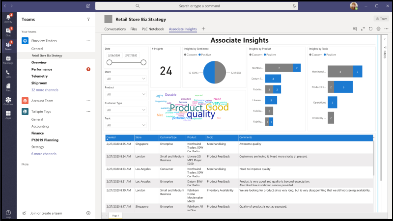
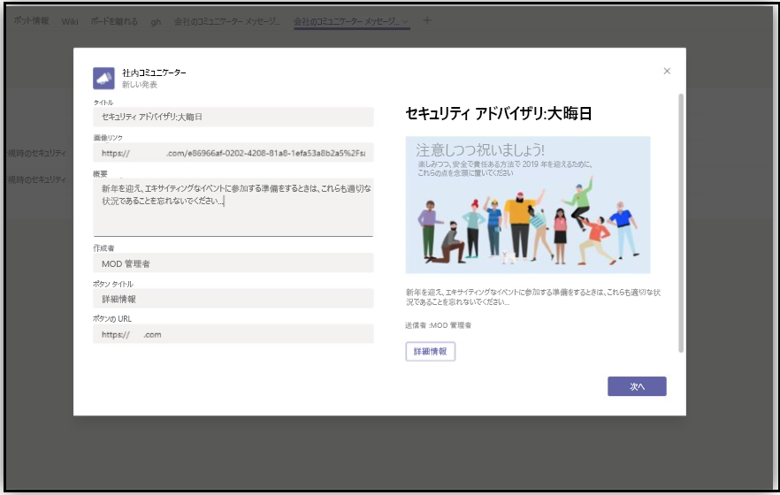
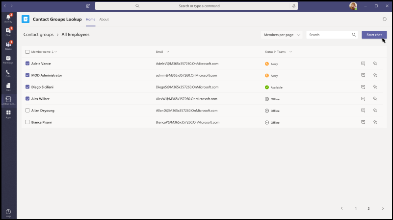
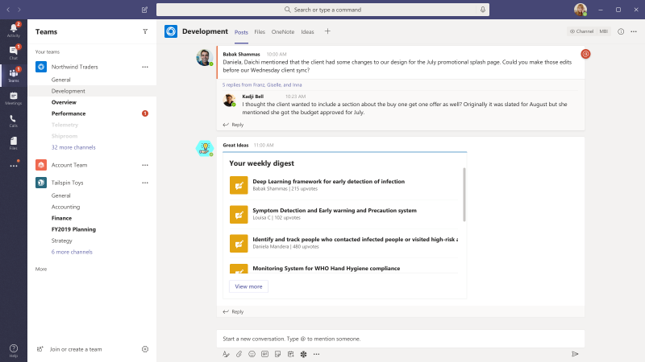
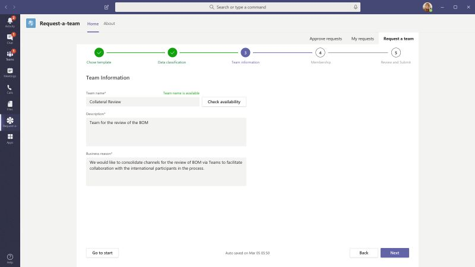
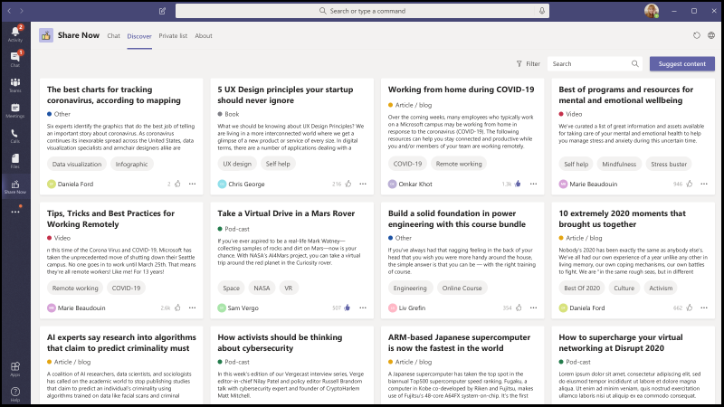
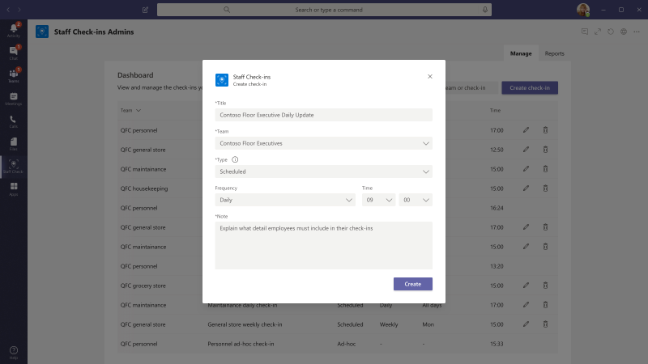

# Microsoft Teams のアプリテンプレート

アプリテンプレートとは、コミュニティ主導で、オープンソースで、GitHub 上で利用可能な Microsoft Teams 用のプロダクション対応アプリのことです。 それぞれに、組織のためにアプリを展開してインストールするための詳細な手順が記載されており、すぐにインストールして使用を開始できるアプリを用意しています。 完全なソースコードも利用できます。そのため、詳細について確認したり、コードをフォークして、特定のニーズを満たすように変更したりすることができます。

**&#9734; は、新しくリリースされたアプリテンプレートを示しています。**

### 主な利点

* **プラグアンドプレイの操作:** すべてのアプリテンプレートには、Microsoft Azure で必要なすべてのサービスをホストできる展開スクリプトが含まれています。 アプリを展開するためのコーディングは必要ありません。
* **運用可能なコード:** アプリテンプレートは、セキュリティとインフラストラクチャの推奨されるベストプラクティスに準拠しており、それらに加えられたすべてのコミュニティの変更をレビューして、引き続き準拠していることを確認します。
* **カスタマイズと拡張:** すべてのアプリテンプレートを展開する準備ができましたが、コードベースと展開スクリプト全体が提供されるので、独自のニーズに合わせてカスタマイズまたは拡張することが容易になります。
* **サポート & 詳細なドキュメント:** すべてのアプリテンプレートには、ソリューションのアーキテクチャ、展開、および構成手順に関するエンドツーエンドのドキュメントが付属しています。 リポジトリも監視されるので、GitHub で問題を発生させることで、発生した問題を報告してください。

## 他の &#9734; を確認する

この質問は、ユーザーが Teams 内で Q&A (質問と回答) セッションを実施できるようにする [Microsoft Teams の bot](../bots/what-are-bots.md) です。 不在時のボットを使用すると、チームメンバーは仕事仲間によって共有されている質問を提出したり、&して、ホストが、チャネルまたはチャット内の重要な質問を簡単に収集できるようになります。 この bot を使用して、Teams 会議のセッションをリアルタイムで Q&し、参加者がチャットで実際に質問を送信できるようにすることができます。

[GitHub で取得する](https://github.com/OfficeDev/microsoft-teams-apps-askaway)

:::row:::
  :::column span="2":::
      
:::column-end:::
:::row-end:::

## アソシエイト インサイト

アソシエイト Insights は、顧客の意見、心理、認識を直接取得して送信するための、第一線ワーカーを支援する [パワーアプリ](/powerapps/maker/canvas-apps/embed-teams-app) テンプレートです。 Firstline ワーカーは、多くの場合、一対一の取引先担当者として顧客と協力することになります。 収集されたデータは、ビジネスチーム (たとえば、Power BI Teams タブを介して) によって共有および使用して、製品の改善や顧客のエクスペリエンスの向上に利用できます。

[GitHub で取得する](https://github.com/OfficeDev/microsoft-teams-apps-associateinsights)

:::row:::
  :::column span="2":::
      
:::column-end:::
:::row-end:::
:::row:::
:::column span="2":::
    
:::column-end:::
:::row-end:::

## 出席

出席アプリは、チーム内でピン留めできる [ [Power Apps](/powerapps/maker/canvas-apps/embed-teams-app) ] タブです。 これは、通常、学習およびトレーニング環境などの設定で、プレゼンスを記録するように設計されています。 ユーザーは、過去30日間の参加をマークまたは編集したり、グループ全体または個々の出席者のレポートをまとめて表示したりできます。

[GitHub で取得する](https://github.com/OfficeDev/microsoft-teams-apps-attendance)

## 書籍-a ルーム

書籍-a room は [Microsoft Teams の bot](../bots/what-are-bots.md) で、現在の時刻から 30 (既定)、60、または90分間、ユーザーが会議室をすばやく検索して予約することができます。 個人または1:1 の会話に対して、会議中の bot の範囲を示します。

[GitHub で取得する](https://github.com/OfficeDev/microsoft-teams-apps-bookaroom)

## Access &#9734; を作成する

Access の作成は、施設ディレクターが従業員のオンサイトプレゼンスを管理、追跡、および報告することにより、占有しきい値と社会的 distancing 基準を構築するための管理をサポートする Microsoft の [電源プラットフォーム](https://powerapps.microsoft.com/blog/now-in-preview-customize-teams-with-built-in-power-platform-capabilities/)ベースのアプリです。 Microsoft [Power Apps](/powerapps/powerapps-overview)を使用して構築されたアプリ、および [強力な機能](/power-automate/getting-started)を備えた microsoft Teams との緊密な統合により、組織は、建物の準備状況を判断し、オンサイトアクセスのための資格情報を設定して、今後の計画のために洞察を集めることができます。

[GitHub で取得する](https://github.com/OfficeDev/microsoft-teams-apps-buildingaccess)

:::row:::
   :::column span="":::
     
   :::column-end:::
   :::column span="":::
      
   :::column-end:::
:::row-end:::

## お祝い

[記念] は Teams アプリであり、チームメンバーは、他の誕生日、記念日、その他の定期的なイベントを担当することができます。 すべてのチームメンバーの特別な状況を記録して、イベントの作成時に選択されたすべてのチームでフレンドリメッセージを送信し、チームメンバーが自分の一日に特別な印象を感じられるようにします。

アプリは、すべてのチームメンバーが自分のイベントを個人的に追加および表示し、ユーザーがイベントを共有するチームを選択できるようにするための簡単なインターフェイスを提供します。

[GitHub で取得する](https://github.com/OfficeDev/microsoft-teams-celebrations-app)

## 社内コミュニケーター

会社の Communicator アプリを使用すると、企業チームはチャットを介して複数のチームまたは多数の従業員宛てのメッセージを作成して送信することができます。 このテンプレートを、新しいイニシアチブのアナウンス、従業員のオンボード、モダンラーニング、開発、組織全体のブロードキャストなど、複数のシナリオで利用できます。

アプリは、指定されたユーザーがメッセージを作成、プレビュー、共同作業、および送信するための簡単なインターフェイスを提供します。

これにより、メッセージを確認したり操作したりしたユーザー数について、カスタムテレメトリなどのカスタムの対象化通信機能を構築するための基盤が提供されます。

[GitHub で取得する](https://github.com/OfficeDev/microsoft-teams-company-communicator-app)

## 連絡先グループ参照 &#9734;

連絡先グループの参照アプリは、組織の連絡先グループ (以前の配布リストまたは通信グループ) を作成、アクセス、および管理するための便利で便利な方法を提供します。 ユーザーは、グループメンバーの表示とチャット、メンバーの状態の表示、連絡先グループ内の選択されたメンバーとのグループチャットの作成をすばやく行うことができます。

[GitHub で取得する](https://github.com/OfficeDev/microsoft-teams-app-contactgrouplookup)

:::row:::
:::column span="2":::
      
:::column-end:::
:::row-end:::
:::row:::
:::column span="2":::
    
:::column-end:::
:::row-end:::

## CrowdSourcer

CrowdSourcer は、チームが照会した情報をグループメンバーから共同で提供する [Microsoft teams bot](../bots/what-are-bots.md) です。 これは、よく寄せられる質問に回答するための最適な方法であり、参加者が積極的に協力して、楽しくて役に立つ情報リソースに投稿することを可能にします。

[Github で取得する](https://github.com/OfficeDev/microsoft-teams-crowdsourcer-app)

## カスタム ステッカー

自己表現は、正常なチームのカルチャにとって中心的なものです。 このアプリテンプレートは、ユーザーが Microsoft Teams 内でカスタムステッカーと Gif を使用できるようにする [メッセージング拡張機能](~/messaging-extensions/what-are-messaging-extensions.md) です。 このテンプレートを使用すると、web ベースの構成を簡単に行うことができます。これにより、エンドユーザーが使用する Gif/ステッカー/画像を構成アクセス権を持つすべてのユーザーがアップロードできるようになります。

このアプリでは、ストレージと共有のメカニズムとして、SharePoint サイトや個々のチャネルへのアクセスを必要とせずに、teams 間で画像、Gif、ステッカーを簡単に共有することもできます。 たとえば、製品チームは、プログラムを使用して、製品の画像や Gif をソーシャルメディア、マーケティング、営業チームに簡単に共有できます。 新しい画像/Gif が利用可能になったときに、特定の teams/個人に通知フローをトリガーすることによって、このアプリを拡張することもできます。

[GitHub で取得する](https://github.com/OfficeDev/microsoft-teams-stickers-app)

## 電子処方箋 &#9734; 

電子処方箋は、電子処方箋を患者に発行するプロセスを自動化することによって、telemedicine と仮想の治療を強化する [パワーアプリ](/powerapps/maker/canvas-apps/embed-teams-app)ベースのアプリです。 医療担当者は、予定をすばやくレビューし、電子処方箋を生成し、電子処方箋に添付された電子メールを Teams プラットフォーム内で直接患者に送信することができます。

[GitHub で取得する](https://github.com/OfficeDev/microsoft-teams-apps-eprescription) 

:::row:::
:::column span="2":::
    ![電子処方箋アプリのスクリーンショット。 医療機関が患者の処方箋を注文するための [生成] ボタンを選択する方法について説明します。](../assets/images/e-prescriptions-app-template.png)  
:::column-end:::
:::row-end:::
:::row:::
:::column span="2":::
    
:::column-end:::
:::row-end:::

## エキスパート検索

専門家の Finder は、スキル、関心事、教育の属性に基づいて特定の組織のメンバーを識別する [Microsoft Teams の bot](../bots/what-are-bots.md) です。 メンバーは、Azure Active Directory ユーザープロファイルのキーワード検索に一致する組織内の専門家を検索します。

[GitHub で取得する](https://github.com/OfficeDev/microsoft-teams-apps-expertfinder)

## FAQ プラス

話し言葉 Q&ボットは、ユーザーからよく寄せられる質問に対する回答を簡単に提供する方法です。 ただし、bot が失敗したときにループに人間が存在しないため、ほとんどのボットはユーザーとの通信に失敗することがあります。 FAQ bot は、問題が解決できないときにループを処理する bot&ボットです。 この場合は、bot がサポート技術情報に含まれている場合、ボットに質問をして応答を求めることができます。 できない場合は、ユーザーはクエリを送信することができます。これにより、チーム内から通知を受け取ることによってサポートを提供できる専門家チームに投稿されます。

> [!NOTE]
> **FAQ**の最新リリースでは、専門家のチームが次のことを実行できるようにすることで、改善された質疑&サポートしています。
>
> &#x2714; メッセージ拡張機能を使用して、新しい Q&をナレッジベースに直接追加します。
>
> &#x2714; を編集および削除するには、bot によって追加されたペア&Q を追加します。
>
> &#x2714; Q&のリビジョン履歴を追跡します。
>
> &#x2714; [アダプティブカード](../task-modules-and-cards/cards/cards-reference.md#adaptive-card)として表示するには、追加の詳細を含む回答を構成します。
>
[**GitHub で取得する**](https://github.com/OfficeDev/microsoft-teams-apps-faqplusv2)

## 目標追跡ツール

目標追跡アプリは、組織にとって、Microsoft Teams 内での目標の確立、進捗状況の確認、成功の確認をサポートするための包括的なソリューションです。 アプリを使用すると、ユーザーは professional、personal、および team の各レベルで目標を設定、追跡、更新することができます。 チームメンバーは、タイムリーな事前通知や進捗状況の更新を受信して、常に順調に進めることができます。

[GitHub で取得する](https://github.com/OfficeDev/microsoft-teams-app-goaltracker)

:::row:::
  :::column span="2":::
      
:::column-end:::
:::row-end:::
:::row:::
:::column span="2":::
    
:::column-end:::
:::row-end:::

## 魅力的なアイデア

魅力的なアイデアアプリは、組織内の革新と創造性をサポートしています。 アプリを使用すると、従業員は仕事仲間やリーダーシップを使用してアイデアを共有し、新しい提出物、ピアに関するスポットライトを見つけ、Microsoft Teams 内でのベスト提案に投票を行うことができます。

[GitHub で取得する](https://github.com/OfficeDev/microsoft-teams-apps-greatideas)

:::row:::
  :::column span="2":::
      
:::column-end:::
:::row-end:::
:::row:::
:::column span="2":::
    
:::column-end:::
:::row-end:::

## グループアクティビティ

グループアクティビティは、チームの所有者が簡単にアクティビティグループを作成し、Microsoft Teams のコンテキスト内でコラボレーションワークフローを管理できるようにする Microsoft Teams アプリです。 アクティビティの作成者はアクティビティの作成を有効にし、チームメンバーをランダムにグループに展開し、必要に応じて、アクティビティが完了するまで、必要に応じて bot に通知を送信します。

[GitHub で取得する](https://github.com/OfficeDev/microsoft-teams-apps-groupactivities)

:::row:::
  :::column span="2":::
      
:::column-end:::
:::row-end:::
:::row:::
:::column span="2":::
    
:::column-end:::
:::row-end:::

## スキルを拡張する

It アプリの拡張は、従業員が新しいスキルを同時に習得しながら、従業員が組織の補助的なプロジェクトに貢献できるようにすることで、プロフェッショナルな成長と開発をサポートします。 従業員は、アプリを使用して、関心のある機会を見つけ、仲間との有意義なコラボレーションを楽しんで、新しいレベルの専門知識と機能を Teams 環境内で取得することができます。

[GitHub で取得する](https://github.com/OfficeDev/microsoft-teams-apps-growyourskills)

:::row:::
  :::column span="2":::
      
:::column-end:::
:::row-end:::
:::row:::
:::column span="2":::
    
:::column-end:::
:::row-end:::

## HR サポート

HR サポート bot は、問題が解決できないときに、そのループの人事チームのサポートプロフェッショナル/専門家を支援する bot&のフレンドリな質問です。 この場合は、bot がサポート技術情報に含まれている場合、ボットに質問をして応答を求めることができます。 できない場合は、ユーザーはクエリを送信して、チーム内から通知を受け取ることによってサポートを提供できる専門家の事前に構成されたチームに投稿することができます。 また、bot は、質問で事前に構成されたタグを検索することにより、推奨される人事ポリシー/質問へのリンクを提案します。 これらのタイルは、クイックリファレンスとして、関連付けられたタブにもあります。 人事サポートは、軽いウエイト QnA に適しており、組織内で新しいプロジェクト/イニシアチブを開始する際の迅速なサポートを提供します。

[GitHub で取得する](https://github.com/OfficeDev/microsoft-teams-hrsupport-app)

## アイスブレーカー

Icebreaker は [Microsoft Teams の bot](../bots/what-are-bots.md) で、チームは、2つのランダムなチームメンバーを毎週1つずつペアにすることによって近づくことができます。 Bot は、両方のメンバーに対して動作する空き時間を自動的に提案することで、スケジュールを簡単にします。 パーソナル接続を強化し、このアプリを使用して緊密な knit コミュニティを構築します。

Icebreaker アプリは、チーム全体にわたる個人の接続を促進するだけでなく、組織内の利息ベースコミュニティを cultivate するのに役立ちます。 たとえば、このアプリを DevOps の趣味グループに対して使用すると、アイデアやベストプラクティスつれを組織全体に分散させることができます。

[GitHub で取得する](https://github.com/OfficeDev/microsoft-teams-icebreaker-app)

## 報奨金

インセンティブは、トレーニングや変更管理イニシアティブなど、指定されたアクティビティに incentivized 従業員の参加を管理し、追跡するための [Power Apps](/powerapps/maker/canvas-apps/embed-teams-app) テンプレートです。 管理者はアプリを使用して、指定されたアクティビティを確立し、完了するためにポイントを割り当て、報奨に必要な適格性ポイントレベルを指定します。 従業員はアプリを使用して、蓄積されたポイントを表示したり、適格性に達した場合には、redeemable 報奨に同意します。

[GitHub で取得する](https://github.com/OfficeDev/microsoft-teams-apps-incentives)

## インシデントレポーター 

インシデントレポーターは、組織内のインシデントの管理を最適化する [Microsoft Teams の bot](../bots/what-are-bots.md)  です。 Bot は、インシデントデータの自動収集、カスタマイズされたインシデントレポート、関連するステークホルダーの通知、およびエンドツーエンドのインシデント追跡を容易にします。

[GitHub で取得する](https://github.com/OfficeDev/microsoft-teams-apps-incidentreport)

:::row:::
  :::column span="2":::
      
:::column-end:::
:::row-end:::
:::row:::
:::column span="2":::
    
:::column-end:::
:::row-end:::

## バッジを開く

バッジは、個人が Teams のコンテキスト内でデジタル学習資格情報バッジを獲得し、すべての場所で共有できるようにする Microsoft Teams アプリです。 サードパーティのデジタルバッジの発行機関である機能を使用することによって、バッジ、 [Badgr](https://badgr.org/)、特典バッジは、受信者の badgr プロファイルに記録され、利用可能な手順の充実した画像を構築して共有できます。

[GitHub で取得する](https://github.com/OfficeDev/microsoft-teams-apps-openbadges)

:::row:::
  :::column span="2":::
      
:::column-end:::
:::row-end:::
:::row:::
:::column span="2":::
    
:::column-end:::
:::row-end:::

## クイック応答

クイック応答は、ユーザーによく寄せられる質問 (Faq) を効果的に回答するための堅牢なソリューションを提供する Microsoft Teams アプリです。 アプリでは、各クエリに手動で応答して情報を繰り返し表示するのではなく、Teams の [メッセージング拡張機能](../messaging-extensions/what-are-messaging-extensions.md)によって対話的なユーザー操作に対する応答のライブラリをビルドします。

[GitHub で取得する](https://github.com/OfficeDev/microsoft-teams-apps-quickresponses)

## リモートサポート

リモートサポートは、組織全体のサポート依頼者と内部のサポートチームの間でフォーカスがあるインターフェイスを提供する [Microsoft Teams の bot](../bots/what-are-bots.md) です。  エンドユーザーは、サポートのための要求を提出、編集、または取り消すことができます。また、サポートチームは、すべての要求を Teams プラットフォーム内で応答、管理、および更新できます。

[GitHub で取得する](https://github.com/OfficeDev/microsoft-teams-apps-remotesupport)

:::row:::
  :::column span="2":::
      
:::column-end:::
:::row-end:::
:::row:::
:::column span="2":::
    
:::column-end:::
:::row-end:::

## チームの要求

要求-a team は、企業組織の新しいチーム作成を最適化する Microsoft Teams アプリです。 このアプリは、ウィザードで指示された要求フォーム、組み込みの承認プロセス、要求状態ダッシュボード、および自動化されたチームビルドを統合することによって、新しいチームインスタンスを作成する際の標準化とベストプラクティスをサポートしています。

[GitHub で取得する](https://github.com/OfficeDev/microsoft-teams-apps-requestateam)

:::row:::
  :::column span="2":::
    
:::column-end:::
:::row-end:::
:::row:::
:::column span="2":::
    
:::column-end:::
:::row-end:::

## チャネルの Scrums

Scrums for Channels は、ユーザーが Microsoft Teams 内のチャネルで Scrums をスケジュールして実行できるようにする、スクラムアシスタントアプリです。 このアプリは、リモートチームとチームが、さまざまな地理的場所とタイムゾーンのメンバーで構成された、毎日の更新情報を共有し、スクラムのスタンドアップ会議に参加できるようにするために役立ちます。

[GitHub で取得する](https://github.com/OfficeDev/microsoft-teams-apps-scrumsforchannels)

> [!NOTE]
> グループチャットでスクラム会議を実施するには、「 [Scrums For Group chat](#scrums-for-group-chat) app template」を参照してください。

:::row:::
  :::column span="2":::
    
:::column-end:::
:::row-end:::
:::row:::
:::column span="2":::
    
:::column-end:::
:::row-end:::

## グループチャットの Scrums

> [!NOTE]
> Scrums Status app テンプレートが更新され、グループチャット用に Scrums になりました。

グループチャットの Scrums は、グループチャットメンバーが非同期のスタンドアップ会議を実行し、毎日の更新内容を簡単に共有できるようにする、支援のあるスクラムアシスタントです。 これにより、グループチャットのすべてのメンバーがスクラムに投稿し、実行中のスクラムで他者が行った更新を表示することができます。

[GitHub で取得する](https://github.com/OfficeDev/microsoft-teams-apps-scrumsforgroupchat)

## 今すぐ共有 &#9734;

今すぐ共有アプリは、ユーザーが Teams 環境内でコンテンツを簡単に共有できるようにすることで、同僚間での情報交換を促進します。 ユーザーは、アプリを使用して、チームメンバーと関心のあるアイテムを共有したり、新しい共有コンテンツを検出したり、プレファレンスを設定したり、お気に入りにブックマークを設定したりして、後で閲覧できます。

[GitHub で取得する](https://github.com/OfficeDev/microsoft-teams-apps-sharenow)

## SharePoint リスト検索

Microsoft Teams でのコラボレーションは、多くの場合、SharePoint リスト内のアイテムに含まれている情報を参照します。 目的のアイテムへのリンクを貼り付けるだけで、すべてのユーザーに対して、会話からのコンテキストの切り替え、必要な情報の検索、および会話を続行するために Teams に戻ることが強制されます。 会話は、通常、新しいコメントを確認し、アイテム内に含まれる情報を更新するために、参照アイテムに再び切り替える必要があります。 このコンテキストの切り替えは、グループ作業をスムーズにするための障壁を作成し、その亀裂についてのレシピとなります。

このような問題を軽減するために、リスト検索アプリテンプレートに移動することになります。 数百万人のユーザーが SharePoint を使用して、組織内のコアワークフローの一部を強化します。 ただし、リストに関する共同作業は、特に面倒な場合があります。 Microsoft Teams でリスト検索アプリテンプレートを使用すると、ユーザーは SharePoint リストアイテムの情報をチャット会話内に直接挿入して、リンクをチャットに挿入するだけで済むようになったため、コンテキスト切り替えが軽減されます。 この情報は、簡単に読める自動フォーマットのカードとして挿入され、ユーザーが会話に参加し続けるのを支援します。

[GitHub で取得する](https://github.com/OfficeDev/microsoft-teams-list-search-app)

## スタッフのチェックイン

スタッフのチェックインは、ビジネス担当者と現場担当者との間での監視コミュニケーションを可能にする、 [電力アプリケーション](/powerapps/powerapps-overview)ベースのアプリです。 スタッフは、スケジュールされた、または臨時に Teams から直接、タイムクリティカルな情報と進捗状況の更新を簡単に提供できます。 アプリでは、リアルタイムの場所、写真、およびメモだけでなく、アラームの通知や自動化されたワークフローをサポートしています。

[GitHub で取得する](https://github.com/OfficeDev/microsoft-teams-apps-staffcheckins)

## ビジタ管理 &#9734;

ゲスト管理アプリを使用すると、組織や従業員は、Microsoft Teams から直接オンサイトビジタープロセスを簡単かつ効率的に管理できます。 アプリを使用すると、従業員は訪問者の要求を作成し、訪問者のダッシュボードを介して要求の状態を一元管理し、訪問者が到着したときにリアルタイムで通知を受け取ることができます。

[GitHub で取得する](https://github.com/OfficeDev/microsoft-teams-app-visitormanagement)

:::row:::
  :::column span="2":::
    
:::column-end:::
:::row-end:::
:::row:::
:::column span="2":::
    
:::column-end:::
:::row-end:::

## Workplace 賞 &#9734;

Workplace 賞は Teams アプリテンプレートです。これにより、モダンワークプレースで、認識を促進し、従業員の感謝を促します。 このアプリを使用すると、従業員が容易に仕事仲間を指名して承認することができる従業員報奨および認識 (R&R) プログラムを設定および管理できます。また、R&R リーダーは、送信された nominations の表示、特典の付与、受信者のアナウンスを行うことができます。

[GitHub で取得する](https://github.com/OfficeDev/microsoft-teams-apps-workplaceawards)

:::row:::
  :::column span="2":::
    
:::column-end:::
:::row-end:::
:::row:::
:::column span="2":::
    
:::column-end:::
:::row-end:::

参照したいアプリテンプレートのアイデアがあるかどうか。 お知らせ[ください](https://forms.office.com/Pages/ResponsePage.aspx?id=v4j5cvGGr0GRqy180BHbR2_7qFm_lcZAr4eqEhnLsZ9UMVZGT1lCT0FXUDdZMUM0RkpBS1BESTAwWC4u)。
