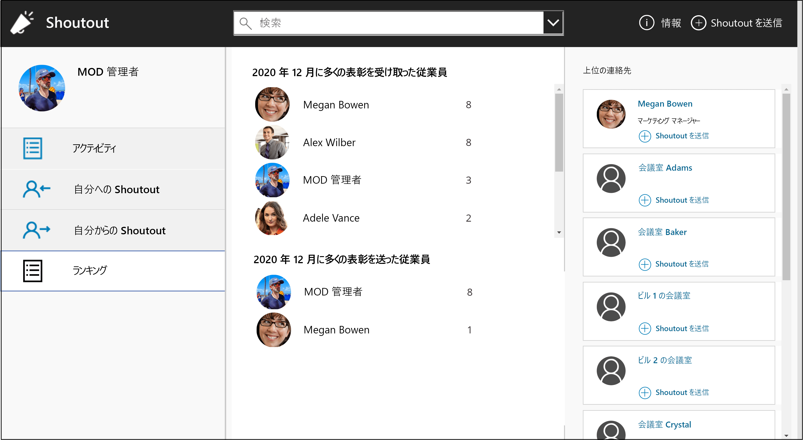
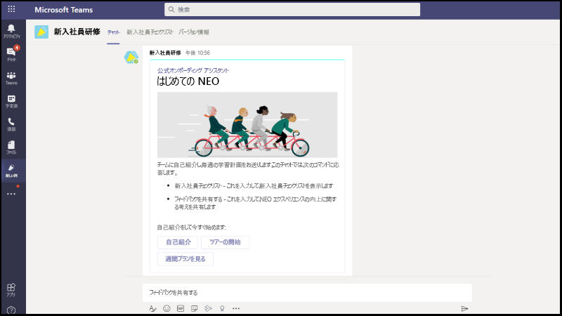
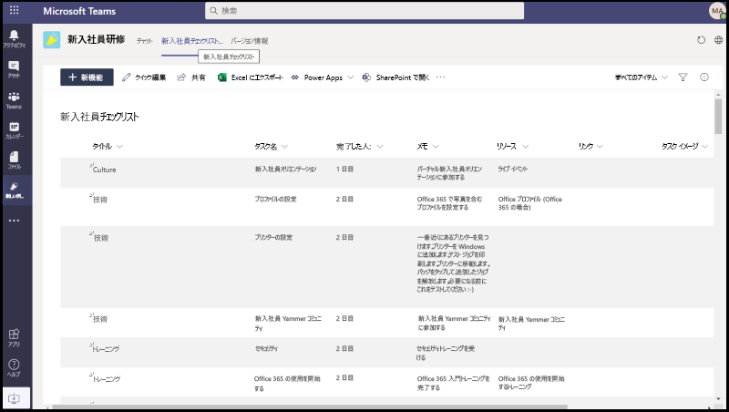

# Microsoft Teams 用のアプリ テンプレート

アプリ テンプレートは、オープン ソースで、GitHub で利用できる Microsoft Teams 用の完全なアプリの例です。 各アプリ テンプレートには、組織用に展開してインストールするための詳細な手順が記載されています。 サンプル アプリも提供されているため、すぐにインストールして使用を開始できます。 完全なソース コードも利用できるので、詳細を調べたり、コードをフォークして特定のニーズに合わせて変更したりできます。
すべてのアプリテンプレートは [MIT ライセンス](https://github.com/OfficeDev/microsoft-teams-apps-eprescription/blob/master/LICENSE)の条件下で提供されます。

> [!NOTE]
> ユーザーや組織のために、アプリ テンプレートで作成したアプリをライセンスしてサポートする必要があります。

アプリ テンプレートを使用する主な利点は次のとおりです。

* **クラウドに直接デプロイする:** すべてのアプリ テンプレートには、Microsoft Azureまたは Power Platform で必要なすべてのサービスをホストできるデプロイ スクリプトが含まれています。
* **推奨サンプルコード:** アプリ テンプレートは、セキュリティとインフラストラクチャに関して推奨されるベスト プラクティスに準拠しています。 コミュニティから提出されたアプリ テンプレートの変更はすべて、適合性を確認するためにレビューされます。
* **カスタマイズ可能かつ拡張可能:** すべてのアプリ テンプレートは最小限の構成で展開する準備ができていますが、コード ベース全体と展開スクリプトを提供しているため、独自のニーズに合わせて簡単にカスタマイズまたは拡張できます。
* **詳細なドキュメント:** すべてのアプリ テンプレートには、ソリューション アーキテクチャ、展開、構成の手順に関するエンドツーエンドのドキュメントが付属しています。  

## 導入ツール - チャンピオン管理プラットフォーム

チャンピオン管理プラットフォーム (CMP) アプリ テンプレートを使用すると、チームワークのチャンピオンを管理、スケーリング、および刺激して、より多くのことを達成できます。 このアプリ テンプレートは、SharePoint Framework をベースに構築され、チーム内のタブに読み込まれます。 グループは、このツールを利用して、プログラム メンバーシップの管理、ログ記録用のランキングとイベントの種類の提供、およびデジタルバッジをプログラム参加者にオーバーレイするためのツールを提供できます。

[GitHub で入手する](https://github.com/OfficeDev/microsoft-teams-apps-champion-management)

## 導入ツール - Microsoft 365 ラーニングパス (概要)

はじめに アプリ テンプレートを使用すると、Microsoft Teams 内に Microsoft 365 ラーニング パスの力を持ち込めます。 このアプリ テンプレートを使用すると、特定のトレーニング ページやその他のイントラネット資産への簡単なアクセスを許可し、Teams 内にコンテンツを直接読み込むことができます。 会社のブランドに合わせてアプリ名またはロゴを変更することもできます。

[GitHub で入手する](https://github.com/msft-teams/tools/tree/master/M365%20Learning%20Pathways)

## 社内コミュニケーター

社内コミュニケーター アプリを使用すると、企業チームはチャットを介して複数のチームまたは多数の従業員向けのメッセージを作成および送信できます。これにより、組織は共同作業を行う場所で従業員に連絡できます。 新しいイニシアチブの発表、従業員のオンボーディング、最新の学習と能力開発、組織全体のブロードキャストなど、複数のシナリオにこのテンプレートを利用します。

このアプリは、指定されたユーザーがメッセージを作成、プレビュー、共同作業、送信するための簡単なインターフェイスを提供します。

これは、メッセージを確認または操作したユーザーの数に関するカスタム テレメトリなどのカスタム ターゲット通信機能を構築するための基盤を提供します。

[GitHub で入手する](https://github.com/OfficeDev/microsoft-teams-company-communicator-app)

## Co-worker Appreciation

Microsoft Teams の Co-worker Appreciation テンプレートを使用すると、ユーザーは Teams のコンテキストで同僚の業績を認識することができます。 共同作業者が同僚へのリワードを選択すると、受信者や他のチーム メンバーがチャネルの会話でタグ付けされ、チャネルのリワードの詳細についての通知を受け取ることができます。 アワードは Teams アプリに記録され、安全で携帯性に優れ、簡単に共有することができます。 これは、ランキングを備えた Open Badges アプリ テンプレートの PowerApps ベースのバージョンと考えることができます。

[GitHub で入手する](https://github.com/OfficeDev/microsoft-teams-apps-coworker-appreciation)

## FAQ プラス

会話型 Q&A ボットは、ユーザーからよく寄せられる質問に回答する簡単な方法です。 しかし、ほとんどのボットは、ボットが失敗したときにループに人間がいないため、意味のある方法でユーザーとやり取りできません。 FAQ ボットは、わかりやすい Q&ヘルプができない場合に人間をループ内に取り込むボットです。 ボットに質問すると、ボットがサポート情報に含まれている場合は回答が返されます。 そうでない場合、ボットはユーザーがクエリを送信することを許可し、チーム自体からの通知に基づいてサポートを提供するのに役立つ事前構成済みの専門家チームに投稿されます。

> [!NOTE]
> **FAQ プラス** の最新リリースは、専門家チームが以下を完了できるようにすることにより、改善された Q&A 解決をサポートします。
>
> &#x2714; メッセージ拡張機能を使用して、ナレッジベースに新しい Q&A を直接追加します。
>
> &#x2714; ボットによって追加された Q&A ペアを編集および削除します。
>
> &#x2714; Q&A の改訂履歴を追跡します。
>
> &#x2714; [アダプティブ カード](../task-modules-and-cards/cards/cards-reference.md#adaptive-card)として表示する追加の詳細を含む回答を構成します。
>
[GitHub で入手する](https://github.com/OfficeDev/microsoft-teams-apps-faqplusv2)

## アイスブレーカー

アイスブレーカーは、[Microsoft Teams ボット](../bots/what-are-bots.md)で、毎週 2 人のランダムなチーム メンバーをペアにして、チームを近づけることができます。 ボットは、両方のメンバーに有効な空き時間を自動的に提案することで、スケジュール設定を簡単にします。 このアプリで個人的なつながりを強化し、緊密に結びついたコミュニティを構築します。

アイスブレーカー アプリは、チーム全体で個人的なつながりを促進するだけでなく、組織内で関心に基づいたコミュニティを育成するのに役立ちます。 たとえば、このアプリを DevOps の共同作業グループに使用して、アイデアやベストプラクティスを組織全体に有機的に広めることができます。

[GitHub で入手する](https://github.com/OfficeDev/microsoft-teams-icebreaker-app)

## New Employee Onboarding

New Employee Onboarding は、組織が新入社員教育で、従業員に一貫した高品質のオンボーディング エクスペリエンスを提供できるようにする Microsoft Teams と [SharePoint New Employee Onboarding が統合されたソリューション](https://lookbook.microsoft.com/details/75e60a32-9849-4ed4-b83e-b2b08983ad19)です。 このアプリは、人事チームと採用マネージャーがオリエンテーションと導入プロセス全体で関連情報を提供するために使用でき、新入社員がフィードバックを共有し、導入学習を提供し、オンボーディング タスクを完了するために使用できます。

[GitHub で入手する](https://github.com/OfficeDev/microsoft-teams-apps-newemployeeonboarding)

:::row:::
  :::column span="2":::
    **新入社員のウェルカム カード** 
:::column-end:::
:::row-end:::
:::row:::
  :::column span="2":::
    **新入社員のチェックリスト**   
:::column-end:::
:::row-end:::

## アプリ テンプレートのコード サンプル

アプリ テンプレートのコード サンプルは、Microsoft Teams プラットフォーム機能用のサンプル アプリのコレクションです。

> [!NOTE]
> * Microsoft はソース コードを積極的に管理していません。ソース コードはすべてオープンソースであり、特定の要件を満たすようにソース コードを探索、フォーク、変更できます。
> * Microsoft Power Platform を使用して、Teams アプリ ストアに発行するアプリを作成することはできません。 Microsoft Power Platform アプリは、組織のアプリ ストアにのみ発行できます。

次の表では、アプリ テンプレートのコード サンプルについて説明します。  

|名前|シナリオ|GitHub リンク| |---------|---------||-------| |Adoption Bot | Adoption Bot は、Teams PVA 用 Power Virtual Agent を使用して構築されたユーザー ケア チャット ボットです。 これは、FAQ Plus のPVA バージョンと見なされます。 Adoption Bot は、Microsoft 365 と Teams に関する 100 以上の一般的な質問に回答しています。 含まれているトピックを編集したり、自分のトピックを追加したり、既存のよくある質問を導入することができます。 ユーザーが追加のヘルプを必要とする場合、Adoption Bot は専門家への接続や、プレミアム フロー コネクタを使用して拡張し、サービス チケットを開くことができます。 このボットは、自己インストールされているか、[Adoption Hub](https://github.com/akporzondek/adoption_hub) などのカスタム アプリに組み込まれています。 | [Adoption Bot](https://github.com/OfficeDev/microsoft-teams-apps-adopt-bot) | | Appointment Manager は、企業が Teams を経由して消費者とのバーチャルの予定を作成、管理、実施するための Teams アプリ テンプレートです。 コンシューマーからの新しい予定要求はTeams チャネルに表示され、チームのスタッフにすばやく割り当てられ、再割り当てされます。 予定リクエストは、カスタム タブを使用してチーム レベルまたは個人レベルで確認することができます。 すべての予定は Teams のオンライン会議に関連付けられているため、スタッフと消費者は簡単に予定された時間に会議に参加することができます。 アプリ テンプレートは Microsoft Bookings と統合されており、簡単に予約管理ができます。 スケジュールされた予定は割り当てられたスタッフメンバーの予定表に自動的に表示され、消費者はカスタマイズ可能な電子メール通知と埋め込み会議リンクを含むリマインダーを受け取ります|[Appointment Manager](https://github.com/OfficeDev/microsoft-teams-apps-appointment-manager) | | Ask Anaywa | Ask Anyway は、ユーザーが Q&A セッションと呼ばれる質問と回答を Teams 内で実行できるようにする [Microsoft Teams ボット](../bots/what-are-bots.md)です。 チーム メンバーは、Ask Away ボットを使用して、同僚が共有する質問を送信して賛成票を投じることができます。これにより、Q&A ホストは、チャネルまたはチャット内で最も重要な質問を簡単に収集できます。 ボットを使用して、Teams 会議でリアルタイムの Q&A セッションを実行でき、出席者はチャットを介してライブで質問を送信できます。 | [Ask Anyway](https://github.com/OfficeDev/microsoft-teams-apps-askaway) | | Associate Insights は、現場担当者が顧客の意見、感情、認識を直接キャプチャして送信できるようにする [Power Apps](/powerapps/maker/canvas-apps/embed-teams-app) テンプレートです。 多くの場合、現場担当者は、一対一の連絡窓口で顧客と関わりを持つ最初の会社の代表者です。 収集されたデータは、製品の改善とカスタマー エクスペリエンスの向上のために、たとえば Power BI Teams タブを介して、ビジネスチームが共同で共有および使用できます。 | [インサイト | |を関連付ける](https://github.com/OfficeDev/microsoft-teams-apps-associateinsights)出席|Attendance アプリは、チームにピン留めされた[Power Apps](/powerapps/maker/canvas-apps/embed-teams-app) タブです。 これは、学習環境やトレーニング環境などの設定でプレゼンスを記録するように設計されています。 ユーザーは、過去 30 日間までの出席をマークまたは編集し、グループ全体または個々の出席者の要約された出席レポートを表示できます。   | [Attendance](https://github.com/OfficeDev/microsoft-teams-apps-attendance) | |Book-a-room | Book-a-room は、現在時刻から 30 分間、60 分間、90 分間予約できる会議室をユーザーがすばやく検索して予約できるようにする [Microsoft Teams ボット](../bots/what-are-bots.md)です。 既定は 30 分間です。 Book-a-room ボットのスコープは、個人用または 1 対 1 の会話に適用されます。| [Book-a-room](https://github.com/OfficeDev/microsoft-teams-apps-bookaroom) | | Building Access | Building Access は Microsoft [Power Platform](https://powerapps.microsoft.com/blog/now-in-preview-customize-teams-with-built-in-power-platform-capabilities/) ベースのアプリであり、施設のディレクターが従業員のオンサイト プレゼンスを管理、追跡、および報告できるようにすることで、ビルの占有しきい値とソーシャル ディスタンシング規範の管理をサポートします。 Microsoft [Power Apps](/powerapps/powerapps-overview)、[Power Automate](/power-automate/getting-started)を使用して構築されたこのアプリは、Microsoft Teams と緊密に統合されており、組織が建物の準備状況を判断し、現場アクセスの適格基準を確立し、将来の計画のための分析情報を収集できるようにします。 | [Building Access](https://github.com/OfficeDev/microsoft-teams-apps-buildingaccess) | | Celebrations | Celebrations は、チーム メンバーがお互いの誕生日、記念日、その他の定期的なイベントを祝うのに役立つ Teams アプリです。 チーム メンバー全員の特別な日を思い出し、イベント作成時に選択されたすべてのチームに友好的なメッセージを送信して、チーム メンバーがその日に特別な気分になるようにします。 このアプリは、すべてのチーム メンバーが自分のイベントを個人的に追加して表示するための簡単なインターフェイスを提供し、ユーザーはイベントが共有されるチームを選択することもできます。 | [Celebrations](https://github.com/OfficeDev/microsoft-teams-celebrations-app) | | Checklist | Checklist は、チャットやチャネルで共有チェックリストを作成することで、チームと共同作業を行うことができる、カスタムの Microsoft Teams [メッセージ拡張機能](../messaging-extensions/what-are-messaging-extensions.md)アプリです。 このアプリは、デスクトップ ブラウザー、iOS、Android など、すべての Teams プラットフォーム クライアントでサポートされています。 このアプリは、Microsoft365 サブスクリプションの一部として展開する準備ができています。  | [Checklist](https://github.com/OfficeDev/microsoft-teams-checklist-app)| | Classroom Drop-in | Classroom Drop-in は、Microsoft [Power Platform](https://powerapps.microsoft.com/blog/now-in-preview-customize-teams-with-built-in-power-platform-capabilities/) ベースのアプリで、システム リーダーがクラスチーム (仮想教室) を見つけて、必要に応じて指定されたドロップイン期間に自分自身や他のユーザーをそのクラスチームに追加することができます。 Microsoft [Power Apps](/powerapps/powerapps-overview)と[Power Automate](/power-automate/getting-started)を使用して構築されたアプリは、Microsoft Teamsと深く統合され、教育機関がビジネス要件ごとにクラス チームに関連する利害関係者にアクセスできるようにすることで、ハイブリッド学習環境での運用を最適化できるようにします。| [Classroom Drop-in](https://github.com/OfficeDev/microsoft-teams-apps-classroom-dropin) | | Contact Group Lookup | Contact Group Lookup アプリは、組織の連絡先グループ (以前は配布リストまたは通信グループ) の作成、アクセス、管理に便利で便利な方法を提供します。 ユーザーは、グループ メンバーとすばやく表示およびチャットしたり、メンバーの状態を表示したり、連絡先グループ内の選択したメンバーとグループ チャットを作成したりできます。すべてTeams環境内で行うことができます。|[Contact Group Lookup](https://github.com/OfficeDev/microsoft-teams-app-contactgrouplookup)| | CrowdSourcer | CrowdSourcer は、グループ メンバーから共同でソースされたクエリ情報をチームに提供する[Microsoft Teams ボット](../bots/what-are-bots.md)です。 よく寄せられる質問に回答すると同時に、参加者が積極的に参加し、楽しく役に立つ情報リソースに貢献できるようになります| [CrowdSourcer](https://github.com/OfficeDev/microsoft-teams-crowdsourcer-app)| | Custom | Self-expression は、健全なチーム カルチャの中核です。 このアプリ テンプレートは、ユーザーが Microsoft Teams 内で、カスタム ステッカーや GIF を使用できるようにする[メッセージ拡張機能](~/messaging-extensions/what-are-messaging-extensions.md)です。 このテンプレートは、簡単な Web ベースの構成エクスペリエンスを提供し、構成アクセス権を持つユーザーがエンド ユーザーに持たせたい GIF/ステッカー/画像をアップロードできるため、チーム全体で選択したステッカーのセットを使用できます。 このアプリでは、ストレージや共有メカニズムとして SharePoint サイトや個々のチャネルにアクセスしなくても、チーム間で画像/GIF/ステッカーを簡単に共有できます。 たとえば、製品チームは、製品の画像や GIF をソーシャル メディア、マーケティング、販売チームとプログラムで簡単に共有できます。 また、新しいイメージや GIF が使用可能になったときに、特定のチームまたは個人に通知フローをトリガーして、このアプリを拡張することもできます。| [Custom Stickers](https://github.com/OfficeDev/microsoft-teams-stickers-app) | | Employee Ideas | Employee Ideas アプリは、Azure ベースの Great Ideas アプリ テンプレートの PowerApps バージョンです。 このアプリでは、Teams ユーザーがアイデア キャンペーンの設定や構成を行うことができます。 アイデア キャンペーンとは、共通のテーマを中心にアイデアをグループ化するためのカテゴリーです。 また、Teams ユーザーは次のようなアクティビティを行うことができます。  従業員がアイデアごとに送信する必要がある標準的な送信フォームを設定します。 キャンペーンのアイデアやリストを見直して管理します。  キャンペーンを変更、削除します。   アイデアのランキングをレビューします。   優先順位の高いアイデアに投票し、共有します。   キャンペーンのアイデアを送信します。   他のチーム メンバーのアイデアを表示します。  最も気に入ったアイデアに投票します。   キャンペーン内の他のユーザーと比較して、アイデアのパフォーマンスを確認します。|[Employee Ideas](https://github.com/OfficeDev/microsoft-teams-apps-employeeideas)| | E-Prescriptions | E-Prescriptions は、患者に電子規定を発行するプロセスを自動化することで、遠隔医療と仮想ケアを強化する、[Power Apps](/powerapps/maker/canvas-apps/embed-teams-app) ベースのアプリです。 医療専門家は、Teams プラットフォーム内で、予約をすばやく確認し、電子規定を生成し、電子規定の添付ファイルを含む電子メールを患者に直接送信できます。|[E-Prescriptions](https://github.com/OfficeDev/microsoft-teams-apps-eprescription)| | Employee Training | Employee Training は、組織のラーニング イベントとトレーニング イベントを簡単に発行、追跡、および促進できる Microsoft Teams アプリです。  このアプリを使用すると、イベント プランナーはイベント登録者にリマインダーと通知を送信でき、従業員は今後のイベントへの関心を示したり、現在のイベントを更新したり、Teams メッセージ拡張機能を通じて同僚とイベントの詳細を共有したりできます|[Employee Training](https://github.com/OfficeDev/microsoft-teams-apps-employeetraining)| | Expert Finder | Expert Finder は、スキル、興味、教育の属性に基づいて特定の組織メンバーを識別する [Microsoft Teams ボット](../bots/what-are-bots.md)です。 メンバーは、Microsoft Azure Active Directory (Azure AD) ユーザー プロファイルのキーワード検索に一致する組織内の専門家を見つけます|[Expert Finder](https://github.com/OfficeDev/microsoft-teams-apps-expertfinder)| | Get Support アプリ | Get Support アプリは、Microsoft Teams を使用している組織によって使用され、すべてのユーザーが上司にサポートを要求できるようにします。 このアプリには、次の機能が含まれています。  Power App とは異なるカテゴリのサポートを要求する。 どのユーザーが割り当てられたかを要求者に知らせるために送信される通知。  割り当てられた上司に、どのユーザーがサポートを必要としているか知らせるために送信される通知。  SharePointおよびPower BI でのエスカレーションとパターンの分析を行う。[Get Support アプリ](https://github.com/OfficeDev/microsoft-teams-app-get-support/) | | Goal Tracker | Goal Tracker アプリは、組織が Microsoft Teams 内で目標の確立、進捗状況の観察、成功の認識をサポートするための包括的なソリューションです。 このアプリを使用すると、ユーザーは、専門家、個人、チーム レベルで目標を設定、追跡、更新できます。 チーム メンバーは、タイムリーなリマインダーと状態の更新を受け取り、フォーカスを維持し、追跡を続けます。|[Goal Tracker](https://github.com/OfficeDev/microsoft-teams-app-goaltracker) | | Great Ideas | Great Ideas アプリは、組織内のイノベーションと創造性をサポートし、強化します。 このアプリを使用すると、Microsoft Teams 内で、従業員は同僚やリーダーシップとアイデアを共有し、新しい報告を検索し、同僚の検討のために貢献にスポットライトを当て、最良の提案に投票することができます。 |[Great Ideas](https://github.com/OfficeDev/microsoft-teams-apps-greatideas) | |Group Activities | Group Activities は、チームの所有者が Microsoft Teamsのコンテキスト内でアクティビティ グループをすばやく作成し、コラボレーション ワークフローを管理するのを容易にする Microsoft Teams アプリです。 アクティビティ作成者は、アクティビティを作成したり、グループ内のチーム メンバーをランダムに配布したり、必要に応じて、アクティビティが完了するまでボットからリマインダーを送信したりできます|[グループ アクティビティ](https://github.com/OfficeDev/microsoft-teams-apps-groupactivities) | |Group Connect |Group Connect は、組織のメンバーが従業員グループを検出し、従業員グループに関連する情報を見つけるのに役立つ Microsoft Teams アプリです。 このアプリには、組織のリーダーがグループ、イベント、リソースに関して従業員と通信するための豊富な機能が組み込まれています。 Group Connect アプリは、グループ内のネットワークと結束力を促進するために、必要な頻度でグループ メンバーを互いに照合します。 Group Connect アプリを使って従業員グループの組織内育成を行う方法の詳細については、GitHubのアプリを参照してください。 |[Group Connect](https://github.com/OfficeDev/microsoft-teams-apps-groupconnect) | |Grow Your Skills | Grow Your Skills アプリは、従業員が組織の補助的なプロジェクトに貢献し、新しいスキルを同時に学習できるようにして、プロフェッショナルな成長と開発をサポートします。 従業員は、アプリを使用して、自分の興味に合った機会を見つけ、仲間と有意義なコラボレーションを楽しみ、新しいレベルの専門知識と能力をTeams環境内で取得できます|[スキルを高| |](https://github.com/OfficeDev/microsoft-teams-apps-growyourskills)HR サポート|HR サポート ボットは、フレンドリーな Q&サポート担当者または専門家を人事チームから提供するボットで、サポートができない場合にループに入ります。 ボットに質問すると、ボットがサポート情報に含まれている場合は回答が返されます。 そうでない場合、ボットはユーザーがクエリを送信することを許可し、事前に構成された専門家チームに投稿され、チーム自体からの通知に基づいてサポートを提供するのに役立ちます。 さらに、このボットは、質問で事前構成されたタグを検索することにより、推奨される HR ポリシー/質問へのリンクを提案します。 これらのタイルは、クイック リファレンスとして関連するタブにもあります。 HR Support は、軽量の QnA に適しており、組織内で新しいプロジェクトやイニシアチブを立ち上げるときに迅速なサポートを提供します。 |[HR Support](https://github.com/OfficeDev/microsoft-teams-hrsupport-app) | |Incentives | Incentives は、トレーニングや変更管理イニシアチブなどの指定されたアクティビティへのインセンティブ付き従業員の参加を管理および追跡する [Power Apps](/powerapps/maker/canvas-apps/embed-teams-app) テンプレートです。 管理者は、アプリを使用して、指定されたアクティビティを確立し、完了のためにポイントを割り当て、報酬に必要な適格ポイント レベルを指定します。 従業員は、このアプリを使用して蓄積されたポイントを表示し、資格に達すると、償還可能なリワードを要求および請求します|[Incentives](https://github.com/OfficeDev/microsoft-teams-apps-incentives) | | Incident Reporter | Incident Reporter は、組織内のインシデントの管理を最適化する [Microsoft Teams ボット](../bots/what-are-bots.md)です。 このボットは、自動インシデント データ収集、カスタマイズされたインシデント レポート、関連する関係者の通知、およびエンドツーエンドのインシデント追跡を容易にします。|[Incident Reporter](https://github.com/OfficeDev/microsoft-teams-apps-incidentreport) | | Inspection | Inspection は、現場のワーカーが場所から資産や機器まで何でも検査できる Microsoft Teams アプリです。 たとえば、小売店、製造工場、車両、または機械などがあります。 このソリューションには 2 つのアプリがあり、それぞれ異なるタイプのユーザーを対象としています。 このアプリは、第一線で働く人たちが資産や領域を検査したり、製品やサービスの品質を管理したり、職場の安全を維持したりすることができるようにするためのものです。 検査中に発見された問題に対処するために、チーム メンバー間のコミュニケーションを促進します。 このアプリでは管理者向けのシンプルなレポートを提供して、問題解決を迅速化し、傾向を強調します。 |[Inspection](https://github.com/OfficeDev/microsoft-teams-apps-inspection) | |Issue Reporting | Issue Reporting アプリは、従業員や管理者が課題を提起し、管理するための権限を付与するためのものです。 これは、問題を報告するための「問題報告アプリ」と、問題を管理するための「問題管理アプリ」の 2 つのアプリで構成されています。 チーム管理者は、問題管理アプリを使用して、Microsoft Teams のメッセージやアプリで作成される Planner のタスク内のチャネルを含む、アプリのエクスペリエンスを構成します。 管理者は、このアプリを使用してテンプレート フォームを作成し、ユーザーが問題を報告した場合に詳細を収集します。 たとえば、問題テンプレート フォームのレビュー、編集、削除などがあります。 また、このアプリを使ってチームの問題をレビューしたり、問題の履歴を報告したり、問題の解決方法を効率的に管理することができます。 従業員は、問題報告アプリを使用して、問題とその解決に必要な詳細を記録します。 このアプリは、既存の問題を修正して解決し、個人やチームの問題を大局的に俯瞰するためにも使用されています。 |[Issue Reporting](https://github.com/OfficeDev/microsoft-teams-apps-issuereporting) | | Open Badges| Open Badge は、個人が Teams コンテキスト内でデジタル学習資格情報バッジを取得して、どこでも共有できるようにする Microsoft Teams アプリです。 サードパーティのデジタル バッジ発行機関の機能 [Badgr](https://badgr.org/) を使用すると、受賞したバッジは、受賞者のBadgrプロフィールに記録され、生涯学習の旅の豊かなイメージを構築・共有することができます。|[Open Badges](https://github.com/OfficeDev/microsoft-teams-apps-openbadges) | | Poll| Poll は、チームの意見や好みを収集するために、チャットまたはチャネルで投票をすばやく作成して送信できる、カスタムの Microsoft Teams [メッセージ拡張機能](../messaging-extensions/what-are-messaging-extensions.md)アプリです。 このアプリは、デスクトップ、ブラウザー、iOS、Android などのすべての Teams プラットフォーム クライアントでサポートされており、Microsoft 365 サブスクリプションの一部としてデプロイできます|[ポーリング](https://github.com/OfficeDev/microsoft-teams-poll-app) | |クイック応答|クイック応答は、よく寄せられる質問の FAQ に効果的に回答するための堅牢なソリューションを提供する Microsoft Teams アプリです。 アプリでは、各クエリに手動で回答し、継続的に情報を繰り返す代わりに、Teams の[メッセージ拡張機能](../messaging-extensions/what-are-messaging-extensions.md)を使用して対話型ユーザー エクスペリエンスの応答のライブラリを構築します。.|[クイック応答](https://github.com/OfficeDev/microsoft-teams-apps-quickresponses) | |テスト | テストは、チャット内またはチャネル内でナレッジ チェックと瞬時の結果を得るためのテストを作成できる、カスタムの [Teams メッセージ拡張機能](../messaging-extensions/what-are-messaging-extensions.md)アプリです。 Quiz は、クラス内およびオフラインの試験、チーム内のナレッジ チェック、チーム内の楽しいクイズに使用できます。 Quiz アプリは、Teams デスクトップ、ブラウザー、iOS、Android クライアントなどの複数のプラットフォームでサポートされています。 このアプリは、既存の Microsoft 365 サブスクリプションの一部として展開する準備が整っています。Rapid Assist.|[Quiz](https://github.com/OfficeDev/microsoft-teams-apps-quiz) | | Rapid Assist | Rapid Assist は、Microsoft[Power Platform](https://powerapps.microsoft.com/blog/) ベースのアプリで、顧客対応担当者が専門家と素早く接続して迅速な回答を得たり、情報を検索したり、オープンな要求をフォローしたりして、専門家が通知を受信して素早く応答し、質問に答えるためのサポートを行います。 Microsoft [Power Apps](/powerapps/powerapps-overview) と [Power Automate](/power-automate/getting-started) を使用して構築されたアプリは、Microsoft Teams と深く統合されており、組織は現場の従業員と企業のリエゾンを簡単に接続して、顧客の問い合わせを解決し、優れた顧客エクスペリエンスを提供できるようにします。 |[Rapid Assist](https://github.com/OfficeDev/microsoft-teams-apps-rapid-assist) | | Reflect|Reflect は、チーム メンバーがチーム内の同僚やグループリーダーと感情的に幸福な状態を直接共有するための安全かつ包括的なリソースを提供する Microsoft Teams の[メッセージ拡張機能](../messaging-extensions/what-are-messaging-extensions.md)アプリです。 このアプリは、チャネル、グループ、会議、1 対 1 チャットで利用でき、チェックイン応答は、パブリック、プライベートから送信者、または完全に匿名に設定できます。 |[Reflect](https://github.com/OfficeDev/Microsoft-Teams-App-Reflect) | |Remote Support | Remote Support は、組織全体のサポート要求者と内部サポート チームの間に焦点を絞ったインターフェイスを提供する [Microsoft Teams ボット](../bots/what-are-bots.md)です。  エンド ユーザーは、サポートに対する要求を送信、編集、または取り消すことができ、サポート チームは、Teams platform 内のすべての要求に対応、管理、更新できます。|[Remote Support](https://github.com/OfficeDev/microsoft-teams-apps-remotesupport) | | Request-a-team | Request-a-team は、エンタープライズ組織の新しいチーム作成を最適化するMicrosoft Teams アプリです。 このアプリは、ウィザード ガイド付き要求フォーム、埋め込み承認プロセス、要求状態ダッシュボード、自動化されたチーム ビルドの統合を通じて新しいチーム インスタンスを作成する際の標準化とベスト プラクティスをサポートします。|[Request-a-team](https://github.com/OfficeDev/microsoft-teams-apps-requestateam) | | Scrums for Channels | Scrums for Channels は、ユーザーが Microsoft Teams 内のチャネルでスクラムをスケジュールおよび実行できるようにする、スクラム アシスタント アプリです。 このアプリは、さまざまな地理的な場所やタイム ゾーンのメンバーで構成されるリモート チームやチームに適しており、毎日の更新プログラムを共有し、スクラムのスタンドアップ会議に参加できるようにします。|[Scrums for Channels](https://github.com/OfficeDev/microsoft-teams-apps-scrumsforchannels) | | Scrums for Group Chat | The Scrums Status アプリ テンプレートが更新され、グループ チャットの Scrums として呼び出されます。 Scrums for Group Chat は、グループ チャットのメンバーが非同期スタンドアップ ミーティングを実行し、毎日の更新情報を簡単に共有できるようにする、サポート的なスクラム アシスタントです。 これにより、グループ チャットのすべてのメンバーがスクラムに貢献し、実行中のスクラムで他のメンバーが行った更新情報を表示できます。 |[Scrums for Group Chat](https://github.com/OfficeDev/microsoft-teams-apps-scrumsforgroupchat) | |Share Now | Share Now アプリは、ユーザーがチーム環境内でコンテンツを簡単に共有できるようにすることで、同僚間の積極的な情報交換を促進します。 ユーザーはアプリを使用して、関心のあるアイテムをチーム メンバーと共有し、新しい共有コンテンツを見つけ、環境設定を設定し、後で読むためにお気に入りをブックマークします。 |[今すぐ共有](https://github.com/OfficeDev/microsoft-teams-apps-sharenow)| |SharePointリスト検索|Microsoft Teamsのコラボレーションは、多くの場合、SharePoint リスト内のアイテムに含まれる情報を参照します。 問題のアイテムへのリンクを貼り付けるだけで、全員が会話からコンテキストを切り替え、必要な情報を見つけてから、会話を続けるために Teams に戻ることができます。 会話が続くと、通常、ユーザーは参照アイテムに何度も戻って新しいコメントを確認し、アイテムに含まれる情報の記憶を更新する必要があります。 こうしたコンテキストの切り替えは、スムーズなコラボレーションへの障壁を生み出します。 この問題を解決するには、List Search アプリ テンプレートが使用されます。 何百万人ものユーザーが SharePoint を使用して、組織のコアワークフローの一部を強化しています。 ただし、リスト周りの共同作業は困難です。 Microsoft Teams のリスト検索アプリ テンプレートを使用すると、ユーザーは SharePoint リスト アイテムの情報をチャットの会話内に直接挿入して、チャットにリンクを挿入するだけで発生するコンテキストの切り替えを軽減できます。 情報は読みやすい自動書式カードとして挿入され、ユーザーが会話に参加し続けるのに役立ちます。 |[SharePoint List Search](https://github.com/OfficeDev/microsoft-teams-list-search-app) | |Staff Check-ins | Staff Check-ins は、ビジネス担当者と現場担当者の間の監視通信を可能にする [Power Apps](/powerapps/powerapps-overview) ベースのアプリです。 スタッフは、タイムクリティカルな情報とステータスの更新情報を、スケジュール ベースまたはアドホック ベースで、Teams から直接簡単に提供できます。 アプリは、リアルタイムの場所、写真、メモ、リマインダー通知、自動ワークフローをサポートしています。|[Staff Check-ins](https://github.com/OfficeDev/microsoft-teams-apps-staffcheckins) | | Survey | Survey は、チャットまたはチャネルでアンケートを作成してデータを収集し、実用的な分析情報を得るために使用できる、カスタムの Microsoft Teams [メッセージ拡張機能](../messaging-extensions/what-are-messaging-extensions.md)アプリです。 このアプリは、デスクトップ、ブラウザー、iOS、Android のすべての Teams プラットフォーム クライアントでサポートされており、Microsoft 365 のサブスクリプションの一部として展開する準備ができています。 |[Survey](https://github.com/OfficeDev/Microsoft-Teams-Survey-app) | | Time Tally | プロジェクトには複数のタスクを含めることができます。また、さまざまなプロジェクトを従業員に割り当てることができます。 マネージャーは、これらのタスクに従業員が費やした時間を通じてプロジェクトの進捗状況を理解する必要があります。 従業員がタイムシートを入力する必要があるため、これは面倒な作業になる可能性があります。 Time Tally アプリを使用すると、従業員はモバイル デバイスを使用してタイムシートをすばやく入力でき、マネージャーはタイムシートエントリで従業員をフォローアップする必要はありません。 マネージャーは、リソースに基づいてプロジェクトの使用率を表示し、エントリを承認または拒否できます。 リマインダー通知は、タイムシートのコンプライアンスを確保するために送信されます。 また、履歴データと使用状況は分析に使用できます。 |[Time Tally](https://github.com/OfficeDev/microsoft-teams-apps-timetally) | | Training | Training は、ユーザーがオフラインのナレッジ共有とスキルアップのためにチャットまたはチャネル内でトレーニングを公開できるようにするカスタムの [Teams メッセージ拡張機能](../messaging-extensions/what-are-messaging-extensions.md)アプリです。 このアプリは、デスクトップ、ブラウザー、iOS、Android など、複数の Teams プラットフォーム クライアントでサポートされています。 このアプリは、Microsoft 365 サブスクリプションの一部としてデプロイする準備が整いました。|[Training](https://github.com/OfficeDev/microsoft-teams-apps-training) | | Virtual Rounding | 病院や救命救急センターでは 1 日に何度も **回診** を行います。 患者に対するこれらの迅速なチェックは、患者がどのように行動しているかの状態チェックを行い、患者の懸念に確実な対処を行うことを目的としています。 回診は、患者が様々な種類のサービス提供者によって監視されていることを確認するために必要不可欠な実践ですが、訪問のたびに、それぞれのサービス提供者で新しいマスクと新しい手袋のセットを使用しなければならないため、PPE の膨大な消耗につながります。 このアプリのテンプレートを使用すると、医療従事者は、プロバイダーと患者の間で Microsoft Teams の会議を介して、仮想的に簡単な回診を行うことができます。 Virtual Rounding ソリューションは、Microsoft Health and Life Sciences の[ブログの投稿](https://aka.ms/teamsvirtualrounding)にも参照されています.|[Virtual Rounding](https://github.com/SmartterHealth/Virtual-Rounding) | |Visitor Management | Visitor Management アプリを使用すると、組織と従業員は、Microsoft Teams から直接、オンサイト訪問者プロセスを簡単かつ効率的に管理できます。 このアプリを使用すると、従業員は訪問者の要求を作成し、訪問者ダッシュボードで要求の状態を一元的に追跡し、訪問者が到着したときにリアルタイムの通知を受け取ることができます。|[Visitor Management](https://github.com/OfficeDev/microsoft-teams-app-visitormanagement) | | Water Cooler | Water Cooler は、企業チームがチームメート間でカジュアルな会話を作成、招待、参加できるようにするカスタム Teams アプリです。たとえば、給水器前や休憩室で行われる会話などです。 このテンプレートは、プロジェクトに関連しない新しいお知らせ、関心のあるトピック、現在のイベント、趣味に関する会話など、複数のシナリオに使用します。 このアプリは、誰でも既存の会話を見つけたり、新しい会話を開始したりするための簡単なインターフェイスを提供します。 これは、カスタムターゲットコミュニケーション機能を構築するための基盤であり、休憩中にソーシャル化する機会を得られない同僚間の相互作用を促進します。 主な機能は次のとおりです:   **Water Cooler Home Page**: チーム メンバーが特定の人や興味のあるトピックと既存の会話でやり取りしている既存のルームを閲覧することができます。 **Home Page** のアクティブな会話には、会議室の名前、簡単な説明、通話時間、会議室の画像が表示されます。  **Join room**: **Join room** 機能を使用して、進行中の会話にすぐに参加します。 アクティブな会話から [**Join**] を選択して、ルームに参加します。 **Room creation**: **Room creation** 機能を使用して、すべての出席者が対話するための Teams 通話またはチャットを作成します。 会議室の名前、簡単な説明、最大 5 人の同僚を最初のグループとして指定し、指定されたルーム イメージのセットから選択することで、簡単に会議室を作成できます。  **検索ルーム**: **検索ルーム** 機能を使用してキーワードを検索します。これは、進行中の会話のトピックや簡単な説明と一致します。 **Attendee invitation**: **Attendee invitation** 機能を使用して、会議室の作成後に追加のユーザーを招待します。 これは、Teams 通話に似ています。 **App badge**: 左側のメニューの [**Water Cooler**] アイコンには、任意のアプリを使用しているときに、Teamsから表示されるアクティブな会話の数を示すバッジが表示されます。 |[Water Cooler](https://github.com/microsoft/csapps-msteams-watercooler) | | Workplace Awards| Workplace Awards は、Modern Workplace での認識を促進し、従業員の感謝の文化を促進するための前向きなフレームワークを提供する Teams アプリ テンプレートです。 このアプリを使用すると、従業員の報酬と表彰 (R&R) プログラムを設定および管理できます。このプログラムでは、従業員が同僚を簡単に指名して承認し、R&R リーダーが提出された指名を表示し、賞を授与し、受領者を発表できます。|[Workplace Awards](https://github.com/OfficeDev/microsoft-teams-apps-workplaceawards) |

フィードバックを提供するには、「[アプリ テンプレートのフィードバック](https://forms.office.com/Pages/ResponsePage.aspx?id=v4j5cvGGr0GRqy180BHbR2_7qFm_lcZAr4eqEhnLsZ9UMVZGT1lCT0FXUDdZMUM0RkpBS1BESTAwWC4u)」を参照してください。

## 関連項目

* [Web アプリを統合する](~/samples/integrate-web-apps-overview.md)
* [Microsoft Teams アプリの構造を理解する](../concepts/capabilities-overview.md)
* [Microsoft Teams の個人用アプリの設計](../concepts/design/personal-apps.md)
* [システムのデザイン](../concepts/design/design-teams-app-fundamentals.md)
* [ボットから人間への会話の移行](/azure/bot-service/bot-service-design-pattern-handoff-human)
* [Teams アプリのテンプレートを展開する方法](/microsoft-365/community/how-to-deploy-teams-app-templates)
