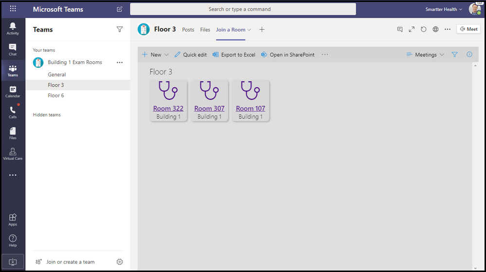

# Microsoft Teams 用のアプリ テンプレート

アプリ テンプレートは、Microsoft Teams 用の実稼働可能なアプリです。コミュニティ主導型、オープン ソースで、GitHub で利用できます。 各アプリには、組織用に展開してインストールするための詳細な手順が記載されています。使用可能な状態でアプリが提供されているため、すぐにインストールして使用を開始できます。 完全なソースコードも利用できるので、詳細を調べたり、コードをフォークして特定のニーズに合わせて変更したりできます。

**&#9734; 新たにリリースされたアプリ テンプレートを示します。**

### 主な利点

* **プラグ アンド プレイ エクスペリエンス:** すべてのアプリ テンプレートには、Microsoft Azure で必要なすべてのサービスをホストできるようにする展開スクリプトが含まれています。 アプリを展開するためにコーディングは必要ありません。
* **本番用コード:** アプリ テンプレートは、セキュリティとインフラストラクチャに関する推奨されるベスト プラクティスに準拠しており、コミュニティから送信されたすべての変更は、継続的な準拠を保証するために確認されます。
* **カスタマイズ可能かつ拡張可能:** すべてのアプリ テンプレートはそのまま展開する準備ができていますが、コード ベース全体と展開スクリプトを提供しているため、独自のニーズに合わせて簡単にカスタマイズまたは拡張できます。
* **詳細なドキュメントとサポート:** すべてのアプリ テンプレートには、ソリューション アーキテクチャ、展開、構成の手順に関するエンドツーエンドのドキュメントが付属しています。 リポジトリも監視されているため、GitHub で問題を提起して、発生した問題を報告してください。

## Ask Away

Ask Away は、ユーザーが Teams 内で Q&A (質問と回答) セッションを実行できるようにする [Microsoft Teams ボット](../bots/what-are-bots.md)です。 チーム メンバーは、Ask Away ボットを使用して、同僚が共有する質問を送信して賛成票を投じることができます。これにより、Q&A ホストは、チャネルまたはチャット内で最も重要な質問を簡単に収集できます。 ボットを使用して、Teams 会議でリアルタイムの Q&A セッションを実行でき、出席者はチャットを介してライブで質問を送信できます。

[GitHub で入手する](https://github.com/OfficeDev/microsoft-teams-apps-askaway)

:::row:::
  :::column span="2":::
      
:::column-end:::
:::row-end:::

## アソシエイト インサイト

アソシエイト インサイトは、現場担当者が顧客の意見、感情、認識を直接キャプチャして送信できるようにする [Power Apps](/powerapps/maker/canvas-apps/embed-teams-app) テンプレートです。 多くの場合、現場担当者は、一対一の連絡窓口で顧客と関わりを持つ最初の会社の代表者です。 収集されたデータは、製品の改善とカスタマー エクスペリエンスの向上のために、たとえば Power BI Teams タブを介して、ビジネスチームが共同で共有および使用できます。

[GitHub で入手する](https://github.com/OfficeDev/microsoft-teams-apps-associateinsights)

:::row:::
  :::column span="2":::
      
:::column-end:::
:::row-end:::
:::row:::
:::column span="2":::
    
:::column-end:::
:::row-end:::

## 勤怠

勤怠アプリは、チームにピン留めすることができる [[Power Apps]](/powerapps/maker/canvas-apps/embed-teams-app) タブです。 これは、通常、学習環境やトレーニング環境などの設定で出欠を記録するように設計されています。 ユーザーは、過去 30 日間までの出席をマークまたは編集し、グループ全体または個々の出席者の要約された出席レポートを表示できます。

[GitHub で入手する](https://github.com/OfficeDev/microsoft-teams-apps-attendance)

## 会議室予約

会議室予約は、会議室をすばやく検索して、現在時刻から 30 分間 (既定)、60 分間、90 分間予約できる [Microsoft Teams ボット](../bots/what-are-bots.md)です。 会議室予約ボットは、個人の会話または一対一の会話を対象としています。

[GitHub で入手する](https://github.com/OfficeDev/microsoft-teams-apps-bookaroom)

## アクセスを構築する

Building Access は、施設の管理者が従業員が施設に滞在しているかどうかを管理、追跡、報告できるようにして、建物の占有しきい値と社会的距離の基準の管理をサポートする Microsoft [Power Platform](https://powerapps.microsoft.com/blog/now-in-preview-customize-teams-with-built-in-power-platform-capabilities/) ベースのアプリです。 Microsoft [Power Apps](/powerapps/powerapps-overview)、[Power Automate](/power-automate/getting-started)を使用して構築されたこのアプリは、Microsoft Teams と緊密に統合されており、組織が建物の準備状況を判断し、現場アクセスの適格基準を確立し、将来の計画のための分析情報を収集できるようにします。

[GitHub で入手する](https://github.com/OfficeDev/microsoft-teams-apps-buildingaccess)

:::row:::
   :::column span="":::
     
   :::column-end:::
   :::column span="":::
      
   :::column-end:::
:::row-end:::

## Celebrations

Celebrations は、チームメンバーがお互いの誕生日、記念日、その他の定期的なイベントを祝うのに役立つ Teams アプリです。 チーム メンバー全員の特別な日を思い出し、イベント作成時に選択されたすべてのチームに友好的なメッセージを送信して、チーム メンバーがその日に特別な気分になるようにします。

このアプリでは、チームメンバー全員が簡単にイベントを追加および表示できるようにするためのインターフェイスが用意されています。また、イベントを共有するチームをユーザーが選択できるようにします。

[GitHub で入手する](https://github.com/OfficeDev/microsoft-teams-celebrations-app)

## チェックリスト

Checklist は、チャットやチャネルで共有チェックリストを作成することで、チームと共同作業を行うことができる、Microsoft Teams のカスタム [メッセージング拡張機能](../messaging-extensions/what-are-messaging-extensions.md)アプリです。 このアプリは、デスクトップ、ブラウザー、iOS、Android のすべての Teams プラットフォーム クライアントでサポートされており、Microsoft365 サブスクリプションの一部として展開する準備ができています。  

[GitHub で入手する](https://github.com/OfficeDev/microsoft-teams-checklist-app )

:::row:::
:::column span="2":::
      
:::column-end:::
:::row-end:::

## Classroom Drop-in &#9734;

Classroom Drop-in は、システム リーダーがクラス チーム (仮想教室) を見つけて、必要に応じて指定したドロップイン期間に自分自身または他のユーザーをこれらのクラス チームに追加できる Microsoft [Power Platform](https://powerapps.microsoft.com/blog/now-in-preview-customize-teams-with-built-in-power-platform-capabilities/)ベースのアプリです。 Microsoft [Power Apps](/powerapps/powerapps-overview) と [Power Automate](/power-automate/getting-started)を使用して構築されたアプリは、Microsoft Teams と深く統合され、教育機関がビジネス要件ごとにクラス チームの関連関係者にアクセスを提供することで、ハイブリッド学習環境での運用を最適化できます。

[GitHub で入手する](https://github.com/OfficeDev/microsoft-teams-apps-classroom-dropin)

## 社内コミュニケーター

社内コミュニケーター アプリを使用すると、企業チームはチャットを介して複数のチームまたは多数の従業員向けのメッセージを作成および送信できます。これにより、組織は共同作業を行う場所で従業員に連絡できます。 このテンプレートは、新しいイニシアチブの発表、従業員のオンボーディング、最新の学習と能力開発、組織全体のブロードキャストなど、複数のシナリオに利用できます。

このアプリは、指定されたユーザーがメッセージを作成、プレビュー、共同作業、送信するための簡単なインターフェイスを提供します。

これは、メッセージを確認または操作したユーザーの数に関するカスタム テレメトリなどのカスタム ターゲット通信機能を構築するための基盤を提供します。

[GitHub で入手する](https://github.com/OfficeDev/microsoft-teams-company-communicator-app)

## 連絡先グループの参照

Contact Group Lookup アプリは、組織の連絡先グループ (以前は、「配布リストまたはコミュニケーション グループ」と呼ばれていました) を作成、アクセス、および管理するための便利で有用なアプローチを提供します。 ユーザーは、すべての Teams 環境内で、グループ メンバーの表示とチャット、メンバー ステータスの表示、連絡先グループの選択したメンバーとのグループ チャットの作成をすばやく行うことができます。

[GitHub で入手する](https://github.com/OfficeDev/microsoft-teams-app-contactgrouplookup)

:::row:::
:::column span="2":::
      
:::column-end:::
:::row-end:::
:::row:::
:::column span="2":::
    
:::column-end:::
:::row-end:::

## 同僚の働き&#9734;

Microsoft Teams の同僚の仕事仲間テンプレートを使用すると、ユーザーは Teams のコンテキスト内で同僚の実績を認識できます。 同僚が仕事仲間に報酬を与える場合、受信者と他のチーム メンバーはチャネルの会話でタグ付けされ、チャネルの特典の詳細に関する通知を受け取ります。 The awards are recorded in the Teams app, which is secure, portable, and easily shareable. これは、ランキング付き、PowerApps ベースのバージョンの Open Badges アプリ テンプレートと見なされます。

[GitHub で入手する](https://github.com/OfficeDev/microsoft-teams-apps-coworker-appreciation)

## CrowdSourcer

CrowdSourcer は、グループ メンバーから共同で調達された情報をチームに照会する [Microsoft Teams ボット](../bots/what-are-bots.md)です。 これは、参加者が楽しく役立つ情報リソースに積極的に参加して貢献できるようにしながら、よく寄せられる質問に回答するための優れた方法です。

[GitHub で入手する](https://github.com/OfficeDev/microsoft-teams-crowdsourcer-app)

## カスタム ステッカー

自己表現は健全なチーム文化の中核です。 このアプリ テンプレートは、ユーザーが Microsoft Teams 内で、カスタム ステッカーや GIF を使用できるようにする[メッセージング拡張機能](~/messaging-extensions/what-are-messaging-extensions.md)です。 このテンプレートは、簡単な Web ベースの構成エクスペリエンスを提供し、構成アクセス権を持つユーザーがエンド ユーザーに持たせたい GIF/ステッカー/画像をアップロードできるため、チーム全体で選択したステッカーのセットを使用できます。

このアプリでは、ストレージや共有メカニズムとして SharePoint サイトや個々のチャネルにアクセスしなくても、チーム間で画像/GIF/ステッカーを簡単に共有できます。 たとえば、製品チームは、製品の画像や GIF をソーシャル メディア、マーケティング、販売チームとプログラムで簡単に共有できます。 新しい画像/GIF が利用可能になったときに、特定のチーム/個人への通知フローをトリガーすることで、このアプリを拡張することもできます。

[GitHub で入手する](https://github.com/OfficeDev/microsoft-teams-stickers-app)

## Employee Ideas &#9734;

Employee Ideas アプリは、Azure ベースの Great Ideas アプリ テンプレートの PowerApps バージョンです。 このアプリを使用すると、Teams ユーザーはアイデア キャンペーンを設定および構成できます。 アイデア キャンペーンは、一般的なテーマに関するアイデアをグループ化するカテゴリです。

Teams ユーザーは、次のアクティビティを実行できます。
* アイデアごとに従業員が提出する必要がある標準的な提出フォームを構成します。 
* キャンペーンのアイデアとリストを確認して管理します。
* キャンペーンを変更および削除します。
* リーダーのアイデア掲示板を確認します。
* 優先するアイデアに投票して共有します。
* キャンペーンのアイデアを提出します。
* 他のチーム メンバーのアイデアを表示します。
* 最もいいね! アイデアに投票します。
* キャンペーン内の他のユーザーと比較して、アイデアのパフォーマンスを確認します。

[GitHub で入手する](https://github.com/OfficeDev/microsoft-teams-apps-employeeideas)

 

## E-前書き 

E-Prescriptions は、患者に電子処方箋を発行するプロセスを自動化することにより、遠隔医療と仮想ケアを強化する [Power Apps](/powerapps/maker/canvas-apps/embed-teams-app) ベースのアプリです。 医療専門家は、Teams プラットフォーム内で直接、予定をすばやく確認し、電子処方箋を生成し、電子処方箋を添付した電子メールを患者に送信できます。

[GitHub で入手する](https://github.com/OfficeDev/microsoft-teams-apps-eprescription) 

:::row:::
:::column span="2":::
    ![E-Prescriptions アプリのスクリーンショット。 医療提供者が [生成] ボタンを選択して、患者の処方箋を注文する方法を示します。](../assets/images/e-prescriptions-app-template.png)  
:::column-end:::
:::row-end:::
:::row:::
:::column span="2":::
    
:::column-end:::
:::row-end:::

## 従業員トレーニング 

従業員トレーニングは、主催者が組織の学習およびトレーニング イベントを簡単に公開、追跡、促進できるようにする Microsoft Teams アプリです。  このアプリを使用すると、イベント プランナーはイベント登録者にリマインダーと通知を送信できます。従業員は今後のイベントへの関心を示し、現在のイベントの最新情報を入手し、Teams メッセージング拡張機能を介して同僚とイベントの詳細を共有できます。

[GitHub で入手する](https://github.com/OfficeDev/microsoft-teams-apps-employeetraining)

:::row:::
:::column span="2":::
    **従業員トレーニング イベントの表示**   
:::column-end:::
:::row-end:::
:::row:::
:::column span="2":::
    **従業員トレーニング イベントの作成** 
:::column-end:::
:::row-end:::

## 専門家検索

専門家検索は、スキル、興味、教育属性に基づいて特定の組織メンバーを識別する [Microsoft Teams ボット](../bots/what-are-bots.md)です。 メンバーは、Azure Active Directory ユーザー プロファイルのキーワード検索と一致する組織内のエキスパートを見つけます。

[GitHub で入手する](https://github.com/OfficeDev/microsoft-teams-apps-expertfinder)

## FAQ プラス

会話型 Q&A ボットは、ユーザーからよく寄せられる質問に回答する簡単な方法です。 ただし、ほとんどのボットは、ボットに障害が発生したときにループ内に人間がいないため、意味のある方法でユーザーとやり取りできません。 FAQ ボットは フレンドリーな Q&A ボットですが、ボットが役立たないときには人間が介在するようにします。 ボットに質問をすることができ、知識ベースに含まれている場合、ボットは回答を返します。 そうでない場合、ボットはユーザーがクエリを送信できるようにします。クエリは、チーム内からの通知に基づいて行動することでサポートを提供するのに役立つ、事前に構成された専門家チームに投稿されます。

> [!NOTE]
> **FAQ プラス** の最新リリースは、専門家チームが以下を完了できるようにすることにより、改善された Q&A 解決をサポートします。
>
> &#x2714; メッセージ拡張機能を使用して、ナレッジベースに新しい Q&A を直接追加します。
>
> &#x2714; ボットによって追加された Q&A ペアを編集および削除します。
>
> &#x2714; Q&A の改訂履歴を追跡します。
>
> &#x2714; [アダプティブ カード](../task-modules-and-cards/cards/cards-reference.md#adaptive-card)として表示する追加の詳細を含む回答を構成します。
>
[GitHub で入手する](https://github.com/OfficeDev/microsoft-teams-apps-faqplusv2)

## Goal Tracker

Goal Tracker アプリは、Microsoft Teams内で、組織の目標の設定、進捗状況の観察、成功の確認をサポートする包括的なソリューションです。 このアプリを使用すると、ユーザーは、専門家、個人、チーム レベルで目標を設定、追跡、更新できます。 また、チーム メンバーは、集中力を維持し、順調に進めるために、タイムリーなリマインダーと状態の更新情報を受け取ります。

[GitHub で入手する](https://github.com/OfficeDev/microsoft-teams-app-goaltracker)

:::row:::
  :::column span="2":::
      
:::column-end:::
:::row-end:::
:::row:::
:::column span="2":::
    
:::column-end:::
:::row-end:::

## Great Ideas

Great Ideas アプリは、組織内のイノベーションと創造性をサポートし、力を与えます。 このアプリを使用すると、Microsoft Teams 内で、従業員は同僚やリーダーシップとアイデアを共有し、新しい報告を検索し、同僚の検討のために貢献にスポットライトを当て、最良の提案に投票することができます。

[GitHub で入手する](https://github.com/OfficeDev/microsoft-teams-apps-greatideas)

:::row:::
  :::column span="2":::
      
:::column-end:::
:::row-end:::
:::row:::
:::column span="2":::
    
:::column-end:::
:::row-end:::

## グループ アクティビティ

グループ アクティビティは、チームの所有者が Microsoft Teamsの コンテキスト内でアクティビティ グループをすばやく作成し、コラボレーション ワークフローを管理するのを容易にする Microsoft Teams アプリです。 アクティビティ作成者は、アクティビティを作成し、チーム メンバーをグループにランダムに配布し、オプションで、アクティビティが完了するまでボットにリマインダーを送信させることができます。

[GitHub で入手する](https://github.com/OfficeDev/microsoft-teams-apps-groupactivities)

:::row:::
  :::column span="2":::
      
:::column-end:::
:::row-end:::
:::row:::
:::column span="2":::
    
:::column-end:::
:::row-end:::

## Grow Your Skills

Grow Your Skills アプリは、従業員が組織の補助的なプロジェクトに貢献し、新しいスキルを同時に学習できるようにして、プロフェッショナルな成長と開発をサポートします。 すべての Teams 環境内で、従業員はこのアプリを使用して、自分の興味に合った機会を見つけ、同僚との有意義な共同作業を行い、新しいレベルの専門知識と能力を取得できます。

[GitHub で入手する](https://github.com/OfficeDev/microsoft-teams-apps-growyourskills)

:::row:::
  :::column span="2":::
      
:::column-end:::
:::row-end:::
:::row:::
:::column span="2":::
    
:::column-end:::
:::row-end:::

## HR サポート

HR サポート ボットはフレンドリーな Q&A ボットであり、サポートができない場合に HR チームのサポート プロフェッショナル/エキスパートをループに入れます。 ボットに質問をすることができ、知識ベースに含まれている場合、ボットは回答を返します。 そうでない場合、ボットはユーザーがクエリを送信できるようにします。クエリは、チーム内からの通知に基づいて行動することでサポートを提供するのに役立つ、事前に構成された専門家チームに投稿されます。 さらに、ボットは、質問で事前に構成されたタグを検索することにより、推奨される HR ポリシー/質問へのリンクを提案します。 これらのタイルは、クイックリファレンスとして関連するタブにもあります。 HR サポートは、軽量の QnA に適しています。また、組織内で新しいプロジェクトやイニシアチブを立ち上げるときに迅速なサポートを提供します。

[GitHub で入手する](https://github.com/OfficeDev/microsoft-teams-hrsupport-app)

## アイスブレーカー

アイスブレーカーは、[Microsoft Teams ボット](../bots/what-are-bots.md)で、毎週 2 人のランダムなチーム メンバーをペアにして、チームを近づけることができます。 ボットは、両方のメンバーに有効な空き時間を自動的に提案することで、スケジュール設定を簡単にします。 このアプリで個人的なつながりを強化し、緊密に結びついたコミュニティを構築します。

アイスブレーカー アプリは、チーム全体で個人的なつながりを促進するだけでなく、組織内で関心に基づいたコミュニティを育成するのに役立ちます。 たとえば、このアプリを DevOps の共同作業グループに使用して、アイデアやベストプラクティスを組織全体に有機的に広めることができます。

[GitHub で入手する](https://github.com/OfficeDev/microsoft-teams-icebreaker-app)

## Incentives

Incentives は、トレーニングや変更管理イニシアチブなどの指定されたアクティビティへのインセンティブ付き従業員の参加を管理および追跡する [Power Apps](/powerapps/maker/canvas-apps/embed-teams-app) テンプレートです。 管理者は、アプリを使用して、指定されたアクティビティを確立し、完了のためにポイントを割り当て、報酬に必要な適格ポイント レベルを指定します。 従業員は、アプリを使用して蓄積されたポイントを表示し、資格に達したら、償還可能な報酬を要求して請求します。

[GitHub で入手する](https://github.com/OfficeDev/microsoft-teams-apps-incentives)

## Incident Reporter

Incident Reporter は、組織内のインシデントの管理を最適化する [Microsoft Teams ボット](../bots/what-are-bots.md)です。 ボットは、自動化されたインシデント データ収集、カスタマイズされたインシデント レポート、関連する利害関係者への通知、エンドツーエンドのインシデント追跡を容易にします。

[GitHub で入手する](https://github.com/OfficeDev/microsoft-teams-apps-incidentreport)

:::row:::
  :::column span="2":::
      
:::column-end:::
:::row-end:::
:::row:::
:::column span="2":::
    
:::column-end:::
:::row-end:::

## 検査&#9734;

 検査は、フロント ライン ワーカーが場所から資産や機器までを検査できる Microsoft Teams アプリです。 たとえば、小売店、製造工場、自動車やコンピューターなどです。 このソリューションには、それぞれ異なる種類のユーザーを対象とした 2 つのアプリがあります。

このアプリは、フロント ラインの作業者が資産やエリアを検査したり、製品やサービスの品質を管理したり、職場で安全を維持したりできる機能を提供します。 検査中に見つかった問題に対処するために、チーム メンバー間の通信を容易に行います。 このアプリは、問題の解決を迅速に行い、傾向を強調するマネージャー向け簡単なレポートを提供します。

[GitHub で入手する](https://github.com/OfficeDev/microsoft-teams-apps-inspection)

   

## 問題の報告&#9734;

問題報告アプリは、従業員とマネージャーが問題の発生と管理を支援します。 これは、問題を報告するための問題報告アプリと、問題を管理するための問題の管理アプリの 2 つのアプリで構成されています。

チーム マネージャーは、問題の管理アプリを使用して、Microsoft Teams メッセージと Planner タスクがアプリによって作成されるチャネルを含むアプリ エクスペリエンスを構成します。 マネージャーは、ユーザーが問題を報告するときに詳細を収集するテンプレート フォームを作成するためにもアプリを使用します。 たとえば、問題テンプレート フォームを確認、編集、または削除します。 また、アプリを使用して、チームの問題を確認し、問題履歴を報告し、問題の解決を効率的に管理することもできます。

従業員は、問題報告アプリを使用して、問題の解決に必要な問題と詳細を記録します。 アプリは、既存の問題を変更して解決し、個人またはチームの問題の大きなビューを取得するためにも使用されます。

[GitHub で入手する](https://github.com/OfficeDev/microsoft-teams-apps-issuereporting)

  

## 新入社員オンボーディング 

New Employee Onboarding は、組織が新入社員教育で、従業員に一貫した高品質のオンボーディング エクスペリエンスを提供できるようにする Microsoft Teams と [SharePoint New Employee Onboarding が統合されたソリューション](https://lookbook.microsoft.com/details/75e60a32-9849-4ed4-b83e-b2b08983ad19)です。 このアプリは、人事チームと採用マネージャーがオリエンテーションと導入プロセス全体で関連情報を提供するために使用でき、新入社員がフィードバックを共有し、紹介を提供し、オンボーディング タスクを完了するために使用できます。

[GitHub で入手する](https://github.com/OfficeDev/microsoft-teams-apps-newemployeeonboarding)

:::row:::
  :::column span="2":::
    **新入社員のウェルカム カード** 
:::column-end:::
:::row-end:::
:::row:::
:::column span="2":::
    **新入社員のチェックリスト**   
:::column-end:::
:::row-end:::

## オープン バッジ

オープン バッジは、個人が Teams コンテキスト内でデジタル学習資格情報バッジを取得して、どこでも共有できるようにする Microsoft Teams アプリです。 第三者デジタル バッジ発行機関である [Badgr](https://badgr.org/) の機能を使用して、授与されたバッジは受信者の Badgr プロファイルに記録され、生涯学習の豊富な画像を作成して共有するために利用できます。

[GitHub で入手する](https://github.com/OfficeDev/microsoft-teams-apps-openbadges)

:::row:::
  :::column span="2":::
      
:::column-end:::
:::row-end:::
:::row:::
:::column span="2":::
    
:::column-end:::
:::row-end:::

## ポーリング 

Poll は、チャットまたはチャネルで投票をすばやく作成して送信し、チームの意見や好みを収集できるようにする Microsoft Teams のカスタム [メッセージング拡張機能](../messaging-extensions/what-are-messaging-extensions.md)アプリです。 このアプリは、デスクトップ、ブラウザー、iOS、Android のすべての Teams プラットフォーム クライアントでサポートされており、Microsoft365 サブスクリプションの一部として展開する準備ができています。

[GitHub で入手する](https://github.com/OfficeDev/microsoft-teams-poll-app)

:::row:::
  :::column span="1":::
      
:::column-end:::
:::row-end:::

## クイック応答

クイック応答は、ユーザーのよくある質問 (FAQ) に効果的に回答するための堅牢なソリューションを提供する Microsoft Teams アプリです。 各クエリに手動で継続的に情報を繰り返す代わりに、アプリは、Teams [メッセージング拡張機能](../messaging-extensions/what-are-messaging-extensions.md)を介してインタラクティブなユーザー エクスペリエンスのための応答のライブラリを構築します。

[GitHub で入手する](https://github.com/OfficeDev/microsoft-teams-apps-quickresponses)

## 迅速なアシスト&#9734;

Rapid Assist は、Microsoft [Power Platform](https://powerapps.microsoft.com/blog/now-in-preview-customize-teams-with-built-in-power-platform-capabilities/) ベースのアプリです。お客様に対する関係者は、迅速な回答の取得、情報の検索、オープンな要求のフォローアップを行い、専門家が質問に答えるのに役立つ通話を迅速に受け取る通知を受信できます。 Microsoft [Power Apps](/powerapps/powerapps-overview) と [Power Automate](/power-automate/getting-started)を使用して構築されたアプリは、Microsoft Teams と深く統合され、組織はフロントライン ワーカーを企業の連絡員と簡単に接続して、顧客の問い合わせを解決し、優れたカスタマー エクスペリエンスを提供できます。 

[GitHub で入手する](https://github.com/OfficeDev/microsoft-teams-apps-rapid-assist)

:::row:::
   :::column span="":::
     
   :::column-end:::
   :::column span="":::
      
   :::column-end:::
:::row-end:::

## 反映 

Reflect は、チーム メンバーがチーム内の同僚やグループリーダーと感情的に幸福な状態を直接共有するための安全かつ包括的なリソースを提供する Microsoft Teams のカスタム [メッセージング拡張機能](../messaging-extensions/what-are-messaging-extensions.md)アプリです。 このアプリは、チャネル、グループ、会議、一対一チャットで利用でき、チェックイン応答は、パブリック、プライベートから送信者、または完全に匿名に設定できます。

[GitHub で入手する](https://github.com/OfficeDev/Microsoft-Teams-App-Reflect)

:::row:::
    :::column:::
    **ウェルビーイング投票**
    
    
    :::column-end:::
:::row-end:::

## リモート サポート

リモート サポートは、組織全体のサポート要求者と内部サポート チームの間に焦点を絞ったインターフェイスを提供する [Microsoft Teams ボット](../bots/what-are-bots.md)です。  エンド ユーザーは、サポートの要求を送信、編集、取り消すことができ、サポート チームはすべての Teams プラットフォーム内で要求に応答、管理、更新できます。

[GitHub で入手する](https://github.com/OfficeDev/microsoft-teams-apps-remotesupport)

:::row:::
  :::column span="2":::
      
:::column-end:::
:::row-end:::
:::row:::
:::column span="2":::
    
:::column-end:::
:::row-end:::

## Request-a-team

Request-a-team は、企業組織の新しいチーム作成を最適化する Microsoft Teams アプリです。 このアプリは、ウィザードでガイドされたリクエスト フォーム、組み込み承認プロセス、要求状態ダッシュボード、自動化されたチーム ビルドの統合を通じて、新しいチーム インスタンスを作成する際の標準化とベスト プラクティスをサポートします。

[GitHub で入手する](https://github.com/OfficeDev/microsoft-teams-apps-requestateam)

:::row:::
  :::column span="2":::
    
:::column-end:::
:::row-end:::
:::row:::
:::column span="2":::
    
:::column-end:::
:::row-end:::

## Scrums for Channels

Scrums for Channels は、ユーザーが Microsoft Teams 内のチャネルでスクラムをスケジュールして実行できるようにするスクラム アシスタント アプリです。 このアプリは、リモート チームや、地理的に異なる場所やタイムゾーンのメンバーで構成されるチームが毎日の更新情報を共有し、スクラム スタンドアップ ミーティングに確実に参加できるようにするのに最適です。

[GitHub で入手する](https://github.com/OfficeDev/microsoft-teams-apps-scrumsforchannels)

> [!NOTE]
> グループ チャットでスクラム ミーティングを実施するには、[Scrums for Group Chat](#scrums-for-group-chat) アプリ テンプレートを参照してください。

:::row:::
  :::column span="2":::
    
:::column-end:::
:::row-end:::
:::row:::
:::column span="2":::
    
:::column-end:::
:::row-end:::

## Scrums for Group Chat

> [!NOTE]
> Scrums Status アプリ テンプレートは更新され、Scrums for Group Chat になりました。

Scrums for Group Chat は、グループ チャットのメンバーが非同期スタンドアップ ミーティングを実行し、毎日の更新情報を簡単に共有できるようにする、サポート的なスクラム アシスタントです。 これにより、グループ チャットのすべてのメンバーがスクラムに貢献し、実行中のスクラムで他のメンバーが行った更新情報を表示できます。

[GitHub で入手する](https://github.com/OfficeDev/microsoft-teams-apps-scrumsforgroupchat)

## 今すぐ共有 

Share Now アプリは、ユーザーがチーム環境内でコンテンツを簡単に共有できるようにすることで、同僚間の積極的な情報交換を促進します。 ユーザーはアプリを使用して、関心のあるアイテムをチーム メンバーと共有し、新しい共有コンテンツを見つけ、環境設定を設定し、後で読むためにお気に入りをブックマークします。

[GitHub で入手する](https://github.com/OfficeDev/microsoft-teams-apps-sharenow)

## SharePoint リスト検索

Microsoft Teams でのコラボレーションでは、SharePoint リストのアイテム内に含まれる情報を参照することがよくあります。 問題のアイテムへのリンクを貼り付けるだけで、全員が会話からコンテキストを切り替え、必要な情報を見つけてから、会話を続けるために Teams に戻ることができます。 会話が続くと、通常、ユーザーは参照アイテムに何度も戻って新しいコメントを確認し、アイテムに含まれる情報の記憶を更新する必要があります。 このコンテキストの切り替えは、スムーズなコラボレーションへの障壁を生み出し、亀裂を通り抜ける物事のレシピです。

このような問題を軽減するために、リスト検索アプリ テンプレートをお届けします。 何百万人ものユーザーが SharePoint を使用して、組織のコアワークフローの一部を強化しています。 ただし、リストを中心に共同作業を行うのは特に面倒です。 Microsoft Teams のリスト検索アプリ テンプレートを使用すると、ユーザーは SharePoint リスト アイテムの情報をチャットの会話内に直接挿入して、チャットにリンクを挿入するだけで発生するコンテキストの切り替えを軽減できます。 情報は読みやすい自動書式カードとして挿入され、ユーザーが会話に参加し続けるのに役立ちます。

[GitHub で入手する](https://github.com/OfficeDev/microsoft-teams-list-search-app)

## Staff Check-ins

Staff Check-ins は、[Power Apps](/powerapps/powerapps-overview) ベースのアプリであり、ビジネス担当者と現場担当者の間の監視コミュニケーションを可能にします。 スタッフは、タイムクリティカルな情報とステータスの更新情報を、スケジュール ベースまたはアドホック ベースで、Teams から直接簡単に提供できます。 このアプリは、リアルタイムの位置情報、写真、メモのほか、リマインダー通知と自動ワークフローをサポートしています。

[GitHub で入手する](https://github.com/OfficeDev/microsoft-teams-apps-staffcheckins)

## アンケート

Survey は、チャットまたはチャネルで調査を作成してデータを収集し、実用的な洞察を得ることができる Microsoft Teams のカスタム [メッセージング拡張機能](../messaging-extensions/what-are-messaging-extensions.md)アプリです。  このアプリは、デスクトップ、ブラウザー、iOS、Android のすべての Teams プラットフォーム クライアントでサポートされており、Microsoft365 サブスクリプションの一部として展開する準備ができています。  

[GitHub で入手する](https://github.com/OfficeDev/Microsoft-Teams-Survey-app)

:::row:::
  :::column span="2":::
    
:::column-end:::
:::row-end:::

## 仮想丸め&#9734;

病院や緊急電話のプロバイダーは、1 日に数十回、多くの場合何百回もの "ラウンド" を行います。 患者に対するこれらの迅速なチェックインは、患者がどのように行っているのかの状態チェックを提供し、患者の懸念に対処することを目的とします。 丸めは、患者が複数の種類のプロバイダーによって監視されるのを確実にするための不可欠な方法ですが、各プロバイダーから、新しいマスク、および新しい一連のテープを使用する必要がある各訪問について、PPE の大きなドレインを表します。 このアプリ テンプレートを使用すると、医療労働者は、プロバイダーと患者の間の Microsoft Teams 会議を通じて、事実上簡単にラウンドを実施できます。

仮想丸めソリューションは、Microsoft Health and Life Sciences ブログの投稿 [でも参照されています](https://aka.ms/teamsvirtualrounding)。

[GitHub で入手する](https://github.com/SmartterHealth/Virtual-Rounding)

## 訪問者の管理

Visitor Management アプリを使用すると、組織と従業員は、Microsoft Teams から直接、オンサイトの訪問者プロセスを簡単かつ効率的に管理できます。 このアプリを使用すると、従業員は訪問者の要求を作成し、訪問者のダッシュボードを介して要求状態を一元的に追跡し、訪問者が到着したときにリアルタイムの通知を受け取ることができます。

[GitHub で入手する](https://github.com/OfficeDev/microsoft-teams-app-visitormanagement)

:::row:::
  :::column span="2":::
    
:::column-end:::
:::row-end:::
:::row:::
:::column span="2":::
    
:::column-end:::
:::row-end:::

## Workplace の特典

Workplace Awards は、現代の職場での認識を促進し、従業員の感謝の文化を促進するための前向きなフレームワークを提供する Teams アプリ テンプレートです。 このアプリを使用すると、従業員の報酬と表彰 (R&R) プログラムを設定および管理できます。このプログラムでは、従業員が同僚を簡単に指名して承認し、 R&R リーダーが提出された指名を表示し、賞を授与し、受領者を発表できます。

[GitHub で入手する](https://github.com/OfficeDev/microsoft-teams-apps-workplaceawards)

:::row:::
  :::column span="2":::
    
:::column-end:::
:::row-end:::
:::row:::
:::column span="2":::
    
:::column-end:::
:::row-end:::

見たいアプリ テンプレートのアイデアがありますか? [ある場合はご連絡ください](https://forms.office.com/Pages/ResponsePage.aspx?id=v4j5cvGGr0GRqy180BHbR2_7qFm_lcZAr4eqEhnLsZ9UMVZGT1lCT0FXUDdZMUM0RkpBS1BESTAwWC4u)。
