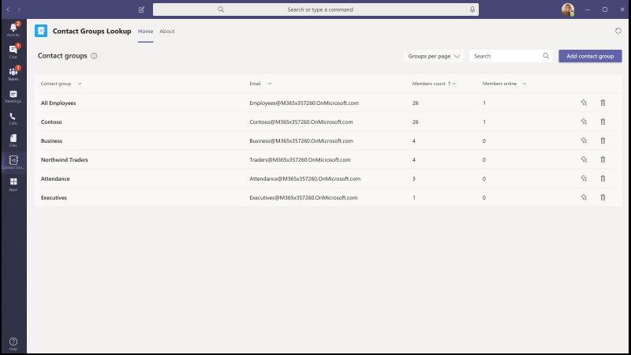

# Microsoft Teams 用のアプリ テンプレートApp templates for Microsoft Teams

アプリ テンプレートは、オープン ソースで、GitHub で利用できる Microsoft Teams 用の完全なアプリの例です。App templates are examples of complete apps for Microsoft Teams that are open-source and available on GitHub. 各アプリ テンプレートには、組織用に展開してインストールするための詳細な手順が記載されています。Each app template contains detailed instructions for deploying and installing that app for your organization. また、すぐにインストールして使用を開始できるサンプルアプリも提供します。It also provides a sample app that you can install and start using immediately. 完全なソースコードも利用可能で、詳細に調べるか、コードをフォークして、特定の要件を満たすように変更することができます。The complete source code is also available, which allows you to explore it in detail or fork the code and alter it to meet your specific requirements.
すべてのアプリテンプレートは [MIT ライセンス](https://github.com/OfficeDev/microsoft-teams-apps-eprescription/blob/master/LICENSE)の条件下で提供されます。All app templates are provided under the [MIT License](https://github.com/OfficeDev/microsoft-teams-apps-eprescription/blob/master/LICENSE) terms.

> [!NOTE] 
> ユーザーおよび組織向けに、アプリ テンプレートから作成されたアプリのライセンスとサポートを行う必要があります。You must license and support apps created from app templates for your users and organizations.

**&#9734; 新たにリリースされたアプリ テンプレートを示します。****&#9734; Indicates newly released app templates.**

### 主な利点Key benefits

* **クラウドに直接展開:** すべてのアプリ テンプレートには展開スクリプトが含まれており、必要なサービスをすべて Microsoft Azure または Power Platform にホストすることができます。**Deploy directly to the cloud:** All app templates include deployment scripts that allows you to host all required services in Microsoft Azure or the Power Platform. 
* **推奨サンプルコード:** アプリ テンプレートは、セキュリティとインフラストラクチャに関して推奨されるベスト プラクティスに準拠しています。**Recommended sample code:** The app templates conform to recommended best practices around security and infrastructure. コミュニティから提出されたアプリ テンプレートの変更はすべて、適合性を確認するためにレビューされます。All community submitted changes to the app templates are reviewed to ensure conformance.
* **カスタマイズ可能で拡張可能:** すべてのアプリ テンプレートは最小限の構成で展開されますが、コード ベーススクリプトと配置スクリプト全体が用意されているので、独自のニーズに合わせて簡単にカスタマイズまたは拡張できます。**Customizable and extensible:** While all app templates are deployed with minimal configuration, the entire code base and deployment scripts are provided, so that you can easily customize or extend them to fit your unique needs.
* **詳細なドキュメント:** すべてのアプリ テンプレートには、ソリューション アーキテクチャ、展開、構成の手順に関するエンドツーエンドのドキュメントが付属しています。**Detailed documentation:** All app templates are accompanied by end-to-end documentation on solution architecture, deployment, and configuration steps.  

## 導入ボットAdoption Bot 

導入ボットは、PVA用のパワー仮想エージェントで構築されたユーザーケアチャットボットTeams。Adoption Bot is a user care chat bot built with Power Virtual Agent for Teams PVA. これは、FAQプラスのPVAバージョンとして考えられています。It is considered as the PVA version of FAQ Plus. Adoption Bot は、Microsoft 365 と Teams に関する 100 以上の一般的な質問に回答しています。Adoption Bot answers 100+ common questions about Microsoft 365 and Teams. 既存のトピックを編集したり、独自のトピックを追加したり、既存の FAQ を取り込むことができます。You can edit the existing topics, add your own topics, and ingest existing FAQs. ユーザーが追加のヘルプを必要とする場合、Adoption Bot は専門家への接続や、プレミアム フロー コネクタを使用して拡張し、サービス チケットを開くことができます。If users need additional help, Adoption Bot can connect them to experts or even be extended to open service tickets with premium flow connectors. このボットは、自己インストールされているか、導入 [ハブ](https://github.com/akporzondek/adoption_hub)などのカスタム アプリに組み込まれています。This bot is self-installed or built into a custom app, such as the [Adoption Hub](https://github.com/akporzondek/adoption_hub).

[GitHub で入手するGet it on GitHub](https://github.com/OfficeDev/microsoft-teams-apps-adopt-bot)

## 導入ツール- チャンピオン管理プラットフォーム &#9734;Adoption Tool- Champion Management Platform &#9734;

チャンピオン管理プラットフォーム (CMP) アプリ テンプレートを使用すると、チームワークのチャンピオンを管理、拡張、インスパイアして、より多くのことを達成できます。The Champion Management Platform (CMP) app template helps you manage, scale, and inspire your teamwork champions to achieve more. このアプリ テンプレートは、SharePoint Framework上に構築され、チーム内のタブに読み込まれます。This app template is built on the SharePoint Framework and loaded into a tab within a team. グループはこのツールを活用して、プログラムのメンバーシップを管理したり、ログ記録用のスコアボードとイベントタイプを提供したり、デジタルバッジをプログラム参加者にオーバーレイするツールを提供したりできます。Groups can leverage this tool to help manage program membership, provide a leaderboard and event types for logging, and tools to overlay digital badges to program participants.

[GitHub で入手するGet it on GitHub](https://github.com/OfficeDev/microsoft-teams-apps-champion-management)

## 導入ツール- Microsoft 365学習経路 (はじめに) &#9734;Adoption Tool- Microsoft 365 Learning Pathways (Get Started) &#9734;

はじめにアプリテンプレートを使用すると、Microsoft Teams内の学習経路Microsoft 365力を持って来ることができます。The Get Started app template allows you to bring the power of Microsoft 365 learning pathways inside of Microsoft Teams. このアプリテンプレートを使用すると、特定のトレーニングページや他のイントラネット資産への簡単なアクセスを許可し、コンテンツをTeams内に直接読み込むことができます。This app template allows you to grant easy access to specific training pages or other intranet assets and load the content directly within Teams. また、会社のブランドに合わせてアプリ名やロゴを変更することもできます。You can also change the app name or logo to match your company branding.

[GitHub で入手するGet it on GitHub](https://github.com/msft-teams/tools/tree/master/M365%20Learning%20Pathways)

## 予定マネージャAppointment Manager 

Appointment Manager は、企業が Teams を経由して消費者とのバーチャルの予定を作成、管理、実施するための Teams アプリ テンプレートです。Appointment Manager is a Teams app template to help businesses create, manage, and conduct virtual appointments with consumers through Teams. コンシューマーからの新しい予定要求は、Teams チャネルで表示され、チーム内のスタッフにすばやく割り当てられ、再割り当てされます。New appointment requests from consumers are visible in Teams channels, where they are quickly assigned and reassigned to staff in a team. 予定のリクエストは、チーム レベルまたは個人レベルでカスタム タブを使用して表示されます。Appointment requests are viewed at team or personal levels through custom tabs. すべての予定は Teams のオンライン会議に関連付けられているため、スタッフと消費者は簡単に予定された時間に会議に参加することができます。Every appointment is associated with a Teams online meeting, hence the staff and consumers can easily join the meeting at the scheduled time.

アプリ テンプレートは Microsoft Bookings と統合されており、簡単に予約管理ができます。The app template integrates with Microsoft Bookings for easy appointment management. スケジュールされた予定は、自動的に割り当てられたスタッフのカレンダーに表示され、消費者は会議のリンクが埋め込まれたカスタマイズ可能なメール通知とアラームを受信することができます。Scheduled appointments automatically appear on assigned staff members' calendars, and consumers receive customizable email notifications and reminders with embedded meeting links.

[GitHub で入手するGet it on GitHub](https://github.com/OfficeDev/microsoft-teams-apps-appointment-manager)

## Ask AwayAsk Away

Ask Away は、q&A セッションと呼ばれる質問と回答をTeamsで実行できる[Microsoft Teamsボット](../bots/what-are-bots.md)です。Ask Away is a [Microsoft Teams bot](../bots/what-are-bots.md) that enables users to conduct Question and Answer, called Q&A sessions within Teams. チーム メンバーは、Ask Away ボットを使用して、同僚が共有する質問を送信して賛成票を投じることができます。これにより、Q&A ホストは、チャネルまたはチャット内で最も重要な質問を簡単に収集できます。Using the Ask Away bot, team members can submit and up-vote questions shared by colleagues allowing Q&A hosts to easily gather top-of-mind questions within a channel or chat. ボットは、Teams会議でリアルタイムの Q&A セッションを実施するために使用され、参加者はチャットを通じて質問をライブで送信できます。The bot is used to conduct a real-time Q&A session in a Teams meeting and allows attendees to submit questions live through chat.

[GitHub で入手するGet it on GitHub](https://github.com/OfficeDev/microsoft-teams-apps-askaway)

:::row:::
  :::column span="2":::
      
:::column-end:::
:::row-end:::

## アソシエイト インサイトAssociate Insights

アソシエイト インサイトは、現場担当者が顧客の意見、感情、認識を直接キャプチャして送信できるようにする [Power Apps](/powerapps/maker/canvas-apps/embed-teams-app) テンプレートです。Associate Insights is a [Power Apps](/powerapps/maker/canvas-apps/embed-teams-app) template that empowers firstline workers to directly capture and submit customer opinion, sentiment, and perception. 多くの場合、現場担当者は、一対一の連絡窓口で顧客と関わりを持つ最初の会社の代表者です。Firstline workers are often the first company representative to engage with customers in a one-to-one point-of contact. 収集されたデータは、製品の改善や顧客体験の向上のために、Power BI Teamsタブなどでビジネスチームによって共有され、共同で使用されます。The collected data are shared and used collaboratively by business teams, such as through a Power BI Teams tab, for product improvement and enhancing the customer experience.

[GitHub で入手するGet it on GitHub](https://github.com/OfficeDev/microsoft-teams-apps-associateinsights)

:::row:::
  :::column span="2":::
      
:::column-end:::
:::row-end:::
:::row:::
:::column span="2":::
    
:::column-end:::
:::row-end:::

## 勤怠Attendance

参加時アプリは、チームに固定されている[Power Apps](/powerapps/maker/canvas-apps/embed-teams-app)タブです。The Attendance app is a [Power Apps](/powerapps/maker/canvas-apps/embed-teams-app) tab that are pinned in a team. 学習環境やトレーニング環境などの設定でのプレゼンスを記録するように設計されています。It is designed to record presence in settings, such as learning and training environments. ユーザーは、過去 30 日間までの出席をマークまたは編集し、グループ全体または個々の出席者の要約された出席レポートを表示できます。Users can mark or edit attendance for up to 30 days in the past and view summarized attendance reports for an entire group or individual attendees. チームの出席の詳細については[、「GitHubで取得する](https://github.com/OfficeDev/microsoft-teams-apps-attendance)」を参照してください。For more information on teams attendance, see [Get it on GitHub](https://github.com/OfficeDev/microsoft-teams-apps-attendance).

次の図は、出席アプリのデモを示しています。The following image displays the attendance app demo:  

## 会議室予約Book-a-room

ブックルームは、ユーザーが現在の時刻から30分、60分、または90分の会議室をすばやく見つけて予約できる[Microsoft Teamsボット](../bots/what-are-bots.md)です。Book-a-room is a [Microsoft Teams bot](../bots/what-are-bots.md) that allows users quickly to find and reserve a meeting room for 30, 60, or 90 minutes starting from the current time. デフォルトの時間は 30 分です。The default time is 30 minutes. 会議室予約ボットは、個人の会話または一対一の会話を対象としています。The Book-a-room bot scopes to personal or 1:1 conversations. Book-a-room アプリの詳細については[、「GitHubで入手する](https://github.com/OfficeDev/microsoft-teams-apps-bookaroom)」を参照してください。For more information on Book-a-room app, see [Get it on GitHub](https://github.com/OfficeDev/microsoft-teams-apps-bookaroom).  
次の図は、部屋のブックのデモを示しています。The following image displays the Book-a-room demo:

## Building AccessBuilding Access

Access の構築は、施設のディレクターが管理、追跡、および従業員のオンサイトプレゼンスを報告できるようにすることで、占有しきい値と社会的な混乱の規範を構築する管理をサポートする Microsoft [Power Platform](https://powerapps.microsoft.com/blog/now-in-preview-customize-teams-with-built-in-power-platform-capabilities/) ベースのアプリです。Building Access is a Microsoft [Power Platform](https://powerapps.microsoft.com/blog/now-in-preview-customize-teams-with-built-in-power-platform-capabilities/) based app that supports the administration of building occupancy thresholds and social distancing norms by enabling facilities directors to manage, track, and report employee on-site presence. Microsoft [Power Apps](/powerapps/powerapps-overview)、[Power Automate](/power-automate/getting-started)を使用して構築されたこのアプリは、Microsoft Teams と緊密に統合されており、組織が建物の準備状況を判断し、現場アクセスの適格基準を確立し、将来の計画のための分析情報を収集できるようにします。The app, built using Microsoft [Power Apps](/powerapps/powerapps-overview), and [Power Automate](/power-automate/getting-started), deeply integrates with Microsoft Teams and enables organizations to determine building readiness, establish eligibility criteria for on-site access, and gather insights for future planning.

[GitHub で入手するGet it on GitHub](https://github.com/OfficeDev/microsoft-teams-apps-buildingaccess)

:::row:::
   :::column span="":::
     
   :::column-end:::
   :::column span="":::
      
   :::column-end:::
:::row-end:::

## CelebrationsCelebrations

お祝いは、チームメンバーがお互いの誕生日、記念日、およびその他の定期的なイベントを祝うために役立つTeamsアプリです。Celebrations is a Teams app that helps team members to celebrate each others' birthdays, anniversaries, and other recurring events. チーム メンバー全員の特別な日を思い出し、イベント作成時に選択されたすべてのチームに友好的なメッセージを送信して、チーム メンバーがその日に特別な気分になるようにします。It remembers special occasions of all the team members and sends a friendly message in all the teams selected at the time of event creation, to make the team members feel special on their day.

このアプリでは、チームメンバー全員が簡単にイベントを追加および表示できるようにするためのインターフェイスが用意されています。また、イベントを共有するチームをユーザーが選択できるようにします。The app provides an easy interface for all the team members to personally add and view their events and also allows the user to select the teams in which the events gets shared.

[GitHub で入手するGet it on GitHub](https://github.com/OfficeDev/microsoft-teams-celebrations-app)

## ChecklistChecklist

Checklist は、チャットやチャネルで共有チェックリストを作成することで、チームと共同作業を行うことができる、Microsoft Teams のカスタム [メッセージング拡張機能](../messaging-extensions/what-are-messaging-extensions.md)アプリです。Checklist is a custom Microsoft Teams [messaging extension](../messaging-extensions/what-are-messaging-extensions.md) app that enables you to collaborate with your team by creating a shared checklist in a chat or channel. アプリは、デスクトップ ブラウザー、iOS、Android など、すべての Teamsプラットフォーム クライアントでサポートされています。The app is supported across all Teams platform clients, such as desktop browser, iOS, and Android. アプリは、Microsoft 365 サブスクリプションの一部として展開する準備ができています。The app is ready for deployment as part of your Microsoft 365 subscription.  

[GitHub で入手するGet it on GitHub](https://github.com/OfficeDev/microsoft-teams-checklist-app)

:::row:::
:::column span="2":::
      
:::column-end:::
:::row-end:::

## 教室ドロップインClassroom Drop-in 

Classroom Drop-in は、システム リーダーがクラス チームを見つけ、仮想教室を意味し、必要に応じて指定したドロップイン期間に、これらのクラス チームに自分自身または他のユーザーを追加できるようにする Microsoft [Power Platform](https://powerapps.microsoft.com/blog/now-in-preview-customize-teams-with-built-in-power-platform-capabilities/)ベースのアプリです。Classroom Drop-in is a Microsoft [Power Platform](https://powerapps.microsoft.com/blog/now-in-preview-customize-teams-with-built-in-power-platform-capabilities/)-based app that enables system leaders to find class teams, means virtual classrooms and add themselves or others to these class teams for a specified drop-in period, as needed. Microsoft [Power Apps](/powerapps/powerapps-overview) と [Power Automate](/power-automate/getting-started) を使用して構築されたアプリは、Microsoft Teams と深く統合されており、教育機関は、ビジネス要件に応じてクラスチームに関連する関係者へのアクセスを提供することで、ハイブリッドな学習環境での運用を最適化することができます。The app built using Microsoft [Power Apps](/powerapps/powerapps-overview) and [Power Automate](/power-automate/getting-started), deeply integrates with Microsoft Teams to ensure educational institutes can optimize their operations in a hybrid learning environment by providing access to relevant stakeholders for class teams per business requirements.

[GitHub で入手するGet it on GitHub](https://github.com/OfficeDev/microsoft-teams-apps-classroom-dropin)

## 社内コミュニケーターCompany Communicator

社内コミュニケーター アプリを使用すると、企業チームはチャットを介して複数のチームまたは多数の従業員向けのメッセージを作成および送信できます。これにより、組織は共同作業を行う場所で従業員に連絡できます。The Company Communicator app enables corporate teams to create and send messages intended for multiple teams or large number of employees over chat allowing organization to reach employees right where they collaborate. このテンプレートは、新しいイニシアチブの発表、従業員のオンボーディング、最新の学習、開発や組織全体のブロードキャストなど、複数のシナリオに利用できます。Utilize this template for multiple scenarios such as new initiative announcements, employee onboarding, modern learning, and development or organization-wide broadcasts.

このアプリは、指定されたユーザーがメッセージを作成、プレビュー、共同作業、送信するための簡単なインターフェイスを提供します。The app provides an easy interface for designated users to create, preview, collaborate and send messages.

これは、メッセージを確認または操作したユーザーの数に関するカスタム テレメトリなどのカスタム ターゲット通信機能を構築するための基盤を提供します。It provides a foundation to build custom targeted communication capabilities such as custom telemetry on how many users acknowledged or interacted with a message.

[GitHub で入手するGet it on GitHub](https://github.com/OfficeDev/microsoft-teams-company-communicator-app)

## Contact Group LookupContact Group Lookup

連絡先グループ検索アプリは、組織の連絡先グループ (以前は配布リストまたは通信グループと呼ばれていた) を作成、アクセス、および管理するための便利で便利な方法を提供します。The Contact Group Lookup app provides a convenient and useful approach to creating, accessing, and managing your organization's contact groups, formerly known as distribution lists or communication groups. ユーザーは、すべての Teams 環境内で、グループ メンバーの表示とチャット、メンバー ステータスの表示、連絡先グループの選択したメンバーとのグループ チャットの作成をすばやく行うことができます。Users can quickly view and chat with group members, view member status, and create a group chat with selected members in the contact group, all within the Teams environment.

[GitHub で入手するGet it on GitHub](https://github.com/OfficeDev/microsoft-teams-app-contactgrouplookup)

:::row:::
:::column span="2":::
      
:::column-end:::
:::row-end:::
:::row:::
:::column span="2":::
    
:::column-end:::
:::row-end:::

## 同僚の感謝Co-worker Appreciation 

Microsoft Teams の Co-worker Appreciation テンプレートを使用すると、ユーザーは Teams のコンテキストで同僚の業績を認識することができます。Using the co-worker appreciation template in Microsoft Teams, users can recognize their colleagues' achievements within the Teams’ context. 共同作業者が同僚へのリワードを選択すると、受信者や他のチーム メンバーがチャネルの会話でタグ付けされ、チャネルのリワードの詳細についての通知を受け取ることができます。When co-workers select to reward a colleague, recipients and other team members are tagged in a channel conversation and they receive a notification about the channel's award details. アワードは Teams アプリに記録され、安全で携帯性に優れ、簡単に共有することができます。The awards are recorded in the Teams app, which is secure, portable, and easily shareable. これは、PowerApps ベースのバージョンのオープン バッジ アプリ テンプレートと見なされ、スコア ボードが付きます。This is considered as the PowerApps based version of the Open Badges app template, with a leaderboard.

[GitHub で入手するGet it on GitHub](https://github.com/OfficeDev/microsoft-teams-apps-coworker-appreciation)

## CrowdSourcerCrowdSourcer

CrowdSourcer は、グループ メンバーから共同で調達された情報をチームに照会する [Microsoft Teams ボット](../bots/what-are-bots.md)です。CrowdSourcer is a [Microsoft Teams bot](../bots/what-are-bots.md) that gives teams queried information sourced collaboratively from group members. よく寄せられる質問に答え、参加者が楽しく役立つ情報リソースに積極的に参加し、貢献できるようにします。It helps to answer frequently asked questions while enabling participants to actively engage in and contribute to a fun and helpful information resource.

[GitHub で入手するGet it on Github](https://github.com/OfficeDev/microsoft-teams-crowdsourcer-app)

## カスタム ステッカーCustom Stickers

自己表現は健全なチーム文化の中核です。Self-expression is core to a healthy team culture. このアプリ テンプレートは、ユーザーが Microsoft Teams 内で、カスタム ステッカーや GIF を使用できるようにする[メッセージング拡張機能](~/messaging-extensions/what-are-messaging-extensions.md)です。This app template is a [messaging extension](~/messaging-extensions/what-are-messaging-extensions.md) that enables your users to use custom stickers and GIFs within Microsoft Teams. このテンプレートは、構成アクセス権を持つ誰もがGIF、ステッカー、および画像をアップロードできる簡単なWebベースの設定体験を提供し、チーム全体が選択したステッカーのセットを使用できるようにします。This template provides an easy web-based configuration experience where anyone with configuration access can upload the GIFs, stickers, and images they want their users to have, allowing your entire team to use any set of stickers you choose.

このアプリはまた、ストレージや共有メカニズムとしてSharePointサイトや個々のチャネルへのアクセスを必要とせずに、チーム間で画像、GIF、ステッカーの共有を容易にできます。This app also enables easy sharing of images, GIFs, stickers across teams without needing access to SharePoint sites or individual channels as storage and sharing mechanisms. たとえば、製品チームは、製品イメージや GIF ファイルを、プログラムでソーシャル メディア、マーケティング、営業チームと簡単に共有できます。For example, product teams can easily share product images and GIFs to social media, marketing, and sales teams programmatically. また、新しい画像、およびGIFが利用可能になったときに、特定のチームや個人に通知フローをトリガーすることによって、このアプリを拡張することができます。One can also extend this app by triggering a notification flow to specific teams or individuals when new images, and GIFs are made available.

[GitHub で入手するGet it on GitHub](https://github.com/OfficeDev/microsoft-teams-stickers-app)

## 従業員のアイデアEmployee Ideas

Employee Ideas アプリは、Azure ベースの Great Ideas アプリ テンプレートの PowerApps 版です。The Employee Ideas app is the PowerApps version of the Azure based Great Ideas app template. このアプリでは、Teams ユーザーがアイデア キャンペーンの設定や構成を行うことができます。The app enables the Teams users to set up and configure an idea campaign. アイデア キャンペーンとは、共通のテーマを中心にアイデアをグループ化するためのカテゴリーです。An idea campaign is a category for grouping ideas around common themes.

Teamsユーザーは、以下のアクティビティを実行することもできます。Teams users can also perform the following activities:

* 従業員が各アイデアに対して提出する必要がある標準の提出フォームを構成します。Configure a standard submission form that employees must submit for each idea. 
* キャンペーンのアイデアやリストを見直して管理します。Review and manage the ideas and list of campaigns.
* キャンペーンを変更、削除します。Modify and delete campaigns.
* アイデアのランキングをレビューします。Review leader boards of ideas.
* 優先順位の高いアイデアに投票し、共有します。Vote for and share prioritized ideas.
* キャンペーンのアイデアを送信します。Submit ideas for a campaign.
* 他のチーム メンバーのアイデアを表示します。View other team member's idea.
* 最も気に入ったアイデアに投票します。Vote on most liked ideas.
* キャンペーンの他のユーザーと比較して、自分のアイデアのパフォーマンスをレビューします。Review the performance of their ideas compared with others within a campaign.

[GitHub で入手するGet it on GitHub](https://github.com/OfficeDev/microsoft-teams-apps-employeeideas)

 

## E-PrescriptionsE-Prescriptions 

E-処方箋は、患者に電子処方箋を発行するプロセスを自動化することにより、遠隔医療と仮想ケアを強化する[Power Apps](/powerapps/maker/canvas-apps/embed-teams-app)ベースのアプリです。E-Prescriptions is a [Power Apps](/powerapps/maker/canvas-apps/embed-teams-app) based app that enhances telemedicine and virtual care by automating the process of issuing e-prescriptions to patients. 医療専門家は、Teams プラットフォーム内で直接、予定をすばやく確認し、電子処方箋を生成し、電子処方箋を添付した電子メールを患者に送信できます。Medical professionals can quickly review appointments, generate e-prescriptions, and send emails with e-prescription attachments to patients directly within the Teams platform.

[GitHub で入手するGet it on GitHub](https://github.com/OfficeDev/microsoft-teams-apps-eprescription) 

:::row:::
:::column span="2":::
      
:::column-end:::
:::row-end:::
:::row:::
:::column span="2":::
    
:::column-end:::
:::row-end:::

## Employee TrainingEmployee Training 

従業員トレーニングは、組織の学習イベントやトレーニング イベントを開催者が簡単に公開、追跡、促進できるMicrosoft Teamsアプリです。Employee training is a Microsoft Teams app that enables organizers to easily publish, track, and promote learning and training events for your organization.  このアプリを使用すると、イベントプランナーはイベント登録者にリマインダーや通知を送信することができ、従業員は今後のイベントへの関心を示し、現在のイベントを最新の状態に保ち、Teamsメッセージング拡張機能を通じて同僚とイベントの詳細を共有することができます。With the app, event planners can send reminders and notifications to event registrants and employees can indicate interest in upcoming events, stay updated on current events, and share event details with colleagues through the Teams messaging extension.

[GitHub で入手するGet it on GitHub](https://github.com/OfficeDev/microsoft-teams-apps-employeetraining)

:::row:::
:::column span="2":::
    **従業員トレーニング イベントの表示** **View employee training events**   
:::column-end:::
:::row-end:::
:::row:::
:::column span="2":::
    **従業員トレーニング イベントの作成** **Create employee training event** 
:::column-end:::
:::row-end:::

## 専門家検索Expert Finder

専門家検索は、スキル、興味、教育属性に基づいて特定の組織メンバーを識別する [Microsoft Teams ボット](../bots/what-are-bots.md)です。Expert Finder is a [Microsoft Teams bot](../bots/what-are-bots.md) that identifies specific organization members based on their skills, interests, and education attributes. メンバーは、組織内で、Azure Active Directoryユーザー プロファイルのキーワード検索に一致する専門家を検索します。Members find experts within an organization that match a keyword search of Azure Active Directory user profiles.

[GitHub で入手するGet it on GitHub](https://github.com/OfficeDev/microsoft-teams-apps-expertfinder)

## FAQ プラスFAQ Plus

会話型 Q&A ボットは、ユーザーからよく寄せられる質問に回答する簡単な方法です。Conversational Q&A bots are an easy way to provide answers to frequently asked questions by users. しかし、ボットが失敗したときにループに人間がいないため、ほとんどのボットはユーザーと有意義な方法で関与しません。But, most bots fail to engage with users in meaningful way because there is no human in the loop when the bot fails. FAQ ボットは フレンドリーな Q&A ボットですが、ボットが役立たないときには人間が介在するようにします。FAQ bot is a friendly Q&A bot that brings a human in the loop when it is unable to help. ボットに質問をすることができ、知識ベースに含まれている場合、ボットは回答を返します。One can ask the bot a question and the bot responds with an answer if it is contained in the knowledge base. そうでない場合、ボットはユーザーがクエリを送信できるようにします。クエリは、チーム内からの通知に基づいて行動することでサポートを提供するのに役立つ、事前に構成された専門家チームに投稿されます。If not, the bot allows the user to submit a query which then gets posted to a pre-configured team of experts who help to provide support by acting upon the notifications from within the team itself.

> [!NOTE]
> **FAQ プラス** の最新リリースは、専門家チームが以下を完了できるようにすることにより、改善された Q&A 解決をサポートします。The latest release of **FAQ Plus** supports improved Q&A resolutions by enabling a team of experts to complete the following:
>
> &#x2714; メッセージ拡張機能を使用して、ナレッジベースに新しい Q&A を直接追加します。&#x2714; Add new Q&As directly to the knowledge base using message extensions.
>
> &#x2714; ボットによって追加された Q&A ペアを編集および削除します。&#x2714; Edit and delete Q&A pairs added by a bot.
>
> &#x2714; Q&A の改訂履歴を追跡します。&#x2714; Track the revision history of Q&As.
>
> &#x2714; [アダプティブ カード](../task-modules-and-cards/cards/cards-reference.md#adaptive-card)として表示する追加の詳細を含む回答を構成します。&#x2714; Configure an answer with additional details to display as an [Adaptive Card](../task-modules-and-cards/cards/cards-reference.md#adaptive-card).
>
[GitHub で入手するGet it on GitHub](https://github.com/OfficeDev/microsoft-teams-apps-faqplusv2)

## サポート アプリを入手するGet Support App

サポートの取得アプリは、Microsoft Teamsを使用している組織によって使用され、すべてのユーザーがスーパーバイザーに支援を要求できるようにします。The Get Support app is used by organizations that are using Microsoft Teams, to enable any set of users to request assistance from supervisors. このアプリには、次の機能が含まれています。This app includes the following features:
* パワーアプリから異なるカテゴリに関する支援を要求します。Requesting assistance on different categories from a Power App.
* 誰が割り当てられたか知らせる要求者に送信される通知。Notifications sent to requestors informing them of who hare assigned.
* 割り当てられたスーパーバイザーに、誰が支援を必要とするか知らせる通知。Notifications sent to assigned supervisors informing them of who needs assistance. 
* SharePointと PowerBI.S のエスカレーションとパターンの分析Analyzing escalations and patterns in SharePoint and PowerBI.S.

[GitHub で入手するGet it on GitHub](https://github.com/OfficeDev/microsoft-teams-app-get-support/)

## Goal TrackerGoal Tracker

Goal Tracker アプリは、Microsoft Teams内で、組織の目標の設定、進捗状況の観察、成功の確認をサポートする包括的なソリューションです。The Goal Tracker app is a comprehensive solution for your organization to support establishing goals, observing progress, and acknowledging success within Microsoft Teams. このアプリを使用すると、ユーザーは、専門家、個人、チーム レベルで目標を設定、追跡、更新できます。The app enables users to set, track, and update objectives on a professional, personal, and team level. また、チーム メンバーは、集中力を維持し、順調に進めるために、タイムリーなリマインダーと状態の更新情報を受け取ります。Team members also receive timely reminders and status updates to remain focused and stay on track.

[GitHub で入手するGet it on GitHub](https://github.com/OfficeDev/microsoft-teams-app-goaltracker)

:::row:::
  :::column span="2":::
      
:::column-end:::
:::row-end:::
:::row:::
:::column span="2":::
    
:::column-end:::
:::row-end:::

## Great IdeasGreat Ideas

Great Ideas アプリは、組織内のイノベーションと創造性をサポートし、力を与えます。The Great Ideas app supports and empowers innovation and creativity within your organization. このアプリを使用すると、Microsoft Teams 内で、従業員は同僚やリーダーシップとアイデアを共有し、新しい報告を検索し、同僚の検討のために貢献にスポットライトを当て、最良の提案に投票することができます。The app enables your employees to share ideas with colleagues and leadership, discover new submissions, spotlight contributions for peer consideration, and cast their vote for the best proposals within Microsoft Teams.

[GitHub で入手するGet it on GitHub](https://github.com/OfficeDev/microsoft-teams-apps-greatideas)

:::row:::
  :::column span="2":::
      
:::column-end:::
:::row-end:::
:::row:::
:::column span="2":::
    
:::column-end:::
:::row-end:::

## グループ アクティビティGroup Activities

グループ アクティビティは、チームの所有者が Microsoft Teamsの コンテキスト内でアクティビティ グループをすばやく作成し、コラボレーション ワークフローを管理するのを容易にする Microsoft Teams アプリです。Group Activities is a Microsoft Teams app that makes it easy for team owners to quickly create activity groups and manage collaboration workflows within the context of Microsoft Teams. アクティビティ作成者は、アクティビティを作成し、チーム メンバーをグループにランダムに配布し、オプションで、アクティビティが完了するまでボットにリマインダーを送信させることができます。Activity authors are enabled to create activities, randomly distribute team members in groups, and optionally have the bot send reminders until activities are complete.

[GitHub で入手するGet it on GitHub](https://github.com/OfficeDev/microsoft-teams-apps-groupactivities)

:::row:::
  :::column span="2":::
      
:::column-end:::
:::row-end:::
:::row:::
:::column span="2":::
    
:::column-end:::
:::row-end:::

## グループConnect &#9734;Group Connect &#9734;

グループConnectは、組織のメンバーが従業員グループを見つけ、従業員グループに関連する情報を見つけるのに役立つMicrosoft Teamsアプリです。Group Connect is a Microsoft Teams app that helps organization members discover employee groups and find information relevant to employee groups. このアプリには、組織のリーダーがグループ、イベント、リソースに関して従業員とコミュニケーションを取るための豊富な機能が組み込まれています。The app comes built-in with rich capabilities for organization leaders to communicate with their employees regarding groups, events, and resources. グループConnectアプリは、グループ内のネットワーキングと結束を促進するために、グループメンバー同士を希望する頻度でマッチングします。The Group Connect app also matches group members with each other at their desired frequency to encourage networking and cohesion within a group. グループ Connect アプリを活用して、組織内で従業員グループを育成する方法の詳細については、GitHubのアプリを参照してください。For more information on how you can leverage the Group Connect app to help employee groups foster within your organization, see the app on GitHub.

[GitHub で入手するGet it on GitHub](https://github.com/OfficeDev/microsoft-teams-apps-groupconnect)

## Grow Your SkillsGrow Your Skills

Grow Your Skills アプリは、従業員が組織の補助的なプロジェクトに貢献し、新しいスキルを同時に学習できるようにして、プロフェッショナルな成長と開発をサポートします。The Grow Your Skills app supports professional growth and development by enabling employees to contribute to supplemental projects for your organization while simultaneously learning new skills. すべての Teams 環境内で、従業員はこのアプリを使用して、自分の興味に合った機会を見つけ、同僚との有意義な共同作業を行い、新しいレベルの専門知識と能力を取得できます。Employees can use the app to locate opportunities that meet their interests, enjoy meaningful collaboration with peers, and acquire new levels of expertise and capabilities, all within the Teams environment.

[GitHub で入手するGet it on GitHub](https://github.com/OfficeDev/microsoft-teams-apps-growyourskills)

:::row:::
  :::column span="2":::
      
:::column-end:::
:::row-end:::
:::row:::
:::column span="2":::
    
:::column-end:::
:::row-end:::

## HR サポートHR Support

HR サポート ボットは、サポート担当者やサポート担当者がサポートできない場合に、サポート担当者または専門家をループに入れて使用するボット&フレンドリーな Q です。HR Support bot is a friendly Q&A bot that brings a support professional or expert from the HR team in the loop when it is unable to help. ボットに質問をすることができ、知識ベースに含まれている場合、ボットは回答を返します。One can ask the bot a question and the bot responds with an answer if it is contained in the knowledge base. そうでない場合、ボットはユーザーがクエリを送信できるようにします。クエリは、チーム内からの通知に基づいて行動することでサポートを提供するのに役立つ、事前に構成された専門家チームに投稿されます。If not, the bot allows the user to submit a query which then gets posted in a pre-configured team of experts who are help to provide support by acting upon the notifications from within their team itself. さらに、ボットは、質問に事前に設定されたタグを検索することで、推奨される HR ポリシーまたは質問へのリンクを提案します。Additionally, the bot suggests links to recommended HR policies or questions by searching for pre-configured tags in the question. これらのタイルは、クイック リファレンスとして関連付けられたタブにあります。These tiles are found in the associated tab as a quick reference. HR サポートは、軽量 Q&A に適しており、組織で新しいプロジェクトやイニシアチブを立ち上げる際に迅速なサポートを提供します。HR Support works well for light weight Q&A and to provide quick support when launching new projects or initiatives in the organization.

[GitHub で入手するGet it on GitHub](https://github.com/OfficeDev/microsoft-teams-hrsupport-app)

## アイスブレーカーIcebreaker

アイスブレーカーは、[Microsoft Teams ボット](../bots/what-are-bots.md)で、毎週 2 人のランダムなチーム メンバーをペアにして、チームを近づけることができます。Icebreaker is a [Microsoft Teams bot](../bots/what-are-bots.md) that helps your team get closer by pairing two random team members up every week to meet. ボットは、両方のメンバーに有効な空き時間を自動的に提案することで、スケジュール設定を簡単にします。The bot makes scheduling easy by automatically suggesting free times that work for both members. このアプリで個人的なつながりを強化し、緊密に結びついたコミュニティを構築します。Strengthen personal connections and build a tightly knit community with this app.

アイスブレーカー アプリは、チーム全体で個人的なつながりを促進するだけでなく、組織内で関心に基づいたコミュニティを育成するのに役立ちます。In addition to encouraging personal connections across your entire team, the Icebreaker app can help cultivate interest-based communities within your organization. たとえば、このアプリを DevOps の共同作業グループに使用して、アイデアやベストプラクティスを組織全体に有機的に広めることができます。For example, you can use this app for a DevOps interest group to help ideas and best practices organically spread across your organization.

[GitHub で入手するGet it on GitHub](https://github.com/OfficeDev/microsoft-teams-icebreaker-app)

## IncentivesIncentives

インセンティブは、トレーニングや変更管理イニシアチブなど、指定された活動への従業員のインセンティブ付け参加を管理および追跡する[Power Apps](/powerapps/maker/canvas-apps/embed-teams-app)テンプレートです。Incentives is a [Power Apps](/powerapps/maker/canvas-apps/embed-teams-app) template that manages and tracks incentivized employee participation in designated activities, such as trainings and change management initiatives. 管理者は、アプリを使用して、指定されたアクティビティを確立し、完了のためにポイントを割り当て、報酬に必要な適格ポイント レベルを指定します。Admins use the app to establish designated activities, assign points for completion, and specify required eligibility point levels for rewards. 従業員は、アプリを使用して蓄積されたポイントを表示し、資格に達したら、償還可能な報酬を要求して請求します。Employees use the app to view their accumulated points and, upon reaching eligibility, request and claim redeemable rewards.

[GitHub で入手するGet it on GitHub](https://github.com/OfficeDev/microsoft-teams-apps-incentives)

## Incident ReporterIncident Reporter

Incident Reporter は、組織内のインシデントの管理を最適化する [Microsoft Teams ボット](../bots/what-are-bots.md)です。Incident Reporter is a [Microsoft Teams bot](../bots/what-are-bots.md)  that optimizes the management of incidents in your organization. ボットは、自動化されたインシデント データ収集、カスタマイズされたインシデント レポート、関連する利害関係者への通知、エンドツーエンドのインシデント追跡を容易にします。The bot facilitates automated incident data collection, customized incident reports, relevant stakeholder notifications, and end-to-end incident tracking.

[GitHub で入手するGet it on GitHub](https://github.com/OfficeDev/microsoft-teams-apps-incidentreport)

:::row:::
  :::column span="2":::
      
:::column-end:::
:::row-end:::
:::row:::
:::column span="2":::
    
:::column-end:::
:::row-end:::

## 特殊評価Inspection 

 Inspection は、現場の最前線にいる従業員が位置情報から資産、備品まで何でも検査できる Microsoft Teams アプリです。Inspection is a Microsoft Teams app that enables front line workers to inspect anything from  locations to assets and equipments. たとえば、小売店、製造工場、車両、または機械などがあります。For example, a retail store, manufacturing plant, or vehicles and machines. このソリューションには 2 つのアプリがあり、それぞれ異なるタイプのユーザーを対象としています。There are two apps in this solution, each intended for different types of users.

このアプリは、第一線で働く人たちが資産や領域を検査したり、製品やサービスの品質を管理したり、職場の安全を維持したりすることができるようにするためのものです。The app empowers the front line workers to inspect an asset or area, to manage quality of products and services, or maintain safety at workplace. 検査中に発見された問題に対処するために、チーム メンバー間のコミュニケーションを促進します。It facilitates communication between team members to address issues found during inspection. このアプリでは管理者向けのシンプルなレポートを提供して、問題解決を迅速化し、傾向を強調します。The app provides simple reports for managers to expedite issue resolution and highlight trends.

[GitHub で入手するGet it on GitHub](https://github.com/OfficeDev/microsoft-teams-apps-inspection)

   

## 問題報告Issue Reporting

Issue Reporting アプリは、従業員や管理者が課題を提起し、管理するための権限を付与するためのものです。The Issue Reporting app empowers the employees and managers to raise and manage issues. これは、問題を報告するための「問題報告アプリ」と、問題を管理するための「問題管理アプリ」の 2 つのアプリで構成されています。It consists of two apps, Issue reporting app for reporting issues and Manage Issues app for managing issues.

チーム管理者は、問題管理アプリを使用して、Microsoft Teams のメッセージやアプリで作成される Planner のタスク内のチャネルを含む、アプリのエクスペリエンスを構成します。The team managers use the Manage Issues app to configure the app experience, including the channel in which Microsoft Teams messages and Planner tasks are created by the app. 管理者は、このアプリを使用してテンプレート フォームを作成し、ユーザーが問題を報告した場合に詳細を収集します。Managers also use the app to create template forms to collect details when a user reports an issue. たとえば、問題テンプレート フォームのレビュー、編集、削除などがあります。For example, review, edit, or delete issue template forms. このアプリは、チームの問題のレビュー、問題の履歴のレポート、問題解決の効率的な管理にも使用されます。The app is also used to review team issues, report on issue history, and efficiently manage issue resolution.

従業員は、問題報告アプリを使用して、問題とその解決に必要な詳細を記録します。The employees use the Issue reporting app to log issues and details required to resolve them. このアプリは、既存の問題を修正して解決し、個人やチームの問題を大局的に俯瞰するためにも使用されています。The app is also used to modify and resolve existing issues and get a high-level view of individual or team issues.

[GitHub で入手するGet it on GitHub](https://github.com/OfficeDev/microsoft-teams-apps-issuereporting)

  

## New Employee OnboardingNew Employee Onboarding 

New Employee Onboarding は、組織が新入社員教育で、従業員に一貫した高品質のオンボーディング エクスペリエンスを提供できるようにする Microsoft Teams と [SharePoint New Employee Onboarding が統合されたソリューション](https://lookbook.microsoft.com/details/75e60a32-9849-4ed4-b83e-b2b08983ad19)です。New Employee Onboarding is an integrated Microsoft Teams and [SharePoint New Employee Onboarding Solution](https://lookbook.microsoft.com/details/75e60a32-9849-4ed4-b83e-b2b08983ad19) that enables your organization to provide a consistent, high-quality onboarding experience for employees on their new-hire journey. このアプリは、人事チームと採用マネージャーが、オリエンテーションと誘導プロセスを通じて関連情報を提供するために使用され、新入社員はフィードバックを共有し、紹介を提供し、完全なオンボーディングタスクを行います。The app is used by human resource teams and hiring managers to provide relevant information throughout the orientation and induction process and by new hires to share feedback, provide introductions, and complete onboarding tasks.

[GitHub で入手するGet it on GitHub](https://github.com/OfficeDev/microsoft-teams-apps-newemployeeonboarding)

:::row:::
  :::column span="2":::
    **新入社員のウェルカム カード** **New employee welcome card** 
:::column-end:::
:::row-end:::
:::row:::
:::column span="2":::
    **新入社員のチェックリスト** **New employee checklist**   
:::column-end:::
:::row-end:::

## オープン バッジOpen Badges

オープン バッジは、個人が Teams コンテキスト内でデジタル学習資格情報バッジを取得して、どこでも共有できるようにする Microsoft Teams アプリです。Open Badges is a Microsoft Teams app that enables individuals to earn digital learning credential badges within the Teams context and share them everywhere. 第三者デジタル バッジ発行機関である [Badgr](https://badgr.org/) の機能を使用して、授与されたバッジは受信者の Badgr プロファイルに記録され、生涯学習の豊富な画像を作成して共有するために利用できます。Using capabilities from the third-party digital badge issuing authority, [Badgr](https://badgr.org/), awarded badges are recorded in a recipient's Badgr profile and available to build and share a rich picture of lifetime learning journeys.

[GitHub で入手するGet it on GitHub](https://github.com/OfficeDev/microsoft-teams-apps-openbadges)

:::row:::
  :::column span="2":::
      
:::column-end:::
:::row-end:::
:::row:::
:::column span="2":::
    
:::column-end:::
:::row-end:::

## PollPoll 

Poll は、チャットまたはチャネルで投票をすばやく作成して送信し、チームの意見や好みを収集できるようにする Microsoft Teams のカスタム [メッセージング拡張機能](../messaging-extensions/what-are-messaging-extensions.md)アプリです。Poll is a custom Microsoft Teams [messaging extension](../messaging-extensions/what-are-messaging-extensions.md) app that enables you to quickly create and send polls in a chat or a channel to gather team opinions and preferences. アプリは、デスクトップ、ブラウザー、iOS、Android などのすべてのTeamsプラットフォームクライアントでサポートされ、Microsoft 365サブスクリプションの一部として展開する準備ができています。The app is supported across all Teams platform clients, such as desktop, browser, iOS, and Android and is ready for deployment as part of your Microsoft 365 subscription.

[GitHub で入手するGet it on GitHub](https://github.com/OfficeDev/microsoft-teams-poll-app)

:::row:::
  :::column span="1":::
      
:::column-end:::
:::row-end:::

## クイック応答Quick Responses

クイックレスポンスは、ユーザーのよくある質問に関するFAQに効果的に答える堅牢なソリューションを提供するMicrosoft Teamsアプリです。Quick Responses is a Microsoft Teams app that delivers a robust solution for effectively answering users' commonly asked questions FAQs. 各クエリに手動で連続して繰り返し表示される情報に応答する代わりに、アプリは[メッセージング拡張機能](../messaging-extensions/what-are-messaging-extensions.md)を使用して対話型ユーザー エクスペリエンスの応答ライブラリTeams構築します。Instead of answering each query manually and continuously repeating information, the app builds a library of responses for an interactive user experience through Teams [messaging extensions](../messaging-extensions/what-are-messaging-extensions.md).

[GitHub で入手するGet it on GitHub](https://github.com/OfficeDev/microsoft-teams-apps-quickresponses)

## クイズ&#9734;Quiz  &#9734;

クイズは、あなたが知識チェックと瞬時に結果のためのチャットやチャネル内のクイズを作成することを可能にするカスタム[Teamsメッセージング拡張](../messaging-extensions/what-are-messaging-extensions.md)アプリです。Quiz is a custom [Teams messaging extension](../messaging-extensions/what-are-messaging-extensions.md) app that enables you to create a quiz within a chat or a channel for knowledge check and instantaneous results. クイズは、クラス内試験とオフライン試験、チーム内の知識チェック、チーム内の楽しいクイズに使用できます。You can use Quiz for, In-class and offline exams, Knowledge check within team, and for fun quizzes within a team. クイズ アプリは、デスクトップ、ブラウザー、iOS、Android クライアントなど、複数のプラットフォームでサポートTeams。Quiz app is supported across multiple platforms, such as Teams desktop, browser, iOS, and Android clients. このアプリは、既存のMicrosoft 365サブスクリプションの一部として展開する準備ができています。This app is ready for deployment as part of your existing Microsoft 365 subscription.

[GitHub で入手するGet it on GitHub](https://github.com/OfficeDev/microsoft-teams-apps-quiz)

:::row:::
  :::column span="1":::
      
:::column-end:::
:::row-end:::

## ラピッドアシストRapid Assist

Rapid Assist は、Microsof t[Power Platform](https://powerapps.microsoft.com/blog/now-in-preview-customize-teams-with-built-in-power-platform-capabilities/) ベースのアプリで、顧客対応担当者が専門家と素早く接続して迅速な回答を得たり、情報を検索したり、オープンな要求をフォローしたりして、専門家が通知を受信して素早く応答し、質問に答えるためのサポートを行います。Rapid Assist is a Microsoft [Power Platform](https://powerapps.microsoft.com/blog/now-in-preview-customize-teams-with-built-in-power-platform-capabilities/) based app that allows customer facing associates to rapidly connect with the experts to get quick answers, search for information, follow up open requests, and allow experts to receive notifications to quickly get on a call to help answer questions. Microsoft [Power Apps](/powerapps/powerapps-overview) と [Power Automate](/power-automate/getting-started) を使用して構築されたアプリは、Microsoft Teams と深く統合されており、組織は現場の従業員と企業のリエゾンを簡単に接続して、顧客の問い合わせを解決し、優れた顧客エクスペリエンスを提供できるようにします。The app built using Microsoft [Power Apps](/powerapps/powerapps-overview) and [Power Automate](/power-automate/getting-started), deeply integrates with Microsoft Teams to enable organizations to easily connect frontline workers with corporate liaisons to resolve customer queries and deliver a great customer experience. 

[GitHub で入手するGet it on GitHub](https://github.com/OfficeDev/microsoft-teams-apps-rapid-assist)

:::row:::
   :::column span="":::
     
   :::column-end:::
   :::column span="":::
      
   :::column-end:::
:::row-end:::

## ReflectReflect 

Reflect は、チーム メンバーが感情的な幸福の状態を同僚やグループ リーダーと直接Teams内で共有するための安全で包括的なリソースを提供するカスタム Microsoft Teams[メッセージング拡張](../messaging-extensions/what-are-messaging-extensions.md)アプリです。Reflect is a custom Microsoft Teams [messaging extension](../messaging-extensions/what-are-messaging-extensions.md) app that provides a safe and inclusive resource for your team members to share the state of their emotional well-being with colleagues or group leaders directly within Teams. アプリは、チャネル、グループ、会議、および 1:1 のチャットで利用でき、チェックイン応答はパブリック、プライベートから送信者、または完全に匿名に設定されます。The app is available in channel, group, meeting, and 1:1 chats and the check-in response is set to public, private-to-sender, or fully anonymous.

[GitHub で入手するGet it on GitHub](https://github.com/OfficeDev/Microsoft-Teams-App-Reflect)

:::row:::
    :::column:::
    **ウェルビーイング投票****Well-being poll**
    
    
    :::column-end:::
:::row-end:::

## リモート サポートRemote Support

リモート サポートは、組織全体のサポート要求者と内部サポート チームの間に焦点を絞ったインターフェイスを提供する [Microsoft Teams ボット](../bots/what-are-bots.md)です。Remote Support is a [Microsoft Teams bot](../bots/what-are-bots.md) that provides a focused interface between support requesters throughout your organization and the internal support team.  エンド ユーザーは、サポートの要求を送信、編集、取り消すことができ、サポート チームはすべての Teams プラットフォーム内で要求に応答、管理、更新できます。End-users can submit, edit, or withdraw requests for support and the support team can respond, manage, and update requests all within the Teams platform.

[GitHub で入手するGet it on GitHub](https://github.com/OfficeDev/microsoft-teams-apps-remotesupport)

:::row:::
  :::column span="2":::
      
:::column-end:::
:::row-end:::
:::row:::
:::column span="2":::
    
:::column-end:::
:::row-end:::

## Request-a-teamRequest-a-team

Request-a-team は、企業組織の新しいチーム作成を最適化する Microsoft Teams アプリです。Request-a-team is a Microsoft Teams app that optimizes new team creation for your enterprise organization. このアプリは、ウィザードでガイドされたリクエスト フォーム、組み込み承認プロセス、要求状態ダッシュボード、自動化されたチーム ビルドの統合を通じて、新しいチーム インスタンスを作成する際の標準化とベスト プラクティスをサポートします。The app supports standardization and best practices when creating new team instances through the integration of a wizard-guided request form, an embedded approval process, a request status dashboard, and automated team builds.

[GitHub で入手するGet it on GitHub](https://github.com/OfficeDev/microsoft-teams-apps-requestateam)

:::row:::
  :::column span="2":::
    
:::column-end:::
:::row-end:::
:::row:::
:::column span="2":::
    
:::column-end:::
:::row-end:::

## Scrums for ChannelsScrums for Channels

Scrums for Channels は、ユーザーが Microsoft Teams 内のチャネルでスクラムをスケジュールして実行できるようにするスクラム アシスタント アプリです。Scrums for Channels is a scrum assistant app that enables users to schedule and run scrums in channels within Microsoft Teams. このアプリは、リモート チームや、地理的に異なる場所やタイムゾーンのメンバーで構成されるチームが毎日の更新情報を共有し、スクラム スタンドアップ ミーティングに確実に参加できるようにするのに最適です。The app is great for remote teams and teams comprised of members from varied geographical locations and time zones to share daily updates and ensure participation in scrum stand-up meetings.

[GitHub で入手するGet it on GitHub](https://github.com/OfficeDev/microsoft-teams-apps-scrumsforchannels)

> [!NOTE]
> グループ チャットでスクラム会議を実施するには、「グループ チャット アプリ テンプレート [のスクラム](#scrums-for-group-chat) 」を参照してください。To conduct scrum meetings in a group chat, see [Scrums for Group Chat](#scrums-for-group-chat) app template.

:::row:::
  :::column span="2":::
    
:::column-end:::
:::row-end:::
:::row:::
:::column span="2":::
    
:::column-end:::
:::row-end:::

## Scrums for Group ChatScrums for Group Chat

> [!NOTE]
> スクラムステータスアプリテンプレートが更新され、グループチャットのスクラムになりました。The Scrums Status app template is updated and is now Scrums for Group Chat.

Scrums for Group Chat は、グループ チャットのメンバーが非同期スタンドアップ ミーティングを実行し、毎日の更新情報を簡単に共有できるようにする、サポート的なスクラム アシスタントです。Scrums for Group Chat is a supportive scrum assistant that enables group chat members to run asynchronous stand-up meetings and easily share their daily updates. これにより、グループ チャットのすべてのメンバーがスクラムに貢献し、実行中のスクラムで他のメンバーが行った更新情報を表示できます。It allows all members of the group chat to contribute to the scrum and view the updates made by others in the running scrum.

[GitHub で入手するGet it on GitHub](https://github.com/OfficeDev/microsoft-teams-apps-scrumsforgroupchat)

## Share NowShare Now 

Share Now アプリは、ユーザーがチーム環境内でコンテンツを簡単に共有できるようにすることで、同僚間の積極的な情報交換を促進します。The Share Now app promotes the positive exchange of information between colleagues by enabling your users to easily share content within the Teams environment. ユーザーはアプリを使用して、関心のあるアイテムをチーム メンバーと共有し、新しい共有コンテンツを見つけ、環境設定を設定し、後で読むためにお気に入りをブックマークします。Users engage the app to share items of interest with team members, discover new shared content, set preferences, and bookmark favorites for later reading.

[GitHub で入手するGet it on GitHub](https://github.com/OfficeDev/microsoft-teams-apps-sharenow)

## SharePoint リスト検索SharePoint List Search

Microsoft Teams でのコラボレーションでは、SharePoint リストのアイテム内に含まれる情報を参照することがよくあります。Collaboration in Microsoft Teams quite often references information contained within items in a SharePoint list. 質問のアイテムへのリンクを貼り付けると、すべてのユーザーが会話からコンテキストを切り替え、必要な情報を見つけ、Teamsに戻って会話を続けます。Paste a link to the item in question forces everyone to switch context away from the conversation, find the needed information, then return to Teams to continue the conversation. 会話が続くにつれて、ユーザーは参照アイテムに何度も切り替えて新しいコメントを確認し、アイテムに含まれる情報の記憶を更新する必要があります。As the conversation continues  people have to switch back to the reference item multiple times to verify new comments and refresh their memories of the information contained within the item. このコンテキスト切り替えは、円滑なコラボレーションの障壁となります。This context switching creates a barrier to smooth collaboration.
この問題を解決するには、リスト検索アプリ テンプレートを使用します。To resolve this problem, the List Search app template is used. 多くのユーザーは、SharePointを使用して、組織内の主要なワークフローの一部に電力を供給しています。Many users use SharePoint to power some of the core workflows in their organizations. ただし、リストの周りの共同作業は困難です。However, collaborating around lists is difficult. Microsoft Teams のリスト検索アプリ テンプレートを使用すると、ユーザーは SharePoint リスト アイテムの情報をチャットの会話内に直接挿入して、チャットにリンクを挿入するだけで発生するコンテキストの切り替えを軽減できます。Using the List Search app template in Microsoft Teams, users can insert information from SharePoint list items directly within a chat conversation to alleviate the context-switching caused when simply inserting a link into a chat. この情報は読みやすい自動フォーマットカードとして挿入され、ユーザーが会話に従事し続けるのに役立ちます。The information is inserted as an easy-to-read auto-formatted card, helping the users stay engaged in the conversation.

[GitHub で入手するGet it on GitHub](https://github.com/OfficeDev/microsoft-teams-list-search-app)

## Staff Check-insStaff Check-ins

スタッフチェックインは、あなたのビジネスとフィールドの担当者間の監督通信を可能にする[Power Apps](/powerapps/powerapps-overview)ベースのアプリです。Staff Check-ins is a [Power Apps](/powerapps/powerapps-overview) based app that enables oversight communication between your business and field personnel. スタッフは、タイムクリティカルな情報とステータスの更新情報を、スケジュール ベースまたはアドホック ベースで、Teams から直接簡単に提供できます。Staff can easily provide time-critical information and status updates on either a scheduled or ad-hoc basis directly from Teams. アプリは、リアルタイムの場所、写真、メモ、リマインダー通知、および自動化されたワークフローをサポートしています。The app supports real-time location, photos, notes, reminder notifications, and automated workflows.

[GitHub で入手するGet it on GitHub](https://github.com/OfficeDev/microsoft-teams-apps-staffcheckins)

## SurveySurvey

Survey は、チャットまたはチャネルで調査を作成してデータを収集し、実用的な洞察を得ることができる Microsoft Teams のカスタム [メッセージング拡張機能](../messaging-extensions/what-are-messaging-extensions.md)アプリです。Survey is a custom Microsoft Teams [messaging extension](../messaging-extensions/what-are-messaging-extensions.md) app that enables you to create a survey in a chat or a channel to gather data and gain actionable insight. アプリは、デスクトップ、ブラウザー、iOS、Android などのすべてのTeamsプラットフォームクライアントでサポートされ、Microsoft 365サブスクリプションの一部として展開する準備ができています。The app is supported across all Teams platform clients, such as desktop, browser, iOS, and Android and is ready for deployment as part of your Microsoft 365 subscription.  

[GitHub で入手するGet it on GitHub](https://github.com/OfficeDev/Microsoft-Teams-Survey-app)

:::row:::
  :::column span="2":::
    
:::column-end:::
:::row-end:::

## タイムタリーTime Tally 

プロジェクトには複数のタスクを含めることができ、さまざまなプロジェクトを従業員に割り当てることができます。A project can include multiple tasks, and various projects can be assigned to employees. マネージャは、これらのタスクに費やした時間を通じてプロジェクトの進捗状況を理解する必要があります。Managers are required to understand the project progress through the time spent by the employees on these tasks. これは、従業員がタイムシートを記入する必要があるため、面倒な活動になる可能性があります。This can be a cumbersome activity, as the employees need to fill in the timesheets. Time Tally アプリを使用すると、従業員はモバイル デバイスを使用してタイムシートをすばやく入力でき、管理者はタイムシート エントリで従業員をフォローアップする必要はありません。Time Tally app enables employees to fill their timesheets quickly, using the mobile device, and managers do not have to follow up with employees on the timesheet entry. マネージャは、リソースに基づいてプロジェクトの稼働率を表示し、エントリを承認または却下できます。Managers get to view the project utilization based on resources, and they can approve or reject the entries. タイムシートのコンプライアンスを確保するために、事前通知が送信されます。Reminder notifications are sent to ensure timesheet compliance. また、履歴データと使用状況を分析に使用することもできます。Also, historical data and utilizations are available for analytics.

[GitHub で入手するGet it on GitHub](https://github.com/OfficeDev/microsoft-teams-apps-timetally)

## トレーニング&#9734;Training  &#9734;

トレーニングは、ユーザーがオフラインの知識共有とアップスキルのためのチャットまたはチャネル内のトレーニングを公開することを可能にするカスタムTeams[メッセージング拡張機能](../messaging-extensions/what-are-messaging-extensions.md)アプリです。Training is a custom [Teams messaging extension](../messaging-extensions/what-are-messaging-extensions.md) app that enables users to publish a training within a chat or a channel for offline knowledge sharing and upskilling. アプリは、デスクトップ、ブラウザー、iOS、Android などの複数のTeamsプラットフォーム クライアントでサポートされています。The app is supported across multiple Teams platform clients, such as desktop, browser, iOS, and Android. このアプリは、Microsoft 365サブスクリプションの一部として展開する準備ができています。This app is ready for deployment as part of your Microsoft 365 subscription.

[GitHub で入手するGet it on GitHub](https://github.com/OfficeDev/microsoft-teams-apps-training)

:::row:::
  :::column span="1":::
      
:::column-end:::
:::row-end:::

## Virtual RoundingVirtual Rounding

病院や救急外来の提供者は、1日に多くの **ラウンド** を行います。Hospital and emergency room providers make many **rounds** per day. 患者に対するこれらの迅速なチェックは、患者がどのように行動しているかの状態チェックを行い、患者の懸念に確実な対処を行うことを目的としています。These quick check-ins on patients are intended to provide a status check on how the patient is doing and ensure that the patient’s concerns are addressed. 丸めは、患者が複数のタイプのプロバイダーによって監視されていることを確認するための不可欠な慣行ですが、訪問ごとに、各プロバイダから、新しいマスク、および新しい手袋のセットが使用されるため、PPEの巨大な排水管を表します。While rounding is an essential practice to ensure patients are being monitored by multiple types of providers, they represent a huge drain on PPE, because for each visit, from each provider, a new mask, and new set of gloves are used. このアプリのテンプレートを使用すると、医療従事者は、プロバイダーと患者の間で Microsoft Teams の会議を介して、仮想的に簡単な回診を行うことができます。With this app templates, medical workers can easily conduct rounds virtually, through a Microsoft Teams meeting between the provider and the patient.

Virtual Rounding のソリューションは、Microsoft Health とライフ サイエンスの[ブログ記事](https://aka.ms/teamsvirtualrounding)でも参照できます。The Virtual Rounding solution is also referenced in the Microsoft Health and Life Sciences [blog post](https://aka.ms/teamsvirtualrounding).

[GitHub で入手するGet it on GitHub](https://github.com/SmartterHealth/Virtual-Rounding)

## Visitor ManagementVisitor Management

Visitor Management アプリを使用すると、組織と従業員は、Microsoft Teams から直接、オンサイトの訪問者プロセスを簡単かつ効率的に管理できます。The Visitor Management app enables your organization and employees to easily and efficiently manage the on-site visitor process, directly from Microsoft Teams. このアプリを使用すると、従業員は訪問者の要求を作成し、訪問者のダッシュボードを介して要求状態を一元的に追跡し、訪問者が到着したときにリアルタイムの通知を受け取ることができます。The app enables employees to create visitor requests, centrally track a request status through the visitor dashboard, and receive real-time notifications when a visitor arrives.

[GitHub で入手するGet it on GitHub](https://github.com/OfficeDev/microsoft-teams-app-visitormanagement)

:::row:::
  :::column span="2":::
    
:::column-end:::
:::row-end:::
:::row:::
:::column span="2":::
    
:::column-end:::
:::row-end:::

## Workplace AwardsWorkplace Awards

Workplace Awards は、現代の職場での認識を促進し、従業員の感謝の文化を促進するための前向きなフレームワークを提供する Teams アプリ テンプレートです。Workplace Awards is a Teams app template that provides a positive framework to foster recognition and encourage the culture of employee appreciation in the modern workplace. このアプリでは、R&R プログラムと呼ばれる従業員の報酬と認識を設定および管理することができ、従業員は同僚を簡単に指名して支持し、R&R リーダーは、提出されたノミネートを表示し、賞を付与し、受信者を発表できます。The app enables you to setup and manage an employee rewards and recognition, called R&R program where employees can easily nominate and endorse colleagues and your R&R leader can view submitted nominations, grant awards, and announce recipients.

[GitHub で入手するGet it on GitHub](https://github.com/OfficeDev/microsoft-teams-apps-workplaceawards)

:::row:::
  :::column span="2":::
    
:::column-end:::
:::row-end:::
:::row:::
:::column span="2":::
    
:::column-end:::
:::row-end:::

アプリ テンプレートの詳細については、「 [アプリ テンプレート](https://forms.office.com/Pages/ResponsePage.aspx?id=v4j5cvGGr0GRqy180BHbR2_7qFm_lcZAr4eqEhnLsZ9UMVZGT1lCT0FXUDdZMUM0RkpBS1BESTAwWC4u)」を参照してください。For more information on app template, see [App template](https://forms.office.com/Pages/ResponsePage.aspx?id=v4j5cvGGr0GRqy180BHbR2_7qFm_lcZAr4eqEhnLsZ9UMVZGT1lCT0FXUDdZMUM0RkpBS1BESTAwWC4u).

## 関連項目See also

[Web アプリを統合するIntegrate web apps](~/samples/integrate-web-apps-overview.md)
