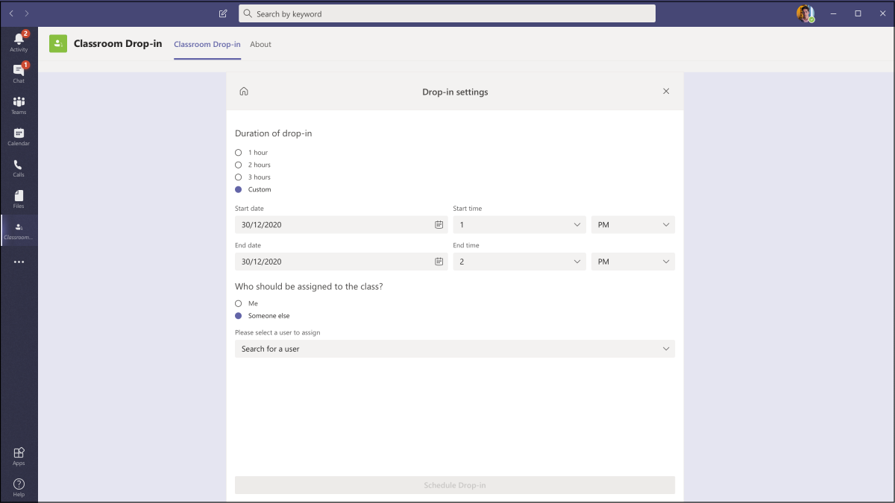
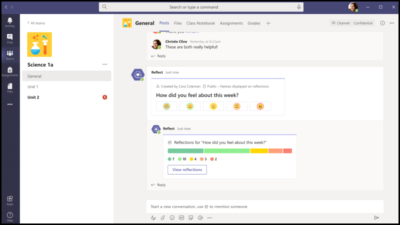
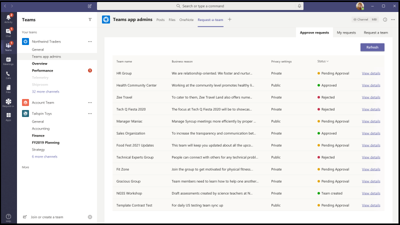

# Microsoft Teams 用のアプリ テンプレート

アプリ テンプレートは、オープン ソースで、GitHub で利用できる Microsoft Teams 用の完全なアプリの例です。 各アプリ テンプレートには、組織用に展開してインストールするための詳細な手順が記載されています。 また、すぐにインストールして使用を開始できるサンプルアプリも提供します。 完全なソースコードも利用可能で、詳細に調べるか、コードをフォークして、特定の要件を満たすように変更することができます。
すべてのアプリテンプレートは [MIT ライセンス](https://github.com/OfficeDev/microsoft-teams-apps-eprescription/blob/master/LICENSE)の条件下で提供されます。

> [!NOTE] 
> ユーザーおよび組織向けに、アプリ テンプレートから作成されたアプリのライセンスとサポートを行う必要があります。

**&#9734; 新たにリリースされたアプリ テンプレートを示します。**

### 主な利点

* **クラウドに直接展開:** すべてのアプリ テンプレートには展開スクリプトが含まれており、必要なサービスをすべて Microsoft Azure または Power Platform にホストすることができます。 
* **推奨サンプルコード:** アプリ テンプレートは、セキュリティとインフラストラクチャに関して推奨されるベスト プラクティスに準拠しています。 コミュニティから提出されたアプリ テンプレートの変更はすべて、適合性を確認するためにレビューされます。
* **カスタマイズ可能で拡張可能:** すべてのアプリ テンプレートは最小限の構成で展開されますが、コード ベーススクリプトと配置スクリプト全体が用意されているので、独自のニーズに合わせて簡単にカスタマイズまたは拡張できます。
* **詳細なドキュメント:** すべてのアプリ テンプレートには、ソリューション アーキテクチャ、展開、構成の手順に関するエンドツーエンドのドキュメントが付属しています。  

## 導入ボット 

導入ボットは、PVA用のパワー仮想エージェントで構築されたユーザーケアチャットボットTeams。 これは、FAQプラスのPVAバージョンとして考えられています。 Adoption Bot は、Microsoft 365 と Teams に関する 100 以上の一般的な質問に回答しています。 既存のトピックを編集したり、独自のトピックを追加したり、既存の FAQ を取り込むことができます。 ユーザーが追加のヘルプを必要とする場合、Adoption Bot は専門家への接続や、プレミアム フロー コネクタを使用して拡張し、サービス チケットを開くことができます。 このボットは、自己インストールされているか、導入 [ハブ](https://github.com/akporzondek/adoption_hub)などのカスタム アプリに組み込まれています。

[GitHub で入手する](https://github.com/OfficeDev/microsoft-teams-apps-adopt-bot)

## 導入ツール- チャンピオン管理プラットフォーム &#9734;

チャンピオン管理プラットフォーム (CMP) アプリ テンプレートを使用すると、チームワークのチャンピオンを管理、拡張、インスパイアして、より多くのことを達成できます。 このアプリ テンプレートは、SharePoint Framework上に構築され、チーム内のタブに読み込まれます。 グループはこのツールを活用して、プログラムのメンバーシップを管理したり、ログ記録用のスコアボードとイベントタイプを提供したり、デジタルバッジをプログラム参加者にオーバーレイするツールを提供したりできます。

[GitHub で入手する](https://github.com/OfficeDev/microsoft-teams-apps-champion-management)

## 導入ツール- Microsoft 365学習経路 (はじめに) &#9734;

はじめにアプリテンプレートを使用すると、Microsoft Teams内の学習経路Microsoft 365力を持って来ることができます。 このアプリテンプレートを使用すると、特定のトレーニングページや他のイントラネット資産への簡単なアクセスを許可し、コンテンツをTeams内に直接読み込むことができます。 また、会社のブランドに合わせてアプリ名やロゴを変更することもできます。

[GitHub で入手する](https://github.com/msft-teams/tools/tree/master/M365%20Learning%20Pathways)

## 予定マネージャ 

Appointment Manager は、企業が Teams を経由して消費者とのバーチャルの予定を作成、管理、実施するための Teams アプリ テンプレートです。 コンシューマーからの新しい予定要求は、Teams チャネルで表示され、チーム内のスタッフにすばやく割り当てられ、再割り当てされます。 予定のリクエストは、チーム レベルまたは個人レベルでカスタム タブを使用して表示されます。 すべての予定は Teams のオンライン会議に関連付けられているため、スタッフと消費者は簡単に予定された時間に会議に参加することができます。

アプリ テンプレートは Microsoft Bookings と統合されており、簡単に予約管理ができます。 スケジュールされた予定は、自動的に割り当てられたスタッフのカレンダーに表示され、消費者は会議のリンクが埋め込まれたカスタマイズ可能なメール通知とアラームを受信することができます。

[GitHub で入手する](https://github.com/OfficeDev/microsoft-teams-apps-appointment-manager)

## Ask Away

Ask Away は、q&A セッションと呼ばれる質問と回答をTeamsで実行できる[Microsoft Teamsボット](../bots/what-are-bots.md)です。 チーム メンバーは、Ask Away ボットを使用して、同僚が共有する質問を送信して賛成票を投じることができます。これにより、Q&A ホストは、チャネルまたはチャット内で最も重要な質問を簡単に収集できます。 ボットは、Teams会議でリアルタイムの Q&A セッションを実施するために使用され、参加者はチャットを通じて質問をライブで送信できます。

[GitHub で入手する](https://github.com/OfficeDev/microsoft-teams-apps-askaway)

:::row:::
  :::column span="2":::
      
:::column-end:::
:::row-end:::

## アソシエイト インサイト

アソシエイト インサイトは、現場担当者が顧客の意見、感情、認識を直接キャプチャして送信できるようにする [Power Apps](/powerapps/maker/canvas-apps/embed-teams-app) テンプレートです。 多くの場合、現場担当者は、一対一の連絡窓口で顧客と関わりを持つ最初の会社の代表者です。 収集されたデータは、製品の改善や顧客体験の向上のために、Power BI Teamsタブなどでビジネスチームによって共有され、共同で使用されます。

[GitHub で入手する](https://github.com/OfficeDev/microsoft-teams-apps-associateinsights)

:::row:::
  :::column span="2":::
      
:::column-end:::
:::row-end:::
:::row:::
:::column span="2":::
    
:::column-end:::
:::row-end:::

## 勤怠

参加時アプリは、チームに固定されている[Power Apps](/powerapps/maker/canvas-apps/embed-teams-app)タブです。 学習環境やトレーニング環境などの設定でのプレゼンスを記録するように設計されています。 ユーザーは、過去 30 日間までの出席をマークまたは編集し、グループ全体または個々の出席者の要約された出席レポートを表示できます。 チームの出席の詳細については[、「GitHubで取得する](https://github.com/OfficeDev/microsoft-teams-apps-attendance)」を参照してください。

次の図は、出席アプリのデモを示しています。  

## 会議室予約

ブックルームは、ユーザーが現在の時刻から30分、60分、または90分の会議室をすばやく見つけて予約できる[Microsoft Teamsボット](../bots/what-are-bots.md)です。 デフォルトの時間は 30 分です。 会議室予約ボットは、個人の会話または一対一の会話を対象としています。 Book-a-room アプリの詳細については[、「GitHubで入手する](https://github.com/OfficeDev/microsoft-teams-apps-bookaroom)」を参照してください。  
次の図は、部屋のブックのデモを示しています。

## Building Access

Access の構築は、施設のディレクターが管理、追跡、および従業員のオンサイトプレゼンスを報告できるようにすることで、占有しきい値と社会的な混乱の規範を構築する管理をサポートする Microsoft [Power Platform](https://powerapps.microsoft.com/blog/now-in-preview-customize-teams-with-built-in-power-platform-capabilities/) ベースのアプリです。 Microsoft [Power Apps](/powerapps/powerapps-overview)、[Power Automate](/power-automate/getting-started)を使用して構築されたこのアプリは、Microsoft Teams と緊密に統合されており、組織が建物の準備状況を判断し、現場アクセスの適格基準を確立し、将来の計画のための分析情報を収集できるようにします。

[GitHub で入手する](https://github.com/OfficeDev/microsoft-teams-apps-buildingaccess)

:::row:::
   :::column span="":::
     
   :::column-end:::
   :::column span="":::
      
   :::column-end:::
:::row-end:::

## Celebrations

お祝いは、チームメンバーがお互いの誕生日、記念日、およびその他の定期的なイベントを祝うために役立つTeamsアプリです。 チーム メンバー全員の特別な日を思い出し、イベント作成時に選択されたすべてのチームに友好的なメッセージを送信して、チーム メンバーがその日に特別な気分になるようにします。

このアプリでは、チームメンバー全員が簡単にイベントを追加および表示できるようにするためのインターフェイスが用意されています。また、イベントを共有するチームをユーザーが選択できるようにします。

[GitHub で入手する](https://github.com/OfficeDev/microsoft-teams-celebrations-app)

## Checklist

Checklist は、チャットやチャネルで共有チェックリストを作成することで、チームと共同作業を行うことができる、Microsoft Teams のカスタム [メッセージング拡張機能](../messaging-extensions/what-are-messaging-extensions.md)アプリです。 アプリは、デスクトップ ブラウザー、iOS、Android など、すべての Teamsプラットフォーム クライアントでサポートされています。 アプリは、Microsoft 365 サブスクリプションの一部として展開する準備ができています。  

[GitHub で入手する](https://github.com/OfficeDev/microsoft-teams-checklist-app)

:::row:::
:::column span="2":::
      
:::column-end:::
:::row-end:::

## 教室ドロップイン 

Classroom Drop-in は、システム リーダーがクラス チームを見つけ、仮想教室を意味し、必要に応じて指定したドロップイン期間に、これらのクラス チームに自分自身または他のユーザーを追加できるようにする Microsoft [Power Platform](https://powerapps.microsoft.com/blog/now-in-preview-customize-teams-with-built-in-power-platform-capabilities/)ベースのアプリです。 Microsoft [Power Apps](/powerapps/powerapps-overview) と [Power Automate](/power-automate/getting-started) を使用して構築されたアプリは、Microsoft Teams と深く統合されており、教育機関は、ビジネス要件に応じてクラスチームに関連する関係者へのアクセスを提供することで、ハイブリッドな学習環境での運用を最適化することができます。

[GitHub で入手する](https://github.com/OfficeDev/microsoft-teams-apps-classroom-dropin)

## 社内コミュニケーター

社内コミュニケーター アプリを使用すると、企業チームはチャットを介して複数のチームまたは多数の従業員向けのメッセージを作成および送信できます。これにより、組織は共同作業を行う場所で従業員に連絡できます。 このテンプレートは、新しいイニシアチブの発表、従業員のオンボーディング、最新の学習、開発や組織全体のブロードキャストなど、複数のシナリオに利用できます。

このアプリは、指定されたユーザーがメッセージを作成、プレビュー、共同作業、送信するための簡単なインターフェイスを提供します。

これは、メッセージを確認または操作したユーザーの数に関するカスタム テレメトリなどのカスタム ターゲット通信機能を構築するための基盤を提供します。

[GitHub で入手する](https://github.com/OfficeDev/microsoft-teams-company-communicator-app)

## Contact Group Lookup

連絡先グループ検索アプリは、組織の連絡先グループ (以前は配布リストまたは通信グループと呼ばれていた) を作成、アクセス、および管理するための便利で便利な方法を提供します。 ユーザーは、すべての Teams 環境内で、グループ メンバーの表示とチャット、メンバー ステータスの表示、連絡先グループの選択したメンバーとのグループ チャットの作成をすばやく行うことができます。

[GitHub で入手する](https://github.com/OfficeDev/microsoft-teams-app-contactgrouplookup)

:::row:::
:::column span="2":::
      
:::column-end:::
:::row-end:::
:::row:::
:::column span="2":::
    
:::column-end:::
:::row-end:::

## 同僚の感謝 

Microsoft Teams の Co-worker Appreciation テンプレートを使用すると、ユーザーは Teams のコンテキストで同僚の業績を認識することができます。 共同作業者が同僚へのリワードを選択すると、受信者や他のチーム メンバーがチャネルの会話でタグ付けされ、チャネルのリワードの詳細についての通知を受け取ることができます。 アワードは Teams アプリに記録され、安全で携帯性に優れ、簡単に共有することができます。 これは、PowerApps ベースのバージョンのオープン バッジ アプリ テンプレートと見なされ、スコア ボードが付きます。

[GitHub で入手する](https://github.com/OfficeDev/microsoft-teams-apps-coworker-appreciation)

## CrowdSourcer

CrowdSourcer は、グループ メンバーから共同で調達された情報をチームに照会する [Microsoft Teams ボット](../bots/what-are-bots.md)です。 よく寄せられる質問に答え、参加者が楽しく役立つ情報リソースに積極的に参加し、貢献できるようにします。

[GitHub で入手する](https://github.com/OfficeDev/microsoft-teams-crowdsourcer-app)

## カスタム ステッカー

自己表現は健全なチーム文化の中核です。 このアプリ テンプレートは、ユーザーが Microsoft Teams 内で、カスタム ステッカーや GIF を使用できるようにする[メッセージング拡張機能](~/messaging-extensions/what-are-messaging-extensions.md)です。 このテンプレートは、構成アクセス権を持つ誰もがGIF、ステッカー、および画像をアップロードできる簡単なWebベースの設定体験を提供し、チーム全体が選択したステッカーのセットを使用できるようにします。

このアプリはまた、ストレージや共有メカニズムとしてSharePointサイトや個々のチャネルへのアクセスを必要とせずに、チーム間で画像、GIF、ステッカーの共有を容易にできます。 たとえば、製品チームは、製品イメージや GIF ファイルを、プログラムでソーシャル メディア、マーケティング、営業チームと簡単に共有できます。 また、新しい画像、およびGIFが利用可能になったときに、特定のチームや個人に通知フローをトリガーすることによって、このアプリを拡張することができます。

[GitHub で入手する](https://github.com/OfficeDev/microsoft-teams-stickers-app)

## 従業員のアイデア

Employee Ideas アプリは、Azure ベースの Great Ideas アプリ テンプレートの PowerApps 版です。 このアプリでは、Teams ユーザーがアイデア キャンペーンの設定や構成を行うことができます。 アイデア キャンペーンとは、共通のテーマを中心にアイデアをグループ化するためのカテゴリーです。

Teamsユーザーは、以下のアクティビティを実行することもできます。

* 従業員が各アイデアに対して提出する必要がある標準の提出フォームを構成します。 
* キャンペーンのアイデアやリストを見直して管理します。
* キャンペーンを変更、削除します。
* アイデアのランキングをレビューします。
* 優先順位の高いアイデアに投票し、共有します。
* キャンペーンのアイデアを送信します。
* 他のチーム メンバーのアイデアを表示します。
* 最も気に入ったアイデアに投票します。
* キャンペーンの他のユーザーと比較して、自分のアイデアのパフォーマンスをレビューします。

[GitHub で入手する](https://github.com/OfficeDev/microsoft-teams-apps-employeeideas)

 

## E-Prescriptions 

E-処方箋は、患者に電子処方箋を発行するプロセスを自動化することにより、遠隔医療と仮想ケアを強化する[Power Apps](/powerapps/maker/canvas-apps/embed-teams-app)ベースのアプリです。 医療専門家は、Teams プラットフォーム内で直接、予定をすばやく確認し、電子処方箋を生成し、電子処方箋を添付した電子メールを患者に送信できます。

[GitHub で入手する](https://github.com/OfficeDev/microsoft-teams-apps-eprescription) 

:::row:::
:::column span="2":::
    ![E-Prescriptions アプリのスクリーンショット。 医療提供者が [生成] ボタンを選択して、患者の処方箋を注文する方法を示します。](../assets/images/e-prescriptions-app-template.png)  
:::column-end:::
:::row-end:::
:::row:::
:::column span="2":::
    
:::column-end:::
:::row-end:::

## Employee Training 

従業員トレーニングは、組織の学習イベントやトレーニング イベントを開催者が簡単に公開、追跡、促進できるMicrosoft Teamsアプリです。  このアプリを使用すると、イベントプランナーはイベント登録者にリマインダーや通知を送信することができ、従業員は今後のイベントへの関心を示し、現在のイベントを最新の状態に保ち、Teamsメッセージング拡張機能を通じて同僚とイベントの詳細を共有することができます。

[GitHub で入手する](https://github.com/OfficeDev/microsoft-teams-apps-employeetraining)

:::row:::
:::column span="2":::
    **従業員トレーニング イベントの表示**   
:::column-end:::
:::row-end:::
:::row:::
:::column span="2":::
    **従業員トレーニング イベントの作成** 
:::column-end:::
:::row-end:::

## 専門家検索

専門家検索は、スキル、興味、教育属性に基づいて特定の組織メンバーを識別する [Microsoft Teams ボット](../bots/what-are-bots.md)です。 メンバーは、組織内で、Azure Active Directoryユーザー プロファイルのキーワード検索に一致する専門家を検索します。

[GitHub で入手する](https://github.com/OfficeDev/microsoft-teams-apps-expertfinder)

## FAQ プラス

会話型 Q&A ボットは、ユーザーからよく寄せられる質問に回答する簡単な方法です。 しかし、ボットが失敗したときにループに人間がいないため、ほとんどのボットはユーザーと有意義な方法で関与しません。 FAQ ボットは フレンドリーな Q&A ボットですが、ボットが役立たないときには人間が介在するようにします。 ボットに質問をすることができ、知識ベースに含まれている場合、ボットは回答を返します。 そうでない場合、ボットはユーザーがクエリを送信できるようにします。クエリは、チーム内からの通知に基づいて行動することでサポートを提供するのに役立つ、事前に構成された専門家チームに投稿されます。

> [!NOTE]
> **FAQ プラス** の最新リリースは、専門家チームが以下を完了できるようにすることにより、改善された Q&A 解決をサポートします。
>
> &#x2714; メッセージ拡張機能を使用して、ナレッジベースに新しい Q&A を直接追加します。
>
> &#x2714; ボットによって追加された Q&A ペアを編集および削除します。
>
> &#x2714; Q&A の改訂履歴を追跡します。
>
> &#x2714; [アダプティブ カード](../task-modules-and-cards/cards/cards-reference.md#adaptive-card)として表示する追加の詳細を含む回答を構成します。
>
[GitHub で入手する](https://github.com/OfficeDev/microsoft-teams-apps-faqplusv2)

## サポート アプリを入手する

サポートの取得アプリは、Microsoft Teamsを使用している組織によって使用され、すべてのユーザーがスーパーバイザーに支援を要求できるようにします。 このアプリには、次の機能が含まれています。
* パワーアプリから異なるカテゴリに関する支援を要求します。
* 誰が割り当てられたか知らせる要求者に送信される通知。
* 割り当てられたスーパーバイザーに、誰が支援を必要とするか知らせる通知。 
* SharePointと PowerBI.S のエスカレーションとパターンの分析

[GitHub で入手する](https://github.com/OfficeDev/microsoft-teams-app-get-support/)

## Goal Tracker

Goal Tracker アプリは、Microsoft Teams内で、組織の目標の設定、進捗状況の観察、成功の確認をサポートする包括的なソリューションです。 このアプリを使用すると、ユーザーは、専門家、個人、チーム レベルで目標を設定、追跡、更新できます。 また、チーム メンバーは、集中力を維持し、順調に進めるために、タイムリーなリマインダーと状態の更新情報を受け取ります。

[GitHub で入手する](https://github.com/OfficeDev/microsoft-teams-app-goaltracker)

:::row:::
  :::column span="2":::
      
:::column-end:::
:::row-end:::
:::row:::
:::column span="2":::
    
:::column-end:::
:::row-end:::

## Great Ideas

Great Ideas アプリは、組織内のイノベーションと創造性をサポートし、力を与えます。 このアプリを使用すると、Microsoft Teams 内で、従業員は同僚やリーダーシップとアイデアを共有し、新しい報告を検索し、同僚の検討のために貢献にスポットライトを当て、最良の提案に投票することができます。

[GitHub で入手する](https://github.com/OfficeDev/microsoft-teams-apps-greatideas)

:::row:::
  :::column span="2":::
      
:::column-end:::
:::row-end:::
:::row:::
:::column span="2":::
    
:::column-end:::
:::row-end:::

## グループ アクティビティ

グループ アクティビティは、チームの所有者が Microsoft Teamsの コンテキスト内でアクティビティ グループをすばやく作成し、コラボレーション ワークフローを管理するのを容易にする Microsoft Teams アプリです。 アクティビティ作成者は、アクティビティを作成し、チーム メンバーをグループにランダムに配布し、オプションで、アクティビティが完了するまでボットにリマインダーを送信させることができます。

[GitHub で入手する](https://github.com/OfficeDev/microsoft-teams-apps-groupactivities)

:::row:::
  :::column span="2":::
      
:::column-end:::
:::row-end:::
:::row:::
:::column span="2":::
    
:::column-end:::
:::row-end:::

## グループConnect &#9734;

グループConnectは、組織のメンバーが従業員グループを見つけ、従業員グループに関連する情報を見つけるのに役立つMicrosoft Teamsアプリです。 このアプリには、組織のリーダーがグループ、イベント、リソースに関して従業員とコミュニケーションを取るための豊富な機能が組み込まれています。 グループConnectアプリは、グループ内のネットワーキングと結束を促進するために、グループメンバー同士を希望する頻度でマッチングします。 グループ Connect アプリを活用して、組織内で従業員グループを育成する方法の詳細については、GitHubのアプリを参照してください。

[GitHub で入手する](https://github.com/OfficeDev/microsoft-teams-apps-groupconnect)

## Grow Your Skills

Grow Your Skills アプリは、従業員が組織の補助的なプロジェクトに貢献し、新しいスキルを同時に学習できるようにして、プロフェッショナルな成長と開発をサポートします。 すべての Teams 環境内で、従業員はこのアプリを使用して、自分の興味に合った機会を見つけ、同僚との有意義な共同作業を行い、新しいレベルの専門知識と能力を取得できます。

[GitHub で入手する](https://github.com/OfficeDev/microsoft-teams-apps-growyourskills)

:::row:::
  :::column span="2":::
      
:::column-end:::
:::row-end:::
:::row:::
:::column span="2":::
    
:::column-end:::
:::row-end:::

## HR サポート

HR サポート ボットは、サポート担当者やサポート担当者がサポートできない場合に、サポート担当者または専門家をループに入れて使用するボット&フレンドリーな Q です。 ボットに質問をすることができ、知識ベースに含まれている場合、ボットは回答を返します。 そうでない場合、ボットはユーザーがクエリを送信できるようにします。クエリは、チーム内からの通知に基づいて行動することでサポートを提供するのに役立つ、事前に構成された専門家チームに投稿されます。 さらに、ボットは、質問に事前に設定されたタグを検索することで、推奨される HR ポリシーまたは質問へのリンクを提案します。 これらのタイルは、クイック リファレンスとして関連付けられたタブにあります。 HR サポートは、軽量 Q&A に適しており、組織で新しいプロジェクトやイニシアチブを立ち上げる際に迅速なサポートを提供します。

[GitHub で入手する](https://github.com/OfficeDev/microsoft-teams-hrsupport-app)

## アイスブレーカー

アイスブレーカーは、[Microsoft Teams ボット](../bots/what-are-bots.md)で、毎週 2 人のランダムなチーム メンバーをペアにして、チームを近づけることができます。 ボットは、両方のメンバーに有効な空き時間を自動的に提案することで、スケジュール設定を簡単にします。 このアプリで個人的なつながりを強化し、緊密に結びついたコミュニティを構築します。

アイスブレーカー アプリは、チーム全体で個人的なつながりを促進するだけでなく、組織内で関心に基づいたコミュニティを育成するのに役立ちます。 たとえば、このアプリを DevOps の共同作業グループに使用して、アイデアやベストプラクティスを組織全体に有機的に広めることができます。

[GitHub で入手する](https://github.com/OfficeDev/microsoft-teams-icebreaker-app)

## Incentives

インセンティブは、トレーニングや変更管理イニシアチブなど、指定された活動への従業員のインセンティブ付け参加を管理および追跡する[Power Apps](/powerapps/maker/canvas-apps/embed-teams-app)テンプレートです。 管理者は、アプリを使用して、指定されたアクティビティを確立し、完了のためにポイントを割り当て、報酬に必要な適格ポイント レベルを指定します。 従業員は、アプリを使用して蓄積されたポイントを表示し、資格に達したら、償還可能な報酬を要求して請求します。

[GitHub で入手する](https://github.com/OfficeDev/microsoft-teams-apps-incentives)

## Incident Reporter

Incident Reporter は、組織内のインシデントの管理を最適化する [Microsoft Teams ボット](../bots/what-are-bots.md)です。 ボットは、自動化されたインシデント データ収集、カスタマイズされたインシデント レポート、関連する利害関係者への通知、エンドツーエンドのインシデント追跡を容易にします。

[GitHub で入手する](https://github.com/OfficeDev/microsoft-teams-apps-incidentreport)

:::row:::
  :::column span="2":::
      
:::column-end:::
:::row-end:::
:::row:::
:::column span="2":::
    
:::column-end:::
:::row-end:::

## 特殊評価 

 Inspection は、現場の最前線にいる従業員が位置情報から資産、備品まで何でも検査できる Microsoft Teams アプリです。 たとえば、小売店、製造工場、車両、または機械などがあります。 このソリューションには 2 つのアプリがあり、それぞれ異なるタイプのユーザーを対象としています。

このアプリは、第一線で働く人たちが資産や領域を検査したり、製品やサービスの品質を管理したり、職場の安全を維持したりすることができるようにするためのものです。 検査中に発見された問題に対処するために、チーム メンバー間のコミュニケーションを促進します。 このアプリでは管理者向けのシンプルなレポートを提供して、問題解決を迅速化し、傾向を強調します。

[GitHub で入手する](https://github.com/OfficeDev/microsoft-teams-apps-inspection)

   

## 問題報告

Issue Reporting アプリは、従業員や管理者が課題を提起し、管理するための権限を付与するためのものです。 これは、問題を報告するための「問題報告アプリ」と、問題を管理するための「問題管理アプリ」の 2 つのアプリで構成されています。

チーム管理者は、問題管理アプリを使用して、Microsoft Teams のメッセージやアプリで作成される Planner のタスク内のチャネルを含む、アプリのエクスペリエンスを構成します。 管理者は、このアプリを使用してテンプレート フォームを作成し、ユーザーが問題を報告した場合に詳細を収集します。 たとえば、問題テンプレート フォームのレビュー、編集、削除などがあります。 このアプリは、チームの問題のレビュー、問題の履歴のレポート、問題解決の効率的な管理にも使用されます。

従業員は、問題報告アプリを使用して、問題とその解決に必要な詳細を記録します。 このアプリは、既存の問題を修正して解決し、個人やチームの問題を大局的に俯瞰するためにも使用されています。

[GitHub で入手する](https://github.com/OfficeDev/microsoft-teams-apps-issuereporting)

  

## New Employee Onboarding 

New Employee Onboarding は、組織が新入社員教育で、従業員に一貫した高品質のオンボーディング エクスペリエンスを提供できるようにする Microsoft Teams と [SharePoint New Employee Onboarding が統合されたソリューション](https://lookbook.microsoft.com/details/75e60a32-9849-4ed4-b83e-b2b08983ad19)です。 このアプリは、人事チームと採用マネージャーが、オリエンテーションと誘導プロセスを通じて関連情報を提供するために使用され、新入社員はフィードバックを共有し、紹介を提供し、完全なオンボーディングタスクを行います。

[GitHub で入手する](https://github.com/OfficeDev/microsoft-teams-apps-newemployeeonboarding)

:::row:::
  :::column span="2":::
    **新入社員のウェルカム カード** 
:::column-end:::
:::row-end:::
:::row:::
:::column span="2":::
    **新入社員のチェックリスト**   
:::column-end:::
:::row-end:::

## オープン バッジ

オープン バッジは、個人が Teams コンテキスト内でデジタル学習資格情報バッジを取得して、どこでも共有できるようにする Microsoft Teams アプリです。 第三者デジタル バッジ発行機関である [Badgr](https://badgr.org/) の機能を使用して、授与されたバッジは受信者の Badgr プロファイルに記録され、生涯学習の豊富な画像を作成して共有するために利用できます。

[GitHub で入手する](https://github.com/OfficeDev/microsoft-teams-apps-openbadges)

:::row:::
  :::column span="2":::
      
:::column-end:::
:::row-end:::
:::row:::
:::column span="2":::
    
:::column-end:::
:::row-end:::

## Poll 

Poll は、チャットまたはチャネルで投票をすばやく作成して送信し、チームの意見や好みを収集できるようにする Microsoft Teams のカスタム [メッセージング拡張機能](../messaging-extensions/what-are-messaging-extensions.md)アプリです。 アプリは、デスクトップ、ブラウザー、iOS、Android などのすべてのTeamsプラットフォームクライアントでサポートされ、Microsoft 365サブスクリプションの一部として展開する準備ができています。

[GitHub で入手する](https://github.com/OfficeDev/microsoft-teams-poll-app)

:::row:::
  :::column span="1":::
      
:::column-end:::
:::row-end:::

## クイック応答

クイックレスポンスは、ユーザーのよくある質問に関するFAQに効果的に答える堅牢なソリューションを提供するMicrosoft Teamsアプリです。 各クエリに手動で連続して繰り返し表示される情報に応答する代わりに、アプリは[メッセージング拡張機能](../messaging-extensions/what-are-messaging-extensions.md)を使用して対話型ユーザー エクスペリエンスの応答ライブラリTeams構築します。

[GitHub で入手する](https://github.com/OfficeDev/microsoft-teams-apps-quickresponses)

## クイズ&#9734;

クイズは、あなたが知識チェックと瞬時に結果のためのチャットやチャネル内のクイズを作成することを可能にするカスタム[Teamsメッセージング拡張](../messaging-extensions/what-are-messaging-extensions.md)アプリです。 クイズは、クラス内試験とオフライン試験、チーム内の知識チェック、チーム内の楽しいクイズに使用できます。 クイズ アプリは、デスクトップ、ブラウザー、iOS、Android クライアントなど、複数のプラットフォームでサポートTeams。 このアプリは、既存のMicrosoft 365サブスクリプションの一部として展開する準備ができています。

[GitHub で入手する](https://github.com/OfficeDev/microsoft-teams-apps-quiz)

:::row:::
  :::column span="1":::
      
:::column-end:::
:::row-end:::

## ラピッドアシスト

Rapid Assist は、Microsof t[Power Platform](https://powerapps.microsoft.com/blog/now-in-preview-customize-teams-with-built-in-power-platform-capabilities/) ベースのアプリで、顧客対応担当者が専門家と素早く接続して迅速な回答を得たり、情報を検索したり、オープンな要求をフォローしたりして、専門家が通知を受信して素早く応答し、質問に答えるためのサポートを行います。 Microsoft [Power Apps](/powerapps/powerapps-overview) と [Power Automate](/power-automate/getting-started) を使用して構築されたアプリは、Microsoft Teams と深く統合されており、組織は現場の従業員と企業のリエゾンを簡単に接続して、顧客の問い合わせを解決し、優れた顧客エクスペリエンスを提供できるようにします。 

[GitHub で入手する](https://github.com/OfficeDev/microsoft-teams-apps-rapid-assist)

:::row:::
   :::column span="":::
     
   :::column-end:::
   :::column span="":::
      
   :::column-end:::
:::row-end:::

## Reflect 

Reflect は、チーム メンバーが感情的な幸福の状態を同僚やグループ リーダーと直接Teams内で共有するための安全で包括的なリソースを提供するカスタム Microsoft Teams[メッセージング拡張](../messaging-extensions/what-are-messaging-extensions.md)アプリです。 アプリは、チャネル、グループ、会議、および 1:1 のチャットで利用でき、チェックイン応答はパブリック、プライベートから送信者、または完全に匿名に設定されます。

[GitHub で入手する](https://github.com/OfficeDev/Microsoft-Teams-App-Reflect)

:::row:::
    :::column:::
    **ウェルビーイング投票**
    
    
    :::column-end:::
:::row-end:::

## リモート サポート

リモート サポートは、組織全体のサポート要求者と内部サポート チームの間に焦点を絞ったインターフェイスを提供する [Microsoft Teams ボット](../bots/what-are-bots.md)です。  エンド ユーザーは、サポートの要求を送信、編集、取り消すことができ、サポート チームはすべての Teams プラットフォーム内で要求に応答、管理、更新できます。

[GitHub で入手する](https://github.com/OfficeDev/microsoft-teams-apps-remotesupport)

:::row:::
  :::column span="2":::
      
:::column-end:::
:::row-end:::
:::row:::
:::column span="2":::
    
:::column-end:::
:::row-end:::

## Request-a-team

Request-a-team は、企業組織の新しいチーム作成を最適化する Microsoft Teams アプリです。 このアプリは、ウィザードでガイドされたリクエスト フォーム、組み込み承認プロセス、要求状態ダッシュボード、自動化されたチーム ビルドの統合を通じて、新しいチーム インスタンスを作成する際の標準化とベスト プラクティスをサポートします。

[GitHub で入手する](https://github.com/OfficeDev/microsoft-teams-apps-requestateam)

:::row:::
  :::column span="2":::
    
:::column-end:::
:::row-end:::
:::row:::
:::column span="2":::
    
:::column-end:::
:::row-end:::

## Scrums for Channels

Scrums for Channels は、ユーザーが Microsoft Teams 内のチャネルでスクラムをスケジュールして実行できるようにするスクラム アシスタント アプリです。 このアプリは、リモート チームや、地理的に異なる場所やタイムゾーンのメンバーで構成されるチームが毎日の更新情報を共有し、スクラム スタンドアップ ミーティングに確実に参加できるようにするのに最適です。

[GitHub で入手する](https://github.com/OfficeDev/microsoft-teams-apps-scrumsforchannels)

> [!NOTE]
> グループ チャットでスクラム会議を実施するには、「グループ チャット アプリ テンプレート [のスクラム](#scrums-for-group-chat) 」を参照してください。

:::row:::
  :::column span="2":::
    
:::column-end:::
:::row-end:::
:::row:::
:::column span="2":::
    
:::column-end:::
:::row-end:::

## Scrums for Group Chat

> [!NOTE]
> スクラムステータスアプリテンプレートが更新され、グループチャットのスクラムになりました。

Scrums for Group Chat は、グループ チャットのメンバーが非同期スタンドアップ ミーティングを実行し、毎日の更新情報を簡単に共有できるようにする、サポート的なスクラム アシスタントです。 これにより、グループ チャットのすべてのメンバーがスクラムに貢献し、実行中のスクラムで他のメンバーが行った更新情報を表示できます。

[GitHub で入手する](https://github.com/OfficeDev/microsoft-teams-apps-scrumsforgroupchat)

## Share Now 

Share Now アプリは、ユーザーがチーム環境内でコンテンツを簡単に共有できるようにすることで、同僚間の積極的な情報交換を促進します。 ユーザーはアプリを使用して、関心のあるアイテムをチーム メンバーと共有し、新しい共有コンテンツを見つけ、環境設定を設定し、後で読むためにお気に入りをブックマークします。

[GitHub で入手する](https://github.com/OfficeDev/microsoft-teams-apps-sharenow)

## SharePoint リスト検索

Microsoft Teams でのコラボレーションでは、SharePoint リストのアイテム内に含まれる情報を参照することがよくあります。 質問のアイテムへのリンクを貼り付けると、すべてのユーザーが会話からコンテキストを切り替え、必要な情報を見つけ、Teamsに戻って会話を続けます。 会話が続くにつれて、ユーザーは参照アイテムに何度も切り替えて新しいコメントを確認し、アイテムに含まれる情報の記憶を更新する必要があります。 このコンテキスト切り替えは、円滑なコラボレーションの障壁となります。
この問題を解決するには、リスト検索アプリ テンプレートを使用します。 多くのユーザーは、SharePointを使用して、組織内の主要なワークフローの一部に電力を供給しています。 ただし、リストの周りの共同作業は困難です。 Microsoft Teams のリスト検索アプリ テンプレートを使用すると、ユーザーは SharePoint リスト アイテムの情報をチャットの会話内に直接挿入して、チャットにリンクを挿入するだけで発生するコンテキストの切り替えを軽減できます。 この情報は読みやすい自動フォーマットカードとして挿入され、ユーザーが会話に従事し続けるのに役立ちます。

[GitHub で入手する](https://github.com/OfficeDev/microsoft-teams-list-search-app)

## Staff Check-ins

スタッフチェックインは、あなたのビジネスとフィールドの担当者間の監督通信を可能にする[Power Apps](/powerapps/powerapps-overview)ベースのアプリです。 スタッフは、タイムクリティカルな情報とステータスの更新情報を、スケジュール ベースまたはアドホック ベースで、Teams から直接簡単に提供できます。 アプリは、リアルタイムの場所、写真、メモ、リマインダー通知、および自動化されたワークフローをサポートしています。

[GitHub で入手する](https://github.com/OfficeDev/microsoft-teams-apps-staffcheckins)

## Survey

Survey は、チャットまたはチャネルで調査を作成してデータを収集し、実用的な洞察を得ることができる Microsoft Teams のカスタム [メッセージング拡張機能](../messaging-extensions/what-are-messaging-extensions.md)アプリです。 アプリは、デスクトップ、ブラウザー、iOS、Android などのすべてのTeamsプラットフォームクライアントでサポートされ、Microsoft 365サブスクリプションの一部として展開する準備ができています。  

[GitHub で入手する](https://github.com/OfficeDev/Microsoft-Teams-Survey-app)

:::row:::
  :::column span="2":::
    
:::column-end:::
:::row-end:::

## タイムタリー 

プロジェクトには複数のタスクを含めることができ、さまざまなプロジェクトを従業員に割り当てることができます。 マネージャは、これらのタスクに費やした時間を通じてプロジェクトの進捗状況を理解する必要があります。 これは、従業員がタイムシートを記入する必要があるため、面倒な活動になる可能性があります。 Time Tally アプリを使用すると、従業員はモバイル デバイスを使用してタイムシートをすばやく入力でき、管理者はタイムシート エントリで従業員をフォローアップする必要はありません。 マネージャは、リソースに基づいてプロジェクトの稼働率を表示し、エントリを承認または却下できます。 タイムシートのコンプライアンスを確保するために、事前通知が送信されます。 また、履歴データと使用状況を分析に使用することもできます。

[GitHub で入手する](https://github.com/OfficeDev/microsoft-teams-apps-timetally)

## トレーニング&#9734;

トレーニングは、ユーザーがオフラインの知識共有とアップスキルのためのチャットまたはチャネル内のトレーニングを公開することを可能にするカスタムTeams[メッセージング拡張機能](../messaging-extensions/what-are-messaging-extensions.md)アプリです。 アプリは、デスクトップ、ブラウザー、iOS、Android などの複数のTeamsプラットフォーム クライアントでサポートされています。 このアプリは、Microsoft 365サブスクリプションの一部として展開する準備ができています。

[GitHub で入手する](https://github.com/OfficeDev/microsoft-teams-apps-training)

:::row:::
  :::column span="1":::
      
:::column-end:::
:::row-end:::

## Virtual Rounding

病院や救急外来の提供者は、1日に多くの **ラウンド** を行います。 患者に対するこれらの迅速なチェックは、患者がどのように行動しているかの状態チェックを行い、患者の懸念に確実な対処を行うことを目的としています。 丸めは、患者が複数のタイプのプロバイダーによって監視されていることを確認するための不可欠な慣行ですが、訪問ごとに、各プロバイダから、新しいマスク、および新しい手袋のセットが使用されるため、PPEの巨大な排水管を表します。 このアプリのテンプレートを使用すると、医療従事者は、プロバイダーと患者の間で Microsoft Teams の会議を介して、仮想的に簡単な回診を行うことができます。

Virtual Rounding のソリューションは、Microsoft Health とライフ サイエンスの[ブログ記事](https://aka.ms/teamsvirtualrounding)でも参照できます。

[GitHub で入手する](https://github.com/SmartterHealth/Virtual-Rounding)

## Visitor Management

Visitor Management アプリを使用すると、組織と従業員は、Microsoft Teams から直接、オンサイトの訪問者プロセスを簡単かつ効率的に管理できます。 このアプリを使用すると、従業員は訪問者の要求を作成し、訪問者のダッシュボードを介して要求状態を一元的に追跡し、訪問者が到着したときにリアルタイムの通知を受け取ることができます。

[GitHub で入手する](https://github.com/OfficeDev/microsoft-teams-app-visitormanagement)

:::row:::
  :::column span="2":::
    
:::column-end:::
:::row-end:::
:::row:::
:::column span="2":::
    
:::column-end:::
:::row-end:::

## Workplace Awards

Workplace Awards は、現代の職場での認識を促進し、従業員の感謝の文化を促進するための前向きなフレームワークを提供する Teams アプリ テンプレートです。 このアプリでは、R&R プログラムと呼ばれる従業員の報酬と認識を設定および管理することができ、従業員は同僚を簡単に指名して支持し、R&R リーダーは、提出されたノミネートを表示し、賞を付与し、受信者を発表できます。

[GitHub で入手する](https://github.com/OfficeDev/microsoft-teams-apps-workplaceawards)

:::row:::
  :::column span="2":::
    
:::column-end:::
:::row-end:::
:::row:::
:::column span="2":::
    
:::column-end:::
:::row-end:::

アプリ テンプレートの詳細については、「 [アプリ テンプレート](https://forms.office.com/Pages/ResponsePage.aspx?id=v4j5cvGGr0GRqy180BHbR2_7qFm_lcZAr4eqEhnLsZ9UMVZGT1lCT0FXUDdZMUM0RkpBS1BESTAwWC4u)」を参照してください。

## 関連項目

[Web アプリを統合する](~/samples/integrate-web-apps-overview.md)
