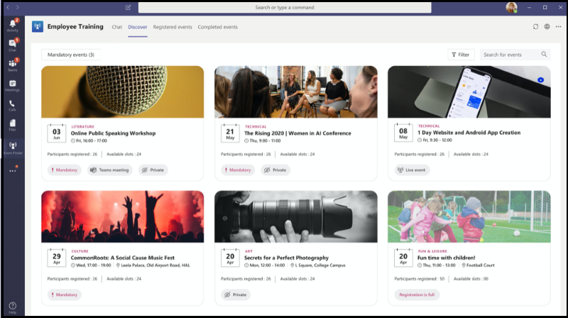
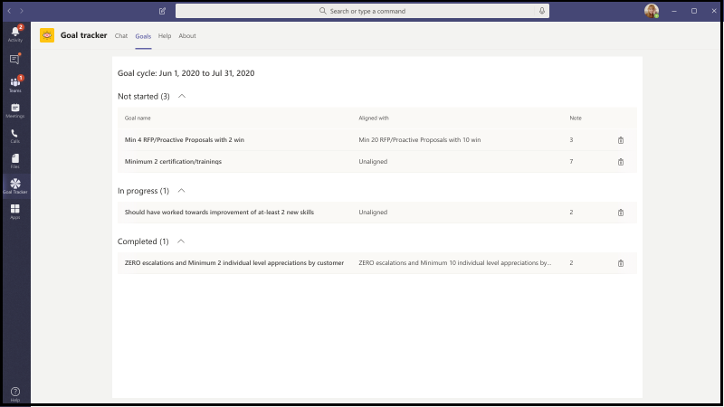

# Microsoft Teams のアプリテンプレートApp Templates for Microsoft Teams

アプリテンプレートとは、コミュニティ主導で、オープンソースで、GitHub 上で利用可能な Microsoft Teams 用のプロダクション対応アプリのことです。App templates are production-ready apps for Microsoft Teams that are community driven, open-source, and available on GitHub. それぞれに、組織のためにアプリを展開してインストールするための詳細な手順が記載されており、すぐにインストールして使用を開始できるアプリを用意しています。Each contains detailed instructions for deploying and installing that app for your organization, providing a ready-to-use app that you can install and begin using immediately. 完全なソースコードも利用できます。そのため、詳細について確認したり、コードをフォークして、特定のニーズを満たすように変更したりすることができます。The complete source code is available as well, so you can explore it in detail, or fork the code and alter it to meet your specific needs.

**&#9734; は、新しくリリースされたアプリテンプレートを示しています。****&#9734; Indicates newly released app templates.**

### 主な利点Key benefits

* **プラグアンドプレイの操作:** すべてのアプリテンプレートには、Microsoft Azure で必要なすべてのサービスをホストできる展開スクリプトが含まれています。**Plug and play experience:** All app templates include deployments scripts that will allow you to host all necessary services in Microsoft Azure. アプリを展開するためのコーディングは必要ありません。No coding is required to deploy the apps.
* **運用可能なコード:** アプリテンプレートは、セキュリティとインフラストラクチャの推奨されるベストプラクティスに準拠しており、それらに加えられたすべてのコミュニティの変更をレビューして、引き続き準拠していることを確認します。**Production-ready code:** The app templates conform to recommended best practices around security and infrastructure, and all community submitted changes to them are reviewed to ensure continued conformance.
* **カスタマイズと拡張:** すべてのアプリテンプレートを展開する準備ができましたが、コードベースと展開スクリプト全体が提供されるので、独自のニーズに合わせてカスタマイズまたは拡張することが容易になります。**Customizable and extensible:** While all app templates are ready to deploy as they are, we provide the entire code base and deployment scripts so that you can easily customize or extend them to fit your unique needs.
* **サポート & 詳細なドキュメント:** すべてのアプリテンプレートには、ソリューションのアーキテクチャ、展開、および構成手順に関するエンドツーエンドのドキュメントが付属しています。**Detailed documentation & support:** All app templates are accompanied by end-to-end documentation on solution architecture, deployment, and configuration steps. リポジトリも監視されるので、GitHub で問題を発生させることで、発生した問題を報告してください。The repositories are monitored as well, so please report any issues you encounter by raising an Issue on GitHub.

## 他の &#9734; を確認するAsk Away &#9734;

この質問は、ユーザーが Teams 内で Q&A (質問と回答) セッションを実施できるようにする [Microsoft Teams の bot](../bots/what-are-bots.md) です。Ask Away is a [Microsoft Teams bot](../bots/what-are-bots.md) that enables users to conduct Q&A (Question and Answer) sessions within Teams. 不在時のボットを使用すると、チームメンバーは仕事仲間によって共有されている質問を提出したり、&して、ホストが、チャネルまたはチャット内の重要な質問を簡単に収集できるようになります。Using the Ask Away bot, team members can submit and up-vote questions shared by colleagues allowing Q&A hosts to easily gather top-of-mind questions within a channel or chat. この bot を使用して、Teams 会議のセッションをリアルタイムで Q&し、参加者がチャットで実際に質問を送信できるようにすることができます。The bot can be used to conduct a real-time Q&A session in a Teams meeting and allows attendees to submit questions live via chat.

[GitHub で取得するGet it on GitHub](https://github.com/OfficeDev/microsoft-teams-apps-askaway)

:::row:::
  :::column span="2":::
      
:::column-end:::
:::row-end:::

## アソシエイト インサイトAssociate Insights

アソシエイト Insights は、顧客の意見、心理、認識を直接取得して送信するための、第一線ワーカーを支援する [パワーアプリ](/powerapps/maker/canvas-apps/embed-teams-app) テンプレートです。Associate Insights is a [Power Apps](/powerapps/maker/canvas-apps/embed-teams-app) template that empowers firstline workers to directly capture and submit customer opinion, sentiment, and perception. Firstline ワーカーは、多くの場合、一対一の取引先担当者として顧客と協力することになります。Firstline workers are often the first company representative to engage with customers in a one-to-one point-of contact. 収集されたデータは、ビジネスチーム (たとえば、Power BI Teams タブを介して) によって共有および使用して、製品の改善や顧客のエクスペリエンスの向上に利用できます。The collected data can be shared and used collaboratively by business teams, e.g., via a Power BI Teams tab, for product improvement and enhancing the customer experience.

[GitHub で取得するGet it on GitHub](https://github.com/OfficeDev/microsoft-teams-apps-associateinsights)

:::row:::
  :::column span="2":::
      
:::column-end:::
:::row-end:::
:::row:::
:::column span="2":::
    
:::column-end:::
:::row-end:::

## 出席Attendance

出席アプリは、チーム内でピン留めできる [ [Power Apps](/powerapps/maker/canvas-apps/embed-teams-app) ] タブです。The Attendance app is a [Power Apps](/powerapps/maker/canvas-apps/embed-teams-app) tab that can be pinned in a team. これは、通常、学習およびトレーニング環境などの設定で、プレゼンスを記録するように設計されています。It is designed to record presence, typically in settings such as learning and training environments. ユーザーは、過去30日間の参加をマークまたは編集したり、グループ全体または個々の出席者のレポートをまとめて表示したりできます。Users can mark or edit attendance for up to 30 days in the past and view summarized attendance reports for an entire group or individual attendees.

[GitHub で取得するGet it on GitHub](https://github.com/OfficeDev/microsoft-teams-apps-attendance)

## 書籍-a ルームBook-a-room

書籍-a room は [Microsoft Teams の bot](../bots/what-are-bots.md) で、現在の時刻から 30 (既定)、60、または90分間、ユーザーが会議室をすばやく検索して予約することができます。Book-a-room is a [Microsoft Teams bot](../bots/what-are-bots.md) that lets users quickly find and reserve a meeting room for 30 (default), 60, or 90 minutes starting from the current  time. 個人または1:1 の会話に対して、会議中の bot の範囲を示します。The Book-a-room bot scopes to personal or 1:1 conversations.

[GitHub で取得するGet it on GitHub](https://github.com/OfficeDev/microsoft-teams-apps-bookaroom)

## Access &#9734; を作成するBuilding Access &#9734;

Access の作成は、施設ディレクターが従業員のオンサイトプレゼンスを管理、追跡、および報告することにより、占有しきい値と社会的 distancing 基準を構築するための管理をサポートする Microsoft の [電源プラットフォーム](https://powerapps.microsoft.com/blog/now-in-preview-customize-teams-with-built-in-power-platform-capabilities/)ベースのアプリです。Building Access is a Microsoft [Power Platform](https://powerapps.microsoft.com/blog/now-in-preview-customize-teams-with-built-in-power-platform-capabilities/)-based app that supports the administration of building occupancy thresholds and social distancing norms by enabling facilities directors to manage, track, and report employee on-site presence. Microsoft [Power Apps](/powerapps/powerapps-overview)を使用して構築されたアプリ、および [強力な機能](/power-automate/getting-started)を備えた microsoft Teams との緊密な統合により、組織は、建物の準備状況を判断し、オンサイトアクセスのための資格情報を設定して、今後の計画のために洞察を集めることができます。The app, built using Microsoft [Power Apps](/powerapps/powerapps-overview), and [Power Automate](/power-automate/getting-started), deeply integrates with Microsoft Teams and enables organizations to determine building readiness, establish eligibility criteria for on-site access, and gather insights for future planning.

[GitHub で取得するGet it on GitHub](https://github.com/OfficeDev/microsoft-teams-apps-buildingaccess)

:::row:::
   :::column span="":::
     
   :::column-end:::
   :::column span="":::
      
   :::column-end:::
:::row-end:::

## お祝いCelebrations

[記念] は Teams アプリであり、チームメンバーは、他の誕生日、記念日、その他の定期的なイベントを担当することができます。Celebrations is a Teams app that helps team members celebrate each others' birthdays, anniversaries, and other recurring events. すべてのチームメンバーの特別な状況を記録して、イベントの作成時に選択されたすべてのチームでフレンドリメッセージを送信し、チームメンバーが自分の一日に特別な印象を感じられるようにします。It remembers special occasions of all the team members and sends a friendly message in all the teams selected at the time of event creation, to make the team members feel special on their day.

アプリは、すべてのチームメンバーが自分のイベントを個人的に追加および表示し、ユーザーがイベントを共有するチームを選択できるようにするための簡単なインターフェイスを提供します。The app provides an easy interface for all the team members to personally add and view their events and also allows the user to select the teams in which the events gets shared.

[GitHub で取得するGet it on GitHub](https://github.com/OfficeDev/microsoft-teams-celebrations-app)

## チェックリスト &#9734;Checklist &#9734;

チェックリストは、チャットまたはチャネルで共有チェックリストを作成することで、チームと共同作業を行えるようにするカスタム Microsoft Teams [メッセージング拡張](../messaging-extensions/what-are-messaging-extensions.md) アプリです。Checklist is a custom Microsoft Teams [messaging extension](../messaging-extensions/what-are-messaging-extensions.md) app that enables you to collaborate with your team by creating a shared checklist in a chat or channel. このアプリは、すべての Teams プラットフォームクライアント (デスクトップ、ブラウザー、iOS、および Android) でサポートされており、Microsoft 365 サブスクリプションの一部として展開の準備ができています。The app is supported across all Teams platform clients —  desktop, browser, iOS, and Android — and is ready for deployment as part of your Microsoft 365 subscription.  

[GitHub で取得するGet it on GitHub](https://github.com/OfficeDev/microsoft-teams-checklist-app )

:::row:::
:::column span="2":::
      
:::column-end:::
:::row-end:::

## 社内コミュニケーターCompany Communicator

会社の Communicator アプリを使用すると、企業チームはチャットを介して複数のチームまたは多数の従業員宛てのメッセージを作成して送信することができます。The Company Communicator app enables corporate teams to create and send messages intended for multiple teams or large number of employees over chat allowing organization to reach employees right where they collaborate. このテンプレートを、新しいイニシアチブのアナウンス、従業員のオンボード、モダンラーニング、開発、組織全体のブロードキャストなど、複数のシナリオで利用できます。Utilize this template for multiple scenarios such as new initiative announcements, employee onboarding, modern learning and development or organization-wide broadcasts.

アプリは、指定されたユーザーがメッセージを作成、プレビュー、共同作業、および送信するための簡単なインターフェイスを提供します。The app provides an easy interface for designated users to create, preview, collaborate and send messages.

これにより、メッセージを確認したり操作したりしたユーザー数について、カスタムテレメトリなどのカスタムの対象化通信機能を構築するための基盤が提供されます。It provides a foundation to build custom targeted communication capabilities such as custom telemetry on how many users acknowledged or interacted with a message.

[GitHub で取得するGet it on GitHub](https://github.com/OfficeDev/microsoft-teams-company-communicator-app)

## 連絡先グループ参照 &#9734;Contact Group Lookup &#9734;

連絡先グループの参照アプリは、組織の連絡先グループ (以前の配布リストまたは通信グループ) を作成、アクセス、および管理するための便利で便利な方法を提供します。The Contact Group Lookup app provides a convenient and useful approach to creating, accessing, and managing your organization's contact groups (formerly known as distribution lists or communication groups). ユーザーは、グループメンバーの表示とチャット、メンバーの状態の表示、連絡先グループ内の選択されたメンバーとのグループチャットの作成をすばやく行うことができます。Users can quickly view and chat with group members, view member status, and create a group chat with selected members in the contact group, all within the Teams environment.

[GitHub で取得するGet it on GitHub](https://github.com/OfficeDev/microsoft-teams-app-contactgrouplookup)

:::row:::
:::column span="2":::
      
:::column-end:::
:::row-end:::
:::row:::
:::column span="2":::
    
:::column-end:::
:::row-end:::

## CrowdSourcerCrowdSourcer

CrowdSourcer は、チームが照会した情報をグループメンバーから共同で提供する [Microsoft teams bot](../bots/what-are-bots.md) です。CrowdSourcer is a [Microsoft Teams bot](../bots/what-are-bots.md) that gives teams queried information sourced collaboratively from group members. これは、よく寄せられる質問に回答するための最適な方法であり、参加者が積極的に協力して、楽しくて役に立つ情報リソースに投稿することを可能にします。It's a great way to answer frequently asked questions while enabling participants to actively engage in and contribute to a fun and helpful information resource.

[Github で取得するGet it on Github](https://github.com/OfficeDev/microsoft-teams-crowdsourcer-app)

## カスタム ステッカーCustom Stickers

自己表現は、正常なチームのカルチャにとって中心的なものです。Self-expression is core to a healthy team culture. このアプリテンプレートは、ユーザーが Microsoft Teams 内でカスタムステッカーと Gif を使用できるようにする [メッセージング拡張機能](~/messaging-extensions/what-are-messaging-extensions.md) です。This app template is a [messaging extension](~/messaging-extensions/what-are-messaging-extensions.md) that enables your users to use custom stickers and GIFs within Microsoft Teams. このテンプレートを使用すると、web ベースの構成を簡単に行うことができます。これにより、エンドユーザーが使用する Gif/ステッカー/画像を構成アクセス権を持つすべてのユーザーがアップロードできるようになります。This template provides an easy web-based configuration experience where anyone with configuration access can upload the GIFs/stickers/images they want their end-users to have, allowing your entire team to use any set of stickers you chose.

このアプリでは、ストレージと共有のメカニズムとして、SharePoint サイトや個々のチャネルへのアクセスを必要とせずに、teams 間で画像、Gif、ステッカーを簡単に共有することもできます。This app also enables easy sharing of images/GIFs/stickers across teams without needing access to SharePoint sites or individual channels as storage and sharing mechanisms. たとえば、製品チームは、プログラムを使用して、製品の画像や Gif をソーシャルメディア、マーケティング、営業チームに簡単に共有できます。For example, product teams can easily share product images and GIFs to social media, marketing and sales teams programmatically. 新しい画像/Gif が利用可能になったときに、特定の teams/個人に通知フローをトリガーすることによって、このアプリを拡張することもできます。One can also extend this app by triggering a notification flow to specific teams/individuals when new images/GIFs are made available.

[GitHub で取得するGet it on GitHub](https://github.com/OfficeDev/microsoft-teams-stickers-app)

## 電子処方箋 &#9734;E-Prescriptions &#9734; 

電子処方箋は、電子処方箋を患者に発行するプロセスを自動化することによって、telemedicine と仮想の治療を強化する [パワーアプリ](/powerapps/maker/canvas-apps/embed-teams-app)ベースのアプリです。E-Prescriptions is a [Power Apps](/powerapps/maker/canvas-apps/embed-teams-app)-based app that enhances telemedicine and virtual care by automating the process of issuing e-prescriptions to patients. 医療担当者は、予定をすばやくレビューし、電子処方箋を生成し、電子処方箋に添付された電子メールを Teams プラットフォーム内で直接患者に送信することができます。Medical professionals can quickly review appointments, generate e-prescriptions, and send emails with e-prescription attachments to patients directly within the Teams platform.

[GitHub で取得するGet it on GitHub](https://github.com/OfficeDev/microsoft-teams-apps-eprescription) 

:::row:::
:::column span="2":::
      
:::column-end:::
:::row-end:::
:::row:::
:::column span="2":::
    
:::column-end:::
:::row-end:::

## 従業員トレーニング &#9734;Employee Training &#9734;

従業員トレーニングは、開催者が組織のために学習およびトレーニングイベントを簡単に発行、追跡、促進できるようにする Microsoft Teams アプリです。Employee training is a Microsoft Teams app that enables organizers to easily publish,  track, and promote learning and training events for your organization.  アプリを使用すると、イベントプランナーはイベント登録者に通知と通知を送信でき、従業員は、今後のイベントに関する関心を示し、現在のイベントに関する更新を続行し、Teams メッセージング拡張機能を使用してイベントの詳細を同僚と共有できます。With the app, event planners can send reminders and notifications to event registrants and employees can indicate interest in upcoming events, stay updated on current events, and share event details with colleagues via the Teams messaging extension.

[GitHub で取得するGet it on GitHub](https://github.com/OfficeDev/microsoft-teams-apps-employeetraining)

:::row:::
:::column span="2":::
    **従業員のトレーニングイベント** ![ を表示する[従業員トレーニング] タブの画像](../assets/images/employee-training-discover-tab.png)**View employee training events**   
:::column-end:::
:::row-end:::
:::row:::
:::column span="2":::
    **従業員のトレーニングイベント** **Create employee training event** 
:::column-end:::
:::row-end:::

## エキスパート検索Expert Finder

専門家の Finder は、スキル、関心事、教育の属性に基づいて特定の組織のメンバーを識別する [Microsoft Teams の bot](../bots/what-are-bots.md) です。Expert Finder is a [Microsoft Teams bot](../bots/what-are-bots.md) that identifies specific organization members based on their skills, interests, and education attributes. メンバーは、Azure Active Directory ユーザープロファイルのキーワード検索に一致する組織内の専門家を検索します。Members find experts within an organization  that match a keyword search of Azure Active Directory user profiles.

[GitHub で取得するGet it on GitHub](https://github.com/OfficeDev/microsoft-teams-apps-expertfinder)

## FAQ プラスFAQ Plus

話し言葉 Q&ボットは、ユーザーからよく寄せられる質問に対する回答を簡単に提供する方法です。Conversational Q&A bots are an easy way to provide answers to frequently asked questions by users. ただし、bot が失敗したときにループに人間が存在しないため、ほとんどのボットはユーザーとの通信に失敗することがあります。However, most bots fail to engage with users in meaningful way because there is no human in the loop when the bot fails. FAQ bot は、問題が解決できないときにループを処理する bot&ボットです。FAQ bot is a friendly Q&A bot that brings a human in the loop when it is unable to help. この場合は、bot がサポート技術情報に含まれている場合、ボットに質問をして応答を求めることができます。One can ask the bot a question and the bot responds with an answer if it is contained in the knowledge base. できない場合は、ユーザーはクエリを送信することができます。これにより、チーム内から通知を受け取ることによってサポートを提供できる専門家チームに投稿されます。If not, the bot allows the user to submit a query which then gets posted to a pre-configured team of experts who help to provide support by acting upon the notifications from within the team itself.

> [!NOTE]
> **FAQ** の最新リリースでは、専門家のチームが次のことを実行できるようにすることで、改善された質疑&サポートしています。The latest release of **FAQ Plus** supports improved Q&A resolutions by enabling a team of experts to complete the following:
>
> &#x2714; メッセージ拡張機能を使用して、新しい Q&をナレッジベースに直接追加します。&#x2714; Add new Q&As directly to the knowledge base using message extensions.
>
> &#x2714; を編集および削除するには、bot によって追加されたペア&Q を追加します。&#x2714; Edit and delete Q&A pairs added by a bot.
>
> &#x2714; Q&のリビジョン履歴を追跡します。&#x2714; Track the revision history of Q&As.
>
> &#x2714; [アダプティブカード](../task-modules-and-cards/cards/cards-reference.md#adaptive-card)として表示するには、追加の詳細を含む回答を構成します。&#x2714; Configure an answer with additional details to display as an [adaptive card](../task-modules-and-cards/cards/cards-reference.md#adaptive-card).
>
[**GitHub で取得する****Get it on GitHub**](https://github.com/OfficeDev/microsoft-teams-apps-faqplusv2)

## 目標追跡ツールGoal Tracker

目標追跡アプリは、組織にとって、Microsoft Teams 内での目標の確立、進捗状況の確認、成功の確認をサポートするための包括的なソリューションです。The Goal Tracker app is a comprehensive solution for your organization to support establishing goals, observing progress, and acknowledging success within Microsoft Teams. アプリを使用すると、ユーザーは professional、personal、および team の各レベルで目標を設定、追跡、更新することができます。The app enables users to set, track, and update objectives on a professional, personal, and team level. チームメンバーは、タイムリーな事前通知や進捗状況の更新を受信して、常に順調に進めることができます。Team members also receive timely reminders and status updates to remain focused and stay on track.

[GitHub で取得するGet it on GitHub](https://github.com/OfficeDev/microsoft-teams-app-goaltracker)

:::row:::
  :::column span="2":::
      
:::column-end:::
:::row-end:::
:::row:::
:::column span="2":::
    
:::column-end:::
:::row-end:::

## 魅力的なアイデアGreat Ideas

魅力的なアイデアアプリは、組織内の革新と創造性をサポートしています。The Great Ideas app supports and empowers innovation and creativity within your organization. アプリを使用すると、従業員は仕事仲間やリーダーシップを使用してアイデアを共有し、新しい提出物、ピアに関するスポットライトを見つけ、Microsoft Teams 内でのベスト提案に投票を行うことができます。The app enables your employees to share ideas with colleagues and leadership, discover new submissions, spotlight contributions for peer consideration, and cast their vote for the best proposals within Microsoft Teams.

[GitHub で取得するGet it on GitHub](https://github.com/OfficeDev/microsoft-teams-apps-greatideas)

:::row:::
  :::column span="2":::
      
:::column-end:::
:::row-end:::
:::row:::
:::column span="2":::
    
:::column-end:::
:::row-end:::

## グループアクティビティGroup Activities

グループアクティビティは、チームの所有者が簡単にアクティビティグループを作成し、Microsoft Teams のコンテキスト内でコラボレーションワークフローを管理できるようにする Microsoft Teams アプリです。Group Activities is a Microsoft Teams app that makes it easy for team owners to quickly create activity groups and manage collaboration workflows within the context of Microsoft Teams. アクティビティの作成者はアクティビティの作成を有効にし、チームメンバーをランダムにグループに展開し、必要に応じて、アクティビティが完了するまで、必要に応じて bot に通知を送信します。Activity authors are enabled to create activities, randomly distribute team members in groups, and optionally have the bot send reminders until activities are complete.

[GitHub で取得するGet it on GitHub](https://github.com/OfficeDev/microsoft-teams-apps-groupactivities)

:::row:::
  :::column span="2":::
      
:::column-end:::
:::row-end:::
:::row:::
:::column span="2":::
    
:::column-end:::
:::row-end:::

## スキルを拡張するGrow Your Skills

It アプリの拡張は、従業員が新しいスキルを同時に習得しながら、従業員が組織の補助的なプロジェクトに貢献できるようにすることで、プロフェッショナルな成長と開発をサポートします。The Grow Your Skills app supports professional growth and development by enabling employees to contribute to supplemental projects for your organization while simultaneously learning new skills. 従業員は、アプリを使用して、関心のある機会を見つけ、仲間との有意義なコラボレーションを楽しんで、新しいレベルの専門知識と機能を Teams 環境内で取得することができます。Employees can use the app to locate opportunities that meet their interests, enjoy meaningful collaboration with peers, and acquire new levels of expertise and capabilities, all within the Teams environment.

[GitHub で取得するGet it on GitHub](https://github.com/OfficeDev/microsoft-teams-apps-growyourskills)

:::row:::
  :::column span="2":::
      
:::column-end:::
:::row-end:::
:::row:::
:::column span="2":::
    
:::column-end:::
:::row-end:::

## HR サポートHR Support

HR サポート bot は、問題が解決できないときに、そのループの人事チームのサポートプロフェッショナル/専門家を支援する bot&のフレンドリな質問です。HR Support bot is a friendly Q&A bot that brings a support professional/expert from the HR team in the loop when it is unable to help. この場合は、bot がサポート技術情報に含まれている場合、ボットに質問をして応答を求めることができます。One can ask the bot a question and the bot responds with an answer if it is contained in the knowledge base. できない場合は、ユーザーはクエリを送信して、チーム内から通知を受け取ることによってサポートを提供できる専門家の事前に構成されたチームに投稿することができます。If not, the bot allows the user to submit a query which then gets posted in a pre-configured team of experts who are help to provide support by acting upon the notifications from within their team itself. また、bot は、質問で事前に構成されたタグを検索することにより、推奨される人事ポリシー/質問へのリンクを提案します。Additionally, the bot suggests links to recommended HR policies/questions by searching for pre-configured tags in the question. これらのタイルは、クイックリファレンスとして、関連付けられたタブにもあります。These tiles can also be found in the associated tab as a quick reference. 人事サポートは、軽いウエイト QnA に適しており、組織内で新しいプロジェクト/イニシアチブを開始する際の迅速なサポートを提供します。HR Support works well for light weight QnA and to provide quick support when launching new projects/initiatives in the organization.

[GitHub で取得するGet it on GitHub](https://github.com/OfficeDev/microsoft-teams-hrsupport-app)

## アイスブレーカーIcebreaker

Icebreaker は [Microsoft Teams の bot](../bots/what-are-bots.md) で、チームは、2つのランダムなチームメンバーを毎週1つずつペアにすることによって近づくことができます。Icebreaker is a [Microsoft Teams bot](../bots/what-are-bots.md) that helps your team get closer by pairing two random team members up every week to meet. Bot は、両方のメンバーに対して動作する空き時間を自動的に提案することで、スケジュールを簡単にします。The bot makes scheduling easy by automatically suggesting free times that work for both members. パーソナル接続を強化し、このアプリを使用して緊密な knit コミュニティを構築します。Strengthen personal connections and build a tightly knit community with this app.

Icebreaker アプリは、チーム全体にわたる個人の接続を促進するだけでなく、組織内の利息ベースコミュニティを cultivate するのに役立ちます。In addition to encouraging personal connections across your entire team, the Icebreaker app can help cultivate interest-based communities within your organization. たとえば、このアプリを DevOps の趣味グループに対して使用すると、アイデアやベストプラクティスつれを組織全体に分散させることができます。For example, you can use this app for a DevOps interest group to help ideas and best practices organically spread across your organization.

[GitHub で取得するGet it on GitHub](https://github.com/OfficeDev/microsoft-teams-icebreaker-app)

## 報奨金Incentives

インセンティブは、トレーニングや変更管理イニシアティブなど、指定されたアクティビティに incentivized 従業員の参加を管理し、追跡するための [Power Apps](/powerapps/maker/canvas-apps/embed-teams-app) テンプレートです。Incentives is a [Power Apps](/powerapps/maker/canvas-apps/embed-teams-app) template that manages and tracks incentivized employee participation in designated activities such as trainings and change management initiatives. 管理者はアプリを使用して、指定されたアクティビティを確立し、完了するためにポイントを割り当て、報奨に必要な適格性ポイントレベルを指定します。Admins use the app to establish designated activities, assign points for completion, and specify required eligibility point levels for rewards. 従業員はアプリを使用して、蓄積されたポイントを表示したり、適格性に達した場合には、redeemable 報奨に同意します。Employees use the app to view their accumulated points and, upon reaching eligibility, request and claim redeemable rewards.

[GitHub で取得するGet it on GitHub](https://github.com/OfficeDev/microsoft-teams-apps-incentives)

## インシデントレポーターIncident Reporter

インシデントレポーターは、組織内のインシデントの管理を最適化する [Microsoft Teams の bot](../bots/what-are-bots.md)  です。Incident Reporter is a [Microsoft Teams bot](../bots/what-are-bots.md)  that optimizes the management of incidents in your organization. Bot は、インシデントデータの自動収集、カスタマイズされたインシデントレポート、関連するステークホルダーの通知、およびエンドツーエンドのインシデント追跡を容易にします。The bot facilitates automated incident data collection, customized incident reports, relevant stakeholder notifications, and end-to-end incident tracking.

[GitHub で取得するGet it on GitHub](https://github.com/OfficeDev/microsoft-teams-apps-incidentreport)

:::row:::
  :::column span="2":::
      
:::column-end:::
:::row-end:::
:::row:::
:::column span="2":::
    
:::column-end:::
:::row-end:::

## 新入社員のオンボード &#9734;New Employee Onboarding &#9734;

新入社員のオンボードとは、統合された Microsoft Teams および [SharePoint 新入社員のオンボードソリューション](https://lookbook.microsoft.com/details/75e60a32-9849-4ed4-b83e-b2b08983ad19) で、お客様の新入社員向けの、一貫性のある高品質の開始時の実績を、入社時に提供することができます。New Employee Onboarding is an integrated Microsoft Teams and [SharePoint New Employee Onboarding Solution](https://lookbook.microsoft.com/details/75e60a32-9849-4ed4-b83e-b2b08983ad19) that enables your organization to provide a consistent, high-quality onboarding experience for employees on their new-hire journey. このアプリは、人手と誘導プロセス全体で関連情報を提供したり、フィードバックを共有し、序文を提供したり、すべてのオンボードタスクを行ったりするために、人的リソースチームおよび雇用マネージャーが使用することができます。The app can be used by human resource teams and hiring managers to provide relevant information throughout the orientation and induction process and by new hires to share feedback, provide introductions, and complete onboarding tasks.

[GitHub で取得するGet it on GitHub](https://github.com/OfficeDev/microsoft-teams-apps-newemployeeonboarding)

:::row:::
  :::column span="2":::
    **新入社員案内カード** **New employee welcome card** 
:::column-end:::
:::row-end:::
:::row:::
:::column span="2":::
    **新入社員チェックリスト** **New employee checklist**   
:::column-end:::
:::row-end:::

## バッジを開くOpen Badges

バッジは、個人が Teams のコンテキスト内でデジタル学習資格情報バッジを獲得し、すべての場所で共有できるようにする Microsoft Teams アプリです。Open Badges is a Microsoft Teams app that enables individuals to earn digital learning credential badges within the Teams context and share them everywhere. サードパーティのデジタルバッジの発行機関である機能を使用することによって、バッジ、 [Badgr](https://badgr.org/)、特典バッジは、受信者の badgr プロファイルに記録され、利用可能な手順の充実した画像を構築して共有できます。Using capabilities from the third-party digital badge issuing authority, [Badgr](https://badgr.org/), awarded badges are recorded in a recipient's Badgr profile and available to build and share a rich picture of lifetime learning journeys.

[GitHub で取得するGet it on GitHub](https://github.com/OfficeDev/microsoft-teams-apps-openbadges)

:::row:::
  :::column span="2":::
      
:::column-end:::
:::row-end:::
:::row:::
:::column span="2":::
    
:::column-end:::
:::row-end:::

## Poll &#9734;Poll &#9734;

Poll は、ユーザーがチームの意見や好みを収集できるように、チャットまたはチャネルで投票をすばやく作成して送信できるようにするカスタム Microsoft Teams [メッセージング拡張](../messaging-extensions/what-are-messaging-extensions.md) アプリです。Poll is a custom Microsoft Teams [messaging extension](../messaging-extensions/what-are-messaging-extensions.md) app that enables you to quickly create and send polls in a chat or a channel to gather team opinions and preferences. このアプリは、すべての Teams プラットフォームクライアント (デスクトップ、ブラウザー、iOS、および Android) でサポートされており、Microsoft 365 サブスクリプションの一部として展開の準備ができています。The app is supported across all Teams platform clients — desktop, browser, iOS, and Android  — and is ready for deployment as part of your Microsoft 365 subscription.

[GitHub で取得するGet it on GitHub](https://github.com/OfficeDev/microsoft-teams-poll-app)

:::row:::
  :::column span="1":::
      
:::column-end:::
:::row-end:::

## クイック応答Quick Responses

クイック応答は、ユーザーによく寄せられる質問 (Faq) を効果的に回答するための堅牢なソリューションを提供する Microsoft Teams アプリです。Quick Responses is a Microsoft Teams app that delivers a robust solution for effectively answering users' commonly asked questions (FAQs). アプリでは、各クエリに手動で応答して情報を繰り返し表示するのではなく、Teams の [メッセージング拡張機能](../messaging-extensions/what-are-messaging-extensions.md)によって対話的なユーザー操作に対する応答のライブラリをビルドします。Instead of answering each query manually and  continuously repeating information, the app will build a library of responses for an interactive user experience via Teams [messaging extensions](../messaging-extensions/what-are-messaging-extensions.md).

[GitHub で取得するGet it on GitHub](https://github.com/OfficeDev/microsoft-teams-apps-quickresponses)

## &#9734; 反映Reflect &#9734;

リフレクションは、チームメンバーが同僚やグループリーダーと Teams 内に直接連携している状態を共有するための、安全で包括的なリソースを提供するカスタムの Microsoft Teams [メッセージング拡張](../messaging-extensions/what-are-messaging-extensions.md) アプリです。Reflect is a custom Microsoft Teams [messaging extension](../messaging-extensions/what-are-messaging-extensions.md) app that provides a safe and inclusive resource for your team members to share the state of their emotional well-being with colleagues and/or group leaders directly within Teams. このアプリは channel、group、meeting、および1:1 のチャットで利用でき、チェックインの応答は、パブリック、プライベート、または完全に匿名に設定できます。The app is available in channel, group, meeting, and 1:1 chats and the check-in response can be set to public, private-to-sender, or fully anonymous.

[GitHub で取得するGet it on GitHub](https://github.com/OfficeDev/Microsoft-Teams-App-Reflect)

:::row:::
    :::column:::
    **良好なポーリング****Well-being poll**
    
    
    :::column-end:::
:::row-end:::

## リモートサポートRemote Support

リモートサポートは、組織全体のサポート依頼者と内部のサポートチームの間でフォーカスがあるインターフェイスを提供する [Microsoft Teams の bot](../bots/what-are-bots.md) です。Remote Support is a [Microsoft Teams bot](../bots/what-are-bots.md) that provides a focused interface between support requesters throughout your organization and the internal support team.  エンドユーザーは、サポートのための要求を提出、編集、または取り消すことができます。また、サポートチームは、すべての要求を Teams プラットフォーム内で応答、管理、および更新できます。End-users can submit, edit, or withdraw requests for support and the support team can respond, manage, and update requests all within the Teams platform.

[GitHub で取得するGet it on GitHub](https://github.com/OfficeDev/microsoft-teams-apps-remotesupport)

:::row:::
  :::column span="2":::
      
:::column-end:::
:::row-end:::
:::row:::
:::column span="2":::
    
:::column-end:::
:::row-end:::

## チームの要求Request-a-team

要求-a team は、企業組織の新しいチーム作成を最適化する Microsoft Teams アプリです。Request-a-team is a Microsoft Teams app that optimizes new team creation for your enterprise organization. このアプリは、ウィザードで指示された要求フォーム、組み込みの承認プロセス、要求状態ダッシュボード、および自動化されたチームビルドを統合することによって、新しいチームインスタンスを作成する際の標準化とベストプラクティスをサポートしています。The app supports standardization and best practices when creating new team instances through the integration of a wizard-guided request form, an embedded approval process, a request status dashboard, and automated team builds.

[GitHub で取得するGet it on GitHub](https://github.com/OfficeDev/microsoft-teams-apps-requestateam)

:::row:::
  :::column span="2":::
    
:::column-end:::
:::row-end:::
:::row:::
:::column span="2":::
    
:::column-end:::
:::row-end:::

## チャネルの ScrumsScrums for Channels

Scrums for Channels は、ユーザーが Microsoft Teams 内のチャネルで Scrums をスケジュールして実行できるようにする、スクラムアシスタントアプリです。Scrums for Channels is a scrum assistant app that enables users to schedule and run scrums in channels within Microsoft Teams. このアプリは、リモートチームとチームが、さまざまな地理的場所とタイムゾーンのメンバーで構成された、毎日の更新情報を共有し、スクラムのスタンドアップ会議に参加できるようにするために役立ちます。The app is great for remote teams and teams comprised of members from varied geographical locations and time zones to share daily updates and ensure participation in scrum stand-up meetings.

[GitHub で取得するGet it on GitHub](https://github.com/OfficeDev/microsoft-teams-apps-scrumsforchannels)

> [!NOTE]
> グループチャットでスクラム会議を実施するには、「 [Scrums For Group chat](#scrums-for-group-chat) app template」を参照してください。To conduct scrum meetings in a group chat, please see our [Scrums for Group Chat](#scrums-for-group-chat) app template.

:::row:::
  :::column span="2":::
    
:::column-end:::
:::row-end:::
:::row:::
:::column span="2":::
    
:::column-end:::
:::row-end:::

## グループチャットの ScrumsScrums for Group Chat

> [!NOTE]
> Scrums Status app テンプレートが更新され、グループチャット用に Scrums になりました。The Scrums Status app template has been updated and is now Scrums for Group Chat.

グループチャットの Scrums は、グループチャットメンバーが非同期のスタンドアップ会議を実行し、毎日の更新内容を簡単に共有できるようにする、支援のあるスクラムアシスタントです。Scrums for Group Chat is a supportive scrum assistant that enables group chat members to run asynchronous stand-up meetings and easily share their daily updates. これにより、グループチャットのすべてのメンバーがスクラムに投稿し、実行中のスクラムで他者が行った更新を表示することができます。It allows all members of the group chat to contribute to the scrum and view the updates made by others in the running scrum.

[GitHub で取得するGet it on GitHub](https://github.com/OfficeDev/microsoft-teams-apps-scrumsforgroupchat)

## 今すぐ共有 &#9734;Share Now &#9734;

今すぐ共有アプリは、ユーザーが Teams 環境内でコンテンツを簡単に共有できるようにすることで、同僚間での情報交換を促進します。The Share Now app promotes the positive exchange of information between colleagues by enabling your users to easily share content within the Teams environment. ユーザーは、アプリを使用して、チームメンバーと関心のあるアイテムを共有したり、新しい共有コンテンツを検出したり、プレファレンスを設定したり、お気に入りにブックマークを設定したりして、後で閲覧できます。Users engage the app to share items of interest with team members, discover new shared content, set preferences, and bookmark favorites for later reading.

[GitHub で取得するGet it on GitHub](https://github.com/OfficeDev/microsoft-teams-apps-sharenow)

## SharePoint リスト検索SharePoint List Search

Microsoft Teams でのコラボレーションは、多くの場合、SharePoint リスト内のアイテムに含まれている情報を参照します。Collaboration in Microsoft Teams quite often references information contained within items in a SharePoint list. 目的のアイテムへのリンクを貼り付けるだけで、すべてのユーザーに対して、会話からのコンテキストの切り替え、必要な情報の検索、および会話を続行するために Teams に戻ることが強制されます。Simply pasting a link to the item in question forces everyone to switch context away from the conversation, find the needed information, then return to Teams to continue the conversation. 会話は、通常、新しいコメントを確認し、アイテム内に含まれる情報を更新するために、参照アイテムに再び切り替える必要があります。As the conversation continues typically people will have to switch back to the reference item multiple times to verify new comments and refresh their memories of the information contained within the item. このコンテキストの切り替えは、グループ作業をスムーズにするための障壁を作成し、その亀裂についてのレシピとなります。This context switching creates a barrier to smooth collaboration, and is a recipe for things falling through the cracks.

このような問題を軽減するために、リスト検索アプリテンプレートに移動することになります。To help alleviate this pain, we are happy to bring to you the List Search app template. 数百万人のユーザーが SharePoint を使用して、組織内のコアワークフローの一部を強化します。Millions of users use SharePoint to power some of the core workflows in their organizations. ただし、リストに関する共同作業は、特に面倒な場合があります。However, collaborating around lists can be especially tedious. Microsoft Teams でリスト検索アプリテンプレートを使用すると、ユーザーは SharePoint リストアイテムの情報をチャット会話内に直接挿入して、リンクをチャットに挿入するだけで済むようになったため、コンテキスト切り替えが軽減されます。Using the List Search app template in Microsoft Teams, users can insert information from SharePoint list items directly within a chat conversation to alleviate the context-switching caused when simply inserting a link into a chat. この情報は、簡単に読める自動フォーマットのカードとして挿入され、ユーザーが会話に参加し続けるのを支援します。The information is inserted as an easy-to-read auto-formatted card, helping your users stay engaged in the conversation.

[GitHub で取得するGet it on GitHub](https://github.com/OfficeDev/microsoft-teams-list-search-app)

## スタッフのチェックインStaff Check-ins

スタッフのチェックインは、ビジネス担当者と現場担当者との間での監視コミュニケーションを可能にする、 [電力アプリケーション](/powerapps/powerapps-overview)ベースのアプリです。Staff Check-ins is a [Power Apps](/powerapps/powerapps-overview)-based app that enables oversight communication between your business and field personnel. スタッフは、スケジュールされた、または臨時に Teams から直接、タイムクリティカルな情報と進捗状況の更新を簡単に提供できます。Staff can easily provide time-critical information and status updates on either a scheduled or ad-hoc basis directly from Teams. アプリでは、リアルタイムの場所、写真、およびメモだけでなく、アラームの通知や自動化されたワークフローをサポートしています。The app supports real-time location, photos, and notes as well as reminder notifications and automated workflows.

[GitHub で取得するGet it on GitHub](https://github.com/OfficeDev/microsoft-teams-apps-staffcheckins)

## アンケート &#9734;Survey &#9734;

アンケートは、チャットまたはチャネルでアンケートを作成してデータを収集し、実用的な洞察を得ることができる、カスタムの Microsoft Teams [メッセージング拡張](../messaging-extensions/what-are-messaging-extensions.md) アプリです。Survey is a custom Microsoft Teams [messaging extension](../messaging-extensions/what-are-messaging-extensions.md) app that enables you to create a survey in a chat or a channel to gather data and gain actionable insight.  このアプリは、すべての Teams プラットフォームクライアント (デスクトップ、ブラウザー、iOS、および Android) でサポートされており、Microsoft 365 サブスクリプションの一部として展開の準備ができています。The app is supported across all Teams platform clients — desktop, browser, iOS, and Android — and is ready for deployment as part of your Microsoft 365 subscription.  

[GitHub で取得するGet it on GitHub](https://github.com/OfficeDev/Microsoft-Teams-Survey-app)

:::row:::
  :::column span="2":::
    
:::column-end:::
:::row-end:::

## ビジタ管理 &#9734;Visitor Management &#9734;

ゲスト管理アプリを使用すると、組織や従業員は、Microsoft Teams から直接オンサイトビジタープロセスを簡単かつ効率的に管理できます。The Visitor Management app enables your organization and employees to easily and efficiently manage the on-site visitor process, directly from Microsoft Teams. アプリを使用すると、従業員は訪問者の要求を作成し、訪問者のダッシュボードを介して要求の状態を一元管理し、訪問者が到着したときにリアルタイムで通知を受け取ることができます。The app enables employees to create visitor requests, centrally track a request status through the visitor dashboard, and receive real-time notifications when a visitor arrives.

[GitHub で取得するGet it on GitHub](https://github.com/OfficeDev/microsoft-teams-app-visitormanagement)

:::row:::
  :::column span="2":::
    
:::column-end:::
:::row-end:::
:::row:::
:::column span="2":::
    
:::column-end:::
:::row-end:::

## Workplace 賞 &#9734;Workplace Awards &#9734;

Workplace 賞は Teams アプリテンプレートです。これにより、モダンワークプレースで、認識を促進し、従業員の感謝を促します。Workplace Awards is a Teams app template that provides a positive framework to foster recognition and encourage the culture of employee appreciation in the modern workplace. このアプリを使用すると、従業員が容易に仕事仲間を指名して承認することができる従業員報奨および認識 (R&R) プログラムを設定および管理できます。また、R&R リーダーは、送信された nominations の表示、特典の付与、受信者のアナウンスを行うことができます。The app enables you to setup and manage an employee rewards and recognition (R&R) program where employees can easily nominate and endorse colleagues and your R&R leader can view submitted nominations, grant awards, and announce recipients.

[GitHub で取得するGet it on GitHub](https://github.com/OfficeDev/microsoft-teams-apps-workplaceawards)

:::row:::
  :::column span="2":::
    
:::column-end:::
:::row-end:::
:::row:::
:::column span="2":::
    
:::column-end:::
:::row-end:::

参照したいアプリテンプレートのアイデアがあるかどうか。Have an idea for an app template you'd like to see? お知らせ[ください](https://forms.office.com/Pages/ResponsePage.aspx?id=v4j5cvGGr0GRqy180BHbR2_7qFm_lcZAr4eqEhnLsZ9UMVZGT1lCT0FXUDdZMUM0RkpBS1BESTAwWC4u)。[Please let us know](https://forms.office.com/Pages/ResponsePage.aspx?id=v4j5cvGGr0GRqy180BHbR2_7qFm_lcZAr4eqEhnLsZ9UMVZGT1lCT0FXUDdZMUM0RkpBS1BESTAwWC4u).
