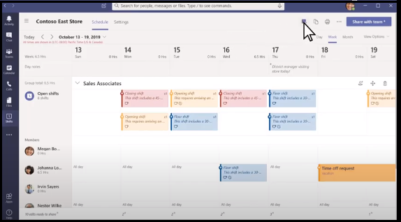

# 本番対応の Shifts コネクタ  

Teams Shifts Workforce Management (WFM) コネクタは、実稼働対応、オープンソース、コミュニティ主導の統合であり、ファーストライン ワーカーに役立ちます。 彼らは、Teams Shifts を使用した第一線のワーカーのデジタル変革のためのシームレスなエクスペリエンスと迅速なプロセスを提供します。

各コネクタには、組織へのデプロイと統合に関する詳細なガイダンスが用意されています。 完全なソース コードは、GitHub リポジトリで使用できます。 詳細またはフォークを調べて、特定のニーズに合わせてカスタマイズできます。

このドキュメントでは、Teams Shifts WFM コネクタ、Kronos-to-Teams Shifts コネクタ、JDA から Teams Shifts コネクタの主な利点の概要について説明します。

## Teams Shifts WFM コネクタの主な利点

Teams Shifts WFM コネクタの主な利点を次に示します。

* **プラグ アンド プレイ エクスペリエンス:** すべての Shifts WFM コネクタには、Microsoft Azureで必要なすべてのサービスをホストできる ARM Azure デプロイ スクリプトが含まれています。 アプリを展開するためにコーディングは必要ありません。

* **運用環境対応コード:** すべての Shifts コネクタは、推奨されるセキュリティとインフラストラクチャのベスト プラクティスに準拠しており、コミュニティから送信されたすべての変更がレビューされ、継続的な準拠が保証されます。

* **カスタマイズ可能で拡張可能:** すべての Shifts WFM コネクタをすぐに使用できるようにデプロイする準備が整いましたが、コード ベーススクリプトとデプロイ スクリプト全体をすぐに使用できます。 独自のニーズに合わせて簡単にカスタマイズまたは拡張できます。

* **サポート&詳細なドキュメント:** すべての Shifts WFM コネクタには、ソリューションアーキテクチャ、デプロイ、および構成手順に関するエンドツーエンドのドキュメントが付属しています。 コネクタ リポジトリは監視されるため、リポジトリのGitHubの問題追跡ツールを使用して、発生した問題、課題、または困難を報告できます。

* **シームレスな統合:** WFM ソリューションと Teams Shifts の統合により、ファーストライン ワーカーは、Teams Shifts アプリを使用してスケジュールとシフト時間を表示または管理し、コンテキストを別のアプリに切り替えることなく、モバイル デバイスまたはデスクトップから直接Teamsで提供されるその他のすべての豊富なコラボレーション機能を使用できます。  

Teamsで Shifts ビューを開きます。

Teamsの Shifts ビューを次の図に示します。

## 関連項目

[Web アプリを統合する](~/samples/integrate-web-apps-overview.md)
