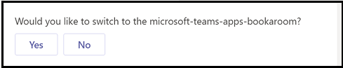

# <a name="virtual-assistant-for-microsoft-teams"></a><span data-ttu-id="6ec42-104">Microsoft Teams の仮想アシスタント</span><span class="sxs-lookup"><span data-stu-id="6ec42-104">Virtual Assistant for Microsoft Teams</span></span>

<span data-ttu-id="6ec42-105">Virtual Assistant は、ユーザー エクスペリエンス、組織のブランド化、および必要なデータを完全に制御しながら、堅牢な会話型ソリューションを作成できる Microsoft のオープン ソース テンプレートです。</span><span class="sxs-lookup"><span data-stu-id="6ec42-105">Virtual Assistant is a Microsoft open-source template that enables you to create a robust conversational solution while maintaining full control of user experience, organizational branding, and necessary data.</span></span> <span data-ttu-id="6ec42-106">Virtual [](https://microsoft.github.io/botframework-solutions/overview/virtual-assistant-template) Assistant コア テンプレートは、ボット[フレームワーク SDK](https://github.com/microsoft/botframework-sdk)、言語理解[(LUIS)](https://www.luis.ai/) [、QnA Maker](https://www.qnamaker.ai/)など、仮想アシスタントの構築に必要な Microsoft テクノロジと、スキル登録、リンクされたアカウント、エンドユーザーにシームレスな対話とエクスペリエンスを提供するための基本的な会話の意図を含む重要な機能をまとめる基本的な構成ブロックです。</span><span class="sxs-lookup"><span data-stu-id="6ec42-106">The [Virtual Assistant core template](https://microsoft.github.io/botframework-solutions/overview/virtual-assistant-template) is the basic building block that brings together the Microsoft technologies required to build a Virtual Assistant, including the [Bot Framework SDK](https://github.com/microsoft/botframework-sdk), [Language Understanding (LUIS)](https://www.luis.ai/), [QnA Maker](https://www.qnamaker.ai/), as well as essential capabilities including  skills registration, linked accounts, basic conversational intent to offer end users a range of seamless interactions and experiences.</span></span> <span data-ttu-id="6ec42-107">さらに、テンプレート機能には、再利用可能な会話スキルの豊富な例が含 [まれます](https://microsoft.github.io/botframework-solutions/overview/skills)。</span><span class="sxs-lookup"><span data-stu-id="6ec42-107">In addition, the template capabilities include rich examples of reusable conversational [skills](https://microsoft.github.io/botframework-solutions/overview/skills).</span></span>  <span data-ttu-id="6ec42-108">個々のスキルを仮想アシスタント ソリューションに統合して、複数のシナリオを有効にできます。</span><span class="sxs-lookup"><span data-stu-id="6ec42-108">Individual skills can be integrated in a Virtual Assistant solution to enable multiple scenarios.</span></span> <span data-ttu-id="6ec42-109">Bot Framework SDK を使用すると、必要に応じてカスタマイズおよび拡張できるソース コード形式でスキルが表示されます。</span><span class="sxs-lookup"><span data-stu-id="6ec42-109">Using the Bot Framework SDK, Skills are presented in source code form enabling you to customize and extend as required.</span></span> <span data-ttu-id="6ec42-110">「 [ボット フレームワーク スキルとは」を参照してください](https://microsoft.github.io/botframework-solutions/overview/skills/)。</span><span class="sxs-lookup"><span data-stu-id="6ec42-110">See [What is a Bot Framework Skill](https://microsoft.github.io/botframework-solutions/overview/skills/).</span></span>


<span data-ttu-id="6ec42-112">テキスト メッセージ アクティビティは、ディスパッチ モデルを使用して Virtual Assistant コアによって関連付けられたスキルに [ルーティング](/azure/bot-service/bot-builder-tutorial-dispatch?view=azure-bot-service-4.0&tabs=cs&preserve-view=true) されます。</span><span class="sxs-lookup"><span data-stu-id="6ec42-112">Text message activities are routed to associated skills by the Virtual Assistant core using a [dispatch](/azure/bot-service/bot-builder-tutorial-dispatch?view=azure-bot-service-4.0&tabs=cs&preserve-view=true) model.</span></span> 

## <a name="implementation-considerations"></a><span data-ttu-id="6ec42-113">実装に関する考慮事項</span><span class="sxs-lookup"><span data-stu-id="6ec42-113">Implementation considerations</span></span>

<span data-ttu-id="6ec42-114">仮想アシスタントを追加する決定には、多くの決定項目が含まれる可能性があります。組織ごとに異なります。</span><span class="sxs-lookup"><span data-stu-id="6ec42-114">The decision to add a Virtual Assistant can include many determinants and differ for each organization.</span></span> <span data-ttu-id="6ec42-115">組織の仮想アシスタントの実装をサポートする要因を次に示します。</span><span class="sxs-lookup"><span data-stu-id="6ec42-115">Here are the factors that support implementing a Virtual Assistant for your organization:</span></span>

- <span data-ttu-id="6ec42-116">中央チームは、すべての従業員エクスペリエンスを管理し、仮想アシスタント エクスペリエンスを構築し、新しいスキルの追加を含むコア エクスペリエンスの更新を管理する機能を備えています。</span><span class="sxs-lookup"><span data-stu-id="6ec42-116">A central team manages all employee experiences and has the capability to build a Virtual Assistant experience and manage updates to the core experience including the addition of new skills.</span></span>
- <span data-ttu-id="6ec42-117">ビジネス機能全体に複数のアプリケーションが存在し、その数は将来増加する見込みです。</span><span class="sxs-lookup"><span data-stu-id="6ec42-117">Multiple applications exist across business functions and/or the number is expected to grow in the future.</span></span>
- <span data-ttu-id="6ec42-118">既存のアプリケーションはカスタマイズ可能で、組織が所有し、仮想アシスタントのスキルに変換できます。</span><span class="sxs-lookup"><span data-stu-id="6ec42-118">Existing applications are customizable, owned by the organization, and can be converted into skills for a Virtual Assistant.</span></span>
- <span data-ttu-id="6ec42-119">中央の従業員エクスペリエンス チームは、既存のアプリへのカスタマイズに影響を与え、仮想アシスタント エクスペリエンスのスキルとして既存のアプリケーションを統合するために必要なガイダンスを提供できます。</span><span class="sxs-lookup"><span data-stu-id="6ec42-119">The central employee-experiences team is able to influence customizations to existing apps and provide necessary guidance for integrating existing applications as skills in Virtual Assistant experience</span></span>


## <a name="create-a-teams-focused-virtual-assistant"></a><span data-ttu-id="6ec42-121">Teams に焦点を当てた仮想アシスタントを作成する</span><span class="sxs-lookup"><span data-stu-id="6ec42-121">Create a Teams-focused Virtual Assistant</span></span>

<span data-ttu-id="6ec42-122">Microsoft は、仮想アシスタント [Visual Studioスキルを構築](https://marketplace.visualstudio.com/items?itemName=BotBuilder.VirtualAssistantTemplate) する新しいテンプレートを公開しました。</span><span class="sxs-lookup"><span data-stu-id="6ec42-122">Microsoft has published a [Visual Studio template](https://marketplace.visualstudio.com/items?itemName=BotBuilder.VirtualAssistantTemplate) for building Virtual Assistants and skills.</span></span> <span data-ttu-id="6ec42-123">このテンプレートVisual Studio、アクションを含む限られたリッチ カードをサポートするテキスト ベースのエクスペリエンスを利用して仮想アシスタントを作成できます。</span><span class="sxs-lookup"><span data-stu-id="6ec42-123">With the Visual Studio template, you can create a Virtual Assistant, powered by a text-based experience with support for limited rich cards with actions.</span></span> <span data-ttu-id="6ec42-124">Microsoft Teams プラットフォーム機能とVisual Studio Teams アプリ エクスペリエンスを強化するために、基本テンプレートの機能が強化されました。</span><span class="sxs-lookup"><span data-stu-id="6ec42-124">We have enhanced the Visual Studio base template to include Microsoft Teams platform capabilities and power great Teams app experiences.</span></span> <span data-ttu-id="6ec42-125">機能のいくつかには、豊富なアダプティブ カード、タスク モジュール、チーム/グループ チャット、メッセージング拡張機能のサポートが含まれます。</span><span class="sxs-lookup"><span data-stu-id="6ec42-125">A few of the capabilities include support for rich adaptive cards, task modules, teams/group chats and messaging extensions.</span></span> <span data-ttu-id="6ec42-126">*「チュートリアル:*[仮想アシスタントを Microsoft Teams に拡張する」も参照してください](https://microsoft.github.io/botframework-solutions/clients-and-channels/tutorials/enable-teams/1-intro/)。</span><span class="sxs-lookup"><span data-stu-id="6ec42-126">*See also*, [Tutorial: Extend Your Virtual Assistant to Microsoft Teams](https://microsoft.github.io/botframework-solutions/clients-and-channels/tutorials/enable-teams/1-intro/).</span></span>


### <a name="add-adaptive-cards-to-your-virtual-assistant"></a><span data-ttu-id="6ec42-128">仮想アシスタントにアダプティブ カードを追加する</span><span class="sxs-lookup"><span data-stu-id="6ec42-128">Add adaptive cards to your Virtual Assistant</span></span>

<span data-ttu-id="6ec42-129">要求を適切にディスパッチするには、仮想アシスタントが適切な LUIS モデルとそれに関連付けられている対応するスキルを識別する必要があります。</span><span class="sxs-lookup"><span data-stu-id="6ec42-129">To dispatch requests properly, your Virtual Assistant needs to identify the correct LUIS model and corresponding skill associated with it.</span></span> <span data-ttu-id="6ec42-130">ただし、スキルに関連付けられた LUIS モデルは、ユーザーからの発話ではなく、定義済みの固定キーワードで、カード アクション テキストに対してトレーニングされない可能性があります。ただし、ディスパッチ機構をカード アクション アクティビティに使用することはできません。</span><span class="sxs-lookup"><span data-stu-id="6ec42-130">However, the dispatching mechanism cannot be used for card action activities since the LUIS model associated with a skill may not be trained for card action texts since these are fixed, pre-defined keywords, not utterances from a user.</span></span>

<span data-ttu-id="6ec42-131">カード アクション ペイロードにスキル情報を埋め込み、これを解決しました。</span><span class="sxs-lookup"><span data-stu-id="6ec42-131">We have resolved this by embedding skill information in the card action payload.</span></span> <span data-ttu-id="6ec42-132">すべてのスキルは、カード `skillId` アクションの  `value` フィールドに埋め込む必要があります。</span><span class="sxs-lookup"><span data-stu-id="6ec42-132">Every skill should embed `skillId` in the  `value` field of card actions.</span></span> <span data-ttu-id="6ec42-133">これは、各カードアクションアクティビティが関連するスキル情報を確実に運び、仮想アシスタントがこの情報をディスパッチに利用できる最善の方法です。</span><span class="sxs-lookup"><span data-stu-id="6ec42-133">This is the best way to ensure that each card action activity carries the relevant skill information and Virtual Assistant can utilize this information for dispatching.</span></span>

<span data-ttu-id="6ec42-134">次に、カード アクション データのサンプルを示します。</span><span class="sxs-lookup"><span data-stu-id="6ec42-134">Below is a card action data sample.</span></span> <span data-ttu-id="6ec42-135">コンストラクターで `skillId` 提供することで、スキル情報が常にカード アクションに表示されます。</span><span class="sxs-lookup"><span data-stu-id="6ec42-135">By providing `skillId` in the constructor we ensure that skill information is always present in card actions.</span></span>

```csharp
    public class CardActionData
    {
        public CardActionData(string skillId)
        {
            this.SkillId = skillId;
        }

        [JsonProperty("skillId")]
        public string SkillId { get; set; }
    }

    ...
    var button = new CardAction
    {
        Type = ActionTypes.MessageBack,
        Title = "Card action button",
        Text = "card action button text",
        Value = new CardActionData(<SkillId>),
    };
```

<span data-ttu-id="6ec42-136">次に、カード `SkillCardActionData` アクション ペイロードから抽出する仮想アシスタント `skillId` テンプレートのクラスについて説明します。</span><span class="sxs-lookup"><span data-stu-id="6ec42-136">Next, we introduce `SkillCardActionData` class in the Virtual Assistant template to extract `skillId` from the card action payload.</span></span>

```csharp
    // Skill Card action data should contain skillId parameter
    // This class is used to deserialize it and get skillId 
    public class SkillCardActionData
    {
        /// <summary>
        /// Gets the ID of the skil that should handle this card
        /// </summary>
        [JsonProperty("skillId")]
        public string SkillId { get; set; }
    }
```

<span data-ttu-id="6ec42-137">カード アクション データから抽出するコード  `skillId` スニペットを次に示します。</span><span class="sxs-lookup"><span data-stu-id="6ec42-137">Below is a code snippet to extract  `skillId` from card action data.</span></span> <span data-ttu-id="6ec42-138">Activity クラスで拡張メソッドとして [実装](https://github.com/microsoft/botframework-sdk/blob/master/specs/botframework-activity/botframework-activity.md) しました。</span><span class="sxs-lookup"><span data-stu-id="6ec42-138">We implemented it as an  extension method in the [Activity](https://github.com/microsoft/botframework-sdk/blob/master/specs/botframework-activity/botframework-activity.md) class.</span></span>

```csharp
    public static class ActivityExtensions
    {
        // Fetches skillId from CardAction data if present
        public static string GetSkillId(this Activity activity)
        {
            string skillId = string.Empty;

            try
            {
                if (activity.Type.Equals(ActivityTypes.Message) && activity.Value != null)
                {
                    var data = JsonConvert.DeserializeObject<SkillCardActionData>(activity.Value.ToString());
                    skillId = data.SkillId;
                }
                else if (activity.Type.Equals(ActivityTypes.Invoke) && activity.Value != null)
                {
                    var data = JsonConvert.DeserializeObject<SkillCardActionData>(JObject.Parse(activity.Value.ToString()).SelectToken("data").ToString());
                    skillId = data.SkillId;
                }
            }
            catch
            {
                // If not able to retrive skillId, empty skillId should be returned
            }

            return skillId;
        }
    }
```

### <a name="handle-interruptions-gracefully"></a><span data-ttu-id="6ec42-139">中断を適切に処理する</span><span class="sxs-lookup"><span data-stu-id="6ec42-139">Handle interruptions gracefully</span></span>

<span data-ttu-id="6ec42-140">仮想アシスタントは、別のスキルが現在アクティブな間にユーザーがスキルを呼び出そうとする場合に中断を処理できます。</span><span class="sxs-lookup"><span data-stu-id="6ec42-140">Virtual Assistant can handle interruptions in cases where a user tries to invoke a skill while another skill is currently active.</span></span> <span data-ttu-id="6ec42-141">ボット フレームワークの `TeamsSkillDialog` `TeamsSwitchSkillDialog` [SkillDialog](https://github.com/microsoft/botframework-solutions/blob/5b46d73e220bbb4fba86c48be532e495535ca78a/sdk/csharp/libraries/microsoft.bot.solutions/Skills/SkillDialog.cs) と [SwitchSkillDialog](https://github.com/microsoft/botframework-solutions/blob/6d40fa8ae05f96b0c5e0464e01361a9e1deb696c/sdk/csharp/libraries/microsoft.bot.solutions/Skills/Dialogs/SwitchSkillDialog.cs)に基づいて、ユーザーがカード操作からスキル エクスペリエンスを切り替える機能を導入しました。</span><span class="sxs-lookup"><span data-stu-id="6ec42-141">we have introduced `TeamsSkillDialog` and `TeamsSwitchSkillDialog`, based on Bot Framework's [SkillDialog](https://github.com/microsoft/botframework-solutions/blob/5b46d73e220bbb4fba86c48be532e495535ca78a/sdk/csharp/libraries/microsoft.bot.solutions/Skills/SkillDialog.cs) and [SwitchSkillDialog](https://github.com/microsoft/botframework-solutions/blob/6d40fa8ae05f96b0c5e0464e01361a9e1deb696c/sdk/csharp/libraries/microsoft.bot.solutions/Skills/Dialogs/SwitchSkillDialog.cs), to enable users to switch a skill experience from card actions.</span></span> <span data-ttu-id="6ec42-142">この要求を処理するために、仮想アシスタントは、スキルを切り替える確認メッセージをユーザーに求めるメッセージを表示します。</span><span class="sxs-lookup"><span data-stu-id="6ec42-142">To handle this request the Virtual Assistant prompts the user with a confirmation message to switch skills.</span></span>



### <a name="handling-task-module-requests"></a><span data-ttu-id="6ec42-144">タスク モジュール要求の処理</span><span class="sxs-lookup"><span data-stu-id="6ec42-144">Handling task module requests</span></span>

<span data-ttu-id="6ec42-145">タスク モジュールの機能を仮想アシスタントに追加するには、2 つの追加メソッドが Virtual Assistant アクティビティ ハンドラーに含 `OnTeamsTaskModuleFetchAsync` まれています。 `OnTeamsTaskModuleSubmitAsync`</span><span class="sxs-lookup"><span data-stu-id="6ec42-145">To add task module capabilities to a Virtual Assistant, two additional methods are included in the Virtual Assistant activity handler: `OnTeamsTaskModuleFetchAsync` and `OnTeamsTaskModuleSubmitAsync`.</span></span> <span data-ttu-id="6ec42-146">これらのメソッドは、仮想アシスタントからタスク モジュール関連のアクティビティをリッスンし、要求に関連付けられたスキルを特定し、特定されたスキルに要求を転送します。</span><span class="sxs-lookup"><span data-stu-id="6ec42-146">These methods listen to task module-related activities from Virtual Assistant, identify the skill associated with the request, and forward the request to the identified skill.</span></span> 

<span data-ttu-id="6ec42-147">要求の転送は  [、SkillHttpClient メソッドを介して](/dotnet/api/microsoft.bot.builder.integration.aspnet.core.skills.skillhttpclient?view=botbuilder-dotnet-stable&preserve-view=true)行 `PostActivityAsync` われます。</span><span class="sxs-lookup"><span data-stu-id="6ec42-147">Request forwarding is done via the  [SkillHttpClient](/dotnet/api/microsoft.bot.builder.integration.aspnet.core.skills.skillhttpclient?view=botbuilder-dotnet-stable&preserve-view=true), `PostActivityAsync` method.</span></span> <span data-ttu-id="6ec42-148">これは、解析され、に変換 `InvokeResponse` される応答を返します `TaskModuleResponse` 。</span><span class="sxs-lookup"><span data-stu-id="6ec42-148">It returns the response as `InvokeResponse` which is parsed and converted to `TaskModuleResponse` .</span></span>

```csharp
    public static TaskModuleResponse GetTaskModuleRespose(this InvokeResponse invokeResponse)
    {
        if (invokeResponse.Body != null)
        {
            return new TaskModuleResponse()
            {
                Task = GetTask(invokeResponse.Body),
            };
        }

        return null;
    }

    private static TaskModuleResponseBase GetTask(object invokeResponseBody)
        {
            JObject resposeBody = (JObject)JToken.FromObject(invokeResponseBody);
            var task = resposeBody.GetValue("task");
            var taskType = task.SelectToken("type").ToString();

            return taskType switch
            {
                "continue" => new TaskModuleContinueResponse()
                {
                    Type = taskType,
                    Value = task.SelectToken("value").ToObject<TaskModuleTaskInfo>(),
                },
                "message" => new TaskModuleMessageResponse()
                {
                    Type = taskType,
                    Value = task.SelectToken("value").ToString(),
                },
                _ => null,
            };
        }
```

<span data-ttu-id="6ec42-149">カード アクションのディスパッチとタスク モジュールの応答にも同様の方法が実行されます。</span><span class="sxs-lookup"><span data-stu-id="6ec42-149">A similar approach is followed for card action dispatching and task module responses.</span></span> <span data-ttu-id="6ec42-150">タスク モジュールのフェッチと送信のアクション データが更新され、含まれます `skillId` 。</span><span class="sxs-lookup"><span data-stu-id="6ec42-150">Task module fetch and submit action data is updated to include `skillId`.</span></span> <span data-ttu-id="6ec42-151">Activity Extension メソッド `GetSkillId` は、呼び出す必要があるスキルの詳細を提供するペイロード `skillId` から抽出します。</span><span class="sxs-lookup"><span data-stu-id="6ec42-151">Activity Extension method `GetSkillId` extracts `skillId` from the payload which provides details about the skill that needs to be invoked.</span></span>

<span data-ttu-id="6ec42-152">以下に、メソッドの `OnTeamsTaskModuleFetchAsync` コード スニペット `OnTeamsTaskModuleSubmitAsync` を示します。</span><span class="sxs-lookup"><span data-stu-id="6ec42-152">Below is a code snippet for `OnTeamsTaskModuleFetchAsync` and `OnTeamsTaskModuleSubmitAsync` methods.</span></span>

```csharp
    // Invoked when a "task/fetch" event is received to invoke task module.
    protected override async Task<TaskModuleResponse> OnTeamsTaskModuleFetchAsync(ITurnContext<IInvokeActivity> turnContext, TaskModuleRequest taskModuleRequest, CancellationToken cancellationToken)
    {
        try
        {
            string skillId = (turnContext.Activity as Activity).GetSkillId();
            var skill = _skillsConfig.Skills.Where(s => s.Value.AppId == skillId).First().Value;

            // Forward request to correct skill
            var invokeResponse = await _skillHttpClient.PostActivityAsync(this._appId, skill, _skillsConfig.SkillHostEndpoint, turnContext.Activity as Activity, cancellationToken);

            return invokeResponse.GetTaskModuleRespose();
        }
        catch (Exception exception)
        {
            await turnContext.SendActivityAsync(_templateEngine.GenerateActivityForLocale("ErrorMessage"));
            _telemetryClient.TrackException(exception);

            return null;
        }
    }

    // Invoked when a 'task/submit' invoke activity is received for task module submit actions.
    protected override async Task<TaskModuleResponse> OnTeamsTaskModuleSubmitAsync(ITurnContext<IInvokeActivity> turnContext, TaskModuleRequest taskModuleRequest, CancellationToken cancellationToken)
    {
        try
        {
            string skillId = (turnContext.Activity as Activity).GetSkillId();
            var skill = _skillsConfig.Skills.Where(s => s.Value.AppId == skillId).First().Value;

            // Forward request to correct skill
            var invokeResponse = await _skillHttpClient.PostActivityAsync(this._appId, skill, _skillsConfig.SkillHostEndpoint, turnContext.Activity as Activity, cancellationToken).ConfigureAwait(false);

            return invokeResponse.GetTaskModuleRespose();
        }
        catch (Exception exception)
        {
            await turnContext.SendActivityAsync(_templateEngine.GenerateActivityForLocale("ErrorMessage"));
            _telemetryClient.TrackException(exception);

            return null;
        }
    }
```

<span data-ttu-id="6ec42-153">さらに、スキルを介して呼び出されたタスク モジュールが適切にレンダリングされるには、すべてのスキル ドメインを Virtual Assistant のマニフェスト ファイルのセクション `validDomains` に含める必要があります。</span><span class="sxs-lookup"><span data-stu-id="6ec42-153">Additionally, all skill domains must be included in the `validDomains` section in Virtual Assistant's manifest file so that task modules invoked via a skill render properly.</span></span>

### <a name="handling-collaborative-app-scopes"></a><span data-ttu-id="6ec42-154">共同アプリスコープの処理</span><span class="sxs-lookup"><span data-stu-id="6ec42-154">Handling collaborative app scopes</span></span>

<span data-ttu-id="6ec42-155">Teams アプリは、1:1 チャット、グループ チャット、チャネルを含む複数のスコープに存在できます。</span><span class="sxs-lookup"><span data-stu-id="6ec42-155">Teams apps can exist in multiple scopes including 1:1 chat, group chat, and channels.</span></span> <span data-ttu-id="6ec42-156">コア仮想アシスタント テンプレートは、1:1 チャット用に設計されています。</span><span class="sxs-lookup"><span data-stu-id="6ec42-156">The core Virtual Assistant template is designed for 1:1 chats.</span></span> <span data-ttu-id="6ec42-157">オンボーディング エクスペリエンスの一環として、仮想アシスタントはユーザーに名前を求め、ユーザーの状態を維持します。</span><span class="sxs-lookup"><span data-stu-id="6ec42-157">As part of the onboarding experience Virtual Assistant  prompts users for name and maintains user state.</span></span> <span data-ttu-id="6ec42-158">オンボーディング エクスペリエンスはグループ チャット/チャネル スコープには適していないので、削除されています。</span><span class="sxs-lookup"><span data-stu-id="6ec42-158">Since that onboarding experience is not suited for group chat/channel scopes it has been removed.</span></span>

<span data-ttu-id="6ec42-159">スキルは、複数の範囲 (1:1 チャット、グループ チャット、チャネル会話) のアクティビティを処理する必要があります。</span><span class="sxs-lookup"><span data-stu-id="6ec42-159">Skills should handle activities in multiple scopes (1:1 chat, group chat, and channel conversation).</span></span> <span data-ttu-id="6ec42-160">これらのスコープがサポートされていない場合、スキルは適切なメッセージで応答する必要があります。</span><span class="sxs-lookup"><span data-stu-id="6ec42-160">If any of these scopes are not supported, skills should respond with an appropriate message.</span></span>

<span data-ttu-id="6ec42-161">仮想アシスタント コアには、次の処理機能が追加されています。</span><span class="sxs-lookup"><span data-stu-id="6ec42-161">The following  processing functions have been added to Virtual Assistant core:</span></span>

- <span data-ttu-id="6ec42-162">仮想アシスタントは、グループ チャットまたはチャネルからのテキスト メッセージなしで呼び出すことができます。</span><span class="sxs-lookup"><span data-stu-id="6ec42-162">Virtual Assistant can be invoked without any text message from a group chat or channel.</span></span>
- <span data-ttu-id="6ec42-163">メッセージをディスパッチ モジュールに送信する前に、アーティキュレーションがクリーンアップされます (つまり、ボットの@mentionを削除します)。</span><span class="sxs-lookup"><span data-stu-id="6ec42-163">Articulations are cleaned (i.e.,  remove the necessary @mention of the bot) before sending the message to the dispatch module.</span></span>

```csharp
    if (innerDc.Context.Activity.Conversation?.IsGroup == true)
    {
        // Remove bot atmentions for teams/groupchat scope
        innerDc.Context.Activity.RemoveRecipientMention();

        // If bot is invoked without any text, reply with FirstPromptMessage
        if (string.IsNullOrWhiteSpace(innerDc.Context.Activity.Text))
        {
            await innerDc.Context.SendActivityAsync(_templateEngine.GenerateActivityForLocale("FirstPromptMessage"));
            return EndOfTurn;
        }
    }
```

### <a name="handling-messaging-extensions"></a><span data-ttu-id="6ec42-164">メッセージング拡張機能の処理</span><span class="sxs-lookup"><span data-stu-id="6ec42-164">Handling messaging extensions</span></span>

<span data-ttu-id="6ec42-165">メッセージング拡張機能のコマンドは、アプリ マニフェスト ファイルで宣言されます。</span><span class="sxs-lookup"><span data-stu-id="6ec42-165">The commands for a messaging extension are declared in your app manifest file.</span></span> <span data-ttu-id="6ec42-166">メッセージング拡張機能のユーザー インターフェイスには、これらのコマンドが搭載されています。</span><span class="sxs-lookup"><span data-stu-id="6ec42-166">The messaging extension user interface is powered by those commands.</span></span> <span data-ttu-id="6ec42-167">仮想アシスタントがメッセージング拡張機能コマンド (添付スキルとして) に電力を供給するには、仮想アシスタント独自のマニフェストにこれらのコマンドが含まれている必要があります。</span><span class="sxs-lookup"><span data-stu-id="6ec42-167">For a Virtual Assistant to power a messaging extension command (as an attached skill), a Virtual Assistant's own manifest must contain those commands.</span></span> <span data-ttu-id="6ec42-168">個々のスキルのマニフェストのコマンドも仮想アシスタントのマニフェストに追加する必要があります。</span><span class="sxs-lookup"><span data-stu-id="6ec42-168">The commands from an individual skill's manifest should be added to the Virtual Assistant's manifest as well.</span></span> <span data-ttu-id="6ec42-169">コマンド ID は、スキルのアプリ ID を区切り記号 () を介して追加することで、関連付けられたスキルに関する情報を提供します `:` 。</span><span class="sxs-lookup"><span data-stu-id="6ec42-169">The command ID provides information about an associated skill by appending the skill's app ID via a separator (`:`).</span></span>

<span data-ttu-id="6ec42-170">スキルのマニフェスト ファイルのスニペットを次に示します。</span><span class="sxs-lookup"><span data-stu-id="6ec42-170">Below is a snippet from a skill's manifest file.</span></span>

```json
 "composeExtensions": [
    {
        "botId": "<Skil_App_Id>",
        "commands": [
            {
                "id": "searchQuery",
                "context": [ "compose", "commandBox" ],
                "description": "Test command to run query",
    ....
```

<span data-ttu-id="6ec42-171">次に、対応する Virtual Assistant マニフェスト ファイル コード スニペットを示します。</span><span class="sxs-lookup"><span data-stu-id="6ec42-171">And, below is the corresponding Virtual Assistant manifest file code snippet.</span></span>

```json
 "composeExtensions": [
    {
        "botId": "<VA_App_Id>",
        "commands": [
            {
                "id": "searchQuery:<skill_id>",
                "context": [ "compose", "commandBox" ],
                "description": "Test command to run query",
    ....
```

<span data-ttu-id="6ec42-172">コマンドがユーザーによって呼び出されると、仮想アシスタントはコマンド ID を解析して関連スキルを識別し、コマンド ID から余分なサフィックス ( ) を削除してアクティビティを更新し、対応するスキルに転送できます。 `:<skill_id>`</span><span class="sxs-lookup"><span data-stu-id="6ec42-172">Once the commands are invoked by a user, the Virtual Assistant can identify an associated skill by parsing the command ID, update the activity by removing the extra suffix (`:<skill_id>`) from the command ID,  and forward it to the corresponding skill.</span></span> <span data-ttu-id="6ec42-173">スキルのコードは、余分な接尾辞を処理する必要はありません。したがって、スキル間のコマンドの ID 間の競合は回避されます。</span><span class="sxs-lookup"><span data-stu-id="6ec42-173">The code for a skill doesn't need to handle the extra suffix, thus, conflicts between command IDs across skills are avoided.</span></span> <span data-ttu-id="6ec42-174">この方法では、すべてのコンテキスト内のすべてのスキルの検索コマンドとアクション コマンド ("compose"、"commandBox"、および "message") を仮想アシスタントが使用できます。</span><span class="sxs-lookup"><span data-stu-id="6ec42-174">With this approach, all the search and action commands of a skill within all contexts ("compose", "commandBox" and "message") can be powered by a Virtual Assistant.</span></span>

```csharp
    const string MessagingExtensionCommandIdSeparator = ":";

    // Invoked when a 'composeExtension/submitAction' invoke activity is received for a messaging extension action command
    protected override async Task<MessagingExtensionActionResponse> OnTeamsMessagingExtensionSubmitActionAsync(ITurnContext<IInvokeActivity> turnContext, MessagingExtensionAction action, CancellationToken cancellationToken)
    {
        return await ForwardMessagingExtensionActionCommandActivityToSkill(turnContext, action, cancellationToken);
    }

    // Forwards invoke activity to right skill for messaging extension action commands.
    private async Task<MessagingExtensionActionResponse> ForwardMessagingExtensionActionCommandActivityToSkill(ITurnContext<IInvokeActivity> turnContext, MessagingExtensionAction action, CancellationToken cancellationToken)
    {
        var skillId = ExtractSkillIdFromMessagingExtensionActionCommand(turnContext, action);
        var skill = _skillsConfig.Skills.Where(s => s.Value.AppId == skillId).First().Value;
        var invokeResponse = await _skillHttpClient.PostActivityAsync(this._appId, skill, _skillsConfig.SkillHostEndpoint, turnContext.Activity as Activity, cancellationToken).ConfigureAwait(false);

        return invokeResponse.GetMessagingExtensionActionResponse();
    }

    // Extracts skill Id from messaging extension command and updates activity value
    private string ExtractSkillIdFromMessagingExtensionActionCommand(ITurnContext<IInvokeActivity> turnContext, MessagingExtensionAction action)
    {
        var commandArray = action.CommandId.Split(MessagingExtensionCommandIdSeparator);
        var skillId = commandArray.Last();

        // Update activity value by removing skill id before forwarding to the skill.
        var activityValue = JsonConvert.DeserializeObject<MessagingExtensionAction>(turnContext.Activity.Value.ToString());
        activityValue.CommandId = string.Join(MessagingExtensionCommandIdSeparator, commandArray, 0 commandArray.Length - 1);
        turnContext.Activity.Value = activityValue;

        return skillId;
    }
```

<span data-ttu-id="6ec42-175">メッセージング拡張機能のアクティビティの中には、コマンド ID が含まれるものがあります。</span><span class="sxs-lookup"><span data-stu-id="6ec42-175">Some messaging extension activities do not include the command ID.</span></span> <span data-ttu-id="6ec42-176">たとえば、呼 `composeExtension/selectItem` び出しタップ アクションの値だけが含まれるとします。</span><span class="sxs-lookup"><span data-stu-id="6ec42-176">For example, `composeExtension/selectItem` contains only the value of the invoke tap action.</span></span> <span data-ttu-id="6ec42-177">関連付けられたスキルを識別するには、に対する応答を形成している間、各 `skillId`  アイテム カードに添付されます `OnTeamsMessagingExtensionQueryAsync` 。</span><span class="sxs-lookup"><span data-stu-id="6ec42-177">To identify the associated skill, `skillId`  is attached to each item card while forming a response for `OnTeamsMessagingExtensionQueryAsync`.</span></span> <span data-ttu-id="6ec42-178">(これは、仮想アシスタントにアダプティブ カードを [追加する方法に似ています](#add-adaptive-cards-to-your-virtual-assistant)。</span><span class="sxs-lookup"><span data-stu-id="6ec42-178">(This is similar to the approach for [adding adaptive  cards to your Virtual Assistant](#add-adaptive-cards-to-your-virtual-assistant).</span></span>

```csharp
    // Invoked when a 'composeExtension/selectItem' invoke activity is received for compose extension query command.
    protected override async Task<MessagingExtensionResponse> OnTeamsMessagingExtensionSelectItemAsync(ITurnContext<IInvokeActivity> turnContext, JObject query, CancellationToken cancellationToken)
    {
        var data = JsonConvert.DeserializeObject<SkillCardActionData>(query.ToString());
        var skill = _skillsConfig.Skills.Where(s => s.Value.AppId == data.SkillId).First().Value;
        var invokeResponse = await _skillHttpClient.PostActivityAsync(this._appId, skill, _skillsConfig.SkillHostEndpoint, turnContext.Activity as Activity, cancellationToken).ConfigureAwait(false);

        return invokeResponse.GetMessagingExtensionResponse();
    }
```

---

## <a name="example-convert-the-book-a-room-app-template-to-a-virtual-assistant-skill"></a><span data-ttu-id="6ec42-179">例: Book-a-room アプリ テンプレートを仮想アシスタント スキルに変換する</span><span class="sxs-lookup"><span data-stu-id="6ec42-179">Example: Convert the Book-a-room app template to a Virtual Assistant skill</span></span>

<span data-ttu-id="6ec42-180">[Book-a-room](app-templates.md#book-a-room) は [Microsoft Teams](../bots/what-are-bots.md) ボットで、現在の時刻から 30 分 (既定)、60 分、または 90 分の会議室をすばやく検索して予約できます。</span><span class="sxs-lookup"><span data-stu-id="6ec42-180">[Book-a-room](app-templates.md#book-a-room) is a [Microsoft Teams bot](../bots/what-are-bots.md) that lets users quickly find and reserve a meeting room for 30 (default), 60, or 90 minutes starting from the current  time.</span></span> <span data-ttu-id="6ec42-181">会議室予約ボットは、個人の会話または一対一の会話を対象としています。</span><span class="sxs-lookup"><span data-stu-id="6ec42-181">The Book-a-room bot scopes to personal or 1:1 conversations.</span></span>


<span data-ttu-id="6ec42-183">以下に、仮想アシスタントに接続できるスキルに変換するために導入されたデルタの変更点を示します。</span><span class="sxs-lookup"><span data-stu-id="6ec42-183">Followings are the delta changes introduced to convert it to a skill which can be attached to a Virtual Assistant.</span></span> <span data-ttu-id="6ec42-184">同様のガイドラインに従って、既存の v4 ボットをスキルに変換できます。</span><span class="sxs-lookup"><span data-stu-id="6ec42-184">Similar guidelines can be followed to convert any existing v4 bot to a skill.</span></span>

### <a name="skill-manifest"></a><span data-ttu-id="6ec42-185">スキル マニフェスト</span><span class="sxs-lookup"><span data-stu-id="6ec42-185">Skill manifest</span></span>

<span data-ttu-id="6ec42-186">スキル マニフェストは、スキルのメッセージング エンドポイント、ID、名前、その他の関連メタデータを公開する JSON ファイルです (このマニフェストは、Microsoft Teams のアプリのサイドローディングに使用されるマニフェストとは異なります) 仮想アシスタントは、スキルを添付する入力としてこのファイルへのパスを必要とします。</span><span class="sxs-lookup"><span data-stu-id="6ec42-186">A skill manifest is a JSON file that exposes a skill's messaging endpoint, id, name, and other relevant metadata (this manifest is different than the manifest used for sideloading an app in Microsoft Teams) A Virtual Assistant requires a path to this file as an input to attach a skill.</span></span> <span data-ttu-id="6ec42-187">ボットの wwwroot フォルダーに次のマニフェストを追加しました。</span><span class="sxs-lookup"><span data-stu-id="6ec42-187">We have added the following manifest to the bot's wwwroot folder.</span></span>

```bash
botskills connect --remoteManifest "<url to skill's manifest>" ..
```

```json
{
  "$schema": "https://schemas.botframework.com/schemas/skills/skill-manifest-2.1.preview-0.json",
  "$id": "microsoft_teams_apps_bookaroom",
  "name": "microsoft-teams-apps-bookaroom",
  "description": "microsoft-teams-apps-bookaroom description",
  "publisherName": "Your Company",
  "version": "1.1",
  "iconUrl": "<icon url>",
  "copyright": "Copyright (c) Microsoft Corporation. All rights reserved.",
  "license": "",
  "privacyUrl": "<privacy url>",
  "endpoints": [
    {
      "name": "production",
      "protocol": "BotFrameworkV3",
      "description": "Production endpoint for the skill",
      "endpointUrl": "<endpoint url>",
      "msAppId": "skill app id"
    }
  ],
  "dispatchModels": {
    "languages": {
      "en-us": [
        {
          "id": "microsoft-teams-apps-bookaroom-en",
          "name": "microsoft-teams-apps-bookaroom LU (English)",
          "contentType": "application/lu",
          "url": "file://book-a-meeting.lu",
          "description": "English language model for the skill"
        }
      ]
    }
  },
  "activities": {
    "message": {
      "type": "message",
      "description": "Receives the users utterance and attempts to resolve it using the skill's LU models"
    }
  }
}
```

### <a name="luis-integration"></a><span data-ttu-id="6ec42-188">LUIS 統合</span><span class="sxs-lookup"><span data-stu-id="6ec42-188">LUIS Integration</span></span>

<span data-ttu-id="6ec42-189">仮想アシスタントのディスパッチ モデルは、付属のスキルの LUIS モデルの上に構築されています。</span><span class="sxs-lookup"><span data-stu-id="6ec42-189">Virtual Assistant's dispatch model is built on top of attached skills' LUIS models.</span></span> <span data-ttu-id="6ec42-190">ディスパッチ モデルは、すべてのテキスト アクティビティの意図を識別し、関連付けられたスキルを見つける。</span><span class="sxs-lookup"><span data-stu-id="6ec42-190">The dispatch model identifies the intent for every text activity and finds out skill associated with it.</span></span>

<span data-ttu-id="6ec42-191">仮想アシスタントでは、スキルを添付する場合、入力としてスキルの LUIS モデル (形式 `.lu` ) が必要です。</span><span class="sxs-lookup"><span data-stu-id="6ec42-191">Virtual Assistant requires skill's LUIS model (in `.lu` format) as an input while attaching a skill.</span></span> <span data-ttu-id="6ec42-192">LUIS json は `.lu` 、botframework-cli ツールを使用して形式に変換できます。</span><span class="sxs-lookup"><span data-stu-id="6ec42-192">LUIS json can be converted to `.lu` format using botframework-cli  tool.</span></span>

```json
botskills connect --remoteManifest "<url to skill's manifest>" --luisFolder "<path to the folder containing your Skill's .lu files>" --languages "en-us" --cs
```

```bash
npm i -g @microsoft/botframework-cli
bf luis:convert --in <pathToLUIS.json> --out <pathToLuFile>
```

<span data-ttu-id="6ec42-193">Book-a-room ボットには、ユーザー用の 2 つの主なコマンドがあります。</span><span class="sxs-lookup"><span data-stu-id="6ec42-193">Book-a-room bot has two main commands for users:</span></span>

- `Book room`
- `Manage Favorites`

<span data-ttu-id="6ec42-194">これら 2 つのコマンドを理解する LUIS モデルを構築しました。</span><span class="sxs-lookup"><span data-stu-id="6ec42-194">We have built a LUIS model understanding these two commands.</span></span> <span data-ttu-id="6ec42-195">対応するシークレットを入力する必要があります `cognitivemodels.json` 。</span><span class="sxs-lookup"><span data-stu-id="6ec42-195">Corresponding secrets need to be populated in `cognitivemodels.json`.</span></span> <span data-ttu-id="6ec42-196">対応する LUIS JSON ファイル[](https://github.com/OfficeDev/microsoft-teams-apps-bookaroom/blob/nebhagat/microsoft-teams-apps-bookaroom-skill/Deployment/Resources/LU/book-a-meeting.json)はここで見つけられているので、対応するファイルの `.lu` 外観は次の通りです。</span><span class="sxs-lookup"><span data-stu-id="6ec42-196">The corresponding LUIS JSON file can be found [here](https://github.com/OfficeDev/microsoft-teams-apps-bookaroom/blob/nebhagat/microsoft-teams-apps-bookaroom-skill/Deployment/Resources/LU/book-a-meeting.json) and this is how the corresponding `.lu` file looks like.</span></span>

```
> ! Automatically generated by [LUDown CLI](https://github.com/Microsoft/botbuilder-tools/tree/master/Ludown), Tue Mar 31 2020 17:30:32 GMT+0530 (India Standard Time)

> ! Source LUIS JSON file: book-a-meeting.json

> ! Source QnA TSV file: Not Specified

> ! Source QnA Alterations file: Not Specified


> # Intent definitions

## BOOK ROOM
- book a room
- book room
- please book a room
- reserve a room
- i want to book a room
- i want to book a room please
- get me a room please
- get me a room


## MANAGE FAVORITES
- manage favorites
- manage favorite
- please manage my favorite rooms
- manage my favorite rooms please
- manage my favorite rooms
- i want to manage my favorite rooms

## None


> # Entity definitions


> # PREBUILT Entity definitions


> # Phrase list definitions


> # List entities

> # RegEx entities
```

<span data-ttu-id="6ec42-197">この方法では、ユーザーが仮想アシスタントに関連するコマンドを発行するか、Book-a-room ボットに関連付けられたコマンドとして識別され、このスキル `book room` `manage favorites` に転送されます。</span><span class="sxs-lookup"><span data-stu-id="6ec42-197">With this approach, any command issues by a user to Virtual Assistant related to `book room` or `manage favorites` can be identified as a command associated with Book-a-room bot and is forwarded to this skill.</span></span>
<span data-ttu-id="6ec42-198">一方、Book-a-room bot は、次のように入力されていない場合に、これらのコマンドを理解するために LUIS モデルを使用する必要があります (例: `I want to manage my favorite rooms` )。</span><span class="sxs-lookup"><span data-stu-id="6ec42-198">On the other hand, Book-a-room room bot needs to use LUIS model to understand these commands if they are not typed as is (for example: `I want to manage my favorite rooms`).</span></span>

### <a name="multi-language-support"></a><span data-ttu-id="6ec42-199">多言語サポート</span><span class="sxs-lookup"><span data-stu-id="6ec42-199">Multi-Language support</span></span>

<span data-ttu-id="6ec42-200">この例では、英語のカルチャを持つ LUIS モデルのみを作成しています。</span><span class="sxs-lookup"><span data-stu-id="6ec42-200">For this example, we have only created a LUIS model with English culture.</span></span> <span data-ttu-id="6ec42-201">他の言語に対応する LUIS モデルを作成し、にエントリを追加できます `cognitivemodels.json` 。</span><span class="sxs-lookup"><span data-stu-id="6ec42-201">You can create LUIS models corresponding to other languages and add entry to `cognitivemodels.json`.</span></span>

```json
{
  "defaultLocale": "en-us",
  "languageModels": {
    "en-us": {
      "luisAppId": "",
      "luisApiKey": "",
      "luisApiHost": ""
    },
    "<your_language_culture>": {
      "luisAppId": "",
      "luisApiKey": "",
      "luisApiHost": ""
    }
  }
}
```

<span data-ttu-id="6ec42-202">並行して、対応する `.lu` ファイルを luisFolder パスに追加します。</span><span class="sxs-lookup"><span data-stu-id="6ec42-202">In parallel, add corresponding `.lu` file in luisFolder path.</span></span> <span data-ttu-id="6ec42-203">フォルダー構造は次のとおりです。</span><span class="sxs-lookup"><span data-stu-id="6ec42-203">Folder structure should be as follows:</span></span>

```bash
| - luisFolder

        | - en-us

                | - book-a-meeting.lu

        | - your_language_culture

                | - book-a-meeting.lu
```

<span data-ttu-id="6ec42-204">パラメーターを変更するには、次のように botskills コマンドを更新 `languages` します。</span><span class="sxs-lookup"><span data-stu-id="6ec42-204">Update botskills command as follows to modify `languages` parameter:</span></span>

```json
botskills connect --remoteManifest "<url to skill's manifest>" --luisFolder "<path to luisFolder>" --languages "en-us, your_language_culture" --cs
```

<span data-ttu-id="6ec42-205">仮想アシスタントは、現在 `SetLocaleMiddleware` のロケールを識別し、対応するディスパッチ モデルを呼び出す場合に使用します。</span><span class="sxs-lookup"><span data-stu-id="6ec42-205">Virtual Assistant uses `SetLocaleMiddleware` to identify current locale and invoke corresponding dispatch model.</span></span> <span data-ttu-id="6ec42-206">(ボット フレームワーク アクティビティには、このミドルウェアで使用されるロケール フィールドがあります)。スキルにも同じ方法を使用することをお勧めします。</span><span class="sxs-lookup"><span data-stu-id="6ec42-206">(Bot framework activity has locale field which is used by this middleware.) We recommend to use the same for your skill as well.</span></span> <span data-ttu-id="6ec42-207">Book-a-room ボットは、このミドルウェアを使用しない代わりに、ボット フレームワーク アクティビティの clientInfo エンティティから [ロケールを取得します](https://github.com/microsoft/botframework-sdk/blob/master/specs/botframework-activity/botframework-activity.md#clientinfo)。</span><span class="sxs-lookup"><span data-stu-id="6ec42-207">Book-a-room bot does not use this middleware and instead gets locale from Bot framework activity's [clientInfo entity](https://github.com/microsoft/botframework-sdk/blob/master/specs/botframework-activity/botframework-activity.md#clientinfo).</span></span>

### <a name="claim-validation"></a><span data-ttu-id="6ec42-208">クレーム検証</span><span class="sxs-lookup"><span data-stu-id="6ec42-208">Claim validation</span></span>

<span data-ttu-id="6ec42-209">呼び出し [元をスキルに制限する claimsValidator](https://github.com/nebhagat/msteams-virtual-assistant-dotnet/blob/master/msteams-virtual-assistant-dotnet/Authentication/AllowedCallersClaimsValidator.cs) を追加しました。</span><span class="sxs-lookup"><span data-stu-id="6ec42-209">We have added [claimsValidator](https://github.com/nebhagat/msteams-virtual-assistant-dotnet/blob/master/msteams-virtual-assistant-dotnet/Authentication/AllowedCallersClaimsValidator.cs) to restrict callers to the skill.</span></span> <span data-ttu-id="6ec42-210">仮想アシスタントがこのスキルを呼び出すのを許可するには、その特定の仮想アシスタントのアプリ ID から配列 `AllowedCallers` `appsettings` を設定します。</span><span class="sxs-lookup"><span data-stu-id="6ec42-210">To allow a Virtual Assistant to call this skill, populate `AllowedCallers` array from `appsettings` with that particular Virtual Assistant's app ID.</span></span>

```
"AllowedCallers": [ "<caller_VA1_appId>", "<caller_VA2_appId>" ],
```

<span data-ttu-id="6ec42-211">許可された発信者配列は、どのスキルコンシューマーがスキルにアクセスできるのか制限できます。</span><span class="sxs-lookup"><span data-stu-id="6ec42-211">The allowed callers array can restrict which skill consumers can access the skill.</span></span> <span data-ttu-id="6ec42-212">スキルコンシュー `*` マからの呼び出しを受け入れるには、この配列に 1 つのエントリを追加します。</span><span class="sxs-lookup"><span data-stu-id="6ec42-212">Add single entry `*` to this array, to accept calls from any skill consumer.</span></span>

```
"AllowedCallers": [ "*" ],
```
<span data-ttu-id="6ec42-213">スキルにクレーム検証を追加する詳細なドキュメントについては、こちらを参照 [してください](https://docs.microsoft.com/azure/bot-service/skill-implement-skill?view=azure-bot-service-4.0&tabs=cs#claims-validator&preserve-view=true)。</span><span class="sxs-lookup"><span data-stu-id="6ec42-213">Detailed documentation for adding claims validation to a skill can be found [here](https://docs.microsoft.com/azure/bot-service/skill-implement-skill?view=azure-bot-service-4.0&tabs=cs#claims-validator&preserve-view=true).</span></span>

### <a name="card-refresh-limitation"></a><span data-ttu-id="6ec42-214">カードの更新の制限</span><span class="sxs-lookup"><span data-stu-id="6ec42-214">Card refresh limitation</span></span>

<span data-ttu-id="6ec42-215">アクティビティの更新 (カード更新) は、仮想アシスタント[(github](https://github.com/microsoft/botbuilder-dotnet/issues/3686)の問題) を介してまだサポートされていません。</span><span class="sxs-lookup"><span data-stu-id="6ec42-215">Updating activity (card refresh) is not supported yet via Virtual Assistant ([github issue](https://github.com/microsoft/botbuilder-dotnet/issues/3686)).</span></span> <span data-ttu-id="6ec42-216">したがって、すべてのカード更新呼び出し ( ) を新しいカード呼び出し ( ) の `UpdateActivityAsync` 投稿に置き換えました `SendActivityAsync` 。</span><span class="sxs-lookup"><span data-stu-id="6ec42-216">Hence, we have replaced all card refresh calls (`UpdateActivityAsync`) with posting new card calls(`SendActivityAsync`).</span></span>

### <a name="card-actions-and-task-module-flows"></a><span data-ttu-id="6ec42-217">カードアクションとタスク モジュールフロー</span><span class="sxs-lookup"><span data-stu-id="6ec42-217">Card actions and task module flows</span></span>

<span data-ttu-id="6ec42-218">カード アクションまたはタスク モジュールアクティビティを関連付けられたスキルに転送するには、スキルに埋め込む `skillId` 必要があります。</span><span class="sxs-lookup"><span data-stu-id="6ec42-218">To forward card action or task module activities to an associated skill, the skill needs to embed `skillId` to it.</span></span>
<span data-ttu-id="6ec42-219">Book-a-room bot card action, task module fetch and submit action payloads are modified to contain `skillId` as a parameter.</span><span class="sxs-lookup"><span data-stu-id="6ec42-219">Book-a-room bot card action, task module fetch and submit action payloads are modified to contain `skillId` as a parameter.</span></span> 

<span data-ttu-id="6ec42-220">詳細については、この [ドキュメントのこの](https://msteams-captain.visualstudio.com/xGrowth%20App%20Templates/_wiki/wikis/xGrowth.wiki/88/Virtual-Assistant-for-MS-Teams?anchor=rich-cards) セクションを参照してください。</span><span class="sxs-lookup"><span data-stu-id="6ec42-220">For more information refer [this](https://msteams-captain.visualstudio.com/xGrowth%20App%20Templates/_wiki/wikis/xGrowth.wiki/88/Virtual-Assistant-for-MS-Teams?anchor=rich-cards) section from this documentation.</span></span>

### <a name="handle-activities-from-group-chat-or-channel-scope"></a><span data-ttu-id="6ec42-221">グループ チャットまたはチャネル スコープからのアクティビティの処理</span><span class="sxs-lookup"><span data-stu-id="6ec42-221">Handle activities from group chat or channel scope</span></span>

<span data-ttu-id="6ec42-222">Book-a-room ボットは、プライベート チャット (個人用/1:1 スコープ) 専用に設計されています。</span><span class="sxs-lookup"><span data-stu-id="6ec42-222">Book-a-room bot is designed for private chats (personal/1:1 scope) only.</span></span> <span data-ttu-id="6ec42-223">グループ チャットとチャネル スコープをサポートするために仮想アシスタントをカスタマイズしたので、仮想アシスタントがこれらのスコープから呼び出される可能性があります。したがって、Book-a-room ボットは同じアクティビティを取得する可能性があります。</span><span class="sxs-lookup"><span data-stu-id="6ec42-223">Since we have customized Virtual Assistant to support group chat and channel scopes, the Virtual Assistant might be invoked from these scopes and thus, Book-a-room bot might get activities for the same.</span></span> <span data-ttu-id="6ec42-224">したがって、Book-a-room ボットは、これらのアクティビティを処理するためにカスタマイズされます。</span><span class="sxs-lookup"><span data-stu-id="6ec42-224">Hence Book-a-room bot is customized to handle those activities.</span></span> <span data-ttu-id="6ec42-225">チェックは、Book-a-room ボットのアクティビティ ハンドラー `OnMessageActivityAsync` のメソッドに設定されています。</span><span class="sxs-lookup"><span data-stu-id="6ec42-225">The check has been put in `OnMessageActivityAsync` methods of Book-a-room bot's activity handler.</span></span>

```csharp
    protected override async Task OnMessageActivityAsync(ITurnContext<IMessageActivity> turnContext, CancellationToken cancellationToken)
    {
        // Check if activities are from groupchat/ teams scope. This might happen when the bot is consumed by Virtual Assistant.
        if (turnContext.Activity.Conversation.IsGroup == true)
        {
            await ShowNotSupportedInGroupChatCardAsync(turnContext).ConfigureAwait(false);
        }
        else
        {
            ...
        }
    }
```

<span data-ttu-id="6ec42-226">ボット フレームワーク ソリューション リポジトリの既存の [スキルを活用](https://github.com/microsoft/botframework-solutions/tree/master/skills/csharp) したり、新しいスキルを最初から完全に作成することもできます。</span><span class="sxs-lookup"><span data-stu-id="6ec42-226">You can also leverage existing skills from [Bot Framework Solutions repository](https://github.com/microsoft/botframework-solutions/tree/master/skills/csharp) or create a new skill altogether from scratch.</span></span> <span data-ttu-id="6ec42-227">以降のチュートリアルについては、こちらを参照 [してください](https://microsoft.github.io/botframework-solutions/overview/skills/)。</span><span class="sxs-lookup"><span data-stu-id="6ec42-227">Tutorials for the later can be found [here](https://microsoft.github.io/botframework-solutions/overview/skills/).</span></span> <span data-ttu-id="6ec42-228">「Virtual Assistant [and skills](https://docs.microsoft.com/azure/bot-service/skills-conceptual?view=azure-bot-service-4.0&preserve-view=true) architecture」のドキュメントを参照してください。</span><span class="sxs-lookup"><span data-stu-id="6ec42-228">Please refer to [documentation](https://docs.microsoft.com/azure/bot-service/skills-conceptual?view=azure-bot-service-4.0&preserve-view=true) for Virtual Assistant and skills architecture.</span></span>

## <a name="code-sample"></a><span data-ttu-id="6ec42-229">コード サンプル</span><span class="sxs-lookup"><span data-stu-id="6ec42-229">Code sample</span></span>

| <span data-ttu-id="6ec42-230">**サンプル名**</span><span class="sxs-lookup"><span data-stu-id="6ec42-230">**Sample name**</span></span> | <span data-ttu-id="6ec42-231">**説明**</span><span class="sxs-lookup"><span data-stu-id="6ec42-231">**Description**</span></span> | <span data-ttu-id="6ec42-232">**C#**</span><span class="sxs-lookup"><span data-stu-id="6ec42-232">**C#**</span></span> | <span data-ttu-id="6ec42-233">**.NET**</span><span class="sxs-lookup"><span data-stu-id="6ec42-233">**.NET**</span></span> |
|----------|-----------------|----------|------------------|
| <span data-ttu-id="6ec42-234">更新された visual studio テンプレート</span><span class="sxs-lookup"><span data-stu-id="6ec42-234">Updated visual studio template</span></span> | <span data-ttu-id="6ec42-235">チームの機能をサポートするカスタマイズされたテンプレート。</span><span class="sxs-lookup"><span data-stu-id="6ec42-235">Customized template to support teams capabilities.</span></span> | [<span data-ttu-id="6ec42-236">View</span><span class="sxs-lookup"><span data-stu-id="6ec42-236">View</span></span>](https://github.com/OfficeDev/microsoft-teams-apps-bookaroom/tree/nebhagat/microsoft-teams-apps-bookaroom-skill) |
| <span data-ttu-id="6ec42-237">Book-a-room ボットのスキル コード</span><span class="sxs-lookup"><span data-stu-id="6ec42-237">Book-a-room bot skill code</span></span> | <span data-ttu-id="6ec42-238">移動中に会議室をすばやく見つけて予約できます。</span><span class="sxs-lookup"><span data-stu-id="6ec42-238">Lets you quickly find and book a meeting room on the go.</span></span> |  | [<span data-ttu-id="6ec42-239">View</span><span class="sxs-lookup"><span data-stu-id="6ec42-239">View</span></span>](https://github.com/nebhagat/msteams-virtual-assistant-dotnet) |


## <a name="virtual-assistant-known-limitations"></a><span data-ttu-id="6ec42-240">仮想アシスタントの既知の制限</span><span class="sxs-lookup"><span data-stu-id="6ec42-240">Virtual Assistant known limitations</span></span>

- <span data-ttu-id="6ec42-241">**EndOfConversation .**</span><span class="sxs-lookup"><span data-stu-id="6ec42-241">**EndOfConversation**.</span></span> <span data-ttu-id="6ec42-242">スキルは、会話が終了 `endOfConversation` したらアクティビティを送信する必要があります。</span><span class="sxs-lookup"><span data-stu-id="6ec42-242">A skill should send an `endOfConversation` activity when it finishes a conversation.</span></span> <span data-ttu-id="6ec42-243">このアクティビティに基づいて、仮想アシスタントは特定のスキルとのコンテキストを終了し、仮想アシスタントの (ルート) コンテキストに戻ります。</span><span class="sxs-lookup"><span data-stu-id="6ec42-243">basis this activity, a Virtual Assistant ends context with that particular skill and gets back into Virtual Assistant's (root) context.</span></span> <span data-ttu-id="6ec42-244">Book-a-room ボットの場合、会話を終了できる明確な状態はありません。</span><span class="sxs-lookup"><span data-stu-id="6ec42-244">For Book-a-room bot, there is no clear state where conversation can be ended.</span></span> <span data-ttu-id="6ec42-245">したがって、Book-a-room ボットから送信していないので、ユーザーがルート コンテキストに戻りたい場合は、コマンド `endOfConversation` で簡単に行 `start over` います。</span><span class="sxs-lookup"><span data-stu-id="6ec42-245">Hence we have not sent `endOfConversation` from Book-a-room bot and when user wants to go back to root context they can simply do that by `start over` command.</span></span>
- <span data-ttu-id="6ec42-246">**カードの更新**.</span><span class="sxs-lookup"><span data-stu-id="6ec42-246">**Card refresh**.</span></span> <span data-ttu-id="6ec42-247">カードの更新は、仮想アシスタントを通じてまだサポートされていません。</span><span class="sxs-lookup"><span data-stu-id="6ec42-247">Card refreshes is not yet supported through Virtual Assistant.</span></span>
- <span data-ttu-id="6ec42-248">**メッセージング拡張機能**.:</span><span class="sxs-lookup"><span data-stu-id="6ec42-248">**Messaging extensions**.:</span></span>
  - <span data-ttu-id="6ec42-249">現在、仮想アシスタントはメッセージング拡張機能に対して最大 10 個のコマンドをサポートできます。</span><span class="sxs-lookup"><span data-stu-id="6ec42-249">Currently, a Virtual Assistant can support a maximum of ten commands for messaging extensions.</span></span>
  - <span data-ttu-id="6ec42-250">メッセージング拡張機能の構成は、個々のコマンドではなく、拡張機能全体に対してスコープ設定されます。</span><span class="sxs-lookup"><span data-stu-id="6ec42-250">Configuration of messaging extensions is not scoped to individual commands but for the entire extension itself.</span></span> <span data-ttu-id="6ec42-251">これにより、仮想アシスタントを通じて個々のスキルの構成が制限されます。</span><span class="sxs-lookup"><span data-stu-id="6ec42-251">This limits configuration for each individual skill through Virtual Assistant.</span></span>
  - <span data-ttu-id="6ec42-252">メッセージング拡張機能コマンドの ID には最大 [64](../resources/schema/manifest-schema.md#composeextensions) 文字の長さ、スキル情報の埋め込みには 37 文字が使用されます。</span><span class="sxs-lookup"><span data-stu-id="6ec42-252">Messaging extensions command IDs have a maximum length of [64 characters](../resources/schema/manifest-schema.md#composeextensions) and 37 characters will be used for embedding skill information.</span></span> <span data-ttu-id="6ec42-253">したがって、コマンド ID の更新された制約は 27 文字に制限されます。</span><span class="sxs-lookup"><span data-stu-id="6ec42-253">Thus, updated constraints for command ID are limited to 27 characters.</span></span>
>
>
