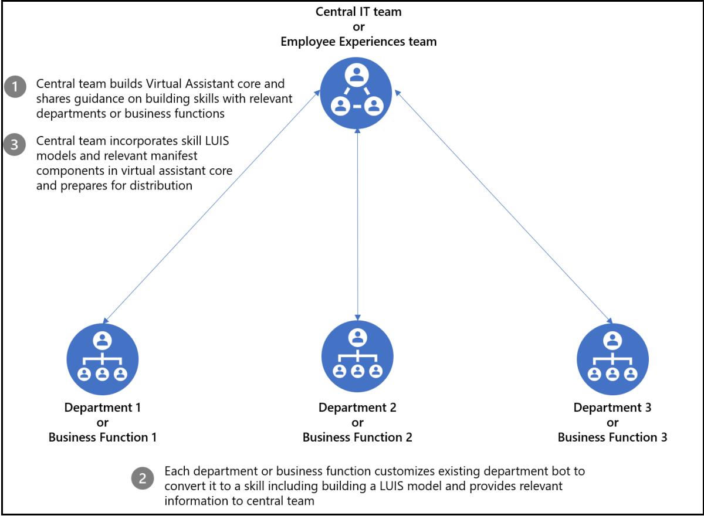

# <a name="create-virtual-assistant"></a>仮想アシスタントを作成する

仮想アシスタントは、ユーザー エクスペリエンス、組織のブランド化、および必要なデータを完全に制御しながら、堅牢な会話型ソリューションを作成できる Microsoft のオープンソース テンプレートです。 [仮想アシスタント コア テンプレート](https://microsoft.github.io/botframework-solutions/overview/virtual-assistant-template)は、[Bot Framework SDK](https://github.com/microsoft/botframework-sdk)、[Language Understanding (LUIS)](https://www.luis.ai/)、[QnA Maker](https://www.qnamaker.ai/) など、仮想アシスタントを構築するために必要な Microsoft テクノロジをまとめた基本的な構成要素です。 また、スキル登録、リンクされたアカウント、基本的な会話意図など、さまざまなシームレスな対話とエクスペリエンスをユーザーに提供するための重要な機能も組み合わせています。 さらに、テンプレート機能には、再利用可能な会話 [スキル](https://microsoft.github.io/botframework-solutions/overview/skills)の豊富な例が含まれています。  個々のスキルは、複数のシナリオを有効にするために、仮想アシスタント ソリューションに統合されています。 Bot Framework SDK を使用すると、ソース コード形式でスキルが表示され、必要に応じてカスタマイズおよび拡張できます。 Bot Framework のスキルの詳細については、「[Bot Framework スキルとは](https://microsoft.github.io/botframework-solutions/overview/skills/)」を参照してください。 このドキュメントでは、組織の実装に関する考慮事項仮想アシスタント、Teamsに重点を置いた仮想アシスタントを作成する方法、関連する例、コード サンプル、仮想アシスタントの制限事項について説明します。
次の図は、仮想アシスタントの概要を示しています。


テキスト メッセージ アクティビティは、[ディスパッチ](/azure/bot-service/bot-builder-tutorial-dispatch?view=azure-bot-service-4.0&tabs=cs&preserve-view=true) モデルを使用して、仮想アシスタント コアによって関連付けられたスキルにルーティングされます。

## <a name="implementation-considerations"></a>実装に関する考慮事項

仮想アシスタントを追加する決定には、多くの決定要因が含まれており、組織ごとに異なります。 組織の仮想アシスタント実装のサポート要因は次のとおりです:

* 中央チームは、すべての従業員エクスペリエンスを管理します。 新しいスキルの追加など、仮想アシスタント エクスペリエンスを構築し、コア エクスペリエンスの更新を管理する機能があります。
* 複数のアプリケーションがビジネス機能にまたがって存在し、その数は今後増加することが予想されます。
* 既存のアプリケーションはカスタマイズ可能であり、組織が所有し、仮想アシスタントのスキルに変換されます。
* 中央の従業員エクスペリエンス チームは、既存のアプリのカスタマイズに影響を与えることができます。 また、既存のアプリケーションを仮想アシスタントのエクスペリエンスのスキルとして統合するために必要なガイダンスも提供されます。

次の図は、仮想アシスタントのビジネス関数を示しています。



## <a name="create-a-teams-focused-virtual-assistant"></a>Teams にフォーカスを当てた仮想アシスタントを作成する

Microsoft は、仮想アシスタントとスキルを構築するための[Microsoft Visual Studio テンプレート](https://marketplace.visualstudio.com/items?itemName=BotBuilder.VirtualAssistantTemplate)を公開しました。 Visual Studio テンプレートを使用すると、アクションを含む限られたリッチ カードをサポートするテキスト ベースのエクスペリエンスを利用して、仮想アシスタントを作成できます。 Microsoft Teams プラットフォームの機能を含め、優れた Teams アプリのエクスペリエンスを強化するために、Visual Studio の基本テンプレートを強化しました。 いくつかの機能には、豊富なアダプティブ カード、タスク モジュール、チームまたはグループ チャット、メッセージ拡張機能のサポートが含まれます。 仮想アシスタントを Microsoft Teams に拡張する方法の詳細については、「[チュートリアル: 仮想アシスタントを Microsoft Teams に拡張する](https://microsoft.github.io/botframework-solutions/clients-and-channels/tutorials/enable-teams/1-intro/)」を参照してください。
次の図は、仮想アシスタント ソリューションの概要図を示しています。


### <a name="add-adaptive-cards-to-your-virtual-assistant"></a>仮想アシスタントにアダプティブ カードを追加する

要求を適切にディスパッチするには、仮想アシスタントが適切な LUIS モデルとそれに関連付けられている対応するスキルを識別する必要があります。 ただし、スキルに関連付けられている LUIS モデルはカード アクション テキスト用にトレーニングされるため、カード アクション アクティビティにはディスパッチ メカニズムを使用できません。 カード アクション テキストは固定で定義済みのキーワードであり、ユーザーからコメントされません。

この欠点は、カード アクション ペイロードにスキル情報を埋め込むことによって解決されます。 すべてのスキルは、カード アクションの `value` フィールドに `skillId` を埋め込む必要があります。 各カード アクション アクティビティが関連するスキル情報を保持し、仮想アシスタントこの情報をディスパッチに利用できることを確認する必要があります。

スキル情報が常にカード アクションに存在することを確認するには、コンストラクターで `skillId` を指定する必要があります。
カード アクション データのサンプル コードは、次のセクションに示されています:

```csharp
    public class CardActionData
    {
        public CardActionData(string skillId)
        {
            this.SkillId = skillId;
        }

        [JsonProperty("skillId")]
        public string SkillId { get; set; }
    }

    ...
    var button = new CardAction
    {
        Type = ActionTypes.MessageBack,
        Title = "Card action button",
        Text = "card action button text",
        Value = new CardActionData(<SkillId>),
    };
```

次に、仮想アシスタント テンプレートの `SkillCardActionData` クラスが導入され、カード アクション ペイロードから `skillId` が抽出されます。
カード アクション ペイロードから `skillId` を抽出するコード スニペットを次のセクションに示します:

```csharp
    // Skill Card action data should contain skillId parameter
    // This class is used to deserialize it and get skillId 
    public class SkillCardActionData
    {
        /// <summary>
        /// Gets the ID of the skil that should handle this card
        /// </summary>
        [JsonProperty("skillId")]
        public string SkillId { get; set; }
    }
```

実装は、 [Activity](https://github.com/microsoft/botframework-sdk/blob/master/specs/botframework-activity/botframework-activity.md) クラスの拡張メソッドによって行われます。
カード アクション データから `skillId` を抽出するコード スニペットを次のセクションに示します:

```csharp
    public static class ActivityExtensions
    {
        // Fetches skillId from CardAction data if present
        public static string GetSkillId(this Activity activity)
        {
            string skillId = string.Empty;

            try
            {
                if (activity.Type.Equals(ActivityTypes.Message) && activity.Value != null)
                {
                    var data = JsonConvert.DeserializeObject<SkillCardActionData>(activity.Value.ToString());
                    skillId = data.SkillId;
                }
                else if (activity.Type.Equals(ActivityTypes.Invoke) && activity.Value != null)
                {
                    var data = JsonConvert.DeserializeObject<SkillCardActionData>(JObject.Parse(activity.Value.ToString()).SelectToken("data").ToString());
                    skillId = data.SkillId;
                }
            }
            catch
            {
                // If not able to retrive skillId, empty skillId should be returned
            }

            return skillId;
        }
    }
```

### <a name="handle-interruptions"></a>中断を処理する

仮想アシスタントは、ユーザーが別のスキルが現在アクティブな間にスキルを呼び出そうとした場合に、中断を処理できます。 `TeamsSkillDialog` と `TeamsSwitchSkillDialog` が、Bot Framework の [SkillDialog](https://github.com/microsoft/botframework-solutions/blob/5b46d73e220bbb4fba86c48be532e495535ca78a/sdk/csharp/libraries/microsoft.bot.solutions/Skills/SkillDialog.cs) と [SwitchSkillDialog](https://github.com/microsoft/botframework-solutions/blob/6d40fa8ae05f96b0c5e0464e01361a9e1deb696c/sdk/csharp/libraries/microsoft.bot.solutions/Skills/Dialogs/SwitchSkillDialog.cs) に基づいて導入されます。 これにより、ユーザーはカード アクションからスキル エクスペリエンスを切り替えることができます。 この要求を処理するために、仮想アシスタントは、スキルを切り替える確認メッセージをユーザーに求めます:


### <a name="handle-task-module-requests"></a>タスク モジュール要求を処理する

タスク モジュール機能を仮想アシスタントに追加するには、仮想アシスタント アクティビティ ハンドラーに 2 つの追加メソッドが含まれています: `OnTeamsTaskModuleFetchAsync` と `OnTeamsTaskModuleSubmitAsync`。 これらのメソッドは、仮想アシスタントからタスク モジュール関連のアクティビティをリッスンし、要求に関連付けられているスキルを特定し、特定されたスキルに要求を転送します。

要求の転送は [SkillHttpClient](/dotnet/api/microsoft.bot.builder.integration.aspnet.core.skills.skillhttpclient?view=botbuilder-dotnet-stable&preserve-view=true)、`PostActivityAsync` メソッドを使用して行われます。 `InvokeResponse` として応答が返されます。この応答は解析され、`TaskModuleResponse` に変換されます。

```csharp
    public static TaskModuleResponse GetTaskModuleRespose(this InvokeResponse invokeResponse)
    {
        if (invokeResponse.Body != null)
        {
            return new TaskModuleResponse()
            {
                Task = GetTask(invokeResponse.Body),
            };
        }

        return null;
    }

    private static TaskModuleResponseBase GetTask(object invokeResponseBody)
        {
            JObject resposeBody = (JObject)JToken.FromObject(invokeResponseBody);
            var task = resposeBody.GetValue("task");
            var taskType = task.SelectToken("type").ToString();

            return taskType switch
            {
                "continue" => new TaskModuleContinueResponse()
                {
                    Type = taskType,
                    Value = task.SelectToken("value").ToObject<TaskModuleTaskInfo>(),
                },
                "message" => new TaskModuleMessageResponse()
                {
                    Type = taskType,
                    Value = task.SelectToken("value").ToString(),
                },
                _ => null,
            };
        }
```

同様の方法で、カード アクションのディスパッチとタスク モジュールの応答が行われます。 タスク モジュールのフェッチと送信アクション データが更新され、`skillId` が含まれます。
アクティビティ拡張メソッド `GetSkillId` は、呼び出す必要があるスキルに関する詳細を提供する `skillId` をペイロードから抽出します。

次のセクションでは、コード スニペット `OnTeamsTaskModuleFetchAsync` と `OnTeamsTaskModuleSubmitAsync` メソッドについて説明します:

```csharp
    // Invoked when a "task/fetch" event is received to invoke task module.
    protected override async Task<TaskModuleResponse> OnTeamsTaskModuleFetchAsync(ITurnContext<IInvokeActivity> turnContext, TaskModuleRequest taskModuleRequest, CancellationToken cancellationToken)
    {
        try
        {
            string skillId = (turnContext.Activity as Activity).GetSkillId();
            var skill = _skillsConfig.Skills.Where(s => s.Value.AppId == skillId).First().Value;

            // Forward request to correct skill
            var invokeResponse = await _skillHttpClient.PostActivityAsync(this._appId, skill, _skillsConfig.SkillHostEndpoint, turnContext.Activity as Activity, cancellationToken);

            return invokeResponse.GetTaskModuleResponse();
        }
        catch (Exception exception)
        {
            await turnContext.SendActivityAsync(_templateEngine.GenerateActivityForLocale("ErrorMessage"));
            _telemetryClient.TrackException(exception);

            return null;
        }
    }

    // Invoked when a 'task/submit' invoke activity is received for task module submit actions.
    protected override async Task<TaskModuleResponse> OnTeamsTaskModuleSubmitAsync(ITurnContext<IInvokeActivity> turnContext, TaskModuleRequest taskModuleRequest, CancellationToken cancellationToken)
    {
        try
        {
            string skillId = (turnContext.Activity as Activity).GetSkillId();
            var skill = _skillsConfig.Skills.Where(s => s.Value.AppId == skillId).First().Value;

            // Forward request to correct skill
            var invokeResponse = await _skillHttpClient.PostActivityAsync(this._appId, skill, _skillsConfig.SkillHostEndpoint, turnContext.Activity as Activity, cancellationToken).ConfigureAwait(false);

            return invokeResponse.GetTaskModuleRespose();
        }
        catch (Exception exception)
        {
            await turnContext.SendActivityAsync(_templateEngine.GenerateActivityForLocale("ErrorMessage"));
            _telemetryClient.TrackException(exception);

            return null;
        }
    }
```

さらに、スキルを介して呼び出されたタスク モジュールが適切にレンダリングされるように、仮想アシスタントのマニフェスト ファイルの `validDomains` セクションにすべてのスキル ドメインを含める必要があります。

### <a name="handle-collaborative-app-scopes"></a>コラボレーション アプリのスコープを処理する

Teams アプリは、1 対 1 のチャット、グループ チャット、チャネルを含む複数のスコープに存在できます。 コア仮想アシスタント テンプレートは、1 対 1 のチャット用に設計されています。 オンボード エクスペリエンスの一環として、仮想アシスタントはユーザーに名前の入力を求め、ユーザーの状態を維持します。 オンボーディング エクスペリエンスはグループ チャットやチャネル スコープには適していないため、削除されました。

スキルは、1:1 チャット、グループ チャット、チャネル会話など、複数のスコープのアクティビティを処理する必要があります。 これらのスコープのいずれかがサポートされていない場合、スキルは適切なメッセージで応答する必要があります。

次の処理関数が仮想アシスタント コアに追加されました。

* 仮想アシスタントは、グループ チャットまたはチャネルからのテキスト メッセージなしで呼び出すことができます。
* アーティキュレーションは、ディスパッチ モジュールにメッセージを送信する前にクリーニングされます。 たとえば、ボットの必要な @mention を削除します。

```csharp
    if (innerDc.Context.Activity.Conversation?.IsGroup == true)
    {
        // Remove bot atmentions for teams/groupchat scope
        innerDc.Context.Activity.RemoveRecipientMention();

        // If bot is invoked without any text, reply with FirstPromptMessage
        if (string.IsNullOrWhiteSpace(innerDc.Context.Activity.Text))
        {
            await innerDc.Context.SendActivityAsync(_templateEngine.GenerateActivityForLocale("FirstPromptMessage"));
            return EndOfTurn;
        }
    }
```

### <a name="handle-message-extensions"></a>メッセージ拡張機能の処理

メッセージ拡張機能のコマンドは、アプリ マニフェスト ファイルで宣言されます。 メッセージ拡張機能のユーザー インターフェイスには、これらのコマンドが使用されます。 仮想アシスタントが添付スキルとしてメッセージ拡張コマンドを実行するには、仮想アシスタント独自のマニフェストにこれらのコマンドを含める必要があります。 個々のスキルのマニフェストから仮想アシスタントのマニフェストにコマンドを追加する必要があります。 コマンド ID は、区切り記号を使用してスキルのアプリ ID を追加することで、関連するスキルに関する情報を提供します `:`。

スキルのマニフェスト ファイルのスニペットは、次のセクションに示されています:

```json
 "composeExtensions": [
    {
        "botId": "<Skil_App_Id>",
        "commands": [
            {
                "id": "searchQuery",
                "context": [ "compose", "commandBox" ],
                "description": "Test command to run query",
                 ....}
         ]
     }
 ]
                 
```

対応する仮想アシスタント マニフェスト ファイルのコード スニペットは、次のセクションに示されています:

```json
 "composeExtensions": [
    {
        "botId": "<VA_App_Id>",
        "commands": [
            {
                "id": "searchQuery:<skill_id>",
                "context": [ "compose", "commandBox" ],
                "description": "Test command to run query",
                 ....}
         ]
     }
 ]
 
```

コマンドがユーザーによって呼び出されると、仮想アシスタントは、コマンド ID を解析して関連するスキルを識別し、追加のサフィックス `:<skill_id>` をコマンド ID から削除してアクティビティを更新し、対応するスキルに転送できます。 スキルのコードでは、追加のサフィックスを処理する必要はありません。 そのため、スキル間でのコマンド ID 間の競合は回避されます。 この方法では、**作成**、**commandBox**、**メッセージ** など、すべてのコンテキスト内のスキルのすべての検索コマンドとアクション コマンドに、仮想アシスタントが使用されます。

```csharp
    const string MessagingExtensionCommandIdSeparator = ":";

    // Invoked when a 'composeExtension/submitAction' invoke activity is received for a messaging extension action command
    protected override async Task<MessagingExtensionActionResponse> OnTeamsMessagingExtensionSubmitActionAsync(ITurnContext<IInvokeActivity> turnContext, MessagingExtensionAction action, CancellationToken cancellationToken)
    {
        return await ForwardMessagingExtensionActionCommandActivityToSkill(turnContext, action, cancellationToken);
    }

    // Forwards invoke activity to right skill for messaging extension action commands.
    private async Task<MessagingExtensionActionResponse> ForwardMessagingExtensionActionCommandActivityToSkill(ITurnContext<IInvokeActivity> turnContext, MessagingExtensionAction action, CancellationToken cancellationToken)
    {
        var skillId = ExtractSkillIdFromMessagingExtensionActionCommand(turnContext, action);
        var skill = _skillsConfig.Skills.Where(s => s.Value.AppId == skillId).First().Value;
        var invokeResponse = await _skillHttpClient.PostActivityAsync(this._appId, skill, _skillsConfig.SkillHostEndpoint, turnContext.Activity as Activity, cancellationToken).ConfigureAwait(false);

        return invokeResponse.GetMessagingExtensionActionResponse();
    }

    // Extracts skill Id from messaging extension command and updates activity value
    private string ExtractSkillIdFromMessagingExtensionActionCommand(ITurnContext<IInvokeActivity> turnContext, MessagingExtensionAction action)
    {
        var commandArray = action.CommandId.Split(MessagingExtensionCommandIdSeparator);
        var skillId = commandArray.Last();

        // Update activity value by removing skill id before forwarding to the skill.
        var activityValue = JsonConvert.DeserializeObject<MessagingExtensionAction>(turnContext.Activity.Value.ToString());
        activityValue.CommandId = string.Join(MessagingExtensionCommandIdSeparator, commandArray, 0 commandArray.Length - 1);
        turnContext.Activity.Value = activityValue;

        return skillId;
    }
```

一部のメッセージ拡張アクティビティには、コマンド ID が含まれていません。 たとえば、 `composeExtension/selectItem` には、タップの呼び出しアクションの値のみが含まれています。 関連するスキルを識別するために、`skillId` は、`OnTeamsMessagingExtensionQueryAsync` の応答を形成している間に各項目カードに添付されます。 これは、[アダプティブ カードを仮想アシスタントに追加する方法](#add-adaptive-cards-to-your-virtual-assistant)と似ています。

```csharp
    // Invoked when a 'composeExtension/selectItem' invoke activity is received for compose extension query command.
    protected override async Task<MessagingExtensionResponse> OnTeamsMessagingExtensionSelectItemAsync(ITurnContext<IInvokeActivity> turnContext, JObject query, CancellationToken cancellationToken)
    {
        var data = JsonConvert.DeserializeObject<SkillCardActionData>(query.ToString());
        var skill = _skillsConfig.Skills.Where(s => s.Value.AppId == data.SkillId).First().Value;
        var invokeResponse = await _skillHttpClient.PostActivityAsync(this._appId, skill, _skillsConfig.SkillHostEndpoint, turnContext.Activity as Activity, cancellationToken).ConfigureAwait(false);

        return invokeResponse.GetMessagingExtensionResponse();
    }
```

---

## <a name="example"></a>例

次の例は、Book-a-room アプリ テンプレートをVirtual Assistantスキルに変換する方法を示しています。Book-a-room は、ユーザーが現在の時刻から 30 分、60 分、または 90 分間会議室をすばやく見つけて予約できるTeamsです。 既定は 30 分間です。 会議室予約ボットは、個人の会話または一対一の会話を対象としています。
次の図は、 **book a room** スキルを持つ仮想アシスタントを示しています。


仮想アシスタントにアタッチされているスキルに変換するために導入された差分変更を次に示します。 同様のガイドラインに従って、既存の v4 ボットをスキルに変換します。

### <a name="skill-manifest"></a>スキル マニフェスト

スキル マニフェストは、スキルのメッセージング エンドポイント、ID、名前、およびその他の関連メタデータを公開する JSON ファイルです。 このマニフェストは、Teamsでアプリをサイドロードするために使用されるマニフェストとは異なります。 仮想アシスタントでは、スキルをアタッチするための入力としてこのファイルへのパスが必要です。 ボットの wwwroot フォルダーに次のマニフェストを追加しました。

```bash
botskills connect --remoteManifest "<url to skill's manifest>" ..
```

```json
{
  "$schema": "https://schemas.botframework.com/schemas/skills/skill-manifest-2.1.preview-0.json",
  "$id": "microsoft_teams_apps_bookaroom",
  "name": "microsoft-teams-apps-bookaroom",
  "description": "microsoft-teams-apps-bookaroom description",
  "publisherName": "Your Company",
  "version": "1.1",
  "iconUrl": "<icon url>",
  "copyright": "Copyright (c) Microsoft Corporation. All rights reserved.",
  "license": "",
  "privacyUrl": "<privacy url>",
  "endpoints": [
    {
      "name": "production",
      "protocol": "BotFrameworkV3",
      "description": "Production endpoint for the skill",
      "endpointUrl": "<endpoint url>",
      "msAppId": "skill app id"
    }
  ],
  "dispatchModels": {
    "languages": {
      "en-us": [
        {
          "id": "microsoft-teams-apps-bookaroom-en",
          "name": "microsoft-teams-apps-bookaroom LU (English)",
          "contentType": "application/lu",
          "url": "file://book-a-meeting.lu",
          "description": "English language model for the skill"
        }
      ]
    }
  },
  "activities": {
    "message": {
      "type": "message",
      "description": "Receives the users utterance and attempts to resolve it using the skill's LU models"
    }
  }
}
```

### <a name="luis-integration"></a>LUIS 統合

仮想アシスタントのディスパッチ モデルは、アタッチされたスキルの LUIS モデルの上に構築されます。 ディスパッチ モデルは、すべてのテキスト アクティビティの意図を識別し、それに関連付けられているスキルを見つけます。

仮想アシスタントでは、スキルをアタッチするときに、入力として `.lu` 形式のスキルの LUIS モデルが必要です。 LUIS json は botframework-cli ツールを使用して `.lu` 形式に変換されます。

```json
botskills connect --remoteManifest "<url to skill's manifest>" --luisFolder "<path to the folder containing your Skill's .lu files>" --languages "en-us" --cs
```

```bash
npm i -g @microsoft/botframework-cli
bf luis:convert --in <pathToLUIS.json> --out <pathToLuFile>
```

Book-a-room ボットには、ユーザー用に主に 2 つのコマンドがあります:

* `Book room`
* `Manage Favorites`

これら 2 つのコマンドを解釈して、LUIS モデルを構築しました。 対応するシークレットは `cognitivemodels.json` に設定する必要があります。 対応する LUIS JSON ファイルは [こちら](https://github.com/OfficeDev/microsoft-teams-apps-bookaroom/blob/nebhagat/microsoft-teams-apps-bookaroom-skill/Deployment/Resources/LU/en-us/book-a-meeting.json)にあります。
対応する `.lu` ファイルは、次のセクションに示されています:

```
> ! Automatically generated by [LUDown CLI](https://github.com/Microsoft/botbuilder-tools/tree/master/Ludown), Tue Mar 31 2020 17:30:32 GMT+0530 (India Standard Time)

> ! Source LUIS JSON file: book-a-meeting.json

> ! Source QnA TSV file: Not Specified

> ! Source QnA Alterations file: Not Specified


> # Intent definitions

## BOOK ROOM
- book a room
- book room
- please book a room
- reserve a room
- i want to book a room
- i want to book a room please
- get me a room please
- get me a room


## MANAGE FAVORITES
- manage favorites
- manage favorite
- please manage my favorite rooms
- manage my favorite rooms please
- manage my favorite rooms
- i want to manage my favorite rooms

## None


> # Entity definitions


> # PREBUILT Entity definitions


> # Phrase list definitions


> # List entities

> # RegEx entities
```

この方法では、`book room` または `manage favorites` に関連する、ユーザーが仮想アシスタントに出したコマンドはすべて、`Book-a-room` ボットに関連付けられたコマンドとして識別され、このスキルに転送されます。
一方、コマンドが完全に入力されていない場合、`Book-a-room room` ボットは LUIS モデルを使用して、これらのコマンドを解釈する必要があります。 例: `I want to manage my favorite rooms`。

### <a name="multi-language-support"></a>多言語サポート

例として、英語のカルチャのみを持つ LUIS モデルが作成されます。 他の言語に対応する LUIS モデルを作成し、`cognitivemodels.json`にエントリを追加できます。

```json
{
  "defaultLocale": "en-us",
  "languageModels": {
    "en-us": {
      "luisAppId": "",
      "luisApiKey": "",
      "luisApiHost": ""
    },
    "<your_language_culture>": {
      "luisAppId": "",
      "luisApiKey": "",
      "luisApiHost": ""
    }
  }
}
```

並列で、luisFolder パスに対応する `.lu` ファイルを追加します。 フォルダー構造は次のようになります:

```bash
| - luisFolder

        | - en-us

                | - book-a-meeting.lu

        | - your_language_culture

                | - book-a-meeting.lu
```

`languages` パラメーターを変更するには、次のように botskills コマンドを更新します:

```json
botskills connect --remoteManifest "<url to skill's manifest>" --luisFolder "<path to luisFolder>" --languages "en-us, your_language_culture" --cs
```

仮想アシスタントでは、`SetLocaleMiddleware` を使用して現在のロケールを識別し、対応するディスパッチ モデルを呼び出します。 ボット フレームワーク アクティビティには、ローケール フィールドがあり、ミドルウェアがこれを使用します。 スキルにも同じものを使用できます。 Book-a-room ボットはこのミドルウェアを使用せず、代わりに Bot Framework アクティビティの [clientInfo エンティティ](https://github.com/microsoft/botframework-sdk/blob/master/specs/botframework-activity/botframework-activity.md#clientinfo)からロケールを取得します。

### <a name="claim-validation"></a>要求の検証

呼び出し元をスキルに制限するために [claimsValidator](https://github.com/nebhagat/msteams-virtual-assistant-dotnet/blob/master/msteams-virtual-assistant-dotnet/Authentication/AllowedCallersClaimsValidator.cs) を追加しました。 仮想アシスタントがこのスキルを呼び出せるようにするには、`appsettings` の `AllowedCallers` 配列にその仮想アシスタントのアプリ ID を設定します。

```
"AllowedCallers": [ "<caller_VA1_appId>", "<caller_VA2_appId>" ],
```

許可された呼び出し元配列は、スキル コンシューマーがアクセスできるスキルを制限できます。 この配列に 1 つのエントリ `*` を追加して、任意のスキル コンシューマーからの呼び出しを受け入れます。

```
"AllowedCallers": [ "*" ],
```

スキルに要求の検証を追加する方法の詳細については、「[スキルに要求の検証を追加する](/azure/bot-service/skill-implement-skill?view=azure-bot-service-4.0&tabs=cs#claims-validator&preserve-view=true)」を参照してください。

### <a name="limitation-of-card-refresh"></a>カードの更新の制限

仮想アシスタント ([github の問題](https://github.com/microsoft/botbuilder-dotnet/issues/3686)) を介したカードの更新などのアクティビティの更新は、はまだサポートされていません。 そのため、すべてのカード更新の呼び出しを`UpdateActivityAsync`新しいカードの呼び出しのポスティング`SendActivityAsync`に置き換えました。

### <a name="card-actions-and-task-module-flows"></a>カード アクションとタスク モジュール フロー

カード アクションまたはタスク モジュールアクティビティを関連するスキルに転送するには、スキルに `skillId` を埋め込む必要があります。
`Book-a-room` ボット カードアクション、タスク モジュールのフェッチと送信アクションのペイロードは、パラメーターとして `skillId` を含むように変更されます。

詳細については、このドキュメントの [この](/microsoftteams/platform/samples/virtual-assistant#add-adaptive-cards-to-your-virtual-assistant) セクションを参照してください。

### <a name="handle-activities-from-group-chat-or-channel-scope"></a>グループ チャットまたはチャネル スコープからのアクティビティを処理する

`Book-a-room bot` は、個人用または 1:1 のスコープのみなど、プライベート チャット用に設計されています。 グループ チャットとチャネル スコープをサポートするように仮想アシスタントをカスタマイズしたので、チャネル スコープから仮想アシスタントを呼び出す必要があるため、`Book-a-room` ボットは同じスコープのアクティビティを取得する必要があります。 そのため、`Book-a-room` ボットは、これらのアクティビティを処理するようにカスタマイズされます。 `Book-a-room` ボット アクティビティ ハンドラーの `OnMessageActivityAsync` にチェックインするメソッドが見つかります。

```csharp
    protected override async Task OnMessageActivityAsync(ITurnContext<IMessageActivity> turnContext, CancellationToken cancellationToken)
    {
        // Check if activities are from groupchat/ teams scope. This might happen when the bot is consumed by Virtual Assistant.
        if (turnContext.Activity.Conversation.IsGroup == true)
        {
            await ShowNotSupportedInGroupChatCardAsync(turnContext).ConfigureAwait(false);
        }
        else
        {
            ...
        }
    }
```

[Bot Framework Solutions リポジトリ](https://github.com/microsoft/botframework-components/tree/main/skills/csharp)から既存のスキルを活用したり、新しいスキルをゼロから作成したりすることもできます。 新しいスキルを作成する方法については、「[新しいスキルを作成するためのチュートリアル](https://microsoft.github.io/botframework-solutions/overview/skills/)」を参照してください。 仮想アシスタントおよびスキル アーキテクチャのドキュメントについては、「[仮想アシスタントとスキル アーキテクチャ](/azure/bot-service/skills-conceptual?view=azure-bot-service-4.0&preserve-view=true)」を参照してください。  

## <a name="limitations-of-virtual-assistant"></a>仮想アシスタントの制限事項

* **EndOfConversation**: スキルは、会話が完了したときに `endOfConversation` アクティビティを送信する必要があります。 アクティビティに基づいて、仮想アシスタントはその特定のスキルでコンテキストを終了し、仮想アシスタントのルート コンテキストに戻ります。 Book-a-room ボットの場合、会話が終了したという明確な状態はありません。 そのため、`endOfConversation` ボットから `Book-a-room` が送信されておらず、ユーザーがルート コンテキストに戻りたい場合は、`start over` コマンドで簡単に行うことができます。  
* **カードの更新**: 仮想アシスタントでは、カードの更新はまだサポートされていません。  
* **メッセージの拡張機能**:
  * 現在、仮想アシスタントでは、メッセージ拡張機能に対して最大 10 個のコマンドをサポートできます。
  * メッセージ拡張機能の構成は、個々のコマンドではなく、拡張機能自体全体に対してスコープが設定されます。 これにより、仮想アシスタントを通じて個々のスキルの構成が制限されます。
  * メッセージ拡張コマンド ID の最大長は [64 文字](../resources/schema/manifest-schema.md#composeextensions) で、スキル情報の埋め込みには 37 文字が使用されます。 したがって、コマンド ID の更新された制約は 27 文字に制限されます。

[Bot Framework Solutions リポジトリ](https://github.com/microsoft/botframework-components/tree/main/skills/csharp)から既存のスキルを活用したり、新しいスキルをゼロから作成したりすることもできます。 後者のチュートリアルについては、[こちら](https://microsoft.github.io/botframework-solutions/overview/skills/)を参照してください。 仮想アシスタントとスキルのアーキテクチャについては[ドキュメント](/azure/bot-service/skills-conceptual?view=azure-bot-service-4.0&preserve-view=true)を参照してください。

## <a name="code-sample"></a>コード サンプル

| **サンプルの名前** | **説明** | **C#**  **.NET** |
|----------|-----------------|---------------------------|
| Visual Studio テンプレートを更新しました | Teams 機能をサポートするためにテンプレートをカスタマイズしました。 | [表示](https://github.com/OfficeDev/Microsoft-Teams-Samples/tree/main/samples/app-virtual-assistant/csharp) |
| Book-a-room ボットのスキル コード | 外出先で会議室をすばやく見つけて予約できます。 | [表示](https://github.com/OfficeDev/microsoft-teams-apps-bookaroom/tree/nebhagat/microsoft-teams-apps-bookaroom-skill) |

## <a name="see-also"></a>関連項目

* [Web アプリを統合する](~/samples/integrate-web-apps-overview.md)
* [会議室予約](app-templates.md#app-template-code-samples)
* [Microsoft Teams ボット。](../bots/what-are-bots.md)
