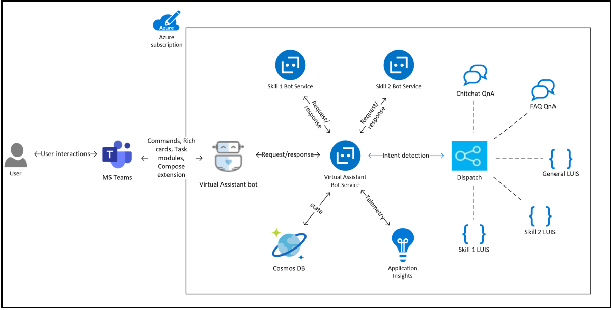

# <a name="create-virtual-assistant"></a>仮想アシスタントを作成する 

Virtual Assistant は、ユーザー エクスペリエンス、組織のブランド化、および必要なデータを完全に制御しながら、堅牢な会話ソリューションを作成できる Microsoft オープンソース テンプレートです。 [バーチャル アシスタント コア テンプレート](https://microsoft.github.io/botframework-solutions/overview/virtual-assistant-template)は、[仮想](https://github.com/microsoft/botframework-sdk)アシスタントを構築するために必要なマイクロソフトのテクノロジをまとめて使用する基本的な構成要素[です。](https://www.qnamaker.ai/) [](https://www.luis.ai/) また、スキル登録、リンクされたアカウント、基本的な会話の意図など、ユーザーにシームレスなインタラクションやエクスペリエンスの範囲を提供する必要不可欠な機能を一緒に提供します。 また、テンプレート機能には、再利用可能な会話スキルの豊富な例が含 [まれています](https://microsoft.github.io/botframework-solutions/overview/skills)。  個々のスキルは、仮想アシスタントソリューションに統合され、複数のシナリオを可能にします。 Bot Framework SDK を使用すると、スキルがソース コード形式で表示され、必要に応じてカスタマイズおよび拡張できます。 Bot Framework のスキルの詳細については、「 [Bot Framework スキルとは 」](https://microsoft.github.io/botframework-solutions/overview/skills/)を参照してください。 このドキュメントでは、組織の仮想アシスタントの実装に関する考慮事項、Teamsに焦点を当てた仮想アシスタントの作成方法、関連する例、コード サンプル、および Virtual Assistant の制限事項について説明します。
次の図は、仮想アシスタントの概要を示しています。


テキストメッセージアクティビティは、 [ディスパッチ](/azure/bot-service/bot-builder-tutorial-dispatch?view=azure-bot-service-4.0&tabs=cs&preserve-view=true) モデルを使用して仮想アシスタントコアによって関連するスキルにルーティングされます。 

## <a name="implementation-considerations"></a>実装に関する考慮事項

バーチャル アシスタントの追加決定には、多くの決定要因が含まれ、組織ごとに異なります。 組織の仮想アシスタント実装のサポート要因は次のとおりです。

* 中央のチームは、すべての従業員の経験を管理します。 バーチャル アシスタント エクスペリエンスを構築し、新しいスキルの追加を含むコア エクスペリエンスの更新を管理する機能があります。
* ビジネス機能間で複数のアプリケーションが存在し、その数は今後増加することが予想されます。
* 既存のアプリケーションは、カスタマイズ可能で、組織が所有し、バーチャルアシスタントのスキルに変換されます。
* 中央の従業員エクスペリエンス チームは、既存のアプリのカスタマイズに影響を与えます。 また、既存のアプリケーションをバーチャル アシスタント エクスペリエンスのスキルとして統合するために必要なガイダンスも提供します。

次の図は、バーチャルアシスタントのビジネス機能を示しています。 


## <a name="create-a-teams-focused-virtual-assistant"></a>Teamsに焦点を当てたバーチャル アシスタントを作成する

マイクロソフトは、バーチャル アシスタントとスキルを構築するための[Visual Studio テンプレート](https://marketplace.visualstudio.com/items?itemName=BotBuilder.VirtualAssistantTemplate)を公開しました。 Visual Studioテンプレートを使用すると、アクションを持つ限られたリッチカードをサポートするテキストベースのエクスペリエンスを備えたバーチャルアシスタントを作成できます。 Visual Studioベーステンプレートを拡張して、Microsoft Teamsプラットフォーム機能と優れたTeamsアプリエクスペリエンスを含めています。 機能の中には、豊富なアダプティブ カード、タスク モジュール、チームまたはグループ チャット、メッセージング拡張機能のサポートなどがあります。 バーチャル アシスタントをMicrosoft Teamsに拡張する方法の詳細については、「[チュートリアル: バーチャル アシスタントをMicrosoft Teamsに拡張する](https://microsoft.github.io/botframework-solutions/clients-and-channels/tutorials/enable-teams/1-intro/)」を参照してください。    
次の図は、仮想アシスタント ソリューションの高レベルの図を示しています。



### <a name="add-adaptive-cards-to-your-virtual-assistant"></a>バーチャル アシスタントにアダプティブ カードを追加する

要求を適切にディスパッチするには、仮想アシスタントが正しい LUIS モデルとそれに関連付けられた対応するスキルを識別する必要があります。 ただし、スキルに関連付けられた LUIS モデルはカード アクション テキストのトレーニングを受けているため、ディスパッチメカニズムをカード アクション アクティビティに使用することはできません。 カードアクションテキストは固定された定義済みキーワードであり、ユーザーからのコメントはされません。

この欠点は、スキル情報をカードアクションペイロードに埋め込むことによって解決されます。 すべてのスキルは `skillId`  `value` 、カードアクションのフィールドに埋め込む必要があります。 各カードアクションアクティビティに関連するスキル情報が含まれ、バーチャルアシスタントがこの情報をディスパッチに利用できることを確認する必要があります。

`skillId`スキル情報がカードアクションに常に存在するように、コンストラクタで指定する必要があります。
カード アクション データのサンプル コードは、次のセクションに示します。
```csharp
    public class CardActionData
    {
        public CardActionData(string skillId)
        {
            this.SkillId = skillId;
        }

        [JsonProperty("skillId")]
        public string SkillId { get; set; }
    }

    ...
    var button = new CardAction
    {
        Type = ActionTypes.MessageBack,
        Title = "Card action button",
        Text = "card action button text",
        Value = new CardActionData(<SkillId>),
    };
```

次 `SkillCardActionData` に、バーチャル アシスタント テンプレートのクラスを導入して `skillId` 、カード アクション ペイロードから抽出します。
カード アクション ペイロードから抽出するコード スニペット  `skillId` を次のセクションに示します。

```csharp
    // Skill Card action data should contain skillId parameter
    // This class is used to deserialize it and get skillId 
    public class SkillCardActionData
    {
        /// <summary>
        /// Gets the ID of the skil that should handle this card
        /// </summary>
        [JsonProperty("skillId")]
        public string SkillId { get; set; }
    }
```

実装は [、Activity](https://github.com/microsoft/botframework-sdk/blob/master/specs/botframework-activity/botframework-activity.md) クラスの拡張メソッドによって行われます。
カード アクション データから抽出するコード スニペット  `skillId` を次のセクションに示します。

```csharp
    public static class ActivityExtensions
    {
        // Fetches skillId from CardAction data if present
        public static string GetSkillId(this Activity activity)
        {
            string skillId = string.Empty;

            try
            {
                if (activity.Type.Equals(ActivityTypes.Message) && activity.Value != null)
                {
                    var data = JsonConvert.DeserializeObject<SkillCardActionData>(activity.Value.ToString());
                    skillId = data.SkillId;
                }
                else if (activity.Type.Equals(ActivityTypes.Invoke) && activity.Value != null)
                {
                    var data = JsonConvert.DeserializeObject<SkillCardActionData>(JObject.Parse(activity.Value.ToString()).SelectToken("data").ToString());
                    skillId = data.SkillId;
                }
            }
            catch
            {
                // If not able to retrive skillId, empty skillId should be returned
            }

            return skillId;
        }
    }
```

### <a name="handle-interruptions"></a>中断の処理

バーチャルアシスタントは、別のスキルが現在アクティブな状態でユーザがスキルを呼び出そうとする場合の中断を処理できます。 `TeamsSkillDialog`を使用し、 `TeamsSwitchSkillDialog` ボット フレームワークのスキル[ダイアログ と](https://github.com/microsoft/botframework-solutions/blob/5b46d73e220bbb4fba86c48be532e495535ca78a/sdk/csharp/libraries/microsoft.bot.solutions/Skills/SkillDialog.cs)[スイッチスキル ダイアログ に](https://github.com/microsoft/botframework-solutions/blob/6d40fa8ae05f96b0c5e0464e01361a9e1deb696c/sdk/csharp/libraries/microsoft.bot.solutions/Skills/Dialogs/SwitchSkillDialog.cs)基づいて導入されます。 ユーザーは、スキルの経験をカードアクションから切り替えることができます。 この要求を処理するために、バーチャル アシスタントは、スキルを切り替える確認メッセージをユーザーに求めます。


### <a name="handle-task-module-requests"></a>タスク モジュール要求の処理

仮想アシスタントにタスク モジュール機能を追加するには、仮想アシスタント アクティビティ ハンドラに 2 つのメソッド `OnTeamsTaskModuleFetchAsync` が追加されています `OnTeamsTaskModuleSubmitAsync` 。 これらのメソッドは、仮想アシスタントからタスクモジュール関連のアクティビティをリッスンし、要求に関連付けられたスキルを識別し、指定されたスキルに要求を転送します。 

要求の転送は [、skillHttp クライアント](/dotnet/api/microsoft.bot.builder.integration.aspnet.core.skills.skillhttpclient?view=botbuilder-dotnet-stable&preserve-view=true)メソッドを使用して行 `PostActivityAsync` われます。 `InvokeResponse`解析されて に変換された応答が返されます `TaskModuleResponse` 。


```csharp
    public static TaskModuleResponse GetTaskModuleRespose(this InvokeResponse invokeResponse)
    {
        if (invokeResponse.Body != null)
        {
            return new TaskModuleResponse()
            {
                Task = GetTask(invokeResponse.Body),
            };
        }

        return null;
    }

    private static TaskModuleResponseBase GetTask(object invokeResponseBody)
        {
            JObject resposeBody = (JObject)JToken.FromObject(invokeResponseBody);
            var task = resposeBody.GetValue("task");
            var taskType = task.SelectToken("type").ToString();

            return taskType switch
            {
                "continue" => new TaskModuleContinueResponse()
                {
                    Type = taskType,
                    Value = task.SelectToken("value").ToObject<TaskModuleTaskInfo>(),
                },
                "message" => new TaskModuleMessageResponse()
                {
                    Type = taskType,
                    Value = task.SelectToken("value").ToString(),
                },
                _ => null,
            };
        }
```

カード アクションディスパッチとタスク モジュールの応答にも同様のアプローチが実行されます。 タスク モジュールのフェッチと送信のアクション データが更新され、 が含まれます `skillId` 。 アクティビティ拡張メソッド `GetSkillId` は `skillId` 、呼び出す必要があるスキルに関する詳細を提供するペイロードから抽出します。

メソッドのコード `OnTeamsTaskModuleFetchAsync` スニペット `OnTeamsTaskModuleSubmitAsync` は、次のセクションで示します。

```csharp
    // Invoked when a "task/fetch" event is received to invoke task module.
    protected override async Task<TaskModuleResponse> OnTeamsTaskModuleFetchAsync(ITurnContext<IInvokeActivity> turnContext, TaskModuleRequest taskModuleRequest, CancellationToken cancellationToken)
    {
        try
        {
            string skillId = (turnContext.Activity as Activity).GetSkillId();
            var skill = _skillsConfig.Skills.Where(s => s.Value.AppId == skillId).First().Value;

            // Forward request to correct skill
            var invokeResponse = await _skillHttpClient.PostActivityAsync(this._appId, skill, _skillsConfig.SkillHostEndpoint, turnContext.Activity as Activity, cancellationToken);

            return invokeResponse.GetTaskModuleRespose();
        }
        catch (Exception exception)
        {
            await turnContext.SendActivityAsync(_templateEngine.GenerateActivityForLocale("ErrorMessage"));
            _telemetryClient.TrackException(exception);

            return null;
        }
    }

    // Invoked when a 'task/submit' invoke activity is received for task module submit actions.
    protected override async Task<TaskModuleResponse> OnTeamsTaskModuleSubmitAsync(ITurnContext<IInvokeActivity> turnContext, TaskModuleRequest taskModuleRequest, CancellationToken cancellationToken)
    {
        try
        {
            string skillId = (turnContext.Activity as Activity).GetSkillId();
            var skill = _skillsConfig.Skills.Where(s => s.Value.AppId == skillId).First().Value;

            // Forward request to correct skill
            var invokeResponse = await _skillHttpClient.PostActivityAsync(this._appId, skill, _skillsConfig.SkillHostEndpoint, turnContext.Activity as Activity, cancellationToken).ConfigureAwait(false);

            return invokeResponse.GetTaskModuleRespose();
        }
        catch (Exception exception)
        {
            await turnContext.SendActivityAsync(_templateEngine.GenerateActivityForLocale("ErrorMessage"));
            _telemetryClient.TrackException(exception);

            return null;
        }
    }
```

さらに、 `validDomains` スキルを通じて呼び出されるタスクモジュールが適切にレンダリングされるように、Virtual Assistantのマニフェストファイルのセクションにすべてのスキルドメインを含める必要があります。

### <a name="handle-collaborative-app-scopes"></a>共同アプリのスコープを処理する

Teamsアプリは、1:1 チャット、グループ チャット、チャネルなど、複数のスコープに存在できます。 コア仮想アシスタントテンプレートは、1:1チャット用に設計されています。 オンボーディング エクスペリエンスの一環として、バーチャル アシスタントはユーザーに名前を求め、ユーザー状態を維持します。 そのオンボーディングの経験は、グループ チャットやチャネル のスコープには適していないので、削除されました。

スキルは、1:1 チャット、グループ チャット、チャネル会話など、複数のスコープでアクティビティを処理する必要があります。 これらのスコープのいずれかがサポートされていない場合、スキルは適切なメッセージで応答する必要があります。

バーチャルアシスタントコアには、以下の処理機能が追加されました。

* バーチャルアシスタントは、グループチャットやチャンネルからテキストメッセージなしで起動できます。
* アーティキュレーションは、ディスパッチ モジュールにメッセージを送信する前にクリーンアップされます。 たとえば、ボットの必要な@mentionを削除します。

```csharp
    if (innerDc.Context.Activity.Conversation?.IsGroup == true)
    {
        // Remove bot atmentions for teams/groupchat scope
        innerDc.Context.Activity.RemoveRecipientMention();

        // If bot is invoked without any text, reply with FirstPromptMessage
        if (string.IsNullOrWhiteSpace(innerDc.Context.Activity.Text))
        {
            await innerDc.Context.SendActivityAsync(_templateEngine.GenerateActivityForLocale("FirstPromptMessage"));
            return EndOfTurn;
        }
    }
```

### <a name="handle-messaging-extensions"></a>メッセージング拡張機能の処理

メッセージング拡張機能のコマンドは、アプリ マニフェスト ファイルで宣言されます。 メッセージング拡張機能のユーザー インターフェイスは、これらのコマンドによって供給されます。 バーチャル アシスタントが添付されたスキルとしてメッセージング拡張機能コマンドを実行するには、バーチャル アシスタントのマニフェストにそれらのコマンドが含まれている必要があります。 個々のスキルのマニフェストから仮想アシスタントのマニフェストにコマンドを追加する必要があります。 コマンド ID は、区分線 を通してスキルのアプリ ID を追加することによって、関連付けられたスキルに関する情報を提供 `:` します。

スキルのマニフェスト ファイルのスニペットは、次のセクションに示します。

```json
 "composeExtensions": [
    {
        "botId": "<Skil_App_Id>",
        "commands": [
            {
                "id": "searchQuery",
                "context": [ "compose", "commandBox" ],
                "description": "Test command to run query",
    ....
```

対応する仮想アシスタント マニフェスト ファイルのコード スニペットを次のセクションに示します。

```json
 "composeExtensions": [
    {
        "botId": "<VA_App_Id>",
        "commands": [
            {
                "id": "searchQuery:<skill_id>",
                "context": [ "compose", "commandBox" ],
                "description": "Test command to run query",
    ....
```

ユーザーがコマンドを呼び出すと、仮想アシスタントは、コマンド ID を解析して関連付けられたスキルを識別し、コマンド ID から余分なサフィックスを削除してアクティビティ `:<skill_id>` を更新し、対応するスキルに転送できます。 スキルのコードは、余分な接尾辞を処理する必要はありません。 したがって、スキル間でのコマンド ID 間の競合は回避されます。 この方法では、**作成****、commandBox、****メッセージ** など、すべてのコンテキスト内のスキルのすべての検索コマンドとアクションコマンドは、仮想アシスタントによって供給されます。

```csharp
    const string MessagingExtensionCommandIdSeparator = ":";

    // Invoked when a 'composeExtension/submitAction' invoke activity is received for a messaging extension action command
    protected override async Task<MessagingExtensionActionResponse> OnTeamsMessagingExtensionSubmitActionAsync(ITurnContext<IInvokeActivity> turnContext, MessagingExtensionAction action, CancellationToken cancellationToken)
    {
        return await ForwardMessagingExtensionActionCommandActivityToSkill(turnContext, action, cancellationToken);
    }

    // Forwards invoke activity to right skill for messaging extension action commands.
    private async Task<MessagingExtensionActionResponse> ForwardMessagingExtensionActionCommandActivityToSkill(ITurnContext<IInvokeActivity> turnContext, MessagingExtensionAction action, CancellationToken cancellationToken)
    {
        var skillId = ExtractSkillIdFromMessagingExtensionActionCommand(turnContext, action);
        var skill = _skillsConfig.Skills.Where(s => s.Value.AppId == skillId).First().Value;
        var invokeResponse = await _skillHttpClient.PostActivityAsync(this._appId, skill, _skillsConfig.SkillHostEndpoint, turnContext.Activity as Activity, cancellationToken).ConfigureAwait(false);

        return invokeResponse.GetMessagingExtensionActionResponse();
    }

    // Extracts skill Id from messaging extension command and updates activity value
    private string ExtractSkillIdFromMessagingExtensionActionCommand(ITurnContext<IInvokeActivity> turnContext, MessagingExtensionAction action)
    {
        var commandArray = action.CommandId.Split(MessagingExtensionCommandIdSeparator);
        var skillId = commandArray.Last();

        // Update activity value by removing skill id before forwarding to the skill.
        var activityValue = JsonConvert.DeserializeObject<MessagingExtensionAction>(turnContext.Activity.Value.ToString());
        activityValue.CommandId = string.Join(MessagingExtensionCommandIdSeparator, commandArray, 0 commandArray.Length - 1);
        turnContext.Activity.Value = activityValue;

        return skillId;
    }
```

メッセージング拡張アクティビティーの中には、コマンド ID が含まれていないものがあります。 たとえば、 `composeExtension/selectItem` 呼び出しタップアクションの値のみが含まれます。 関連付けられたスキルを識別するには、 `skillId`  の応答を形成しながら、各項目カードに添付されます `OnTeamsMessagingExtensionQueryAsync` 。 これは、 [仮想アシスタントにアダプティブ カードを追加する方法と](#add-adaptive-cards-to-your-virtual-assistant)似ています。

```csharp
    // Invoked when a 'composeExtension/selectItem' invoke activity is received for compose extension query command.
    protected override async Task<MessagingExtensionResponse> OnTeamsMessagingExtensionSelectItemAsync(ITurnContext<IInvokeActivity> turnContext, JObject query, CancellationToken cancellationToken)
    {
        var data = JsonConvert.DeserializeObject<SkillCardActionData>(query.ToString());
        var skill = _skillsConfig.Skills.Where(s => s.Value.AppId == data.SkillId).First().Value;
        var invokeResponse = await _skillHttpClient.PostActivityAsync(this._appId, skill, _skillsConfig.SkillHostEndpoint, turnContext.Activity as Activity, cancellationToken).ConfigureAwait(false);

        return invokeResponse.GetMessagingExtensionResponse();
    }
```

---

## <a name="example"></a>例

次の例は、Book-a-room アプリ テンプレートをバーチャル アシスタント スキルに変換する方法を示しています: Book-a-room は、ユーザーが現在の時刻から 30 分、60 分、または 90 分の会議室をすばやく見つけて予約できるようにするMicrosoft Teamsです。 デフォルトの時間は 30 分です。 会議室予約ボットは、個人の会話または一対一の会話を対象としています。 次の図は、 **ブックのルーム** スキルを持つバーチャルアシスタントを示しています。


以下は、バーチャルアシスタントに添付されたスキルに変換するために導入されたデルタ変更です。 同様のガイドラインに従って、既存の v4 ボットをスキルに変換します。

### <a name="skill-manifest"></a>スキルマニフェスト

スキル マニフェストは、スキルのメッセージング エンドポイント、ID、名前、およびその他の関連メタデータを公開する JSON ファイルです。 このマニフェストは、Microsoft Teamsでアプリをサイドローディングするために使用されるマニフェストとは異なります。 バーチャルアシスタントは、スキルを添付するための入力として、このファイルへのパスを必要とします。 ボットの wwwroot フォルダーに次のマニフェストを追加しました。

```bash
botskills connect --remoteManifest "<url to skill's manifest>" ..
```

```json
{
  "$schema": "https://schemas.botframework.com/schemas/skills/skill-manifest-2.1.preview-0.json",
  "$id": "microsoft_teams_apps_bookaroom",
  "name": "microsoft-teams-apps-bookaroom",
  "description": "microsoft-teams-apps-bookaroom description",
  "publisherName": "Your Company",
  "version": "1.1",
  "iconUrl": "<icon url>",
  "copyright": "Copyright (c) Microsoft Corporation. All rights reserved.",
  "license": "",
  "privacyUrl": "<privacy url>",
  "endpoints": [
    {
      "name": "production",
      "protocol": "BotFrameworkV3",
      "description": "Production endpoint for the skill",
      "endpointUrl": "<endpoint url>",
      "msAppId": "skill app id"
    }
  ],
  "dispatchModels": {
    "languages": {
      "en-us": [
        {
          "id": "microsoft-teams-apps-bookaroom-en",
          "name": "microsoft-teams-apps-bookaroom LU (English)",
          "contentType": "application/lu",
          "url": "file://book-a-meeting.lu",
          "description": "English language model for the skill"
        }
      ]
    }
  },
  "activities": {
    "message": {
      "type": "message",
      "description": "Receives the users utterance and attempts to resolve it using the skill's LU models"
    }
  }
}
```

### <a name="luis-integration"></a>LUIS 統合

バーチャル アシスタントのディスパッチ モデルは、添付スキルの LUIS モデルの上に構築されています。 ディスパッチ モデルは、すべてのテキスト アクティビティの意図を識別し、それに関連付けられたスキルを見つけます。

バーチャル アシスタントでは、スキルを `.lu` アタッチする際に入力として、スキルの LUIS モデルの形式が必要です。 LUIS json は `.lu` 、ボットフレームワーク cli ツールを使用して形式に変換されます。

```json
botskills connect --remoteManifest "<url to skill's manifest>" --luisFolder "<path to the folder containing your Skill's .lu files>" --languages "en-us" --cs
```

```bash
npm i -g @microsoft/botframework-cli
bf luis:convert --in <pathToLUIS.json> --out <pathToLuFile>
```

ブックルームボットには、ユーザー向けの主なコマンドが2つ用意されています。

- `Book room`
- `Manage Favorites`

LUIS モデルは、これら 2 つのコマンドを理解して構築しました。 対応するシークレットは、 に入力する必要があります `cognitivemodels.json` 。 対応する LUIS JSON ファイルは [、ここにあります](https://github.com/OfficeDev/microsoft-teams-apps-bookaroom/blob/nebhagat/microsoft-teams-apps-bookaroom-skill/Deployment/Resources/LU/book-a-meeting.json)。
対応する `.lu` ファイルは、次のセクションに示します。

```
> ! Automatically generated by [LUDown CLI](https://github.com/Microsoft/botbuilder-tools/tree/master/Ludown), Tue Mar 31 2020 17:30:32 GMT+0530 (India Standard Time)

> ! Source LUIS JSON file: book-a-meeting.json

> ! Source QnA TSV file: Not Specified

> ! Source QnA Alterations file: Not Specified


> # Intent definitions

## BOOK ROOM
- book a room
- book room
- please book a room
- reserve a room
- i want to book a room
- i want to book a room please
- get me a room please
- get me a room


## MANAGE FAVORITES
- manage favorites
- manage favorite
- please manage my favorite rooms
- manage my favorite rooms please
- manage my favorite rooms
- i want to manage my favorite rooms

## None


> # Entity definitions


> # PREBUILT Entity definitions


> # Phrase list definitions


> # List entities

> # RegEx entities
```

この方法では、ユーザーが仮想アシスタントに対して発行したコマンド `book room` は、 `manage favorites` ボットに関連付けられているコマンドとして識別され `Book-a-room` 、このスキルに転送されます。
一方、ボットは、 `Book-a-room room` これらのコマンドがフル入力されていない場合、LUIS モデルを使用してこれらのコマンドを理解する必要があります。 例: `I want to manage my favorite rooms`。

### <a name="multi-language-support"></a>多言語サポート

例として、英語のカルチャのみを持つ LUIS モデルが作成されます。 他の言語に対応する LUIS モデルを作成し、 にエントリを追加できます `cognitivemodels.json` 。

```json
{
  "defaultLocale": "en-us",
  "languageModels": {
    "en-us": {
      "luisAppId": "",
      "luisApiKey": "",
      "luisApiHost": ""
    },
    "<your_language_culture>": {
      "luisAppId": "",
      "luisApiKey": "",
      "luisApiHost": ""
    }
  }
}
```

対応するファイルを `.lu` luisFolder パスに並行して追加します。 フォルダ構造は次のようになります。

```bash
| - luisFolder

        | - en-us

                | - book-a-meeting.lu

        | - your_language_culture

                | - book-a-meeting.lu
```

パラメータを変更するには `languages` 、botskills コマンドを次のように更新します。

```json
botskills connect --remoteManifest "<url to skill's manifest>" --luisFolder "<path to luisFolder>" --languages "en-us, your_language_culture" --cs
```

バーチャルアシスタントは `SetLocaleMiddleware` 、現在のロケールを識別し、対応するディスパッチモデルを呼び出すために使用します。 ボット フレームワークのアクティビティには、このミドルウェアで使用されるロケール フィールドがあります。 スキルにも同じものを使うことができます。 ブックルームボットはこのミドルウェアを使用せず、代わりに Bot フレームワークアクティビティの [clientInfo エンティティ](https://github.com/microsoft/botframework-sdk/blob/master/specs/botframework-activity/botframework-activity.md#clientinfo)からロケールを取得します。

### <a name="claim-validation"></a>クレーム検証

呼び出し元をスキルに制限する [要求検証ツール](https://github.com/nebhagat/msteams-virtual-assistant-dotnet/blob/master/msteams-virtual-assistant-dotnet/Authentication/AllowedCallersClaimsValidator.cs) を追加しました。 バーチャル アシスタントがこのスキルを呼び出すことを許可するには、 `AllowedCallers` `appsettings` その特定のバーチャル アシスタントのアプリ ID を配列に入力します。

```
"AllowedCallers": [ "<caller_VA1_appId>", "<caller_VA2_appId>" ],
```

許可された発信者配列は、どのスキル消費者がスキルにアクセスできるかを制限できます。 この配列に単一のエントリ `*` を追加して、スキルコンシューマからの呼び出しを受け入れます。

```
"AllowedCallers": [ "*" ],
```

スキルに要求検証を追加する方法の詳細については、「スキルへの [要求検証の追加」を](/azure/bot-service/skill-implement-skill?view=azure-bot-service-4.0&tabs=cs#claims-validator&preserve-view=true)参照してください。

### <a name="limitation-of-card-refresh"></a>カード更新の制限 

カードの更新などの更新アクティビティは、バーチャルアシスタント[(githubの問題](https://github.com/microsoft/botbuilder-dotnet/issues/3686))を通じてまだサポートされていません。 したがって、すべてのカード更新呼び出しを `UpdateActivityAsync` 新しいカードコールの投稿に置き換えました `SendActivityAsync` 。

### <a name="card-actions-and-task-module-flows"></a>カードアクションとタスクモジュールフロー

カードアクションまたはタスクモジュールの活動を関連するスキルに転送するには、スキルをそのスキルに埋め込む必要があります `skillId` 。
`Book-a-room` ボットカードアクション、タスクモジュールのフェッチと送信アクションのペイロードは、パラメータとして含まれるように変更されます `skillId` 。 

詳細については、このドキュメントの [この](https://msteams-captain.visualstudio.com/xGrowth%20App%20Templates/_wiki/wikis/xGrowth.wiki/88/Virtual-Assistant-for-MS-Teams?anchor=rich-cards) セクションを参照してください。

### <a name="handle-activities-from-group-chat-or-channel-scope"></a>グループチャットまたはチャネルスコープからのアクティビティの処理

`Book-a-room bot` は、個人チャットや 1:1 スコープなどのプライベート チャット用に設計されています。 グループチャットとチャンネルスコープをサポートするようにバーチャルアシスタントをカスタマイズしたので、バーチャルアシスタントはチャンネルスコープから呼び出す必要があるため、 `Book-a-room` ボットは同じスコープのアクティビティを取得する必要があります。 したがって `Book-a-room` 、ボットは、これらのアクティビティを処理するようにカスタマイズされます。 `OnMessageActivityAsync`ボットのアクティビティ ハンドラのチェックイン メソッドを見つけることができます `Book-a-room` 。

```csharp
    protected override async Task OnMessageActivityAsync(ITurnContext<IMessageActivity> turnContext, CancellationToken cancellationToken)
    {
        // Check if activities are from groupchat/ teams scope. This might happen when the bot is consumed by Virtual Assistant.
        if (turnContext.Activity.Conversation.IsGroup == true)
        {
            await ShowNotSupportedInGroupChatCardAsync(turnContext).ConfigureAwait(false);
        }
        else
        {
            ...
        }
    }
```

また [、Bot Framework ソリューション リポジトリ](https://github.com/microsoft/botframework-solutions/tree/master/skills/csharp) から既存のスキルを活用したり、新しいスキルをゼロから作成することもできます。 新しいスキルを作成するには、 [新しいスキルを作成するためのチュートリアルを](https://microsoft.github.io/botframework-solutions/overview/skills/)参照してください。 バーチャル アシスタントとスキル アーキテクチャのドキュメントについては、[バーチャル アシスタントとスキル アーキテクチャ](/azure/bot-service/skills-conceptual?view=azure-bot-service-4.0&preserve-view=true)を参照してください。  

## <a name="limitations-of-virtual-assistant"></a>バーチャル アシスタントの制限事項 

* **会話の終了**: スキルは `endOfConversation` 、会話が終了したときにアクティビティを送信する必要があります。 アクティビティに基づいて、仮想アシスタントはその特定のスキルでコンテキストを終了し、仮想アシスタントのルートコンテキストに戻ります。 ブックルームボットの場合、会話が終了する明確な状態はありません。 したがって、ボットからは送信されておらず `endOfConversation` `Book-a-room` 、ユーザーがルートコンテキストに戻りたいときは、コマンドで簡単に行うことができます `start over` 。  
* **カードの更新**: カードの更新は、バーチャル アシスタントを通じてまだサポートされていません。  
* **メッセージング拡張機能**:
  * 現在、バーチャル アシスタントは、メッセージング拡張機能に対して最大 10 個のコマンドをサポートできます。
  * メッセージング拡張機能の構成は、個々のコマンドではなく、拡張機能全体に適用されます。 これにより、バーチャル アシスタントを使用して個々のスキルの設定が制限されます。
  * メッセージング拡張機能コマンド ID の最大長は [64 文字](../resources/schema/manifest-schema.md#composeextensions) で、スキル情報の埋め込みに 37 文字が使用されます。 したがって、コマンド ID の更新制約は 27 文字に制限されます。

また [、Bot Framework ソリューション リポジトリ](https://github.com/microsoft/botframework-solutions/tree/master/skills/csharp) から既存のスキルを活用したり、新しいスキルをゼロから作成することもできます。 後でのチュートリアルは [、ここで](https://microsoft.github.io/botframework-solutions/overview/skills/)見つけることができます. バーチャルアシスタントとスキルアーキテクチャの [ドキュメント](/azure/bot-service/skills-conceptual?view=azure-bot-service-4.0&preserve-view=true) を参照してください。

## <a name="code-sample"></a>コード サンプル

| **サンプル名** | **説明** | **C#** | **.NET** |
|----------|-----------------|----------|------------------|
| ビジュアルスタジオテンプレートを更新 | チームの機能をサポートするテンプレートをカスタマイズします。 | [View](https://github.com/OfficeDev/microsoft-teams-apps-bookaroom/tree/nebhagat/microsoft-teams-apps-bookaroom-skill) |
| ブック・ア・ルーム・ボット・スキル・コード | 外出先で会議室を素早く見つけて予約できます。 |  | [View](https://github.com/nebhagat/msteams-virtual-assistant-dotnet) |


## <a name="see-also"></a>関連項目

- [Web アプリを統合する](~/samples/integrate-web-apps-overview.md)

- [会議室予約](app-templates.md#book-a-room)

- [Microsoft Teamsボット](../bots/what-are-bots.md)