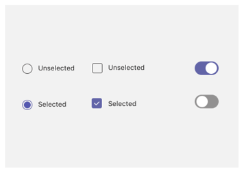
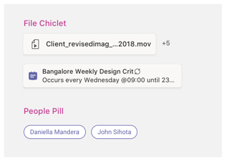

# モバイルのタブTabs on mobile

> [!NOTE]
> Teams モバイル クライアントに [チャネル/グループ] タブを表示するように選択した場合は、`setSettings()` 構成には `websiteUrl` プロパティの値を設定する必要があります (下記参照)。If you choose to have your channel/group tab appear on Teams mobile clients, the `setSettings()` configuration must have a value for the `websiteUrl` property (see below).

カスタム タブは、チャネル、グループ チャット、または個人用アプリ (静的タブや 1 対 1 ボットを含むアプリ) に含まれる場合があります。Custom tabs can be part of a channel, group chat, or personal app (apps that contain static tabs and/or a one-to-one bot).

個人用アプリは、アプリ ドロワー内のモバイル クライアントで利用できます。Personal apps are available on mobile clients in the app drawer. アプリはデスクトップまたは Web クライアントからのみインストールできます。モバイル クライアントに表示するには最大 24 時間かかります。The app can only be installed from a desktop or web client, and can take up to 24 hours to appear on mobile clients. または、サインアウトしてサインインすることで、モバイル クライアントに再読み込みを適用できます。Alternatively, you can enforce a reload on the mobile client by signing out and in. これにより、モバイル アプリがすぐ利用できる必要があります。This should make the mobile app available right away.

チャネル タブは、モバイルでも使用できます。Channel tabs are also available on mobile. 既定の動作は現在、ブラウザー ウィンドウ `websiteUrl` でタブを起動するために使用します。The default behavior is currently to use your `websiteUrl` to launch your tab in a browser window. ただし、タブの横にあるオーバーフロー メニューをクリックし、[開く] を選択すると、モバイル クライアントに読み込まれ、Teams モバイル クライアント内にタブが読み込 `...`  `contentUrl` まれます。However, they can be loaded on a mobile client by clicking the `...` overflow menu next to the tab and choosing **Open**, which will use your `contentUrl` to load the tab inside the Teams mobile client.

## 個人用タブへのアクセスAccessing personal tabs

次の図は、モバイルで個人用タブにアクセスする方法を示しています。The following illustration shows how you access a personal tab on mobile.

:::image type="content" source="../../assets/images/tabs/mobile-app-drawer.png" alt-text="Teams モバイル アプリの引き出しを示す図。" border="false":::

## チャネル タブへのアクセスAccessing channel tabs

次の図は、モバイルでチャネル タブにアクセスする方法を示しています。The following illustration shows how you access a channel tab on mobile.

:::image type="content" source="../../assets/images/tabs/mobile-tab.png" alt-text="Teams モバイル タブを示す図。" border="false":::

## 設計上の考慮事項Design considerations

モバイル プラットフォームを使用すると、アプリのコンテンツが主要な Teams ナビゲーションとは別に、すべての画面を取り上げ、アプリを臨場感のあるエクスペリエンスにできます。Our mobile platform allows apps to be an immersive experience with the app content taking up all of the screen apart from main Teams navigation. Teams に合った臨場感のあるエクスペリエンスを作成するには、次のガイドラインに従います。To create an immersive experience that fits with Teams, follow these guidelines.

### レスポンシブ デザインResponsive design

タブはさまざまな画面サイズのデバイスで開くことができるため、応答性の高い設計原則に従 [う必要](https://www.w3schools.com/html/html_responsive.asp) があります。Because your tab can be opened on devices with a wide range of screen sizes, it needs to follow [responsive design](https://www.w3schools.com/html/html_responsive.asp) principles. すべての主要な構成は、モバイル デバイスでアクセス可能で、ビューを歪めずに行う必要があります。All of the key constructs should be accessible on mobile devices, and the views should not be distorted. タブがモバイル デバイスに読み込まれると、指ベースのナビゲーションを使用してすべてのボタンとリンクに簡単にアクセスできます。Ensure that when your tab is loaded on a mobile device, all buttons and links are easily accessible using finger-based navigation.

### レイアウトLayouts

タブの適切なレイアウトを選択することが重要です。Choosing the correct layout for your tab is important. 提示する情報の種類を検討し、簡単に使用するためにそれを整理するレイアウトを選択する必要があります。You should consider the kind of information you're presenting, and choose a layout that organizes it for easy consumption. いくつかの潜在的なオプションの概要を以下に示します。Some potential options are outlined below.

#### 単一のキャンバスSingle canvas

これは、作業が行われる 1 つの大きな領域です。This is one large area where work gets done. Teams Wiki アプリは、このパターンに従います。The Teams Wiki app follows this pattern. コンテンツを小さなコンポーネントに分けないアプリがある場合は、これは適しています。If you have an app that doesn’t separate content into smaller components this would be a good fit.

:::image type="content" source="../../assets/images/tabs/mobile-tab-single-canvas.png" alt-text="Teams モバイル単一キャンバス タブを示す図。" border="false":::

#### 一覧表示List

リストは、大量のデータを並べ替え、フィルター処理する場合に最適で、最も重要な情報を一番上に保つことに最適です。Lists are great for sorting and filtering large quantities of data and are great at keeping the most important things at the top. 並べ替え可能な列を使用すると便利です。It is helpful to use sortable columns. 省略記号メニューの下の各リスト アイテムにアクションを追加できます。Actions can be added to each list item under the ellipsis menu.

:::image type="content" source="../../assets/images/tabs/mobile-tab-list.png" alt-text="Teams モバイル リスト タブを示す図。" border="false":::

#### グリッドGrid

グリッドは、視覚的な要素を表示する場合に便利です。Grids are useful for showing elements which are highly visual. 上部にフィルターまたは検索コントロールを含めるのに役立ちます。It helps to include a filter or search control at the top.

:::image type="content" source="../../assets/images/tabs/mobile-tab-grid.png" alt-text="グリッド レイアウトの Teams モバイル タブを示す図。" border="false":::

### モバイル上のボットを含むタブTabs with bots on mobile

次の例は、タブとボットを持つ個人用アプリです。The following example is a personal app that has tabs and a bot.

:::image type="content" source="../../assets/images/tabs/mobile-tab-with-bot.png" alt-text="タブとボットを持つモバイル Teams アプリの方法を示す図。" border="false":::

## UI コンポーネントUI components

### カラー パレットColor palettes

承認済みのニュートラル パレットを背景、通知、テキスト、ボタンに使用すると、アプリが Teams で自宅で使い分けるのに役立ちます。Using our approved neutral palette for backgrounds, notifications, text, and buttons will help your app feel more at home in Teams. Teams モバイルには 2 つの色のテーマ (明るいテーマと暗いテーマ) が用意されていますので、両方でアプリが優れたものに見えるのを確認すると良い考えです。Since Teams mobile has two colour themes (light and dark), it’s a good idea to make sure your app looks great in both.

#### 明るい色Light color

#### 濃い色Dark color

### ボタンとコントロールButtons and controls

ボタンのスタイルを設定する方法は、トリガーするアクションの種類を伝えるのに役立ちます。The way buttons are styled helps communicate what kind of action they trigger. さまざまなレベルの強調を表示するために書式設定されたボタンの広い範囲を維持します。We maintain a wide range of buttons that are formatted to show different levels of emphasis. ボタンには、テキスト、アイコン、またはテキストとアイコンの組み合わせを指定できます。Buttons can have text, an icon, or a combination of text and an icon. 階層内の異なるレベルを伝える目的で、各カテゴリ内のプライマリ ボタンとセカンダリ ボタンを設計しました。To communicate different levels in a hierarchy, we designed primary and secondary buttons within each category.

#### ボタンButtons

プライマリ ボタンとセカンダリ ボタン。Primary and secondary buttons.

#### 選択コントロールSelection controls

ラジオ ボタン、チェック ボックス、およびトグル。Radio buttons, checkboxes, and toggles.

#### シックレットと丸薬Chiclets and pills

### 文字体裁Typography

タイポグラフィは明確で目的に合ったものにしてください。Typography should be clear and purposeful. 重要な情報を強調し、複数のフォントとサイズを使用して混乱を軽減しないようにします。Emphasize important information and avoid using multiple fonts and sizes to reduce confusion. 文の大文字と小文字を使用し、ローカライズと読み取り可能性のためにすべての大文字を使用しないようにすることをお勧めします。We recommend using sentence case and avoiding the usage of all caps for localization and legibility.

### フィールドとフライアウトFields and flyouts

フィールドは、ユーザーがテキストを入力できる領域です。Fields are areas where users can input text. フライアウトはダイアログよりも軽量で、上部ウィンドウから表示されます。Flyouts are more lightweight than dialogs and appear from the top pane.

#### コントロールを一覧表示するList controls

#### フィールド コントロールField controls

## 開発者の考慮事項Developer considerations

タブを含むアプリを構築する場合は、Android クライアントと iOS Microsoft Teams クライアントの両方でタブがどのように機能するのか検討 (およびテスト) する必要があります。When you're building an app that includes a tab, you need to consider (and test) how your tab will function on both the Android and iOS Microsoft Teams clients. 以下のセクションでは、考慮する必要がある主要なシナリオの一部について説明します。The sections below outline some of the key scenarios you need to consider.

### モバイル クライアントでのテストTesting on mobile clients

さまざまなサイズと品質のモバイル デバイスでタブが適切に機能するを検証する必要があります。You need to validate that your tab functions properly on mobile devices of various sizes and qualities. Android デバイスの場合 [、DevTools](~/tabs/how-to/developer-tools.md) を使用して、実行中にタブをデバッグできます。For Android devices, you can use the [DevTools](~/tabs/how-to/developer-tools.md) to debug your tab while it is running. パフォーマンスの高いデバイスと低パフォーマンスデバイスの両方とタブレットでテストすることをお勧めします。We recommend that you test on both high and low performing devices, as well as on a tablet.

### 認証Authentication

モバイル クライアントで認証を機能するには、Teams JavaScript SDK を少なくともバージョン 1.4.1 にアップグレードする必要があります。For authentication to work on mobile clients, you must upgrade you Teams JavaScript SDK to at least version 1.4.1.

### 低帯域幅と断続的な接続Low bandwidth and intermittent connections

モバイル クライアントは、低帯域幅と断続的な接続で定期的に機能する必要があります。Mobile clients regularly need to function with low bandwidth and intermittent connections. アプリは、ユーザーにコンテキスト メッセージを提供することで、タイムアウトを適切に処理する必要があります。Your app should handle any timeouts appropriately by providing a contextual message to the user. また、長時間実行されるプロセスに対してユーザーにフィードバックを提供するユーザー進行状況インジケーターも必要です。You should also user progress indicators to provide feedback to your users for any long-running processes.

> [!NOTE]
> タブは、承認チームの入力に基づいて、アプリケーションが許可リストに追加された後にのみ、モバイルで有効になります。Tabs are enabled on mobile only after the application is added to an allow list, based on the input of the approval team. モバイルの応答性を確認するには、ユーザーに teamsubm@microsoft.com。To check mobile responsiveness, reach out to teamsubm@microsoft.com. 
