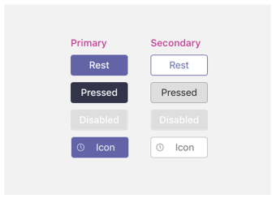

# モバイルのタブ

> [!NOTE]
> Teams モバイル クライアントに [チャネル/グループ] タブを表示するように選択した場合は、`setSettings()` 構成には `websiteUrl` プロパティの値を設定する必要があります (下記参照)。

カスタムタブは、チャネル、グループチャット、または個人アプリの一部にすることができます (静的タブを含むアプリ、または1対1の bot を含むアプリ)。

個人用アプリは、アプリケーションドロワーのモバイルクライアントで使用できます。 アプリは、デスクトップまたは web クライアントからのみインストールでき、モバイルクライアントに表示されるまでに最大24時間かかることがあります。

[チャネル] タブは、モバイルでも使用できます。 既定の動作では、を使用して、 `websiteUrl` ブラウザーウィンドウでタブを起動します。 ただし、[] タブの横にあるオーバーフローメニューをクリックし、[開く] を選択することによって、モバイルクライアントに読み込むことができます `...` 。これは**Open**、を使用して、 `contentUrl` Teams モバイルクライアント内にタブをロードします。

## 個人用タブへのアクセス

次の図は、モバイルの [個人用] タブにアクセスする方法を示しています。

:::image type="content" source="../../assets/images/tabs/mobile-app-drawer.png" alt-text="Teams モバイルアプリドロワーを示す図" border="false":::

## チャネルタブへのアクセス

次の図は、モバイルの [チャネル] タブにアクセスする方法を示しています。

:::image type="content" source="../../assets/images/tabs/mobile-tab.png" alt-text="Teams の [モバイル] タブを示す図。" border="false":::

## 設計上の考慮事項

弊社のモバイルプラットフォームを使用すると、アプリのコンテンツがメインの Teams ナビゲーションとは別にすべての画面を占有しているため、アプリをイマーシブ操作とすることができます。 Teams に適したイマーシブ環境を作成するには、次のガイドラインに従ってください。

### レスポンシブ デザイン

タブはさまざまな画面サイズのデバイス上で開くことができるため、 [応答性](https://www.w3schools.com/html/html_responsive.asp) の高い設計原則に従う必要があります。 すべてのキーの構成はモバイルデバイスでアクセスできる必要があり、ビューがゆがんではないことが必要です。 タブがモバイルデバイスにロードされている場合、すべてのボタンとリンクは、finger ベースのナビゲーションを使用して簡単にアクセスできます。

### レイアウト

タブの正しいレイアウトを選択することは重要です。 表示する情報の種類を検討し、簡単に使用できるように整理されたレイアウトを選択する必要があります。 考えられるオプションには、次のようなものがあります。

#### 1つのキャンバス

これは、作業が行われる大きな領域の1つです。 Teams Wiki アプリは、このパターンに従います。 コンテンツを小さなコンポーネントに分離しないアプリがある場合は、それに適しています。

:::image type="content" source="../../assets/images/tabs/mobile-tab-single-canvas.png" alt-text="Teams の [モバイルシングルキャンバス] タブを示す図" border="false":::

#### リスト

リストは大量のデータの並べ替えとフィルター処理を行うのに適しており、最も重要なものを最上位に保持するのに適しています。 並べ替え可能な列を使用すると便利です。 アクションは、省略記号メニューの各リスト項目に追加できます。

:::image type="content" source="../../assets/images/tabs/mobile-tab-list.png" alt-text="Teams モバイルリストタブを示す図" border="false":::

#### グリッド

グリッドは、ビジュアルの高い要素を表示するのに便利です。 フィルターまたは検索コントロールを上部に含めることができます。

:::image type="content" source="../../assets/images/tabs/mobile-tab-grid.png" alt-text="グリッドレイアウトを含む Teams mobile タブを示す図" border="false":::

### モバイルに bot があるタブ

次の例は、タブと bot を備えた個人のアプリです。

:::image type="content" source="../../assets/images/tabs/mobile-tab-with-bot.png" alt-text="タブと bot を備えたモバイル Teams アプリを示す図" border="false":::

## UI コンポーネント

### カラー パレット

背景、通知、テキスト、およびボタンに対して承認されたニュートラルパレットを使用すると、アプリが Teams での自宅をよりよく理解できるようになります。 Teams mobile には2つの色のテーマ (軽いと濃) があるため、アプリが両方に適したものになるようにすることをお勧めします。

#### 明るい色

#### 暗い色

### ボタンとコントロール

ボタンのスタイルを設定すると、どのような種類の動作が発生したかを伝えることができます。 さまざまな強調レベルを表示するように書式設定されたさまざまなボタンを維持しています。 ボタンには、テキスト、アイコン、またはテキストとアイコンの組み合わせを含めることができます。 階層内のさまざまなレベルを通信するために、各カテゴリ内に主ボタンと副ボタンを設計しました。

#### ボタン

主ボタンとセカンダリボタン。

#### 選択コントロール

ラジオボタン、チェックボックス、および切り替え。

#### Chiclets および pills

### 文字体裁

文字体裁はクリアで、意図的にする必要があります。 重要な情報を強調して、混乱を減らすために複数のフォントとサイズを使用しないようにします。 ローカライズと読みやすくするために、文のケースを使用し、すべての cap の使用を回避することをお勧めします。

### フィールドと flyouts

フィールドは、ユーザーがテキストを入力できる領域です。 Flyouts はダイアログよりも軽量で、上部のウィンドウに表示されます。

#### コントロールを一覧表示する

#### フィールドコントロール

## 開発者の考慮事項

タブを含むアプリを構築する場合は、Android と iOS の Microsoft Teams クライアントの両方でタブがどのように機能するかを考慮する必要があります (およびテストする必要があります)。 以下のセクションでは、考慮する必要がある主なシナリオのいくつかについて概説します。

### モバイルクライアントでのテスト

さまざまなサイズと品質のモバイルデバイスでタブが正しく機能することを検証する必要があります。 Android デバイスの場合、 [Devtools](~/tabs/how-to/developer-tools.md) を使用して、実行中にタブをデバッグできます。 高および低パフォーマンスのデバイスに加えて、タブレット上でテストすることをお勧めします。

### 認証

モバイルクライアントで認証を行うには、Teams JavaScript SDK を少なくともバージョン1.4.1 にアップグレードする必要があります。

### 低帯域幅および断続的な接続

モバイルクライアントは、低帯域幅および断続的な接続で通常に機能する必要があります。 アプリでは、ユーザーにコンテキストメッセージを提供することによって、すべてのタイムアウトを適切に処理する必要があります。 また、長時間実行されているプロセスのユーザーにフィードバックを提供するために、ユーザーの進捗状況インジケーターを表示する必要があります。
