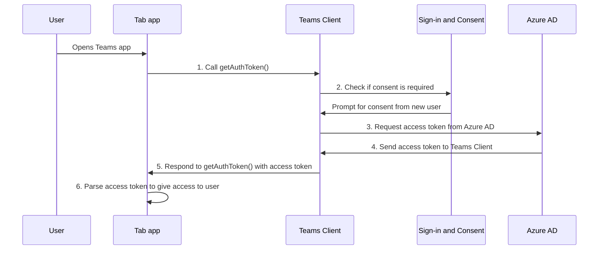

# タブ アプリの SSO を有効にする

<!--Single sign-on (SSO) allows a user to access an application or a web service after signing-in only once. The app users never have to go through authentication again.-->

Teams で SSO を使用すると、アプリ ユーザーは Teams を使用してアプリにアクセスできる利点があります。 Microsoft または Microsoft 365 アカウントを使用して Teams にログインすると、アプリ ユーザーは、もう一度サインインしなくてもアプリを使用できます。 アプリは、Azure AD 経由でアクセス権が付与されている任意のデバイス上でアプリ ユーザーが利用できます。

このセクションで学習する内容は次のとおりです。

1. **SSO ユーザー エクスペリエンス**: Teams は、アプリ ユーザーに真の SSO エクスペリエンスを提供します。 アプリ ユーザーは、もう一度サインインしなくてもアプリを使用できます。
2. **Teams 実行時の SSO**: タブ アプリは、アプリ ユーザーの 1 回限りの認証と承認のために、実行時に Azure AD を操作します。
3. **タブ アプリの SSO を有効にする**: タブ アプリで SSO を実装するために必要なタスクを実装します。

## Teams での SSO ユーザー エクスペリエンス

アプリ ユーザーは、個人用の Microsoft アカウントまたは Microsoft 365 アカウントを使用して Teams にサインインします。 これを活用し、SSO を使用してアプリ ユーザーを認証および承認できます。

&nbsp;&nbsp;&nbsp;&nbsp;:::image type="content" source="../../../assets/images/authentication/teams-sso-tabs/teams-sso-ux.png" alt-text="Teams タブ アプリでの SSO ユーザー エクスペリエンス":::

- Teams は、アプリ ユーザーの ID を認証して保存します。
- タブ アプリは、Teams によって既に検証されているアプリ ユーザーの保存済み ID を使用します。
- アプリ ユーザーは、タブ アプリを使用するために ID を使用してアクセスするために Teams に同意する必要があります。
- アプリ ユーザーは、Web、デスクトップ、またはモバイル クライアントでアプリにアクセスできます。

タブ アプリで SSO を使用したユーザー エクスペリエンスの例を次に示します。

:::image type="content" source="../../../assets/images/authentication/teams-sso-tabs/sso-tab.gif" alt-text="タブ アプリでの SSO":::

### SSO を使用してユーザー エクスペリエンスを強化する

アプリ ユーザーが SSO エクスペリエンスで得られる内容を次に示します。

- Teams は、Azure AD から現在のアプリ ユーザーのアクセス トークンを取得します。 この Azure AD との対話は、アプリ ユーザーには表示されません。 これは、Teams 環境を退出することなくアプリへのアクセス検の取得に変換されます。
- アプリ ユーザーは、マルチテナント環境でのみ同意する必要があります。 アプリ ユーザーとアプリが同じテナントに存在する場合、アプリ ユーザーはアプリの使用に同意する必要はありません。
- Teams に初めて同意した後、アプリ ユーザーは、他のデバイスでも、それ以上の同意の必要なくアプリを使用できます。 このため、ユーザー エクスペリエンスが向上します。
  - または、テナント管理者は、アプリ ユーザーに代わって同意を付与できます。 このシナリオでは、テナント管理者がテナント内のアプリ ユーザーに同意した場合、アプリ ユーザーに同意を求めるメッセージを表示する必要はありません。 つまり、アプリ ユーザーは同意ダイアログを表示することなく、アプリにシームレスにアクセスできます。
- アクセス トークンは、Teams 環境でのアプリのパフォーマンスと読み込み時間を向上させるために Teams によって事前に取得されます。
- アプリ ユーザーは、Teams 環境でアプリにアクセスして使用するために、複数のパスワードを記憶したり記録したりする必要はありません。

> [!NOTE]
> アプリ ユーザーは、テナント内のすべての SharePoint および OneDrive アセットの読み取りと書き込みをアプリ ユーザーが許可する `Sites.ReadWrite.All` などの一部のアクセス許可スコープにアクセス許可を与えることはできません。 このようなスコープの場合は、アプリ ユーザーの代わりに同意を付与できるのはテナント管理者のみです。

ここでは、Teams 内で SSO エクスペリエンスを実現するために、実行時にバックエンドで発生することに目を向けてみましょう。

## Teams 実行時の SSO

タブ アプリで SSO を実現するには、現在ログインしている Teams アプリ ユーザーのアクセス トークンを取得します。 このプロセスには、タブ アプリ クライアント、サーバー、Teams クライアント、Azure AD が含まれます。 この操作中、アプリ ユーザーは Teams ID を使用してマルチテナント環境でアクセス トークンを取得することに同意する必要があります。

次の図は、Teams アプリ ユーザーがタブ アプリにアクセスしようとした場合の SSO の機能を示しています。

:::image type="content" source="../../../assets/images/authentication/teams-sso-tabs/sso-runtime-seqd.png" alt-text="タブ シングル サインオンの SSO 図" lightbox="../../../assets/images/authentication/teams-sso-tabs/sso-runtime-seqd.png":::

| # | 操作 | 何が起こっているのでしょうか |
| --- | --- | --- |
| 1 | タブ アプリ → Teams クライアント | タブ アプリは、アクセス トークンを取得するように Teams に指示する `getAuthToken()` への JavaScript 呼び出しを行います。 |
| 2 | Teams クライアント → Azure AD | Teams は、Teams ID に基づいて、現在のアプリ ユーザーのアクセス トークンに対して Azure AD エンドポイントを要求します。 |
| 3 | Azure AD → 同意フォーム | 現在のアプリ ユーザーが初めてタブ アプリを使用している場合、アプリが保護されたデータにアクセスする必要がある場合、Teams は同意を求める要求を表示します。 アプリ ユーザー (または管理者) は、アプリ ユーザーの Teams ID を使用して Azure AD からアクセス トークンを取得することについて Teams に同意する必要があります。   または、2 要素認証などのステップアップ認証を要求する要求プロンプトが表示されます。 |
| 4 | Azure AD → Teams クライアント | Azure AD では、Teams クライアントにアクセス トークンを送信します。 このトークンは、JSON Web トークン (JWT) です。この検証は最も標準的な OAuth でのトークンの検証とまったく同様に動作します。 Teams はユーザーの代わりにトークンをキャッシュし、`getAuthToken()` への今後の呼び出しが、キャッシュされたトークンを返すようにします。 |
| 5 | Teams クライアント → タブ アプリ クライアント | `getAuthToken()` の呼び出しによって返される結果オブジェクトの一部として、Teams ではタブ アプリにアクセス トークン を送信します。 |
| 6 | タブ アプリ (クライアントとサーバー間) | タブ アプリは JavaScript を使用してアクセス トークンで解析され、アプリ ユーザーのメール アドレスなどの必要な情報を抽出します。 タブ アプリに返されるトークンは、アクセス トークン と ID トークンの両方です。 |

詳細については、「[コードを更新して SSO を有効にする](tab-sso-code.md)」を参照してください。

> [!IMPORTANT]
> `getAuthToken()` は、メール、プロファイル、offline_access、OpenId など、ユーザー レベルの API の限定された組み合わせに同意する場合にのみ有効です。 `User.Read` や `Mail.Read` など、その他の Graph スコープには使用されません。 推奨される回避策については、「[Microsoft Graph のアクセス許可を使用してアプリを拡張する](tab-sso-graph-api.md)」を参照してください。

タブは Teams 対応 Web ページです。 タブ アプリ内でホストされている Web ページで SSO を有効にするには、[Teams Javascript クライアント SDK](/javascript/api/overview/msteams-client?view=msteams-client-js-latest&preserve-view=true) を追加し、`microsoftTeams.initialize()` を呼び出します。 初期化したら、アプリのアクセス トークンを取得するために `microsoftTeams.getAuthToken()` を呼び出します。

### SSO を有効にするためのユース ケース

ID プロバイダーとして Azure AD をサポートするすべてのアプリに、Teams で SSO を有効にすることができます。 タブ アプリでアプリ ユーザーを認証するために SSO を使用するだけでなく、それを使用して Teams 間でシームレスなアクセスを有効にすることもできます。

SSO API を使用してアプリ ユーザーを認証できるシナリオは次のとおりです。

- Teams タブ アプリ内でアプリ ユーザーを認証する場合、SSO API を使用すると、アプリ ユーザーは追加の認証の必要なく Teams でアプリを使用できます。 アプリ ユーザーの Teams ID に基づいて、Azure AD からそれらのアクセス トークンを取得できます。
- アプリがボット、タブ、メッセージ拡張機能、アダプティブ カード内からタスク モジュールを使用する場合は、SSO API を使用してアプリ ユーザーを認証できます。
- また、SSO API を使用して、もう一度検証する必要なくステージ ビューにアクセスするアプリ ユーザーを認証することもできます。

> [!TIP]
> さらに、SSO API を使用して、Web コンテンツを組み込む [タスク モジュール](../../../task-modules-and-cards/what-are-task-modules.md) でアプリ ユーザーを認証することもできます。

実行時に SSO を実現するには、アプリ ユーザーを認証して承認するための SSO を有効にするようにアプリを構成します。

## タブ アプリの SSO を有効にする

このセクションでは、タブ アプリの SSO の実装に関連するタスクについて説明します。 これらのタスクは、言語とフレームワークに依存していません。

タブ アプリの SSO を有効にするには、以下の操作を行います。

&nbsp;&nbsp;&nbsp;&nbsp;&nbsp;:::image type="content" source="../../../assets/images/authentication/teams-sso-tabs/enable-sso.png" alt-text="タブの SSO を有効にするための手順" lightbox="../../../assets/images/authentication/teams-sso-tabs/enable-sso.png":::

1. **Azure AD に登録**: Azure AD アプリを作成して、アプリ ID とアプリケーション ID URI を生成します。 アクセス トークンを生成するには、スコープを構成し、信頼されたクライアント アプリケーションを承認します。
2. **コードの更新**: アクセス トークンを処理するコードを追加し、アプリ ユーザーがタブ アプリにアクセスしたときに `getAuthToken()` を呼び出し、承認ヘッダーでアプリのサーバー コードにこのトークンを送信し、アクセス トークンの受信時にアクセス トークンを検証します。
3. **Teams アプリ マニフェストの更新**: Azure AD で生成されたアプリ ID とアプリケーション ID URI を使用して Teams クライアント アプリ マニフェストを更新して、アプリの代わりに Teams がアクセス トークンを要求できるようにします。

## iOS のサードパーティ Cookie

iOS 14 を更新すると、Apple は既定ですべてのアプリの[サードパーティ Cookie](https://webkit.org/blog/10218/full-third-party-cookie-blocking-and-more/) のアクセスをブロックしました。 したがって、[チャネル] タブまたは [チャット] タブでの認証にサードパーティ Cookie を利用するアプリ、および個人用アプリは、Teams iOS クライアントでの認証ワークフローを完了できません。 プライバシーとセキュリティの要件に準拠するには、トークンベースのシステムに移行するか、ユーザー認証ワークフローにファーストパーティ Cookie を使用する必要があります。

### Teams モバイル クライアントのサポート

Teams モバイルの場合、SSO をサポートするクライアント バージョンは次のとおりです。

- Teams for Android (1416/1.0.0.2020073101 以降)
- Teams for iOS (バージョン: 2.0.18 以降)  
- Teams JavaScript SDK (バージョン: 1.11 以降)。SSO を会議のサイド パネルで機能させるために必要です

Teams を最適なパフォーマンスでご利用いただくために、最新バージョンの iOS および Android を使用してください。

## ベスト プラクティス

以下がベスト プラクティスの一覧です。

- **必要な場合にのみアクセス トークンを呼び出す**: アクセス トークンが必要な場合にのみ `getAuthToken()` を呼び出します。 アプリ ユーザーがタブ アプリにアクセスするとき、またはアプリ ユーザーの検証が必要な特定の関数を使用するときに呼び出すことができます。
- **クライアント側のコードにアクセス トークンを格納しない**: アプリのクライアント側のコードにアクセス トークンをキャッシュしたり格納したりしないでください。 Teams クライアントはアクセス トークンをキャッシュします (有効期限が切れた場合は新しいトークンを要求します)。 これにより、Web アプリからトークンが偶発的に漏えいすることはありません。
- **Microsoft Graph 呼び出しにサーバー側コードを使用する**: 常にサーバー側のコードを使用して、Microsoft Graph 呼び出し、またはアクセス トークンを渡す必要があるその他の呼び出しを行います。 クライアントから Microsoft Graph への直接呼び出しを有効にするために、クライアントに OBO トークンを返しません。 これにより、トークンが傍受またはリークされないように保護できます。 詳細については、「[Microsoft Graph のアクセス許可とスコープを使用してタブ アプリを拡張する](tab-sso-graph-api.md)」を参照してください。

## 既知の制限

- 現時点では、Teams の SSO では OAuth 2.0 トークンのみがサポートされています。 SAML トークンはサポートされていません。
- アプリごとの複数のドメインはサポートされていません。 詳細については、「[LOB アプリ](tab-sso-register-aad.md#before-you-register-with-azure-ad)」を参照してください。

## 次のステップ

> [!div class="nextstepaction"]
> [Azure AD でタブ アプリケーションを登録する](tab-sso-register-aad.md)

## 関連項目

[タブ アプリでコードを構成して SSO を有効にする](tab-sso-code.md)

<!--
### Use cases for enabling SSO for tab app

Here are some use cases where enabling SSO is beneficial. Call `getAuthToken()` in these scenarios to use Teams identity for obtaining access token for your app users:

- To get an app user’s identity from Teams if you have an existing app that you want to be available within a tab app in Teams.

- To authenticate an app user by reusing the Team’s identity inside your tab app.

- To authenticate and get an app user’s Teams identity inside configurable tabs. The app users don't need to sign in again. It's applicable to some settings that need to be configured at a configuration stage.

- To obtain an access token inside a task module, when it's invoked from a tab app, a bot app, a messaging extension app, or adaptive cards.

- To authenticate an app user in Stage view.

- To authenticate users for [task modules](../../../task-modules-and-cards/what-are-task-modules.md) that embed web content.
-->

<!--

-->

<!--
- Tenant admin consent: A simple way of [consenting on behalf of an organization as a tenant admin](/azure/active-directory/develop/v2-permissions-and-consent.md#requesting-consent-for-an-entire-tenant) is by getting [consent from admin](/azure/active-directory/manage-apps/grant-admin-consent).
  
    You can ask for consent using the Auth API. Another approach for getting Graph scopes is to present a consent dialog using our existing [third party OAuth provider authentication approach](~/tabs/how-to/authentication/auth-tab-aad.md#navigate-to-the-authorization-page-from-your-pop-up-page). This approach involves popping up an Azure AD consent dialog box.

  

  
To ask for additional consent using the Auth API, follow these steps:

    1. The token retrieved using `getAuthToken()` must be exchanged on the server-side using Azure AD [on-behalf-of flow (OBO)](/azure/active-directory/develop/v2-oauth2-on-behalf-of-flow) to get access to those other Graph APIs. Ensure you use the v2 Graph endpoint for this exchange.
    2. If the exchange fails, Azure AD returns an invalid grant exception. It usually responds with one of the two error messages, `invalid_grant` or `interaction_required`.
    3. When the exchange fails, you must ask for consent. Use the user interface (UI) to ask the app user to grant other consent. This UI must include a button that triggers an Azure AD consent dialog using [Silent authentication](~/concepts/authentication/auth-silent-aad.md).
    4. When asking for more consent from Azure AD, you must include `prompt=consent` in your [query-string-parameter](~/tabs/how-to/authentication/auth-silent-aad.md#get-the-user-context) to Azure AD, otherwise Azure AD wouldn't ask for other scopes.

        - Instead of `?scope={scopes}`, use `?prompt=consent&scope={scopes}`
        - Ensure that `{scopes}` includes all the scopes you're prompting the user for, for example, `Mail.Read` or `User.Read`.
    5. After the app user has granted more permissions, retry the OBO flow to get access to these other APIs.

    

-->
<!--
- If you want your existing app to be available within a Teams tab app, the SSO API allows your signed-in app users to use your app in Teams with no additional authentication needed. Based on the app user's Teams identity, you can obtain access token for them from Azure AD.
- If your app has configurable tabs, you can use `getAuthToken()` to allow app users into the tab app without signing in again. SSO is applicable to some settings that need to be configured at a configuration stage.
- Your app may have a bot, a tab, a message extension, or Adaptive Cards, and allows your app users to invoke task module from within a tab or a bot. The SSO API will authenticate your app users who attempt to access the task module. Teams can use the app user's Teams identity and obtain an access token from Azure AD.

- You can also use the SSO API for authenticating your app users who want to access to Stage view without need to be validated again. The access token obtained for the app user when they first used your app can be used to allow them to use Stage view. -->
