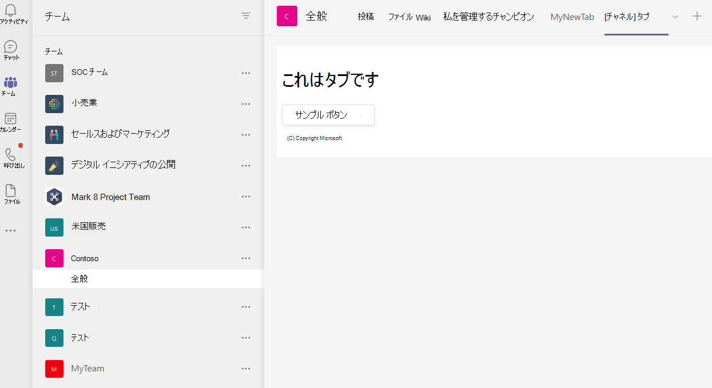

# <a name="create-a-channel-or-group-tab"></a>[チャネルまたはグループ] タブを作成する

## <a name="create-a-custom-channel-or-group-tab"></a>カスタム チャネルまたはグループ タブの作成

チャネルまたはグループ タブは、Node.js Yeoman Generator、ASP.NETCore、または ASP.NETCore MVC を使用して作成できます。

# <a name="nodejs"></a>[Node.js](#tab/nodejs)

### <a name="create-a-custom-channel-and-group-tab-using-nodejs-and-the-yeoman-generator"></a>カスタム チャネルとグループ タブを作成するには、Node.js Yeoman Generator を使用します。

> [!NOTE]
> この記事では、Microsoft OfficeDev Microsoft Teamsリポジトリにあるアプリ[Wiki](https://github.com/OfficeDev/generator-teams/wiki/Build-Your-First-Microsoft-Teams-App)のビルドにGitHubします。

You can create a custom channel or group tab using the you can create a custom channel or group tab using [the Teams Yeoman generator](https://github.com/OfficeDev/generator-teams/).

### <a name="prerequisites-for-apps"></a>アプリの前提条件

次の前提条件について理解している必要があります。

- カスタム アプリのアップロードを許可Office 365を有効にしたテナントとチーム **が構成されている必要** があります。 詳細については、「prepare [your Office 365 テナント」を参照してください](~/concepts/build-and-test/prepare-your-o365-tenant.md)。

    > [!NOTE]
    > 現在アカウントをお持ちOffice 365場合は、開発者プログラムから無料サブスクリプションOffice 365できます。 サブスクリプションは、継続的な開発に使用している限りアクティブなままです。 「[開発者プログラムへようこそOffice 365」を参照してください](/office/developer-program/microsoft-365-developer-program)。

さらに、このプロジェクトでは、次のコードが開発環境にインストールされている必要があります。

- 任意のテキスト エディターまたは IDE。 無料でインストール[して使用Visual Studio Code](https://code.visualstudio.com/download)できます。

- [Node.js/npm](https://nodejs.org/en/). 最新の LTS バージョンを使用します。 Node パッケージ マネージャー (npm) は、システムにインストールされたシステムにインストールNode.js。

- インストールが正常に完了したらNode.jsに次のコマンド プロンプトを入力して [、Yeoman](https://yeoman.io/) パッケージと [gulp-cli](https://www.npmjs.com/package/gulp-cli) パッケージをインストールします。

    ```bash
    npm install yo gulp-cli --global
    ```

- コマンド プロンプトにMicrosoft Teamsを入力して、アプリ ジェネレーターをインストールします。

    ```bash
    npm install generator-teams --global
    ```

### <a name="generate-your-project"></a>プロジェクトを生成する

**プロジェクトを生成するには**

1. コマンド プロンプトで、タブ プロジェクトの新しいディレクトリを作成します。

1. ジェネレーターを起動するには、新しいディレクトリに移動し、次のコマンドを入力します。

    ```bash
    yo teams
    ```

1. 次に、アプリケーションのファイルファイルで使用される一連の値manifest.js **指定** します。

    

    **ソリューション名は何ですか?**

    これはプロジェクト名です。 Enter キーを選択すると、候補の名前を **受け入** れできます。

    **ファイルをどこに保存しますか?**

    現在、プロジェクト ディレクトリにいます。 **[Enter] を選択します**。

    **アプリ プロジェクトMicrosoft Teamsタイトル**

    これはアプリ パッケージ名であり、アプリ マニフェストと説明で使用されます。 タイトルを入力するか、Enter **を選択して** 既定の名前を受け入れる。

    **(会社) の名前(最大 32 文字)**

    会社名はアプリ マニフェストで使用されます。 会社名を入力するか **、Enter を選択して** 既定の名前を受け入れる。

    **どのマニフェスト バージョンを使用しますか?**

    既定のスキーマを選択します。

    **クイック スキャフォールディング(Y/n)**

    既定値は yes です。 **n と入力** して Microsoft パートナー ID を入力します。

    **Microsoft パートナー ID をお持ちの場合は、Microsoft パートナー ID を入力してください。(スキップする場合は空白のままにする)**

    このフィールドは必須ではなく、Microsoft パートナー ネットワークに既に参加している場合にのみ [使用する必要があります](https://partner.microsoft.com)。

    **プロジェクトに何を追加しますか?**

    [ **選択] &ast; ( ) [タブ] をクリックします**。

    **このソリューションをホストする URL**

    既定では、ジェネレーターは Azure Web サイトの URL を提案します。 アプリをローカルでテストしているだけなので、有効な URL は必要ありません。

    **アプリ/タブの読み込み時に読み込みインジケーターを表示しますか?**

    アプリ **またはタブ** の読み込み時に読み込みインジケーターを含めないを選択します。 既定値は no で、n と **入力します**。

   **個人用アプリをタブ ヘッダーバーなしでレンダリングしますか?**

    タブ **ヘッダー** バーなしでレンダリングする個人用アプリを含めないを選択します。 既定値はいいえ、n と **入力します**。

    **テスト フレームワークと初期テストを含めるには?(y/N)**

    この **プロジェクトの** テスト フレームワークを含めないを選択します。 既定値は yes です。 **n と入力します**。

    **テレメトリに Azure Applications インサイト使用しますか?(y/N)**

    [Azure **Application インサイト**[を含インサイト。](/azure/azure-monitor/app/app-insights-overview) 既定値は no です。 **n と入力します**。

    **既定のタブ名 (最大 16 文字)?**

    タブの名前を指定します。このタブ名は、ファイルまたは URL パス コンポーネントとしてプロジェクト全体で使用されます。

    **作成するタブの種類**

    矢印キーを使用して、[構成可能] **タブを選択** します。

    **Tab に使用するスコープは何ですか?**

    チームまたはグループ チャットを選択できます。

    **タブに Azure AD のシングルサインオン サポートが必要ですか?**

    タブ **に** Azure ADシングル サインオン のサポートを含めないを選択します。既定値ははい、n と **入力します**。

    **このタブをオンラインで使用SharePointしますか?(Y/n)**

    **n と入力します**。

    > [!IMPORTANT]
    > パス コンポーネント **yourDefaultTabNameTab**, is you entered the value in the generator for **Default Tab Name** plus the word **Tab**.
    >
    > 例: DefaultTabName: **MyTab**  >  **/MyTabTab/**

1. [Visual Studio Codeまたはコード エディターで、プロジェクト ディレクトリに移動し、次のファイルを開きます。

    ```bash
    ./src/app/scripts/<yourDefaultTabNameTab>/<yourDefaultTabNameTab>.tsx
    ```

1. メソッドを `render()` 見つけて、コンテナー コードの上部に `<div>` 次のタグとコンテンツを `<PanelBody>` 追加します。

    ```html
        <PanelBody>
            <div style={styles.section}>
                Hello World! Yo Teams rocks!
            </div>
        </PanelBody>
    ```

1. 更新されたファイルを保存してください。

### <a name="build-and-run-your-application"></a>アプリケーションのビルドと実行

コマンド プロンプトで、プロジェクト ディレクトリを開いて次のタスクを完了します。

#### <a name="create-the-app-package"></a>アプリ パッケージを作成する

タブをテストするには、アプリ パッケージが必要Teams。 これは、次の必須ファイルを含む zip フォルダーです。

- 192 x 192 ピクセルのフル カラー アイコン。 
- **32** x 32 ピクセルの透明なアウトライン アイコン。
- アプリ **manifest.js** を指定するファイルのプロパティです。

パッケージは、ファイル上のファイルのmanifest.jsを検証し、./package ディレクトリに zip フォルダーを生成する **gulp タスクを使用して作成されます**。 コマンド プロンプトで、次のコマンドを入力します。

```bash
gulp manifest
```

#### <a name="build-your-application"></a>アプリケーションのビルド

ビルド コマンドは、ソリューションを **./dist フォルダーに変換** します。 コマンド プロンプトで次のコマンドを入力します。

```bash
gulp build
```

#### <a name="run-your-application-in-localhost"></a>localhost でアプリケーションを実行する

1. コマンド プロンプトに次の情報を入力して、ローカル Web サーバーを起動します。

    ```bash
    gulp serve
    ```

1. 次の図に示すように、ブラウザーに入力し、タブ名に置き換え、アプリケーションのホーム ページ `http://localhost:3007/<yourDefaultAppNameTab>/` **<yourDefaultAppNameTab>** を表示します。

    

1. タブ構成ページを表示するには、 に移動します `https://localhost:3007/<yourDefaultAppNameTab>/config.html` 。 次に示します。

    

### <a name="establish-a-secure-tunnel-to-your-tab"></a>タブへのセキュリティで保護されたトンネルを確立する

Microsoft Teamsはクラウドベースの製品であり、HTTPS エンドポイントを使用してタブ コンテンツをクラウドから利用できる必要があります。 Teamsはローカル ホスティングを許可しない。 タブをパブリック URL に発行するか、ローカル ポートをインターネットに接続する URL に公開するプロキシを使用する必要があります。

タブ拡張機能をテストするには、 [このアプリケーションに組み込まれる ngrok](https://ngrok.com/docs)を使用します。 Ngrok はリバース プロキシ ソフトウェア ツールで、ローカルで実行中の Web サーバーの一般公開 HTTPS エンドポイントへのトンネルを作成します。 サーバーの Web エンドポイントは、コンピューター上の現在のセッション中に使用できます。 コンピューターがシャットダウンまたはスリープ状態になった場合、サービスは使用できなくなりました。

コマンド プロンプトで localhost を終了し、次のコマンドを入力します。

```bash
gulp ngrok-serve
```

> [!IMPORTANT]
> タブが Microsoft Teams にアップロードされ、正常に保存された後は、タブ ギャラリーでタブを表示し、タブ バーに追加し、ngrok トンネル セッションが終了するまで操作できます。 ngrok セッションを再起動する場合は、新しい URL でアプリを更新する必要があります。

### <a name="upload-your-application-to-teams"></a>アップロードを使用してアプリケーションをTeams

**アプリケーションをアプリにアップロードTeams**

1. [次へ] にMicrosoft Teams。 Web ベースのバージョン [を使用する場合は](https://teams.microsoft.com) 、ブラウザーの開発者ツールを使用してフロントエンド コードを [検査できます](~/tabs/how-to/developer-tools.md)。
1. 左側のウィンドウのチームから、タブのテストに使用 &#x25CF;&#x25CF;&#x25CF; の横にある省略記号を選択し、[チームの管理] **を選択します**。
1. メイン ウィンドウで、タブ **バーから**[アプリ]を選択し、アップロード右下隅にあるカスタム アプリを選択します。
1. プロジェクト ディレクトリを移動し **、./package** フォルダーを参照し、アプリ パッケージの zip フォルダーを選択し、[開く] を選択 **します**。

    ![[チャネル] タブが追加されました](../../assets/images/tab-images/channeltabadded.png)

1. ポップアップ **ダイアログ ボックスで** [追加] を選択します。 タブがサイトにTeams。
1. チームに戻り、タブを表示するチャネルを選択し、タブ バーから [➕] を選択し、ギャラリーからタブを選択します。
1. タブを追加するには、指示に従います。チャネルまたはグループ タブのカスタム構成ダイアログ ボックスがあります。
1. [ **保存] を** 選択すると、タブがチャネルのタブ バーに追加されます。

    

# <a name="aspnet-core"></a>[ASP.NET コア](#tab/aspnetcore)

### <a name="create-a-custom-channel-or-group-tab-with-aspnet-core"></a>カスタム チャネルまたはグループ タブを作成し、ASP.NET Core

カスタム チャネルまたはグループ タブを作成するには、[コア C#] ASP.Net を使用します。 [App Studio for Microsoft Teams](~/concepts/build-and-test/app-studio-overview.md)は、アプリ マニフェストを最終的に作成し、タブを展開してアプリ マニフェストに展開Teams。

### <a name="prerequisites-for-teams-apps"></a>アプリのTeams前提条件

次の前提条件について理解している必要があります。

- カスタム アプリのアップロードを許可Office 365を有効にしたテナントとチーム **が構成されている必要** があります。 詳細については、「prepare [your Office 365 テナント」を参照してください](~/concepts/build-and-test/prepare-your-o365-tenant.md)。

    > [!NOTE]
    > 現在アカウントを持Microsoft 365場合は、Microsoft Developer Program を通じて無料サブスクリプションに[サインアップできます](https://developer.microsoft.com/en-us/microsoft-365/dev-program)。 サブスクリプションは、継続的な開発に使用している限りアクティブなままです。

- App Studio を使用してアプリケーションをインポートし、Teams。 App Studio をインストールするには、アプリアプリの左下隅にある [アプリ ストア アプリ] を選択Teams App Studio を  **検索します**。 タイルを見つけたら、タイルを選択し、ポップアップ ダイアログ ボックスで [追加] を選択してインストールします。

さらに、このプロジェクトでは、次のコードが開発環境にインストールされている必要があります。

- 現在のバージョンの IDE **Visual Studio.NET CORE** クロスプラットフォーム開発ワークロードがインストールされています。 まだインストールされていない場合はVisual Studio最新バージョンを無料でダウンロード[Microsoft Visual Studio Communityインストールできます](https://visualstudio.microsoft.com/downloads)。

- [ngrok](https://ngrok.com)リバース プロキシ ツール。 ngrok を使用して、ローカルで実行中の Web サーバーのパブリックに利用可能な HTTPS エンドポイントへのトンネルを作成します。 [ngrok をダウンロードできます](https://ngrok.com/download)。

### <a name="get-the-source-code"></a>ソース コードを取得する

コマンド プロンプトで、タブ プロジェクトの新しいディレクトリを作成します。 簡単なプロジェクトが用意されています。 次のコマンドを使用して、サンプル リポジトリを新しいディレクトリに複製します。

```bash
git clone https://github.com/OfficeDev/microsoft-teams-sample-tabs.git
```

または、zip フォルダーをダウンロードしてファイルを抽出して、ソース コードを取得することもできます。

**タブ プロジェクトをビルドして実行するには**

1. ソース コードを取得した後、[プロジェクト] に移動Visual Studioプロジェクトまたはソリューションを開 **く] を選択します**。
1. タブ アプリケーション ディレクトリに移動し **、ChannelGroupTab.sln を開きます**。
1. アプリケーションをビルドして実行するには **、F5** キーを押するか、[デバッグ] メニューから [ **デバッグ** の開始] **を選択** します。
1. ブラウザーで、次の URL に移動し、アプリケーションが正しく読み込まれているか確認します。

    - `http://localhost:44355`
    - `http://localhost:44355/privacy`
    - `http://localhost:44355/tou`

### <a name="review-the-source-code"></a>ソース コードを確認する

#### <a name="startupcs"></a>Startup.cs

このプロジェクトは、ASP.NET Core 2.2 Web アプリケーションの空のテンプレートから作成され、セットアップ時に [詳細設定 **- HTTPS** 用に構成] チェック ボックスがオンになっています。 MVC サービスは、依存関係の挿入フレームワークのメソッドによって登録 `ConfigureServices()` されます。 さらに、空のテンプレートでは既定では静的コンテンツの提供が有効ではないので、静的ファイル ミドルウェアは次のコードを使用してメソッド `Configure()` に追加されます。

```csharp
public void ConfigureServices(IServiceCollection services)
  {
    services.AddMvc().SetCompatibilityVersion(CompatibilityVersion.Version_2_2);
  }
public void Configure(IApplicationBuilder app)
  {
    app.UseStaticFiles();
    app.UseMvc();
  }
```

#### <a name="wwwroot-folder"></a>wwwroot フォルダー

この ASP.NET Core Web ルート フォルダーは、アプリケーションが静的ファイルを検索する場所です。

#### <a name="indexcshtml"></a>Index.cshtml

ASP.NET Core Index と呼ばれるファイルをサイトの既定またはホーム ページとして扱います。 ブラウザーの URL がサイトのルートをポイントすると **、Index.cshtml** がアプリケーションのホーム ページとして表示されます。

#### <a name="tabcs"></a>Tab.cs

このC#には、構成時に **Tab.cshtml** から呼び出されるメソッドが含まれる。

#### <a name="appmanifest-folder"></a>AppManifest フォルダー

このフォルダーには、次の必須アプリ パッケージ ファイルが含まれています。

- 192 x 192 ピクセルのフル カラー アイコン。 
- **32** x 32 ピクセルの透明なアウトライン アイコン。
- アプリ **manifest.js** を指定するファイルのプロパティです。

これらのファイルは、タブをアプリ パッケージにアップロードする場合に使用するアプリ パッケージに圧縮するTeams。 ユーザーがタブの追加または更新を選択すると、Microsoft Teamsがマニフェストに読み込み、IFrame に埋め込み、タブに `configurationUrl` 表示されます。

#### <a name="csproj"></a>.csproj

[ソリューション エクスプローラー Visual Studioで、プロジェクトを右クリックし、[ファイルの編集] Project **します**。 ファイルの最後に、アプリケーションのビルド時に zip フォルダーを作成および更新する次のコードが表示されます。

```xml
<PropertyGroup>
    <PostBuildEvent>powershell.exe Compress-Archive -Path \"$(ProjectDir)AppManifest\*\" -DestinationPath \"$(TargetDir)tab.zip\" -Force</PostBuildEvent>
  </PropertyGroup>

  <ItemGroup>
    <EmbeddedResource Include="AppManifest\icon-outline.png">
      <CopyToOutputDirectory>Always</CopyToOutputDirectory>
    </EmbeddedResource>
    <EmbeddedResource Include="AppManifest\icon-color.png">
      <CopyToOutputDirectory>Always</CopyToOutputDirectory>
    </EmbeddedResource>
    <EmbeddedResource Include="AppManifest\manifest.json">
      <CopyToOutputDirectory>Always</CopyToOutputDirectory>
    </EmbeddedResource>
  </ItemGroup>
```

### <a name="establish-a-secure-tunnel-to-your-tab-for-teams"></a>タブにセキュリティで保護されたトンネルを確立し、Teams

Microsoft Teamsはクラウドベースの製品であり、HTTPS エンドポイントを使用してタブ コンテンツをクラウドから利用できる必要があります。 Teamsはローカル ホスティングを許可しない。 タブをパブリック URL に発行するか、ローカル ポートをインターネットに接続する URL に公開するプロキシを使用する必要があります。

タブをテストするには [、ngrok を使用します](https://ngrok.com/docs)。 ngrok がコンピューターで実行されている間、サーバーの Web エンドポイントを使用できます。 ngrok の無料版では、ngrok を閉じると、次回起動する URL が異なります。

- プロジェクト ディレクトリのルートにあるコマンド プロンプトで、次のコマンドを実行します。

    ```bash
    ngrok http https://localhost:44355 -host-header="localhost:44355"
    ```

- Ngrok は、インターネットからの要求をリッスンし、ポート 44355 で実行されているアプリケーションにルーティングします。 `https://y8rCgT2b.ngrok.io/` **y8rCgT2b** が ngrok の英数字 HTTPS URL に置き換えられる場所に似ている必要があります。

- ngrok を実行してコマンド プロンプトを保持し、URL をメモしてください。

### <a name="update-your-application"></a>アプリケーションを更新する

**Tab.cshtml 内** では、アプリケーションは、赤または灰色のアイコンでタブを表示するための 2 つのオプション ボタンをユーザーに表示します。 [灰色の **選択] または** **[赤の選択**] ボタンを選択すると、構成ページの [保存] ボタンがそれぞれトリガーまたは設定され、 `saveGray()` `saveRed()` `settings.setValidityState(true)` 有効になります。  このコードをTeams構成要件を完了し、インストールを続行できます。 のパラメーター `settings.setSettings` が設定されます。 最後に、コンテンツ URL が正常に解決されたことを示 `saveEvent.notifySuccess()` すために呼び出されます。

#### <a name="_layoutcshtml"></a>_Layout.cshtml

タブを JavaScript クライアントにTeamsするには **、JavaScript** クライアント SDK をMicrosoft Teamsし、ページの読み込み後に呼び出 `microsoftTeams.initialize()` しを含める必要があります。 次に、タブとクライアントがTeams方法を示します。

[共有] **フォルダーに移動** し **、_Layout.cshtml** を開き、次の項目をタグに追加 `<head>` します。

```html
<script src="https://ajax.aspnetcdn.com/ajax/jQuery/jquery-3.4.1.min.js"></script>
<script src="https://statics.teams.cdn.office.net/sdk/v1.6.0/js/MicrosoftTeams.min.js"></script>
```

> [!IMPORTANT]
> URL は最新バージョンを表すので、このページの URL をコピーして `<script src="...">` 貼り付けは行ないます。 SDK の最新バージョンを取得するには、常に[JavaScript API Microsoft Teams移動します](https://www.npmjs.com/package/@microsoft/teams-js)。

#### <a name="tabcshtml"></a>Tab.cshtml

**Tab.cshtml を更新するには**

1. **[Tab.cshtml] を** 開Visual Studio埋め込みファイルを更新します `<script>` 。

1. スクリプトの上部で、 を呼び出します `microsoftTeams.initialize()` 。

1. タブへの HTTPS ngrok URL を使用して、各関数の値 `websiteUrl` `contentUrl` と値を更新します。

    これで **、y8rCgT2b** が ngrok URL に置き換えられた次のコードを含める必要があります。

    ```javascript
        microsoftTeams.initialize();

        let saveGray = () => {
            microsoftTeams.settings.registerOnSaveHandler(function (saveEvent) {
                microsoftTeams.settings.setSettings({
                    websiteUrl: `https://y8rCgT2b.ngrok.io`,
                    contentUrl: `https://y8rCgT2b.ngrok.io/gray/`,
                    entityId: "grayIconTab",
                    suggestedDisplayName: "MyNewTab"
                });
                saveEvent.notifySuccess();
            });
        }

        let saveRed = () => {
            microsoftTeams.settings.registerOnSaveHandler(function (saveEvent) {
                microsoftTeams.settings.setSettings({
                    websiteUrl: `https://y8rCgT2b.ngrok.io`,
                    contentUrl: `https://y8rCgT2b.ngrok.io/red/`,
                    entityId: "redIconTab",
                    suggestedDisplayName: "MyNewTab"
                });
                saveEvent.notifySuccess();
        });
        }
    ```

1. 更新された **Tab.cshtml を保存します**。

### <a name="build-and-run-your-application-for-teams"></a>アプリケーションをビルドして実行Teams

**アプリケーションをビルドして実行するには**

1. このVisual Studio F5 キー **を押するか、[** デバッグ] メニューから [**デバッグ** の開始]**を選択** します。
1. ブラウザーを開き、コマンド プロンプト ウィンドウで提供された ngrok HTTPS URL を介してコンテンツ ページに移動して **、ngrok** が正常に実行され、正常に動作されていることを確認します。

> [!TIP]
> この記事で示す手順を完了するには、Visual Studioと ngrok の両方でアプリケーションを実行する必要があります。 アプリケーションの実行を停止する必要がある場合Visual Studio **ngrok を実行し続ける必要があります**。 アプリケーションの要求がアプリケーションで再起動されると、アプリケーションの要求をリッスンしてVisual Studio。 ngrok サービスを再起動する必要がある場合は、新しい URL が返され、新しい URL でアプリケーションを更新する必要があります。

### <a name="upload-your-tab-for-teams"></a>アップロードのタブを開Teams

> [!NOTE]
> App Studio を使用すると、ファイル上のmanifest.js **を編集** し、完成したパッケージをファイルにアップロードTeams。 また、手動でファイルのmanifest.js **編集** することもできます。 その場合は、ソリューションを再度ビルドして、アップロードする **tab.zip作成してください** 。

**App Studio でタブをアップロードするには**

1. [次へ] にMicrosoft Teams。 Web ベースのバージョン [を使用する](https://teams.microsoft.com)場合は、ブラウザーの開発者ツールを使用してフロントエンド コードを [検査できます](~/tabs/how-to/developer-tools.md)。

1. [App **Studio] に移動し** 、[マニフェスト エディター **] タブを選択** します。

1. [ **マニフェスト エディターで既存のアプリ** をインポートする] **を選択して** 、タブのアプリ パッケージの更新を開始します。ソース コードには、部分的に完全なマニフェストが付属しています。 アプリ パッケージの名前は次 **tab.zip。** これは、次のパスから使用できます。

    ```bash
    /bin/Debug/netcoreapp2.2/tab.zip
    ```

1. アップロードtab.zipApp  Studio にアクセスします。

#### <a name="update-your-app-package-with-manifest-editor"></a>マニフェスト エディターを使用してアプリ パッケージを更新する

アプリ パッケージを App Studio にアップロードしたら、アプリ パッケージを構成する必要があります。

マニフェスト エディターのウェルカム ページの右側のパネルで、新しくインポートしたタブのタイルを選択します。

マニフェスト エディターの左側に手順の一覧が表示され、右側には、各手順の値が必要なプロパティの一覧が表示されます。 この情報の多くが、ユーザーのmanifest.js **によって** 提供されますが、更新する必要があるフィールドがあります。

##### <a name="details-app-details"></a>詳細: アプリの詳細

[アプリ **の詳細] セクションで、次の内容を実行** します。

1. **[Id]** で、[**生成] を** 選択して、プレースホルダー ID をタブに必要な GUID に置き換えます。

1. [**開発者情報] で****、ngrok** HTTPS URL を使用して Web **サイトを** 更新します。

1. [**アプリの URL] で**、[プライバシーに関する **声明] と**[使用条件] を更新して、>。 `https://<yourngrokurl>/privacy`  `https://<yourngrokurl>/tou`

##### <a name="capabilities-tabs"></a>機能: タブ

[タブ **] セクションで、次の設定を** 行います。

1. [チーム **] タブで、[** 追加] **を選択します**。

1. [チーム **] タブの** ポップアップ ウィンドウで、構成 **URL をに更新** します `https://<yourngrokurl>/tab` 。

1. [構成を **更新できますか] 、[****チーム]**、および [グループ **チャット]** チェック ボックスがオンになっていることを確認し、[保存] を **選択します**。

##### <a name="finish-domains-and-permissions"></a>完了: ドメインとアクセス許可

[ドメイン **とアクセス許可**] セクションで、タブのドメインには、HTTPS プレフィックスのない ngrok URL が含まれている必要があります `<yourngrokurl>.ngrok.io/` 。

##### <a name="finish-test-and-distribute"></a>完了: テストと配布

> [!IMPORTANT]
> 右側の [説明] **で**、次の警告が表示されます。
>
> &#9888; "**'validDomains' 配列にはトンネリング サイトを含めできません。..**
>
> この警告は、タブのテスト中に無視できます。

1. [テストと **配布] セクションで、[** インストール] を **選択します**。

1. ポップアップ ダイアログ ボックスで、[チームに追加] を選択するか、ドロップダウンから [チャットに追加 **] を選択します**。

1. タブを表示するチームまたはチャットを選択し、[タブの設定 **] を選択します**。

1. 次のポップアップ ダイアログ ボックスで、[灰色の選択]または [赤の選択] を選択し、[保存] を **選択します**。

1. タブを表示するには、タブをインストールしたチームまたはチャットに移動し、タブ バーから選択します。 構成時に選択したページが表示されます。

    ![[チャネル] タブの ASPNET がアップロードされました](../../assets/images/tab-images/channeltabaspnetuploaded.png)

# <a name="aspnet-core-mvc"></a>[ASP.NET CoreMVC](#tab/aspnetcoremvc)

### <a name="create-a-custom-channel-or-group-tab-with-aspnet-core-mvc"></a>MVC を使用してカスタム チャネルまたはグループ タブ ASP.NET Coreする

Core MVC を使用して、カスタム チャネルまたはグループ タブC#作成 ASP.Net 作成できます。 [App Studio for Microsoft Teams](~/concepts/build-and-test/app-studio-overview.md)は、アプリ マニフェストを最終的に作成し、タブを展開してアプリ マニフェストに展開Teams。

### <a name="prerequisites-for-custom-channel-or-group-tab"></a>カスタム チャネルまたはグループ タブの前提条件

- カスタム アプリのアップロードを許可Microsoft 365を有効にしたチームとテナント **が必要** です。 詳細については、「prepare [your Office 365 テナント」を参照してください](~/concepts/build-and-test/prepare-your-o365-tenant.md)。

    > [!NOTE]
    > 現在アカウントを持Microsoft 365場合は、Microsoft Developer Program を通じて無料サブスクリプションに[サインアップできます](https://developer.microsoft.com/en-us/microsoft-365/dev-program)。 サブスクリプションは、継続的な開発に使用している限りアクティブなままです。

- App Studio を使用してアプリケーションをインポートし、Teams。 App Studio をインストールするには、アプリアプリの左下隅にある [アプリ ストア アプリ] を選択Teams App Studio を  **検索します**。 タイルを見つけたら、タイルを選択し、ポップアップ ダイアログ ボックスで [追加] を選択してインストールします。

さらに、このプロジェクトでは、次のコードが開発環境にインストールされている必要があります。

- 現在のバージョンの IDE **Visual Studio.NET CORE** クロスプラットフォーム開発ワークロードがインストールされています。 まだインストールされていない場合はVisual Studio最新バージョンを無料でダウンロード[Microsoft Visual Studio Communityインストールできます](https://visualstudio.microsoft.com/downloads)。

- [ngrok](https://ngrok.com)リバース プロキシ ツール。 ngrok を使用して、ローカルで実行中の Web サーバーのパブリックに利用可能な HTTPS エンドポイントへのトンネルを作成します。 [ngrok をダウンロードできます](https://ngrok.com/download)。

### <a name="get-the-source-code"></a>ソース コードを取得する

コマンド プロンプトで、タブ プロジェクトの新しいディレクトリを作成します。 簡単な [チャネル グループ タブ](https://github.com/OfficeDev/microsoft-teams-sample-tabs/tree/master/ChannelGroupTabMVC) プロジェクトは、開始するために提供されます。 次のコマンドを使用して、サンプル リポジトリを新しいディレクトリに複製します。

```bash
git clone https://github.com/OfficeDev/microsoft-teams-sample-tabs.git
```

または、zip フォルダーをダウンロードしてファイルを抽出して、ソース コードを取得することもできます。

**タブ プロジェクトをビルドして実行するには**

1. ソース コードを取得した後、[プロジェクト] に移動Visual Studioプロジェクトまたはソリューションを開 **く] を選択します**。
1. タブ アプリケーション ディレクトリに移動し **、ChannelGroupTabMVC.sln を開きます**。
1. アプリケーションをビルドして実行するには **、F5** キーを押するか、[デバッグ] メニューから [ **デバッグ** の開始] **を選択** します。
1. ブラウザーで、次の URL に移動し、アプリケーションが正しく読み込まれたか確認します。

    - `http://localhost:44360`
    - `http://localhost:44360/privacy`
    - `http://localhost:44360/tou`

### <a name="review-the-source-code"></a>ソース コードを確認する

#### <a name="startupcs"></a>Startup.cs

このプロジェクトは、ASP.NET Core 2.2 Web アプリケーションの空のテンプレートから作成され、セットアップ時に [詳細設定 **- HTTPS** 用に構成] チェック ボックスがオンになっています。 MVC サービスは、依存関係の挿入フレームワークのメソッドによって登録 `ConfigureServices()` されます。 さらに、空のテンプレートでは既定では静的コンテンツの提供が有効ではないので、静的ファイル ミドルウェアは次のコードを使用してメソッド `Configure()` に追加されます。

```csharp
public void ConfigureServices(IServiceCollection services)
  {
    services.AddMvc().SetCompatibilityVersion(CompatibilityVersion.Version_2_2);
  }
public void Configure(IApplicationBuilder app)
  {
    app.UseStaticFiles();
    app.UseMvc();
  }
```

#### <a name="wwwroot-folder"></a>wwwroot フォルダー

この ASP.NET Core Web ルート フォルダーは、アプリケーションが静的ファイルを検索する場所です。

#### <a name="appmanifest-folder"></a>AppManifest フォルダー

このフォルダーには、次の必須アプリ パッケージ ファイルが含まれています。

- 192 x 192 ピクセルのフル カラー アイコン。 
- **32** x 32 ピクセルの透明なアウトライン アイコン。
- アプリ **manifest.js** を指定するファイルのプロパティです。

これらのファイルは、タブをアプリ パッケージにアップロードする場合に使用するアプリ パッケージに圧縮するTeams。

#### <a name="csproj"></a>.csproj

[ソリューション エクスプローラー Visual Studioで、プロジェクトを右クリックし、[ファイルの編集] Project **します**。 ファイルの最後に、アプリケーションのビルド時に zip フォルダーを作成および更新する次のコードが表示されます。

```xml
<PropertyGroup>
    <PostBuildEvent>powershell.exe Compress-Archive -Path \"$(ProjectDir)AppManifest\*\" -DestinationPath \"$(TargetDir)tab.zip\" -Force</PostBuildEvent>
  </PropertyGroup>

  <ItemGroup>
    <EmbeddedResource Include="AppManifest\icon-outline.png">
      <CopyToOutputDirectory>Always</CopyToOutputDirectory>
    </EmbeddedResource>
    <EmbeddedResource Include="AppManifest\icon-color.png">
      <CopyToOutputDirectory>Always</CopyToOutputDirectory>
    </EmbeddedResource>
    <EmbeddedResource Include="AppManifest\manifest.json">
      <CopyToOutputDirectory>Always</CopyToOutputDirectory>
    </EmbeddedResource>
  </ItemGroup>
```

#### <a name="models"></a>モデル

**ChannelGroup.cs** は、構成中にコントローラーから呼び出される Message オブジェクトとメソッドを示します。

#### <a name="views"></a>ビュー

次に示すのは、MVC の ASP.NET Coreです。

* ホーム: ASP.NET Core Index と呼ばれるファイルをサイトの既定またはホーム ページとして扱います。 ブラウザーの URL がサイトのルートをポイントすると **、Index.cshtml** がアプリケーションのホーム ページとして表示されます。

* 共有: 部分ビュー マークアップ **_Layout.cshtml** には、アプリケーションの全体的なページ構造と共有ビジュアル要素が含まれます。 また、ライブラリのTeamsします。

#### <a name="controllers"></a>コントローラー

コントローラーは、プロパティを `ViewBag` 使用してビューに動的に値を転送します。

[!INCLUDE [dotnet-ngrok-intro](~/includes/tabs/dotnet-ngrok-intro.md)]

* プロジェクト ディレクトリのルートでコマンド プロンプトを開き、次のコマンドを実行します。

    ```bash
    ngrok http https://localhost:443560 -host-header="localhost:44360"
    ```

* Ngrok はインターネットからの要求をリッスンし、ポート 44355 で実行されているアプリケーションにルーティングします。 `https://y8rCgT2b.ngrok.io/` **y8rCgT2b** が ngrok の英数字 HTTPS URL に置き換えられる場所に似ている必要があります。

* ngrok を実行してコマンド プロンプトを保持し、URL をメモしてください。

### <a name="update-your-application"></a>アプリケーションを更新する

**Tab.cshtml 内** では、アプリケーションは、赤または灰色のアイコンでタブを表示するための 2 つのオプション ボタンをユーザーに表示します。 [灰色の **選択] または** **[赤の選択**] ボタンを選択すると、構成ページで [保存] ボタンが設定され、有効になります `saveGray()` `saveRed()` `settings.setValidityState(true)` 。  このコードをTeams構成要件を完了し、インストールを続行できます。 保存時に、のパラメーターが `settings.setSettings` 設定されます。 最後に、コンテンツ URL が正常に解決されたことを示 `saveEvent.notifySuccess()` すために呼び出されます。

[!INCLUDE [dotnet-update-app](~/includes/tabs/dotnet-update-chan-grp-app.md)]

---

## <a name="see-also"></a>関連項目

* [Teamsタブ](~/tabs/what-are-tabs.md)
* [プライベート タブを作成する](~/tabs/how-to/create-personal-tab.md)
* [モバイルのタブ](~/tabs/design/tabs-mobile.md)
* [アダプティブ カードを使用してタブをビルドする](~/tabs/how-to/build-adaptive-card-tabs.md)

## <a name="next-step"></a>次の手順

> [!div class="nextstepaction"]
> [コンテンツ ページを作成する](~/tabs/how-to/create-tab-pages/content-page.md)
