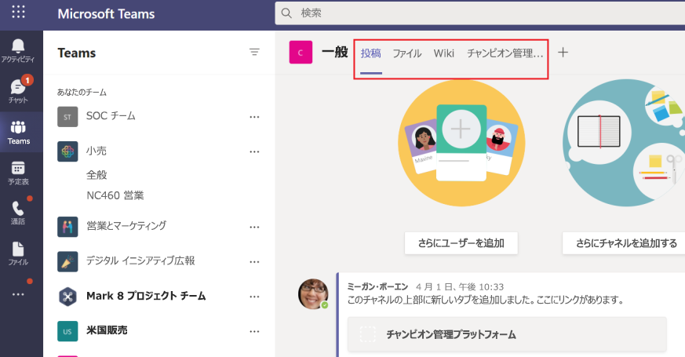

# Microsoft Teams 用のタブの構築

タブとは、Microsoft Teams に組み込まれている Teams 対応 Web ページです。 これらは簡単な HTML <iFrame \> タブで、アプリ マニフェストで宣言されたドメインを指していて、チーム内のチャネル、グループ チャット、または個々のユーザー用の個人用アプリとして追加できます。 アプリにカスタム タブを含めて独自の Web コンテンツを Teams に埋め込んだり、Teams 固有の機能を Web コンテンツに追加したりできます。 詳細については、「[Teams JavaScript クライアント SDK](/javascript/api/overview/msteams-client)」を参照してください。

> [!IMPORTANT]
> 現在、カスタム タブは Government Community Cloud (GCC)、GCC-High、国防総省 (DOD) で使用できます。

次の画像は、個人用タブを示しています:

![[個人] タブ](../assets/images/tabs/personaltab.png)

次の画像は、Contoso チャネル タブを示しています:

タブを操作する前に実行する必要がある前提条件はほとんどありません。

Teams には、個人用タブとチャネル タブ、またはグループ タブの 2 種類があります。 [個人用タブ](~/tabs/how-to/create-personal-tab.md)は、個人を対象としたボットと共に、個人用アプリの一部であり、1 人のユーザーを対象としています。 簡単にアクセスできるように、左側のナビゲーション バーにピン留めすることができます。 [チャネル/グループ タブ](~/tabs/how-to/create-channel-group-tab.md)は、コンテンツをチャネルやグループのチャットに配信します。また、専用の Web ベースのコンテンツまわりに関する共同作業スペースを作成するのに優れた方法です。

[コンテンツ ページの作成](~/tabs/how-to/create-tab-pages/content-page.md)は、個人用タブ、チャネルまたはグループ タブ、またはタスク モジュールの一部として行えます。 [構成ページを作成](~/tabs/how-to/create-tab-pages/configuration-page.md)をすると、ユーザーは Microsoft Teams アプリを構成し、それを使用してチャネルまたはグループのチャット タブ、メッセージング拡張機能、または Office 365 コネクタを構成できます。 インストール後にユーザーがタブを再構成することを許可し、アプリケーションの[タブ削除ページを作成](~/tabs/how-to/create-tab-pages/removal-page.md)できます。 タブを含む Teams アプリをビルドする場合は、[Android と iOS の両方の Teams クライアントでタブが機能する方法](~/tabs/design/tabs-mobile.md)をテストする必要があります。 タブは、基本情報、ロケールとテーマ情報、および `entityId` または タブにあるものを特定する `subEntityId` を通して[コンテンツを取得](~/tabs/how-to/access-teams-context.md)する必要があります。

アダプティブ カードを使用してタブを構築し、ボットとタブに別のバックエンドを必要としなくても、すべての Teams アプリ機能を一元化できます。 [ステージ ビュー](~/tabs/tabs-link-unfurling.md)は、Teams で全画面表示で開き、タブとしてピン留めされたコンテンツをレンダリングできる新しい UI コンポーネントです。既存の ["リンクを張る"](~/tabs/tabs-link-unfurling.md) サービスが更新され、アダプティブ カードとチャット サービスを使用して URL をタブに変換するために使用されます。 タブ全体について話し合うのではなく、特定のタスク、患者、営業案件など、タブ内のサブエンティティに関する会話を行うことができる会話型サブエンティティを使用して[会話タブ](~/tabs/how-to/conversational-tabs.md)を作成できます。[タブ マージン](~/resources/removing-tab-margins.md) に変更を加えると、アプリのビルド時の開発者エクスペリエンスを向上させることができます。 タブをドラッグして目的の位置に配置すると、個人用アプリやチャネルまたはグループ チャット内のタブ位置を交換できます。 

> [!NOTE]
> **投稿** と **ファイル** の位置は移動できません。

## タブ機能

タブ機能は次のとおりです。

* タブがボットも含まれるアプリに追加されると、ボットもチームに追加されます。
* 現在のユーザーの Microsoft Azure Active Directory (Azure AD) ID の認識。
* 言語が `en-us` であることを示すユーザーのロケール認識。
* サポートされている場合、シングル サインオン (SSO) 機能があります。
* ボットやアプリの通知を使用して、タブや、個々の作業項目などのサービス内のサブ エンティティにディープ リンクできます。
* タブ内のリンクからタスク モジュールを開くことができます。
* タブ内で SharePoint Web パーツを再利用できます。

## タブのユーザー シナリオ

**シナリオ:** Teams 内に既存の Web ベース リソースを取得します。 \
**例:** 情報提供企業の Web サイトをユーザーに提供する Teams アプリに [個人] タブを作成します。

**シナリオ:** Teams ボットまたはメッセージング拡張機能にサポート ページを追加します。 \
**例:** 作成する個人タブは **について** と **ヘルプの** を、Web ページ コンテンツをユーザーに提供します。

**シナリオ:** 協力対話と共同作業のためにユーザーが定期的にやり取りするアイテムへのアクセスを提供します。 \
**例:** 個々のアイテムにディープ リンクを設定したチャネルまたはグループ タブを作成します。

## タブのしくみを理解する

次のいずれかの方法を使用してタブを作成できます:

* [アプリ マニフェストのカスタム タブを宣言する](#declare-custom-tab-in-app-manifest)
* [アダプティブ カードを使用してタブをビルドする](~/tabs/how-to/build-adaptive-card-tabs.md)

### アプリ マニフェストでカスタム タブを宣言する

カスタム タブは、アプリ パッケージのアプリ マニフェストで宣言されます。 アプリのタブとして含める Web ページごとに、URL と範囲を定義します。 また、[Teams JavaScript クライアント SDK](/javascript/api/overview/msteams-client) をページに追加して、ページの読み込みが終了したら `microsoftTeams.initialize()` を呼び出す必要があります。 Teams はページを表示し、Teams 固有の情報 (Teams クライアントがダーク テーマを実行している場合など) へのアクセスを提供します。

チャネル/グループ または 個人 スコープ内でタブを表示するかどうかを選択した場合は、タブに <iframe 付き\> HTML [コンテンツ ページ](~/tabs/how-to/create-tab-pages/content-page.md)を表示する必要があります。個人用タブの場合、コンテンツ URL は `staticTabs` 配列内の `contentUrl` プロパティによって Teams アプリのマニフェストに直接設定されます。 タブの内容は、すべてのユーザーに対して同じになります。

チャネル タブまたはグループ タブの場合は、追加の構成ページを作成することもできます。 このページでは、コンテンツ ページの URL を構成できます。通常、URL クエリ文字列パラメーターを使用して、そのコンテキストに適したコンテンツを読み込みます。 これは、チャネル/グループ タブを複数のチームまたはグループ チャットに追加できるためです。 以降にインストールが行われるたびに、ユーザーはタブを構成して、必要に応じてエクスペリエンスを調整することが出来ます。 ユーザーがタブを追加またはタブを構成すると、Teams ユーザー インターフェイス (UI) に表示されているタブに URL が関連付けられます。 タブの構成は、その URL に追加のパラメーターを追加するだけです。 たとえば、Azure Boards タブを追加すると、構成ページで、タブにロードするボードを選択することができます。 構成ページの URL は、アプリ マニフェストの `configurableTabs` 配列の `configurationUrl` プロパティで指定します。

複数のチャネルまたはグループ タブと、アプリごとに最大 16 個の個人用タブを使用できます。

### タブのビルドに使用できるツール
* [Microsoft Visual Studio Code 用 Teams ツールキット](../toolkit/visual-studio-code-overview.md)
* [Visual Studio 用 Teams ツールキット](../toolkit/visual-studio-overview.md)

## 次のステップ

> [!div class="nextstepaction"]
> [前提条件](~/tabs/how-to/tab-requirements.md)

## 関連項目

* [デバイスのアクセス許可を要求する](../concepts/device-capabilities/native-device-permissions.md)
* [メディア機能を統合する](../concepts/device-capabilities/mobile-camera-image-permissions.md)
* [QR の統合またはバーコード スキャナーの統合](../concepts/device-capabilities/qr-barcode-scanner-capability.md)
* [場所機能を統合する](../concepts/device-capabilities/location-capability.md)
* [モバイルのタブ](design/tabs-mobile.md#tabs-on-mobile)
