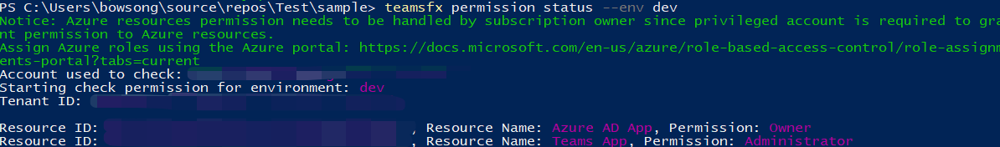

# <a name="teamsfx-library"></a>TeamsFx ライブラリ

Microsoft Teams Framework (TeamsFx) は、共通の機能と統合パターン (Microsoft Identity への簡易アクセスなど) をカプセル化するライブラリです。 構成が 0 の場合は、Microsoft Teamsアプリをビルドできます。

TeamsFx の主な機能の一覧を次に示します。

- **TeamsFx コラボレーション**: 開発者とプロジェクト所有者が TeamsFx プロジェクトに他の共同作業者を招待します。 TeamsFx プロジェクトをデバッグおよび展開するために共同作業できます。

- **TeamsFx CLI**: アプリケーション開発Teams加速します。 また、自動化のためのスクリプトに CLI を統合できる CI/CD シナリオも有効になります。

- **TeamsFx SDK**: TeamsFx ソフトウェア開発キット (SDK) は、主要な TeamsFx コード ライブラリであり、開発者向けのクライアント コードとサーバー側コードの両方に対する単純な認証をカプセル化Teamsです。


## <a name="teamsfx-command-line-interface"></a>TeamsFx コマンド ライン インターフェイス

TeamsFx CLI は、テキスト ベースのコマンド ライン インターフェイスで、アプリケーションの開発Teamsを加速します。 これは、キーボード中心のエクスペリエンスを提供し、アプリケーションを構築Teams目指しています。 また、自動化のためのスクリプトに CLI を統合できる CI/CD シナリオも有効になります。

詳細については、以下を参照してください。
* [ソース コード](https://github.com/OfficeDev/TeamsFx/tree/dev/packages/cli) 
* [パッケージ (NPM)](https://www.npmjs.com/package/@microsoft/teamsfx-cli)

## <a name="get-started"></a>はじめに

使用可能 `teamsfx-cli` なすべてのコマンド `npm` を確認 `teamsfx -h` するには、次のコマンドをインストールして実行します。

```bash
  npm install -g @microsoft/teamsfx-cli
  teamsfx -h
```

## <a name="supported-commands"></a>サポート対象コマンド

| コマンド | 説明 |
|----------------|-------------|
| `teamsfx new`| 新しいアプリケーションTeams作成します。|
| `teamsfx account`| クラウド サービス アカウントを管理します。 サポートされているクラウド サービスは'Azure' と 'Microsoft 365' です。 |
| `teamsfx env` | 環境を管理します。 |
| `teamsfx capability`| 現在のアプリケーションに新しい機能を追加します。|
| `teamsfx resource`  | 現在のアプリケーションのリソースを管理します。|
| `teamsfx provision` | 現在のアプリケーションでクラウド リソースをプロビジョニングします。|
| `teamsfx deploy` | 現在のアプリケーションを展開します。  |
| `teamsfx package` | 発行用Teamsアプリをビルドします。|
| `teamsfx validate` | 現在のアプリケーションを検証します。|
| `teamsfx publish` | アプリを公開して、Teams。|
| `teamsfx preview` | 現在のアプリケーションをプレビューします。 |
| `teamsfx config`  | 構成データを管理します。 |
| `teamsfx permission`| 同じプロジェクト内の他の開発者と共同作業を行います。|

## `teamsfx new`

既定では、対話型`teamsfx new`モードに切り替え、新しいアプリケーションを作成するプロセスをTeamsします。 フラグをに設定して非対話型モードを操作 `--interactive` することもできます `false`。

| `teamsFx new` コマンド | 説明 |
|:----------------  |:-------------|
| `teamsfx new template <template-name>`     | 既存のテンプレートからアプリを作成する |
| `teamsfx new template list`     | 使用可能なすべてのテンプレートを一覧表示する |

### <a name="parameters-for-teamsfx-new"></a>パラメーター `teamsfx new`

| パラメーター | 要件 | 説明 |
|:---------------- |:-------------|:-------------|
|`--app-name` | はい| アプリケーションの名前Teamsします。|
|`--interactive`| いいえ | オプションを対話的に選択します。 オプションと既定値`true``false`はです`true`。|
|`--capabilities`| いいえ| [Teams機能を選択します。複数のオプションは、、`bot`、、 です`tab-spfx``messaging-extension`。`tab` 既定値は `tab` です。|
|`--programming-language`| いいえ| プロジェクトのプログラミング言語。 オプションは、または `javascript` 既定値 `typescript` です `javascript`。|
|`--folder`| いいえ | Projectディレクトリ。 アプリ名を持つサブ フォルダーは、このディレクトリの下に作成されます。 既定値は `./` です。|
|`--spfx-framework-type`| いいえ| 機能が選択 `Tab(SPfx)` されている場合に適用されます。 Frontend Framework。 オプションは、および `none` 、 `react`既定値はです `none`。|
|`--spfx-web part-name`| いいえ | 機能が選択 `Tab(SPfx)` されている場合に適用されます。 既定値は "helloworld" です。|
|`--spfx-web part-desp`| いいえ | 機能が選択 `Tab(SPfx)` されている場合に適用されます。 既定値は "helloworld description" です。 |
|`--azure-resources`| いいえ| 機能が含まれている場合に適用 `tab` されます。 Azure リソースをプロジェクトに追加します。 複数のオプションは (Azure SQL Database `sql` ) と `function` (Azure Functions) です。 |

### <a name="scenarios-for-teamsfx-new"></a>シナリオ `teamsfx new`

対話型モードを使用して、アプリを作成Teamsできます。すべてのパラメーターを制御するシナリオは`teamsfx new`次のとおりです。

#### <a name="tab-app-hosted-on-spfx-using-react"></a>アプリを使用して、SPFxでホストReact

```bash
teamsfx new --interactive false --app-name newspfxapp --capabilities tab-spfx --spfx-framework-type react
```

#### <a name="teams-app-in-javascript-with-tab-bot-capabilities-and-azure-functions"></a>Teams、ボット機能、Azure Functions を使用した JavaScript のアプリの作成

```bash
teamsfx new --interactive false --app-name newtabbotapp --capabilities tab bot --programming-language javascript --azure-resources function
```

#### <a name="teams-tab-app-with-azure-functions-and-azure-sql"></a>Teams関数と Azure 関数を含むタブ アプリSQL

```bash
teamsfx new --interactive false app-name newapp --azure-resources sql function --programming-language typescript
```

## `teamsfx account`

クラウド サービス アカウントを管理します。 サポートされているクラウド サービスは、 です`Azure``Microsoft 365`。

| `teamsFx account` コマンド | 説明 |
|:----------------  |:-------------|
| `teamsfx account login <service>`  | 選択したクラウド サービスにログインします。 |
| `teamsfx account logout <service>`  | 選択したクラウド サービスからログアウトします。 |
| `teamsfx account set --subscription` | アカウント設定を更新してサブスクリプション ID を設定します。 |

## `teamsfx env`

環境を管理します。

| `teamsfx env` コマンド  | 説明 |
|:----------------  |:-------------|
| `teamsfx env add <new_env_name> --env <existing_env_name>` | 指定した環境からコピーして、新しい環境を追加します。 |
| `teamsfx env list` | すべての環境を一覧表示します。 |

### <a name="scenarios-for-teamsfx-env"></a>シナリオ `teamsfx env`

シナリオは次 `teamsfx env` のとおりです。

#### <a name="create-a-new-environment"></a>新しい環境を作成する

既存の開発環境からコピーして新しい環境を追加します。

```bash
teamsfx env add staging --env dev
```

## `teamsfx capability`

現在のアプリケーションに新しい機能を追加します。

| `teamsFx capability` コマンド  | 説明 |
|:----------------  |:-------------|
| `teamsfx capability add tab` | タブを追加する |
| `teamsfx capability add bot` | ボットの追加 |
| `teamsfx capability add messaging-extension`| メッセージング拡張機能の追加 |

> [!NOTE]
> プロジェクトにボットが含まれる場合、メッセージング拡張機能を追加することはできません。また、その逆も適用されます。 新しいアプリ プロジェクトを作成する際に、ボット拡張機能とメッセージング拡張機能の両方をTeamsできます。

## `teamsfx resource`

現在のアプリケーションのリソースを管理します。 サポートされる機能`<resource-type>`は、次`azure-sql``azure-function`のとおりです`azure-apim`。

| `teamsFx resource` コマンド  | 説明 |
|:----------------  |:-------------|
| `teamsfx resource add <resource-type>`      | 現在のアプリケーションにリソースを追加します。|
| `teamsfx resource show <resource-type>`      | リソースの構成の詳細を表示します。 |
| `teamsfx resource list`      | 現在のアプリケーションのすべてのリソースを一覧表示します。 |

### <a name="parameters-for-teamsfx-resource-add-azure-function"></a>パラメーター `teamsfx resource add azure-function`

| パラメーター  | 要件 | 説明 |
|----------------  |-------------|-------------|
|`--function-name`| はい | 関数名を指定します。 既定値は `getuserprofile` です。 |

### <a name="parameters-for-teamsfx-resource-add-azure-sql"></a>パラメーター `teamsfx resource add azure-sql`

#### `--function-name`

| パラメーター  | 要件 | 説明 |
|:----------------  |:-------------|:-------------|
|`--function-name`| はい | 関数名を指定します。 既定値は `getuserprofile` です。 |

> [!NOTE]
> 関数名はサーバーのワークロードSQL検証され、サーバー ワークロードからアクセスする必要があります。 プロジェクトに含まれている場合は、 `Azure Functions`プロジェクトを作成します。

### <a name="parameters-for-teamsfx-resource-add-azure-apim"></a>パラメーター `teamsfx resource add azure-apim`

> [!TIP]
> オプションは、既存のインスタンスを使用しようとするときに有効 `APIM` になります。 既定では、オプションを指定する必要が生じ、手順中に新しいインスタンスが作成 `teamsfx provision` されます。

| パラメーター  | 要件 | 説明 |
|:----------------  |:-------------|:-------------|
|`--subscription`| はい | Azure サブスクリプションの選択|
|`--apim-resource-group`| はい| リソース グループの名前。 |
|`--apim-service-name`| はい | API 管理サービス インスタンスの名前。 |
|`--function-name`| はい | 関数名を指定します。 既定値は `getuserprofile` です。 |

> [!NOTE]
> `Azure API Management` を使用する必要があります `Azure Functions`。 プロジェクトに含めなかった場合は `Azure Functions`、プロジェクトを作成できます。

## `teamsfx provision`

現在のアプリケーションでクラウド リソースをプロビジョニングします。

### <a name="parameters-for-teamsfx-provision"></a>パラメーター `teamsfx provision`

| パラメーター  | 要件 | 説明 |
|:----------------  |:-------------|:-------------|
|`--env`| はい| プロジェクトの環境を選択します。 |
|`--subscription`| いいえ | Azure サブスクリプション ID を指定します。 |
|`--resource-group`| いいえ | 既存のリソース グループの名前を設定します。 |
|`--sql-admin-name`| いいえ | プロジェクトにリソースSQLがある場合に適用されます。 管理者の名前SQL。|
|`--sql-password`| いいえ| プロジェクトにリソースSQLがある場合に適用されます。 管理者パスワードのSQL。|

## `teamsfx deploy`

このコマンドは、現在のアプリケーションを展開するために使用されます。 既定では、プロジェクト全体が展開されますが、部分的に展開できます。 複数のオプションは、 `frontend-hosting`、 `function`、 `apim`、 `teamsbot`です `spfx`。

### <a name="parameters-for-teamsfx-deploy"></a>パラメーター `teamsfx deploy`

| パラメーター  | 要件 | 説明 |
|:----------------  |:-------------|:-------------|
|`--env`| はい| プロジェクトの既存の環境を選択します。 |
|`--open-api-document`| いいえ | プロジェクトに APIM リソースがある場合に適用されます。 開いている API ドキュメント ファイルのパス。 |
|`--api-prefix`| いいえ | プロジェクトに APIM リソースがある場合に適用されます。 API 名のプレフィックス。 API の既定の一意の名前はです `{api-prefix}-{resource-suffix}-{api-version}`。 |
|`--api-version`| いいえ | プロジェクトに APIM リソースがある場合に適用されます。 API のバージョン。 |

## `teamsfx validate`

現在のアプリケーションを検証します。 このコマンドは、アプリケーションのマニフェスト ファイルを検証します。

### <a name="parameters-for-teamsfx-validate"></a>パラメーター `teamsfx validate`

`--env`: プロジェクトの既存の環境を選択します。

## `teamsfx publish`

アプリを公開して、Teams。

### <a name="parameters-for-teamsfx-publish"></a>パラメーター `teamsfx publish`

`--env`: プロジェクトの既存の環境を選択します。

## `teamsfx package`

発行用Teamsアプリをビルドします。

## `teamsfx preview`

ローカルまたはリモートから現在のアプリケーションをプレビューします。

### <a name="parameters-for-teamsfx-preview"></a>パラメーター `teamsfx preview`

| パラメーター  | 要件 | 説明 |
|:----------------  |:-------------|:-------------|
|`--local`| いいえ | ローカルからアプリケーションをプレビューします。 `--local` で排他的です `--remote`。 |
|`--remote`| いいえ | リモートからアプリケーションをプレビューします。 `--remote` で排他的です `--local`。 |
|`--env`| いいえ | パラメーターを追加するときに、プロジェクトの既存の環境 `--remote` を選択します。 |
|`--folder`| いいえ | Projectディレクトリを使用します。 既定値は `./` です。 |
|`--browser`| いいえ | Web クライアントを開Teamsブラウザー。 オプションは、システム`chrome``edge`の既定`default`のブラウザーなどであり、値はです`default`。 |
|`--browser-arg`| いいえ | ブラウザーに渡す引数 (--browser が必要) は、--browser-args="--guest" など、複数回使用できます。 |
|`--sharepoint-site`| いいえ | SharePointのリモート プレビューなど、`{your-tenant-name}.sharepoint.com`SPFx URL を指定します。 |

### <a name="scenarios-for-teamsfx-preview"></a>シナリオ `teamsfx preview`

#### <a name="local-preview"></a>ローカル プレビュー

依存関係:

- Node.js
- .NET SDK
- Azure Functions コア ツール

```bash
teamsfx preview --local
teamsfx preview --local --browser chrome
```

#### <a name="remote-preview"></a>リモート プレビュー

```bash
teamsfx preview --remote
teamsfx preview --remote --browser edge
```

> [!NOTE]
> バックグラウンド サービスのログ (ログなどReactに保存されます`~/.fx/cli-log/local-preview/`。

## `teamsfx config`

構成データは、ユーザー スコープまたはプロジェクト スコープで管理します。

| `teamsfx config` コマンド  | 説明 |
|:----------------  |:-------------|
| `teamsfx config get [option]` | オプションの構成値を表示する |
| `teamsfx config set <option> <value>` | オプションの構成値を更新する |

### <a name="parameters-for-teamsfx-config"></a>パラメーター `teamsfx config`

| パラメーター  | 要件 | 説明 |
|:----------------  |:-------------|:-------------|
|`--env`| はい | プロジェクトの既存の環境を選択します。 |
|`--folder`| いいえ | Projectディレクトリ。 これは、プロジェクト構成の取得または設定に使用されます。 既定値は `./` です。 |
|`--global`| いいえ | 構成の対応。 この値が true の場合、スコープはプロジェクト スコープではなくユーザー スコープに制限されます。 既定値は `false` です。 現在、サポートされているグローバル構成には `telemetry`、 、 、 `validate-dotnet-sdk`が含 `validate-func-core-tools`まれます `validate-node`。 |

### <a name="scenerios-for-teamsfx-config"></a>Scenerios for `teamsfx config`

ファイル内のシークレット `.userdata` は暗号化され `teamsfx config` 、値を表示または更新するのに役立ちます。

#### <a name="stop-sending-telemetry-data"></a>テレメトリ データの送信を停止する

```bash
teamsfx config set telemetry off
```

#### <a name="disable-environment-checker"></a>環境チェッカーを無効にする

既定では、.NET SDK Node.js Azure Functions Core Tools の検証を有効または無効にする構成が 3 つ構成されています。 依存関係の検証が不要で、自分で依存関係をインストールする場合は、構成を "off" に設定できます。 次のガイドを確認します。
* [Node.jsインストール ガイド](https://github.com/OfficeDev/TeamsFx/blob/dev/docs/vscode-extension/envchecker-help.md#how-to-install-nodejs)
* [.NET SDK インストール ガイド](https://github.com/OfficeDev/TeamsFx/blob/dev/docs/vscode-extension/envchecker-help.md#how-to-install-net-sdk) 
* [Azure Functions Core Tools のインストール ガイド](https://github.com/OfficeDev/TeamsFx/blob/dev/docs/vscode-extension/envchecker-help.md#how-to-install-azure-functions-core-tools)。

.NET SDK の検証を無効にするには、次のコマンドを使用します。

```bash
teamsfx config set validate-dotnet-sdk off
```

.NET SDK 検証を有効にするには、次のコマンドを使用します。

```bash
teamsfx config set validate-dotnet-sdk on
```

#### <a name="view-all-the-user-scope-configuration"></a>すべてのユーザー スコープ構成を表示する

```bash
teamsfx config get -g
```

#### <a name="view-all-the-configuration-in-project"></a>プロジェクト内のすべての構成を表示する

シークレットは自動的に復号化されます。

```bash
teamsfx config get --env dev
```

#### <a name="update-the-secret-configuration-in-project"></a>プロジェクトのシークレット構成を更新する

```bash
teamsfx config set fx-resource-aad-app-for-teams.clientSecret xxx --env dev
```

## `teamsfx permission`

TeamsFx CLI には、コラボレーション `teamsFx permission` シナリオ用のコマンドが含まれています。

| `teamsFx permission` command | 説明 |
|:------------------------------|-------------|
| `teamsfx permission grant --env --email` | 指定した環境のプロジェクトMicrosoft 365共同作業者のアカウントに対するアクセス許可を付与します。 |
| `teamsfx permission status` | プロジェクトのアクセス許可の状態を表示する |

### <a name="parameters-for-teamsfx-permission-grant"></a>パラメーター `teamsfx permission grant`

| パラメーター  | 要件 | 説明 |
|:----------------  |:-------------|:-------------|
|`--env`| はい | env 名を指定します。 |
|`--email`| はい | 共同作業者のメール アドレスMicrosoft 365入力します。 共同作業者のアカウントが、作成者と同じテナント内にあることを確認します。 |

### <a name="parameters-for-teamsfx-permission-status"></a>パラメーター `teamsfx permission status`

| パラメーター | 要件 | 説明 |
|:----------------  |:-------------|:-------------|
|`--env`| はい | env 名を指定します。 |
|`--list-all-collaborators` | いいえ | このフラグを使用すると、Teams Toolkit CLI は、このプロジェクトのすべての共同作業者を印刷します。 |

### <a name="scenarios-for-teamsfx-permission"></a>シナリオ `teamsfx permission`

プロジェクトのアクセス許可は `TeamsFx` 次のとおりです。

#### <a name="grant-permission"></a>アクセス許可の付与

Project共同作業者は、コマンドを使用`teamsfx permission grant`して新しい共同作業者をプロジェクトに追加できます。

```bash
teamsfx permission grant --env dev --email user-email@user-tenant.com
```

必要なアクセス許可を受け取った後、プロジェクト作成者と共同作業者は GitHub によってプロジェクトを新しい共同作業者と共有し、新しい共同作業者は Microsoft 365 アカウントのすべてのアクセス許可を持つ可能性があります。

#### <a name="show-permission-status"></a>アクセス許可の状態を表示する

Project作成者と共同作業者は`teamsfx permission status`、コマンドを使用して、特定の env Microsoft 365アカウントのアクセス許可を表示できます。

```bash
teamsfx permission status --env dev
```

#### <a name="list-all-collaborators"></a>すべての共同作業者を一覧表示する

Project作成者と共同作業者は`teamsfx permission status`、コマンドを使用して、特定の env のすべての共同作業者を表示できます。

```bash
teamsfx permission status --env dev --list-all-collaborators
```

#### <a name="e2e-collaboration-work-flow-in-cli"></a>CLI での E2E コラボレーションの作業フロー

プロジェクト作成者として:

- 新しい TeamsFx タブまたはボット プロジェクトを作成し、ホストの種類として [Azure] を選択します。

  ```bash
  teamsfx new --interactive false --app-name newapp --host-type azure
  ```

- アカウントと Azure アカウントMicrosoft 365ログインするには、次の方法を実行します。

  ```bash
  teamsfx account login azure
  teamsfx account login Microsoft 365
  ```

- プロジェクトを準備するには、次の方法を実行します。

  ```bash
  teamsfx provision
  ```

- 共同作業者を表示するには、次の方法を使用します。

  ```bash
  teamsfx permission status --env dev --list-all-collaborators
  ```

  :::image type="content" source="../assets/images/teams-toolkit-v2/teams toolkit fundamentals/permission-status-all-1.png" alt-text="permission-1":::

- 別のアカウントを共同作業者として追加する。 追加されたアカウントが同じテナントの下にあることを確認します。

  ```bash
  teamsfx permission grant --env dev --email user-email@user-tenant.com
  ```

  :::image type="content" source="../assets/images/teams-toolkit-v2/teams toolkit fundamentals/permission-grant-1.png" alt-text="permission":::

- プロジェクトをプロジェクトにプッシュGitHub

共同作業者Project:

- プロジェクトのクローンを作成GitHub。
- アカウントにMicrosoft 365します。 同じアカウントがMicrosoft 365確認します。

  ```bash
  teamsfx account login Microsoft 365
  ```

- すべての Azure リソースに対する共同作成者のアクセス許可を持つ Azure アカウントにログインします。

  ```bash
  teamsfx account login azure
  ```

- アクセス許可の状態を確認します。 プロジェクトの所有者のアクセス許可を持っている必要があります。

  ```bash
  teamsfx permission status --env dev
  ```
  

- タブ コードを更新し、プロジェクトをリモートに展開します。
- リモートを起動すると、プロジェクトはうまく動作します。

## <a name="see-also"></a>関連項目

* [TeamsFx SDK for TypeScript または JavaScript](TeamsFx-SDK.md)
* [複数の環境を管理Teams Toolkit](TeamsFx-multi-env.md)
* [プロジェクトを使用Teams共同作業Teams Toolkit](TeamsFx-collaboration.md)
 